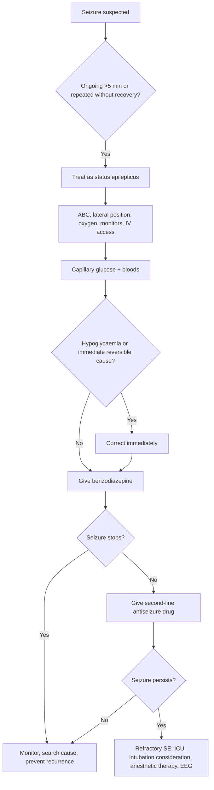
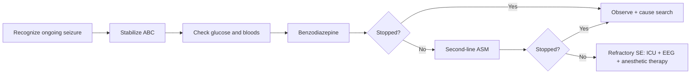

# Recognition and emergency sequence

Related: [[../Neurology MOC|Neurology MOC]] · [[../Epilepsy|Epilepsy]] · [[Status epilepticus]] · [[Benzodiazepine first-line treatment]] · [[Second-line escalation and precipitant search]] · [[Provoked vs unprovoked seizure]]

> [!important]
> In FCPS/MRCP neurology, the first duty is to **recognize status epilepticus early** and start treatment **before prolonged neuronal injury, hypoxia, acidosis, aspiration, and cardiovascular collapse develop**.

> [!tip]
> A high-scoring answer states the emergency sequence clearly: **ABC → glucose/check reversible triggers → benzodiazepine promptly → second-line antiseizure drug → ICU/anesthetic escalation if refractory**.

## Learning Objectives
- Define status epilepticus and explain why modern management starts before the old 30-minute definition.
- Recognize **convulsive** and **non-convulsive** status epilepticus patterns.
- Apply a safe emergency sequence for first 5 minutes, 5-20 minutes, and refractory stages.
- Identify reversible precipitants such as hypoglycaemia, electrolyte disturbance, meningitis/encephalitis, drug withdrawal, and stroke.
- Know red flags requiring ICU escalation and airway protection.

## Definition
**Status epilepticus (SE)** is a prolonged seizure or repeated seizures without return to baseline consciousness between episodes.

Operational emergency concept:
- **Generalized convulsive SE** should be treated as status when seizure activity lasts **>=5 minutes**.
- Ongoing focal impaired-awareness seizure activity beyond **~10 minutes** also needs urgent escalation.
- Traditional 30-minute duration is mainly the point beyond which permanent injury becomes more likely, not a threshold to wait for.

## Relevant Neuroanatomy
- Seizures arise from **hypersynchronous cortical neuronal discharge**.
- Generalized tonic-clonic activity rapidly recruits **bilateral cortical and subcortical networks**.
- Brainstem autonomic and respiratory centers can be secondarily compromised during prolonged convulsive activity.
- Hippocampus, neocortex, cerebellum, and thalamocortical networks are particularly vulnerable to prolonged excitation and metabolic stress.

## Relevant Neurophysiology
- Normal cortex maintains a balance between **excitatory glutamatergic** and **inhibitory GABAergic** transmission.
- In status epilepticus, prolonged firing leads to:
  - failure of inhibitory restraint
  - sustained excitatory neurotransmission
  - increasing metabolic demand
  - systemic hypoxia/acidosis if convulsions continue
- Benzodiazepines enhance **GABA-A receptor** function, so they are first-line emergency therapy.
- Prolonged untreated status becomes harder to terminate because receptor trafficking and network changes reduce drug responsiveness.

## Normal Values / Important Cut-offs
- Treat generalized convulsive seizure as status at **5 minutes**.
- **Refractory SE**: seizure persists despite an adequate benzodiazepine plus one appropriate second-line antiseizure drug.
- **Super-refractory SE**: continues or recurs **>=24 hours** after anesthetic therapy begins or on attempted weaning.
- Check capillary glucose immediately; severe hypoglycaemia is an emergency reversible cause.
- Key emergency labs: sodium, calcium, magnesium, renal function, liver function, blood gas/lactate, toxicology when indicated.

## Classification
### By clinical type
1. **Convulsive status epilepticus**
2. **Non-convulsive status epilepticus**
3. **Focal status epilepticus** with impaired awareness or focal motor features
4. **Myoclonic status** in selected contexts

### By treatment response
1. Early/established SE
2. **Refractory SE**
3. **Super-refractory SE**

## Etiology / Causes
Common causes:
- known epilepsy with poor adherence
- acute withdrawal of antiseizure medicine
- alcohol withdrawal
- hypoglycaemia
- hyponatraemia, hypocalcaemia, uraemia
- CNS infection: meningitis, encephalitis
- acute structural lesion: tumour, trauma, haemorrhage, stroke
- drug/toxin exposure
- autoimmune encephalitis
- eclampsia (special situation)

## Risk Factors
- previous epilepsy
- recent missed medication doses
- acute febrile or infectious illness
- alcohol or benzodiazepine withdrawal
- metabolic disease or renal/hepatic failure
- head injury
- brain tumour or previous major structural lesion
- immunocompromised state with CNS infection risk

## Pathophysiology
1. Initiation of a seizure focus or widespread epileptic discharge
2. Failure of normal inhibitory termination
3. Persistent neuronal firing with rising oxygen/glucose demand
4. Autonomic surge: tachycardia, hypertension, hyperthermia may occur early
5. Late decompensation: hypoxia, acidosis, hypotension, rhabdomyolysis, aspiration, neuronal injury

## Clinical Features
### Convulsive SE clues
- ongoing tonic-clonic movements beyond 5 minutes
- repeated generalized seizures without recovery of consciousness
- lateral tongue bite, cyanosis, laboured breathing, frothing, incontinence
- post-ictal state that never clears because seizure activity recurs

### Non-convulsive SE clues
- persistent unexplained confusion or reduced responsiveness
- eyelid twitching, subtle automatisms, facial jerks
- prolonged post-ictal state out of proportion to a reported seizure
- unexplained coma after convulsive SE termination

### Danger features
- airway compromise
- oxygen desaturation/cyanosis
- trauma
- aspiration
- severe hyperthermia
- persistent coma

## Approach / Algorithm

## Emergency Sequence
### 0-5 minutes: recognition and immediate stabilization
- Call for help.
- Start **airway, breathing, circulation** assessment.
- Protect from injury; do **not** force objects into the mouth.
- Give oxygen if needed.
- Check pulse, BP, SpO2, temperature.
- Obtain IV access.
- Check **capillary glucose immediately**.
- Send labs:
  - FBC
  - U&E including sodium
  - calcium, magnesium
  - glucose
  - renal/liver function
  - ABG/VBG, lactate
  - antiseizure drug levels if relevant
  - toxicology when appropriate
- Consider pregnancy test in women of childbearing age.

### 5-20 minutes: first-line drug therapy
- If glucose low: give dextrose after thiamine when indicated in malnourished/alcohol-dependent patients.
- Give **benzodiazepine** promptly:
  - IV lorazepam if available, or
  - IV diazepam, or
  - buccal/intranasal midazolam if IV unavailable
- Repeat once if the seizure persists according to protocol and drug choice.

### 20-40 minutes: second-line therapy
If seizure continues after adequate benzodiazepine:
- load one appropriate second-line antiseizure drug, commonly:
  - levetiracetam
  - valproate
  - phenytoin/fosphenytoin
- Choice depends on comorbidity, pregnancy potential, liver disease, arrhythmia risk, and local availability.

### Beyond 40 minutes / refractory SE
- ICU involvement urgently
- consider intubation and anesthetic agents
- continuous EEG if available, especially when convulsions stop but consciousness does not recover
- investigate aggressively for structural/infective/autoimmune/metabolic causes

## Investigations
### Immediate bedside and blood work
- capillary glucose
- ECG
- pulse oximetry and blood pressure monitoring
- FBC, CRP if infection suspected
- electrolytes, calcium, magnesium
- renal/liver function
- ABG/VBG, lactate
- toxicology / alcohol level when indicated

### Cause-directed tests after stabilization
- **CT head** if first seizure, focal deficit, trauma, immunocompromised state, persistent altered consciousness, suspected structural lesion
- **MRI brain** later if CT nondiagnostic and structural cause suspected
- **Lumbar puncture** if meningitis/encephalitis suspected and no contraindication after imaging when needed
- **EEG** for suspected non-convulsive SE or unexplained prolonged altered state

## Interpretation Frameworks
### Emergency interpretation framework for ongoing seizure
1. Is this truly ongoing seizure/status or post-ictal recovery?
2. Are there subtle continuing motor signs suggesting persistent seizure?
3. Is there a rapidly reversible cause?
   - glucose
   - sodium
   - calcium
   - toxic withdrawal
4. Is there infection or structural disease?
5. Has first-line therapy been given in time and in adequate dose?
6. Does persistent coma require EEG for non-convulsive SE?

### Bedside localization clues
- generalized tonic-clonic pattern suggests widespread cortical involvement
- focal onset, head version, unilateral jerks, aphasia, or Todd paresis suggest focal cortical onset
- fever or neck stiffness suggests CNS infection

## Diagnosis
Diagnosis is mainly **clinical and time-based**:
- seizure lasting **>5 minutes**, or
- recurrent seizures without recovery between events

Supportive features:
- witnessed convulsive activity
- persistent unresponsiveness
- elevated lactate/CK after generalized convulsions
- EEG evidence in non-convulsive cases

## Differential Diagnosis
- syncope with brief convulsive movements
- psychogenic nonepileptic attack / FND
- rigors
- tremor disorders
- metabolic encephalopathy without seizure
- acute dystonia
- tetany due to hypocalcaemia

## Tables / Comparison Charts
| Feature | Convulsive SE | Non-convulsive SE | Post-ictal state | PNES/FND attack |
|---|---|---|---|---|
| Motor activity | Obvious tonic-clonic or focal jerking | Often subtle or absent | Usually no ongoing ictal activity | May be variable, asynchronous |
| Consciousness | Impaired | Impaired/confused | Gradual recovery | Variable |
| Duration concern | >5 min urgent | Prolonged confusion/coma | Improves over time | Often prolonged but inconsistent |
| EEG | Ictal pattern | Usually essential for confirmation | No ongoing ictal activity | No epileptic ictal pattern |
| Emergency ASM need | Immediate | Often yes | Usually no if truly post-ictal | Avoid inappropriate escalation |

## Management
### Core management goals
- stop seizure quickly
- maintain oxygenation and perfusion
- treat reversible cause
- prevent recurrence and complications

### Drug pathway summary
- **First-line**: benzodiazepine
- **Second-line**: levetiracetam, valproate, or phenytoin/fosphenytoin
- **Refractory**: ICU + anesthetic therapy + EEG-guided care

### Cause-directed management examples
- hypoglycaemia → IV dextrose
- hyponatraemia → careful hypertonic saline when severe/symptomatic
- meningitis/encephalitis → prompt antimicrobials/acyclovir as indicated
- alcohol withdrawal → benzodiazepine-based withdrawal management
- eclampsia → magnesium sulfate and obstetric escalation

## Drug Interactions / Contraindications / Comorbidity Cautions
- **Phenytoin/fosphenytoin**: caution in arrhythmia, hypotension, conduction disease.
- **Valproate**: avoid/caution in significant liver disease, pregnancy, suspected mitochondrial disease.
- **Levetiracetam**: relatively easy to use; dose adjustment may be needed in renal impairment.
- Benzodiazepines can worsen respiratory depression; be ready for airway support.
- Do not delay treatment waiting for perfect drug choice if airway/brain are at risk.

## Procedures / Indications / Contraindications
- **Airway protection / intubation** when refractory seizures, severe hypoxia, poor airway reflexes, recurrent aspiration, or anesthetic therapy is needed.
- **EEG** for persistent altered sensorium after seizures or suspected non-convulsive SE.
- **Lumbar puncture** only after assessing raised ICP/focal deficit risk when CNS infection suspected.

## Procedure Mini-Sections
### Bedside glucose check
- **Indication:** every ongoing seizure/status patient
- **Purpose:** detect rapidly reversible hypoglycaemia
- **Pitfall:** never omit because it is one of the few immediately treatable causes

### EEG in SE
- **Indication:** suspected non-convulsive status or persistent coma after convulsions
- **Limitation:** normal brief routine EEG may miss intermittent activity; prolonged/continuous EEG is better in ICU cases

## Complications
- aspiration pneumonia
- hypoxic brain injury
- severe lactic acidosis
- rhabdomyolysis and AKI
- hyperthermia
- trauma
- arrhythmia
- hypotension after prolonged seizures or medication/anesthetic therapy
- death

## Red Flags / Emergencies
- ongoing seizure >5 minutes
- repeated seizures without full recovery
- persistent low GCS
- neck stiffness/fever suggesting meningitis or encephalitis
- focal deficit or head trauma
- pregnancy-related seizure
- refractory seizure despite benzodiazepine

## Prognosis
Prognosis depends on:
- speed of seizure termination
- underlying cause
- age/comorbidity
- development of refractory SE

Short, promptly treated status has far better outcome than prolonged refractory status from acute brain insult or infection.

## Topic Correlation
- [[Status epilepticus]]
- [[Benzodiazepine first-line treatment]]
- [[Second-line escalation and precipitant search]]
- [[Provoked vs unprovoked seizure]]
- [[Meningitis/Bacterial meningitis|Bacterial meningitis]]
- [[Parenchymal Viral Infections/Herpes simplex encephalitis|Herpes simplex encephalitis]]

## Special Situations
- **Pregnancy/eclampsia:** think magnesium sulfate and obstetric emergency pathway.
- **Alcohol dependence:** consider withdrawal, give thiamine if indicated.
- **Renal failure:** metabolic triggers and levetiracetam dose adjustment.
- **Immunocompromised patient:** low threshold for CNS infection work-up.

## FCPS/MRCP High-Yield Points
- The operational treatment threshold for convulsive SE is **5 minutes**.
- Always mention **ABC + glucose** before drug details.
- A patient may appear post-ictal but actually have **non-convulsive SE**.
- Prolonged status becomes harder to terminate with time.
- Treat the cause, not only the seizure.

## Common Viva Questions
- Define status epilepticus.
- Why do we not wait 30 minutes before treatment?
- What are the immediate bedside steps in a patient fitting for 7 minutes?
- Name first-line and second-line drugs.
- When do you suspect non-convulsive status?
- What complications must you actively prevent?

## Common Confusions / Exam Traps
- Confusing a recurrent seizure cluster with recovery between events; lack of recovery means status.
- Forgetting glucose check.
- Giving repeated benzodiazepines without planning airway support.
- Missing meningitis/encephalitis, alcohol withdrawal, or electrolyte disturbance.
- Assuming seizure stopped because jerking stopped despite persistent coma.

## Mnemonics
- **SE emergency memory:** **A-B-C-G-B-S-I**
  - **A**irway
  - **B**reathing
  - **C**irculation
  - **G**lucose
  - **B**enzodiazepine
  - **S**econd-line antiseizure drug
  - **I**CU if refractory

## Mind Map
- Status epilepticus
  - Recognition
    - >5 min seizure
    - repeated seizures without recovery
    - subtle persistent confusion = possible NCSE
  - Immediate care
    - ABC
    - oxygen
    - IV access
    - glucose
  - Causes
    - missed ASM
    - infection
    - metabolic
    - withdrawal
    - structural lesion
  - Treatment
    - benzodiazepine
    - second-line drug
    - ICU/anesthesia
  - Complications
    - hypoxia
    - aspiration
    - acidosis
    - brain injury

## Flowchart

## Suggested Visuals / Image Notes
- Emergency SE treatment timeline diagram
- GABA vs glutamate balance schematic
- Flowchart for refractory status escalation

## Suggested Video References
- Look for: “status epilepticus emergency management algorithm”
- Look for: “non-convulsive status epilepticus EEG overview”
- Look for: “first seizure and status epilepticus FCPS MRCP review”

## One-Page Revision Summary
- **SE = seizure >5 min or repeated seizures without recovery.**
- First priorities: **ABC, oxygen, IV access, glucose, bloods**.
- Immediate reversible causes: **hypoglycaemia, electrolytes, toxins/withdrawal**.
- First-line: **benzodiazepine**.
- If ongoing: **second-line antiseizure drug**.
- If still ongoing: **refractory SE → ICU, airway, anesthetic therapy, EEG**.
- Always think: infection, structural lesion, missed ASM, alcohol withdrawal.
- Complications: aspiration, hypoxia, acidosis, rhabdomyolysis, brain injury.

## 24-Hour Recall Prompts
- Define SE using the modern operational approach.
- List the first 6 actions in the emergency sequence.
- What are 5 common reversible causes?
- When do you suspect non-convulsive SE?
- Name three complications of prolonged status.

## 7-Day / 15-Day / 30-Day Revision Tracker
- **Day 1:** Reproduce SE algorithm from memory.
- **Day 7:** Compare convulsive vs non-convulsive SE.
- **Day 15:** Write first-line and second-line drugs plus cautions.
- **Day 30:** Solve one seizure emergency SBA set without notes.

## Must Know / Should Know / Nice to Know
### Must Know
- definition and 5-minute threshold
- ABC and glucose
- first-line and second-line sequence
- refractory SE concept
- common causes and complications

### Should Know
- non-convulsive SE recognition
- comorbidity-based drug cautions
- EEG role

### Nice to Know
- receptor trafficking explanation for treatment resistance
- super-refractory SE terminology

## My Weak Points
- Can I state the sequence without missing glucose?
- Can I distinguish status from post-ictal confusion?
- Do I remember when to escalate to ICU?

## Self-Test Scorecard
- Definition and timing: __/10
- Emergency sequence recall: __/10
- Causes and differentials: __/10
- Drug cautions: __/10
- Viva confidence: __/10

## Exam Answer Modes
- **Long answer:** definition, causes, emergency sequence, drugs, complications.
- **Short note:** recognition and immediate management of SE.
- **Viva:** “Patient has been fitting for 8 minutes. What will you do now?”

## Summary
Recognition and emergency sequence in status epilepticus is a **time-critical neurological emergency skill**. The candidate must rapidly identify **ongoing seizure activity**, begin **ABC resuscitation**, check **glucose and reversible causes**, give **benzodiazepine early**, then escalate to a **second-line antiseizure drug** and ICU/anesthetic support if refractory.

## MCQs (10)
1. A generalized tonic-clonic seizure should usually be treated as status epilepticus when it lasts more than:
   - A. 1 minute
   - B. 3 minutes
   - C. 5 minutes
   - D. 15 minutes
   - E. 30 minutes

2. The most immediate reversible bedside cause to exclude in ongoing seizure is:
   - A. Hypoglycaemia
   - B. Hyperlipidaemia
   - C. Hyperuricaemia
   - D. Anaemia
   - E. Hypothyroidism

3. First-line emergency drug class in convulsive status epilepticus is:
   - A. Beta-blocker
   - B. Benzodiazepine
   - C. Antipsychotic
   - D. Opioid
   - E. Corticosteroid

4. Refractory status epilepticus means seizure persistence despite:
   - A. Two oral antiseizure drugs at home
   - B. One benzodiazepine only
   - C. Adequate benzodiazepine plus one appropriate second-line drug
   - D. One CT scan
   - E. One normal EEG

5. A patient remains unresponsive after cessation of jerking. The next important consideration is:
   - A. Discharge home
   - B. Non-convulsive status epilepticus
   - C. Migraine aura
   - D. Benign syncope
   - E. Essential tremor

6. Which is a common precipitant of status epilepticus?
   - A. Hyperthyroidism alone
   - B. Missed antiseizure medication
   - C. Isolated hypercholesterolaemia
   - D. Mild constipation
   - E. Vitiligo

7. Which investigation is particularly valuable in suspected non-convulsive status epilepticus?
   - A. Spirometry
   - B. EEG
   - C. Echocardiography
   - D. Colonoscopy
   - E. Audiometry

8. Which complication is associated with prolonged convulsive status epilepticus?
   - A. Aspiration
   - B. Cataract
   - C. Hyperopia
   - D. Alopecia
   - E. Varicocele

9. In suspected CNS infection causing status epilepticus, a key additional step is:
   - A. Delay all therapy until LP
   - B. Ignore fever
   - C. Evaluate urgently for meningitis/encephalitis
   - D. Treat only with analgesia
   - E. Avoid imaging permanently

10. The best initial management priority in an actively convulsing patient is:
   - A. Detailed family history
   - B. ABC stabilization
   - C. Outpatient MRI booking
   - D. Sleep diary
   - E. Elective nerve conduction study

## SBA Questions (10)
1. A 24-year-old man has had generalized jerking for 7 minutes in the emergency room. He is cyanosed and unresponsive. What is the best immediate next step?
   - A. Wait 20 minutes because many seizures stop spontaneously
   - B. Start ABC resuscitation, oxygen, glucose check, and treat as status epilepticus
   - C. Book outpatient EEG
   - D. Perform lumbar puncture immediately before treatment
   - E. Give oral levetiracetam

2. A known epileptic patient is brought in after three generalized seizures with no recovery between them. Which diagnosis best fits?
   - A. Migraine with aura
   - B. Psychogenic nonepileptic attack only
   - C. Status epilepticus
   - D. Vasovagal syncope
   - E. Narcolepsy

3. A patient stops convulsing after benzodiazepine but remains deeply unresponsive for an hour. Which investigation is most important now?
   - A. Audiogram
   - B. EEG
   - C. Spirometry
   - D. Colonoscopy
   - E. Bone scan

4. A 55-year-old man with alcohol dependence presents with status epilepticus. Alongside seizure treatment, what reversible precipitant must be considered strongly?
   - A. Hyperparathyroidism
   - B. Alcohol withdrawal
   - C. Gout
   - D. Glaucoma
   - E. Osteomalacia

5. A woman with ongoing convulsions has a capillary glucose of 1.9 mmol/L. What is the most important additional immediate action?
   - A. Reassure and observe
   - B. Correct hypoglycaemia urgently
   - C. Give only aspirin
   - D. Delay treatment until CT is complete
   - E. Send home once shaking stops

6. A patient has persistent convulsions despite appropriate benzodiazepine and levetiracetam loading. What is the best next level of care?
   - A. ENT clinic
   - B. Dermatology ward
   - C. ICU escalation for refractory SE management
   - D. Discharge with advice
   - E. Only oral hydration

7. Which feature most strongly suggests non-convulsive status epilepticus rather than a simple post-ictal state?
   - A. Gradual recovery of orientation
   - B. Persistent unexplained confusion with subtle twitching
   - C. Normal sleep at home last night
   - D. Isolated headache
   - E. Controlled BP

8. Which of the following is the best statement about status epilepticus management?
   - A. Wait for 30 minutes before any drug therapy
   - B. Brain injury risk increases with prolonged untreated seizures
   - C. Glucose check is optional
   - D. EEG has no role after convulsions stop
   - E. Infection is rarely relevant

9. A patient with fever, neck stiffness, and status epilepticus arrives. What should be part of the working differential?
   - A. BPPV
   - B. Meningitis/encephalitis
   - C. Tension headache only
   - D. Myopia
   - E. Sciatica

10. Which answer best summarizes first-line pharmacologic treatment of convulsive SE?
   - A. Immediate benzodiazepine
   - B. Oral carbamazepine after 24 hours
   - C. IV antibiotic alone
   - D. Dopamine agonist
   - E. Acetazolamide

## Flashcards
- Q: When should a generalized tonic-clonic seizure usually be treated as status epilepticus?
  A: At 5 minutes or more, or recurrent seizures without recovery.
- Q: What are the first three priorities in SE?
  A: Airway, breathing, circulation.
- Q: Which bedside test must never be forgotten?
  A: Capillary blood glucose.
- Q: What is the first-line drug class in convulsive SE?
  A: Benzodiazepines.
- Q: What defines refractory status epilepticus?
  A: Persistence after adequate benzodiazepine plus one second-line antiseizure drug.
- Q: What investigation is key in suspected non-convulsive SE?
  A: EEG.
- Q: Name a common precipitant of SE in a known epileptic.
  A: Missed antiseizure medication doses.
- Q: Name two dangerous systemic complications of prolonged SE.
  A: Aspiration and lactic acidosis/hypoxia.
- Q: What infectious causes should always be considered in febrile SE?
  A: Meningitis and encephalitis.
- Q: When is ICU escalation required?
  A: In refractory status epilepticus or when airway/anesthetic support is needed.

## Answer Key with Explanations
### MCQs
1. **C** — 5 minutes is the operational emergency threshold for convulsive SE.
2. **A** — hypoglycaemia is rapidly reversible and must be checked immediately.
3. **B** — benzodiazepines are first-line due to rapid GABAergic enhancement.
4. **C** — that is the practical definition of refractory SE.
5. **B** — persistent coma may mean non-convulsive SE.
6. **B** — missed ASM is a common precipitant.
7. **B** — EEG is essential for suspected NCSE.
8. **A** — aspiration is a common serious complication.
9. **C** — CNS infection is a major cause and must be sought urgently.
10. **B** — stabilization of ABC always comes first.

### SBAs
1. **B** — immediate ABC plus glucose and early SE treatment is correct.
2. **C** — repeated seizures without recovery = status epilepticus.
3. **B** — persistent unresponsiveness needs EEG to exclude NCSE.
4. **B** — alcohol withdrawal is a classic precipitant.
5. **B** — severe hypoglycaemia must be corrected urgently.
6. **C** — this is refractory SE and requires ICU-level escalation.
7. **B** — persistent confusion with subtle twitching is a classic clue to NCSE.
8. **B** — seizure duration strongly affects outcome and treatment response.
9. **B** — fever + meningism + seizures strongly suggests CNS infection.
10. **A** — prompt benzodiazepine is first-line pharmacologic therapy.
