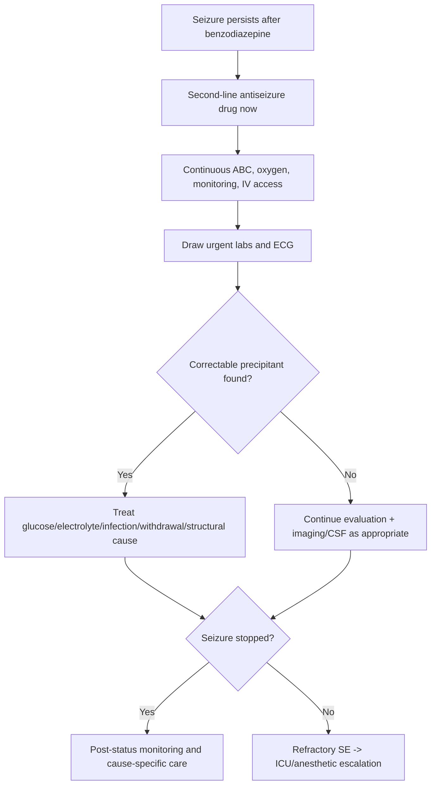

# Second-line escalation and precipitant search

Related: [[../Neurology MOC|Neurology MOC]] · [[../Epilepsy|Epilepsy]] · [[Status epilepticus]] · [[Recognition and emergency sequence]] · [[Benzodiazepine first-line treatment]] · [[History, witness account, labs, ECG, neuroimaging, and EEG]]

> [!important]
> If convulsive seizure activity continues after adequate benzodiazepine treatment, the patient has entered **established status epilepticus** and requires immediate **second-line antiseizure therapy plus parallel search for the precipitating cause**.

> [!tip]
> In FCPS/MRCP answers, candidates score well by saying: **“After ABC and benzodiazepine, escalate promptly to a second-line antiseizure medication, monitor cardiorespiratory status, and simultaneously search for reversible precipitants such as hypoglycaemia, hyponatraemia, CNS infection, stroke, drug withdrawal, and toxic/metabolic disturbance.”**

## Learning Objectives
- Define the role of second-line therapy in status epilepticus.
- Know common second-line agents and practical principles behind their selection.
- Recognize **refractory** and **super-refractory** status epilepticus.
- Perform a structured precipitant search while emergency treatment is ongoing.
- Identify red flags requiring ICU and anesthetic escalation.

## Definition
**Second-line escalation** refers to treatment given when seizure activity continues after an adequate first-line benzodiazepine dose. The goal is to prevent progression to **refractory status epilepticus**, systemic collapse, and permanent neuronal injury.

**Precipitant search** means urgent assessment for the underlying trigger, because uncontrolled status often continues until the cause is corrected.

## Relevant Neuroanatomy
- Status epilepticus is usually driven by widespread cortical network hyperexcitability.
- Secondary injury involves cortex, hippocampus, thalamocortical circuits, and systemic brainstem respiratory/autonomic stress.
- Structural precipitants may arise from cortex, meninges, diffuse encephalitic processes, or intracranial mass effect.

## Relevant Neurophysiology
- Benzodiazepines enhance GABA-A transmission but may fail as status persists.
- Prolonged seizures reduce inhibitory responsiveness and increase excitatory drive.
- Second-line agents work through different mechanisms:
  - sodium-channel modulation
  - synaptic vesicle modulation
  - glutamate/gaba balance effects
- Ongoing seizures worsen acidosis, hyperthermia, rhabdomyolysis, hypoxia, and autonomic instability.

## Normal Values / Important Cut-offs
- Treat generalized convulsive seizure as status at **>=5 minutes**.
- **Established status:** ongoing after first-line benzodiazepine phase and requiring second-line therapy.
- **Refractory status epilepticus (RSE):** persists despite adequate benzodiazepine plus one appropriate second-line drug.
- **Super-refractory SE:** persists or recurs **>=24 hours** after anesthetic therapy has begun.
- Immediate bedside checks: **glucose**, oxygen saturation, blood pressure, temperature, ECG rhythm.

## Classification
### By treatment stage
1. impending/early status
2. established status
3. refractory status epilepticus
4. super-refractory status epilepticus

### By precipitant type
1. acute structural
2. infectious/inflammatory
3. metabolic/toxic
4. withdrawal/non-adherence
5. chronic epilepsy-related with breakthrough trigger

## Etiology / Causes
### Common precipitants to search actively
- missed antiseizure medication
- alcohol withdrawal
- benzodiazepine withdrawal
- hypoglycaemia
- hyponatraemia
- hypocalcaemia/hypomagnesaemia
- uraemia
- hepatic failure
- meningitis or encephalitis
- brain tumour or abscess
- trauma or intracranial bleed
- autoimmune encephalitis
- eclampsia
- drug overdose or toxin exposure

## Risk Factors
- known epilepsy with poor adherence
- recent infection or fever
- immunosuppression
- renal or hepatic dysfunction
- alcohol dependence
- recent medication changes
- intracranial pathology
- pregnancy with hypertension or seizures

## Pathophysiology
1. persistent epileptic discharge continues after first-line treatment
2. inhibitory mechanisms fail progressively
3. excitotoxicity and metabolic demand rise
4. secondary systemic complications worsen cerebral injury
5. unless a precipitant is identified and treated, seizures may remain refractory

## Clinical Features
### Ongoing status despite first-line therapy
- continued convulsions
- repeated seizures without return to baseline
- persistent coma or non-convulsive status concern after apparent motor cessation
- acidosis, hypoxia, hyperthermia, tachycardia

### Clues to specific precipitants
#### Infection
- fever
- meningism
- immunocompromise
- rash
- altered behavior preceding seizure

#### Metabolic cause
- dehydration
- CKD or liver disease
- vomiting/diarrhea
- missed meals/diabetes medication use
- generalized encephalopathy

#### Withdrawal/toxin
- tremor, agitation, autonomic overactivity
- history of alcohol or sedative dependence
- overdose clues, pupils, toxidrome pattern

#### Structural cause
- recent head trauma
- focal deficit
- papilloedema or raised ICP clues
- known malignancy

## Approach / Algorithm

## Investigations
### Immediate bedside/urgent investigations
- capillary glucose
- ECG
- blood gas/lactate
- CBC
- sodium, potassium, calcium, magnesium
- renal function, liver function
- ASM drug levels where relevant and available
- toxicology if indicated

### Infection-focused workup
- CRP/ESR if useful
- blood cultures
- chest/urine tests if systemic infection source suspected
- lumbar puncture **only when safe** and after imaging if indicated

### Structural workup
- urgent CT head in emergency setting
- MRI brain when feasible and helpful
- neuroimaging if focal signs, trauma, immunocompromise, persistent unexplained status

### Ongoing seizure or unexplained coma
- EEG/continuous EEG when available to assess non-convulsive status

## Interpretation Frameworks

## Interpretation Framework 1: What to ask while status is being treated
| Domain | Questions |
|---|---|
| Drugs | Missed ASM? overdose? alcohol/benzodiazepine withdrawal? |
| Metabolic | Glucose? sodium? calcium? magnesium? renal/hepatic failure? |
| Infection | Fever? meningism? immunosuppression? behavior change? |
| Structural | Trauma? focal deficit? malignancy? raised ICP clues? |
| Special | Pregnancy/eclampsia? autoimmune encephalitis clues? |

## Interpretation Framework 2: Common labs and their implications
| Result | Implication |
|---|---|
| Low glucose | immediate correction needed; may be the main driver |
| Low sodium | classic provoked seizure cause; correct carefully |
| Low calcium/magnesium | may sustain seizures |
| High urea/creatinine | uremic provocation or reduced drug clearance |
| LFT/ammonia abnormalities | hepatic encephalopathy / drug handling issues |
| Severe acidosis | prolonged convulsive activity/systemic stress |

## Interpretation Framework 3: When to suspect refractory/non-convulsive status
| Situation | Concern |
|---|---|
| Motor convulsions stop but patient remains unresponsive | non-convulsive status possible |
| Recurrent seizures despite benzodiazepine + second-line therapy | refractory SE |
| Need for repeated airway support and sedation | ICU/anesthetic pathway |

## Diagnosis
This is a **management-stage diagnosis** within status epilepticus:
- established status requiring second-line therapy
- refractory status if seizure continues beyond adequate second-line treatment
- precipitant-specific diagnosis such as **hyponatraemic status**, **HSV encephalitis-related status**, or **withdrawal-related status** should be sought and stated when supported

## Differential Diagnosis
- psychogenic non-epileptic attacks (especially if atypical prolonged motor activity without physiological disturbance)
- post-ictal unresponsiveness vs non-convulsive status
- toxic delirium/agitated encephalopathy
- severe syncope with recovery confusion rarely causing diagnostic uncertainty initially

## Tables / Comparison Charts

## Common Second-Line Agents: Principles Table
| Drug | Practical role | Pearls / cautions |
|---|---|---|
| Levetiracetam | Common broad second-line option | Relatively easy to use; dose-adjust in renal dysfunction |
| Sodium valproate | Useful broad-spectrum option | Avoid/caution in severe liver disease, pregnancy depending context, hyperammonemia risk |
| Phenytoin/fosphenytoin | Traditional second-line option | Cardiac monitoring needed; arrhythmia/hypotension cautions; interaction-heavy |
| Phenobarbital | Alternative/escalation option | Sedation and respiratory depression concerns |

> [!note]
> Exact local protocols vary. In exams, emphasize the principle: **give a protocol-appropriate second-line antiseizure drug promptly with monitoring**.

## Precipitant Search Quick Table
| Trigger class | Typical clues | Key first actions |
|---|---|---|
| Missed ASM/withdrawal | poor adherence, alcohol/sedative withdrawal | confirm history, correct withdrawal state, restart/bridge therapy |
| Metabolic | CKD, liver disease, vomiting, diabetes | urgent labs and correction |
| Infection | fever, meningism, altered behavior | cultures, antimicrobials if indicated, imaging/LP when safe |
| Structural | trauma, focal deficit, cancer | urgent neuroimaging |
| Pregnancy/eclampsia | pregnant/postpartum, hypertension | obstetric-critical care pathway, magnesium as indicated |

## Management
### Step 1: Do not delay second-line therapy
If the patient has already received an adequate benzodiazepine and seizures continue, move immediately to a protocol-appropriate second-line drug.

### Step 2: Continuous supportive care
- airway and oxygenation
- suction if needed
- secure IV access
- cardiorespiratory monitoring
- temperature control
- check for rhabdomyolysis and aspiration consequences later as needed

### Step 3: Search and treat the cause in parallel
Examples:
- dextrose for hypoglycaemia
- cautious correction of hyponatraemia and other electrolytes
- antimicrobials/antivirals when CNS infection strongly suspected
- pregnancy-specific management for eclampsia
- treat alcohol/benzodiazepine withdrawal appropriately

### Step 4: Escalate if refractory
If seizures continue despite appropriate second-line treatment:
- ICU involvement
- continuous EEG if available
- anesthetic therapy pathway under critical care
- investigate aggressively for occult trigger

## Drug Interactions / Contraindications / Comorbidity Cautions
- **Phenytoin/fosphenytoin:** caution in conduction disease, hypotension risk with infusion, many drug interactions.
- **Valproate:** avoid/caution in significant liver disease, pancreatitis history, hyperammonemia risk, pregnancy concerns.
- **Levetiracetam:** generally simpler interaction profile; adjust for renal dysfunction.
- **Phenobarbital:** respiratory depression and hypotension/sedation concerns.
- Polytherapy increases ICU-level monitoring needs.
- Renal/hepatic failure affects drug clearance and precipitant interpretation.

## Procedures / Indications / Contraindications
### Intubation and ICU transfer
**Indications:**
- refractory convulsive status
- inability to protect airway
- hypoxia or severe acidosis
- need for anesthetic infusion

### Lumbar puncture
**Indication:** suspected CNS infection/encephalitis after stabilization and when safe.

**Contraindications/cautions:**
- cardiorespiratory instability
- raised ICP/mass effect concerns before imaging
- severe coagulopathy

## Procedure Mini-Sections
### Continuous EEG
- **Indication:** persistent unresponsiveness after convulsions stop, refractory SE
- **Use:** detects non-convulsive status and guides anesthetic weaning
- **Pearl:** apparent cessation of shaking does not guarantee seizure termination

### CT head
- **Indication:** unexplained status, trauma, focal deficits, immunocompromised patient, concern for bleed/mass effect
- **Pitfall:** imaging must not delay emergency antiseizure treatment

## Complications
- refractory or super-refractory status
- aspiration pneumonia
- hypoxic brain injury
- rhabdomyolysis and AKI
- hypotension, arrhythmias, drug toxicity
- missed CNS infection or structural lesion

## Red Flags / Emergencies
- seizures persisting after benzodiazepine
- persistent coma after visible convulsions stop
- fever/meningism/immunocompromise
- focal deficit or raised ICP signs
- major electrolyte/glucose abnormality
- pregnancy with seizures
- repeated or worsening hemodynamic instability

## Prognosis
Prognosis depends heavily on:
- speed of seizure termination
- underlying cause
- age/comorbidity
- development of refractory status

Treatable precipitants such as hypoglycaemia or medication omission have better outlook than large structural or severe encephalitic causes.

## Topic Correlation
- [[Recognition and emergency sequence]]
- [[Benzodiazepine first-line treatment]]
- [[Provoked vs unprovoked seizure]]
- [[CSF pattern interpretation in meningitis]]
- [[When CT is first-line in emergency neurology]]

## Special Situations
### Pregnancy / eclampsia
Do not frame all pregnancy-related seizures as epilepsy. Eclampsia must be considered and treated urgently.

### Renal failure
Drug accumulation and electrolyte disturbances are common; levetiracetam dosing needs adjustment.

### Liver disease
Valproate may be a poor choice; hepatic encephalopathy may be the precipitant.

### Immunocompromised host
Low threshold for CNS infection imaging and LP planning once safe.

## FCPS/MRCP High-Yield Points
- Second-line therapy should not be delayed after adequate benzodiazepine failure.
- Search for the cause while treating; do not sequence them as separate later tasks.
- Persistent coma after convulsions may represent non-convulsive status.
- ECG, glucose, electrolytes, renal/liver function are core early investigations.
- Refractory status requires ICU/anesthetic escalation.

## Common Viva Questions
- What do you do if status epilepticus does not stop after benzodiazepine?
- Which second-line agents are commonly used?
- What precipitants should be searched for urgently?
- How do you define refractory status epilepticus?
- When would you request EEG in status?

## Common Confusions / Exam Traps
- waiting too long after benzodiazepine before escalating
- forgetting ECG and glucose
- treating seizures without correcting hyponatraemia/hypoglycaemia
- assuming the patient is merely post-ictal when they may be in non-convulsive status
- overlooking infection or eclampsia in the right context

## Mnemonics
### Precipitant search
**“GLUCOSE FIT”**
- **G**lucose
- **L**abs for electrolytes
- **U**remia / hepatic dysfunction
- **C**NS infection
- **O**verdose / withdrawal
- **S**tructural lesion
- **E**CG / cardiac assessment
- **F**ever / focal deficit
- **I**maging
- **T**oxicology / pregnancy test if relevant

## Mind Map
- Ongoing status after benzodiazepine
  - second-line ASM now
  - supportive care
  - precipitant search
    - glucose/electrolytes
    - infection
    - structural
    - withdrawal/non-adherence
    - pregnancy
  - if not controlled
    - refractory SE
    - ICU
    - continuous EEG
    - anesthetic therapy

## Suggested Visuals / Image Notes
- Escalation ladder from benzodiazepine to second-line to ICU/anesthetic therapy
- Table of second-line agents with major cautions
- Parallel workup chart for precipitant search

## Suggested Video References
- Emergency neurology status epilepticus treatment protocols
- EEG in non-convulsive status teaching sessions
- Acute seizure escalation simulation videos

## One-Page Revision Summary
### After first-line failure
1. Confirm adequate benzodiazepine was given.
2. Give protocol-appropriate **second-line ASM immediately**.
3. Continue airway/oxygen/monitoring.
4. Check glucose, ECG, electrolytes, renal/liver function, blood gas.
5. Search for infection, withdrawal, structural lesion, pregnancy-related causes.
6. If still seizing → **refractory SE** → ICU/anesthetic pathway.

### Common reversible precipitants
- hypoglycaemia
- hyponatraemia
- hypocalcaemia/hypomagnesaemia
- missed ASM
- alcohol/benzodiazepine withdrawal
- meningitis/encephalitis

## Recall Prompts
### 24-hour recall prompts
- Define refractory status epilepticus.
- What are the common second-line agents?
- Which labs must be sent urgently in established SE?
- What clues suggest CNS infection as precipitant?
- Why might a patient remain unresponsive after convulsions stop?

### 7-day / 15-day / 30-day revision tracker
- **7 days:** explain the escalation ladder without notes.
- **15 days:** list 10 precipitants from memory.
- **30 days:** answer a full viva on status escalation and refractory definitions.

## Must Know / Should Know / Nice to Know
### Must Know
- second-line therapy after benzodiazepine failure
- core precipitants and urgent labs
- refractory status definition
- ICU escalation principles

### Should Know
- major cautions of common second-line drugs
- role of EEG in persistent coma
- pregnancy and liver/renal special considerations

### Nice to Know
- advanced super-refractory protocols and immunotherapy nuances

## My Weak Points
- Do I delay second-line treatment mentally?
- Can I list reversible precipitants quickly?
- Do I remember that “post-ictal” may hide non-convulsive status?

## Self-Test Scorecard
- Emergency sequence /10
- Drug escalation knowledge /10
- Precipitant search /10
- ICU red-flag recognition /10
- Viva confidence /10

Interpretation:
- **<35/50** = weak
- **35-44/50** = acceptable
- **45+/50** = strong

## Exam Answer Modes
### Short note
Write the management of status after benzodiazepine failure and list precipitant search points.

### Viva mode
Speak in parallel steps: escalation drug, monitoring, precipitant search, ICU threshold.

### Ward-case mode
State the exact emergency stage and whether the patient is established or refractory SE.

## Summary
Second-line escalation in status epilepticus should be immediate after benzodiazepine failure, with simultaneous precipitant search. The clinician must think in parallel: **terminate the seizure, support the patient, identify the cause, and escalate to ICU if refractory**.

## MCQs (10)
1. A patient continues to convulse after adequate benzodiazepine therapy. The next best step is:
   - A. Wait 30 minutes
   - B. Immediate second-line antiseizure therapy
   - C. Send home after recovery
   - D. Start outpatient EEG only
   - E. Perform lumbar puncture before further treatment

2. Which is a classic reversible precipitant of status epilepticus?
   - A. Hypercholesterolemia
   - B. Hyponatraemia
   - C. Mild anemia
   - D. Osteoarthritis
   - E. Seasonal allergy

3. Refractory status epilepticus means seizure activity persists despite:
   - A. Observation alone
   - B. Adequate benzodiazepine plus one appropriate second-line drug
   - C. Only one small benzodiazepine dose
   - D. CT scan
   - E. A normal EEG

4. Persistent coma after convulsions stop should raise concern for:
   - A. Guaranteed full recovery already
   - B. Non-convulsive status epilepticus
   - C. Ménière disease
   - D. Bell palsy
   - E. Tension headache

5. Which investigation should be obtained urgently in established status?
   - A. Audiogram
   - B. Capillary glucose
   - C. Colonoscopy
   - D. Spirometry
   - E. Temporal artery biopsy

6. Which drug choice needs caution in significant liver disease?
   - A. Sodium valproate
   - B. Glucose
   - C. Oxygen
   - D. Saline only
   - E. Paracetamol

7. Which statement is most correct?
   - A. Search for the precipitant only after all seizures have stopped
   - B. Structural causes are never relevant in status
   - C. Precipitant search should occur in parallel with treatment
   - D. ECG is optional in all cases
   - E. Pregnancy-related seizures are always epilepsy

8. Which scenario most strongly suggests an infectious precipitant?
   - A. Fever, altered behavior, and neck stiffness
   - B. Positional vertigo only
   - C. Wrist drop
   - D. Chronic low back pain alone
   - E. Dry eyes only

9. ICU escalation is especially needed when:
   - A. Seizures stop promptly and patient wakes normally
   - B. Refractory seizures continue despite second-line therapy
   - C. Patient has a single provoked seizure and recovers fully
   - D. There is mild tension headache
   - E. ECG is normal

10. Which bedside action should never be forgotten during status workup?
   - A. Capillary glucose
   - B. Bone density scan
   - C. Skin biopsy
   - D. Visual field charting only
   - E. Audiometry

## SBA Questions (10)
1. A 29-year-old man remains in generalized convulsive status despite adequate lorazepam. What is the best next step?
   - A. Observe without further treatment
   - B. Give a protocol-appropriate second-line antiseizure drug
   - C. Wait for EEG before acting
   - D. Arrange outpatient review
   - E. Diagnose PNES immediately

2. A patient in established SE is found to have severe hyponatraemia. The best principle is:
   - A. Treat only with antiseizure drugs
   - B. Correct the underlying sodium disturbance while continuing seizure management
   - C. Ignore electrolytes until recovery
   - D. Stop monitoring because the cause is known
   - E. Discharge if convulsions stop once

3. After visible convulsions cease, a patient remains deeply unresponsive. The most important further concern is:
   - A. Ménière disease
   - B. Non-convulsive status epilepticus
   - C. Peripheral neuropathy
   - D. Chronic migraine
   - E. Benign syncope

4. A 54-year-old CKD patient develops repeated seizures in the ED. Which precipitant category must be considered strongly?
   - A. Uremic/metabolic provocation
   - B. Tension headache
   - C. Bell palsy
   - D. BPPV
   - E. Carpal tunnel syndrome

5. A febrile immunocompromised patient develops status epilepticus. What underlying cause must be urgently sought?
   - A. CNS infection
   - B. Osteoporosis
   - C. Functional scoliosis
   - D. Seasonal rhinitis
   - E. Tennis elbow

6. Which statement best defines refractory status epilepticus?
   - A. Any seizure over 1 minute
   - B. Any seizure in pregnancy
   - C. Ongoing seizures despite appropriate first- and second-line therapy
   - D. Any febrile seizure
   - E. Any EEG abnormality

7. A postpartum hypertensive woman presents with convulsive status. Important precipitant category?
   - A. Eclampsia-related seizure
   - B. Ménière disease
   - C. Mononeuropathy
   - D. Migraine without aura
   - E. Peripheral vertigo

8. A patient in SE has severe liver disease. Which commonly used second-line drug needs caution or avoidance?
   - A. Valproate
   - B. Dextrose
   - C. Oxygen
   - D. Saline flush
   - E. Vitamin B complex

9. Which immediate investigation combination is most appropriate in established SE?
   - A. ECG, glucose, electrolytes, renal/liver profile
   - B. Stool culture alone
   - C. Bone marrow biopsy
   - D. Skin prick testing
   - E. Audiology review

10. A patient continues convulsing despite benzodiazepine and second-line therapy. Best next disposition:
   - A. Routine outpatient EEG
   - B. ICU/anesthetic escalation for refractory SE
   - C. Home observation
   - D. Only oral hydration
   - E. No further action needed

## Flashcards
- Q: When is second-line therapy given in status epilepticus?
  A: When seizures continue after an adequate first-line benzodiazepine dose.

- Q: Define refractory status epilepticus.
  A: Ongoing seizures despite adequate benzodiazepine plus one appropriate second-line antiseizure drug.

- Q: What persistent state after apparent seizure cessation should raise concern for NCSE?
  A: Continued unresponsiveness or altered mental status.

- Q: Name four common precipitants of status epilepticus.
  A: Missed ASM, hypoglycaemia, hyponatraemia, CNS infection.

- Q: Which bedside test must be done immediately?
  A: Capillary glucose.

- Q: Why is ECG useful in status workup?
  A: It helps assess arrhythmias, drug safety, and systemic instability.

- Q: What is the ICU threshold in status?
  A: Refractory seizures, airway compromise, or need for anesthetic therapy.

- Q: Which second-line agent needs caution in liver disease?
  A: Sodium valproate.

- Q: What is the principle of precipitant search?
  A: It must be done in parallel with seizure termination efforts.

- Q: In pregnancy-related seizures, which emergency cause must be considered?
  A: Eclampsia.

## Answer Key with Explanations
### MCQs
1. **B. Immediate second-line antiseizure therapy** — do not delay escalation.
2. **B. Hyponatraemia** — classic reversible precipitant.
3. **B. Adequate benzodiazepine plus one appropriate second-line drug** — standard refractory definition principle.
4. **B. Non-convulsive status epilepticus** — especially if patient fails to wake.
5. **B. Capillary glucose** — urgent bedside essential.
6. **A. Sodium valproate** — caution in significant liver disease.
7. **C. Precipitant search should occur in parallel with treatment** — best principle.
8. **A. Fever, altered behavior, and neck stiffness** — points to CNS infection.
9. **B. Refractory seizures continue despite second-line therapy** — ICU threshold.
10. **A. Capillary glucose** — never miss this bedside test.

### SBAs
1. **B. Give a protocol-appropriate second-line antiseizure drug** — correct escalation.
2. **B. Correct the underlying sodium disturbance while continuing seizure management** — both problems must be addressed.
3. **B. Non-convulsive status epilepticus** — important hidden ongoing seizure state.
4. **A. Uremic/metabolic provocation** — CKD is a classic metabolic risk.
5. **A. CNS infection** — high-priority precipitant in febrile immunocompromised status.
6. **C. Ongoing seizures despite appropriate first- and second-line therapy** — best definition.
7. **A. Eclampsia-related seizure** — must be considered in postpartum hypertension.
8. **A. Valproate** — hepatic caution.
9. **A. ECG, glucose, electrolytes, renal/liver profile** — essential early panel.
10. **B. ICU/anesthetic escalation for refractory SE** — next step after second-line failure.
