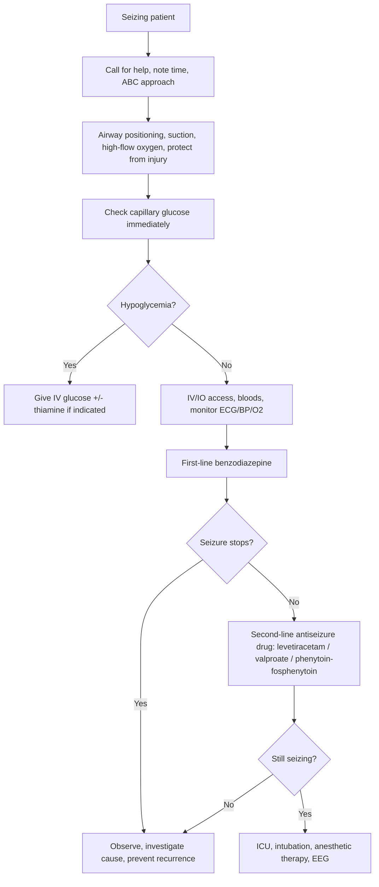
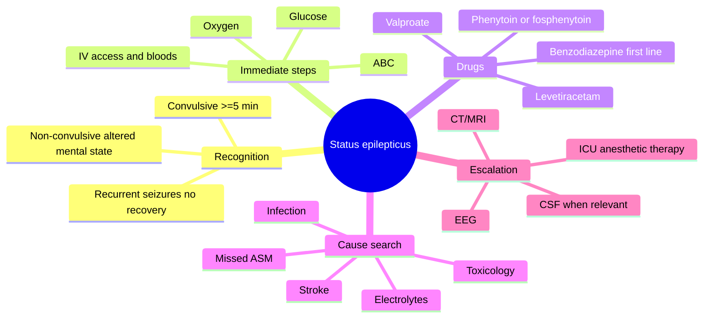

# Status epilepticus

Related: [[../Neurology MOC|Neurology MOC]] · [[../Epilepsy|Epilepsy]] · [[Epilepsy syndromes and long-term management]]

> [!important]
> Status epilepticus is a **neurological emergency**. In exams, the high-scoring structure is: **recognize ongoing seizure**, **ABC stabilization**, **check glucose immediately**, **give benzodiazepine promptly**, **escalate to second-line antiseizure therapy**, and **search for the precipitant**.

> [!tip]
> Mention both the seizure treatment timeline and the differential for **convulsive vs non-convulsive status**. Examiners look for airway protection, metabolic correction, imaging/CSF logic when infection or structural lesion is suspected, and the need for ICU/anesthetic escalation in refractory cases.

## Learning Objectives
- Define status epilepticus and classify convulsive, non-convulsive, refractory, and super-refractory forms.
- Apply a time-critical emergency sequence for stabilization and treatment.
- Interpret key investigations including glucose, electrolytes, EEG, imaging, and CSF where relevant.
- Identify common precipitants and correct reversible causes.
- Recognize treatment complications and management cautions.

## Definition
Practical modern definition:
- **Convulsive status epilepticus**: continuous convulsive seizure activity or recurrent seizures without recovery between them, operationally treated as status when lasting **>=5 minutes**.
- **Non-convulsive status epilepticus (NCSE)**: prolonged epileptic activity causing altered mental state/behavior without major convulsive movements, usually requiring EEG confirmation.
- **Refractory status epilepticus**: persists despite first-line benzodiazepine plus an adequate second-line antiseizure medication.
- **Super-refractory status epilepticus**: continues or recurs despite 24 hours or more of anesthetic therapy.

## Why It Is Dangerous
Prolonged seizure activity causes:
- hypoxia
- lactic acidosis
- hyperthermia
- rhabdomyolysis
- aspiration
- autonomic instability
- neuronal injury
- cardiorespiratory collapse

The longer seizures continue, the less responsive they become to benzodiazepines.

## Relevant Neuroanatomy and Localization
### General concept
Status may arise from:
- a **generalized epilepsy syndrome**
- a **focal cortical lesion** with secondary bilateral spread
- diffuse cerebral dysfunction in toxic-metabolic or infective states

### Localizing clues when available
- unilateral onset or eye/head deviation suggests focal cortical onset
- persistent post-ictal focal weakness suggests focal seizure source
- subtle facial twitching, nystagmoid eye movements, or unilateral automatisms may indicate focal NCSE

### Lesion localization matters because it changes the cause search
Think structural focal pathology in:
- older patient with first status event
- focal neurological deficit
- persistent reduced consciousness after convulsive phase
- known brain tumor, stroke, trauma, or CNS infection

## Classification
1. **Convulsive status epilepticus**
2. **Focal motor status epilepticus**
3. **Non-convulsive status epilepticus**
4. **Refractory status epilepticus**
5. **Super-refractory status epilepticus**

## Causes / Precipitants
### In patients with known epilepsy
- missed antiseizure medication
- sleep deprivation
- alcohol excess or withdrawal
- intercurrent infection
- vomiting with poor drug absorption

### In new-onset status epilepticus
- stroke
- CNS infection: meningitis, encephalitis
- head trauma
- brain tumor
- hypoglycemia
- hyponatremia
- hypocalcemia
- uremia or hepatic failure
- toxic ingestion or drug withdrawal
- autoimmune encephalitis in selected contexts

## Emergency Stabilization Sequence

## Immediate Management Timeline
### 0-5 minutes
- call for emergency help
- place patient in lateral safe position if feasible
- protect airway, remove hazards
- give oxygen
- suction secretions if needed
- **check bedside glucose immediately**
- obtain IV or IO access
- send bloods:
  - FBC
  - U&E including sodium
  - calcium, magnesium
  - renal and liver function
  - antiseizure drug levels where available and relevant
  - toxicology when indicated
  - ABG/VBG if sick or prolonged seizure

### First-line treatment: benzodiazepine
Typical options:
- **IV lorazepam** if available
- **IV diazepam**
- **buccal/intranasal midazolam** if no IV access
- rectal diazepam may be used depending on setting

Key principle: give promptly, but avoid endless repeated dosing causing respiratory failure without escalation.

### 5-20 minutes
If still seizing after first-line therapy, give **one appropriate second-line antiseizure medication**:
- **levetiracetam**
- **valproate**
- **phenytoin/fosphenytoin**

Choice depends on comorbidity and contraindications.

### 20-40 minutes and beyond
If seizures continue:
- treat as **refractory status epilepticus**
- involve ICU/anesthesia urgently
- intubation and anesthetic infusion may be required
- continuous EEG monitoring where possible

## Drug Logic and Management Cautions
### Benzodiazepines
Advantages:
- rapid onset
- first-line efficacy

Cautions:
- respiratory depression
- hypotension
- sedation masking ongoing NCSE

### Levetiracetam
Advantages:
- generally easy to use
- few drug interactions

Cautions:
- behavioral adverse effects later, but usually well tolerated acutely

### Valproate
Advantages:
- useful in generalized status and some focal cases

Cautions:
- avoid/caution in severe liver disease
- caution in pregnancy and women of childbearing potential
- caution in mitochondrial disease and some metabolic disorders

### Phenytoin / fosphenytoin
Advantages:
- traditional second-line agent
- useful in focal and tonic-clonic status

Cautions:
- arrhythmia and hypotension during infusion
- avoid in some generalized epilepsies if syndrome suggests absence/myoclonic predominance
- tissue injury/extravasation risk with phenytoin

### Drugs generally avoided in specific situations
- do not give long repeated benzodiazepine doses without airway planning
- do not miss hypoglycemia while focusing only on antiseizure drugs
- do not assume all persistent unresponsiveness after convulsive status is just “post-ictal”; consider **NCSE**

## Investigations
### Essential early tests
- bedside glucose
- electrolytes especially **sodium**
- calcium and magnesium
- renal and liver function
- CBC
- toxicology/drug screen where appropriate
- pregnancy test where relevant
- antiseizure medication levels where applicable

### EEG
Important roles:
- diagnose **non-convulsive status epilepticus**
- assess ongoing epileptic activity after apparent motor cessation
- guide anesthetic therapy in refractory cases

Think NCSE when:
- patient remains confused or comatose after convulsive movements stop
- subtle twitching, blinking, nystagmus, or automatisms persist
- unexplained encephalopathy in a patient with epilepsy or acute brain disease

### Imaging
- **CT head** in acute emergency when trauma, hemorrhage, mass lesion, or new focal deficit is possible
- **MRI brain** later if structural lesion suspected and CT is non-diagnostic

### CSF analysis
CSF is relevant when **CNS infection or inflammatory encephalitis** is suspected.

Practical interpretation logic:
- fever, meningism, immunosuppression, altered behavior, or temporal lobe features may suggest meningitis/encephalitis
- do neuroimaging first if there are raised ICP/mass lesion concerns or focal deficits
- CSF may show:
  - neutrophilic pleocytosis in bacterial meningitis
  - lymphocytic pleocytosis in viral/autoimmune causes
  - high protein in infective/inflammatory states

Do not delay life-saving antimicrobial treatment while arranging LP if meningitis/encephalitis is strongly suspected.

## Interpretation Frameworks
### Persistent coma after convulsive status
Possible explanations:
- prolonged post-ictal state
- ongoing NCSE
- sedative drug effect
- hypoxic or structural brain injury
- metabolic disturbance

### First seizure status in an older adult
Think urgently of:
- stroke
- intracranial bleed
- tumor
- CNS infection
- metabolic cause

### Fever plus status epilepticus
Think of:
- meningitis
- encephalitis
- sepsis-associated encephalopathy with provoked seizures

## Differential Diagnosis
- convulsive syncope
- psychogenic non-epileptic seizure
- tetany/shivering disorders
- toxic/metabolic agitation

However, in the emergency setting, **treat true status first if in doubt** while evaluating.

## Refractory and ICU-Level Management
### When to escalate
If seizure persists despite first-line and second-line treatment:
- call ICU/anesthesia
- intubate if necessary for airway protection and anesthetic therapy
- use continuous EEG if available

### Common anesthetic options in refractory status
- midazolam infusion
- propofol infusion
- barbiturate therapy in selected refractory cases

### ICU complications to watch
- ventilator-associated issues
- hypotension from anesthetics
- rhabdomyolysis and AKI
- aspiration pneumonia
- venous thromboembolism risk
- pressure injury and infection

## Special Situations
### Alcohol withdrawal status
- benzodiazepines remain central
- thiamine should be considered
- correct magnesium and other deficiencies

### Eclampsia-related convulsive emergency
Although not “epileptic status” in mechanism, remember **magnesium sulfate** is the key therapy for eclamptic seizures, not routine phenytoin-first thinking.

### Known epilepsy with missed medication
- restart or reload appropriate maintenance therapy once stabilized
- identify why doses were missed

## One-Page Exam Summary
- **Status epilepticus = treat at 5 minutes**, not after waiting half an hour.
- **ABC, oxygen, glucose, IV access, bloods** come first.
- **Benzodiazepine** is first-line; **levetiracetam/valproate/phenytoin-fosphenytoin** are second-line.
- Persistent coma may mean **non-convulsive status**; obtain **EEG**.
- Search actively for cause: **medication non-adherence, infection, stroke, metabolic abnormality, intoxication**.
- Consider **CT/MRI** for structural lesions and **CSF** when CNS infection/inflammation is suspected.
- Refractory status needs **ICU + anesthetic therapy**.

## Mermaid Mind Map

## MCQs (10)
1. Convulsive status epilepticus should be treated operationally once continuous seizure activity reaches:
   - A. 30 seconds
   - B. 2 minutes
   - C. 5 minutes
   - D. 60 minutes
2. The most important bedside test in the first few minutes is:
   - A. Rheumatoid factor
   - B. Capillary blood glucose
   - C. Serum ferritin only
   - D. Bone density scan
3. First-line drug treatment for convulsive status epilepticus is usually:
   - A. Benzodiazepine
   - B. Warfarin
   - C. Haloperidol
   - D. Acetazolamide
4. Which is an acceptable second-line agent if seizures continue after benzodiazepine?
   - A. Levetiracetam
   - B. Digoxin
   - C. Amoxicillin
   - D. Donepezil
5. Persistent unresponsiveness after motor convulsions stop should raise concern for:
   - A. Cured epilepsy
   - B. Non-convulsive status epilepticus
   - C. Essential tremor
   - D. Bell palsy
6. Which electrolyte abnormality is a classic cause of status epilepticus?
   - A. Hypercholesterolemia
   - B. Hyponatremia
   - C. Hyperuricemia
   - D. Low HDL alone
7. Refractory status epilepticus means ongoing seizures despite:
   - A. Oxygen alone
   - B. Benzodiazepine and an adequate second-line antiseizure drug
   - C. One oral vitamin tablet
   - D. CT scan
8. Which investigation is most useful to confirm non-convulsive status epilepticus?
   - A. EEG
   - B. Plain abdominal X-ray
   - C. Audiogram
   - D. Spirometry
9. Fever, altered behavior, and status epilepticus should raise suspicion of:
   - A. Encephalitis
   - B. Osteoarthritis
   - C. Hyperthyroidism only
   - D. Cataract
10. Which statement is most correct about repeated benzodiazepine dosing?
   - A. Unlimited repeat dosing is always safest
   - B. It can cause respiratory depression and should not delay escalation
   - C. It replaces the need to check glucose
   - D. It excludes need for ICU referral

## SBA Questions (10)
1. A 43-year-old man with epilepsy is brought in actively convulsing for 7 minutes. What is the most appropriate immediate action sequence?
   - A. Wait to see if it stops at 15 minutes
   - B. ABC stabilization, oxygen, bedside glucose, IV access, then benzodiazepine
   - C. Arrange MRI before any treatment
   - D. Start aspirin
   - E. Discharge after brief observation
2. A patient continues to convulse after appropriate IV lorazepam. The next best step is:
   - A. No further treatment
   - B. Give an appropriate second-line antiseizure medication such as levetiracetam, valproate, or phenytoin/fosphenytoin
   - C. Start oral iron
   - D. Give a beta-blocker
   - E. Offer physiotherapy only
3. A 70-year-old with first-ever status epilepticus has left gaze deviation and right arm jerking. What important cause category must be actively sought?
   - A. Structural focal brain lesion such as stroke or tumor
   - B. Irritable bowel syndrome
   - C. Migraine without aura only
   - D. Gout
   - E. Vitiligo
4. A patient stops convulsing after treatment but remains unresponsive for a prolonged period with subtle eyelid twitching. Best next investigation is:
   - A. EEG
   - B. DEXA scan
   - C. Urine dipstick only
   - D. Colonoscopy
   - E. Skin biopsy
5. A 25-year-old woman with status epilepticus has fever, neck stiffness, and confusion. Best next principle is:
   - A. Ignore infection because seizures explain everything
   - B. Consider CNS infection, begin urgent evaluation and treatment, and use CSF/imaging appropriately
   - C. Delay all antibiotics until full recovery
   - D. Assume psychogenic seizure
   - E. Avoid all blood tests
6. A patient with chronic alcoholism presents with convulsive status. Which additional supportive treatment is especially relevant?
   - A. High-dose statin
   - B. Thiamine
   - C. Methotrexate
   - D. Insulin infusion regardless of glucose
   - E. Loperamide
7. Which best defines refractory status epilepticus?
   - A. Any seizure lasting 1 minute
   - B. Seizure recurring a week later
   - C. Ongoing seizure despite benzodiazepine and adequate second-line therapy
   - D. One febrile seizure in childhood
   - E. Syncope with jerks
8. A patient in status epilepticus is found to have blood glucose 32 mg/dL. What is the key immediate corrective measure in addition to seizure management?
   - A. IV glucose
   - B. Calcium channel blocker
   - C. Oral antibiotics only
   - D. Warfarin
   - E. Diuretic
9. Which statement about phenytoin/fosphenytoin is most accurate in status epilepticus?
   - A. It has no cardiovascular infusion risk
   - B. It may cause hypotension/arrhythmia during infusion
   - C. It is first-line before benzodiazepine
   - D. It is used only for migraine
   - E. It is safer than checking ECG
10. A ventilated ICU patient remains in super-refractory status epilepticus. The best broad management principle is:
   - A. Stop monitoring
   - B. Continue specialist ICU/anesthetic management with EEG guidance and repeated cause review
   - C. Discharge from ICU immediately
   - D. Treat only with oral vitamins
   - E. Avoid neurology input

## Flashcards
- Q: At what duration should convulsive status epilepticus be treated operationally?
  A: At 5 minutes.
- Q: What bedside test must be checked immediately in a seizing patient?
  A: Capillary blood glucose.
- Q: What is the first-line drug class for status epilepticus?
  A: Benzodiazepines.
- Q: Name 3 common second-line drugs for established convulsive status.
  A: Levetiracetam, valproate, phenytoin/fosphenytoin.
- Q: What investigation confirms non-convulsive status epilepticus?
  A: EEG.
- Q: What common medication-related precipitant causes status in known epilepsy?
  A: Missed antiseizure medication.
- Q: What does persistent coma after convulsions stop make you think of?
  A: Non-convulsive status, sedative effect, structural injury, or metabolic disturbance.
- Q: When is CSF particularly relevant in status epilepticus?
  A: When meningitis or encephalitis is suspected.
- Q: What defines refractory status epilepticus?
  A: Failure of benzodiazepine plus adequate second-line therapy.
- Q: What level of care is needed for refractory or super-refractory status?
  A: ICU with airway support, anesthetic therapy, and EEG monitoring.

## Answer Key with Explanations
### MCQs
1. **C. 5 minutes** — the operational threshold for treatment.
2. **B. Capillary blood glucose** — hypoglycemia is rapidly reversible and dangerous.
3. **A. Benzodiazepine** — immediate first-line therapy.
4. **A. Levetiracetam** — valid second-line option alongside valproate or phenytoin/fosphenytoin.
5. **B. Non-convulsive status epilepticus** — especially if reduced consciousness persists.
6. **B. Hyponatremia** — classic seizure precipitant.
7. **B. Benzodiazepine and an adequate second-line antiseizure drug** — this defines refractory status.
8. **A. EEG** — essential for NCSE confirmation.
9. **A. Encephalitis** — fever plus status strongly raises this possibility.
10. **B. It can cause respiratory depression and should not delay escalation** — key management caution.

### SBAs
1. **B. ABC stabilization, oxygen, bedside glucose, IV access, then benzodiazepine** — this is the correct emergency sequence.
2. **B. Give an appropriate second-line antiseizure medication such as levetiracetam, valproate, or phenytoin/fosphenytoin** — do not delay escalation.
3. **A. Structural focal brain lesion such as stroke or tumor** — focal onset in an older adult demands this search.
4. **A. EEG** — needed to exclude ongoing non-convulsive seizures.
5. **B. Consider CNS infection, begin urgent evaluation and treatment, and use CSF/imaging appropriately** — seizure does not exclude meningitis/encephalitis.
6. **B. Thiamine** — important in alcohol-related presentations.
7. **C. Ongoing seizure despite benzodiazepine and adequate second-line therapy** — standard definition.
8. **A. IV glucose** — must be corrected immediately.
9. **B. It may cause hypotension/arrhythmia during infusion** — important caution.
10. **B. Continue specialist ICU/anesthetic management with EEG guidance and repeated cause review** — the core principle in super-refractory cases.

## PasTest Scenario SBAs (Clinical Vignettes)

> **Auto-generated PasTest/Mediscope-style scenario SBAs** grounded in the authored source. Each scenario tests a real clinical fact (triad, specific sign, contraindication, trial, first-line Rx) extracted from the topic. *Source: Ch 27: Neurology & Stroke — Status Epilepticus*

**Q1.** Which landmark clinical trial provided evidence relevant to the management of Status Epilepticus (specifically: equal efficacy to fosphenytoin/valproate but better safety (no cardiac monitoring, few interactions, safe in pregnancy, )?

  - **A.** ESETT trial
  - **B.** A different but related trial in the same area
  - **C.** A guideline (not a trial) addressing the same question
  - **D.** An observational/cohort study addressing similar outcomes

  > **Answer: A** — ESETT trial
  >
  > *Source:* **Q:** Which 2nd line IV ASM is preferred and why?
   **A:** Levetiracetam 20-60mg/kg IV — ESETT trial showed equal efficacy to fosphenytoin/valproate but better safety (no cardiac monitoring, few int

**Q2.** What is the most appropriate first-line therapy for Status Epilepticus?

  - **A.** Glucose + Check immediately + Thiamine
  - **B.** An advanced/surgical therapy reserved for refractory disease
  - **C.** Symptomatic treatment only, no disease-modifying therapy
  - **D.** Empiric broad-spectrum therapy without specific indication

  > **Answer: A** — Glucose + Check immediately + Thiamine
  >
  > *Source:* **Glucose**   **Check immediately** — if <4 mmol/L or unknown: 50ml 50% dextrose IV + **Thiamine 100mg IV** (before glucose in malnutrition/alcohol)

