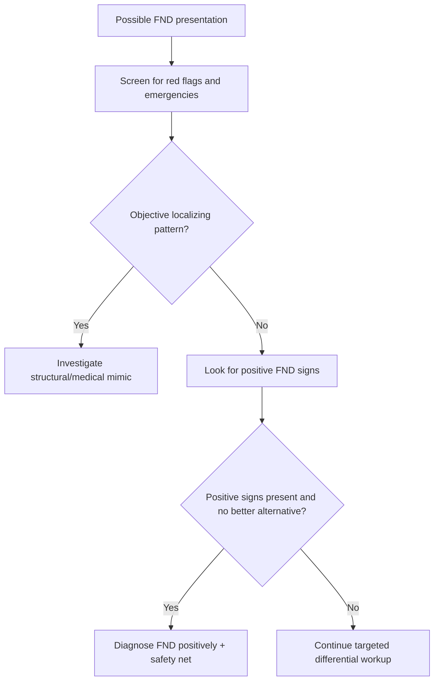

# Common mimics to avoid missing

Related: [[../Neurology MOC|Neurology MOC]] · [[../Functional Neurological Disorder|Functional Neurological Disorder]] · [[Diagnosis|Diagnosis]] · [[Positive clinical signs supporting FND]] · [[Why FND is not purely a diagnosis of exclusion]]

> [!warning]
> FND is common, but **misdiagnosis in either direction is harmful**. The neurologist must avoid both overcalling FND and over-investigating endlessly. The safe approach is to identify **positive functional signs** while systematically screening for **important structural, metabolic, epileptic, spinal, ocular, vestibular, and neuromuscular mimics**.

## Learning Objectives
- List the main neurological and medical mimics of FND.
- Recognize red flags that argue against a purely functional diagnosis.
- Apply a presentation-based differential framework for weakness, sensory change, attacks, gait, and visual symptoms.

## Definition
A mimic in this context is a disorder that can resemble FND but has a different pathophysiology and may require urgent or disease-specific treatment. Missing these conditions can result in severe morbidity.

## General Safety Principles
- Diagnose FND positively; do not use FND as a dumping-ground label.
- Reassess if the picture evolves or objective signs accumulate.
- New symptoms in a patient with known FND are **not automatically functional**.
- FND and organic disease may coexist.

## High-Risk Mimic Categories
### 1. Acute vascular / structural disease
- Ischemic stroke
- TIA
- Intracranial hemorrhage
- Brain tumor or mass lesion
- Subdural hematoma when relevant

### 2. Spinal cord disease
- Cord compression
- Transverse myelitis
- Cervical myelopathy
- Cauda equina syndrome (although peripheral rather than central, urgent)

### 3. Seizure / collapse differentials
- Epileptic seizures
- Convulsive syncope
- Arrhythmia-related LOC
- Hypoglycemia
- Toxic-metabolic encephalopathy

### 4. Neuromuscular disease
- Myasthenia gravis
- GBS
- Myopathy
- Periodic paralysis
- Peripheral neuropathy or radiculopathy

### 5. Movement / balance disorders
- Parkinsonism
- Essential tremor
- Dystonia
- Cerebellar ataxia
- Vestibular disorders

### 6. Visual / ocular disease
- Optic neuritis
- Retinal pathology
- Ocular motor cranial neuropathy
- Occipital stroke or structural lesion

### 7. Inflammatory / infectious / metabolic disease
- Multiple sclerosis relapse
- Meningitis/encephalitis
- Electrolyte disturbance
- Thyroid disease
- B12 deficiency when relevant
- Drug/toxin effects

## Red Flags Against a Purely Functional Diagnosis
- persistent objective UMN or LMN signs
- optic disc swelling, RAPD, or monocular structural visual loss
- sensory level with sphincter dysfunction
- true cranial nerve palsy
- clearly progressive neurological decline
- significant systemic upset: fever, meningism, severe metabolic abnormality
- consistent lesion-pattern deficit
- marked CK rise / metabolic pattern where relevant

## Presentation-Based Differential Framework
### Apparent weakness
Must consider:
- stroke
- MS relapse
- cord lesion
- myasthenia gravis
- neuropathy/radiculopathy
- myopathy
- periodic paralysis

Clues against FND alone:
- extensor plantar response
- spasticity/hyperreflexia
- fasciculation/atrophy
- fatigable ptosis or bulbar signs
- sensory level or bladder involvement

### Sensory symptoms
Must consider:
- thalamic/cortical stroke
- myelopathy
- peripheral neuropathy
- radiculopathy
- migraine aura
- MS

Clues against FND alone:
- stable dermatomal or tract pattern
- clear posterior-column or spinothalamic dissociation
- objective sensory level

### Seizure-like episodes
Must consider:
- epilepsy
- convulsive syncope
- arrhythmia
- hypoglycemia
- intoxication/withdrawal

Clues against FND alone:
- stereotyped events
- lateral tongue biting
- prolonged post-ictal confusion
- witnessed focal onset
- clear EEG correlate

### Gait / movement symptoms
Must consider:
- cerebellar lesion
- Parkinson disease
- vestibular disease
- drug-induced movement disorder
- myelopathy
- neuropathy

Clues against FND alone:
- consistent cerebellar signs
- rigidity/bradykinesia pattern
- sensory ataxia with proprioceptive loss
- persistent nystagmus or vestibular syndrome

### Visual symptoms
Must consider:
- optic neuritis
- retinal detachment/retinal disease
- ocular motor palsy
- occipital lesion
- MG with ocular involvement

Clues against FND alone:
- RAPD
- optic disc abnormalities
- true monocular field defect
- consistent ocular misalignment or ophthalmoplegia

## Investigations: targeted, not absent
### Choose according to symptom pattern
- CT/MRI brain for acute focal deficits or headache red flags
- MRI spine for myelopathy/cord symptoms
- EEG/video-EEG for attack disorders when needed
- ECG/telemetry for syncope/collapse
- Blood glucose, U&E, calcium, CBC, thyroid tests as clinically indicated
- Neurophysiology for neuropathy/NMJ/muscle differentials
- Ophthalmologic assessment for ocular/optic complaints

## Diagnostic Strategy Table
| Question | If yes, action |
|---|---|
| Is there an acute emergency? | Stabilize and investigate urgently |
| Are there objective localizing signs? | Reassess structural differential |
| Are positive FND signs present? | FND more likely, continue targeted reasoning |
| Is the pattern evolving/progressive? | Do not settle prematurely on FND |
| Could both FND and organic disease coexist? | Consider dual diagnosis |

## Coexistence: a major exam pearl
- A patient with epilepsy can also have dissociative attacks.
- A patient with MS or prior stroke can also have functional symptoms.
- A patient with migraine can have functional sensory or gait symptoms.
- Therefore, every symptom must be matched to evidence, not assumed.

## Management Implications
- Missing a mimic delays appropriate treatment.
- Over-investigating a clear FND case increases iatrogenic harm.
- Good neurology balances **diagnostic confidence** with **safety-net vigilance**.

## Communication Points
- Tell the patient when emergency causes have been checked and what positive signs support FND.
- Safety-net explicitly: return if new objective weakness, sphincter symptoms, fever, severe persistent headache, or visual loss develops.

## FCPS/MRCP High-Yield Points
- Stroke, cord compression, epilepsy, syncope, MG, cerebellar disease, and optic neuritis are major mimics.
- Red flags include objective localizing signs and progressive deficits.
- FND and organic disease can coexist.
- The safest approach is positive diagnosis plus targeted exclusion of important mimics.

## Common Viva Questions
- Which conditions commonly mimic FND?
- What red flags argue against isolated FND?
- Can FND coexist with organic disease?
- How do you investigate suspected FND safely?

## Common Confusions / Exam Traps
- Assuming bizarre symptoms cannot be structural.
- Assuming one positive sign excludes all other pathology.
- Forgetting arrhythmic syncope in seizure-like episodes.
- Missing myelopathy in “functional gait” presentations.
- Missing optic neuritis in “functional visual loss.”

## Mnemonics
**MIMICS SAFE**
- **M**yelopathy
- **I**ctus (stroke)
- **M**yasthenia / metabolic
- **I**nfection / inflammation
- **C**ollapse causes: epilepsy/syncope
- **S**pinal / seizure / sensory lesions
- **S**tructural eye disease
- **A**taxia/arrhythmia
- **F**unctional signs also sought
- **E**xclude emergencies first

## Mind Map
- FND mimics
  - stroke
  - cord disease
  - epilepsy/syncope
  - MG/NMJ/muscle/nerve
  - cerebellar/vestibular
  - optic/ocular disease
  - metabolic/inflammatory

## Flowchart

## Suggested Visuals / Image Notes
- Table of mimics by presentation
- Red-flag checklist card for FND assessment

## One-Page Revision Summary
- Do not miss: **stroke, cord disease, epilepsy/syncope, MG, cerebellar/vestibular disease, optic neuritis/ocular disease, metabolic/inflammatory causes**.
- Positive FND signs are important, but red flags override premature closure.
- Organic disease and FND can coexist.
- Investigate **targetedly according to symptom pattern**.

## 24-Hour Recall Prompts
- Name 6 important mimics of FND.
- What red flags make you pause before diagnosing FND?
- What mimics apply specifically to seizure-like attacks?
- Why is dual diagnosis a key principle?

## 7-Day / 15-Day / 30-Day Revision Tracker
- **Day 7:** Recall mimics by symptom domain.
- **Day 15:** Practice red-flag listing in viva format.
- **Day 30:** Run through acute safety algorithm from memory.

## Must Know / Should Know / Nice to Know
### Must Know
- Stroke, cord disease, epilepsy/syncope, MG, optic neuritis
- Progressive/objective signs as red flags
- Dual diagnosis principle
### Should Know
- Targeted test selection by symptom pattern
- Importance of safety-net advice
### Nice to Know
- Epidemiology of misdiagnosis rates in modern FND practice

## My Weak Points
- Do I prematurely anchor on FND?
- Can I list mimics by presentation quickly?
- Do I remember dual diagnosis?

## Self-Test Scorecard
- Differential breadth /10
- Red-flag recall /10
- Investigation logic /10
- Viva confidence /10

## Exam Answer Modes
### Short note frame
General principle → high-risk mimics → red flags → targeted investigations → coexistence principle.

### Viva frame
“In suspected FND I still actively exclude common mimics such as stroke, cord disease, epilepsy or syncope, myasthenia gravis, cerebellar and vestibular disorders, and optic neuritis. Red flags are objective localizing signs, progression, sphincter disturbance, cranial nerve palsy, or systemic illness. FND and organic disease may coexist, so diagnosis must be symptom-specific.”

## Summary
Common mimics to avoid missing in FND span vascular, spinal, epileptic, syncopal, neuromuscular, movement, ocular, inflammatory, and metabolic disease. The safest neurologic practice is to combine **positive diagnosis of FND** with **disciplined exclusion of dangerous mimics and awareness of dual pathology**.

## MCQs (10)
1. Which is a major mimic of functional unilateral weakness?
   - A. Stroke
   - B. Acne
   - C. Psoriasis
   - D. GERD
   - E. Cataract
2. Which feature raises concern for structural myelopathy rather than isolated FND?
   - A. Variable weakness
   - B. Sensory level with bladder symptoms
   - C. Distractibility
   - D. Midline splitting
   - E. Entrainment
3. A major mimic of dissociative attacks is:
   - A. Epilepsy
   - B. Vitiligo
   - C. Peptic ulcer disease
   - D. Osteoarthritis
   - E. Rhinitis
4. Which eye finding is least compatible with isolated functional visual symptoms?
   - A. Tubular field
   - B. RAPD
   - C. Inconsistent acuity
   - D. Preserved navigation
   - E. Variable complaint pattern
5. Which principle is correct?
   - A. FND excludes all organic disease
   - B. Organic disease and FND can coexist
   - C. Normal MRI rules out all mimics
   - D. Positive signs eliminate need for safety-netting
   - E. Progressive deficits favor FND
6. A dangerous mimic of functional gait disorder is:
   - A. Cerebellar stroke
   - B. Acne
   - C. IBS
   - D. Urticaria
   - E. Cataract
7. Which is a major mimic of fluctuating bulbar or ocular symptoms?
   - A. Myasthenia gravis
   - B. Psoriasis
   - C. Migraine aura only
   - D. Eczema
   - E. Tinea
8. Which history feature supports convulsive syncope rather than PNES or epilepsy as a collapse cause?
   - A. Prolonged ictal crying only
   - B. Standing trigger with presyncope and rapid recovery
   - C. Clear entrainment
   - D. Midline splitting
   - E. Give-way weakness
9. When should the diagnosis be revisited in a patient labeled with FND?
   - A. Never
   - B. If new objective deficits or progression appear
   - C. Only if family requests
   - D. Only after 10 normal MRIs
   - E. Only in psychiatry clinic
10. The best investigation strategy is:
   - A. Exhaustive testing in every patient
   - B. No testing ever
   - C. Targeted testing guided by symptom pattern and red flags
   - D. CT chest for all patients
   - E. Lumbar puncture for all patients

## SBA Questions (10)
1. A patient with apparent functional leg weakness also has extensor plantar response and urinary retention. What is the best interpretation?
2. A young woman with suspected PNES collapses with jerks after prolonged standing and rapidly recovers. What important mimic should be considered?
3. A patient with “functional” visual loss has an RAPD. What does this imply?
4. Why is dual diagnosis important in FND?
5. What are the most important mimics of functional gait disorder?
6. Which symptom cluster should prompt MRI spine rather than premature FND labeling?
7. In recurrent seizure-like episodes, what cardiac cause must sometimes be considered?
8. A patient with known MS develops inconsistent symptoms plus some clear positive FND signs. What key principle applies?
9. Why is progressive focal neurological deficit a red flag?
10. What is the best general strategy when assessing possible FND?

## Flashcards
- Q: Name 3 major mimics of FND weakness.
  A: Stroke, cord lesion, myasthenia gravis.
- Q: Can FND coexist with epilepsy or MS?
  A: Yes.
- Q: What visual red flag argues against isolated FND?
  A: RAPD or optic disc abnormality.
- Q: What spinal red flag is especially important?
  A: Sensory level with sphincter dysfunction.
- Q: Best investigation strategy?
  A: Targeted testing guided by red flags.

## Answer Key with Explanations
### MCQs
1. **A** — stroke is a major mimic.
2. **B** — sensory level plus bladder symptoms strongly suggests cord disease.
3. **A** — epilepsy is a key attack mimic.
4. **B** — RAPD implies optic pathway disease.
5. **B** — dual diagnosis is possible.
6. **A** — cerebellar stroke is an important dangerous mimic.
7. **A** — MG is a key mimic of fluctuating ocular/bulbar dysfunction.
8. **B** — this pattern suggests convulsive syncope.
9. **B** — objective progression mandates reassessment.
10. **C** — testing should be symptom-guided and safety-driven.

### SBAs
1. Structural spinal/central motor pathway disease must be prioritized; do not diagnose isolated FND.
2. Convulsive syncope.
3. Possible optic nerve/ocular structural disease.
4. Because one patient may have both functional and organic neurological symptoms.
5. Cerebellar disease, vestibular disorder, myelopathy, parkinsonism, neuropathy.
6. Sensory level, gait change, and sphincter symptoms.
7. Arrhythmia causing syncope.
8. MS and FND can coexist; each symptom requires separate attribution.
9. Because structural disease is more likely and urgent reassessment may be needed.
10. Positive diagnosis plus disciplined exclusion of dangerous mimics.