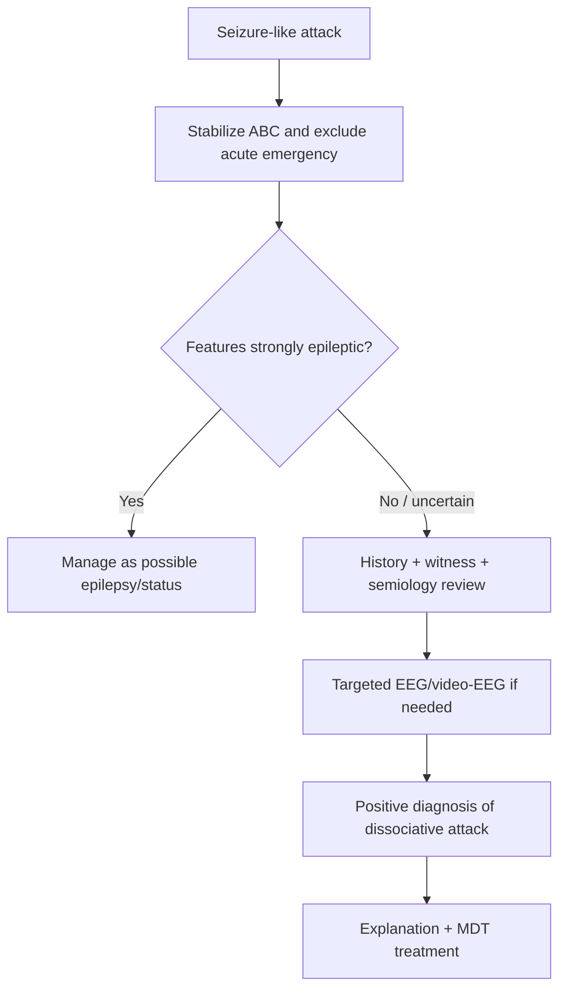

# Dissociative and non-epileptic attacks

Related: [[../Neurology MOC|Neurology MOC]] · [[../Functional Neurological Disorder|Functional Neurological Disorder]] · [[Presentations|Presentations]] · [[Positive clinical signs supporting FND]] · [[Common mimics to avoid missing]]

> [!important]
> Dissociative attacks, also called **psychogenic non-epileptic seizures (PNES)** or **functional seizures**, are **paroxysmal episodes that resemble epileptic seizures but are not caused by abnormal epileptiform cortical discharges**. The diagnosis should be made positively and carefully, not by ridicule or by assuming fabrication.

## Learning Objectives
- Define dissociative/non-epileptic attacks within [[Functional Neurological Disorder]].
- Distinguish common clinical clues favoring non-epileptic attacks over epileptic seizures.
- Recognize urgent differentials that must not be missed.
- Outline investigation strategy, especially the role and limits of EEG/video-EEG.
- Give an FCPS/MRCP-oriented approach to explanation and management.

## Definition
Dissociative and non-epileptic attacks are **episodic disturbances of behavior, awareness, movement, or responsiveness** that resemble epileptic seizures but occur **without the electrophysiological signature of epilepsy** and are understood as part of FND. The episodes are **real, involuntary, and distressing** to the patient.

## Core Anatomy
- Epileptic seizures arise from abnormal synchronized cortical electrical discharges.
- In dissociative attacks, the structural epileptogenic mechanism is absent.
- Networks related to emotion, salience, self-agency, attention, motor output, and autonomic arousal are more relevant than a focal lesion model.
- The cortex, brainstem, and autonomic nervous system may all participate in the observed behavior, but not in the pattern of epileptic discharge.

## Core Physiology
- Normal consciousness and motor control depend on coordinated cortical-subcortical network function.
- Dissociative attacks are thought to involve abnormal top-down processing, threat responses, altered attention, and disrupted control of movement or awareness.
- The event may be triggered or reinforced by expectation, panic, trauma-related processing, pain, or bodily hypervigilance.
- The attack is not voluntarily staged in the typical FND framework.

## Normal Values / Important Cut-offs
- There is **no laboratory cut-off** diagnostic of dissociative attacks.
- A **normal routine EEG** does **not** by itself prove PNES.
- **Video-EEG capture of a habitual event without epileptiform correlate** is the strongest confirmatory test when doubt remains.
- Serum prolactin has limited utility and should not be over-relied on.

## Terminology
- Preferred explanatory terms: **dissociative attacks**, **functional seizures**, **non-epileptic attacks**.
- Avoid accusatory language such as “pseudo-seizures” in patient communication.

## Classification
### By semiology
- Convulsive or hypermotor attacks
- Akinetic/unresponsive episodes
- Tremulous attacks
- Mixed emotional-motor episodes

### By clinical context
- Isolated FND presentation
- Coexisting with epilepsy
- Associated with panic/dissociation/trauma symptoms
- Frequent recurrent attack disorder with disability

## Etiology / Causes
Dissociative attacks are multifactorial. Contributing factors may include:
- prior frightening seizure-like or health events
- psychological stress, trauma, or dissociation in some patients
- chronic pain, fatigue, migraine, anxiety, depression
- maladaptive threat processing and symptom expectation
- prior epilepsy or family exposure to seizures

## Risk Factors
- Young adult age is common, but any age can be affected.
- Female sex is overrepresented in many series.
- Prior mental health difficulties, trauma, dissociation, or chronic medically unexplained symptoms.
- History of epilepsy, learning difficulties, pain syndromes, or repeated emergency attendance.

## Pathophysiology
- Current models emphasize abnormal attention, salience attribution, and prediction processing.
- Dissociation may alter awareness, memory encoding, and voluntary motor control.
- Repeated emergency responses, uncertainty, and mixed clinician messaging can perpetuate attacks.
- Some patients have both epilepsy and PNES, so the physiology is not mutually exclusive.

## Clinical Features
### Features often favoring dissociative/non-epileptic attacks
- prolonged duration compared with typical generalized tonic-clonic seizures
- fluctuating course during the same attack
- eyes closed tightly during apparent unresponsiveness
- asynchronous limb movements
- side-to-side head movement or pelvic thrusting in some cases
- ictal crying, weeping, or emotional expression
- rapid recovery without classic post-ictal confusion in some patients
- attack occurrence in emotionally salient settings

### Features that may favor epileptic seizures instead
- stereotyped brief events
- lateral tongue biting
- cyanosis
- clear post-ictal confusion
- witnessed tonic-clonic pattern with injury/incontinence and abrupt onset-offset
- EEG correlation where recorded

## History Framework
Ask about:
- onset, duration, sequence, and recovery
- triggers, warning symptoms, and witnesses
- responsiveness during attack
- injury, tongue bite, incontinence
- post-event confusion or sleepiness
- prior epilepsy diagnosis or antiseizure drug use
- psychosocial stressors, panic, trauma, dissociation, pain, sleep deprivation

## Approach / Algorithm
1. Confirm the event description from the patient and witness.
2. Exclude immediate emergencies: status epilepticus, hypoglycemia, meningitis/encephalitis, syncope with arrhythmia, toxic-metabolic causes.
3. Look for semiologic clues favoring non-epileptic attacks.
4. Review whether the pattern is stereotyped and epileptic or variable and functional.
5. Use EEG/video-EEG selectively when uncertainty remains or epilepsy is plausible.
6. If diagnosis is supported, explain positively that the attacks are real but not due to epileptic discharges.
7. Address comorbid anxiety, depression, trauma, pain, sleep problems, and social disability.

## Investigations
### Baseline / targeted
- Capillary glucose during acute setting when relevant
- U&E, calcium, toxicology, pregnancy test, infection work-up only if clinically indicated
- ECG if syncope is possible
- MRI brain if focal neurological concerns, new epilepsy suspicion, or structural disease is plausible

### Neurophysiology
- Routine EEG may help if epileptic epilepsy differential remains, but has limited sensitivity/specificity.
- Video-EEG capture of a habitual episode is the best confirmatory investigation when diagnosis remains uncertain.
- A normal EEG between attacks does not exclude epilepsy.

## Interpretation Frameworks
### Functional attack clues
Support PNES/dissociative attacks when events show:
- variability or waxing-waning intensity
- prolonged duration with preserved protective behaviors
- eye closure during apparent seizure
- asynchronous or non-stereotyped movements
- emotional vocalization or crying
- lack of EEG correlate during habitual event capture

### Epileptic seizure clues
Consider epilepsy more strongly if there is:
- stereotyped semiology
- lateral tongue bite
- injury from sudden fall
- post-ictal confusion and deep sleep
- focal neurological deficit or focal EEG changes

### Syncope clues
- prodromal light-headedness, sweating, nausea
- brief LOC with rapid recovery
- relation to standing, pain, or vasovagal trigger

## Diagnosis
Diagnosis is clinical and ideally supported by positive semiological features, witness history, and when needed, video-EEG confirmation of a habitual non-epileptic event. The diagnosis should be communicated as **functional seizures/dissociative attacks** rather than “nothing was found.”

## Differential Diagnosis
- Epileptic seizures
- Convulsive syncope
- Panic attacks with hyperventilation
- Paroxysmal movement disorders
- Migraine variants
- Sleep disorders
- Metabolic encephalopathy
- Factitious disorder or malingering only if clear evidence supports intentional deception

## Tables / Comparison Charts
| Feature | Dissociative/non-epileptic attack | Epileptic seizure |
|---|---|---|
| Duration | Often prolonged | Often shorter/stereotyped |
| Pattern | Variable/fluctuating | Stereotyped |
| Eye closure | Common | Less typical in GTCS |
| Movements | Asynchronous/irregular | Rhythmic/organized |
| Post-ictal state | Variable/often limited | Common after GTCS |
| EEG during event | No epileptiform correlate | Correlates may be present |

## Management
### Acute setting
- Ensure ABC stability and safety.
- Do not repeatedly escalate benzodiazepines once true status epilepticus is not supported.
- Avoid intubation or ICU-level interventions unless clinical evidence warrants them.

### Ongoing management
- Give a clear positive explanation.
- Review and rationalize antiseizure medications if epilepsy is not present.
- Refer for neurology follow-up and psychology/psychiatry input when appropriate.
- Address sleep, pain, mood, trauma, and social triggers.
- Encourage seizure/attack diaries and trigger awareness.

## Drug / Treatment Cautions
- Antiseizure medicines do **not** treat PNES unless coexisting epilepsy exists.
- Repeated sedatives may cause harm in prolonged functional attacks.
- Avoid unnecessary polypharmacy for unexplained episodes.

## Procedures / Indications / Contraindications
### Video-EEG
- **Indication:** diagnostic uncertainty, possible coexisting epilepsy, frequent events.
- **Value:** captures habitual attack and clarifies absence/presence of epileptiform activity.
- **Limitation:** diagnosis is strongest when the recorded event matches the patient’s typical attack.

## Complications
- Recurrent emergency visits
- Injury during attacks
- Driving/employment limitations
- Inappropriate antiseizure treatment
- Stigma and family misunderstanding
- Psychiatric comorbidity, social withdrawal, poor quality of life

## Red Flags / Emergencies
Do not miss:
- true convulsive status epilepticus
- CNS infection
- toxic-metabolic encephalopathy
- arrhythmic syncope
- pregnancy-related seizure causes such as eclampsia when relevant
- new focal neurological deficit suggesting structural disease

## Prognosis
- Better when diagnosis is made early and explained clearly.
- Worse with long diagnostic delay, severe psychiatric comorbidity, family reinforcement, coexisting disability, or contradictory medical advice.
- Some patients improve substantially after explanation and therapy; others have chronic relapse-remit course.

## Topic Correlation
- Compare with [[Positive clinical signs supporting FND]].
- Link to [[Common mimics to avoid missing]].
- Remember overlap with epilepsy; FND and epilepsy can coexist.

## Special Situations
- **Coexisting epilepsy:** a patient may have both epileptic and functional events.
- **Emergency room mislabeling:** inappropriate repeated anticonvulsant escalation is a classic iatrogenic harm.
- **Medico-social impact:** driving advice and occupational implications may be major concerns.

## FCPS/MRCP High-Yield Points
- Dissociative attacks are a **common epilepsy mimic**.
- Diagnosis is **positive**, not just exclusion after many normal tests.
- Video-EEG capture of a habitual event is the most useful confirmatory investigation.
- Normal interictal EEG does not rule out epilepsy.
- FND and epilepsy may coexist.

## Common Viva Questions
- How do you distinguish PNES from epileptic seizures?
- What is the role of EEG and video-EEG?
- Why is prolonged benzodiazepine escalation harmful in PNES?
- Can a patient have both epilepsy and dissociative attacks?

## Common Confusions / Exam Traps
- Assuming every normal EEG excludes epilepsy.
- Assuming every seizure-like attack in a stressed patient is functional.
- Using stigmatizing language.
- Missing syncope or hypoglycemia in the emergency setting.
- Forgetting that epilepsy and PNES may coexist.

## Mnemonics
**ATTACK FND**
- **A**synchronous movements
- **T**ightly closed eyes
- **T**rue symptoms, not assumed faking
- **A**ttack prolonged/fluctuating
- **C**oexisting epilepsy possible
- **K**ey test = video-EEG

## Mind Map
- Dissociative attacks
  - seizure mimic
  - no epileptiform discharge
  - variable semiology
  - confirm with video-EEG if needed
  - explain positively
  - MDT care

## Flowchart

## Suggested Visuals / Image Notes
- Table: PNES vs epileptic seizure clues
- Video-EEG interpretation schematic
- Attack explanation infographic for patient counseling

## One-Page Revision Summary
- Dissociative/non-epileptic attacks are **real functional seizure-like episodes** without epileptiform discharge.
- Key clues: prolonged fluctuating course, eye closure, asynchronous movements, emotional vocalization, limited post-ictal state.
- Always exclude acute emergencies and remember epilepsy may coexist.
- Best confirmation when needed = **video-EEG capture of a habitual event**.
- Management = explanation, avoid unnecessary anticonvulsant escalation, address comorbidity and disability.

## 24-Hour Recall Prompts
- List 5 clues favoring PNES over epileptic seizure.
- Why does a normal routine EEG not prove PNES?
- What acute emergencies must be excluded first?
- How would you explain the diagnosis to a patient?

## 7-Day / 15-Day / 30-Day Revision Tracker
- **Day 7:** Reproduce the differential table from memory.
- **Day 15:** Practice viva on EEG vs video-EEG.
- **Day 30:** Explain PNES to a mock patient in 2 minutes.

## Must Know / Should Know / Nice to Know
### Must Know
- Common seizure mimic
- Positive semiological clues
- Video-EEG role
- Coexisting epilepsy possible
### Should Know
- Limited value of routine EEG alone
- Emergency over-treatment harms
- Psychiatric/trauma overlap
### Nice to Know
- Advanced neurobiological network models of dissociation

## My Weak Points
- Can I distinguish PNES from syncope and epilepsy quickly?
- Do I remember that interictal EEG may be normal in epilepsy?
- Can I explain the diagnosis without sounding dismissive?

## Self-Test Scorecard
- Seizure differential /10
- EEG interpretation logic /10
- Management safety /10
- Viva confidence /10

## Exam Answer Modes
### Short note frame
Definition → semiology → investigations → differential → explanation and management.

### Viva frame
“Dissociative or non-epileptic attacks are functional seizure-like episodes not caused by epileptiform brain discharges. I diagnose them using positive semiological clues and, if needed, video-EEG confirmation, while excluding epilepsy, syncope, and metabolic emergencies. Management depends on explanation, reducing iatrogenic harm, and multidisciplinary treatment.”

## Summary
Dissociative and non-epileptic attacks are an important high-yield presentation of FND and a common epilepsy mimic. Diagnosis should be **positive and evidence-based**, emergency mimics must be excluded, and management should avoid unnecessary anticonvulsant escalation while emphasizing explanation and multidisciplinary care.

## MCQs (10)
1. The strongest confirmatory investigation for dissociative attacks, when needed, is:
   - A. Skull X-ray
   - B. Video-EEG capture of a habitual attack
   - C. Serum prolactin alone
   - D. ESR
   - E. CT abdomen
2. Which feature favors dissociative/non-epileptic attacks over generalized tonic-clonic seizure?
   - A. Stereotyped brief event
   - B. Lateral tongue biting
   - C. Tight eye closure and fluctuating course
   - D. Clear post-ictal confusion
   - E. EEG epileptiform correlate
3. A normal interictal EEG means:
   - A. Epilepsy is excluded
   - B. PNES is confirmed
   - C. Neither epilepsy nor PNES is proven alone
   - D. The patient is malingering
   - E. Status epilepticus is present
4. Which statement is correct?
   - A. PNES is always consciously feigned
   - B. Dissociative attacks are genuine symptoms
   - C. Antiseizure drugs always help PNES
   - D. Video-EEG is never needed
   - E. Epilepsy cannot coexist
5. Which acute differential must be excluded first in an unresponsive convulsive patient?
   - A. Status epilepticus
   - B. Psoriasis
   - C. Gout
   - D. Cataract
   - E. IBS
6. Which management step is best once diagnosis is established?
   - A. Tell patient nothing is wrong
   - B. Continue escalating antiepileptics indefinitely
   - C. Give a positive explanation and address comorbid factors
   - D. Routine intubation during every episode
   - E. Long-term antibiotics
7. Which clue supports epilepsy rather than PNES?
   - A. Variable course
   - B. Asynchronous movement
   - C. Lateral tongue bite with post-ictal confusion
   - D. Ictal crying
   - E. Eyes closed tightly
8. Patients with PNES may also have:
   - A. Coexisting epilepsy
   - B. Only psychosis
   - C. No neurological disease ever
   - D. Mandatory structural lesion
   - E. Always normal MRI and EEG history
9. Why should repeated benzodiazepines be avoided in obvious prolonged PNES?
   - A. No reason
   - B. They may cause iatrogenic harm without treating the mechanism
   - C. They cure PNES too fast
   - D. They cause epilepsy
   - E. They worsen all EEGs permanently
10. Which communication term is usually preferred?
   - A. Fake seizures
   - B. Pseudo-seizures
   - C. Dissociative attacks or functional seizures
   - D. Imaginary fits
   - E. Voluntary attacks

## SBA Questions (10)
1. A 23-year-old woman has recurrent convulsive episodes lasting 8–10 minutes with tightly closed eyes, waxing and waning movement, and rapid recovery. What is the most likely diagnosis?
2. A man with known epilepsy develops a second type of prolonged variable attack with normal video-EEG during the event. What key principle applies?
3. In the emergency room, a patient with prolonged shaking has normal oxygenation and variable asynchronous movements. What important management error should be avoided?
4. What is the best investigation when routine EEGs have not clarified recurrent habitual seizure-like episodes?
5. Which finding most strongly supports generalized tonic-clonic epilepsy rather than PNES?
6. A patient asks if the doctor means the attacks are fake. What is the best response?
7. What must always be considered in the differential of transient collapse with jerking?
8. What is the long-term treatment focus after positive diagnosis of PNES?
9. Why is a normal interictal EEG insufficient to decide between epilepsy and PNES?
10. What is the best term to use in patient communication?

## Flashcards
- Q: Best confirmatory test for PNES when uncertain?
  A: Video-EEG capture of a habitual event.
- Q: Does a normal interictal EEG exclude epilepsy?
  A: No.
- Q: Can PNES and epilepsy coexist?
  A: Yes.
- Q: Name 2 common clues favoring PNES.
  A: Eye closure and fluctuating/asynchronous movements.
- Q: Main management principle?
  A: Positive explanation plus multidisciplinary care.

## Answer Key with Explanations
### MCQs
1. **B** — video-EEG of a habitual attack is best when confirmation is needed.
2. **C** — eye closure and fluctuating course are classic PNES clues.
3. **C** — interictal EEG alone proves neither diagnosis.
4. **B** — symptoms are genuine.
5. **A** — status epilepticus must be excluded first.
6. **C** — explanation plus comorbidity management is central.
7. **C** — lateral tongue bite and post-ictal confusion favor epilepsy.
8. **A** — both conditions can coexist.
9. **B** — sedative escalation may cause harm without treating PNES.
10. **C** — non-stigmatizing terminology is preferred.

### SBAs
1. Dissociative/non-epileptic attack.
2. Epilepsy and functional attacks can coexist.
3. Repeated unnecessary benzodiazepine escalation/intubation.
4. Video-EEG capture of a habitual event.
5. Lateral tongue biting with post-ictal confusion/stereotyped ictal pattern.
6. Explain that the attacks are real but are not due to epileptic electrical discharges.
7. Syncope and true epileptic seizure.
8. Explanation, psychological/rehabilitative management, and trigger/comorbidity treatment.
9. Because epilepsy may have a normal interictal EEG and PNES may require event capture.
10. Dissociative attacks / functional seizures.

## PasTest Scenario SBAs (Clinical Vignettes)

> **Auto-generated PasTest/Mediscope-style scenario SBAs** grounded in the authored source. Each scenario tests a real clinical fact (triad, specific sign, contraindication, trial, first-line Rx) extracted from the topic. *Source: Ch 27: Neurology & Stroke — Dissociative and non-epileptic attacks*

**Q1.** In the management of Dissociative and non-epileptic attacks, which of the following should be avoided or is contraindicated?

  - **A.** unnecessary polypharmacy (avoid in unexplained episodes)
  - **B.** Standard guideline-directed first-line therapy
  - **C.** Routine supportive care (fluids, oxygen, monitoring)
  - **D.** Symptom-directed treatment as needed

  > **Answer: A** — unnecessary polypharmacy (avoid in unexplained episodes)
  >
  > *Source:* - Avoid unnecessary polypharmacy for unexplained episodes.
### Video-EEG
- **Indication:** diagnostic uncertainty, possible coexisting epilepsy, frequent events

**Q2.** What is the most appropriate first-line therapy for Dissociative and non-epileptic attacks?

  - **A.** Give a clear positive explanation
  - **B.** An advanced/surgical therapy reserved for refractory disease
  - **C.** Symptomatic treatment only, no disease-modifying therapy
  - **D.** Empiric broad-spectrum therapy without specific indication

  > **Answer: A** — Give a clear positive explanation
  >
  > *Source:* Give a clear positive explanation.

