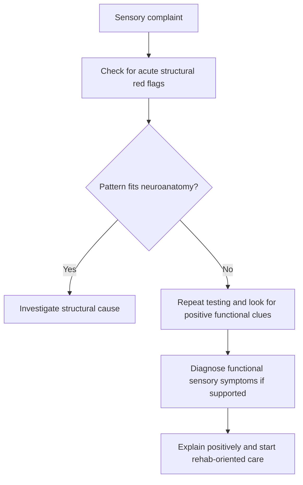

# Functional sensory symptoms

Related: [[../Neurology MOC|Neurology MOC]] · [[../Functional Neurological Disorder|Functional Neurological Disorder]] · [[Presentations|Presentations]] · [[Positive clinical signs supporting FND]] · [[Functional weakness]]

> [!important]
> Functional sensory symptoms are supported by **internal inconsistency, non-anatomical distribution, and incongruity with recognized sensory pathways**. They are genuine symptoms and should be explained positively, not dismissed.

## Learning Objectives
- Define functional sensory symptoms within [[Functional Neurological Disorder]].
- Recognize sensory patterns that suggest FND rather than structural disease.
- Distinguish functional sensory loss from cortical, spinal, root, plexus, peripheral nerve, and length-dependent neuropathic patterns.
- Apply a practical FCPS/MRCP approach to diagnosis and management.

## Definition
Functional sensory symptoms are sensory complaints such as numbness, altered sensation, heaviness, tingling, or loss of feeling occurring in the context of FND, where the symptoms are not adequately explained by structural neurological disease and examination shows **inconsistency or a non-neuroanatomical pattern** with positive features supporting a functional mechanism.

## Core Anatomy
- Somatic sensation is mediated through peripheral nerves, dorsal roots, spinal cord tracts, brainstem, thalamus, and sensory cortex.
- Structural disease usually follows a recognizable pattern such as dermatomal, peripheral nerve, hemisensory, stocking, or sensory level distribution.
- Functional symptoms often disregard these boundaries.

## Core Physiology
- Normal sensory experience depends on accurate signal transmission plus attentional interpretation.
- In FND, altered attention, expectation, body representation, and salience processing may distort sensory perception.
- Symptoms are real to the patient despite lack of structural pathway damage.

## Normal Values / Important Cut-offs
- No biomarker or cut-off confirms functional sensory symptoms.
- Diagnostic strength rests on positive examination findings and mismatch with known neuroanatomy.

## Classification
### By dominant complaint
- Numbness or sensory loss
- Tingling/paresthesia
- Hemisensory syndrome
- Heaviness or “dead limb” sensation
- Fluctuating visual, auditory, or bodily sensory distortion within FND spectrum

### By distribution
- Hemibody pattern with exact midline split
- Glove/stocking-like pattern without neuropathic logic
- Patchy inconsistent sensory loss
- Sensory change varying between repeat tests

## Etiology / Causes
Functional sensory symptoms are multifactorial and may be associated with:
- preceding pain, migraine, dizziness, injury, or frightening bodily symptoms
- health anxiety or heightened body vigilance
- stressors in some patients
- other functional symptoms such as weakness or non-epileptic attacks

## Risk Factors
- Prior functional symptoms
- Migraine, chronic pain, fatigue disorders
- Anxiety, depression, trauma history in some cases
- Previous neurological illness or investigation burden

## Pathophysiology
- Contemporary models emphasize abnormal top-down modulation, expectation, attention, and sensory prediction.
- Symptom persistence may be reinforced by fear, repeated checking, avoidance, and excessive testing.
- Incongruent sensory maps reflect altered processing rather than tract destruction.

## Clinical Features
- Numbness or reduced sensation without clear tract/nerve pattern
- Exact splitting at the midline of face or body
- Marked fluctuation over time
- Inconsistency between formal sensory testing and spontaneous use
- Associated functional weakness, gait disorder, dizziness, pain, or dissociative symptoms

## Approach / Algorithm
1. Clarify onset, progression, spread, triggers, and associated neurological symptoms.
2. Screen for emergencies: stroke, cord lesion, cauda equina, acute neuropathy, myelitis.
3. Map the sensory complaint carefully.
4. Ask whether the distribution follows a nerve, dermatome, hemisensory cortical pattern, or spinal level.
5. Repeat testing and look for inconsistency.
6. Identify positive functional clues such as exact midline splitting or changing boundaries.
7. Use targeted investigation if structural disease remains plausible.
8. Explain the diagnosis positively and plan multidisciplinary care.

## Investigations
### Targeted, not reflexive
- MRI brain/spine when structural disease is suggested by history/exam
- Blood tests guided by differential diagnosis, e.g. B12, glucose, inflammatory markers
- Nerve conduction studies if peripheral neuropathy is plausible

### Principle
- Normal tests alone do not prove FND.
- The diagnosis depends on the clinical pattern and positive signs.

## Interpretation Frameworks
### Pattern-recognition framework
Features supporting functional sensory symptoms:
- non-anatomical distribution
- exact midline split of trunk/face
- sharply demarcated borders that shift on retesting
- inconsistency between modalities or over time

### Differential pattern framework
- **Peripheral nerve lesion:** specific nerve territory
- **Radiculopathy:** dermatomal pattern with root symptoms
- **Myelopathy:** sensory level with UMN signs
- **Cortical/thalamic lesion:** hemisensory deficit with other focal features
- **Neuropathy:** stocking/glove pattern with neuropathic signs
- **Functional:** inconsistent, fluctuating, or non-physiological pattern

## Diagnosis
Diagnosis is clinical and positive. A practical diagnosis requires:
- sensory symptoms causing distress or disability
- mismatch with established neuroanatomical pathways
- internal inconsistency or positive functional signs
- no better structural explanation

## Differential Diagnosis
- Stroke or TIA
- Multiple sclerosis
- Transverse myelitis
- Peripheral neuropathy
- Radiculopathy
- Migraine aura
- Focal seizures with sensory symptoms
- Somatic symptom overlap due to pain/anxiety

## Tables / Comparison Charts
| Feature | Functional sensory symptoms | Peripheral neuropathy | Cortical hemisensory loss |
|---|---|---|---|
| Distribution | Non-anatomical/inconsistent | Length-dependent or nerve pattern | Hemibody/cortical pattern |
| Midline split | Can occur | Unusual | Uncommon exact split |
| Repeat testing | Variable | Consistent | Consistent |
| Associated signs | Other FND features | Reflex/sensory loss pattern | Other focal deficits |

## Management
### Core management
- Give a positive and validating explanation.
- Emphasize intact nervous-system structure where appropriate.
- Avoid repeated unnecessary tests once a confident diagnosis is established.
- Treat comorbid migraine, pain, mood symptoms, dizziness, or fatigue.
- Use physiotherapy/occupational therapy if functional disability is significant.

### Rehabilitation focus
- Symptom retraining and normalization of attention
- Functional activity-based therapy
- Psychological support when indicated
- Education about reversibility and relapse prevention

## Drug Interactions / Contraindications / Comorbidity Cautions
- No specific drug reverses functional sensory symptoms.
- Avoid indiscriminate neuropathic drugs unless a true neuropathic pain syndrome is present.
- Avoid reinforcing disability through unnecessary collars, splints, or repeated admissions unless clearly indicated.

## Procedures / Indications / Contraindications
- No procedural therapy is specific.
- Investigations should be indication-driven.

## Procedure Mini-Sections
### Sensory mapping examination
- **Indication:** any patient with altered sensation
- **Principle:** map modalities systematically and repeat to assess consistency
- **Supportive FND clue:** changing borders or non-anatomical distribution
- **Viva pearl:** exact splitting of the midline is a classic functional clue, though not absolutely exclusive.

## Complications
- Chronic disability and distress
- Repeated presentations and over-investigation
- Reinforced illness behavior
- Coexisting anxiety, pain, fatigue, or depression

## Red Flags / Emergencies
Do not miss:
- acute stroke syndrome
- sensory level with bladder/bowel symptoms
- progressive myelopathy
- acute inflammatory neuropathy
- optic neuritis or brainstem features suggesting demyelination

## Prognosis
- Better with early diagnosis, clear explanation, and functional rehabilitation.
- Worse with long symptom duration, persistent diagnostic uncertainty, and comorbid pain/fatigue syndromes.

## Topic Correlation
- Closely linked to [[Functional weakness]] and [[Positive clinical signs supporting FND]].
- Contrast with [[Functional vs structural clue pattern]] and [[Cortical vs brainstem vs spinal vs peripheral pattern]].

## Special Situations
- **Migraine aura overlap:** sensory symptoms may coexist; chronology matters.
- **Coexisting organic disease:** do not assume every symptom is functional.
- **Emergency stroke presentations:** sensory hemibody symptoms still require acute structural assessment if onset is sudden.

## FCPS/MRCP High-Yield Points
- Functional sensory symptoms are diagnosed by **positive mismatch with neuroanatomy**.
- Exact midline splitting is a classic clue.
- Symptoms are real, common, and often coexist with other FND manifestations.
- Over-investigation can worsen the illness course.

## Common Viva Questions
- What sensory patterns suggest functional neurological disorder?
- How do you distinguish functional hemisensory loss from thalamic stroke?
- Why is exact midline splitting often considered a functional clue?
- How would you explain functional numbness to a patient?

## Common Confusions / Exam Traps
- Mistaking all atypical sensory symptoms for anxiety without proper neurological examination.
- Missing demyelination, stroke, or myelopathy because symptoms seem unusual.
- Assuming normal MRI alone confirms the diagnosis.
- Giving a vague explanation that increases patient mistrust.

## Mnemonics
**SENSE FND**
- **S**plit midline
- **E**xam inconsistency
- **N**on-anatomical map
- **S**tructural disease still excluded when needed
- **E**xplain positively

## Mind Map
- Functional sensory symptoms
  - numbness/tingling
  - non-anatomical pattern
  - variable boundaries
  - exact midline split
  - positive diagnosis
  - explanation + rehab

## Flowchart

## Suggested Visuals / Image Notes
- Dermatomes vs functional midline split comparison
- Table of structural vs functional sensory patterns
- Sensory mapping bedside diagram

## Suggested Video References
- Clinical demonstration of functional sensory loss examination
- FND teaching video on positive signs and explanation
- Stroke mimic sensory presentations review

## One-Page Revision Summary
- Functional sensory symptoms = genuine altered sensation with **non-anatomical or inconsistent sensory pattern**.
- Key clues: exact midline split, changing boundaries, mismatch with nerve/root/tract pathways.
- Exclude urgent structural disease first, then diagnose positively and explain clearly.

## 24-Hour Recall Prompts
- Name 4 features supporting functional sensory symptoms.
- What structural differentials must be excluded in sudden hemisensory loss?
- Why is normal imaging alone not enough for diagnosis?
- How do you explain the diagnosis without dismissing symptoms?

## 7-Day / 15-Day / 30-Day Revision Tracker
- **Day 7:** Reproduce the sensory differential framework.
- **Day 15:** Compare functional hemisensory loss with thalamic stroke and myelopathy.
- **Day 30:** Practice a viva answer on positive signs and management.

## Must Know / Should Know / Nice to Know
### Must Know
- Non-anatomical/inconsistent pattern
- Midline splitting clue
- Positive explanation and targeted testing
### Should Know
- Overlap with migraine, pain, and other FND symptoms
- Coexisting organic disease possible
- Iatrogenic harm from repeated tests
### Nice to Know
- Cognitive neuroscience models of altered body representation

## My Weak Points
- Can I map structural sensory pathways confidently?
- Do I remember red flags that mandate imaging?
- Can I explain positive diagnosis without stigma?

## Self-Test Scorecard
- Pattern recognition /10
- Differential diagnosis /10
- Explanation skill /10
- Red-flag recall /10
- Viva confidence /10

## Exam Answer Modes
### Short note frame
Definition → positive clues → differentials → targeted investigations → explanation + MDT care.

### Viva frame
“Functional sensory symptoms are genuine sensory complaints due to functional neurological disorder. I look for inconsistency and non-anatomical patterns such as exact midline splitting, while excluding urgent structural causes like stroke, myelitis, or neuropathy. Management is based on explanation, reassurance, and rehabilitation rather than repeated investigations.”

## Summary
Functional sensory symptoms are a high-yield FND presentation characterized by **sensory change that does not obey recognized neuroanatomy and shows internal inconsistency**. They should be diagnosed positively, explained carefully, and managed with a rehabilitative approach.

## MCQs (10)
1. Which feature most strongly supports functional sensory symptoms?
   - A. Exact dermatome distribution
   - B. Exact peripheral nerve territory pattern
   - C. Inconsistent non-anatomical sensory loss
   - D. Sensory level with spasticity
   - E. Progressive distal wasting
2. A classic clue for functional sensory symptoms is:
   - A. Stocking neuropathy in diabetes
   - B. Midline splitting of sensory loss
   - C. Ophthalmoplegia
   - D. Fasciculation
   - E. Hypercalcemia
3. Which statement is correct?
   - A. Functional sensory symptoms are always fabricated
   - B. They are diagnosed only after every test is normal
   - C. They are genuine symptoms with positive clinical features
   - D. They always indicate peripheral neuropathy
   - E. They cannot coexist with migraine
4. Which differential is most urgent in sudden hemisensory loss?
   - A. Stroke
   - B. Psoriasis
   - C. GERD
   - D. Otitis media
   - E. Cataract
5. Which pattern best fits neuropathy rather than FND?
   - A. Fluctuating exact midline split
   - B. Inconsistent patchy numbness
   - C. Stable length-dependent stocking sensory loss
   - D. Different results on repeated testing
   - E. Abruptly changing border during examination
6. The best management principle is:
   - A. Reassure by saying nothing is wrong
   - B. Explain the diagnosis positively and avoid unnecessary tests
   - C. Start antibiotics routinely
   - D. Give steroids to all patients
   - E. Ignore the symptom if MRI is normal
7. Functional sensory symptoms may coexist with:
   - A. Other FND manifestations
   - B. Nothing else
   - C. Only meningitis
   - D. Only motor neuron disease
   - E. Only epilepsy
8. Which examination finding is least compatible with isolated FND and raises concern for structural disease?
   - A. Midline splitting
   - B. Fluctuation on repeat testing
   - C. Sensory level with UMN signs
   - D. Non-anatomical map
   - E. Variable boundaries
9. Which tool is most important at the bedside?
   - A. Careful sensory mapping
   - B. Routine liver biopsy
   - C. Colonoscopy
   - D. Echocardiography
   - E. Bone scan
10. Why should over-investigation be avoided once diagnosis is confident?
   - A. It may reinforce symptom persistence and uncertainty
   - B. It always proves malingering
   - C. It cures FND
   - D. It is illegal
   - E. It is unrelated to care

## SBA Questions (10)
1. A 24-year-old woman has sudden left-sided numbness. Examination shows exact splitting at the midline, changing with repeat testing, and no other focal signs. What is the most likely diagnosis?
2. A patient with numbness asks why imaging was not endlessly repeated. What is the best explanation?
3. A man presents with acute hemisensory symptoms and dysarthria. What must be excluded before diagnosing FND?
4. A patient’s sensory loss does not match any nerve, root, or tract pattern. What diagnosis becomes more likely?
5. In functional sensory symptoms, what does exact midline splitting suggest?
6. A patient has known migraine and functional symptoms. What key principle applies to sensory complaints?
7. Which bedside technique best supports diagnosis of functional sensory symptoms?
8. A patient with numbness also has bladder dysfunction and a sensory level. What is the best interpretation?
9. What is the most helpful initial treatment communication style?
10. Which long-term management approach is most appropriate when symptoms persist and impair function?

## Flashcards
- Q: What sensory pattern is a classic clue to FND?
  A: Exact midline splitting or non-anatomical inconsistent sensory loss.
- Q: Are functional sensory symptoms genuine?
  A: Yes.
- Q: What urgent diagnosis must be excluded in sudden hemisensory loss?
  A: Stroke.
- Q: Do normal tests alone diagnose FND?
  A: No.
- Q: What bedside method is essential?
  A: Careful repeat sensory mapping.

## Answer Key with Explanations
### MCQs
1. **C** — inconsistency and non-anatomical distribution support FND.
2. **B** — exact midline split is a classic clue.
3. **C** — symptoms are genuine and diagnosed positively.
4. **A** — stroke is the urgent structural mimic.
5. **C** — stable length-dependent loss suggests neuropathy.
6. **B** — clear positive explanation and avoidance of unnecessary testing are key.
7. **A** — other FND symptoms commonly coexist.
8. **C** — sensory level with UMN signs suggests myelopathy.
9. **A** — sensory mapping and repetition are central.
10. **A** — excessive testing can worsen uncertainty and reinforce symptoms.

### SBAs
1. Functional sensory symptoms.
2. Once positive features support FND and dangerous causes are excluded, repeated testing may do more harm than good.
3. Acute stroke.
4. Functional sensory symptoms / FND.
5. A positive functional clue suggesting mismatch with normal neuroanatomy.
6. Migraine and FND can coexist; chronology and examination matter.
7. Careful repeated sensory mapping to show inconsistency/non-anatomical pattern.
8. Structural spinal cord disease must be prioritized.
9. A validating positive explanation.
10. Multidisciplinary rehabilitative management.