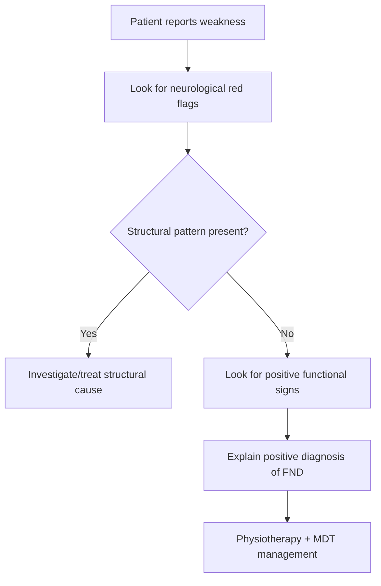

# Functional weakness

Related: [[../Neurology MOC|Neurology MOC]] · [[../Functional Neurological Disorder|Functional Neurological Disorder]] · [[Presentations|Presentations]] · [[Positive clinical signs supporting FND]]

> [!important]
> Functional weakness is a **positive clinical diagnosis**, not merely a diagnosis of exclusion. The examination aim is to identify **internal inconsistency** and **preserved automatic movement** while still remaining alert for structural neurological disease.

## Learning Objectives
- Define functional weakness within the spectrum of [[Functional Neurological Disorder]].
- Recognize bedside positive signs that support functional limb weakness.
- Distinguish functional weakness from corticospinal, peripheral nerve, NMJ, and myopathic weakness.
- Apply an FCPS/MRCP approach to explanation, investigation, and management.

## Definition
Functional weakness is a manifestation of **functional neurological disorder (FND)** in which a patient experiences genuine limb weakness or paralysis without a lesion pattern adequately explaining the deficit, and where examination demonstrates **incongruity with recognized neuroanatomical disease** together with positive clinical signs supporting a functional mechanism.

## Core Anatomy
- Voluntary movement depends on cortical motor planning, corticospinal output, basal ganglia modulation, cerebellar coordination, spinal motor pathways, peripheral nerves, NMJ, and muscle.
- In functional weakness, these structural pathways are usually intact, but motor performance becomes disrupted at the level of **attention, expectation, self-agency, and movement selection**.
- Automatic movement may be better preserved than deliberate testing.

## Core Physiology
- Normal movement requires integration of intention, motor planning, sensorimotor prediction, and execution.
- In FND, abnormal top-down processing, hypervigilance, altered prediction, and impaired sense of control can interfere with voluntary movement.
- The weakness is **real to the patient** and is not feigned, but it does not map consistently to structural pathway failure.

## Normal Values / Important Cut-offs
- There are no laboratory cut-offs for FND.
- Diagnostic strength depends on **positive clinical signs** rather than normal tests alone.
- Hoover’s sign, collapsing weakness, and inconsistency across tasks are clinically high-yield.

## Classification
### By distribution
- Monoparesis
- Hemiparesis
- Paraparesis
- Generalized subjective weakness

### By dominant context
- Sudden stroke-like presentation
- Chronic limb weakness
- Intermittent or fluctuating weakness
- Functional gait-associated weakness

## Etiology / Causes
FND is multifactorial rather than caused by a single lesion.
Contributing domains may include:
- triggering physical symptoms or injury
- previous neurological disease or health anxiety
- psychological stressors in some, but not all, patients
- maladaptive attention to bodily symptoms
- illness beliefs and prediction errors

## Risk Factors
- Female sex is commonly reported, though FND occurs in all sexes.
- History of migraine, pain, fatigue, anxiety, depression, trauma, or prior functional symptoms.
- Previous neurological event or frightening health experience.
- High symptom vigilance and repeated healthcare encounters.

## Pathophysiology
- Current models emphasize dysfunction of **brain network processing**, especially attention, salience attribution, motor intention, and agency.
- Symptoms may be reinforced by fear, avoidance, repeated testing, and invalidating explanations.
- Preserved automatic movement with impaired voluntary movement is a useful bedside clue.

## Clinical Features
- Limb weakness with variable severity
- Sudden onset resembling stroke is common
- Inconsistent performance during examination
- Give-way or collapsing weakness
- Discrepancy between bed examination and spontaneous movement
- Functional gait difficulty may coexist
- Sensory complaints, pain, fatigue, dissociative symptoms, or non-epileptic attacks may coexist

## Approach / Algorithm
1. Confirm the complaint, onset, distribution, fluctuation, and associated symptoms.
2. Screen urgently for structural red flags: acute stroke, cord compression, cauda equina, GBS, myasthenic crisis, toxic-metabolic causes.
3. Examine for positive functional signs:
   - Hoover’s sign
   - hip abductor sign where used
   - collapsing weakness
   - inconsistency across distraction or alternative tasks
4. Check whether the pattern matches neuroanatomy.
5. Use targeted investigations only when needed to exclude important mimics.
6. Explain positively: “the nervous system is not damaged, but it is not functioning normally.”
7. Refer for multidisciplinary management.

## Investigations
### Often limited and targeted
- MRI brain/spine only if history/exam suggests structural disease
- Routine blood tests guided by differential diagnosis
- Neurophysiology in selected cases if neuropathy, NMJ disease, or myopathy is plausible

### Why not over-investigate?
- Repeated normal tests do not themselves diagnose FND.
- Excess investigation may reinforce illness behavior and uncertainty.

## Interpretation Frameworks
### Positive-sign framework
Support FND when weakness shows:
- inconsistency over time
- inconsistency between direct testing and functional tasks
- preserved automatic movement
- non-anatomical distribution

### Differential framework
- **UMN weakness:** pyramidal pattern, hyperreflexia, extensor plantar response
- **LMN/peripheral weakness:** reduced reflexes, atrophy, fasciculation, nerve pattern
- **Myopathy:** proximal weakness, preserved sensation, myopathic pattern
- **NMJ disorder:** fatigability, ocular/bulbar fluctuation
- **Functional weakness:** inconsistency, Hoover’s sign positivity, preserved automatic movement

## Diagnosis
Diagnosis is clinical and should be based on **positive features**, not simply on “nothing found.”
A practical diagnosis requires:
- symptoms of weakness
- examination incongruent with recognized structural disease
- positive bedside signs supporting FND
- no stronger competing neurological diagnosis

## Differential Diagnosis
- Ischemic stroke or TIA
- Multiple sclerosis relapse
- Spinal cord compression
- Peripheral neuropathy or radiculopathy
- Myasthenia gravis
- Myopathy
- Periodic paralysis
- Malingering/factitious disorder only if evidence supports intentional deception; do not assume this

## Tables / Comparison Charts
| Feature | Functional weakness | UMN weakness | LMN weakness |
|---|---|---|---|
| Pattern consistency | Variable/inconsistent | Consistent | Consistent |
| Neuroanatomical fit | Poor | Good | Good |
| Automatic movement | May be preserved | Impaired | Impaired |
| Reflexes | Usually normal | Often brisk | Often reduced |
| Hoover’s sign | May be positive | Negative | Negative |

## Management
### Core principles
- Give a clear, validating diagnosis.
- Emphasize that symptoms are real and potentially reversible.
- Avoid saying “nothing is wrong.”
- Use physiotherapy focused on normal movement retraining.
- Address pain, sleep, anxiety, depression, and fatigue.

### Rehabilitation
- Functional physiotherapy emphasizing automatic movement
- Occupational therapy for function and pacing
- Psychological therapy when relevant, especially CBT-informed approaches
- Multidisciplinary review in complex cases

## Drug Interactions / Contraindications / Comorbidity Cautions
- There is no specific drug treatment for functional weakness itself.
- Avoid escalating analgesics, sedatives, or unnecessary steroids without indication.
- Treat comorbid mood disorder, migraine, sleep disorder, or chronic pain appropriately.

## Procedures / Indications / Contraindications
- No procedure treats functional weakness directly.
- Investigations should be targeted, not reflexive.

## Procedure Mini-Sections
### Hoover’s sign
- **Indication:** suspected unilateral functional leg weakness
- **Principle:** involuntary hip extension in the “weak” leg is felt when the opposite leg flexes against resistance
- **Interpretation:** preserved automatic output supports FND
- **Viva pearl:** a positive Hoover’s sign is supportive, not a trick to “catch” the patient.

## Complications
- Disability and deconditioning
- Falls
- Iatrogenic harm from repeated admissions or unnecessary procedures
- Chronic pain, fatigue, mood disorder, social and occupational impairment

## Red Flags / Emergencies
Do not miss:
- hyperacute stroke syndrome
- sphincter disturbance or cord compression clues
- progressive objective UMN/LMN findings
- bulbar/respiratory weakness
- severe metabolic disturbance

## Prognosis
- Better with early diagnosis, clear explanation, and specialist rehabilitation.
- Worse with long symptom duration, entrenched disability, major psychiatric comorbidity, and repeated contradictory medical messaging.

## Topic Correlation
- Builds toward [[Positive clinical signs supporting FND]].
- Compare with [[Functional sensory symptoms]] and [[Dissociative and non-epileptic attacks]].
- Contrast with [[UMN vs LMN pattern]] and [[Functional vs structural clue pattern]].

## Special Situations
- **Stroke mimic presentation:** common and must be assessed carefully.
- **Children/adolescents:** family explanation and school reintegration matter.
- **Comorbid organic disease:** FND can coexist with real neurological illness.

## FCPS/MRCP High-Yield Points
- Functional weakness is diagnosed by **positive signs**.
- Hoover’s sign is a classic exam favorite.
- Symptoms are genuine and not simply fabricated.
- Explanation quality strongly influences outcome.

## Common Viva Questions
- What is Hoover’s sign?
- Why is FND not purely a diagnosis of exclusion?
- How do you explain functional weakness to a patient?
- How do you distinguish functional hemiparesis from stroke?

## Common Confusions / Exam Traps
- Calling the patient malingering without evidence.
- Saying “all tests are normal, so it is psychological.”
- Missing coexisting structural disease.
- Over-investigating after clear positive signs are found.

## Mnemonics
**FND WEAK**
- **W**eakness is real
- **E**xam inconsistency
- **A**utomatic movement preserved
- **K**ey positive signs support diagnosis

## Mind Map
- Functional weakness
  - real symptom
  - inconsistent exam
  - Hoover’s sign
  - poor anatomical fit
  - targeted investigations
  - explanation + rehab

## Flowchart

## Suggested Visuals / Image Notes
- Diagram of Hoover’s sign
- Comparison chart: functional vs UMN vs LMN weakness
- Functional movement retraining diagram

## Suggested Video References
- Bedside demonstration of Hoover’s sign
- FND explanation videos for clinicians
- Functional neurological disorder rehabilitation overview

## One-Page Revision Summary
- Functional weakness = genuine weakness with **positive signs of inconsistency** and preserved automatic movement.
- Key exam clues: Hoover’s sign, collapsing weakness, task inconsistency, non-anatomical distribution.
- Diagnose positively, exclude urgent mimics, explain clearly, treat with rehab not repeated tests.

## 24-Hour Recall Prompts
- Define functional weakness in one sentence.
- What is Hoover’s sign?
- Name 4 differentials of functional hemiparesis.
- How would you explain the diagnosis to a patient?

## 7-Day / 15-Day / 30-Day Revision Tracker
- **Day 7:** Reproduce bedside signs from memory.
- **Day 15:** Compare functional weakness with stroke and myasthenia.
- **Day 30:** Deliver a 2-minute viva answer on diagnosis and management.

## Must Know / Should Know / Nice to Know
### Must Know
- Positive signs, not exclusion alone
- Hoover’s sign
- Clear explanation and rehab
### Should Know
- Network/agency model
- Coexisting organic disease possibility
- Iatrogenic harm risk
### Nice to Know
- Detailed neurocognitive models of symptom generation

## My Weak Points
- Can I state positive diagnostic signs confidently?
- Do I remember to exclude stroke/cord emergencies first?
- Can I explain it without stigmatizing language?

## Self-Test Scorecard
- Recognition /10
- Differential diagnosis /10
- Bedside sign recall /10
- Explanation skill /10
- Viva confidence /10

## Exam Answer Modes
### Short note frame
Definition → positive signs → differentials → explanation → physiotherapy/MDT.

### Viva frame
“Functional weakness is a genuine limb weakness due to functional neurological disorder. I diagnose it using positive signs such as Hoover’s sign and inconsistency, while excluding urgent structural disease. Management centers on explanation, physiotherapy, and multidisciplinary rehabilitation.”

## Summary
Functional weakness is a common and high-yield FND presentation. The examination should seek **positive inconsistency and preserved automatic movement**, and management should be **validating, targeted, and rehabilitative**.

## MCQs (10)
1. Functional weakness is best diagnosed by:
   - A. Normal MRI alone
   - B. Positive clinical signs of inconsistency
   - C. Psychiatric history only
   - D. Absent reflexes
   - E. Elevated CK
2. Hoover’s sign is most useful in assessing:
   - A. Functional leg weakness
   - B. Optic neuritis
   - C. Meningism
   - D. Ataxia
   - E. Aphasia
3. Which feature favors functional weakness over UMN weakness?
   - A. Extensor plantar response
   - B. Consistent pyramidal pattern
   - C. Preserved automatic movement with inconsistent effort
   - D. Hyperreflexia
   - E. Spasticity
4. Which statement is correct?
   - A. Functional weakness means the patient is pretending
   - B. It is a positive clinical diagnosis
   - C. It cannot coexist with organic disease
   - D. It always requires extensive repeated testing
   - E. It is a muscle disease
5. The best initial explanation is:
   - A. Nothing is wrong
   - B. It is definitely malingering
   - C. The nervous system is not damaged but is not functioning normally
   - D. It is untreatable
   - E. It is only stress
6. Which is an important emergency differential in sudden unilateral weakness?
   - A. Stroke
   - B. Acne
   - C. Otitis externa
   - D. GERD
   - E. Cataract
7. A common harm in FND is:
   - A. Iatrogenic over-investigation
   - B. Neutropenia
   - C. Aortic dissection
   - D. Hemarthrosis
   - E. Portal hypertension
8. Functional weakness often shows:
   - A. Strict nerve-root pattern
   - B. Consistent corticospinal findings
   - C. Variability across tasks
   - D. Marked fasciculation
   - E. Severe CK rise
9. Which treatment approach is most appropriate?
   - A. Long-term steroids routinely
   - B. Physiotherapy with movement retraining
   - C. Antibiotics
   - D. Anticoagulation in all cases
   - E. Bed rest indefinitely
10. Which statement about FND is true?
   - A. Diagnosis must wait until every test in neurology is normal
   - B. Positive examination findings are central
   - C. Symptoms are always voluntary
   - D. It never improves
   - E. It is outside neurology practice

## SBA Questions (10)
1. A 28-year-old woman presents with sudden left leg weakness. MRI is normal. On testing right hip flexion against resistance, left hip extension is felt. What is the most likely diagnosis?
2. A patient with suspected functional hemiparesis is being examined. Which bedside sign most strongly supports the diagnosis?
3. A patient asks whether the doctor thinks the weakness is fake. What is the best response?
4. A man with apparent leg weakness has brisk reflexes and extensor plantar response. What is the best interpretation?
5. In functional weakness, what management step most improves engagement and prognosis early?
6. A patient with FND has persistent disability and chronic pain. What style of care is most appropriate?
7. Which feature most distinguishes functional weakness from myopathy?
8. A patient has functional weakness and known multiple sclerosis. What key principle applies?
9. Which investigation strategy is usually best in classic functional weakness with positive signs and no red flags?
10. A trainee says FND is just a diagnosis of exclusion. What is the best correction?

## Flashcards
- Q: Is functional weakness a positive diagnosis or only a diagnosis of exclusion?
  A: A positive diagnosis.
- Q: What classic bedside sign supports functional leg weakness?
  A: Hoover’s sign.
- Q: Can FND coexist with organic neurological disease?
  A: Yes.
- Q: What is a major management pillar?
  A: Clear explanation plus physiotherapy-based rehabilitation.
- Q: What exam theme supports FND?
  A: Inconsistency with preserved automatic movement.

## Answer Key with Explanations
### MCQs
1. **B** — positive signs are central.
2. **A** — Hoover’s sign is classic for functional leg weakness.
3. **C** — preserved automatic movement with inconsistent voluntary testing supports FND.
4. **B** — FND is a positive clinical diagnosis.
5. **C** — validating and mechanistic explanation is best.
6. **A** — stroke must be excluded in sudden weakness.
7. **A** — iatrogenic harm is common.
8. **C** — variability across tasks is typical.
9. **B** — physiotherapy-based functional retraining is key.
10. **B** — diagnosis depends on positive findings, not exhaustive exclusion.

### SBAs
1. Functional weakness.
2. Hoover’s sign / inconsistency with preserved automatic movement.
3. Explain that the symptom is real and due to abnormal nervous-system functioning, not damage or faking.
4. Structural UMN disease is more likely; do not label as isolated FND.
5. A clear positive explanation of the diagnosis.
6. Multidisciplinary rehabilitation.
7. Inconsistency and preserved automatic movement rather than a fixed proximal myopathic pattern.
8. Functional and organic disease can coexist.
9. Targeted limited investigation.
10. FND should be diagnosed using positive clinical signs.

## PasTest Scenario SBAs (Clinical Vignettes)

> **Auto-generated PasTest/Mediscope-style scenario SBAs** grounded in the authored source. Each scenario tests a real clinical fact (triad, specific sign, contraindication, trial, first-line Rx) extracted from the topic. *Source: Ch 27: Neurology & Stroke — Functional weakness*

**Q1.** What is the most appropriate first-line therapy for Functional weakness?

  - **A.** Give a clear, validating diagnosis
  - **B.** An advanced/surgical therapy reserved for refractory disease
  - **C.** Symptomatic treatment only, no disease-modifying therapy
  - **D.** Empiric broad-spectrum therapy without specific indication

  > **Answer: A** — Give a clear, validating diagnosis
  >
  > *Source:* Give a clear, validating diagnosis.

