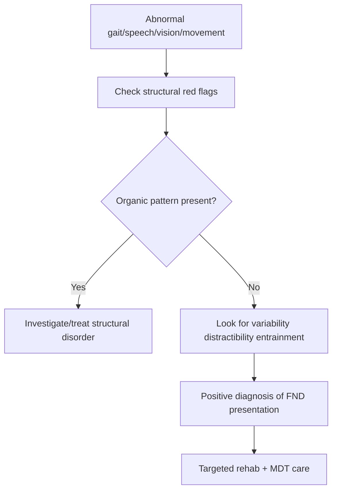

# Gait, speech, visual, and movement presentations

Related: [[../Neurology MOC|Neurology MOC]] · [[../Functional Neurological Disorder|Functional Neurological Disorder]] · [[Presentations|Presentations]] · [[Positive clinical signs supporting FND]] · [[Common mimics to avoid missing]]

> [!important]
> Functional neurological disorder can present with **abnormal gait, speech disturbance, visual symptoms, tremor, dystonia-like posturing, and other movement phenomena**. The key examination principle is to look for **internal inconsistency, distractibility, variability, and mismatch with recognized structural neuroanatomy or movement-disorder phenomenology**.

## Learning Objectives
- Recognize major gait, speech, visual, and movement presentations of FND.
- Identify positive bedside clues supporting a functional mechanism.
- Differentiate these presentations from cerebellar, extrapyramidal, vestibular, neuromuscular, and ocular structural disease.
- Outline targeted investigations and management.

## Definition
These presentations are manifestations of FND in which a patient develops **abnormal movement or impaired neurological function** affecting gait, speech, vision, or complex motor behavior, but the pattern demonstrates **positive inconsistency or incongruity** with known structural neurological disease.

## Core Anatomy
- Gait integrates cortex, basal ganglia, cerebellum, brainstem, vestibular pathways, peripheral nerves, and musculoskeletal function.
- Speech production requires cortical language/motor planning, bulbar musculature, and respiratory coordination.
- Vision depends on ocular structures, optic nerves, visual pathways, and cortical processing.
- Movement disorders involve basal ganglia-cerebellar-cortical networks.
- In functional presentations these structures are usually not damaged in a pattern that explains the symptom.

## Core Physiology
- Normal movement requires automatic scaling, timing, and sensorimotor prediction.
- Functional symptoms often worsen with self-focused attention and improve with distraction or automatic movement.
- Abnormal beliefs, threat processing, altered agency, and movement monitoring contribute to symptom generation.
- The patient is symptomatic and impaired, but not displaying a lesion-pattern deficit.

## Main Presentation Types
### Functional gait disorder
- excessive slowness
- knee buckling without true falls
- variable base or dramatic swaying
- astasia-abasia pattern
- gait worse during direct observation than during automatic tasks

### Functional speech disorder
- dysphonia, whispering, stuttering-like dysfluency
- variable articulation difficulty
- inconsistently effortful speech
- preserved spontaneous speech elements despite impaired formal testing

### Functional visual symptoms
- blurred vision
- tunnel vision
- variable diplopia-like complaints
- non-anatomical visual loss inconsistent with optic pathway disease

### Functional movement disorder
- tremor, jerks, dystonia-like postures, gait freezing, bizarre slowness
- distractibility and entrainment in tremor are especially high-yield clues

## Positive Clinical Clues
- variability over time
- inconsistency between examination tasks
- improvement with distraction or automatic action
- poor fit with known anatomical/pathophysiological pattern
- apparent severe impairment with preserved balance/protection in some contexts
- preserved underlying strength when symptoms seem dramatic

## Risk Factors / Associations
- chronic pain, fatigue, migraine
- prior physical injury or illness trigger
- anxiety, depression, trauma, dissociation in some patients
- other FND symptoms such as weakness, sensory change, or non-epileptic attacks

## Pathophysiology
- Disturbance in attention, salience, expectation, and sense of agency.
- Symptom-focused monitoring interferes with automatic movement.
- Reinforcement by fear, avoidance, repeated testing, and inconsistent explanations may perpetuate disability.

## Clinical Features
### Functional gait
- uneconomic or bizarre gait pattern
- sudden knee buckling without true traumatic falls
- excessive arm posturing or dramatic lurching
- marked impairment in clinic but better transfer ability

### Functional speech
- inconsistent dysarthria-like output
- whispering dysphonia with preserved cough or throat-clear
- stammering that changes with task or distraction

### Functional visual symptoms
- tubular/tunnel visual field on confrontation
- inconsistent acuity performance
- normal navigation despite claimed severe loss

### Functional movement presentations
- tremor changing frequency with entrainment tasks
- distractible jerks
- fixed dystonia-like postures with inconsistency
- mixed phenomenology not fitting a single organic syndrome

## Approach / Algorithm
1. Define the dominant symptom: gait, speech, visual, tremor, dystonia, jerks, etc.
2. Screen for structural red flags: cerebellar syndrome, parkinsonism, myelopathy, MG, optic neuritis, stroke, vestibular syndrome.
3. Examine for positive functional signs such as distractibility, variability, entrainment, preserved automatic function.
4. Check for mismatch with anatomical pathways or recognized movement-disorder phenomenology.
5. Use targeted investigations only when structural disease remains plausible.
6. Explain the diagnosis positively and link symptoms to reversible nervous-system dysfunction.
7. Start physiotherapy/speech therapy/psychological and multidisciplinary management as appropriate.

## Investigations
### Usually targeted rather than exhaustive
- MRI brain/spine if history/exam suggests structural cause
- Vestibular evaluation when true vestibular syndrome suspected
- Ophthalmology/visual pathway tests if optic or ocular disease is possible
- Neurophysiology when tremor or jerks require clarification
- Routine labs guided by differential

## Interpretation Frameworks
### Functional gait vs cerebellar/vestibular gait
| Feature | Functional gait | Cerebellar/vestibular/neuropathic gait |
|---|---|---|
| Variability | Marked | Usually consistent |
| Falls | Dramatic near-falls, often protected | Unprotected true falls may occur |
| Distraction effect | May improve | Usually little improvement |
| Neuro signs | Often absent/inconsistent | Often present |

### Functional tremor clues
- distractible
- variable amplitude/frequency
- entrainment with rhythmic contralateral tapping
- pauses or changes with attention shifts

### Functional speech clues
- inconsistency across spontaneous vs formal speech tasks
- mismatch with bulbar weakness signs
- preserved automatic vocalization/cough

### Functional visual clues
- tubular fields
- incongruent acuity loss
- normal optokinetic or navigational behavior despite reported severe loss

## Diagnosis
Diagnosis is based on **positive signs of inconsistency and incongruity** within the specific domain affected. It should not rely solely on normal imaging. The clinician should name the presentation clearly, such as functional gait disorder or functional tremor, within FND.

## Differential Diagnosis
- Cerebellar ataxia
- Parkinson disease or atypical parkinsonism
- Dystonia or essential tremor
- Myelopathy
- Vestibular neuritis / central vertigo
- Myasthenia gravis affecting speech or ocular function
- Optic neuritis / retinal disease / occipital pathology
- Drug-induced movement disorder

## Management
### Core principles
- Give a specific positive diagnosis.
- Demonstrate positive signs when useful for explanation.
- Emphasize reversibility and retraining potential.
- Avoid repeated unnecessary investigations once confident.

### Symptom-focused rehabilitation
- Functional physiotherapy for gait and movement retraining
- Speech and language therapy for voice/speech symptoms
- Occupational therapy for functional adaptation
- Psychology/CBT-informed therapy when relevant
- Treatment of pain, fatigue, migraine, anxiety, depression, sleep disorder

## Drug / Treatment Cautions
- No single drug treats FND gait/speech/visual/movement symptoms directly.
- Avoid unnecessary dopaminergic drugs, steroids, anticholinergics, or sedatives without indication.
- Treat comorbid organic disease if present.

## Procedures / Bedside Signs
### Tremor entrainment test
- **Principle:** functional tremor changes frequency to match voluntary rhythm in another limb.
- **Interpretation:** supports functional tremor.

### Distractibility testing
- Observe whether symptom lessens when patient performs another task.
- Improvement supports a functional mechanism.

## Complications
- Falls and fear of falling
- Work and mobility disability
- Social embarrassment from speech/visual/movement symptoms
- Iatrogenic harm from repeated admissions/tests
- Secondary deconditioning

## Red Flags / Emergencies
Do not miss:
- acute stroke or brainstem syndrome
- acute cerebellar syndrome
- myelopathy with sphincter involvement
- optic neuritis or true monocular visual loss
- myasthenic crisis/bulbar weakness
- toxic or drug-induced movement disorder

## Prognosis
- Better with early diagnosis and therapy focused on normal movement retraining.
- Worse with chronic disability, contradictory medical advice, severe psychiatric or pain comorbidity, and avoidance behavior.

## Topic Correlation
- Functional gait and tremor often coexist with [[Functional weakness]] and [[Functional sensory symptoms]].
- Diagnostic logic overlaps with [[Why FND is not purely a diagnosis of exclusion]].
- Safety net overlaps with [[Common mimics to avoid missing]].

## Special Situations
- **Wheelchair or walking-aid dependence:** careful graded physiotherapy matters.
- **Visual symptom cases:** must distinguish binocular functional complaints from true monocular ocular disease.
- **Voice cases:** preserved cough can help distinguish functional dysphonia from structural laryngeal weakness.

## FCPS/MRCP High-Yield Points
- Functional gait and functional tremor are classic exam topics.
- Distractibility, variability, and entrainment are key bedside clues.
- Symptoms are genuine and may be highly disabling.
- Use targeted investigations only when red flags or structural clues exist.

## Common Viva Questions
- What features support functional tremor?
- How do you distinguish functional gait disorder from cerebellar ataxia?
- What is entrainment?
- How do you evaluate functional visual complaints?

## Common Confusions / Exam Traps
- Labeling bizarre gait as functional without checking for myelopathy/cerebellar signs.
- Calling variable speech “psychogenic” without examining bulbar function.
- Missing optic neuritis or ocular pathology.
- Over-relying on normal imaging instead of positive signs.

## Mnemonics
**VARIES**
- **V**ariable pattern
- **A**utomatic function relatively preserved
- **R**ed flags excluded
- **I**nconsistent across tasks
- **E**ntrainable/distractible movement
- **S**pecific positive diagnosis

## Mind Map
- FND presentations
  - gait disorder
  - speech disorder
  - visual symptoms
  - tremor/jerks/dystonia-like features
  - variability + distractibility
  - rehab-based care

## Flowchart

## Suggested Visuals / Image Notes
- Tremor entrainment test diagram
- Functional gait vs cerebellar gait table
- Tunnel vision visual-field sketch

## One-Page Revision Summary
- FND may present with gait, speech, visual, tremor, dystonia-like, and mixed movement symptoms.
- Positive clues: **variability, distractibility, entrainment, inconsistency, poor anatomical fit**.
- Exclude red-flag structural disease first.
- Explain positively and use targeted rehabilitation, not endless testing.

## 24-Hour Recall Prompts
- Name 4 positive signs of functional movement disorder.
- What is tremor entrainment?
- Which red flags make you worry about structural disease?
- How does functional gait differ from cerebellar gait?

## 7-Day / 15-Day / 30-Day Revision Tracker
- **Day 7:** Memorize functional tremor clues.
- **Day 15:** Compare functional gait vs cerebellar/vestibular gait.
- **Day 30:** Deliver a viva answer on functional movement presentations.

## Must Know / Should Know / Nice to Know
### Must Know
- Variability/distractibility/entrainment
- Red-flag exclusion
- Specific positive diagnosis
### Should Know
- Speech and visual variants
- Preserved automatic behaviors
- Rehabilitation principles
### Nice to Know
- Advanced network models of agency and attention

## My Weak Points
- Can I name positive signs for each domain?
- Do I remember key organic mimics?
- Can I explain functional gait/tremor clearly and non-judgmentally?

## Self-Test Scorecard
- Pattern recognition /10
- Differential safety /10
- Bedside signs /10
- Viva confidence /10

## Exam Answer Modes
### Short note frame
Definition → examples → positive signs → differentials → management.

### Viva frame
“Functional neurological disorder may present with abnormal gait, tremor, speech, visual symptoms, or other movement phenomena. I diagnose it by positive clues such as variability, distractibility, entrainment, preserved automatic function, and mismatch with structural neuroanatomy, while excluding red-flag disorders like cerebellar disease, myelopathy, MG, and optic neuritis.”

## Summary
Gait, speech, visual, and movement presentations are common and high-yield forms of FND. The clinician should seek **positive phenomenological clues**, protect against missed structural disease, and prioritize **clear explanation with domain-specific rehabilitation**.

## MCQs (10)
1. A key bedside sign supporting functional tremor is:
   - A. Entrainment
   - B. Babinski sign
   - C. Ophthalmoplegia
   - D. Jaw clonus
   - E. Kayser-Fleischer ring
2. Which feature favors functional gait disorder?
   - A. Consistent cerebellar broad-based gait
   - B. Dramatic swaying with preserved ability to avoid injury
   - C. Sensory ataxia with Romberg positivity
   - D. Fixed spastic scissoring gait
   - E. Festinating gait
3. A patient whispers but coughs strongly and normally. This favors:
   - A. Bulbar palsy
   - B. Functional speech disorder
   - C. Myasthenic crisis
   - D. Progressive MND
   - E. Brainstem stroke
4. Which visual symptom pattern is a classic functional clue?
   - A. Relative afferent pupillary defect
   - B. Monocular field defect fitting retina
   - C. Tubular tunnel vision
   - D. Optic disc swelling
   - E. Homonymous hemianopia
5. Which principle is correct?
   - A. Normal imaging alone proves FND
   - B. FND is diagnosed by positive inconsistency and incongruity
   - C. Functional tremor never improves with distraction
   - D. Speech symptoms exclude FND
   - E. Visual symptoms are always ocular
6. Which diagnosis must be excluded in acute gait ataxia with vomiting and nystagmus?
   - A. Cerebellar stroke
   - B. Psoriasis
   - C. IBS
   - D. Acne
   - E. Cataract
7. Distractibility means:
   - A. Symptom worsens with distraction in all cases
   - B. Symptom may lessen when attention is diverted
   - C. MRI is abnormal
   - D. Patient is feigning illness
   - E. EEG is epileptiform
8. Which management is best after confident diagnosis?
   - A. Endless repeat scans
   - B. Positive explanation and focused rehabilitation
   - C. Mandatory antipsychotics
   - D. Surgical treatment
   - E. Long-term steroids routinely
9. Which feature suggests structural myelopathy rather than isolated functional gait disorder?
   - A. Variability
   - B. Preserved automatic balance
   - C. Sphincter symptoms with UMN signs
   - D. Entrainment
   - E. Distractibility
10. Functional movement symptoms are often associated with:
   - A. Other FND symptoms
   - B. Nothing else ever
   - C. Only cancer
   - D. Only meningitis
   - E. Only myopathy

## SBA Questions (10)
1. A patient has coarse tremor that changes frequency to match contralateral tapping. What is the most likely diagnosis?
2. A woman has dramatic swaying gait but rarely falls and walks better when distracted. What does this suggest?
3. A man with sudden dysphonia has normal cough and inconsistent speech impairment. What diagnosis becomes likely?
4. A patient claims severe visual loss but navigates the room easily and has tubular fields. What is the likely interpretation?
5. Which dangerous diagnosis must be excluded in acute truncal ataxia with headache?
6. What bedside sign most supports functional tremor?
7. Why should you avoid repeated investigations once the diagnosis is confident?
8. Which therapy is most relevant to functional gait disorder?
9. What exam principle links gait, speech, visual, and movement FND symptoms?
10. What is the best communication approach after diagnosis?

## Flashcards
- Q: Classic bedside sign of functional tremor?
  A: Entrainment.
- Q: What 3 exam themes support FND movement symptoms?
  A: Variability, distractibility, inconsistency.
- Q: A classic functional visual clue?
  A: Tubular/tunnel vision.
- Q: Functional speech clue?
  A: Variable dysphonia with preserved cough.
- Q: Main management principle?
  A: Positive explanation plus rehabilitation.

## Answer Key with Explanations
### MCQs
1. **A** — entrainment is classic for functional tremor.
2. **B** — dramatic swaying with protected near-falls supports functional gait disorder.
3. **B** — preserved cough with variable dysphonia suggests functional speech disorder.
4. **C** — tubular tunnel vision is a functional clue.
5. **B** — diagnosis is positive, not normal-imaging-only.
6. **A** — cerebellar stroke is an important emergency.
7. **B** — symptoms may lessen when attention is diverted.
8. **B** — focused rehabilitation is central.
9. **C** — sphincter symptoms with UMN signs suggest structural disease.
10. **A** — multiple FND manifestations often coexist.

### SBAs
1. Functional tremor / functional movement disorder.
2. Functional gait disorder.
3. Functional speech disorder.
4. Functional visual symptom pattern.
5. Cerebellar stroke or other acute posterior fossa lesion.
6. Entrainment/distractibility.
7. Because over-investigation reinforces disability and uncertainty.
8. Functional physiotherapy and movement retraining.
9. Internal inconsistency and incongruity with known neuroanatomy.
10. Give a validating positive diagnosis with explanation of reversibility.