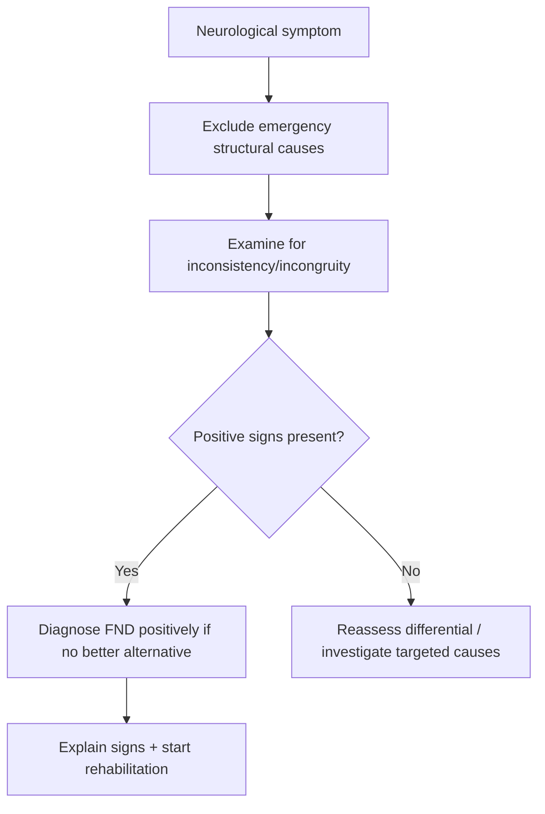

# Positive clinical signs supporting FND

Related: [[../Neurology MOC|Neurology MOC]] · [[../Functional Neurological Disorder|Functional Neurological Disorder]] · [[Diagnosis|Diagnosis]] · [[Why FND is not purely a diagnosis of exclusion]] · [[Common mimics to avoid missing]]

> [!important]
> FND is diagnosed by **positive clinical features** showing **internal inconsistency**, **incongruity with recognized neurological disease**, and sometimes **preserved automatic function**. These signs are supportive bedside findings, not “tricks” to catch the patient out.

## Learning Objectives
- Define what is meant by a positive diagnostic sign in FND.
- List common positive clinical signs across weakness, sensory loss, tremor, gait, and non-epileptic attacks.
- Apply an exam-oriented framework that remains safe and non-stigmatizing.

## Definition
A positive clinical sign supporting FND is a bedside finding that demonstrates **mismatch with structural neurological disease**, **variation across tasks or time**, or **preserved function in automatic contexts** despite impaired voluntary performance.

## Core Concepts
### 1. Internal inconsistency
- The same function differs across repeated testing or different tasks.
- Example: weakness on direct testing but better power during automatic movement.

### 2. Incongruity
- The symptom pattern does not fit known neuroanatomy or classical disease phenomenology.
- Example: exact midline splitting of hemisensory loss.

### 3. Preserved automatic function
- Automatic or distracted performance is better than deliberate tested performance.
- Example: positive Hoover’s sign.

## Why these signs matter
- They allow a **positive neurologic diagnosis**.
- They reduce dependence on endless exclusionary testing.
- They improve explanation because the clinician can show what is functioning normally.
- They support rehabilitation by demonstrating reversibility potential.

## Important Positive Signs by Domain
### Functional weakness
- **Hoover’s sign**: involuntary hip extension in the “weak” leg during contralateral hip flexion.
- **Collapsing/give-way weakness**.
- Inconsistency between bed testing and spontaneous movement.
- Non-anatomical distribution of weakness.

### Functional sensory symptoms
- Exact midline splitting of facial/body sensory loss.
- Sensory loss not fitting root, nerve, or tract anatomy.
- Boundaries that shift on repeat testing.
- Inconsistency across modalities or repeated examination.

### Functional tremor / movement disorder
- **Distractibility**.
- **Entrainment** to the rhythm of a contralateral task.
- Variability in amplitude and frequency.
- Mixed phenomenology or abrupt changes not fitting organic tremor syndromes.

### Functional gait disorder
- Dramatic swaying or buckling with preserved recovery.
- Marked variability across settings.
- Better automatic gait than observed deliberate gait.
- Uneconomic but surprisingly protected movement pattern.

### Functional speech disorder
- Variable dysphonia/dysarthria.
- Preserved cough or throat-clear despite severely impaired voice.
- Inconsistency between spontaneous and formal speech tasks.

### Functional visual symptoms
- Tubular/tunnel visual fields.
- Inconsistent acuity performance.
- Reported severe impairment with preserved navigation/behavior.

### Dissociative/non-epileptic attacks
- Prolonged fluctuating course.
- Eye closure during apparent generalized event.
- Asynchronous movements.
- Lack of epileptiform correlate during habitual event capture on video-EEG.

## How to Examine Safely
1. First ask: could this be stroke, cord compression, myasthenia, optic neuritis, cerebellar syndrome, or another emergency?
2. Then test for positive functional signs in a calm, transparent manner.
3. Repeat tasks or vary context to assess consistency.
4. Interpret findings within the whole clinical picture.
5. Explain the meaning of positive signs respectfully.

## Investigations and the Positive-Sign Framework
- Investigations support safety when structural disease is possible.
- Normal tests alone do not diagnose FND.
- Positive signs plus absence of a better structural explanation make the diagnosis stronger.
- Over-investigation after clear positive signs may worsen outcomes.

## Diagnostic Interpretation Framework
| Question | If yes, what does it suggest? |
|---|---|
| Is the sign internally inconsistent? | Functional mechanism more likely |
| Does the pattern fit known neuroanatomy? | If no, FND favored |
| Is automatic function preserved? | Strongly supportive of FND |
| Are objective UMN/LMN/cranial/ocular red flags present? | Structural disease must be reconsidered |

## Differential Diagnosis Safeguards
Positive signs support FND, but do not excuse missing:
- acute stroke
- myelopathy
- myasthenia gravis
- cerebellar disease
- peripheral neuropathy/radiculopathy
- true dystonia or parkinsonism
- epilepsy or syncope in attack disorders

## Management Relevance
- Positive signs can be shown to patients as evidence that the nervous system is working but functioning abnormally.
- Demonstrating preserved capacity often helps engagement with physiotherapy and rehabilitation.
- The diagnostic explanation is part of treatment.

## Communication Pearls
- Say: “These examination findings show the nervous system can produce the movement, but it is not accessing it normally right now.”
- Avoid: “Your tests are normal so this must be psychological.”
- Avoid using signs as confrontational proof of “faking.”

## Complications of Misuse
- Overcalling FND from one atypical finding.
- Missing coexisting organic disease.
- Alienating the patient by presenting the exam as a trap.
- Reinforcing uncertainty with contradictory clinician opinions.

## Red Flags / When Positive Signs Are Not Enough
- Clear pyramidal signs
- Progressive objective deficit
- Sensory level with sphincter dysfunction
- Persistent ophthalmoplegia, ptosis, or bulbar weakness
- Monocular visual loss with ocular findings
- Focal seizure features or true prolonged post-ictal state

## FCPS/MRCP High-Yield Points
- **Hoover’s sign** is a favorite exam point.
- **Entrainment** and **distractibility** are key for functional tremor.
- **Exact midline splitting** is a classic functional sensory clue.
- Positive signs support a neurologic diagnosis of FND.
- Normal investigations alone are insufficient.

## Common Viva Questions
- What is Hoover’s sign?
- What is entrainment?
- Give examples of positive signs in FND.
- Why are positive signs better than saying FND is a diagnosis of exclusion?

## Common Confusions / Exam Traps
- Confusing poor effort from pain/fatigue with functional inconsistency.
- Thinking one positive sign automatically excludes all structural disease.
- Forgetting that structural neurological disease and FND can coexist.
- Using positive signs without first checking for emergencies.

## Mnemonics
**POSITIVE**
- **P**reserved automatic function
- **O**bvious inconsistency across tasks
- **S**igns shown on bedside exam
- **I**ncongruous with neuroanatomy
- **T**argeted testing, not endless testing
- **I**atrogenic harm avoided
- **V**alidating explanation
- **E**mergencies excluded first

## Mind Map
- Positive signs
  - Hoover’s sign
  - midline split
  - entrainment
  - distractibility
  - preserved automatic movement
  - positive diagnosis

## Flowchart

## Suggested Visuals / Image Notes
- Hoover’s sign diagram
- Tremor entrainment diagram
- Table of positive signs by symptom domain

## One-Page Revision Summary
- FND diagnosis rests on **positive bedside signs**, not just normal tests.
- Main exam themes: **inconsistency**, **incongruity**, **preserved automatic function**.
- Classic signs: Hoover’s sign, midline splitting, entrainment, distractibility, variable gait/speech/vision findings.
- Use signs supportively, not confrontationally, and always exclude red flags first.

## 24-Hour Recall Prompts
- Name 5 positive signs supporting FND.
- What are the 3 main exam themes?
- Why is normal MRI alone not enough?
- How would you explain Hoover’s sign to a patient?

## 7-Day / 15-Day / 30-Day Revision Tracker
- **Day 7:** Recall positive signs by domain.
- **Day 15:** Practice exam demonstration of Hoover’s sign and entrainment.
- **Day 30:** Give a viva answer on why FND is a positive diagnosis.

## Must Know / Should Know / Nice to Know
### Must Know
- Hoover’s sign
- Entrainment/distractibility
- Midline splitting
- Positive diagnosis principle
### Should Know
- How to communicate signs therapeutically
- Limits of normal tests
- Coexisting structural disease possibility
### Nice to Know
- Advanced phenomenology of functional movement disorders

## My Weak Points
- Do I remember signs across all domains, not only weakness?
- Can I explain them without stigmatizing the patient?
- Do I always exclude emergencies first?

## Self-Test Scorecard
- Sign recall /10
- Interpretation /10
- Differential safety /10
- Viva confidence /10

## Exam Answer Modes
### Short note frame
Definition → core principles → examples by domain → interpretation → communication.

### Viva frame
“Functional neurological disorder is diagnosed positively using examination signs that show inconsistency, incongruity with known neuroanatomy, and preservation of automatic function. Examples include Hoover’s sign in weakness, exact midline splitting in sensory symptoms, and distractibility or entrainment in tremor.”

## Summary
Positive clinical signs are central to diagnosing FND. They show that the nervous system is structurally capable of function but is not being accessed consistently in the normal way. These signs must be interpreted safely, communicated respectfully, and used to support targeted rehabilitation.

## MCQs (10)
1. A classic positive sign in functional leg weakness is:
   - A. Kayser-Fleischer ring
   - B. Hoover’s sign
   - C. Kernig sign
   - D. Homan sign
   - E. Tinel sign
2. Entrainment is most useful in:
   - A. Functional tremor
   - B. Optic neuritis
   - C. Meningitis
   - D. GBS
   - E. SAH
3. Exact midline splitting is a clue to:
   - A. Functional sensory symptoms
   - B. Peripheral neuropathy
   - C. Root lesion
   - D. ALS
   - E. MG
4. Which statement is correct?
   - A. FND is diagnosed by positive clinical signs
   - B. Normal MRI alone is enough
   - C. Positive signs prove malingering
   - D. One sign excludes all organic disease
   - E. Positive signs are unnecessary if patient is anxious
5. Which exam theme best supports FND?
   - A. Fixed consistent neuroanatomical deficit
   - B. Inconsistency across tasks
   - C. Progressive muscle atrophy
   - D. Fasciculation
   - E. Optic disc edema
6. What must be done before relying on positive signs?
   - A. Exclude important emergencies and structural red flags
   - B. Start psychotherapy immediately
   - C. Stop all medicines
   - D. Discharge without examination
   - E. Ignore history
7. A tremor changes frequency to match tapping in the opposite hand. This is:
   - A. Entrainment
   - B. Rigidity
   - C. Clonus
   - D. Intention tremor
   - E. Fasciculation
8. Which is a poor communication approach?
   - A. “This sign shows the pathway can work.”
   - B. “Your symptoms are real.”
   - C. “You are pretending because Hoover’s sign is positive.”
   - D. “The nervous system is functioning abnormally, not damaged.”
   - E. “We can use this finding to guide treatment.”
9. Which feature raises concern for structural disease rather than isolated FND?
   - A. Variable give-way weakness
   - B. Sensory boundary shifts
   - C. Progressive objective UMN signs
   - D. Distractible tremor
   - E. Better automatic gait
10. Why are positive signs clinically useful?
   - A. They support diagnosis and help explanation
   - B. They replace all clinical reasoning
   - C. They prove symptoms are voluntary
   - D. They remove need for history
   - E. They only matter in psychiatry

## SBA Questions (10)
1. A patient with apparent unilateral leg weakness shows involuntary extension in the weak leg when the opposite hip flexes against resistance. What sign is this?
2. A tremor changes rhythm during contralateral tapping. What does this suggest?
3. A patient’s sensory loss splits exactly at the midline and changes on repeat examination. What diagnosis becomes likely?
4. Before interpreting these signs, what major principle must be followed?
5. Why should clinicians avoid using positive signs confrontationally?
6. Which bedside theme links many FND signs together?
7. What does preserved automatic movement imply in apparent weakness?
8. Can a patient with positive FND signs still have organic disease?
9. How can positive signs help treatment engagement?
10. Why are normal investigations alone insufficient for FND diagnosis?

## Flashcards
- Q: Three core themes of positive signs in FND?
  A: Inconsistency, incongruity, preserved automatic function.
- Q: Classic positive sign in functional weakness?
  A: Hoover’s sign.
- Q: Classic sign in functional tremor?
  A: Entrainment/distractibility.
- Q: Classic clue in functional sensory loss?
  A: Exact midline splitting.
- Q: Are positive signs proof of malingering?
  A: No.

## Answer Key with Explanations
### MCQs
1. **B** — Hoover’s sign is classic.
2. **A** — entrainment supports functional tremor.
3. **A** — midline splitting is a functional sensory clue.
4. **A** — FND is a positive clinical diagnosis.
5. **B** — inconsistency across tasks is central.
6. **A** — exclude emergencies first.
7. **A** — tremor matching rhythm is entrainment.
8. **C** — this is stigmatizing and incorrect.
9. **C** — progressive objective UMN signs require structural re-evaluation.
10. **A** — positive signs support diagnosis and explanation.

### SBAs
1. Hoover’s sign.
2. Functional tremor / FND.
3. Functional sensory symptoms.
4. Exclude red flags and dangerous structural disease first.
5. Because symptoms are genuine and rapport is crucial.
6. Internal inconsistency/incongruity.
7. That the motor pathway can still generate movement, supporting a functional mechanism.
8. Yes, organic disease and FND can coexist.
9. They demonstrate preserved potential and reversibility.
10. Because FND depends on positive clinical findings, not absence of abnormalities alone.