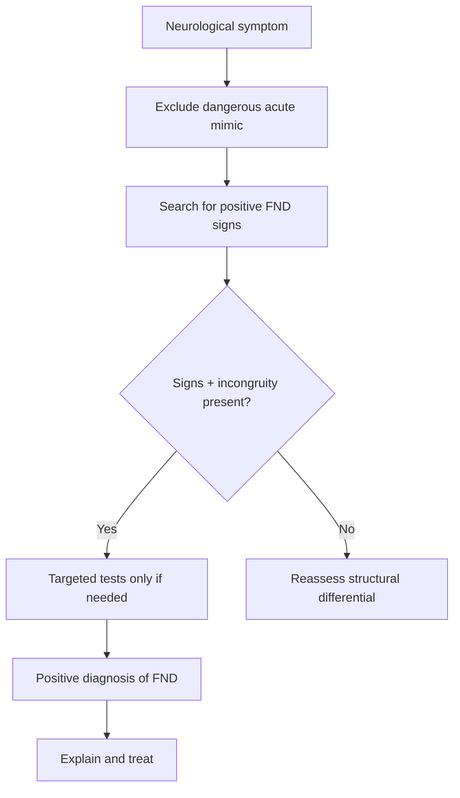

# Why FND is not purely a diagnosis of exclusion

Related: [[../Neurology MOC|Neurology MOC]] · [[../Functional Neurological Disorder|Functional Neurological Disorder]] · [[Diagnosis|Diagnosis]] · [[Positive clinical signs supporting FND]] · [[Common mimics to avoid missing]]

> [!important]
> Modern neurology treats FND as a **positive clinical diagnosis**. It is not good practice to say “all tests are normal, so it must be FND.” Instead, the diagnosis rests on **positive signs, internal inconsistency, incongruity with recognized disease patterns, and the absence of a better competing explanation after targeted assessment**.

## Learning Objectives
- Explain why FND should not be framed only as a diagnosis of exclusion.
- Define the positive-diagnosis model for FND.
- Apply a safe diagnostic approach that excludes emergencies but avoids endless investigation.
- Use clear FCPS/MRCP-style language for exam and patient explanation.

## Definition
FND is a disorder of nervous-system functioning in which symptoms are **genuine and disabling**, but arise from **abnormal function rather than structural damage**, and are diagnosed using **positive clinical findings** rather than by exclusion alone.

## Why the old “exclusion only” model is inadequate
- It encourages endless tests without diagnostic confidence.
- It delays treatment and patient understanding.
- It implies the diagnosis is uncertain or second-rate.
- It damages trust when the patient hears “nothing is wrong.”
- It overlooks that neurology can identify positive signs of FND at the bedside.

## The Positive-Diagnosis Model
### Core pillars
1. **History compatible with FND**
   - fluctuation, trigger association, mixed symptoms, prior FND features
2. **Positive examination signs**
   - Hoover’s sign, entrainment, distractibility, midline splitting, inconsistency
3. **Incongruity with structural disease**
   - symptom pattern does not fit known neuroanatomy/physiology
4. **Targeted investigations when needed**
   - used to exclude dangerous mimics, not to “prove” FND by exhaustion
5. **No stronger competing diagnosis**
   - diagnosis must still make clinical sense in context

## Core Anatomy / Physiology Link
- In structural disease, symptoms map to lesions in recognizable pathways.
- In FND, pathways are usually intact, but voluntary access/control becomes disrupted by abnormal attention, expectation, agency, and sensorimotor processing.
- Preserved automatic function despite impaired deliberate function is a major clue that the problem is one of function rather than tract destruction.

## What counts as positive evidence?
### Examples
- Functional weakness with positive Hoover’s sign
- Functional tremor with entrainment and distractibility
- Sensory change with exact midline splitting and shifting boundaries
- Dissociative attacks with video-EEG capture lacking epileptiform correlation
- Functional gait with dramatic variability and preserved protection from falls

## Investigations: what they are for
### Appropriate role
- exclude dangerous structural or metabolic causes
- assess coexisting neurological disease when plausible
- support confidence when history/exam are incomplete or red flags exist

### Inappropriate role
- ordering repeated tests simply because “FND is diagnosis of exclusion”
- using normal tests alone as proof
- keeping the patient in prolonged diagnostic limbo despite clear positive signs

## Safe Clinical Algorithm
1. Identify the dominant symptom and urgency.
2. Exclude acute emergencies and major mimics.
3. Search for positive FND signs.
4. Ask whether the pattern is incongruent with known disease.
5. Order targeted tests only if they answer a real safety question.
6. Make a positive diagnosis if the evidence supports FND.
7. Explain the diagnosis clearly and begin treatment.

## Differential Diagnosis Safeguards
You must still think about:
- acute stroke/TIA-like presentations
- myelopathy/cord compression
- multiple sclerosis relapse
- myasthenia gravis
- movement disorders and cerebellar disease
- epilepsy and syncope
- neuropathy/radiculopathy/myopathy
- toxic-metabolic causes

## Coexisting Organic Disease
- FND can coexist with epilepsy, migraine, multiple sclerosis, Parkinson disease, peripheral neuropathy, or prior stroke.
- Therefore, identifying one organic diagnosis does not automatically explain every symptom.
- Likewise, identifying FND does not remove the need to recognize genuine new neurological disease later.

## Communication Principles
### What to say
- “Your symptoms are real.”
- “The problem is in the functioning of the nervous system, not structural damage.”
- “The examination showed positive features that help us diagnose this.”

### What to avoid
- “Nothing is wrong.”
- “All your tests are normal, so this is psychological.”
- “It is only a diagnosis of exclusion.”

## Management Implications
- Positive diagnosis improves patient engagement.
- Early explanation reduces repeated hospital use and diagnostic drift.
- Rehabilitation can start sooner when the diagnosis is framed confidently.
- Avoiding endless tests helps reduce iatrogenic harm.

## Tables / Comparison Charts
| Approach | Exclusion-only model | Positive-diagnosis model |
|---|---|---|
| Basis of diagnosis | Normal/negative tests | Positive bedside signs + context |
| Effect on patient | Uncertainty, invalidation | Clearer understanding |
| Investigation strategy | Exhaustive | Targeted and safety-driven |
| Time to treatment | Delayed | Earlier |
| Exam importance | Underused | Central |

## Red Flags / When you must slow down
- Progressive objective deficit
- Persistent focal cranial nerve findings
- Sensory level with sphincter dysfunction
- Bulbar or respiratory weakness
- New epileptic features or prolonged post-ictal confusion
- Severe headache/fever/meningism or posterior fossa clues

## Complications of the Exclusion-Only Mindset
- unnecessary admissions
- repeated imaging and invasive tests
- contradictory labels from different clinicians
- patient mistrust and chronic disability
- delayed physiotherapy/psychological support

## Prognosis Relevance
- Prognosis is often better when FND is recognized and explained early as a positive diagnosis.
- Long delays and repeated “nothing found” messaging worsen outcomes.

## FCPS/MRCP High-Yield Points
- FND is **not merely a diagnosis of exclusion**.
- It is based on **positive signs and inconsistency/incongruity**.
- Normal tests are supportive only in context; they are not sufficient alone.
- Targeted investigation is still necessary to exclude dangerous mimics.
- Organic disease and FND may coexist.

## Common Viva Questions
- Why is FND not purely a diagnosis of exclusion?
- What are examples of positive signs supporting FND?
- What is the role of investigations in FND?
- How do you explain FND positively to a patient?

## Common Confusions / Exam Traps
- Equating “positive diagnosis” with “no need for any investigations.”
- Assuming normal MRI automatically confirms FND.
- Forgetting that new structural disease can arise later in a patient with known FND.
- Confusing FND with malingering.

## Mnemonics
**POSITIVE FND**
- **P**ositive signs present
- **O**rganic emergencies excluded
- **S**tructural pattern mismatch
- **I**nvestigate only as needed
- **T**reatment starts early
- **I**nvalidation avoided
- **V**ariability matters
- **E**xplanation is therapeutic

## Mind Map
- FND not exclusion only
  - positive signs
  - targeted tests
  - no better alternative
  - explain clearly
  - start rehab early

## Flowchart

## Suggested Visuals / Image Notes
- Positive-diagnosis vs exclusion-only comparison table
- Diagram linking inconsistency, incongruity, preserved automatic function

## One-Page Revision Summary
- FND should be diagnosed **positively**, not by “all tests normal.”
- Diagnosis depends on **positive signs**, **clinical pattern**, and **targeted safety assessment**.
- Investigations exclude important mimics and coexisting disease; they do not define FND by exhaustion.
- Clear explanation improves trust and outcomes.

## 24-Hour Recall Prompts
- Name the 5 pillars of positive FND diagnosis.
- Why are normal tests alone insufficient?
- Give 3 examples of positive signs.
- How can FND coexist with organic disease?

## 7-Day / 15-Day / 30-Day Revision Tracker
- **Day 7:** Memorize positive-vs-exclusion comparison.
- **Day 15:** Practice explaining FND positively.
- **Day 30:** Give a viva answer on diagnostic philosophy and safety.

## Must Know / Should Know / Nice to Know
### Must Know
- Positive diagnosis principle
- Targeted tests, not endless tests
- Coexisting organic disease possible
### Should Know
- Communication pitfalls
- Impact on prognosis and engagement
### Nice to Know
- Neurocognitive models supporting the functional paradigm

## My Weak Points
- Do I over-rely on normal tests?
- Can I state positive signs confidently?
- Do I remember coexistence of organic disease?

## Self-Test Scorecard
- Diagnostic framework /10
- Safety-net differential /10
- Explanation skill /10
- Viva confidence /10

## Exam Answer Modes
### Short note frame
Definition → why exclusion-only is wrong → positive signs → targeted investigations → communication/management.

### Viva frame
“FND is not purely a diagnosis of exclusion because neurologists can identify positive clinical signs such as Hoover’s sign, entrainment, and non-anatomical sensory patterns. Investigations are used selectively to exclude dangerous mimics or coexisting disease, but the diagnosis itself is made positively.”

## Summary
FND is a genuine neurological disorder diagnosed by **positive clinical evidence**, not merely by the absence of structural abnormalities. The modern approach combines bedside signs, congruent history, targeted safety testing, and clear explanation so that treatment can begin early and confidently.

## MCQs (10)
1. Which statement best describes modern diagnosis of FND?
   - A. It is purely a diagnosis of exclusion
   - B. It is based on positive clinical signs and targeted assessment
   - C. It requires every neurological test to be normal
   - D. It is equivalent to malingering
   - E. It cannot coexist with organic disease
2. Normal tests alone are:
   - A. Sufficient to diagnose FND
   - B. Irrelevant in all cases
   - C. Supportive only in context, not sufficient alone
   - D. Proof of voluntary symptoms
   - E. Contraindicated
3. Which is an example of a positive sign?
   - A. Hoover’s sign
   - B. ESR elevation
   - C. Papilledema
   - D. Ankle edema
   - E. Hyperglycemia
4. The main reason to investigate in suspected FND is to:
   - A. Order every test available
   - B. Exclude important mimics and assess coexisting disease when indicated
   - C. Prove symptoms are psychiatric
   - D. Delay explanation
   - E. Avoid neurological examination
5. Which statement is true?
   - A. FND and epilepsy cannot coexist
   - B. FND and organic disease may coexist
   - C. A positive FND sign rules out all future structural disease
   - D. Only psychiatrists can diagnose FND
   - E. FND has no examination findings
6. A harmful phrase in communication is:
   - A. “Your symptoms are real.”
   - B. “The nervous system is functioning abnormally.”
   - C. “Nothing is wrong.”
   - D. “We found positive signs supporting the diagnosis.”
   - E. “We can treat this.”
7. Which principle best improves prognosis?
   - A. Long diagnostic delay with repeated normal tests
   - B. Early positive diagnosis and explanation
   - C. Avoid naming the diagnosis
   - D. Tell patient it is untreatable
   - E. Ignore examination findings
8. What is a major risk of the exclusion-only mindset?
   - A. Earlier treatment
   - B. Reduced iatrogenic harm
   - C. Endless investigations and patient mistrust
   - D. Better therapeutic alliance
   - E. Faster rehabilitation
9. Which feature should make you reconsider a purely functional diagnosis?
   - A. Positive Hoover’s sign alone in stable context
   - B. Progressive objective focal deficit
   - C. Variable tremor with entrainment
   - D. Midline splitting
   - E. Distractibility
10. The positive-diagnosis model means:
   - A. No investigations are ever needed
   - B. FND is certain in every anxious patient
   - C. Positive clinical signs guide diagnosis while safety testing remains targeted
   - D. Neurology is not involved
   - E. Imaging is always abnormal

## SBA Questions (10)
1. A registrar says FND can only be diagnosed after every scan and blood test are normal. What is the best correction?
2. A patient with weakness has a clear Hoover’s sign and no red flags. What does this allow the clinician to do?
3. Why are normal tests alone insufficient for FND diagnosis?
4. What key diagnostic principle applies when FND and epilepsy coexist?
5. What phrase best explains FND to a patient positively?
6. Why is the exclusion-only model harmful?
7. What is the role of MRI in suspected FND?
8. Which bedside signs make the diagnosis positive rather than purely exclusionary?
9. What should the clinician do if progressive objective UMN signs develop in a patient with known FND?
10. How does positive diagnosis affect treatment timing?

## Flashcards
- Q: Is FND purely a diagnosis of exclusion?
  A: No, it is a positive clinical diagnosis.
- Q: What 3 things strengthen FND diagnosis?
  A: Positive signs, incongruity, no better alternative after targeted assessment.
- Q: Do normal tests alone diagnose FND?
  A: No.
- Q: Can FND coexist with organic disease?
  A: Yes.
- Q: Why does explanation matter?
  A: It improves engagement and prognosis.

## Answer Key with Explanations
### MCQs
1. **B** — modern diagnosis is positive and evidence-based.
2. **C** — normal tests are supportive only in context.
3. **A** — Hoover’s sign is a classic positive sign.
4. **B** — investigations are used selectively for safety.
5. **B** — coexisting organic disease is possible.
6. **C** — this phrase is invalidating.
7. **B** — early positive explanation improves outcomes.
8. **C** — exclusion-only thinking leads to repeated tests and mistrust.
9. **B** — progressive objective signs mandate reassessment.
10. **C** — targeted safety testing remains important.

### SBAs
1. FND can often be diagnosed positively from bedside signs and history, with investigations used selectively.
2. Make a positive diagnosis of functional weakness and explain it clearly, provided no better alternative exists.
3. Because FND requires positive clinical evidence, not mere absence of abnormalities.
4. One diagnosis does not automatically explain all events; both may be present.
5. “Your symptoms are real, and the examination shows the nervous system is functioning abnormally rather than being structurally damaged.”
6. It delays treatment, increases iatrogenic harm, and undermines trust.
7. To exclude structural mimics when clinically indicated.
8. Hoover’s sign, entrainment, midline splitting, distractibility, preserved automatic movement.
9. Reassess urgently for structural neurological disease.
10. It allows earlier rehabilitation and clearer management.