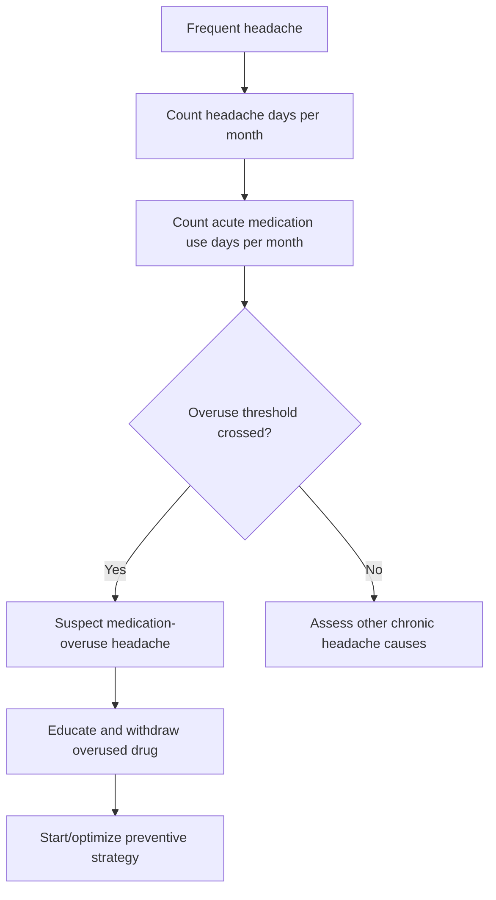

# Medication-overuse headache

Related: [[../Neurology MOC|Neurology MOC]] · [[../Headache Syndromes|Headache Syndromes]] · [[Chronic and treatment-related headache|Chronic and treatment-related headache]] · [[Migraine with and without aura]] · [[Tension-type headache]]

> [!important]
> Medication-overuse headache (MOH) should be suspected in a patient with **frequent or near-daily headache** who regularly uses acute headache medication. The key treatment is **withdrawal of the overused medicine**, patient education, and prevention of relapse.

## Learning Objectives
- Define medication-overuse headache and recognize who is at risk.
- Understand how repeated acute analgesic/triptan use perpetuates chronic headache.
- Distinguish MOH from uncontrolled migraine, chronic tension-type headache, and secondary intracranial causes.
- Apply an FCPS/MRCP-oriented management plan including withdrawal, bridge care, and preventive strategy.

## Definition
Medication-overuse headache is a **secondary chronic daily headache** occurring in a patient with a pre-existing headache disorder who overuses acute symptomatic medication, leading to **headache on ≥15 days per month** with worsening or persistence driven by frequent medication exposure.

## Core Anatomy
- Pain pathways involve the **trigeminovascular system** and central pain-processing networks.
- Repeated analgesic exposure may alter nociceptive modulation at brainstem and cortical levels.
- MOH usually develops on a background of migraine or tension-type headache rather than structural intracranial disease.

## Core Physiology
- Normal acute treatment interrupts headache without promoting dependency on frequent use.
- Repeated exposure may produce **central sensitization**, lower pain threshold, and rebound pain.
- The patient enters a cycle: headache → medication → temporary relief → recurrence → more medication.

## Normal Values / Important Cut-offs
- Headache on **≥15 days/month** suggests chronic daily headache territory.
- Overuse thresholds commonly remembered:
  - **Triptans, ergotamines, opioids, combination analgesics**: **≥10 days/month**
  - **Simple analgesics (e.g., paracetamol, NSAIDs)**: **≥15 days/month**
- Usually present for **>3 months** in diagnostic frameworks.

## Classification
### By overused drug class
1. Simple analgesic overuse
2. Triptan overuse
3. Opioid overuse
4. Ergotamine overuse
5. Combination analgesic overuse
6. Multiple-drug overuse

### By underlying primary headache
- Migraine-related MOH
- Tension-type headache-related MOH
- Mixed phenotype

## Etiology / Causes
- Frequent self-treatment of migraine or tension-type headache
- Poor access to preventive treatment
- Easy over-the-counter analgesic availability
- Fear of another attack causing anticipatory medication use
- Use of caffeine-containing or opioid-containing combination products

## Risk Factors
- Pre-existing migraine
- Female sex more commonly reported
- Anxiety, depression, sleep disturbance
- High stress burden
- Opioid or combination analgesic exposure
- Low understanding of safe monthly acute-treatment limits

## Pathophysiology
- Repeated exposure to acute headache medications dysregulates pain modulation.
- Trigeminovascular sensitization and central sensitization increase attack frequency.
- Behavioral reinforcement and anticipatory dosing maintain dependence on rescue medication.
- The original primary headache disorder remains in the background but becomes masked by rebound headache.

## Clinical Features
- Daily or near-daily headache
- Headache often present on waking
- Fluctuating severity; dull background pain with superimposed migraine-like exacerbations
- Temporary relief after medication, followed by recurrence
- History of escalating use of acute medication
- Associated nausea, photophobia, irritability, poor sleep may occur

## Approach / Algorithm
1. Ask: **How many headache days per month?**
2. Ask: **How many days per month are acute medicines used?**
3. Identify the exact drug class: simple analgesic, triptan, opioid, combination product, caffeine-containing products.
4. Exclude red flags or a new secondary headache pattern.
5. Diagnose probable MOH if frequency and overuse thresholds are met on a background headache disorder.
6. Explain the cycle clearly and plan **withdrawal**.
7. Start or optimize **preventive therapy** for the underlying headache disorder.
8. Arrange follow-up because relapse is common.

## Investigations
### Usually clinical diagnosis
- No specific biomarker for MOH.
- Investigations are guided by red flags or atypical features.

### Consider when indicated
- Neuroimaging if focal deficits, papilloedema, change in pattern, systemic features, seizures, or suspicion of another secondary cause
- Screen mood/sleep disorders and substance dependence risk
- Medication review including OTC drugs and caffeine combinations

## Interpretation Frameworks
### Headache diary interpretation
- Count **headache days/month**.
- Count **acute medication-use days/month**, not just tablet number.
- Link worsening frequency to increasing medicine days.

### Pattern recognition
- **Primary migraine alone:** episodic attacks with headache-free days.
- **MOH:** frequent/daily headache plus escalating acute-medication exposure and transient relief after each dose.
- **Secondary dangerous headache:** systemic symptoms, focal deficits, papilloedema, thunderclap onset, cancer/immunosuppression, age-related new red flags.

## Diagnosis
A practical diagnostic pattern is:
- underlying headache disorder
- headache on **≥15 days/month**
- regular overuse of acute headache medication for **>3 months**
- headache not better explained by another disorder

## Differential Diagnosis
- Chronic migraine without medication overuse
- Chronic tension-type headache
- Depression/somatization-related chronic pain
- Raised intracranial pressure
- Cervicogenic headache
- Temporal arteritis in older adults with new headache
- Intracranial mass lesion if progressive or focal deficits present

## Tables / Comparison Charts
| Feature | Medication-overuse headache | Chronic migraine | Tension-type headache |
|---|---|---|---|
| Medication use | Excessive | Variable | Usually not excessive |
| Pattern | Daily/near daily with rebound | Frequent migraine phenotype | Pressing, non-pulsatile |
| Key clue | Relief then recurrence after medicines | Migraine biology dominates | No clear overuse cycle |
| Core treatment | Withdraw overused drug | Migraine prevention | Lifestyle + simple management |

## Management
### Core principles
- Educate the patient that **the medicine is sustaining the headache**.
- Withdraw the overused medication.
- Manage short-term worsening during withdrawal.
- Start or optimize prophylaxis for the underlying primary headache.

### Withdrawal strategy
- Abrupt withdrawal is often used for simple analgesics and triptans.
- Opioid or sedative-related overuse may require supervised tapering.
- Warn that headache may worsen temporarily for days to 1–2 weeks.

### Preventive strategy
- Optimize migraine prevention when migraine underlies MOH.
- Address sleep, caffeine excess, mood disorder, hydration, and stress.
- Use a headache diary.
- Set monthly acute-treatment limits to prevent relapse.

## Drug Interactions / Contraindications / Comorbidity Cautions
- NSAID overuse → gastritis, renal risk, hypertension, GI bleed.
- Paracetamol overuse → hepatotoxicity risk.
- Opioid overuse → dependence, constipation, sedation, hyperalgesia.
- Triptans are contraindicated in some vascular patients.
- Avoid substituting one overused acute drug with another overused acute drug.

## Procedures / Indications / Contraindications
- No procedure is central to MOH.
- Neuroimaging is indicated only when red flags or atypical features suggest another diagnosis.

## Procedure Mini-Sections
### Headache diary setup
- **Indication:** all chronic headache patients with suspected MOH
- **Preparation:** record headache days, medicine-use days, triggers, disability
- **Principle:** use monthly pattern recognition to guide diagnosis and relapse prevention
- **Viva pearl:** medication-use days, not pill count alone, often matters diagnostically.

## Complications
- Progression to chronic daily headache
- Loss of efficacy of acute medicines
- Analgesic adverse effects
- Drug dependence especially with opioids/combination products
- Reduced quality of life and work function

## Red Flags / Emergencies
MOH itself is not usually a neurological emergency, but do not miss:
- new focal neurological deficit
- papilloedema
- thunderclap onset
- fever/meningism
- new headache in older age
- cancer/immunosuppression

## Prognosis
- Often improves substantially after withdrawal and preventive management.
- Relapse is common if education and prophylaxis are poor.
- Prognosis is worse with opioid overuse, psychiatric comorbidity, and persistent uncontrolled migraine triggers.

## Topic Correlation
- Builds on [[Migraine with and without aura]] and [[Tension-type headache]].
- Chronic headache frameworks connect to [[Raised intracranial pressure and mass lesion clues]] when the presentation is atypical.
- In older patients with new headache, compare with [[Temporal arteritis and other systemic red flags]].

## Special Situations
- **Pregnancy:** avoid many acute and preventive drugs; use obstetric-safe plans.
- **Elderly:** reconsider whether this is truly MOH or another secondary headache.
- **Opioid overuse:** may need supervised withdrawal.
- **Psychiatric comorbidity:** address anxiety/depression to reduce relapse.

## FCPS/MRCP High-Yield Points
- Think of MOH in frequent headache with regular rescue-medicine use.
- Count **days of use per month**, not just dose size.
- Thresholds: **≥10 days/month** for triptans/opioids/ergots/combination analgesics; **≥15 days/month** for simple analgesics.
- Main treatment is **withdrawal plus prevention**, not simply adding more acute medicine.

## Common Viva Questions
- How do you diagnose medication-overuse headache?
- Which drug classes have the lower 10-days/month threshold?
- Why does acute treatment start perpetuating headache?
- How would you counsel a patient whose headache worsens after stopping analgesics?

## Common Confusions / Exam Traps
- Confusing MOH with refractory migraine without asking about medication-use days.
- Counting tablets instead of days of acute treatment.
- Missing over-the-counter combination analgesics or caffeine products.
- Ignoring red flags because the patient already “has migraine.”

## Mnemonics
**MOH LOOP**
- **L**ots of headache days
- **O**veruse of acute medicine
- **O**nly brief relief
- **P**revention + withdrawal needed

## Mind Map
- Medication-overuse headache
  - background migraine/tension headache
  - frequent acute medication use
  - rebound cycle
  - chronic daily headache
  - withdrawal
  - prevention
  - relapse education

## Flowchart

## Suggested Visuals / Image Notes
- Headache diary example
- Threshold table for medication-use days/month
- Simple rebound-cycle diagram

## Suggested Video References
- Chronic daily headache and MOH revision video
- Migraine preventive-treatment overview
- Patient-counselling style video on rebound headache

## One-Page Revision Summary
- **Definition:** chronic headache sustained by frequent acute-treatment overuse.
- **Ask 2 questions:** headache days/month and medication-use days/month.
- **Thresholds:** 10 days/month for triptans/opioids/ergots/combination analgesics; 15 for simple analgesics.
- **Clue:** temporary relief after medicine, then recurrence.
- **Treatment:** withdraw overused drug, manage withdrawal, start prevention, use diary, prevent relapse.

## 24-Hour Recall Prompts
- State the diagnostic thresholds for MOH.
- Why does MOH occur most often in migraine patients?
- What is the core management principle?
- Name 4 red flags that would make you investigate beyond MOH.

## 7-Day / 15-Day / 30-Day Revision Tracker
- **Day 7:** Reproduce the threshold table from memory.
- **Day 15:** Compare MOH with chronic migraine.
- **Day 30:** Practice counselling a patient about withdrawal worsening.

## Must Know / Should Know / Nice to Know
### Must Know
- Headache ≥15 days/month plus medication overuse.
- 10-day and 15-day thresholds.
- Withdrawal is key treatment.
### Should Know
- Migraine is the common background disorder.
- Relapse prevention with diary and prophylaxis.
- Opioid overuse is harder to manage.
### Nice to Know
- Detailed neurobiology of central sensitization.
- Specialist refractory headache pathways.

## My Weak Points
- Do I remember to ask about OTC drugs?
- Can I state the threshold values correctly?
- Can I distinguish MOH from chronic migraine and from red-flag secondary headache?

## Self-Test Scorecard
- Recognition /10
- Threshold recall /10
- Management plan /10
- Differential diagnosis /10
- Patient counselling confidence /10

## Exam Answer Modes
### Short note frame
Definition → threshold days/month → common drugs → rebound cycle → withdrawal + prevention.

### Viva frame
“Medication-overuse headache is a chronic daily headache caused by regular overuse of acute headache medicines in someone who usually has migraine or tension-type headache. Diagnosis depends on headache frequency and medication-use days per month. Treatment is withdrawal of the offending medicine and preventive management of the underlying primary headache.”

## Summary
Medication-overuse headache is a classic exam topic because it is common, easily missed, and highly treatable. The diagnostic key is to **measure medication-use days per month**, and the management key is to **break the rebound cycle through withdrawal and prevention**.

## MCQs (10)
1. Medication-overuse headache is most commonly seen in patients with:
   - A. Brain tumor
   - B. Pre-existing primary headache disorder
   - C. Meningitis
   - D. Myasthenia gravis
   - E. Temporal arteritis
2. A key diagnostic feature of MOH is headache occurring on:
   - A. 1 day/month
   - B. 5 days/month
   - C. ≥15 days/month
   - D. Only during aura
   - E. Only with fever
3. Overuse of triptans is classically defined as use on:
   - A. ≥3 days/month
   - B. ≥5 days/month
   - C. ≥10 days/month
   - D. ≥20 days/month
   - E. ≥30 days/month
4. Which is the central management principle in MOH?
   - A. Increase rescue medication dose
   - B. Withdraw the overused medicine
   - C. Ignore drug history
   - D. Start antibiotics
   - E. Bed rest only
5. Which background headache disorder most commonly underlies MOH?
   - A. Cluster headache only
   - B. Migraine
   - C. SAH
   - D. Meningitis
   - E. Trigeminal neuralgia
6. Which drug class often needs extra caution because of dependence risk?
   - A. Topical eye drops
   - B. Opioids
   - C. Vitamins
   - D. Steroids for GCA
   - E. Antacids
7. Which clue favors MOH over episodic migraine?
   - A. Rare use of acute medication
   - B. Daily or near-daily headache with frequent acute medication use
   - C. Age below 20 alone
   - D. Neck stiffness and fever
   - E. Sudden collapse
8. For simple analgesics, overuse is often remembered as:
   - A. ≥2 days/month
   - B. ≥7 days/month
   - C. ≥10 days/month
   - D. ≥15 days/month
   - E. ≥25 days/month
9. Which tool is especially helpful in diagnosis and relapse prevention?
   - A. Echocardiogram
   - B. Headache diary
   - C. Bone marrow exam
   - D. Lumbar puncture in every case
   - E. EEG in every case
10. Which statement is correct?
   - A. MOH is best treated by adding more acute medicine
   - B. MOH never occurs with OTC drugs
   - C. MOH is usually a clinical diagnosis
   - D. Neuroimaging is mandatory in all classic cases
   - E. Red flags can be ignored if the patient has migraine

## SBA Questions (10)
1. A 31-year-old woman with migraine reports headache on 20 days each month. She uses sumatriptan on 12 days/month and paracetamol on many other days. What is the most likely diagnosis?
2. A 40-year-old teacher has near-daily headache and takes a combination analgesic most workdays. What is the single most important first management step?
3. A patient with suspected MOH asks why their headache may worsen after stopping tablets. What is the best explanation?
4. A man with chronic migraine uses ibuprofen on 16 days/month. What secondary headache syndrome should be considered?
5. A patient with daily headache denies “too many tablets” but uses medication on 14 separate days/month. Why is this still important diagnostically?
6. A patient with headache on 18 days/month uses opioids frequently. What feature makes management more difficult?
7. A patient with presumed MOH has papilloedema on examination. What should be done next?
8. Which underlying disorder most often needs preventive treatment when MOH is present?
9. During follow-up after withdrawal, what tool best demonstrates improvement and relapse risk?
10. A patient improves after withdrawal but asks how to avoid recurrence. What is the single best long-term principle?

## Flashcards
- Q: What two monthly counts are essential for diagnosing MOH?
  A: Headache days/month and medication-use days/month.
- Q: What threshold suggests overuse for triptans, opioids, ergots, and combination analgesics?
  A: ≥10 days/month.
- Q: What threshold suggests overuse for simple analgesics?
  A: ≥15 days/month.
- Q: What is the core treatment of MOH?
  A: Withdraw the overused medication.
- Q: What common background disorder underlies MOH?
  A: Migraine.
- Q: What simple monitoring tool helps diagnosis and relapse prevention?
  A: A headache diary.

## Answer Key with Explanations
### MCQs
1. **B** — MOH occurs on the background of a primary headache disorder.
2. **C** — chronic headache frequency is a core criterion.
3. **C** — triptans are remembered with the 10-day threshold.
4. **B** — stopping the perpetuating drug is central.
5. **B** — migraine is the commonest underlying disorder.
6. **B** — opioids bring dependence and withdrawal complexity.
7. **B** — this rebound pattern is typical.
8. **D** — simple analgesics use the higher 15-day threshold.
9. **B** — diary-based pattern recognition is very useful.
10. **C** — classic MOH is mainly a clinical diagnosis.

### SBAs
1. Medication-overuse headache.
2. Educate and withdraw the overused acute medication.
3. Withdrawal temporarily unmasks the rebound/sensitization cycle before improvement occurs.
4. Medication-overuse headache.
5. Diagnostic frameworks focus on **days of use per month**, not only tablet count.
6. Dependence and need for more supervised withdrawal.
7. Investigate urgently for another secondary cause; do not label as simple MOH alone.
8. The underlying migraine disorder.
9. A headache diary.
10. Limit acute-treatment days and maintain an effective preventive strategy.
