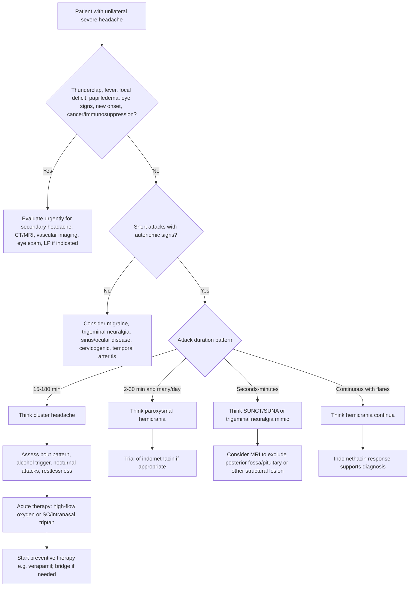

# Trigeminal autonomic cephalalgias and cluster headache

---
tags: [medicine, neurology, davidson, headache, cluster-headache, trigeminal-autonomic-cephalalgias, fcps, mrcp]
chapter: Neurology
davidson_part: Part 3: Clinical Medicine
davidson_chapter: Chapter 28: Neurology
heading: Headache Syndromes
topic_group: Primary headache syndromes
topic: Trigeminal autonomic cephalalgias and cluster headache
exam: [FCPS, MRCP]
status: full-fcps-mrcp-note
references:
  anatomy: ["Gray's Anatomy", Davidson]
  physiology: ["Guyton & Hall", Ganong, Davidson]
  clinical: [Davidson, PasTest]
related:
  - "[[../Neurology MOC|Neurology MOC]]"
  - "[[../Headache Syndromes|Headache Syndromes]]"
  - "[[Primary headache syndromes|Primary headache syndromes]]"
  - "[[Migraine with and without aura]]"
  - "[[Tension-type headache]]"
  - "[[Medication-overuse headache]]"
  - "[[Secondary headache red flags]]"
---

# Trigeminal autonomic cephalalgias and cluster headache

Related: [[../Neurology MOC|Neurology MOC]] · [[../Headache Syndromes|Headache Syndromes]] · [[Primary headache syndromes|Primary headache syndromes]] · [[Migraine with and without aura]] · [[Tension-type headache]] · [[Medication-overuse headache]] · [[Secondary headache red flags]]

> [!important]
> **Trigeminal autonomic cephalalgias (TACs)** are **primary headache disorders** characterized by **strictly unilateral severe head/facial pain** with **ipsilateral cranial autonomic features** such as lacrimation, conjunctival injection, nasal congestion, rhinorrhea, ptosis, or miosis. **Cluster headache** is the commonest TAC and the one most often tested in FCPS/MRCP.

> [!tip]
> Exam reflex: **short, excruciating, unilateral orbital/temporal pain + autonomic symptoms + agitation/restlessness = cluster headache until proven otherwise**. Also remember that **new-onset TAC-like headache needs imaging**, because pituitary, cavernous sinus, carotid, and posterior fossa lesions can mimic TACs.

## Learning Objectives
- Define **TACs** and identify where **cluster headache** fits within primary headache syndromes.
- Classify the main TAC subtypes and distinguish them by **attack duration**, **frequency**, and **indomethacin response**.
- Explain the role of **trigeminal-autonomic reflex**, **hypothalamic activation**, and circadian biology in cluster headache.
- Recognize the typical clinical picture and distinguish cluster headache from [[Migraine with and without aura]], [[Tension-type headache]], and dangerous secondary causes.
- Outline a practical diagnostic and management approach including **high-flow oxygen**, **triptans**, and **preventive therapy**.

## Definition
### Trigeminal autonomic cephalalgias
TACs are a group of **primary headache syndromes** in which attacks of **severe unilateral pain**, usually in the **orbital, supraorbital, or temporal region**, are accompanied by **ipsilateral cranial parasympathetic/autonomic symptoms** and sometimes **restlessness or agitation**.

### Cluster headache
Cluster headache is a TAC characterized by:
- **very severe or excruciating unilateral orbital, supraorbital, and/or temporal pain**
- attack duration **15-180 minutes** untreated
- attack frequency from **1 every other day to 8 per day**
- associated **ipsilateral autonomic signs**
- tendency to occur in **clusters (bouts)** over weeks to months with remission periods

## Relevant Neuroanatomy
### Pain pathways relevant to TACs
Pain arises from pain-sensitive cranial structures and the trigeminal system, especially:
- ophthalmic division (**V1**) of trigeminal nerve
- trigeminal ganglion
- trigeminal nucleus caudalis
- trigeminocervical complex
- thalamic relay nuclei
- pain-processing cortical networks

### Autonomic pathway
The characteristic autonomic features are explained by activation of the **trigeminal-autonomic reflex**:
- trigeminal afferent activation
- brainstem relay
- parasympathetic outflow via the **superior salivatory nucleus**
- facial nerve pathway through **greater petrosal nerve**
- synapse in **sphenopalatine ganglion**
- postganglionic fibers to lacrimal gland and nasal mucosa

This produces:
- lacrimation
- conjunctival injection
- rhinorrhea
- nasal congestion

### Sympathetic involvement
Partial interruption of ipsilateral sympathetic fibers may contribute to:
- ptosis
- miosis
- sometimes a partial Horner syndrome during attacks

### Hypothalamic relevance
Cluster headache shows strong links with:
- posterior/inferior hypothalamic activation in functional imaging
- circadian rhythm regulation
- sleep-wake timing
- seasonal periodicity

## Relevant Neurophysiology
### Trigeminal-autonomic reflex
Under normal physiology, trigeminal nociceptive input can influence cranial autonomic output. In TACs this interaction becomes exaggerated, causing simultaneous:
- severe trigeminal pain
- ipsilateral cranial parasympathetic activation
- occasional sympathetic dysfunction

### Circadian biology
Cluster headache is notable for biological rhythmicity:
- attacks often occur at a similar **clock time**, often at night
- bouts may occur in certain **seasons**
- hypothalamic dysfunction is thought to underlie this chronobiology

### Neurochemical mediators
Important mediators include:
- **CGRP** release during attacks
- parasympathetic peptides such as VIP
- altered hypothalamic and brainstem modulation

## Normal Values / Important Cut-offs
High-yield cut-offs:
- **Cluster headache attack duration:** **15-180 minutes**
- **Cluster attack frequency:** **1 every other day to 8/day**
- **Episodic cluster headache remission:** remission periods **>=3 months** in many classifications
- **Chronic cluster headache:** attacks for **>=1 year** without remission, or remission **<3 months**
- **Paroxysmal hemicrania duration:** **2-30 minutes**
- **Paroxysmal hemicrania frequency:** usually **>5/day**
- **SUNCT/SUNA duration:** **seconds to minutes**
- **Hemicrania continua:** continuous unilateral headache with superimposed exacerbations and **absolute indomethacin response**
- **Medication-overuse threshold:**
  - triptans, opioids, ergots, combination analgesics: **>=10 days/month**
  - simple analgesics/NSAIDs/paracetamol: **>=15 days/month**

## Classification
### Main TACs
1. **Cluster headache**
   - episodic cluster headache
   - chronic cluster headache
2. **Paroxysmal hemicrania**
3. **SUNCT** (short-lasting unilateral neuralgiform headache attacks with conjunctival injection and tearing)
4. **SUNA** (short-lasting unilateral neuralgiform headache attacks with cranial autonomic symptoms)
5. **Hemicrania continua**

### Cluster headache classification
#### Episodic cluster headache
- attacks occur in bouts lasting weeks to months
- remission periods occur between bouts

#### Chronic cluster headache
- attacks persist for 1 year or more without significant remission, or remissions are very brief

## Epidemiology / Risk Factors
### Cluster headache
Typical epidemiology:
- less common than migraine
- more common in **men**
- usual onset in **young to middle adulthood**
- smoking association is common in history, though not a proven direct cause in every patient

Risk associations:
- male sex
- smoking
- alcohol can trigger attacks during a bout
- possible family history in a minority
- sleep disturbance / circadian factors

### Other TAC pointers
- paroxysmal hemicrania is relatively more common in women than cluster headache
- SUNCT/SUNA are rare
- hemicrania continua often presents as persistent unilateral headache rather than discrete classic cluster bouts

## Pathophysiology
Cluster headache is a **neurovascular-primary headache disorder** involving hypothalamic dysfunction and trigeminal-autonomic activation.

### Mechanistic model of cluster headache
1. **Hypothalamic dysregulation** creates circadian susceptibility.
2. Trigeminal nociceptive pathways become activated.
3. The **trigeminal-autonomic reflex** is triggered.
4. Parasympathetic outflow produces tearing, conjunctival injection, and nasal symptoms.
5. Neuropeptides such as **CGRP** are released.
6. Severe unilateral orbital/temporal pain develops.
7. The patient becomes **restless/agitated**, unlike the quiet withdrawal often seen in migraine.

### Why attacks are clock-like
Hypothalamic involvement explains:
- night-time attacks waking the patient from sleep
- periodicity during certain months
- stereotyped timing of recurrent attacks

### Why patients pace rather than lie still
In cluster headache the intensity is explosive and patients are often:
- unable to remain still
- pacing, rocking, or pressing the painful side

This contrasts with many migraine patients who prefer:
- darkness
- quiet
- minimal movement

### Pathophysiological contrasts among TACs
- **Cluster headache:** longer attacks than neuralgiform TACs; strong hypothalamic-circadian signature
- **Paroxysmal hemicrania:** shorter, more frequent attacks; **dramatic indomethacin response**
- **SUNCT/SUNA:** very brief stabbing/electric-shock-like attacks; often triggerable; prominent ocular autonomic symptoms
- **Hemicrania continua:** continuous unilateral pain with exacerbations and indomethacin responsiveness

## Clinical Features
### Cluster headache: classic history
- **strictly unilateral** pain
- orbital, supraorbital, temporal, sometimes maxillary distribution
- **very severe/excruciating** pain
- boring, piercing, burning, or exploding quality
- lasts **15-180 minutes** if untreated
- recurs up to **8 times daily**
- often occurs at night and may wake the patient
- occurs in **clusters/bouts** over weeks to months

### Ipsilateral autonomic features
One or more of the following on the painful side:
- conjunctival injection
- lacrimation
- rhinorrhea
- nasal congestion
- eyelid edema
- forehead/facial sweating
- ptosis
- miosis

### Behavioral clue
Highly testable feature:
- **patient is restless or agitated**, may pace the room

### Common triggers during an active cluster period
- alcohol
- vasodilators such as nitrates
- sleep / circadian timing

### Examination
Between attacks examination may be normal.
During or around attacks look for:
- lacrimation, red eye
- rhinorrhea or nasal blockage
- partial Horner syndrome
- agitation

### Cluster headache vs migraine bedside distinction
- cluster pain is **shorter, more severe, strictly unilateral, autonomic, and restless**
- migraine is more likely **throbbing**, **hours long**, with **nausea/photophobia**, and patient prefers to **lie still**

### Paroxysmal hemicrania
- severe unilateral orbital/temporal pain
- attack duration **2-30 minutes**
- often many attacks per day, usually **>5/day**
- autonomic features present
- **complete response to indomethacin** is the classic clue

### SUNCT / SUNA
- very short attacks, usually **seconds to a few minutes**
- stabbing, neuralgiform, often periocular
- frequent daily attacks
- SUNCT: conjunctival injection and tearing are prominent
- SUNA: one or more autonomic symptoms but not necessarily both tearing and injection

### Hemicrania continua
- **continuous unilateral headache** with exacerbations
- ipsilateral autonomic signs may appear during exacerbations
- **absolute response to indomethacin** is characteristic

## Approach / Diagnostic Algorithm

### Practical exam approach
1. Decide whether this is a **primary headache** or a **secondary dangerous headache**.
2. Ask for **site**: strictly unilateral orbital/temporal pain is very suggestive.
3. Ask for **duration** of each attack.
4. Ask for **attack frequency** per day.
5. Ask specifically for **tearing, red eye, rhinorrhea, nasal blockage, ptosis, sweating**.
6. Ask whether the patient is **restless** or wants to lie still.
7. Ask about **cluster pattern**, nocturnal attacks, and alcohol triggering attacks during bouts.
8. Review medications and overuse.
9. Perform neurological examination and cranial nerve examination.
10. Consider imaging especially in **new or atypical TAC-like headache**.

## Investigations
### Key principle
TACs are mainly **clinical diagnoses**, but **secondary mimics must be excluded**, especially at first presentation or when features are atypical.

### Baseline investigations
Depending on context:
- blood pressure
- full neurological examination
- ophthalmic assessment if red eye or visual concern
- ESR/CRP if older patient or temporal arteritis is possible
- routine bloods if needed for treatment planning, e.g. verapamil monitoring context

### Neuroimaging
**MRI brain** is commonly preferred for first presentation of suspected TAC, especially to exclude:
- pituitary adenoma or other sellar/parasellar lesion
- cavernous sinus lesion
- carotid dissection
- posterior fossa lesion
- structural lesion causing trigeminal-autonomic symptoms

Consider vascular imaging if suggested by history:
- carotid or vertebral artery dissection
- aneurysmal or vascular pathology

### ECG in cluster headache management
If using **verapamil** for prevention:
- baseline ECG is advisable
- repeat ECGs are often needed during dose escalation due to risk of **heart block/bradycardia**

### When urgent investigation is mandatory
- first or worst headache
- thunderclap onset
- abnormal neurological examination
- persistent Horner syndrome outside attacks
- visual loss or acute glaucoma suspicion
- fever/meningism
- immunocompromise/cancer
- older age at first presentation
- atypical duration or non-stereotyped pattern

## Diagnosis
### Clinical diagnosis of cluster headache
Diagnosis is based on a pattern of:
- **at least several stereotyped attacks**
- **severe unilateral orbital/supraorbital/temporal pain**
- duration **15-180 minutes**
- frequency **1 every other day to 8/day**
- associated ipsilateral autonomic symptoms and/or restlessness

### Clinical diagnosis of other TACs
- **Paroxysmal hemicrania:** shorter attacks, more frequent, autonomic signs, **indomethacin-responsive**
- **SUNCT/SUNA:** very brief frequent neuralgiform attacks with autonomic features
- **Hemicrania continua:** continuous unilateral headache with complete indomethacin response

## Differential Diagnosis
### Primary headache differentials
- [[Migraine with and without aura]]
- [[Tension-type headache]]
- [[Medication-overuse headache]]
- trigeminal neuralgia

### Secondary or dangerous mimics
- carotid artery dissection
- pituitary apoplexy or pituitary adenoma
- cavernous sinus pathology
- posterior fossa lesion
- acute angle-closure glaucoma
- sinus/orbital disease
- temporal arteritis in older adults
- subarachnoid hemorrhage
- meningitis

### Important differentiating points
- **Migraine:** longer attacks, nausea/photophobia more prominent, patient prefers rest, autonomic symptoms less striking
- **Trigeminal neuralgia:** shock-like facial pain lasting seconds, triggered by touch/chewing, usually no prominent autonomic syndrome
- **Paroxysmal hemicrania:** shorter and more frequent than cluster; indomethacin response is key
- **Acute glaucoma:** painful red eye with visual symptoms and fixed ocular findings
- **Dissection:** neck pain, partial Horner syndrome, focal deficits, vascular risk context

## Tables / Comparison Charts
### Main TAC comparison
| Feature | Cluster headache | Paroxysmal hemicrania | SUNCT/SUNA | Hemicrania continua |
|---|---|---|---|---|
| Pain pattern | Attacks | Attacks | Attacks | Continuous with flares |
| Typical duration | 15-180 min | 2-30 min | Seconds to minutes | Continuous |
| Frequency | 1 every other day to 8/day | Usually >5/day | Many/day | Continuous baseline pain |
| Site | Strictly unilateral orbital/temporal | Strictly unilateral orbital/temporal | Usually periocular unilateral | Strictly unilateral |
| Autonomic signs | Prominent | Prominent | Prominent | During exacerbations |
| Restlessness | Common | May occur | Less defining | Variable |
| Key therapeutic clue | Oxygen, triptan, verapamil | Absolute indomethacin response | Often refractory; specialist therapy | Absolute indomethacin response |

### Cluster headache vs migraine vs tension-type headache
| Feature | Cluster headache | Migraine | Tension-type headache |
|---|---|---|---|
| Laterality | Strictly unilateral | Often unilateral, may be bilateral | Usually bilateral |
| Severity | Excruciating | Moderate-severe | Mild-moderate |
| Duration | 15-180 min | 4-72 h | 30 min to days |
| Behavior | Restless/agitated | Wants dark quiet rest | Usually continues activity |
| Autonomic signs | Prominent | Usually absent or mild | Absent |
| Nausea/photophobia | Can occur but less dominant | Common | Minimal/absent |
| Circadian pattern | Very characteristic | Less characteristic | No classic clock-like pattern |

### Cluster headache vs trigeminal neuralgia
| Feature | Cluster headache | Trigeminal neuralgia |
|---|---|---|
| Pain duration | 15-180 min | Seconds to 2 min usually |
| Site | Orbital/supraorbital/temporal | Cheek, jaw, teeth, lips, V2/V3 often |
| Quality | Boring/piercing severe | Electric shock-like/stabbing |
| Autonomic symptoms | Common | Usually absent or mild only |
| Triggers | Alcohol during bout, sleep timing | Touch, shaving, chewing, talking |
| Behavior | Pacing/restless | Freezes, avoids movement |

### Acute and preventive treatment summary
| Situation | Preferred option | Important cautions |
|---|---|---|
| Acute cluster attack | **100% oxygen** via non-rebreather | Need adequate flow and proper mask |
| Acute cluster attack | **Subcutaneous sumatriptan** | Avoid in significant ischemic vascular disease/uncontrolled hypertension |
| Acute cluster attack | Intranasal triptan | Useful if injection not feasible |
| Cluster prevention | **Verapamil** | ECG monitoring for bradycardia/heart block |
| Transitional/bridge therapy | Short course corticosteroid | Check diabetes, infection risk, BP |
| Refractory chronic cases | Lithium / specialist options | Renal, thyroid, toxicity monitoring |
| Paroxysmal hemicrania / hemicrania continua | **Indomethacin** | GI, renal, ulcer, bleeding risk |

## Management
### General principles
- confirm likely TAC pattern and exclude important secondary causes
- educate patient about attack pattern and trigger recognition
- avoid alcohol during active cluster periods
- maintain headache diary documenting time, duration, autonomic features, and triggers
- avoid analgesic overuse

### Acute treatment of cluster headache
#### High-flow oxygen
First-line abortive therapy:
- **100% oxygen** by **non-rebreather mask**
- use **high flow** and start early in attack
- often highly effective in cluster headache

#### Triptans
Useful acute therapies:
- **subcutaneous sumatriptan** is highly effective and classic exam answer
- **intranasal sumatriptan or zolmitriptan** may help

Less useful:
- oral drugs are often too slow for brief attacks

#### Supportive points
- treat promptly at onset
- reassure that routine opioids are poor practice
- simple analgesics are often inadequate because attacks are short and severe

### Preventive treatment of cluster headache
#### Verapamil
Most tested preventive drug:
- often considered **first-line preventive**
- dose titration may be needed
- **ECG monitoring** is important during dose escalation

#### Transitional / bridging therapy
Used while verapamil is taking effect:
- short course **prednisolone/corticosteroid**
- sometimes occipital nerve block in specialist practice

#### Other preventive options in selected/refractory cases
- **lithium**, especially in some chronic cluster cases
- topiramate in selected patients
- specialist neuromodulation approaches in refractory disease

### Management of other TACs
#### Paroxysmal hemicrania
- **indomethacin** is the signature treatment
- failure to respond should prompt diagnostic reconsideration

#### Hemicrania continua
- **indomethacin** is also diagnostic and therapeutic

#### SUNCT / SUNA
- often needs specialist therapy
- options may include lamotrigine or other specialist regimens depending on setting

### Non-pharmacological and longitudinal care
- sleep regulation
- trigger review
- smoking cessation counseling
- avoid alcohol during bout periods
- monitor disability, mood, and work impairment

## Drug Interactions / Contraindications / Comorbidity Cautions
### Oxygen therapy
Use caution in:
- severe chronic hypercapnic respiratory failure contexts
- incorrect mask setup making treatment ineffective

### Triptans
Avoid or use extreme caution in:
- ischemic heart disease
- uncontrolled hypertension
- prior stroke/TIA
- major peripheral vascular disease
- significant ischemic risk states

### Verapamil
Important cautions:
- bradycardia
- heart block
- hypotension
- constipation
- interaction with other rate-limiting drugs
- requires **ECG monitoring**

### Lithium
Cautions:
- CKD
- dehydration
- thyroid disease
- interacting drugs such as NSAIDs, ACE inhibitors, diuretics
- toxicity monitoring required

### Indomethacin
Cautions:
- peptic ulcer disease
- GI bleeding risk
- CKD
- heart failure / fluid retention risk
- elderly frailty

## Procedures / Indications / Contraindications
### Neuroimaging in TAC-like presentations
- **Indications:** first presentation, atypical pattern, abnormal examination, persistent Horner syndrome, poor response to standard therapy, suspicion of pituitary/cavernous sinus/dissection pathology
- **Contraindications / cautions:** MRI contraindications such as incompatible implants; use alternative imaging if needed
- **Viva pearl:** a TAC phenotype does **not** rule out secondary structural disease

### ECG before and during verapamil therapy
- **Indication:** baseline and escalation monitoring for cluster headache prevention
- **Why:** verapamil can cause conduction delay and heart block
- **Exam pearl:** mention ECG monitoring whenever you prescribe higher-dose verapamil for cluster headache

## Complications / Clinical Impact
- severe distress and reduced quality of life
- sleep deprivation from nocturnal attacks
- depression/anxiety association
- medication-overuse headache if repeated acute drugs are misused
- missed secondary cause if atypical TAC-like headache is assumed to be benign primary cluster headache

## Red Flags / Emergencies
These features should push you away from uncomplicated primary cluster headache and toward urgent reassessment:
- **first or worst headache**
- **thunderclap onset**
- **fever**, meningism, altered consciousness
- **focal neurological deficit**
- **persistent Horner syndrome** between attacks
- **visual loss** or acute painful red eye suggesting glaucoma
- **new onset after age 50**
- **progressive change** in pattern
- **cancer, HIV, immunosuppression**
- pregnancy/postpartum severe headache context
- atypical prolonged attacks or side-switching with unusual features

## Prognosis
- episodic cluster headache may recur in bouts over years
- some patients enter long remissions
- a minority progress to chronic cluster headache
- appropriate acute and preventive treatment can substantially reduce disability

## Topic Correlation
- [[Migraine with and without aura]]: longer, often throbbing, nausea/photophobia prominent, patient rests quietly
- [[Tension-type headache]]: bilateral pressing headache without autonomic features
- [[Medication-overuse headache]]: consider if frequent triptan or analgesic use complicates headache care
- [[Secondary headache red flags]]: use when first presentation is atypical or dangerous
- trigeminal neuralgia: seconds-long triggerable electric pain, often no marked autonomic syndrome

## Special Situations
### New unilateral autonomic headache in older patient
- image and evaluate carefully for secondary causes
- also consider temporal arteritis if age/risk pattern fits

### Pregnancy
- cluster headache is less common but severe headache in pregnancy is **not automatically primary**
- assess carefully for secondary causes
- medication choices require obstetric safety review

### Chronic cluster headache
- often more disabling and may need specialist referral
- lithium or advanced specialist measures may be needed

### Pituitary region symptoms
If headache coexists with:
- visual field symptoms
- endocrine symptoms
- persistent cranial nerve abnormalities

then think of **sellar/parasellar lesion** and image.

## FCPS/MRCP High-Yield Points
- TACs cause **unilateral severe headache with ipsilateral autonomic features**.
- **Cluster headache** is the commonest and most tested TAC.
- Cluster attacks last **15-180 minutes** and recur up to **8/day**.
- The patient with cluster headache is typically **restless/agitated**, not quietly withdrawn.
- **High-flow oxygen** and **subcutaneous sumatriptan** are key acute therapies.
- **Verapamil** is the classic preventive drug; mention **ECG monitoring**.
- **Indomethacin response** is the signature clue for **paroxysmal hemicrania** and **hemicrania continua**.
- New or atypical TAC-like headache should prompt **MRI** to exclude structural lesions.

## Common Viva Questions
1. Define trigeminal autonomic cephalalgias.
2. What are the clinical features of cluster headache?
3. How do you differentiate cluster headache from migraine?
4. What are the acute treatments for cluster headache?
5. What preventive treatment is commonly used for cluster headache?
6. Why is ECG monitoring needed with verapamil?
7. What is paroxysmal hemicrania and how is it diagnosed?
8. What is SUNCT?
9. What red flags suggest a secondary cause in a TAC-like presentation?
10. Why is indomethacin important in the TAC differential?

## Common Confusions / Exam Traps
- Confusing cluster headache with migraine because both may be unilateral.
- Forgetting that cluster attacks are **shorter** and much more **autonomic**.
- Missing the clue of **restlessness** in cluster headache.
- Forgetting **oxygen** as a first-line acute therapy.
- Prescribing **oral** therapy as the main acute treatment for very short attacks.
- Forgetting **ECG monitoring** when mentioning verapamil.
- Failing to recognize **indomethacin-responsive TACs**.
- Assuming every TAC phenotype is primary and therefore skipping imaging.

## One-Page Summary
### Core concept
- TACs are primary headaches with **severe unilateral pain + ipsilateral autonomic features**.
- Cluster headache is the flagship TAC for exams.

### Core diagnosis
- short-lasting, excruciating, unilateral orbital/temporal pain
- tearing/red eye/rhinorrhea/ptosis on same side
- patient is restless and often paces
- attacks last **15-180 min**, recur up to **8/day**, often nocturnal

### Differentiate by duration
- **Cluster:** 15-180 min
- **Paroxysmal hemicrania:** 2-30 min, many/day, indomethacin response
- **SUNCT/SUNA:** seconds-minutes
- **Hemicrania continua:** continuous unilateral pain with flares, indomethacin response

### First-line management
- acute: **100% oxygen**, **SC sumatriptan** or intranasal triptan
- prevention: **verapamil**
- bridging: short steroid course in selected cases

### Key cautions
- verapamil needs **ECG monitoring**
- triptans have vascular contraindications
- indomethacin can cause GI/renal toxicity

### Do not miss
- pituitary/cavernous sinus lesions
- carotid dissection
- acute glaucoma
- temporal arteritis in older patient
- SAH/meningitis if red flags exist

### Exam one-liners
- Cluster headache patient **paces**; migraine patient usually **lies still**.
- Alcohol can trigger cluster attacks during an active bout.
- Indomethacin-responsive unilateral autonomic headache suggests **paroxysmal hemicrania** or **hemicrania continua**.

## Exam Revision Sheet
### Long-case / short-note skeleton
- define TACs and cluster headache
- classify episodic vs chronic cluster
- explain trigeminal-autonomic reflex + hypothalamic role
- describe unilateral severe short attacks with autonomic signs and restlessness
- mention MRI for first/atypical cases
- management: oxygen, SC sumatriptan, verapamil, steroid bridge

### Viva One-Liners
- Cluster headache is the commonest TAC.
- Cluster attacks are 15-180 minutes with autonomic signs.
- Oxygen is a classic acute abortive treatment.
- Verapamil is a classic preventive, but needs ECG monitoring.
- Absolute indomethacin response points to paroxysmal hemicrania/hemicrania continua.

### Last-Night-Before-Exam Sheet
- unilateral orbital pain + tearing + pacing = cluster headache
- duration separates TACs: cluster longer, SUNCT shortest
- oxygen + SC sumatriptan acute; verapamil prevent
- image new/atypical TAC-like headaches
- indomethacin response is a major differential clue

## Summary
TACs are an important group of **primary unilateral autonomic headaches**. In FCPS/MRCP, the highest-yield entity is **cluster headache**, recognized by **excruciating unilateral orbital/temporal attacks**, **ipsilateral autonomic symptoms**, **restlessness**, and **circadian/cluster periodicity**. Diagnosis is mainly clinical, but first or atypical presentations should prompt imaging to exclude structural causes. Management centers on **high-flow oxygen**, **triptans**, and **preventive therapy such as verapamil**, while remembering that **indomethacin responsiveness** strongly points toward other TACs such as paroxysmal hemicrania and hemicrania continua.

## MCQs (10)
1. Which feature is most characteristic of cluster headache?
   - A. Bilateral pressing pain worsened by stress alone
   - B. Strictly unilateral orbital pain with lacrimation and restlessness
   - C. Visual aura lasting 30 minutes before every attack
   - D. Daily headache relieved only by caffeine
2. Typical untreated duration of an individual cluster headache attack is:
   - A. 5-60 seconds
   - B. 2-30 minutes
   - C. 15-180 minutes
   - D. 4-72 hours
3. Which acute treatment is classically effective for cluster headache?
   - A. Oral iron
   - B. High-flow oxygen
   - C. Carbamazepine only
   - D. Acetazolamide
4. Which behavior best distinguishes cluster headache from migraine during an attack?
   - A. Prefers sleep in a dark room
   - B. Is usually euphoric
   - C. Remains completely asymptomatic
   - D. Is restless and paces about
5. Which preventive drug is most classically associated with cluster headache?
   - A. Verapamil
   - B. Amoxicillin
   - C. Pyridoxine
   - D. Levodopa
6. Which TAC classically shows an absolute response to indomethacin?
   - A. Paroxysmal hemicrania
   - B. Cluster headache
   - C. Migraine with aura
   - D. Tension-type headache
7. Which structure is most strongly implicated in the circadian periodicity of cluster headache?
   - A. Cerebellar vermis
   - B. Posterior hypothalamus
   - C. Caudate nucleus
   - D. Corpus callosum
8. Which feature should raise concern for secondary TAC mimic rather than primary cluster headache?
   - A. Stereotyped unilateral attacks during sleep
   - B. Alcohol-triggered pain during a bout
   - C. New onset with persistent neurological abnormality
   - D. Ipsilateral tearing during attacks
9. SUNCT is best characterized by:
   - A. Continuous bilateral pressure headache
   - B. Very brief unilateral neuralgiform attacks with conjunctival injection and tearing
   - C. 4-72 hour throbbing headaches with aura
   - D. Generalized morning headache with papilledema only
10. Which statement about cluster headache is correct?
   - A. Oral analgesics are usually the most effective abortive therapy
   - B. Cluster headache is usually bilateral
   - C. Triptans are never useful
   - D. Verapamil often requires ECG monitoring

## SBA Questions (10)
1. A 34-year-old man presents with recurrent attacks of excruciating right orbital pain lasting about 60 minutes, occurring twice nightly for the last 3 weeks. During attacks his eye waters and he paces the room. The most likely diagnosis is:
   - A. Migraine with aura
   - B. Cluster headache
   - C. Tension-type headache
   - D. Trigeminal neuralgia
   - E. Temporal arteritis
2. A 39-year-old woman has severe unilateral orbital pain with tearing and nasal congestion lasting 10 minutes at a time, occurring 12 times daily. The best diagnosis is:
   - A. Cluster headache
   - B. Paroxysmal hemicrania
   - C. Migraine without aura
   - D. Raised intracranial pressure headache
   - E. Subarachnoid hemorrhage
3. A 33-year-old man with known cluster headache develops a typical attack in the emergency department. The most appropriate immediate treatment is:
   - A. Oral amitriptyline
   - B. High-flow oxygen
   - C. Oral prednisolone only as sole acute therapy
   - D. Long-term valproate
   - E. Intravenous acyclovir
4. A 45-year-old patient is being started on verapamil for cluster headache prevention. What is the most important additional monitoring point to mention?
   - A. Weekly spirometry
   - B. Serial ECG monitoring
   - C. Daily liver biopsy
   - D. Bone marrow aspiration
   - E. Peak flow diary only
5. A 50-year-old patient has new unilateral headache with tearing and partial Horner syndrome persisting between attacks. The best next step is:
   - A. Reassure and avoid imaging
   - B. Treat as simple migraine
   - C. Evaluate for secondary structural or vascular cause
   - D. Diagnose tension-type headache
   - E. Give long-term opioids only
6. A patient has continuous unilateral headache with exacerbations and autonomic features. Pain disappears completely with indomethacin. The most likely diagnosis is:
   - A. Hemicrania continua
   - B. Cluster headache
   - C. Migraine
   - D. Tension-type headache
   - E. Idiopathic intracranial hypertension
7. Which feature best differentiates cluster headache from migraine in an exam stem?
   - A. Headache may be unilateral
   - B. Nausea may occur
   - C. Ipsilateral autonomic symptoms with marked restlessness
   - D. Severe pain can occur
   - E. Headache can recur episodically
8. A 28-year-old man reports stabbing unilateral periocular attacks lasting 45 seconds with conjunctival injection and tearing, occurring many times daily. The most likely diagnosis is:
   - A. Cluster headache
   - B. SUNCT
   - C. Temporal arteritis
   - D. Tension-type headache
   - E. Occipital neuralgia
9. Which statement about alcohol in cluster headache is most accurate?
   - A. It is a universal cause of chronic daily headache only
   - B. It can trigger attacks during an active cluster period
   - C. It prevents autonomic features
   - D. It is useful acute treatment
   - E. It distinguishes migraine from TACs absolutely
10. A patient with suspected cluster headache has ischemic heart disease. Which acute therapy remains especially important because a standard alternative may be contraindicated?
   - A. High-flow oxygen
   - B. Ergotamine tablets only
   - C. Long-term carbamazepine
   - D. Continuous IV heparin
   - E. Antibiotics

## Flashcards
- Q: What defines the trigeminal autonomic cephalalgias?
  A: Severe unilateral head/facial pain with ipsilateral cranial autonomic features.
- Q: What is the commonest and most tested TAC?
  A: Cluster headache.
- Q: What is the typical duration of a cluster headache attack?
  A: 15-180 minutes.
- Q: How often can cluster attacks occur?
  A: From 1 every other day up to 8 per day.
- Q: What behavioral feature is highly characteristic of cluster headache?
  A: Restlessness or agitation, often pacing.
- Q: Name 2 first-line acute treatments for cluster headache.
  A: High-flow oxygen and subcutaneous sumatriptan.
- Q: What is the classic preventive drug for cluster headache?
  A: Verapamil.
- Q: Why is ECG monitoring important with verapamil?
  A: Because it can cause bradycardia and heart block.
- Q: Which TACs are classically indomethacin-responsive?
  A: Paroxysmal hemicrania and hemicrania continua.
- Q: What diagnosis should be considered in very brief unilateral neuralgiform attacks with conjunctival injection and tearing?
  A: SUNCT.

## Answer Key with Explanations
### MCQs
1. **B. Strictly unilateral orbital pain with lacrimation and restlessness** — this is the classic cluster headache triad.
2. **C. 15-180 minutes** — this is the standard attack duration for cluster headache.
3. **B. High-flow oxygen** — a classic rapidly acting abortive treatment for cluster attacks.
4. **D. Is restless and paces about** — cluster patients are typically agitated rather than wanting stillness.
5. **A. Verapamil** — the classic preventive treatment for cluster headache.
6. **A. Paroxysmal hemicrania** — indomethacin responsiveness is the signature clue.
7. **B. Posterior hypothalamus** — hypothalamic activation explains circadian timing.
8. **C. New onset with persistent neurological abnormality** — this suggests a possible secondary mimic needing urgent evaluation.
9. **B. Very brief unilateral neuralgiform attacks with conjunctival injection and tearing** — definition of SUNCT.
10. **D. Verapamil often requires ECG monitoring** — important practical exam point.

### SBAs
1. **B. Cluster headache** — excruciating unilateral orbital attacks lasting about an hour with tearing and pacing are classic.
2. **B. Paroxysmal hemicrania** — shorter attacks than cluster and many more per day.
3. **B. High-flow oxygen** — first-line acute treatment in a typical cluster attack.
4. **B. Serial ECG monitoring** — verapamil can cause conduction abnormalities.
5. **C. Evaluate for secondary structural or vascular cause** — persistent Horner syndrome outside attacks is a red flag.
6. **A. Hemicrania continua** — continuous unilateral headache with complete indomethacin response is classic.
7. **C. Ipsilateral autonomic symptoms with marked restlessness** — best discriminator in many exam stems.
8. **B. SUNCT** — attacks last seconds and have prominent ocular autonomic features.
9. **B. It can trigger attacks during an active cluster period** — a classic clinical clue.
10. **A. High-flow oxygen** — especially useful when triptans may be contraindicated by vascular disease.
