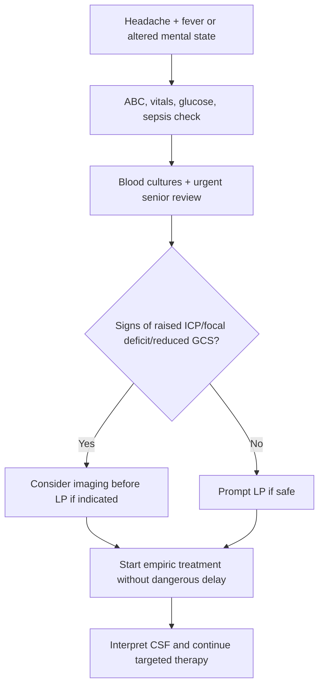
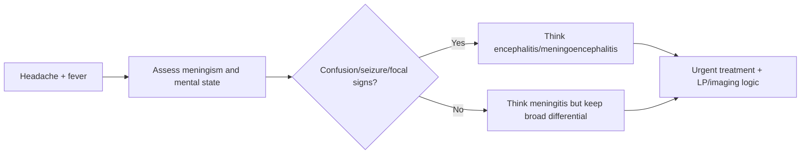

# Meningitis and encephalitis clues

Related: [[../Neurology MOC|Neurology MOC]] · [[../Headache Syndromes|Headache Syndromes]] · [[Secondary headache red flags]] · [[Subarachnoid hemorrhage and thunderclap headache]] · [[Raised intracranial pressure and mass lesion clues]] · [[../Meningitis/Bacterial meningitis|Bacterial meningitis]] · [[../Meningitis/CSF pattern interpretation in meningitis|CSF pattern interpretation in meningitis]]

> [!danger]
> Headache with **fever, altered mental state, meningism, seizure, or focal deficit** must trigger urgent consideration of **meningitis or encephalitis**.

> [!important]
> Exam rule: **meningitis = meningeal irritation with infection; encephalitis = brain parenchymal inflammation causing altered behavior, confusion, seizures, or focal deficits.** Overlap is common.

## Learning Objectives
- Distinguish meningitis from encephalitis clinically.
- Recognize the red-flag headache pattern suggesting CNS infection.
- Know the emergency approach, including blood cultures, antibiotics/acyclovir timing, imaging caution, and LP logic.
- Interpret the broad CSF pattern at exam level.

## Definition
### Meningitis
Inflammation/infection of the meninges producing headache, fever, photophobia, neck stiffness, and systemic illness.

### Encephalitis
Inflammation/infection of brain parenchyma producing headache plus **altered mental state, behavioral change, seizures, or focal neurology**.

## Relevant Neuroanatomy
- meninges surround brain and spinal cord and generate meningeal pain/neck stiffness when inflamed
- cerebral cortex and limbic structures are often implicated in encephalitic confusion, behavior change, and seizures
- raised ICP may complicate severe meningitic or encephalitic processes

## Relevant Neurophysiology
- meningeal inflammation activates pain-sensitive structures causing headache and photophobia
- parenchymal involvement disrupts cortical function, causing confusion, reduced consciousness, and seizures
- inflammatory edema may impair cerebral perfusion and raise ICP

## Normal Values / Important Cut-offs
- There is no single bedside numeric cutoff; the emergency pattern matters.
- Fever + headache + neck stiffness = meningitis until excluded.
- Headache + fever + altered mental state/seizure = encephalitis or meningoencephalitis until excluded.
- CSF pattern is high-yield:
  - bacterial: neutrophils, high protein, low glucose
  - viral: lymphocytes, moderately high protein, glucose often near normal

## Classification
### By syndrome
1. meningitis
2. encephalitis
3. meningoencephalitis

### By broad cause
1. bacterial
2. viral
3. tuberculous/fungal in selected contexts
4. autoimmune/inflammatory mimics

## Etiology / Causes
### Meningitis causes
- bacterial meningitis
- viral meningitis
- tuberculous meningitis
- fungal meningitis in immunocompromised patients

### Encephalitis causes
- herpes simplex encephalitis
- other viral encephalitides
- autoimmune encephalitis as an important mimic

## Risk Factors
- immunosuppression
- extremes of age
- recent ENT infection or CSF leak for some bacterial cases
- exposure/infectious contacts
- travel and immune context where relevant

## Pathophysiology
1. pathogen reaches meninges or parenchyma
2. inflammatory response causes edema and cytokine-mediated dysfunction
3. meningitis causes meningeal irritation and headache
4. encephalitis causes cortical dysfunction, seizures, and altered sensorium
5. severe disease may cause raised ICP, herniation, shock, or death

## Clinical Features
### Suggestive of meningitis
- fever
- headache
- photophobia
- neck stiffness
- vomiting
- reduced appetite/systemic illness

### Suggestive of encephalitis
- confusion
- altered behavior/personality change
- focal deficit
- seizures
- reduced consciousness

### Alarming overlap clues
- rash/sepsis pattern
- immunocompromised state
- papilledema
- rapidly deteriorating consciousness

## Approach / Algorithm

## Investigations
### Immediate
- blood cultures
- FBC, CRP, U&E, glucose
- urgent CT head only if indicated by focal deficit, papilledema, reduced GCS, seizure, or concern for raised ICP/mass effect
- lumbar puncture if safe

### CSF interpretation essentials
- opening pressure when relevant
- cell count and differential
- protein
- glucose with paired serum glucose
- Gram stain/culture/PCR as available

## Interpretation Frameworks
### Meningitis versus encephalitis clues
| Feature | Meningitis | Encephalitis |
|---|---|---|
| Fever | common | common |
| Neck stiffness | common | may occur |
| Confusion/behavior change | less prominent early | prominent |
| Seizure | possible | commoner |
| Focal neurological deficit | less typical | more suggestive |

### High-yield CSF pattern table
| Pattern | Likely implication |
|---|---|
| neutrophilic CSF + low glucose + high protein | bacterial meningitis |
| lymphocytic CSF + near-normal glucose | viral pattern |
| mixed/atypical pattern | consider TB, fungal, partially treated infection, autoimmune causes |

## Diagnosis
The diagnosis is clinical plus CSF/microbiological support. In practice:
- **suspect early**
- **treat early**
- **do not delay treatment excessively while arranging LP/imaging**

## Differential Diagnosis
- SAH
- severe migraine with meningism-like photophobia
- brain abscess
- autoimmune encephalitis
- cerebral malaria or systemic sepsis with encephalopathy where relevant
- raised ICP/mass lesion

## Tables / Comparison Charts
### Headache red-flag comparison
| Feature | Meningitis/encephalitis | SAH | Migraine |
|---|---|---|---|
| fever | common | uncommon | absent |
| thunderclap onset | uncommon | classic | uncommon |
| neck stiffness | common | may occur | occasional photophobia only |
| altered mental state | encephalitis clue | possible if severe SAH | unusual |
| seizure | can occur | can occur | uncommon |

## Management
### Immediate principles
- ABC stabilization
- prompt empiric antimicrobials when bacterial meningitis is suspected
- acyclovir when HSV encephalitis is a serious possibility
- dexamethasone in appropriate bacterial meningitis contexts per local protocol
- urgent LP if safe, but do not dangerously delay treatment

### Monitoring
- GCS and vitals
- seizure monitoring
- hydration/electrolytes
- signs of raised ICP

## Drug Interactions / Contraindications / Comorbidity Cautions
- Immunocompromised patients may have atypical organisms and blunted signs.
- Prior antibiotics can alter CSF/culture yield.
- LP may be unsafe before imaging in focal deficit, papilledema, markedly reduced consciousness, or mass-effect concern.
- Delay in acyclovir can worsen HSV encephalitis outcome.

## Procedures / Indications / Contraindications
### Procedure mini-section: lumbar puncture
- **Indication:** suspected CNS infection when safe
- **Purpose:** CSF cell count, protein, glucose, microbiology/PCR
- **Contraindication/caution:** focal deficit, papilledema, mass-effect concern, severe cardiorespiratory instability
- **Complication:** herniation if performed unsafely; post-LP headache; traumatic tap

## Complications
- raised intracranial pressure
- seizures
- shock and sepsis
- hearing deficit in some meningitis cases
- focal deficits
- cognitive/behavioral sequelae
- death

## Red Flags / Emergencies
- fever + headache + neck stiffness
- headache + altered behavior or confusion
- new seizure
- focal deficit
- reduced consciousness
- purpuric rash or septic picture

## Prognosis
Prognosis depends on organism, delay to treatment, age, consciousness level, seizure burden, and complications such as raised ICP or shock.

## Topic Correlation
- [[Subarachnoid hemorrhage and thunderclap headache]]
- [[Raised intracranial pressure and mass lesion clues]]
- [[../Meningitis/Bacterial meningitis|Bacterial meningitis]]
- [[../Meningitis/CSF pattern interpretation in meningitis|CSF pattern interpretation in meningitis]]
- [[../Parenchymal Viral Infections/Herpes simplex encephalitis|Herpes simplex encephalitis]]

## Special Situations
- **Immunocompromised patient:** broaden differential to fungal/TB/opportunistic infection.
- **Elderly patient:** presentation may be confusion without classic neck stiffness.
- **Child or young adult with rash:** meningococcal sepsis concern.

## FCPS/MRCP High-Yield Points
- Fever + headache + meningism = meningitis until excluded.
- Altered behavior, confusion, and seizures strongly suggest encephalitic brain involvement.
- Do not delay empiric treatment dangerously while pursuing LP/imaging.
- LP is central but must be done safely.
- CSF pattern interpretation is a favorite exam theme.

## Common Viva Questions
1. Differentiate meningitis from encephalitis.
2. When should CT be considered before LP?
3. What CSF pattern suggests bacterial meningitis?
4. Why is acyclovir important in encephalitis workup?
5. Name red flags suggesting raised ICP.

## Common Confusions / Exam Traps
- Do not assume all headache with photophobia is migraine.
- Do not forget encephalitis may present chiefly with confusion or seizure.
- Do not delay antibiotics/acyclovir excessively for LP.
- Do not perform LP blindly in unsafe raised-ICP situations.

## Mnemonics
- **MENINGITIS:** **M**eningism, **E**levated temperature, **N**eck stiffness, **I**nfection, **N**ausea, **G**lucose low in bacterial, **I**nvestigate CSF, **T**reat early, **I**CP caution, **S**eizures possible.

## Mind Map
- Headache + infection clues
  - meningitis
    - fever
    - neck stiffness
    - photophobia
  - encephalitis
    - confusion
    - seizures
    - focal deficit
  - investigations
    - blood cultures
    - LP
    - CT if unsafe for immediate LP
  - treatment
    - antibiotics
    - acyclovir

## Flowchart

## Suggested Visuals / Image Notes
- meningitis vs encephalitis comparison table
- CSF pattern chart
- LP safety checklist before procedure

## One-Page Revision Summary
- **Meningitis:** headache, fever, photophobia, neck stiffness.
- **Encephalitis:** headache plus confusion, behavior change, seizures, focal deficits.
- **Investigations:** blood cultures, LP if safe, CT first only when indicated by focal deficit/reduced GCS/papilledema/raised ICP concern.
- **Treatment:** do not delay empiric antibiotics and consider acyclovir when HSV encephalitis is possible.
- **CSF:** bacterial = neutrophils, high protein, low glucose; viral = lymphocytes, moderate protein rise, glucose often normal.

## 24-Hour Recall Prompts
- State three clues favoring encephalitis over meningitis.
- Say when CT is needed before LP.
- Recite the bacterial versus viral CSF pattern.
- Explain why treatment should not wait excessively for LP.

## 7-Day / 15-Day / 30-Day Revision Tracker
- **7 days:** compare SAH, meningitis, encephalitis.
- **15 days:** practice CSF interpretation questions.
- **30 days:** answer a viva on LP timing and safety.

## Must Know / Should Know / Nice to Know
### Must Know
- fever + headache + meningism = emergency
- confusion/seizure/focal deficit = think encephalitis
- LP if safe; image first only when indicated
- start treatment early

### Should Know
- bacterial vs viral CSF patterns
- immunocompromised and elderly atypical presentations

### Nice to Know
- autoimmune encephalitis as mimic

## Self-Test Scorecard
- Recognition of CNS infection /10
- LP safety /10
- CSF interpretation /10
- Treatment urgency /10
- Viva confidence /10

## Summary
Meningitis and encephalitis are major secondary headache emergencies. The diagnostic core is rapid recognition of fever, meningism, altered mental state, seizures, or focal deficits; safe CSF acquisition when possible; and prompt antimicrobial/acyclovir therapy without harmful delay.

## MCQs (10)
1. The feature most suggestive of encephalitis rather than uncomplicated meningitis is:
   - A. Fever alone
   - B. Altered behavior and seizures
   - C. Mild nausea
   - D. Isolated neck pain
   - **Answer: B**
2. A classic triad strongly suggesting meningitis includes headache, fever, and:
   - A. Tremor
   - B. Neck stiffness
   - C. Constipation
   - D. Cataract
   - **Answer: B**
3. Which CSF pattern most strongly suggests bacterial meningitis?
   - A. Lymphocytes with normal protein
   - B. Neutrophils, high protein, low glucose
   - C. No cells with low protein
   - D. Eosinophils only
   - **Answer: B**
4. Which clinical feature most strongly suggests parenchymal brain involvement?
   - A. Confusion
   - B. Mild rhinorrhea
   - C. Hair loss
   - D. Ankle edema
   - **Answer: A**
5. CT before LP is especially considered when there is:
   - A. Focal deficit or papilledema
   - B. Mild myalgia only
   - C. Chronic dyspepsia
   - D. Normal examination and no red flags
   - **Answer: A**
6. A dangerous error in suspected bacterial meningitis is:
   - A. Starting treatment promptly
   - B. Delaying antibiotics excessively while waiting for tests
   - C. Checking blood cultures
   - D. Monitoring GCS
   - **Answer: B**
7. Acyclovir is especially important when:
   - A. HSV encephalitis is possible
   - B. Hypertension is present
   - C. Otitis externa alone exists
   - D. Migraine is confirmed
   - **Answer: A**
8. Which symptom most favors meningitis/encephalitis over migraine?
   - A. Photophobia only
   - B. Fever and meningism
   - C. Unilateral throbbing only
   - D. Family history
   - **Answer: B**
9. LP in an unsafe raised-ICP situation risks:
   - A. Herniation
   - B. Asthma attack
   - C. Jaundice
   - D. Pancreatitis
   - **Answer: A**
10. The best summary statement is:
   - A. CNS infection headache is usually non-urgent
   - B. Meningitis and encephalitis require urgent recognition, safe LP strategy, and early treatment
   - C. Antibiotics should always wait for LP
   - D. Encephalitis never causes seizure
   - **Answer: B**

## SBA Questions (10)
1. A 21-year-old student presents with fever, severe headache, photophobia, and neck stiffness. What diagnosis must be considered immediately?  
   **Answer: Meningitis**
2. A 34-year-old man has headache, fever, agitation, and focal seizures. What syndrome is most likely?  
   **Answer: Encephalitis/meningoencephalitis**
3. A patient with suspected CNS infection has papilledema and reduced GCS. What is the best LP principle?  
   **Answer: Assess with imaging first because immediate LP may be unsafe.**
4. What CSF pattern is classically associated with bacterial meningitis?  
   **Answer: Neutrophilic pleocytosis, high protein, low glucose**
5. Why should empiric antibiotics not be dangerously delayed in suspected bacterial meningitis?  
   **Answer: Delay worsens morbidity and mortality.**
6. What additional antiviral is important when HSV encephalitis is possible?  
   **Answer: Acyclovir**
7. An elderly patient has fever, confusion, and headache but little neck stiffness. What important caution applies?  
   **Answer: CNS infection can present atypically, especially in older or immunocompromised patients.**
8. Which feature most clearly separates encephalitis from isolated meningitis?  
   **Answer: Altered mental state or focal cortical dysfunction**
9. In viva, what is the first bedside distinction you should make when assessing headache with possible CNS infection?  
   **Answer: Whether there is meningeal irritation alone or brain parenchymal involvement with confusion/seizure/focal deficits.**
10. What is the safest general strategy for diagnosis?  
   **Answer: Treat early, obtain CSF when safe, and integrate clinical findings with microbiology/imaging.**

## Flashcards
- Q: What triad suggests meningitis?  
  A: Headache, fever, and neck stiffness.
- Q: What extra features suggest encephalitis?  
  A: Confusion, behavior change, seizures, focal deficits.
- Q: What CSF pattern suggests bacterial meningitis?  
  A: Neutrophils, high protein, low glucose.
- Q: When might CT come before LP?  
  A: When focal deficit, papilledema, reduced GCS, or raised-ICP concern is present.
- Q: Why is acyclovir important?  
  A: It covers possible HSV encephalitis early.

## Answer Key with Explanations
- Fever plus headache should trigger a search for CNS infection.
- **Mental state change and seizures** are especially valuable for identifying encephalitic involvement.
- **LP is central but must be safe**, and **treatment should be early**, not postponed for perfect diagnostics.
