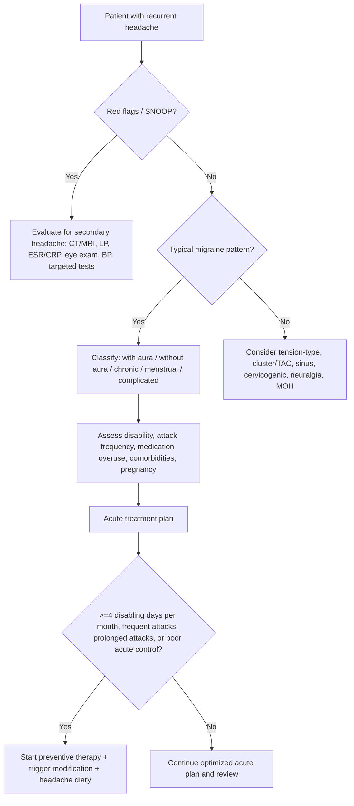
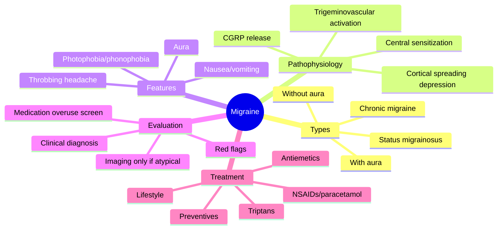
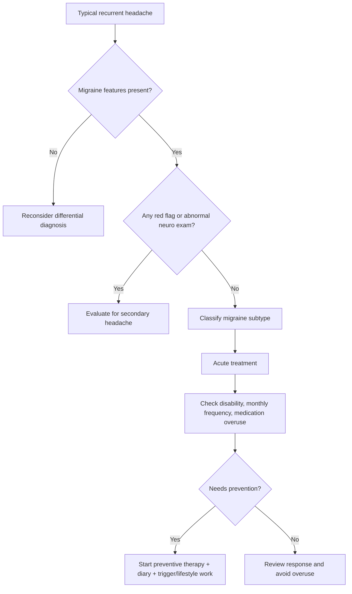

# Migraine with and without aura

Related: [[../Neurology MOC|Neurology MOC]] · [[../Headache Syndromes|Headache Syndromes]] · [[Primary headache syndromes|Primary headache syndromes]] · [[Tension-type headache]] · [[Trigeminal autonomic cephalalgias and cluster headache]]

> [!important]
> Migraine is a **primary headache disorder** characterized by **recurrent attacks** of headache with associated **nausea, vomiting, photophobia, phonophobia**, and sometimes **transient focal neurological aura**.

> [!tip]
> FCPS/MRCP habit: first decide **primary migraine vs secondary dangerous headache**. A good migraine answer always mentions **red flags**, **medication-overuse headache**, and **acute vs preventive treatment**.

## Learning Objectives
- Define migraine and classify **migraine without aura** and **migraine with aura**.
- Recognize the typical clinical pattern and distinguish it from dangerous secondary headache.
- Explain the role of trigeminovascular activation, cortical spreading depression, and CGRP.
- Apply a practical diagnostic approach, including when neuroimaging is needed.
- Manage acute attacks and select preventive therapy based on frequency, disability, and comorbidity.

## Definition
Migraine is a **common recurrent primary headache syndrome** causing episodic or chronic attacks of headache, usually **unilateral**, **pulsatile**, **moderate to severe**, worsened by routine physical activity, and accompanied by **nausea and/or photophobia/phonophobia**.

- **Migraine without aura**: recurrent headache attacks fulfilling migraine features without preceding focal neurological symptoms.
- **Migraine with aura**: migraine attacks preceded or accompanied by **fully reversible neurological symptoms**, most commonly **visual aura**, less often sensory, speech/language, brainstem, retinal, or motor aura.

## Relevant Neuroanatomy
### Pain-sensitive structures in headache
The brain parenchyma itself is relatively insensitive to pain. Migraine pain arises from activation of pain-sensitive structures such as:
- dura mater
- dural venous sinuses
- large intracranial and extracranial arteries
- proximal cranial nerves, especially trigeminal afferents
- upper cervical roots and trigeminocervical complex

### Trigeminovascular system
Key anatomical pathway:
- trigeminal afferents innervate meningeal and cerebral vessels
- impulses relay through the **trigeminal nucleus caudalis**
- second-order neurons connect with thalamus
- cortical processing produces pain perception and sensory hypersensitivity

### Aura-related anatomy
Aura usually reflects transient cortical dysfunction, most often in:
- **occipital cortex** → visual aura
- **parietal sensory cortex** → sensory aura
- **dominant hemisphere language areas** → dysphasic aura
- **brainstem networks** → brainstem aura symptoms

## Relevant Neurophysiology
### Normal headache modulation
Pain perception is modified by:
- brainstem nuclei, especially dorsal raphe and locus coeruleus
- descending inhibitory pathways using serotonin and noradrenaline
- hypothalamic influence on sleep, appetite, and circadian modulation

### Migraine physiology
Migraine involves abnormal sensory processing with:
- trigeminovascular activation
- release of vasoactive neuropeptides, especially **CGRP**
- central sensitization causing cutaneous allodynia and attack persistence
- cortical spreading depression, especially relevant to aura

## Normal Values / Important Cut-offs
Important exam cut-offs:
- **Migraine without aura attack duration**: **4-72 hours** untreated or unsuccessfully treated
- **Aura duration**: individual aura symptom usually **5-60 minutes**
- **Chronic migraine**: headache on **>=15 days/month for >3 months**, with migraine features on **>=8 days/month**
- **Status migrainosus**: debilitating migraine attack lasting **>72 hours**
- **Medication-overuse headache risk thresholds**:
  - triptans, ergots, opioids, combination analgesics: **>=10 days/month**
  - simple analgesics/NSAIDs/paracetamol: **>=15 days/month**
- **Menstrual migraine window**: typically **day -2 to +3 of menstruation**

## Classification
### Core types relevant for FCPS/MRCP
1. **Migraine without aura**
2. **Migraine with aura**
3. **Chronic migraine**
4. **Complications of migraine**
   - status migrainosus
   - persistent aura without infarction
   - migrainous infarction
   - migraine aura-triggered seizure
5. **Probable migraine**

### Common aura subtypes
- visual aura
- sensory aura
- speech/language aura
- brainstem aura
- retinal migraine
- hemiplegic migraine

## Etiology / Causes
Migraine is a **primary disorder** with strong genetic and neurobiological influences.

Contributing factors:
- positive family history
- genetically determined neuronal hyperexcitability
- hormonal fluctuation, especially estrogen withdrawal
- environmental and behavioral triggers

## Risk Factors
- female sex
- family history of migraine
- adolescence and young adult onset
- menstrual/hormonal variation
- sleep deprivation or oversleeping
- stress and post-stress let-down
- fasting, dehydration
- obesity, especially for chronic migraine risk
- anxiety, depression
- medication overuse

## Pathophysiology
Migraine is no longer explained simply as "vascular headache." It is a **neurovascular disorder**.

### Current mechanistic model
1. **Predisposed brain** with heightened excitability
2. Trigger exposure or internal fluctuation
3. **Cortical spreading depression** may occur, especially in aura
4. Activation of **trigeminovascular system**
5. Release of **CGRP**, substance P, and inflammatory mediators
6. Vasodilation plus sterile neurogenic inflammation of meninges
7. Peripheral then central sensitization
8. Throbbing pain, nausea, photophobia, phonophobia, allodynia

### Aura mechanism
Aura likely results from **cortical spreading depression**:
- slowly propagating wave of neuronal depolarization followed by suppression
- spreads across cortex at a few mm/min
- explains gradual progression of aura symptoms
- reversible because structural injury is absent in typical aura

### Why nausea and photophobia occur
- hypothalamic and brainstem involvement
- trigeminal-autonomic interactions
- central sensory amplification

## Clinical Features
### Typical migraine headache
- recurrent episodic attacks
- unilateral or bilateral headache; unilateral is common but not mandatory
- pulsating/throbbing quality
- moderate to severe intensity
- aggravated by routine physical activity
- patient prefers rest in a dark quiet room

### Associated symptoms
- nausea
- vomiting
- photophobia
- phonophobia
- osmophobia in some patients
- cutaneous allodynia in established or severe attacks

### Prodrome
Hours to 1-2 days before attack:
- yawning
- food craving
- mood change
- neck stiffness
- fatigue
- poor concentration
- urinary frequency

### Aura features
Most aura is visual:
- scintillating scotoma
- fortification spectra
- flashing lights
- zig-zag lines
- hemifield visual disturbance

Other aura symptoms:
- unilateral tingling spreading gradually from hand to arm to face
- numbness
- dysphasia
- less commonly vertigo, dysarthria, diplopia, tinnitus, ataxia in brainstem aura

Typical aura clues:
- gradual development over minutes, not sudden maximal onset
- march/spread of symptoms
- complete reversibility
- usually followed by headache within 60 minutes

### Variants and special patterns
- **Migraine without aura**: commonest form
- **Migraine with aura**: transient neurological symptoms precede/accompany headache
- **Menstrual migraine**: around menses, often without aura
- **Chronic migraine**: frequent headaches, often transformed from episodic migraine
- **Vestibular migraine**: episodic vertigo with migraine association

## Approach / Algorithm

### Practical clinical approach
1. Confirm whether headache is likely **primary** or **secondary**.
2. Ask about onset: sudden thunderclap vs gradual recurrent stereotyped attacks.
3. Identify migraine features:
   - unilateral/pulsatile
   - nausea/vomiting
   - photophobia/phonophobia
   - worsened by activity
4. Ask for aura details and check whether they are **fully reversible** and **gradual**.
5. Screen for red flags and abnormal neurological examination.
6. Assess attack frequency, disability, triggers, and current analgesic use.
7. Decide acute treatment and whether preventive therapy is indicated.

## Investigations
### Usually not needed when history is classic
Migraine is a **clinical diagnosis**. Routine tests are often normal and unnecessary if:
- typical recurrent migraine pattern
- normal neurological examination
- no red flags

### When to investigate
Do neuroimaging or other tests if there is:
- first or worst headache
- thunderclap onset
- new headache after age 50
- focal deficit not fitting typical aura
- persistent neurological deficit
- papilledema
- fever, meningism, altered consciousness
- new headache in cancer, HIV, pregnancy/postpartum, anticoagulated, or immunocompromised patient
- change in established headache pattern
- seizure with atypical headache

### Possible investigations when red flags exist
- **MRI brain** preferred for many non-acute secondary causes
- **CT head** if acute bleed or emergency concern
- **LP** if meningitis/SAH/raised pressure questions remain after imaging logic is respected
- ESR/CRP if giant cell arteritis suspected
- pregnancy test when relevant
- fundoscopy for papilledema
- BP measurement for hypertensive emergency

## Interpretation Frameworks
### 1. Migraine vs dangerous secondary headache
Features favoring migraine:
- recurrent stereotyped attacks over months/years
- normal examination between attacks
- nausea, photophobia, phonophobia
- family history
- gradual aura with full recovery

Features favoring secondary headache:
- sudden thunderclap onset
- fever or meningism
- persistent focal deficit
- papilledema
- progressive worsening pattern
- immunosuppression/cancer
- head trauma
- pregnancy/postpartum red flags

### 2. Interpreting aura
Typical migraine aura:
- positive symptoms first, e.g. flashing lights, tingling
- gradual spread
- 5-60 minutes
- fully reversible

Suggest TIA/stroke rather than aura:
- abrupt onset
- negative symptoms only from the start, e.g. complete vision loss, dense weakness
- no spread/march
- major vascular risk profile
- persistent deficit

### 3. Medication-overuse headache clue set
Think of medication overuse if:
- headache frequency is rising
- daily or near-daily analgesic use
- early morning headache
- short-lived relief from abortive drugs
- chronic migraine pattern emerging

## Diagnosis
### Migraine without aura: practical diagnostic points
Diagnosis is likely if there are recurrent attacks lasting **4-72 hours** with at least two of:
- unilateral location
- pulsating quality
- moderate/severe intensity
- aggravation by routine physical activity

And at least one of:
- nausea and/or vomiting
- photophobia and phonophobia

### Migraine with aura: practical diagnostic points
Diagnosis is likely if there are recurrent attacks with **fully reversible aura symptoms**, usually visual/sensory/speech, with typical features such as:
- gradual spread over >=5 minutes
- two or more symptoms in succession may occur
- each symptom lasts 5-60 minutes
- at least one unilateral symptom
- at least one positive symptom
- headache accompanies or follows within 60 minutes

## Differential Diagnosis
- [[Tension-type headache]]
- [[Trigeminal autonomic cephalalgias and cluster headache]]
- medication-overuse headache
- subarachnoid hemorrhage
- meningitis/encephalitis
- brain tumor / raised ICP
- temporal arteritis
- acute angle-closure glaucoma
- cervicogenic headache
- sinus-related facial pain
- TIA or occipital seizure when aura is atypical

## Tables / Comparison Charts
### Migraine vs tension-type vs cluster headache
| Feature | Migraine | Tension-type headache | Cluster headache |
|---|---|---|---|
| Pain quality | Throbbing/pulsatile | Tight/band-like/pressing | Severe boring/piercing |
| Site | Often unilateral, may be bilateral | Usually bilateral | Strictly unilateral orbital/temporal |
| Severity | Moderate to severe | Mild to moderate | Very severe |
| Activity effect | Worse with activity | Not markedly worse | Patient restless/agitated |
| Nausea/vomiting | Common | Uncommon | May occur but autonomic signs dominate |
| Photophobia/phonophobia | Common | Mild/absent | Less prominent |
| Autonomic features | Usually absent or mild | Absent | Prominent: lacrimation, conjunctival injection, rhinorrhea, ptosis |
| Duration | 4-72 h | 30 min to days | 15-180 min |
| Aura | May occur | No | No typical aura |

### Migraine aura vs TIA
| Feature | Migraine aura | TIA |
|---|---|---|
| Onset | Gradual | Sudden |
| Symptom type | Often positive then negative | Often negative |
| March/spread | Common | Uncommon |
| Duration | 5-60 min usually | Often minutes, variable |
| Recovery | Complete | May be complete, but vascular risk context important |
| Followed by headache | Common | Usually absent |

### Acute treatment options
| Drug/class | Use | Important cautions |
|---|---|---|
| Paracetamol | Mild attack, pregnancy-friendly | Avoid overuse |
| NSAIDs e.g. ibuprofen, naproxen | Mild-moderate attacks | Gastritis, renal disease, peptic ulcer, late pregnancy |
| Triptans | Moderate-severe attacks, early use | Avoid in ischemic heart disease, uncontrolled hypertension, hemiplegic/brainstem migraine by traditional teaching, severe vascular disease |
| Antiemetics e.g. metoclopramide, prochlorperazine | Nausea, improves absorption | Extrapyramidal effects, QT issues depending on drug |
| IV fluids + parenteral antiemetic/NSAID | ED/severe dehydration | Individual contraindications |
| Ergot derivatives | Rarely used now | Many vascular contraindications, pregnancy contraindicated |

### Preventive drugs
| Drug | Best use cases | Important cautions |
|---|---|---|
| Propranolol | Common first-line preventive | Asthma, bradycardia, depression caution |
| Topiramate | Useful if obese patient or chronic migraine | Cognitive slowing, paresthesia, kidney stones, teratogenic risk |
| Amitriptyline | Good if insomnia/tension overlap | Sedation, anticholinergic effects, arrhythmia caution |
| Valproate | Effective but often avoided in women of childbearing potential | Major teratogenicity, weight gain, hepatotoxicity |
| Flunarizine* | Used in some settings | Weight gain, depression, parkinsonism caution |
| Candesartan | Alternative preventive | Hypotension, pregnancy contraindication |
| CGRP monoclonal therapies | Refractory/frequent migraine | Cost/access issues; specific agent cautions |

> [!note]
> *Availability varies by country and practice setting.

## Management
### General principles
- reassure after excluding secondary causes
- identify triggers but do not over-medicalize every trigger
- encourage regular sleep, meals, hydration, exercise
- use a **headache diary**
- avoid medication overuse

### Acute treatment
#### Mild to moderate attacks
- paracetamol
- NSAID such as ibuprofen, naproxen, diclofenac
- antiemetic if nausea is prominent

#### Moderate to severe attacks or poor response to simple analgesics
- **triptan** early in attack, e.g. sumatriptan, rizatriptan, zolmitriptan
- combine with NSAID in selected patients
- antiemetic if vomiting limits oral therapy

#### Severe ED/inpatient attack / status migrainosus approach
- fluids if dehydrated
- parenteral antiemetic such as metoclopramide or prochlorperazine
- parenteral NSAID where appropriate
- consider dexamethasone in selected emergency settings to reduce recurrence
- avoid unnecessary opioids

### Preventive treatment
Consider prevention if any of the following:
- frequent attacks, often >=4 disabling headache days/month
- prolonged or severe attacks
- significant functional impairment
- poor response or contraindication to acute therapy
- medication-overuse tendency
- patient preference

Common preventive options:
- propranolol
- topiramate
- amitriptyline
- valproate in selected patients but avoid in pregnancy and women of childbearing potential where possible
- candesartan or other alternatives based on profile
- CGRP-targeted therapy in refractory/frequent disease if available

### Non-pharmacological prevention
- regular sleep
- stress management
- aerobic exercise
- weight reduction if appropriate
- caffeine moderation
- trigger and menstrual pattern review
- behavioral therapy if anxiety/depression contribute

### Menstrual migraine strategies
- mini-prophylaxis with naproxen or triptan around predictable cycle in selected cases
- hormonal strategies may help but require individualized assessment

## Drug Interactions / Contraindications / Comorbidity Cautions
### Triptans
Avoid or use extreme caution in:
- ischemic heart disease
- prior stroke/TIA
- uncontrolled hypertension
- severe peripheral vascular disease
- basilar/brainstem and hemiplegic migraine are traditionally listed as contraindication contexts in exams

Important interactions:
- caution with other serotonergic drugs due to theoretical serotonin syndrome risk, though absolute risk is low
- avoid using two triptans or triptan + ergot too close together

### NSAIDs
Caution in:
- CKD
- peptic ulcer disease
- GI bleeding risk
- heart failure
- uncontrolled hypertension
- late pregnancy

### Topiramate
Caution in:
- pregnancy or conception planning
- nephrolithiasis
- cognitive-demanding occupations because of word-finding/cognitive slowing
- may reduce efficacy of some oral contraceptives at higher doses

### Valproate
Avoid if possible in:
- pregnancy
- women of childbearing potential unless no safer alternative and strict counseling
- liver disease

### Beta-blockers
Use caution/avoid in:
- asthma
- bradycardia
- heart block
- decompensated heart failure

### Amitriptyline
Caution in:
- glaucoma
- urinary retention
- elderly frail patients
- prolonged QT/arrhythmia risk

## Procedures / Indications / Contraindications
Routine procedures are not part of uncomplicated migraine care, but exam relevance includes deciding **when not to perform LP blindly**.

- **Neuroimaging** is indicated when red flags or atypical features suggest secondary headache.
- **LP** may be needed if meningitis or SAH remains a concern after proper imaging logic.
- Do **not** perform LP first when there are signs of raised intracranial pressure or focal mass effect concern without appropriate imaging.

## Procedure Mini-Sections
### Lumbar puncture in headache workup
- **Indications:** suspected meningitis, SAH not confirmed on CT but still suspected, inflammatory/infective CNS evaluation
- **Contraindications / cautions:** suspected raised ICP with mass lesion risk, focal deficit suggesting mass effect, papilledema in concerning context, local infection, coagulopathy
- **Complications:** post-LP headache, bleeding, infection, herniation if contraindications ignored
- **Viva pearls:** migraine itself does not need LP; LP is used only when secondary causes are being excluded

## Complications
- chronic migraine
- medication-overuse headache
- status migrainosus
- migrainous infarction, rare
- reduced quality of life, absenteeism, depression/anxiety association

## Red Flags / Emergencies
Use a **SNOOP-type** headache red flag screen.

Red flags include:
- **S**ystemic symptoms: fever, weight loss, malignancy, HIV
- **N**eurological deficit or confusion
- **O**nset sudden/thunderclap
- **O**lder age at first onset, especially >50 years
- **P**attern change/progressive headache/papilledema/positional precipitation/pregnancy-related concern

Specific dangerous mimics to mention in exams:
- subarachnoid hemorrhage
- meningitis
- raised ICP / brain tumor
- temporal arteritis
- acute glaucoma
- cerebral venous thrombosis
- hypertensive emergency

## Prognosis
- Many patients improve with education and individualized treatment.
- Some progress from episodic to chronic migraine, especially with medication overuse, obesity, and psychiatric comorbidity.
- Aura usually remains reversible, but migraine with aura is associated with a small increase in ischemic stroke risk, especially in women who smoke or use estrogen-containing contraceptives.

## Topic Correlation
- [[Tension-type headache]]: pressing, non-throbbing, less nausea
- [[Trigeminal autonomic cephalalgias and cluster headache]]: short, severe unilateral attacks with autonomic signs
- [[Meningitis]]: headache with fever/meningism/altered sensorium
- [[Neuroimaging/Non-contrast CT head basics|Non-contrast CT head basics]]: emergency exclusion of hemorrhage when red flags exist
- [[Clinical Examination of the Nervous System/UMN vs LMN pattern|UMN vs LMN pattern]]: helps distinguish unrelated focal deficits from aura mimics

## Special Situations
### Pregnancy
- migraine may improve during pregnancy, especially without aura
- first-line acute options usually start with **paracetamol**
- avoid valproate and ergots
- NSAIDs are generally avoided in late pregnancy
- new severe headache in pregnancy/postpartum is **secondary until proven otherwise**

### Combined hormonal contraceptives
- migraine with aura increases ischemic stroke concern
- estrogen-containing contraceptives are often avoided or reconsidered in migraine with aura, especially with smoking or vascular risk factors

### Elderly onset headache
- new migraine diagnosis after 50 is less likely; look carefully for secondary causes

### Depression / anxiety / insomnia
- choose preventive drugs strategically, e.g. amitriptyline may help insomnia; avoid worsening comorbidity

## FCPS/MRCP High-Yield Points
- Migraine is a **clinical diagnosis** in typical cases.
- Visual aura is the commonest aura.
- Aura is **gradual and reversible**; TIA is usually **sudden**.
- Routine imaging is unnecessary in typical migraine with normal examination.
- Triptans are best taken **early** in the headache phase for many patients.
- Always ask about **analgesic overuse** in chronic daily headache.
- Avoid **opioid-centered management** when better migraine-specific therapy exists.
- In women with **migraine with aura**, think about stroke risk factors and contraceptive counseling.

## Common Viva Questions
1. Define migraine and classify it.
2. Differentiate migraine aura from TIA.
3. When is neuroimaging indicated in migraine?
4. What are the indications for preventive therapy?
5. What are the contraindications to triptan use?
6. What is chronic migraine?
7. What is status migrainosus?
8. What is medication-overuse headache?
9. How do you manage migraine in pregnancy?
10. Name two first-line preventive agents and their cautions.

## Common Confusions / Exam Traps
- Thinking all unilateral headaches are migraine; cluster headache and secondary causes may also be unilateral.
- Mislabeling sudden onset focal symptoms as aura when they are more compatible with TIA/stroke.
- Ordering routine CT/MRI for every classic migraine patient.
- Forgetting to ask about frequency of analgesic use.
- Prescribing triptans in patients with major vascular contraindications.
- Missing giant cell arteritis in older patients with new headache.
- Missing SAH when patient says “worst ever headache.”

## Mnemonics
### Migraine diagnostic memory aid: POUND
- **P**ulsatile quality
- **O**ne-day duration roughly 4-72 h
- **U**nilateral
- **N**ausea/vomiting
- **D**isabling intensity

### Headache red flags: SNOOP
- **S**ystemic
- **N**eurological
- **O**nset sudden
- **O**lder onset
- **P**attern change / papilledema / positional / pregnancy

## Mind Map

## Flowchart

## Suggested Visuals / Image Notes
- diagram of trigeminovascular pathway
- sketch of cortical spreading depression causing visual aura march
- comparison infographic: migraine vs tension-type vs cluster headache
- timeline diagram: prodrome → aura → headache → postdrome

## Suggested Video References
- a concise lecture on primary headache disorders and ICHD migraine classification
- a short neuro lecture on migraine aura vs TIA
- a pharmacology review of triptans and migraine preventives

## One-Page Revision Summary
### Migraine in one page
- **Primary recurrent headache disorder** with nausea, photophobia, phonophobia, and sometimes aura.
- **Without aura** is commonest; **with aura** has fully reversible focal neurological symptoms.
- Pathogenesis: **trigeminovascular activation + CGRP + central sensitization**; aura linked to **cortical spreading depression**.
- Typical attack: **4-72 h**, throbbing, moderate-severe, worse with activity, patient prefers dark quiet room.
- Aura: gradual, positive symptoms common, **5-60 min**, followed by headache within 60 min.
- Diagnose clinically if classic pattern and normal neurological exam.
- Investigate if **SNOOP red flags** or atypical pattern.
- Acute treatment: **NSAID/paracetamol ± antiemetic; triptan for moderate-severe attacks**.
- Prevention if frequent/disabling: **propranolol, topiramate, amitriptyline**, selected others.
- Always ask about **medication overuse** and consider pregnancy/vascular contraindications.

## 24-Hour Recall Prompts
- Define migraine without aura and list the core diagnostic features from memory.
- Distinguish migraine aura from TIA in 4 points.
- Write the indications for preventive migraine therapy.
- List 4 contraindications or cautions for triptan use.
- Write the red flags that should make you think of secondary headache.

## 7-Day / 15-Day / 30-Day Revision Tracker
- [ ] Day 1 completed
- [ ] 24-hour recall completed
- [ ] Day 7 revision completed
- [ ] Day 15 revision completed
- [ ] Day 30 revision completed

## Must Know / Should Know / Nice to Know
### Must Know
- migraine without aura vs with aura
- aura vs TIA differentiation
- red flags for secondary headache
- acute treatment and triptan contraindications
- indications for preventive therapy
- medication-overuse headache thresholds

### Should Know
- chronic migraine definition
- status migrainosus
- menstrual migraine strategies
- stroke risk discussion in migraine with aura

### Nice to Know
- CGRP-targeted therapies
- hemiplegic/brainstem/retinal migraine nuances
- vestibular migraine overlap

## My Weak Points
- [ ] I can clearly differentiate aura from TIA.
- [ ] I remember when imaging is not needed.
- [ ] I can choose an appropriate preventive drug based on comorbidity.

## Self-Test Scorecard
- Understanding: /10
- Recall: /10
- MCQ Performance: /10
- SBA Performance: /10
- Viva Confidence: /10
- Total: /50

> [!tip]
> Interpretation: **<35 = weak**, **35-44 = acceptable but insecure**, **45+ = strong exam-ready topic**.

## Exam Answer Modes
### Long Answer Skeleton
- definition and classification
- pathophysiology
- clinical features
- investigations / when to image
- management: acute + prophylaxis
- complications and red flags

### Short Note Skeleton
- recurrent primary headache, usually unilateral pulsatile 4-72 h
- nausea/photophobia/phonophobia common
- aura is gradual and reversible
- clinical diagnosis if typical
- treat acute attacks and consider prophylaxis if frequent

### Viva One-Liners
- Migraine is a clinical diagnosis in typical cases.
- Visual aura is the commonest aura.
- Triptans are contraindicated in significant vascular disease.
- Chronic migraine means >=15 headache days/month for >3 months with migraine features on >=8 days.

### Ward-Case Discussion Points
- exclude secondary red flags first
- ask about attack frequency and overuse of analgesics
- check pregnancy, BP, and vascular risk profile
- tailor preventive therapy to comorbidity

### Last-Night-Before-Exam Sheet
- 4-72 h headache + nausea/photophobia + worse with activity = think migraine
- aura = gradual, positive, reversible, 5-60 min
- triptan for moderate-severe; avoid in major vascular disease
- preventives: propranolol, topiramate, amitriptyline
- always mention SNOOP red flags and medication overuse

## Summary
Migraine is a highly prevalent **primary headache disorder** with a characteristic clinical pattern. The key examination skill is to identify **typical migraine**, recognize **aura**, and avoid missing **secondary dangerous headache**. Management rests on a good history, rational acute treatment, prevention in selected patients, and active avoidance of medication overuse.

## MCQs (10)
1. A 24-year-old woman has recurrent unilateral throbbing headaches lasting 12 hours with nausea and photophobia. The most likely diagnosis is:
   - A. Cluster headache
   - B. Migraine
   - C. Tension-type headache
   - D. Temporal arteritis
2. Which feature most strongly supports migraine aura rather than TIA?
   - A. Abrupt negative symptoms
   - B. Persistent dense weakness
   - C. Gradual spread of scintillating visual symptoms over minutes
   - D. Onset age 72 years
3. Typical untreated duration of migraine without aura is:
   - A. Seconds to minutes
   - B. 5-60 minutes
   - C. 4-72 hours
   - D. More than 7 days
4. Which drug is most migraine-specific for acute moderate-severe attacks?
   - A. Sumatriptan
   - B. Amoxicillin
   - C. Levodopa
   - D. Acetazolamide
5. Which is a classic indication for migraine preventive therapy?
   - A. One mild attack every 6 months
   - B. Headache due to meningitis
   - C. Frequent disabling attacks causing functional impairment
   - D. First-ever thunderclap headache
6. Medication-overuse headache is more likely if triptans are taken on:
   - A. 2 days/month
   - B. 5 days/month
   - C. 10 or more days/month
   - D. 1 day every 2 months
7. Which preventive agent is particularly problematic in pregnancy?
   - A. Valproate
   - B. Paracetamol
   - C. Metoclopramide
   - D. Magnesium antacid
8. Which feature is least typical of migraine and should raise concern for secondary headache?
   - A. Photophobia
   - B. Nausea
   - C. Recurrent similar attacks since teenage years
   - D. Thunderclap onset reaching maximal intensity in seconds
9. Chronic migraine is defined as headache on at least how many days per month for more than 3 months?
   - A. 4
   - B. 8
   - C. 10
   - D. 15
10. Which preventive agent may be particularly useful when migraine coexists with insomnia?
   - A. Amitriptyline
   - B. Ergotamine
   - C. Alteplase
   - D. Carbimazole

## SBA Questions (10)
1. A 22-year-old woman develops zig-zag flashing lights expanding across the right visual field over 20 minutes, followed by left-sided throbbing headache, nausea, and photophobia. Examination is normal. What is the most likely diagnosis?
   - A. Migraine with aura
   - B. TIA
   - C. Optic neuritis
   - D. Cluster headache
   - E. Temporal lobe epilepsy
2. A 30-year-old man has headaches on 20 days per month for 5 months. On 10 of those days, the headache is throbbing with nausea and photophobia. What is the best classification?
   - A. Episodic tension-type headache
   - B. Chronic migraine
   - C. Cluster headache
   - D. Chronic meningitis
   - E. Trigeminal neuralgia
3. A 35-year-old woman with typical migraine asks for acute therapy. She has ischemic heart disease. Which drug should generally be avoided?
   - A. Naproxen
   - B. Paracetamol
   - C. Sumatriptan
   - D. Metoclopramide
   - E. Oral rehydration
4. A 28-year-old woman has 6 disabling migraine days per month despite appropriate acute therapy. The most appropriate next step is:
   - A. Daily opioid use
   - B. Start preventive treatment
   - C. Routine LP
   - D. Immediate carotid endarterectomy
   - E. No treatment needed
5. A 26-year-old woman with migraine says she takes rizatriptan on 14 days each month and now has daily headache. The best explanation is:
   - A. Brain tumor
   - B. Temporal arteritis
   - C. Medication-overuse headache complicating migraine
   - D. Myasthenia gravis
   - E. Giant intracranial aneurysm is certain
6. A 32-year-old pregnant woman has a known history of migraine without aura. She develops a typical mild attack. The safest simple first-line acute option is usually:
   - A. Ergotamine
   - B. Valproate
   - C. Paracetamol
   - D. Combined oral contraceptive pill
   - E. Warfarin
7. A 58-year-old man presents with a new first severe headache and transient visual symptoms. Which is the best next step?
   - A. Diagnose migraine and discharge without review
   - B. Evaluate for secondary headache
   - C. Start topiramate immediately without assessment
   - D. Give chronic opioid therapy
   - E. Ignore because visual symptoms imply aura
8. A patient describes recurrent headaches with nausea and photophobia. Which feature best distinguishes cluster headache from migraine?
   - A. Pain worsened by routine activity
   - B. Need to lie quietly in a dark room
   - C. Strictly unilateral orbital pain with lacrimation and agitation
   - D. Scintillating scotoma
   - E. Menstrual association
9. A 27-year-old woman gets migraine attacks predictably around menstruation. Which term best describes this pattern?
   - A. Cervicogenic headache
   - B. Menstrual migraine
   - C. Trigeminal neuralgia
   - D. Raised intracranial pressure headache
   - E. SUNCT
10. A 29-year-old woman with migraine with aura asks about contraception. Which point is most appropriate?
   - A. Aura makes stroke risk lower
   - B. Estrogen-containing contraception may require caution or avoidance
   - C. Smoking reduces the vascular risk
   - D. Contraception advice is unrelated to migraine
   - E. She must take aspirin lifelong

## Flashcards
- Q: What is the usual untreated duration of migraine without aura?
  A: 4-72 hours.
- Q: What is the commonest type of migraine aura?
  A: Visual aura.
- Q: What is the key clinical difference between aura and TIA?
  A: Aura is usually gradual, often positive, spreads over minutes, and is fully reversible; TIA is usually abrupt and often negative.
- Q: Define chronic migraine.
  A: Headache on >=15 days/month for >3 months, with migraine features on >=8 days/month.
- Q: When should preventive therapy be considered?
  A: Frequent or disabling attacks, prolonged attacks, poor acute response, medication-overuse risk, or patient preference.
- Q: Which drugs are overuse-prone at >=10 days/month?
  A: Triptans, ergots, opioids, and combination analgesics.
- Q: Name 3 common migraine-associated symptoms.
  A: Nausea, photophobia, phonophobia.
- Q: What peptide is strongly implicated in migraine pathophysiology?
  A: CGRP.
- Q: Which acute migraine drugs are relatively contraindicated in major vascular disease?
  A: Triptans and ergots.
- Q: What emergency diagnosis must be considered in sudden “worst headache of life”?
  A: Subarachnoid hemorrhage.

## Answer Key with Explanations
### MCQs
1. **B. Migraine** — recurrent unilateral throbbing headache with nausea and photophobia is classic.
2. **C. Gradual spread of scintillating visual symptoms over minutes** — this is typical aura, unlike abrupt TIA.
3. **C. 4-72 hours** — standard duration for migraine without aura.
4. **A. Sumatriptan** — triptans are migraine-specific abortive therapy.
5. **C. Frequent disabling attacks causing functional impairment** — a standard prevention indication.
6. **C. 10 or more days/month** — triptans at this frequency can drive medication-overuse headache.
7. **A. Valproate** — strongly teratogenic and generally avoided in pregnancy.
8. **D. Thunderclap onset reaching maximal intensity in seconds** — strongly suggests secondary dangerous headache.
9. **D. 15** — chronic migraine requires >=15 headache days/month.
10. **A. Amitriptyline** — helpful when insomnia coexists.

### SBAs
1. **A. Migraine with aura** — gradual visual positive symptoms followed by migraine headache is classic.
2. **B. Chronic migraine** — >=15 headache days/month for >3 months with migraine features on >=8 days.
3. **C. Sumatriptan** — avoid triptans in significant ischemic vascular disease.
4. **B. Start preventive treatment** — 6 disabling migraine days/month is a reasonable prevention threshold.
5. **C. Medication-overuse headache complicating migraine** — frequent triptan use plus daily headache is classic.
6. **C. Paracetamol** — generally the safest simple first-line option in pregnancy.
7. **B. Evaluate for secondary headache** — new severe headache in older patient is not routine migraine until assessed.
8. **C. Strictly unilateral orbital pain with lacrimation and agitation** — classic cluster headache profile.
9. **B. Menstrual migraine** — predictable perimenstrual attacks.
10. **B. Estrogen-containing contraception may require caution or avoidance** — especially in migraine with aura because of stroke risk considerations.
