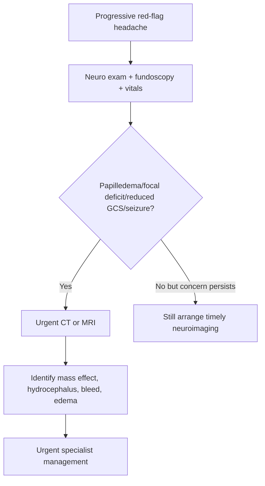
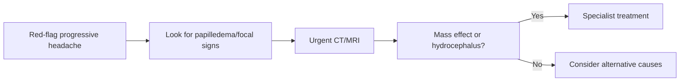

# Raised intracranial pressure and mass lesion clues

Related: [[../Neurology MOC|Neurology MOC]] · [[../Headache Syndromes|Headache Syndromes]] · [[Secondary headache red flags]] · [[Subarachnoid hemorrhage and thunderclap headache]] · [[Meningitis and encephalitis clues]] · [[../Neuroimaging/When CT is first-line in emergency neurology|When CT is first-line in emergency neurology]] · [[../Neuroimaging/Blood, mass effect, hydrocephalus, and midline shift pattern recognition|Blood, mass effect, hydrocephalus, and midline shift pattern recognition]]

> [!danger]
> Progressive headache with **early morning worsening, vomiting, papilledema, focal deficit, reduced consciousness, seizure, or Cushing response** should raise concern for **raised intracranial pressure (ICP) and an intracranial mass lesion**.

> [!important]
> Headache due to raised ICP is a **secondary headache emergency**. The key skill is recognizing the syndrome early and arranging urgent imaging rather than pursuing routine symptomatic treatment only.

## Learning Objectives
- Define raised intracranial pressure and mass-effect headache.
- Recognize high-yield symptoms and signs.
- Know when urgent CT/MRI is required.
- Understand why LP can be dangerous in mass-effect states.
- Differentiate raised-ICP headache from primary headache disorders.

## Definition
### Raised intracranial pressure
Raised ICP is abnormal elevation of pressure within the rigid cranial vault due to increased volume of brain tissue, blood, CSF, or a space-occupying lesion.

### Mass lesion clue pattern
A headache pattern suggesting a tumor, abscess, hematoma, hydrocephalus, or other space-occupying process producing mass effect or CSF flow obstruction.

## Relevant Neuroanatomy
- the skull is a fixed container
- intracranial contents include brain tissue, blood, and CSF
- mass lesions can distort midline structures, compress ventricles, obstruct CSF flow, or cause herniation syndromes
- optic disc swelling (papilledema) reflects transmitted raised pressure along the optic nerve sheath

## Relevant Neurophysiology
- Monro-Kellie principle: the cranial vault has limited compliance
- when compensatory reserve is exhausted, small volume increases cause disproportionate ICP rise
- reduced cerebral perfusion and brain shift may follow
- pressure-sensitive structures and meningeal stretch contribute to headache

## Normal Values / Important Cut-offs
- Formal numeric ICP thresholds are less important in bedside neurology than syndrome recognition.
- Practical clues:
  - progressive worsening headache
  - early morning headache or headache worse on waking
  - headache aggravated by coughing/straining
  - vomiting without much nausea
  - papilledema
  - focal deficits or reduced consciousness
- **LP is contraindication-prone** when mass effect/raised ICP is suspected until imaging safety is considered.

## Classification
### By mechanism
1. mass lesion with edema
2. hydrocephalus/CSF obstruction
3. diffuse cerebral edema
4. idiopathic intracranial hypertension-type physiology (different differential)

### By source
1. tumor
2. abscess
3. hematoma/hemorrhage
4. hydrocephalus
5. severe infection/inflammation with edema

## Etiology / Causes
- intracranial tumor
- brain abscess
- subdural/epidural/intracerebral hemorrhage
- hydrocephalus
- metastasis with edema
- large inflammatory/infective lesions

## Risk Factors
- known malignancy
- immunosuppression with abscess risk
- anticoagulation/bleeding risk
- recent infection
- progressive constitutional symptoms

## Pathophysiology
1. lesion or fluid accumulation increases intracranial volume
2. compensatory displacement of CSF/venous blood becomes exhausted
3. ICP rises
4. headache, vomiting, and papilledema appear
5. severe pressure rise causes reduced consciousness, brain shift, and herniation risk

## Clinical Features
### Headache clues
- progressive, persistent headache
- worse on waking or early morning
- worse with coughing, sneezing, straining
- change in pattern from prior primary headache

### Associated warning features
- vomiting
- papilledema
- focal neurological deficit
- cognitive or behavioral change
- new seizure
- reduced consciousness
- sixth nerve palsy in some raised-ICP states

## Approach / Algorithm

## Investigations
### First-line thinking
- urgent CT head in acute deterioration or emergency setting
- MRI if lesion characterization is needed and patient is stable enough
- fundoscopy for papilledema
- baseline blood tests as clinically indicated

### Imaging clues to seek
- mass lesion
- surrounding edema
- hydrocephalus
- midline shift
- hemorrhage
- ventricular compression or obstructed CSF pathways

## Interpretation Frameworks
### Raised ICP clue table
| Feature | Significance |
|---|---|
| early morning headache | nocturnal CO2/ICP rise clue |
| cough/strain worsening | pressure-sensitive clue |
| vomiting | raised ICP association |
| papilledema | objective sign of raised ICP |
| focal deficit | structural lesion concern |
| drowsiness/reduced GCS | severe raised ICP or herniation danger |

### Primary versus secondary headache comparison
| Feature | Raised ICP/mass lesion | Migraine/tension-type |
|---|---|---|
| progression over time | common | variable but less ominous |
| focal deficit | concerning | uncommon in routine primary headache |
| papilledema | concerning | absent |
| early morning worsening | common clue | not classic |
| vomiting without typical migraine pattern | concerning | may occur in migraine but with different overall context |

## Diagnosis
Raised-ICP headache is diagnosed by **red-flag clinical pattern plus imaging evidence** or high clinical suspicion awaiting imaging.

A strong exam phrase:
- “Any progressive headache with papilledema or focal neurological signs should be treated as raised ICP from a mass lesion until urgent neuroimaging proves otherwise.”

## Differential Diagnosis
- migraine with severe nausea/vomiting
- meningitis/encephalitis
- SAH
- idiopathic intracranial hypertension
- hypertensive encephalopathy/PRES
- medication-related headache

## Tables / Comparison Charts
### Mass lesion versus meningitis versus SAH
| Feature | Mass lesion/raised ICP | Meningitis/encephalitis | SAH |
|---|---|---|---|
| onset | progressive/subacute often | hours to days often | sudden thunderclap |
| fever | uncommon unless abscess/infection | common | uncommon |
| papilledema | common clue | may occur late | not classic presenting sign |
| focal deficit | common | possible | possible |
| neck stiffness | not dominant | common | may occur |

## Management
### Immediate priorities
- urgent imaging
- senior/neurosurgical/neurology input as needed
- head-up positioning and supportive care in appropriate settings
- seizure management if needed
- treat underlying cause: tumor, abscess, hydrocephalus, hemorrhage, edema

### Key principle
Do **not** perform LP casually when mass effect is possible.

## Drug Interactions / Contraindications / Comorbidity Cautions
- Anticoagulated patients may have hemorrhagic mass lesions/subdural collections.
- Steroid use may modify edema patterns in some tumor settings but depends on cause and specialist plan.
- LP before imaging may precipitate herniation in unsafe cases.
- Immunocompromised patients may harbor abscess or opportunistic lesions.

## Procedures / Indications / Contraindications
### Procedure mini-section: LP caution
- **Indication:** only after unsafe mass-effect states have been excluded when LP is actually needed
- **Contraindication/caution:** papilledema, focal deficit, mass-effect suspicion, markedly reduced consciousness
- **Risk:** herniation

## Complications
- herniation syndromes
- visual loss from prolonged papilledema in selected states
- seizures
- irreversible focal deficits
- reduced cerebral perfusion and death if untreated

## Red Flags / Emergencies
- papilledema
- new focal neurological deficit
- progressive drowsiness
- repeated vomiting
- seizure with headache
- Cushing response/bradycardia-hypertension in severe cases

## Prognosis
Depends on etiology, speed of recognition, reversibility of the lesion, and whether herniation or major neurological injury occurs before treatment.

## Topic Correlation
- [[Subarachnoid hemorrhage and thunderclap headache]]
- [[Meningitis and encephalitis clues]]
- [[../Neuroimaging/When CT is first-line in emergency neurology|When CT is first-line in emergency neurology]]
- [[../Neuroimaging/Blood, mass effect, hydrocephalus, and midline shift pattern recognition|Blood, mass effect, hydrocephalus, and midline shift pattern recognition]]
- [[../Meningitis/Lumbar puncture indications and contraindications|Lumbar puncture indications and contraindications]]

## Special Situations
- **Known malignancy:** think metastasis.
- **Immunocompromised patient:** think abscess/opportunistic lesion.
- **Childbearing-age obese woman with papilledema but normal imaging:** consider idiopathic intracranial hypertension in differential, but exclude mass lesion first.

## FCPS/MRCP High-Yield Points
- Progressive headache + vomiting + papilledema + focal signs = raised ICP until proven otherwise.
- CT is first-line in acute emergency assessment.
- MRI gives better lesion characterization when stable.
- LP can be dangerous if mass effect is present.
- Always distinguish primary headache from secondary red-flag headache.

## Common Viva Questions
1. What headache pattern suggests raised ICP?
2. Why is headache worse in the morning?
3. Why can LP be dangerous in a mass lesion?
4. What are the key imaging clues of mass effect?
5. Give differentials for secondary headache with vomiting.

## Common Confusions / Exam Traps
- Do not dismiss morning headache plus vomiting as simple migraine without examining for papilledema and focal signs.
- Do not perform LP before excluding unsafe mass effect when suspicion is strong.
- Do not forget abscess and hemorrhage in addition to tumor.

## Mnemonics
- **PRESSURE**: **P**apilledema, **R**educed consciousness, **E**arly morning headache, **S**train worsens pain, **S**eizure/focal signs, **U**rgent imaging, **R**isk of herniation, **E**dema/mass effect.

## Mind Map
- Raised ICP headache
  - progressive
  - early morning
  - vomiting
  - papilledema
  - focal signs
  - urgent imaging
  - no casual LP

## Flowchart

## Suggested Visuals / Image Notes
- diagram of Monro-Kellie principle
- CT showing midline shift/hydrocephalus
- papilledema fundus image

## One-Page Revision Summary
- Raised-ICP headache is usually **progressive**, worse **on waking**, and may worsen with **cough/strain**.
- Associated clues: **vomiting, papilledema, focal deficit, seizure, drowsiness**.
- Causes: **tumor, abscess, hematoma, hydrocephalus, edema**.
- Investigate with **urgent CT/MRI**.
- **LP may be dangerous** when mass effect is suspected.

## 24-Hour Recall Prompts
- List four signs suggesting raised ICP.
- Explain why LP may be dangerous.
- Differentiate mass-lesion headache from thunderclap headache.
- State when CT is first-line.

## 7-Day / 15-Day / 30-Day Revision Tracker
- **7 days:** memorize the red-flag list.
- **15 days:** compare raised ICP, SAH, and meningitis headache patterns.
- **30 days:** do viva on papilledema and LP contraindications.

## Must Know / Should Know / Nice to Know
### Must Know
- progressive morning headache + vomiting + papilledema/focal deficit
- urgent imaging
- LP caution/herniation risk

### Should Know
- common etiologies: tumor, abscess, hydrocephalus, hemorrhage
- Monro-Kellie principle basics

### Nice to Know
- IIH as differential after excluding mass lesion

## Self-Test Scorecard
- Recognition of red flags /10
- Imaging choice /10
- LP safety awareness /10
- Differential diagnosis /10
- Viva readiness /10

## Summary
Raised intracranial pressure and mass lesions produce a classic secondary headache pattern of progressive worsening headache, vomiting, papilledema, and neurological deficits. The high-yield rule is urgent neuroimaging and avoidance of unsafe LP when mass effect is suspected.

## MCQs (10)
1. A clue favoring raised ICP over primary headache is:
   - A. Long history of identical mild headaches
   - B. Papilledema
   - C. Normal examination
   - D. Relief with sleep alone
   - **Answer: B**
2. A common time pattern of raised-ICP headache is:
   - A. Only after lunch
   - B. Worse in the early morning
   - C. Strictly seasonal
   - D. Only during exercise in all cases
   - **Answer: B**
3. Which symptom often accompanies raised ICP?
   - A. Vomiting
   - B. Chronic cough only
   - C. Isolated rash
   - D. Tinnitus alone in every case
   - **Answer: A**
4. The first-line investigation in acute deterioration from suspected mass lesion is often:
   - A. CT head
   - B. EEG
   - C. NCS
   - D. Spirometry
   - **Answer: A**
5. LP can be dangerous in suspected mass effect because of risk of:
   - A. Herniation
   - B. Hyperthyroidism
   - C. Dermatitis
   - D. Nephrolithiasis
   - **Answer: A**
6. Which is a common cause of raised ICP?
   - A. Intracranial tumor
   - B. Simple tension headache
   - C. Allergic rhinitis
   - D. Hallux valgus
   - **Answer: A**
7. Focal neurological deficit with headache should make you think of:
   - A. Secondary structural cause
   - B. Harmless dehydration only
   - C. Functional dyspepsia
   - D. Viral pharyngitis only
   - **Answer: A**
8. The Monro-Kellie concept refers to:
   - A. Fixed cranial volume and compensatory limits
   - B. CSF infection grading
   - C. Hearing pathway anatomy
   - D. Muscle spindle physiology
   - **Answer: A**
9. Which feature best differentiates SAH from many mass-lesion headaches?
   - A. Sudden thunderclap onset
   - B. Headache presence
   - C. Vomiting
   - D. Need for imaging
   - **Answer: A**
10. The best overall principle is:
   - A. LP first in all headache cases
   - B. Red-flag headache with papilledema/focal signs needs urgent imaging and LP caution
   - C. Papilledema is not important
   - D. Mass lesions never cause seizure
   - **Answer: B**

## SBA Questions (10)
1. A 55-year-old man has progressive morning headache, repeated vomiting, and new left arm weakness. What syndrome must be assumed until imaging proves otherwise?  
   **Answer: Raised intracranial pressure from an intracranial mass lesion**
2. On fundoscopy the optic discs are swollen. What sign is this?  
   **Answer: Papilledema**
3. Why can headache worsen with coughing or straining in raised ICP?  
   **Answer: Pressure rises further in an already pressure-limited cranial compartment.**
4. What is the first urgent investigation in acute headache with focal deficit and suspected mass effect?  
   **Answer: CT head**
5. A trainee suggests immediate LP before imaging in a patient with papilledema and drowsiness. What is the best correction?  
   **Answer: LP may precipitate herniation in a mass-effect state and should not be done casually before imaging.**
6. Name two common causes of raised-ICP headache.  
   **Answer: Intracranial tumor and hydrocephalus**
7. Which clinical feature most strongly separates raised-ICP headache from uncomplicated migraine?  
   **Answer: Papilledema or focal neurological deficit**
8. What physiological principle explains rapid decompensation after compensatory reserve is exhausted?  
   **Answer: Monro-Kellie limited intracranial compliance**
9. In viva, what is the key one-line summary of management?  
   **Answer: Recognize the red flags, obtain urgent neuroimaging, and avoid unsafe LP when mass effect is suspected.**
10. A known cancer patient develops progressive headache and vomiting. What important diagnosis must be considered?  
   **Answer: Intracranial metastasis with raised ICP**

## Flashcards
- Q: What are classic clues to raised-ICP headache?  
  A: Progressive morning headache, vomiting, papilledema, focal deficit, drowsiness.
- Q: What is the main danger of LP in mass effect?  
  A: Herniation.
- Q: What is a first-line emergency imaging test?  
  A: CT head.
- Q: Name two causes of raised ICP.  
  A: Tumor and hydrocephalus.
- Q: Which sign strongly supports raised ICP on eye exam?  
  A: Papilledema.

## Answer Key with Explanations
- Raised-ICP headache is about **pattern recognition of red flags**.
- **Urgent imaging** is the central action point.
- **LP caution** is heavily tested because unsafe LP can worsen outcome dramatically.
