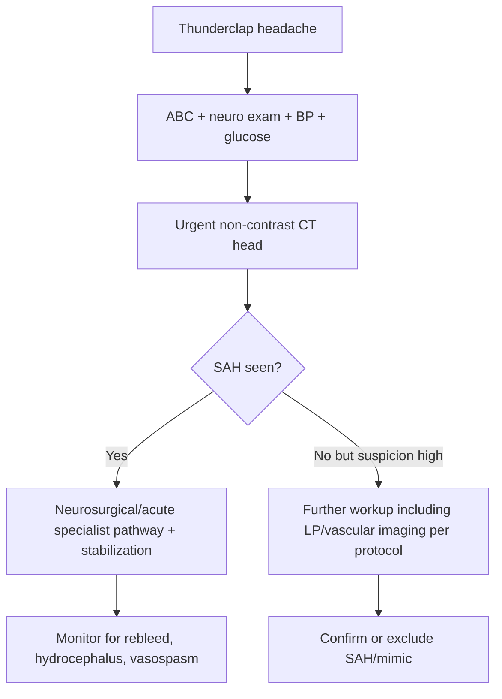
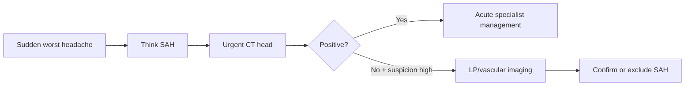

# Subarachnoid hemorrhage and thunderclap headache

Related: [[../Neurology MOC|Neurology MOC]] · [[../Headache Syndromes|Headache Syndromes]] · [[Secondary headache red flags]] · [[Meningitis and encephalitis clues]] · [[Raised intracranial pressure and mass lesion clues]] · [[../Neuroimaging/Non-contrast CT head basics|Non-contrast CT head basics]] · [[../Neuroimaging/Blood, mass effect, hydrocephalus, and midline shift pattern recognition|Blood, mass effect, hydrocephalus, and midline shift pattern recognition]]

> [!danger]
> **Thunderclap headache = subarachnoid hemorrhage until proven otherwise.** Sudden “worst headache of life” requires urgent emergency imaging and often lumbar puncture if initial CT is negative and suspicion remains high.

> [!important]
> In this Neurology chapter note, the focus is **recognition and emergency diagnostic approach to headache red flags**, not stroke-chapter reperfusion workflows.

## Learning Objectives
- Define thunderclap headache and subarachnoid hemorrhage (SAH).
- Recognize the classic history and examination red flags.
- Know the emergency diagnostic sequence: CT first, then LP when appropriate.
- Differentiate SAH from common mimics.
- State early stabilization principles and major complications.

## Definition
### Thunderclap headache
A **thunderclap headache** is a severe headache reaching maximal intensity within seconds to 1 minute.

### Subarachnoid hemorrhage
SAH is bleeding into the **subarachnoid space**, classically from rupture of an intracranial aneurysm, causing sudden meningeal irritation, raised intracranial pressure, and risk of rebleeding, vasospasm, and hydrocephalus.

## Relevant Neuroanatomy
- subarachnoid space contains CSF and cerebral vessels
- circle of Willis aneurysms are the classic source of aneurysmal SAH
- blood around basal cisterns, sulci, and ventricles can irritate meninges and obstruct CSF pathways

## Relevant Neurophysiology
- sudden arterial rupture rapidly increases meningeal irritation and intracranial pressure
- diffuse sympathetic surge may produce vomiting, blood pressure rise, and reduced consciousness
- blood breakdown products can later trigger vasospasm and delayed cerebral ischemia

## Normal Values / Important Cut-offs
- thunderclap = maximal intensity **within 1 minute**
- urgent **non-contrast CT head** is first-line in suspected SAH
- if CT is negative but suspicion remains high, **lumbar puncture** is considered after an appropriate interval per local protocol to look for xanthochromia/CSF blood pattern
- exam focus is on **time course and emergency sequence**, not a single numeric threshold

## Classification
### Causes of thunderclap headache
1. aneurysmal SAH
2. non-aneurysmal SAH
3. reversible cerebral vasoconstriction syndrome
4. cerebral venous sinus thrombosis
5. cervical artery dissection
6. pituitary apoplexy
7. hypertensive crisis / PRES in selected contexts
8. less commonly meningitis or intracranial hypotension presentations

### SAH pattern groups
1. aneurysmal SAH
2. perimesencephalic/non-aneurysmal SAH
3. traumatic SAH

## Etiology / Causes
- ruptured saccular (berry) aneurysm
- AVM rupture less commonly
- non-aneurysmal perimesencephalic bleed
- trauma

## Risk Factors
- hypertension
- smoking
- family history of aneurysm/SAH
- connective tissue disorders in selected patients
- polycystic kidney disease association in exam questions
- prior known aneurysm

## Pathophysiology
1. vessel ruptures into subarachnoid space
2. headache is immediate and explosive
3. meningeal irritation causes neck stiffness and photophobia
4. blood may raise ICP and reduce consciousness
5. later complications include vasospasm, hydrocephalus, electrolyte disturbance, and rebleeding

## Clinical Features
### Classic clues
- sudden severe headache: “worst headache of life”
- peak intensity at onset
- vomiting
- neck stiffness
- photophobia
- reduced consciousness
- seizure at onset in some patients
- focal deficit or cranial nerve palsy in some aneurysmal bleeds

### Warning history
- exertional onset
- collapse or brief loss of consciousness
- previous “sentinel headache”

## Approach / Algorithm

## Investigations
### First-line
- urgent **non-contrast CT head**
- FBC, U&E, coagulation, glucose
- ECG and monitoring

### If CT negative but suspicion remains high
- lumbar puncture according to timing/protocol
- CTA/MRA depending on pathway

### Why LP matters
- CSF can help detect blood breakdown/xanthochromia when CT is negative but clinical suspicion remains high

## Interpretation Frameworks
### Thunderclap red-flag table
| Feature | Why it matters |
|---|---|
| maximal intensity at onset | classic for SAH/thunderclap emergency |
| neck stiffness | meningeal irritation |
| vomiting/collapse | severe intracranial event |
| reduced consciousness | raised ICP or severe bleed |
| exertional onset | aneurysmal rupture clue |

### CT/LP logic
| Situation | Next step |
|---|---|
| CT positive for SAH | urgent acute specialist management |
| CT negative + low suspicion | evaluate other causes |
| CT negative + high suspicion | LP and/or vascular imaging as per protocol |

## Diagnosis
The diagnosis of SAH is based on **sudden severe headache plus emergency confirmation by imaging and/or CSF/vascular studies**.

Strong exam statement:
- “A thunderclap headache must be treated as SAH until urgent investigation proves otherwise.”

## Differential Diagnosis
- migraine (usually not true thunderclap onset)
- meningitis
- intracerebral hemorrhage
- reversible cerebral vasoconstriction syndrome
- cervical artery dissection
- cerebral venous sinus thrombosis
- pituitary apoplexy
- primary thunderclap headache only after exclusion of secondary causes

## Tables / Comparison Charts
### SAH vs migraine vs meningitis headache
| Feature | SAH | Migraine | Meningitis |
|---|---|---|---|
| onset | explosive | gradual to evolving | hours to day, often progressive |
| neck stiffness | common | uncommon | common |
| photophobia | may occur | common | common |
| fever | uncommon | absent | common |
| collapse/reduced consciousness | may occur | unusual | possible in severe disease |

## Management
### Immediate priorities
- ABC stabilization
- analgesia and antiemetics as needed
- urgent CT and specialist referral
- blood pressure management according to acute protocol
- avoid delays in definitive investigation

### Core early complications to watch
- rebleeding
- hydrocephalus
- vasospasm/delayed ischemia
- hyponatremia
- seizures

## Drug Interactions / Contraindications / Comorbidity Cautions
- Avoid assuming the headache is benign and giving only routine migraine treatment before excluding SAH.
- Anticoagulation/antiplatelet therapy may worsen bleeding risk and is important history.
- Lumbar puncture should not be done blindly if mass effect/raised ICP concern exists before imaging.

## Procedures / Indications / Contraindications
### Procedure mini-section: lumbar puncture in suspected SAH
- **Indication:** suspected SAH with non-diagnostic CT when suspicion remains high
- **Purpose:** detect xanthochromia/CSF blood pattern
- **Contraindication/caution:** suspected mass effect or marked raised ICP without prior imaging assessment
- **Complication:** herniation risk if performed unsafely; traumatic tap can confuse interpretation

## Complications
- rebleeding
- vasospasm and delayed cerebral ischemia
- hydrocephalus
- seizures
- cardiac rhythm disturbances
- death or significant neurological disability

## Red Flags / Emergencies
- thunderclap onset
- collapse
- neck stiffness with sudden severe headache
- reduced consciousness
- new cranial nerve palsy or focal deficit

## Prognosis
Prognosis varies by bleed severity, consciousness level, rebleeding, and complication burden. Early diagnosis and specialist treatment improve outcomes.

## Topic Correlation
- [[Meningitis and encephalitis clues]]
- [[Raised intracranial pressure and mass lesion clues]]
- [[../Neuroimaging/Non-contrast CT head basics|Non-contrast CT head basics]]
- [[../Neuroimaging/Blood, mass effect, hydrocephalus, and midline shift pattern recognition|Blood, mass effect, hydrocephalus, and midline shift pattern recognition]]
- [[../Meningitis/CSF pattern interpretation in meningitis|CSF pattern interpretation in meningitis]]

## Special Situations
- **Pregnancy/postpartum:** broader vascular differential may include CVST or PRES.
- **Anticoagulated patient:** bleeding risk and reversal issues are important.
- **Sentinel headache:** prior warning leak may precede major SAH.

## FCPS/MRCP High-Yield Points
- Thunderclap headache is an emergency.
- First-line test is **non-contrast CT head**.
- If suspicion remains high after negative CT, proceed to LP/vascular workup per protocol.
- SAH classically causes sudden severe headache, vomiting, neck stiffness, and reduced consciousness.
- Rebleeding and vasospasm are major complications.

## Common Viva Questions
1. What is thunderclap headache?
2. What is the first investigation in suspected SAH?
3. When is LP considered after CT?
4. Name complications of SAH.
5. Give differentials for thunderclap headache.

## Common Confusions / Exam Traps
- Do not call a gradually worsening headache “thunderclap.”
- Do not forget meningism can occur in SAH without infection.
- Do not perform LP before considering imaging safety.
- Do not miss that severe sudden headache can be a warning bleed even if initial signs are subtle.

## Mnemonics
- **THUNDER**: **T**ime-to-peak instantly, **H**emorrhage concern, **U**rgent CT, **N**eck stiffness, **D**ecreased consciousness, **E**mergency referral, **R**ebleed risk.

## Mind Map
- Thunderclap headache
  - SAH until proven otherwise
  - CT first
  - LP if CT negative and suspicion persists
  - red flags
    - collapse
    - meningism
    - vomiting
    - focal signs
  - complications
    - rebleed
    - vasospasm
    - hydrocephalus

## Flowchart

## Suggested Visuals / Image Notes
- basal cistern SAH on non-contrast CT
- thunderclap headache emergency algorithm
- CT versus LP decision pathway

## One-Page Revision Summary
- Thunderclap headache reaches peak in seconds to 1 minute.
- SAH is the classic emergency cause.
- Symptoms: worst headache of life, vomiting, neck stiffness, photophobia, collapse, reduced consciousness.
- Investigate urgently with **non-contrast CT head**.
- If CT negative but suspicion high, do **LP/vascular imaging** according to protocol.
- Complications: rebleeding, vasospasm, hydrocephalus.

## 24-Hour Recall Prompts
- Define thunderclap headache.
- State the first investigation in suspected SAH.
- List three red flags suggesting SAH.
- Explain why LP may still be needed after a negative CT.

## 7-Day / 15-Day / 30-Day Revision Tracker
- **7 days:** redraw the CT/LP algorithm.
- **15 days:** compare SAH, meningitis, and migraine.
- **30 days:** answer a viva on sudden severe headache emergencies.

## Must Know / Should Know / Nice to Know
### Must Know
- thunderclap = SAH until proven otherwise
- CT first
- LP/vascular workup if CT negative but suspicion remains high
- major complications: rebleed, vasospasm, hydrocephalus

### Should Know
- differentials of thunderclap headache
- risk factors for aneurysmal SAH

### Nice to Know
- perimesencephalic versus aneurysmal SAH distinctions

## Self-Test Scorecard
- Emergency recognition /10
- Investigation sequence /10
- Differential diagnosis /10
- Complication recall /10
- Viva confidence /10

## Summary
Subarachnoid hemorrhage is the prototypical cause of thunderclap headache and must be excluded urgently in any patient with sudden maximal-intensity headache. The decisive bedside rule is rapid recognition, urgent non-contrast CT, and further LP/vascular evaluation when suspicion remains high despite negative initial imaging.

## MCQs (10)
1. Thunderclap headache is defined by:
   - A. Headache lasting more than 1 week
   - B. Headache reaching maximal intensity within seconds to 1 minute
   - C. Headache occurring only with fever
   - D. Mild headache with aura
   - **Answer: B**
2. The first investigation in suspected SAH is:
   - A. EEG
   - B. MRI spine
   - C. Non-contrast CT head
   - D. NCS
   - **Answer: C**
3. A classic symptom of SAH is:
   - A. Slowly progressive facial numbness over months
   - B. Sudden worst headache of life
   - C. Isolated chronic cough
   - D. Postural hand tremor only
   - **Answer: B**
4. If CT is negative but suspicion for SAH remains high, an important next step is:
   - A. Ignore symptoms
   - B. Lumbar puncture/vascular workup per protocol
   - C. Spirometry
   - D. Holter monitoring only
   - **Answer: B**
5. Neck stiffness in SAH occurs because of:
   - A. Meningeal irritation
   - B. Peripheral neuropathy
   - C. Hyperthyroidism
   - D. Middle ear disease
   - **Answer: A**
6. A major complication of SAH is:
   - A. Vasospasm
   - B. Asthma
   - C. Osteomalacia
   - D. Peptic ulcer
   - **Answer: A**
7. Which feature best separates thunderclap headache from many migraines?
   - A. Photophobia alone
   - B. Maximal intensity at onset
   - C. Nausea only
   - D. Family history
   - **Answer: B**
8. Lumbar puncture in suspected SAH is used mainly to detect:
   - A. Hyperglycemia
   - B. Xanthochromia/CSF blood pattern
   - C. Myopathy
   - D. Uremia
   - **Answer: B**
9. Which is a risk factor for aneurysmal SAH?
   - A. Smoking
   - B. Vitiligo alone
   - C. Iron deficiency only
   - D. Myopia only
   - **Answer: A**
10. The best principle is:
   - A. Thunderclap headache is usually benign
   - B. Thunderclap headache is an emergency until dangerous causes are excluded
   - C. CT is never needed
   - D. LP is always the first test
   - **Answer: B**

## SBA Questions (10)
1. A 42-year-old woman describes a sudden severe headache that reached maximum intensity in 30 seconds while climbing stairs. She vomits and is photophobic. What is the most important immediate diagnosis to exclude?  
   **Answer: Subarachnoid hemorrhage**
2. What is the first-line investigation in suspected SAH?  
   **Answer: Urgent non-contrast CT head**
3. A CT head is negative, but the history is highly convincing for SAH. What is the best next principle?  
   **Answer: Proceed to further workup such as LP and/or vascular imaging according to protocol.**
4. A patient with thunderclap headache also has neck stiffness. What pathophysiological process explains this?  
   **Answer: Meningeal irritation by blood in the subarachnoid space**
5. Which complication should be watched for in the days after SAH?  
   **Answer: Vasospasm with delayed cerebral ischemia**
6. A trainee wants to treat the case as migraine without imaging. What is the correction?  
   **Answer: Thunderclap onset mandates urgent exclusion of SAH and other secondary causes.**
7. A patient had a severe warning headache 2 days ago and now presents with collapse and meningism. What prior symptom may have represented a warning leak?  
   **Answer: Sentinel headache**
8. What is the main danger of performing LP without appropriate imaging safety assessment in a patient with mass effect?  
   **Answer: Herniation risk**
9. Which two bedside clues strongly favor SAH over uncomplicated migraine?  
   **Answer: Sudden maximal onset and reduced consciousness/meningism**
10. In viva, what is the best summary line for thunderclap headache?  
   **Answer: Consider SAH first and investigate urgently with CT, followed by LP/vascular evaluation if suspicion persists.**

## Flashcards
- Q: What is the defining time course of thunderclap headache?  
  A: Maximal intensity within seconds to 1 minute.
- Q: What is the first investigation for suspected SAH?  
  A: Non-contrast CT head.
- Q: What major diagnosis must be excluded in thunderclap headache?  
  A: Subarachnoid hemorrhage.
- Q: Name two important SAH complications.  
  A: Rebleeding and vasospasm.
- Q: When may LP still be needed?  
  A: When CT is negative but clinical suspicion remains high.

## Answer Key with Explanations
- Thunderclap onset is the central recognition clue.
- **CT first** is the key investigation rule.
- Persistent high suspicion after negative CT requires more workup rather than false reassurance.
- SAH complications and emergency thinking are heavily tested in FCPS/MRCP settings.
