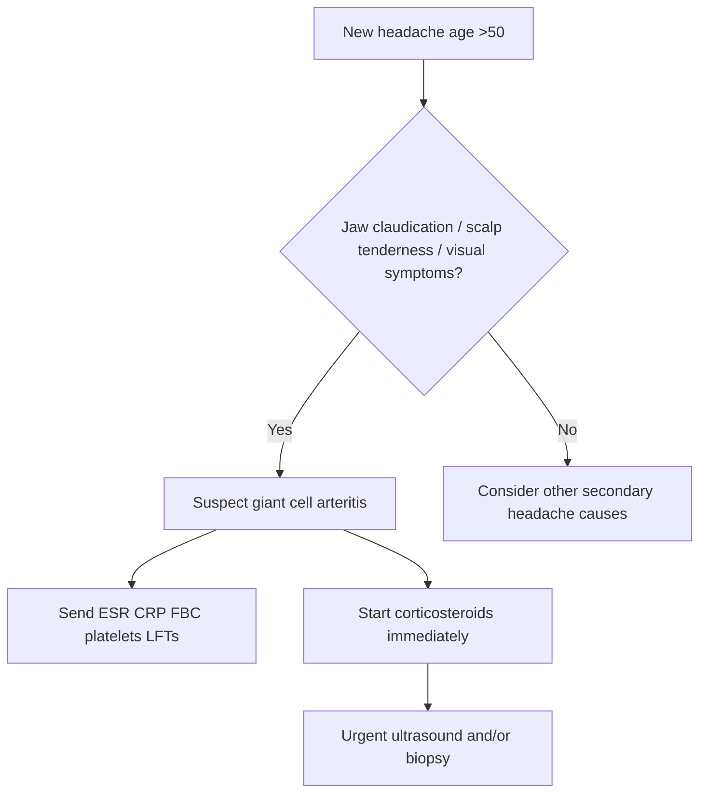

# Temporal arteritis and other systemic red flags

Related: [[../Neurology MOC|Neurology MOC]] · [[../Headache Syndromes|Headache Syndromes]] · [[Secondary headache red flags|Secondary headache red flags]] · [[Raised intracranial pressure and mass lesion clues]]

> [!important]
> In an older patient with a **new headache**, especially with **jaw claudication, scalp tenderness, visual symptoms, constitutional upset, or polymyalgia rheumatica**, assume **giant cell arteritis (GCA)** until proven otherwise and start steroids urgently to prevent irreversible visual loss.

## Learning Objectives
- Recognize when headache suggests **GCA or another systemic inflammatory/vascular cause** rather than primary headache.
- Understand the vascular anatomy and ischemic basis of visual loss in GCA.
- Apply an FCPS/MRCP approach to diagnosis, investigation, and immediate treatment.
- Distinguish temporal arteritis from migraine, tension-type headache, raised ICP, meningitis, and intracranial mass lesions.

## Definition
Temporal arteritis, usually part of **giant cell arteritis**, is a **granulomatous large- and medium-vessel vasculitis** affecting branches of the carotid artery, especially the **superficial temporal artery**, and may also involve the ophthalmic, vertebral, and aortic branches. In headache evaluation it is a **secondary headache red flag** because delayed recognition may cause **permanent visual loss, stroke, or aortic complications**.

## Core Anatomy
- **Superficial temporal artery**: branch of the external carotid; inflammation may produce tenderness, nodularity, reduced pulsation.
- **Ophthalmic circulation**: posterior ciliary and central retinal circulation are vulnerable to ischemia.
- **Large-vessel involvement**: subclavian, axillary, vertebral, and aortic branches may be affected.
- **Pain-sensitive cranial structures**: arterial wall inflammation activates nociceptive pathways causing temporal or diffuse headache.

## Core Physiology
- Normal vascular endothelium maintains laminar flow and tissue perfusion.
- In GCA, immune-mediated arterial wall inflammation causes **intimal hyperplasia and luminal narrowing**, producing ischemia.
- Cranial ischemia explains jaw claudication, amaurosis fugax, diplopia, and anterior ischemic optic neuropathy.

## Normal Values / Important Cut-offs
- GCA is uncommon below **50 years**; age **>50 years** is a major diagnostic clue.
- **ESR** often markedly raised, frequently **>50 mm/h**, but a normal ESR does **not** completely exclude GCA.
- **CRP** is usually raised and may be more sensitive than ESR.
- Platelets may be elevated as part of the inflammatory response.

## Classification
### By presentation
1. **Cranial GCA**
   - temporal headache
   - scalp tenderness
   - jaw claudication
   - visual symptoms
2. **Large-vessel GCA**
   - limb claudication
   - unequal pulses/BP
   - constitutional symptoms
3. **GCA with polymyalgia rheumatica (PMR)**
   - shoulder/hip girdle pain and morning stiffness

## Etiology / Causes
### Temporal arteritis / GCA
- Idiopathic immune-mediated vasculitis in genetically susceptible older adults.

### Other systemic red-flag causes of headache to remember
- Severe hypertension / hypertensive emergency
- Systemic infection with sepsis
- Autoimmune vasculitis
- Malignancy with systemic features
- Acute angle-closure glaucoma presenting with headache and vomiting
- Carbon monoxide exposure or toxic-metabolic systemic illness

## Risk Factors
- Age >50 years
- Female sex
- European ancestry classically described, but do not exclude in other populations
- Associated PMR
- Previous or concurrent large-vessel vasculitis features

## Pathophysiology
- Dendritic-cell and T-cell driven arterial inflammation develops in the vessel wall.
- Macrophages and giant cells release cytokines, especially **IL-6**, and promote elastic lamina damage.
- Intimal proliferation narrows the lumen.
- Ischemia affects optic nerve head, retina, jaw muscles, and cerebral/posterior circulation territories.

## Clinical Features
### Headache clues
- New-onset headache in an older adult
- Temporal, frontal, or diffuse headache
- Persistent, often unlike prior primary headaches
- Scalp tenderness, pain on combing hair, tenderness over temporal artery

### Cranial ischemic clues
- Jaw claudication
- Transient visual obscurations or amaurosis fugax
- Diplopia
- Sudden painless monocular visual loss

### Systemic clues
- Fever, malaise, weight loss, anorexia
- PMR symptoms: shoulder/neck/hip aching and morning stiffness
- Temporal artery thickening, nodularity, reduced pulsation

### Large-vessel clues
- Arm claudication
- Asymmetric pulses or BP
- Bruits
- Aortic aneurysm/dissection risk in the long term

## Approach / Algorithm
1. **Ask first:** Is this a new headache in a patient >50 years?
2. Screen for **jaw claudication, scalp tenderness, visual symptoms, constitutional symptoms, PMR features**.
3. Examine temporal arteries, visual acuity, pupils, fundus, limb pulses, BP both arms if relevant.
4. If GCA is suspected, **start corticosteroids immediately**; do not wait for biopsy.
5. Send urgent **ESR, CRP, FBC, platelets, LFTs**.
6. Arrange **temporal artery ultrasound and/or biopsy** according to local availability.
7. If visual symptoms exist, treat as an **ophthalmic emergency** and involve ophthalmology/medicine urgently.
8. Consider alternative systemic red flags if the phenotype is not classic.

## Investigations
### Baseline
- FBC: normocytic anemia, thrombocytosis may occur
- ESR and CRP
- LFTs: alkaline phosphatase may be raised
- U&E, glucose before prolonged steroid therapy

### Confirmatory / supportive
- **Temporal artery ultrasound**: halo sign, stenosis, occlusion
- **Temporal artery biopsy**: skip lesions mean a negative biopsy does not fully exclude disease
- Imaging for large-vessel involvement when indicated: CT angiography, MR angiography, PET-CT depending on context

### Visual assessment
- Visual acuity
- Color vision
- Pupillary responses
- Fundoscopy if available

## Interpretation Frameworks
### New headache in older age: red-flag interpretation
- **Primary headache less likely** if onset is new after 50 years.
- **Jaw claudication + scalp tenderness + raised ESR/CRP** strongly supports GCA.
- **Visual symptoms** convert the case into a treatment emergency.
- **Constitutional symptoms + PMR** increase probability.

### ESR/CRP interpretation
- Raised ESR/CRP support inflammation but are not disease-specific.
- Normal inflammatory markers reduce likelihood but do not absolutely rule out GCA.

## Diagnosis
Diagnosis is clinical plus supportive inflammatory markers and vascular testing.
A practical bedside diagnosis is:
- age >50 years
- new localized headache
- temporal artery abnormality or jaw claudication
- raised ESR/CRP
- supportive ultrasound/biopsy

## Differential Diagnosis
- Migraine in older adult with prior similar pattern
- Tension-type headache
- Intracranial mass lesion or raised ICP
- Meningitis or encephalitis
- Acute angle-closure glaucoma
- Trigeminal neuralgia or dental disease
- Cervicogenic headache
- Hypertensive emergency
- Intracranial hemorrhage if thunderclap or focal deficits present

## Tables / Comparison Charts
| Feature | Giant cell arteritis | Migraine | Tension-type headache |
|---|---|---|---|
| Typical age | >50 years | Often younger | Any age |
| Headache pattern | New, persistent, red-flag | Recurrent episodic | Pressing/bilateral |
| Jaw claudication | Common clue | No | No |
| Visual loss risk | High | Usually no ischemic blindness | No |
| ESR/CRP | Often raised | Normal | Normal |
| Steroid urgency | Immediate | No | No |

## Management
### Immediate management
- **High-dose corticosteroids immediately when suspicion is significant.**
- If visual symptoms or visual loss: urgent high-dose therapy, often IV methylprednisolone depending on local protocol, then oral steroids.
- Start treatment **before** biopsy if necessary.

### Ongoing management
- Oral prednisolone taper guided by symptoms and inflammatory markers.
- Bone protection and gastric protection when indicated.
- Monitor glucose, BP, infection risk, mood, myopathy, osteoporosis.
- Consider steroid-sparing therapy such as **tocilizumab** in relapsing/high-risk cases according to specialist practice.
- Assess and monitor for aortic/large-vessel disease when clinically indicated.

## Drug Interactions / Contraindications / Comorbidity Cautions
- Steroids worsen diabetes, hypertension, infection risk, psychiatric symptoms, osteoporosis, and peptic ulcer risk.
- Elderly patients are particularly vulnerable to steroid toxicity and falls.
- Do not falsely reassure yourself with temporary symptom improvement after analgesics.
- Avoid delaying steroids while waiting for biopsy/imaging.

## Procedures / Indications / Contraindications
- **Temporal artery biopsy**
  - Indication: diagnostic confirmation when feasible
  - Contraindication: relative only if delay would harm treatment; treatment must not be withheld
- **Vascular imaging** when large-vessel involvement suspected

## Procedure Mini-Sections
### Temporal artery biopsy
- **Indication:** confirm suspected GCA
- **Preparation:** start steroids if clinically indicated; arrange prompt surgical/rheumatology pathway
- **Principle:** obtain adequate arterial segment because of skip lesions
- **Complication:** local bleeding, infection, false-negative sampling
- **Viva pearl:** a negative biopsy does not exclude GCA if the clinical picture is strong.

## Complications
- Permanent visual loss
- Recurrent transient visual symptoms
- Cerebral ischemia, especially vertebrobasilar events
- Aortic aneurysm or dissection later
- Steroid-related complications

## Red Flags / Emergencies
- New headache after age 50
- Jaw claudication
- Scalp tenderness
- Amaurosis fugax, blurred vision, diplopia, sudden visual loss
- Constitutional symptoms with temporal headache
- PMR symptoms accompanying headache

## Prognosis
- Good if recognized early and treated promptly.
- Visual loss may be irreversible once established.
- Relapses and long steroid courses are common.

## Topic Correlation
- Compare with [[Subarachnoid hemorrhage and thunderclap headache]] for abrupt onset headache.
- Compare with [[Raised intracranial pressure and mass lesion clues]] for papilloedema/mass-effect headache.
- Compare with [[Meningitis and encephalitis clues]] for fever and meningism.

## Special Situations
- **Visual symptoms:** treat as emergency; protect the other eye.
- **PMR coexistence:** specifically ask for morning stiffness and proximal pain.
- **Large-vessel disease:** think beyond the temporal artery if limb symptoms or unequal pulses are present.
- **Normal ESR:** do not rule out disease if the story is classic.

## FCPS/MRCP High-Yield Points
- New headache in age >50 years = secondary cause until proven otherwise.
- Jaw claudication is one of the most useful clinical clues for GCA.
- Start steroids immediately if suspicion is strong; do not wait for biopsy.
- Visual loss in GCA is often ischemic and can be permanent.
- ESR and CRP support diagnosis but are not perfect exclusion tests.

## Common Viva Questions
- Why is temporal arteritis an emergency headache diagnosis?
- What are the key clinical clues to giant cell arteritis?
- Why can biopsy be negative despite true disease?
- How would you manage a patient with headache and transient visual loss aged 68 years?

## Common Confusions / Exam Traps
- Mistaking new headache in an elderly patient for migraine.
- Waiting for biopsy before giving steroids.
- Forgetting PMR association.
- Assuming a normal ESR excludes GCA.

## Mnemonics
**GCA RED**
- **G**eriatric new headache
- **C**laudication of jaw
- **A**maurosis / visual symptoms
- **R**aised ESR/CRP
- **E**xamine temporal artery
- **D**on’t delay steroids

## Mind Map
- Temporal arteritis / GCA
  - older age
  - new headache
  - jaw/scalp/vision clues
  - raised ESR/CRP
  - urgent steroids
  - biopsy/ultrasound support
  - prevent blindness

## Flowchart

## Suggested Visuals / Image Notes
- Temporal artery anatomy diagram
- Fundus / ischemic optic neuropathy teaching image
- Ultrasound halo sign image

## Suggested Video References
- Review video on giant cell arteritis clinical recognition
- Short tutorial on temporal artery ultrasound halo sign
- PMR + GCA emergency revision video

## One-Page Revision Summary
- **Who?** Usually age >50 with a **new** headache.
- **Key clues:** jaw claudication, scalp tenderness, visual symptoms, PMR, raised ESR/CRP.
- **Why urgent?** Risk of **irreversible blindness**.
- **Action:** **start steroids immediately** if clinical suspicion is significant.
- **Confirm/support:** temporal artery ultrasound and/or biopsy.
- **Do not miss:** large-vessel involvement and long-term aortic complications.

## 24-Hour Recall Prompts
- List 5 bedside clues to giant cell arteritis.
- Why should steroids not wait for biopsy?
- What visual complications occur in GCA?
- Name 3 differential diagnoses of new headache in old age.

## 7-Day / 15-Day / 30-Day Revision Tracker
- **Day 7:** Reproduce the diagnostic approach from memory.
- **Day 15:** Compare GCA with migraine and raised ICP headache.
- **Day 30:** Write a 2-minute viva answer on emergency management.

## Must Know / Should Know / Nice to Know
### Must Know
- New headache >50 years is a red flag.
- Jaw claudication, scalp tenderness, visual symptoms.
- ESR/CRP, steroids now, biopsy/ultrasound later.
### Should Know
- PMR association.
- Large-vessel involvement.
- Steroid complications and monitoring.
### Nice to Know
- Tocilizumab as steroid-sparing therapy.
- Detailed vascular imaging pathways.

## My Weak Points
- Do I remember that normal ESR does not completely exclude GCA?
- Can I explain why visual loss may be irreversible?
- Do I ask about PMR every time?

## Self-Test Scorecard
- Recognition of red flags /10
- Diagnostic approach /10
- Emergency treatment logic /10
- Differential diagnosis /10
- Viva confidence /10

## Exam Answer Modes
### Short note frame
Definition → older age red-flag headache → jaw claudication / visual symptoms → ESR/CRP → urgent steroids → biopsy/ultrasound.

### Viva frame
“Temporal arteritis is a granulomatous large-vessel vasculitis causing a new headache in older adults. The emergency is irreversible visual loss. I would ask for jaw claudication, scalp tenderness, visual symptoms and PMR, check ESR/CRP, and start steroids immediately without waiting for biopsy.”

## Summary
Temporal arteritis is one of the most important systemic causes of secondary headache in Davidson Chapter 28 neurology. The exam priority is rapid recognition of an **older patient with a new headache plus ischemic or inflammatory clues**, followed by **immediate corticosteroid therapy** to prevent blindness.

## MCQs (10)
1. A 69-year-old woman has a new temporal headache, scalp tenderness, and jaw pain while chewing. The most likely diagnosis is:
   - A. Migraine
   - B. Tension-type headache
   - C. Giant cell arteritis
   - D. Trigeminal neuralgia
   - E. Cluster headache
2. The most feared immediate complication of giant cell arteritis is:
   - A. Hydrocephalus
   - B. Permanent visual loss
   - C. Status epilepticus
   - D. SAH
   - E. Pituitary apoplexy
3. Which feature most strongly supports giant cell arteritis over migraine?
   - A. Photophobia
   - B. Aura
   - C. Jaw claudication
   - D. Nausea
   - E. Family history
4. In suspected giant cell arteritis with visual symptoms, the next best step is:
   - A. Wait for biopsy result
   - B. Start high-dose corticosteroids urgently
   - C. Give triptan only
   - D. Reassure and review later
   - E. Start propranolol
5. Which inflammatory marker pattern best supports GCA?
   - A. Persistently low ESR and CRP always exclude it
   - B. ESR and/or CRP often elevated
   - C. CRP is never useful
   - D. Platelets are always low
   - E. FBC is always normal
6. GCA usually affects patients:
   - A. Below 20 years
   - B. Below 40 years
   - C. Around any age equally
   - D. Over 50 years
   - E. Only men
7. A common associated syndrome is:
   - A. Guillain-Barré syndrome
   - B. Polymyalgia rheumatica
   - C. Myasthenia gravis
   - D. Bell palsy
   - E. Ménière disease
8. Temporal artery biopsy may be falsely negative because of:
   - A. Low blood pressure
   - B. Skip lesions
   - C. Hyperglycemia
   - D. Migraine overlap
   - E. Triptan use
9. Which symptom suggests cranial ischemia in GCA?
   - A. Tinnitus only
   - B. Jaw claudication
   - C. Productive cough
   - D. Loose stool
   - E. Dysuria
10. Which statement is correct?
   - A. Steroids should only start after histology
   - B. Visual loss is always reversible
   - C. New headache in older age may indicate GCA
   - D. GCA is a primary headache disorder
   - E. ESR is never raised

## SBA Questions (10)
1. A 72-year-old woman presents with a 2-week history of new temporal headache, fatigue, jaw pain on chewing, and transient blurring of vision. Examination shows tenderness over the temporal artery. What is the single best next step?
2. A 67-year-old man with shoulder girdle stiffness develops a new headache and scalp tenderness. Which associated diagnosis best links these features?
3. A 70-year-old woman has suspected GCA. ESR is 32 mm/h, lower than expected. She has jaw claudication and transient monocular blindness. What is the best interpretation?
4. An older patient with headache is being assessed for secondary causes. Which feature most strongly points to GCA rather than tension-type headache?
5. A patient with suspected GCA has been started on steroids. Which investigation is still useful for diagnostic support?
6. A 75-year-old woman has headache, weight loss, and arm claudication. What broader complication pattern should be considered?
7. A clinician delays treatment for suspected GCA until biopsy confirmation. What major preventable harm is most concerning?
8. A patient with GCA develops diplopia and transient visual obscurations. What mechanism best explains these symptoms?
9. Which bedside historical question is most valuable when screening for GCA-associated ischemia?
10. A patient treated for GCA over months needs follow-up. Which issue is most important besides relapse detection?

## Flashcards
- Q: What age group makes GCA much more likely in headache assessment?
  A: Age >50 years.
- Q: Which symptom is especially suggestive of GCA?
  A: Jaw claudication.
- Q: What emergency complication must treatment prevent?
  A: Irreversible visual loss.
- Q: Should steroids wait for biopsy in suspected GCA?
  A: No, start urgently if suspicion is significant.
- Q: What common rheumatologic association should be asked about?
  A: Polymyalgia rheumatica.
- Q: Why can biopsy be negative despite true GCA?
  A: Skip lesions.

## Answer Key with Explanations
### MCQs
1. **C** — classic cranial GCA features.
2. **B** — ischemic visual loss is the key emergency.
3. **C** — jaw claudication is highly suggestive.
4. **B** — treatment must not wait for confirmation.
5. **B** — inflammatory markers are usually elevated.
6. **D** — disease classically occurs in older adults.
7. **B** — PMR is strongly associated.
8. **B** — skip lesions explain false negatives.
9. **B** — reflects ischemia in muscles supplied by affected vessels.
10. **C** — this is a classic secondary headache red flag.

### SBAs
1. Start urgent high-dose corticosteroid therapy and arrange specialist assessment.
2. Polymyalgia rheumatica.
3. Normal or modest markers do not fully exclude GCA if the clinical picture is strong.
4. Jaw claudication.
5. Temporal artery ultrasound and/or biopsy.
6. Large-vessel involvement including aortic disease.
7. Irreversible visual loss.
8. Ischemia from inflammatory arterial narrowing.
9. Ask about jaw claudication and transient visual symptoms.
10. Monitoring steroid toxicity such as diabetes, hypertension, osteoporosis, and infection risk.

## PasTest Scenario SBAs (Clinical Vignettes)

> **Auto-generated PasTest/Mediscope-style scenario SBAs** grounded in the authored source. Each scenario tests a real clinical fact (triad, specific sign, contraindication, trial, first-line Rx) extracted from the topic. *Source: Ch 27: Neurology & Stroke — Temporal arteritis and other systemic red flags*

**Q1.** What is the most appropriate first-line therapy for Temporal arteritis and other systemic red flags?

  - **A.** before
  - **B.** An advanced/surgical therapy reserved for refractory disease
  - **C.** Symptomatic treatment only, no disease-modifying therapy
  - **D.** Empiric broad-spectrum therapy without specific indication

  > **Answer: A** — before
  >
  > *Source:* Start treatment **before** biopsy if necessary.

