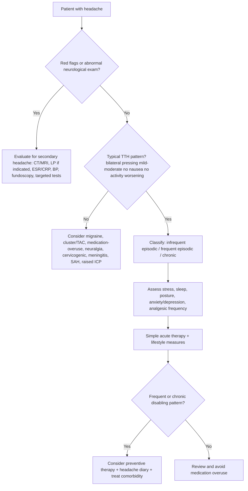
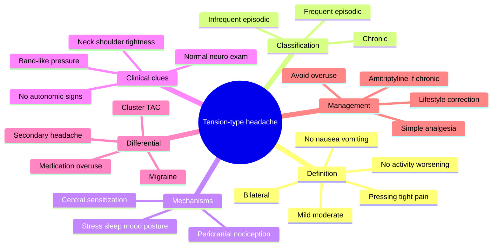
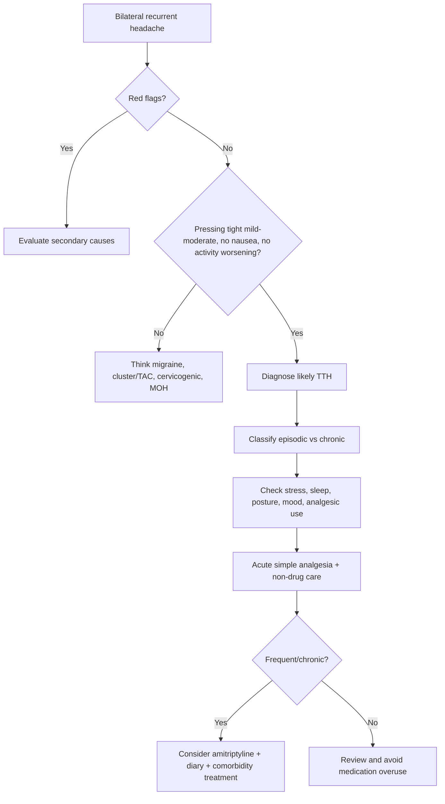

# Tension-type headache

Related: [[../Neurology MOC|Neurology MOC]] · [[../Headache Syndromes|Headache Syndromes]] · [[Primary headache syndromes|Primary headache syndromes]] · [[Migraine with and without aura]] · [[Trigeminal autonomic cephalalgias and cluster headache]] · [[Medication-overuse headache]] · [[Secondary headache red flags]]

> [!important]
> Tension-type headache (TTH) is the **commonest primary headache disorder**. It classically causes **bilateral**, **pressing/tight**, **mild-to-moderate** headache, with **no prominent nausea/vomiting** and **no marked worsening with routine activity**.

> [!tip]
> FCPS/MRCP approach: diagnose TTH only after checking that the story is not **migraine**, **cluster/TAC**, or a **secondary headache**. Examiners like the phrases **band-like pressure**, **normal neurological examination**, and **absence of red flags**.

## Learning Objectives
- Define tension-type headache and classify episodic vs chronic disease.
- Recognize the typical symptom pattern and distinguish it from migraine and cluster headache.
- Explain the likely role of peripheral myofascial nociception and central pain sensitization.
- Decide when investigation is unnecessary and when secondary headache must be excluded.
- Outline acute management, prevention, and medication-overuse avoidance.

## Definition
Tension-type headache is a **primary headache syndrome** characterized by recurrent episodes of **bilateral pressing or tightening head pain** of **mild to moderate intensity**, usually **not aggravated by routine physical activity**, and usually **without nausea or vomiting**.

Core practical diagnostic idea:
- **pressing/tightening**, not pulsatile
- usually **bilateral**
- **mild-moderate** intensity
- **not worsened by walking/stairs/routine activity**
- **nausea absent**; at most one of photophobia or phonophobia may occur in many classifications

## Relevant Neuroanatomy
### Pain-sensitive structures relevant to headache
Headache does not arise from insensitive brain parenchyma but from pain-sensitive structures such as:
- scalp and pericranial muscles
- fascia and aponeuroses
- extracranial arteries
- dura mater and dural vessels
- venous sinuses
- proximal portions of cranial nerves and upper cervical roots

### Pericranial muscles and myofascial tissues
Structures often discussed in TTH:
- frontalis
- temporalis
- occipital muscles
- trapezius
- sternocleidomastoid
- posterior cervical muscles

These structures matter because many patients describe:
- scalp tenderness
- neck/shoulder tightness
- increased pericranial muscle tenderness on palpation

### Central pain pathways
Pain input from cranial and cervical structures converges in the:
- trigeminal nucleus caudalis
- upper cervical dorsal horns
- trigeminocervical complex

This convergence helps explain:
- spread of pain to occiput, temples, or neck
- overlap between TTH, migraine, and cervicogenic symptom descriptions

## Relevant Neurophysiology
### Normal pain modulation
Headache perception is influenced by:
- peripheral nociceptors in muscles and meninges
- trigeminocervical relay systems
- thalamic sensory processing
- descending inhibitory pathways using serotonin and noradrenaline
- cortical attention, stress, sleep, and mood effects

### TTH physiology
Likely mechanisms include:
- increased **pericranial myofascial nociception**, especially in episodic TTH
- altered **central pain processing** and lower pain thresholds, especially in chronic TTH
- impaired descending antinociceptive control
- contribution from stress, poor sleep, anxiety, and sustained muscle tension/posture

> [!note]
> Older teaching emphasized “muscle contraction headache.” Modern teaching is broader: TTH is not simply due to muscle spasm, though pericranial tenderness is common.

## Normal Values / Important Cut-offs
High-yield cut-offs:
- **Infrequent episodic TTH**: headache on **<1 day/month** on average
- **Frequent episodic TTH**: **1-14 days/month** for **>3 months**
- **Chronic TTH**: **>=15 days/month** for **>3 months**
- **Typical duration**: **30 minutes to 7 days**
- **Medication-overuse concern**:
  - triptans, opioids, ergot, combination analgesics: **>=10 days/month**
  - simple analgesics/NSAIDs/paracetamol: **>=15 days/month**

## Classification
### Main classification used in exams
1. **Infrequent episodic tension-type headache**
2. **Frequent episodic tension-type headache**
3. **Chronic tension-type headache**
4. **Probable tension-type headache**

### By tenderness phenotype
- TTH **associated with pericranial tenderness**
- TTH **without significant pericranial tenderness**

## Etiology / Causes
TTH is a **primary disorder**, but many contributing factors influence attacks.

Common contributors:
- psychosocial stress
- poor sleep
- prolonged screen work or postural strain
- anxiety or depression
- fatigue
- eye strain complaints, though many patients have normal ophthalmic status
- jaw clenching/bruxism in some patients
- medication overuse in chronic daily headache transformation

## Risk Factors
- stress and emotional strain
- sleep deprivation
- sedentary work and poor posture
- neck and shoulder muscle tension
- anxiety disorders
- depressive symptoms
- frequent use of simple analgesics
- coexistence with migraine
- chronic pain sensitization states

## Pathophysiology
TTH is best viewed as a disorder with both **peripheral** and **central** pain mechanisms.

### Episodic TTH
Likely dominant processes:
1. stress/postural strain/fatigue
2. activation of myofascial nociceptors in pericranial muscles
3. sustained afferent input to trigeminocervical pathways
4. dull bilateral pressure-type pain

### Chronic TTH
Likely additional mechanisms:
1. repeated headache input over time
2. reduced descending inhibition
3. central sensitization and lower pain threshold
4. persistent near-daily headache
5. overlap with medication-overuse headache in some patients

### Why the pain quality is pressing rather than throbbing
Compared with migraine, TTH generally has:
- less trigeminovascular neuropeptide-driven activation
- less autonomic and gastrointestinal involvement
- less central sensory amplification
- less activity-related worsening

## Clinical Features
### Typical headache profile
- **bilateral** headache
- **band-like**, **tight**, **pressing**, or **vice-like** discomfort
- mild to moderate severity
- gradual onset
- not aggravated by routine physical activity
- patient often continues activities, unlike many migraine patients

### Common locations
- frontal band
- bitemporal
- occipital
- diffuse “whole head” pressure
- may extend to neck/shoulders

### Associated features
Usually absent or mild:
- no vomiting
- nausea absent; if present prominently, rethink migraine or secondary causes
- either photophobia or phonophobia may occur, but usually not both prominently together
- no cranial autonomic features such as lacrimation/rhinorrhea typical of cluster headache

### Examination findings
Usually:
- normal neurological examination
- no focal deficits
- possible scalp, temporal, trapezial, or neck muscle tenderness
- possible poor posture or cervical muscle tightness

### Chronic TTH pattern
- near-daily or daily headache
- often present on waking or develops through the day
- fluctuating dull pressure
- reduced quality of life
- frequent analgesic use may coexist

## Approach / Algorithm

### Practical approach in the exam
1. Exclude **secondary dangerous headache** using red flags.
2. Ask whether pain is **pressing** rather than throbbing.
3. Ask whether pain is **bilateral** rather than strictly unilateral.
4. Ask about **nausea, vomiting, photophobia, phonophobia**.
5. Ask whether **walking/stairs** worsen the headache.
6. Ask about **stress, sleep, posture, depression/anxiety, bruxism**, and analgesic use.
7. Look for **normal neurological examination**.
8. Classify as episodic or chronic and decide whether prevention is needed.

## Investigations
### Usually not required in typical TTH
TTH is a **clinical diagnosis**. No routine blood test or imaging confirms it.

Investigations are usually unnecessary if:
- long-standing stereotyped headaches
- normal neurological examination
- no red flags
- clear primary headache pattern

### When to investigate
Investigate if there is:
- first or worst headache
- thunderclap onset
- fever or meningism
- papilledema
- focal neurological deficit
- confusion, seizure, altered consciousness
- cancer, HIV, immunosuppression
- new headache after age 50
- progressive worsening pattern
- pregnancy/postpartum red flags
- atypical facial pain or jaw claudication symptoms

### Possible investigations when indicated
- **MRI brain** for many non-acute atypical cases
- **CT head** for acute emergency assessment
- **Lumbar puncture** if meningitis/SAH workup requires it after correct imaging logic
- **ESR/CRP** if temporal arteritis suspected
- **BP measurement** for hypertensive emergency concerns
- **fundoscopy** for papilledema

## Interpretation Frameworks
### 1. TTH vs migraine
Think **TTH** if:
- bilateral
- pressing/tightening
- mild-moderate
- no vomiting
- not worsened by activity
- patient often remains functional

Think **migraine** if:
- throbbing/pulsatile
- moderate-severe disability
- nausea/vomiting
- photophobia and phonophobia prominent
- worse with routine activity
- dark quiet room preference

### 2. TTH vs cluster/TAC
Think **cluster/TAC** if:
- strictly unilateral orbital/temporal pain
- very severe pain
- short attacks
- lacrimation, conjunctival injection, rhinorrhea, ptosis, miosis
- patient is restless/agitated

### 3. TTH vs secondary headache
Features against simple TTH:
- sudden maximal-onset headache
- fever, meningism
- focal deficit
- visual obscurations/papilledema
- progressive worsening
- systemic illness
- age >50 with new onset

## Diagnosis
### Practical diagnostic criteria for episodic TTH
Diagnosis is likely if recurrent episodes last **30 minutes to 7 days** and have at least **2** of:
- bilateral location
- pressing/tightening quality
- mild or moderate intensity
- not aggravated by routine physical activity

And both of the following:
- **no nausea or vomiting**
- no more than **one** of photophobia or phonophobia

### Chronic TTH
Likely if:
- headache occurs on **>=15 days/month for >3 months**
- lasts hours or may be continuous
- fulfills TTH-like phenotype
- does not better fit another headache disorder, especially [[Medication-overuse headache]]

## Differential Diagnosis
- [[Migraine with and without aura]]
- [[Trigeminal autonomic cephalalgias and cluster headache]]
- [[Medication-overuse headache]]
- cervicogenic headache
- temporomandibular dysfunction-related pain
- sinus-related facial pain
- depression/anxiety-associated somatic symptoms
- [[Subarachnoid hemorrhage and thunderclap headache]]
- [[Meningitis and encephalitis clues]]
- [[Raised intracranial pressure and mass lesion clues]]
- [[Temporal arteritis and other systemic red flags]]

## Tables / Comparison Charts
### Tension-type headache vs migraine vs cluster headache
| Feature | Tension-type headache | Migraine | Cluster headache |
|---|---|---|---|
| Site | Usually bilateral | Often unilateral, may be bilateral | Strictly unilateral orbital/temporal |
| Quality | Pressing/tight/band-like | Throbbing/pulsatile | Excruciating boring/piercing |
| Severity | Mild-moderate | Moderate-severe | Very severe |
| Duration | 30 min to 7 days | 4-72 h | 15-180 min |
| Activity effect | Not markedly worse | Worse with routine activity | Patient often restless rather than still |
| Nausea/vomiting | Absent | Common | May occur but not dominant |
| Photophobia/phonophobia | Absent or mild | Common | Less prominent than autonomic signs |
| Autonomic signs | Absent | Usually absent | Prominent |
| Behavior during attack | Often continues activity | Prefers dark quiet room | Agitated/restless |

### Episodic vs chronic TTH
| Feature | Episodic TTH | Chronic TTH |
|---|---|---|
| Frequency | <15 days/month | >=15 days/month for >3 months |
| Disability | Usually lower | Often significant |
| Central sensitization | Less prominent | More important |
| Medication overuse overlap | Less common | Common clinical trap |
| Need for prevention | In selected frequent cases | Often considered |

### Common treatment options
| Treatment | Role | Main cautions |
|---|---|---|
| Paracetamol | Mild acute attacks | Overuse if frequent |
| NSAIDs e.g. ibuprofen/naproxen | Acute relief | GI, renal, cardiovascular cautions |
| Amitriptyline | Common preventive, especially chronic TTH | Sedation, anticholinergic effects, QT caution |
| Stress/sleep/posture correction | Preventive foundation | Needs adherence |
| Physiotherapy/exercise | Useful if neck-shoulder tension prominent | Should not replace red-flag assessment |

## Management
### General principles
- explain that TTH is a **primary benign headache disorder** once secondary causes are excluded
- reassure but do not trivialize symptoms
- identify stress, sleep, mood, posture, and analgesic overuse
- use a **headache diary**
- encourage regular sleep, hydration, meals, and exercise

### Acute treatment
For infrequent attacks:
- **paracetamol**
- **NSAID** such as ibuprofen or naproxen if suitable
- rest, hydration, stretching, reducing screen/neck strain

Good prescribing habits:
- use the **lowest effective frequency**
- avoid escalating analgesic use into daily dependence
- avoid routine opioid prescribing

### Preventive treatment
Consider prevention if:
- frequent episodic TTH is troublesome
- chronic TTH is present
- significant functional impairment exists
- analgesic overuse risk is increasing
- mood/sleep issues are perpetuating the disorder

Common preventive option:
- **amitriptyline** is the classic exam answer for chronic TTH prevention

Other supportive strategies:
- sleep hygiene
- stress management or relaxation techniques
- regular aerobic exercise
- physiotherapy if posture/neck muscle tension contributes
- behavioral therapy when anxiety/depression is relevant

### Chronic TTH management package
1. confirm diagnosis and exclude [[Medication-overuse headache]]
2. start non-drug measures
3. consider amitriptyline if persistent/disabling
4. reduce regular analgesic overuse
5. treat anxiety, depression, insomnia, or bruxism where present
6. review response over weeks rather than expecting immediate cure

## Drug Interactions / Contraindications / Comorbidity Cautions
### NSAIDs
Use caution in:
- CKD
- peptic ulcer disease
- GI bleeding risk
- heart failure
- uncontrolled hypertension
- late pregnancy

### Amitriptyline
Use caution in:
- elderly frail patients
- glaucoma
- urinary retention
- significant constipation
- arrhythmia or prolonged QT risk
- suicidal risk in overdose-prone patients

### Opioids
Avoid routine use because of:
- poor long-term efficacy in primary headache
- dependence risk
- sedation
- medication-overuse headache

## Procedures / Indications / Contraindications
TTH itself does not require a procedure, but examiners may ask what not to do.

- **Routine imaging** is not indicated in classic TTH with normal examination.
- **Lumbar puncture** is not part of routine TTH diagnosis.
- If secondary headache is suspected, investigate according to the red-flag pattern.

## Procedure Mini-Section
### Lumbar puncture in headache workup
- **Indications:** meningitis suspicion, SAH evaluation when appropriate, selected inflammatory/infective CNS workup
- **Contraindications/cautions:** suspected raised ICP with mass lesion risk, papilledema in a concerning setting, focal deficit suggesting mass effect, coagulopathy, local infection
- **Complications:** post-LP headache, bleeding, infection, herniation if contraindications ignored
- **Viva pearl:** simple TTH does **not** need LP

## Complications
- chronic daily headache transformation
- [[Medication-overuse headache]]
- reduced work performance and quality of life
- persistence due to anxiety, depression, or insomnia
- unnecessary repeated investigations if diagnosis is not explained clearly

## Red Flags / Emergencies
Use a **SNOOP-type** screen.

Red flags:
- **S**ystemic features: fever, weight loss, malignancy, HIV
- **N**eurological deficit or confusion
- **O**nset sudden/thunderclap
- **O**lder age at first onset, especially >50 years
- **P**attern change/progressive headache/papilledema/positional/pregnancy-related

Secondary causes especially worth mentioning in exams:
- [[Subarachnoid hemorrhage and thunderclap headache]]
- [[Meningitis and encephalitis clues]]
- [[Raised intracranial pressure and mass lesion clues]]
- [[Temporal arteritis and other systemic red flags]]

## Prognosis
- Infrequent episodic TTH often has a good prognosis with education and trigger management.
- Chronic TTH can be persistent and disabling but often improves with combined behavioral and preventive strategies.
- Outcome worsens with untreated stress, insomnia, depression, and medication overuse.

## Topic Correlation
- [[Migraine with and without aura]]: important differential because migraine has nausea, throbbing quality, and activity worsening.
- [[Trigeminal autonomic cephalalgias and cluster headache]]: important because unilateral autonomic headaches are not TTH.
- [[Medication-overuse headache]]: common reason episodic TTH appears to “become chronic.”
- [[Secondary headache red flags]]: used before confidently diagnosing a primary headache.
- [[Chronic and treatment-related headache]]: useful when headaches are frequent, mixed, or refractory.

## Special Situations
### Pregnancy
- first-line simple option is usually **paracetamol** if needed
- avoid unnecessary NSAIDs, especially late in pregnancy
- new unusual severe headache in pregnancy/postpartum is **secondary until proven otherwise**

### Elderly patient with new headache
- new onset after 50 years should not be casually labeled TTH
- consider secondary causes including temporal arteritis, mass lesion, and vascular headache

### Coexisting anxiety/depression
- often perpetuates chronic TTH
- treatment may need sleep/mood management, not only analgesia

### Coexisting migraine
- many patients have mixed headache phenotypes
- careful history is needed to separate migraine days from TTH days

## FCPS/MRCP High-Yield Points
- TTH is the **commonest primary headache disorder**.
- Headache is usually **bilateral**, **pressing/tight**, and **mild-moderate**.
- It is **not aggravated by routine physical activity**.
- **Vomiting is absent**; prominent nausea points away from pure TTH.
- Neurological examination is usually normal.
- Chronic TTH means **>=15 days/month for >3 months**.
- **Amitriptyline** is a classic preventive answer for chronic TTH.
- Always ask about **medication overuse** before calling a headache chronic TTH.

## Common Viva Questions
1. Define tension-type headache.
2. How do you differentiate TTH from migraine?
3. What is chronic tension-type headache?
4. When would you investigate a patient with suspected TTH?
5. What is the role of amitriptyline?
6. Why must medication-overuse headache be excluded?
7. What examination findings do you expect in uncomplicated TTH?
8. Name the red flags that suggest secondary headache.
9. Why is opioid use discouraged?
10. What factors make TTH chronic?

## Common Confusions / Exam Traps
- Calling every bilateral headache “tension headache” without checking for red flags.
- Missing migraine because mild photophobia can occur in TTH.
- Forgetting that **vomiting** argues strongly against uncomplicated TTH.
- Missing [[Medication-overuse headache]] in a patient with daily analgesics.
- Labeling a new headache in an older patient as TTH without ESR/CRP or imaging consideration.
- Forgetting that cluster headache patients are usually **restless**, not quietly lying down.

## Mnemonics
### TTH phenotype: PRESS
- **P**ressing pain
- **R**outine activity does not worsen it
- **E**xam usually normal
- **S**ymmetric/bilateral
- **S**ick stomach absent

### Headache red flags: SNOOP
- **S**ystemic
- **N**eurological
- **O**nset sudden
- **O**lder onset
- **P**attern change / papilledema / positional / pregnancy

## Mind Map

## Flowchart

## Suggested Visuals / Image Notes
- simple diagram comparing TTH, migraine, and cluster headache
- pericranial muscle tenderness map
- chronic daily headache framework showing role of medication overuse

## Suggested Video References
- short lecture on primary headache classification
- revision clip comparing migraine vs TTH vs cluster headache
- concise pharmacology review of amitriptyline and analgesic overuse

## One-Page Revision Summary
### Tension-type headache in one page
- **Commonest primary headache disorder**.
- Typical pain is **bilateral**, **pressing/tight**, **mild-moderate**, and **not worsened by routine activity**.
- **Vomiting absent**; marked nausea favors migraine.
- Duration usually **30 minutes to 7 days**.
- Chronic TTH = **>=15 days/month for >3 months**.
- Mechanisms: **pericranial nociception + central sensitization**, with contributions from stress, poor sleep, and posture.
- Diagnosis is **clinical** if history is typical and examination is normal.
- Investigate only when **red flags** or atypical features are present.
- Acute treatment: **paracetamol or NSAID** in limited use.
- Prevention for chronic troublesome disease: **amitriptyline** plus sleep/stress/posture management.
- Always exclude **medication-overuse headache** in chronic daily symptoms.

## 24-Hour Recall Prompts
- List the 4 core pain features of TTH.
- Write 4 points that distinguish TTH from migraine.
- Define chronic TTH from memory.
- Name the common preventive drug for chronic TTH.
- Write the headache red flags that make TTH unlikely.

## 7-Day / 15-Day / 30-Day Revision Tracker
- [ ] Day 1 completed
- [ ] 24-hour recall completed
- [ ] Day 7 revision completed
- [ ] Day 15 revision completed
- [ ] Day 30 revision completed

## Must Know / Should Know / Nice to Know
### Must Know
- TTH phenotype
- differentiation from migraine and cluster headache
- chronic TTH definition
- red flags requiring investigation
- amitriptyline as preventive option
- medication-overuse thresholds

### Should Know
- pericranial tenderness and central sensitization concepts
- role of stress, sleep, posture, mood disorders
- chronic daily headache overlap

### Nice to Know
- finer ICHD classification details
- behavioral therapy evidence base
- overlap with temporomandibular dysfunction

## My Weak Points
- [ ] I can define chronic TTH correctly.
- [ ] I do not confuse TTH with migraine.
- [ ] I remember to exclude medication-overuse headache.

## Self-Test Scorecard
- Understanding: /10
- Recall: /10
- MCQ Performance: /10
- SBA Performance: /10
- Viva Confidence: /10
- Total: /50

> [!tip]
> Interpretation: **<35 = weak**, **35-44 = acceptable but insecure**, **45+ = strong exam-ready topic**.

## Exam Answer Modes
### Long Answer Skeleton
- definition and classification
- anatomy/physiology and pathophysiology
- clinical features
- differential diagnosis and red flags
- investigations when indicated
- management including chronic TTH prevention

### Short Note Skeleton
- commonest primary headache
- bilateral pressing mild-moderate pain
- no vomiting, no activity worsening
- clinical diagnosis if exam normal and no red flags
- treat with simple analgesia, avoid overuse, consider amitriptyline if chronic

### Viva One-Liners
- TTH is the commonest primary headache disorder.
- Bilateral pressing pain without nausea or activity worsening favors TTH.
- Chronic TTH is headache on >=15 days/month for >3 months.
- Amitriptyline is the classic preventive drug for chronic TTH.

### Ward-Case Discussion Points
- exclude secondary headache first
- ask about analgesic frequency
- screen for mood disorder and sleep disturbance
- identify mixed migraine/TTH patterns

### Last-Night-Before-Exam Sheet
- bilateral + tight + mild-moderate + no nausea = think TTH
- 30 min to 7 days
- chronic if >=15 days/month for >3 months
- investigate only if red flags/abnormal exam
- amitriptyline for chronic troublesome TTH
- always mention medication-overuse headache

## Summary
Tension-type headache is the **commonest primary headache** and typically presents as **bilateral pressing mild-to-moderate pain without vomiting or activity worsening**. The key examination skill is not merely to recognize TTH, but to **distinguish it from migraine, cluster headache, and dangerous secondary causes**. Chronic cases require attention to **analgesic overuse, sleep, stress, posture, and mood**, with **amitriptyline** as the classic preventive therapy.

## MCQs (10)
1. The commonest primary headache disorder is:
   - A. Cluster headache
   - B. Tension-type headache
   - C. Subarachnoid hemorrhage
   - D. Trigeminal neuralgia
2. Which pain quality best fits tension-type headache?
   - A. Pulsatile throbbing
   - B. Electric shock-like
   - C. Pressing/tightening
   - D. Stabbing peri-orbital bursts
3. Which feature most strongly argues against uncomplicated tension-type headache?
   - A. Bilateral pressure
   - B. Mild photophobia alone
   - C. Recurrent stress-related episodes
   - D. Repeated vomiting
4. Chronic tension-type headache is defined as headache on at least how many days per month for more than 3 months?
   - A. 4
   - B. 8
   - C. 15
   - D. 30
5. Which drug is a classic preventive treatment for chronic tension-type headache?
   - A. Amitriptyline
   - B. Alteplase
   - C. Pyridostigmine
   - D. Acetazolamide
6. Which clinical feature favors migraine over tension-type headache?
   - A. Band-like bilateral pressure
   - B. No worsening with stairs
   - C. Throbbing pain with nausea
   - D. Normal neurological examination
7. Which statement about routine imaging in typical tension-type headache is most correct?
   - A. It is mandatory in all cases
   - B. It is unnecessary if history is typical and examination is normal
   - C. It must be repeated yearly
   - D. It is more useful than history
8. Medication-overuse headache should be suspected in a patient with chronic headache who takes simple analgesics on:
   - A. 2 days/month
   - B. 5 days/month
   - C. 10 days/month
   - D. 15 or more days/month
9. Which feature most favors cluster headache rather than tension-type headache?
   - A. Bilateral pressure
   - B. Restlessness with unilateral lacrimation
   - C. Gradual onset over the workday
   - D. Neck and shoulder tightness
10. Which red flag should prompt evaluation for secondary headache rather than simple TTH?
   - A. Recurrent similar headaches for years
   - B. Headache related to stress
   - C. Thunderclap onset
   - D. Relief with sleep

## SBA Questions (10)
1. A 29-year-old office worker has recurrent bilateral band-like headaches after long stressful days. The pain is mild to moderate, not worsened by climbing stairs, and there is no nausea or vomiting. Neurological examination is normal. What is the most likely diagnosis?
   - A. Migraine without aura
   - B. Tension-type headache
   - C. Cluster headache
   - D. Meningitis
   - E. Temporal arteritis
2. A 34-year-old woman has headaches on 20 days each month for 6 months. They are bilateral, pressing, and non-throbbing. She takes paracetamol almost daily. What important diagnosis must also be considered?
   - A. Multiple sclerosis
   - B. Medication-overuse headache
   - C. Acoustic neuroma
   - D. Myasthenia gravis
   - E. Pituitary apoplexy
3. A patient with suspected TTH reports repeated vomiting during each attack. What is the best interpretation?
   - A. Vomiting is typical of uncomplicated TTH
   - B. This strongly supports TTH over migraine
   - C. Reconsider migraine or secondary headache
   - D. It confirms cluster headache
   - E. It excludes all primary headaches
4. A 46-year-old woman with chronic TTH remains symptomatic despite lifestyle measures. Which preventive drug is the best classic next choice?
   - A. Amitriptyline
   - B. Amoxicillin
   - C. Levodopa
   - D. Warfarin
   - E. Prednisolone for all patients
5. A 61-year-old man presents with a new first headache over 2 weeks. It is bilateral and pressing. Which is the most appropriate next step?
   - A. Label as TTH immediately because the pain is bilateral
   - B. Evaluate for secondary causes because of new onset at older age
   - C. No examination is needed
   - D. Start chronic opioids
   - E. Ignore if blood pressure is normal once
6. A patient with headache says walking upstairs does not make the pain worse, and she can continue working. Which diagnosis is more likely?
   - A. Tension-type headache
   - B. Cluster headache
   - C. Subarachnoid hemorrhage
   - D. Acute meningitis
   - E. Temporal lobe epilepsy
7. A 27-year-old woman has bilateral tight headaches and also occasional separate unilateral throbbing headaches with nausea. The best interpretation is:
   - A. One diagnosis excludes the other
   - B. She may have both TTH and migraine
   - C. TTH always causes nausea
   - D. Cluster headache explains both patterns best
   - E. This is definitely meningitis
8. A patient with chronic TTH asks about non-drug prevention. Which is most appropriate?
   - A. Regular sleep and stress management
   - B. Daily opioid escalation
   - C. Bed rest for months
   - D. Lifelong antibiotics
   - E. Repeated LPs
9. Which examination finding is expected in uncomplicated TTH?
   - A. Ophthalmoplegia
   - B. Papilledema
   - C. Normal neurological examination, possibly with scalp tenderness
   - D. Meningism in most cases
   - E. Hemiparesis during every attack
10. Which feature is most useful in distinguishing TTH from cluster headache?
   - A. Both are always unilateral
   - B. TTH causes marked autonomic symptoms
   - C. Cluster headache causes short severe unilateral attacks with lacrimation and agitation
   - D. TTH always causes aura
   - E. Cluster headache is usually bilateral pressing pain

## Flashcards
- Q: What is the classic pain quality of tension-type headache?
  A: Pressing or tightening, often band-like.
- Q: Is TTH usually unilateral or bilateral?
  A: Usually bilateral.
- Q: Does routine physical activity typically worsen TTH?
  A: No, not markedly.
- Q: Are nausea and vomiting typical in uncomplicated TTH?
  A: No; vomiting is absent and prominent nausea suggests another diagnosis.
- Q: Define chronic tension-type headache.
  A: Headache on >=15 days/month for >3 months with TTH phenotype.
- Q: What is the classic preventive drug for chronic TTH?
  A: Amitriptyline.
- Q: What important secondary syndrome must be checked in chronic daily headache with frequent analgesic use?
  A: Medication-overuse headache.
- Q: When is imaging unnecessary in suspected TTH?
  A: When the history is typical, the neurological examination is normal, and no red flags are present.
- Q: What headache syndrome is classically very severe, unilateral, and autonomic?
  A: Cluster headache.
- Q: What red-flag mnemonic is useful in headache assessment?
  A: SNOOP.

## Answer Key with Explanations
### MCQs
1. **B. Tension-type headache** — it is the commonest primary headache disorder.
2. **C. Pressing/tightening** — this is the classic quality.
3. **D. Repeated vomiting** — this is not typical of uncomplicated TTH and suggests migraine or secondary pathology.
4. **C. 15** — chronic TTH is >=15 days/month for >3 months.
5. **A. Amitriptyline** — classic preventive therapy for chronic troublesome TTH.
6. **C. Throbbing pain with nausea** — favors migraine.
7. **B. It is unnecessary if history is typical and examination is normal** — TTH is a clinical diagnosis.
8. **D. 15 or more days/month** — simple analgesics at this level raise strong overuse concern.
9. **B. Restlessness with unilateral lacrimation** — classic for cluster headache.
10. **C. Thunderclap onset** — a major red flag for secondary headache.

### SBAs
1. **B. Tension-type headache** — typical bilateral pressing mild-moderate headache without nausea or activity worsening.
2. **B. Medication-overuse headache** — daily or near-daily analgesic use is a classic trap in chronic headache.
3. **C. Reconsider migraine or secondary headache** — vomiting is not typical for simple TTH.
4. **A. Amitriptyline** — the standard preventive answer.
5. **B. Evaluate for secondary causes because of new onset at older age** — age >50 with new headache is a red flag.
6. **A. Tension-type headache** — preserved activity and lack of worsening by exertion favor TTH.
7. **B. She may have both TTH and migraine** — mixed headache phenotypes are common.
8. **A. Regular sleep and stress management** — core non-pharmacological prevention.
9. **C. Normal neurological examination, possibly with scalp tenderness** — expected in uncomplicated TTH.
10. **C. Cluster headache causes short severe unilateral attacks with lacrimation and agitation** — that pattern distinguishes it clearly from TTH.

## PasTest Scenario SBAs (Clinical Vignettes)

> **Auto-generated PasTest/Mediscope-style scenario SBAs** grounded in the authored source. Each scenario tests a real clinical fact (triad, specific sign, contraindication, trial, first-line Rx) extracted from the topic. *Source: Ch 27: Neurology & Stroke — Tension-Type Headache*

**Q1.** Which of the following features is most specific or characteristic of Tension-Type Headache?

  - **A.** No routine imaging
  - **B.** A feature common to many acute inflammatory conditions
  - **C.** A non-specific sign that does not localise the diagnosis
  - **D.** An investigation finding rather than a clinical feature

  > **Answer: A** — No routine imaging
  >
  > *Source:* OOP4) | Normal in TTH; rules out mimics |
| **MRI brain ± MRA** | Suspected secondary | Normal |

> **No routine imaging** — TTH is a **clinical diagnosis**; imaging reserved for atypical features or 

**Q2.** What is the most appropriate first-line therapy for Tension-Type Headache?

  - **A.** Paracetamol
  - **B.** An advanced/surgical therapy reserved for refractory disease
  - **C.** Symptomatic treatment only, no disease-modifying therapy
  - **D.** Empiric broad-spectrum therapy without specific indication

  > **Answer: A** — Paracetamol
  >
  > *Source:* **Paracetamol**   500–1000 mg PO   Safe in pregnancy; less effective than NSAIDs

