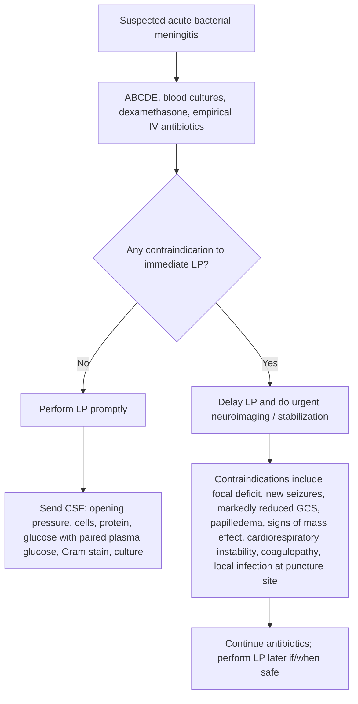
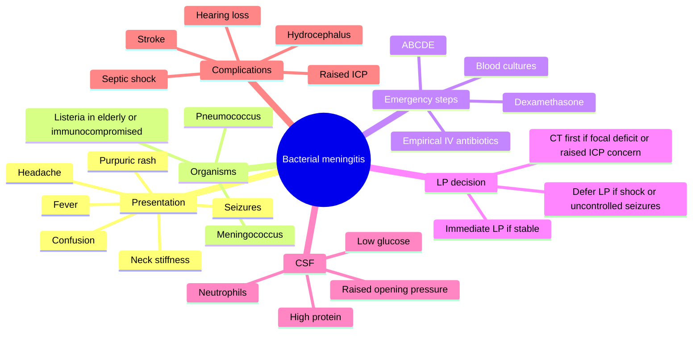

# Bacterial meningitis

Related: [[../Neurology MOC|Neurology MOC]] · [[../Meningitis|Meningitis]] · [[Acute meningitis framework|Acute meningitis framework]] · [[Viral meningitis]] · [[Meningococcal sepsis red flags]]

> [!important]
> **Bacterial meningitis is a medical and neurological emergency.** The scoring exam sequence is: **recognize sepsis/CNS infection**, **stabilize ABCDE**, **take blood cultures**, **give dexamethasone and empirical IV antibiotics early**, then decide **LP now vs CT first vs no LP yet**.

> [!tip]
> Preserve the Davidson Chapter 28 boundary: this note focuses on **acute bacterial meningitis as a neurological presentation**, including CSF logic, raised ICP risk, focal deficits, seizures, and acute complications. It does **not** expand into broader infectious disease chapters beyond what is needed for FCPS/MRCP bedside management.

## Learning Objectives
- Define bacterial meningitis and distinguish it from viral meningitis and encephalitis.
- Recognize classic and atypical presentations in adults.
- Apply a safe **LP/imaging decision algorithm**.
- Start evidence-based **empirical antibiotics and dexamethasone without delay**.
- Interpret typical CSF findings and key blood investigations.
- Identify neurological/systemic complications and red flags needing ICU-level care.

## Definition
**Bacterial meningitis** is acute pyogenic infection and inflammation of the **leptomeninges** and **subarachnoid space**, usually producing fever, headache, meningism, altered mental status, and abnormal CSF with **neutrophilic pleocytosis**, **raised protein**, and **low CSF glucose relative to plasma**.

## Why It Matters
Untreated bacterial meningitis can rapidly cause:
- septic shock
- raised intracranial pressure (ICP)
- cerebral edema
- seizures
- cranial nerve palsies
- stroke from vasculitic/thrombotic complications
- hearing loss
- death

A major exam principle: **do not delay antibiotics for LP or CT when bacterial meningitis is strongly suspected**.

## Relevant Anatomy and Physiology
### Meningeal anatomy
- The **pia** and **arachnoid mater** form the leptomeninges.
- CSF circulates within the **subarachnoid space**.
- Inflammation in this compartment explains:
  - headache from meningeal irritation
  - neck stiffness from painful stretching of inflamed meninges
  - photophobia
  - raised ICP from impaired CSF absorption and cerebral edema

### Blood-brain and blood-CSF barrier concepts
- Bacteria cross mucosal and bloodstream barriers, then seed the meninges.
- Cytokine-driven inflammation increases permeability, causing:
  - vasogenic edema
  - impaired cerebral perfusion
  - reduced CSF glucose
  - raised CSF protein

### Cranial nerve relevance
Inflammation around the basal meninges may produce:
- diplopia, especially VI nerve palsy
- facial weakness
- sensorineural hearing loss, especially after pneumococcal disease

## Common Causative Organisms
### By age and context
#### Community-acquired adult meningitis
- **Streptococcus pneumoniae** — common overall adult cause
- **Neisseria meningitidis** — especially younger adults, outbreaks, purpuric rash

#### Older adults, alcohol excess, pregnancy, immunocompromise
- **Listeria monocytogenes**

#### Post-neurosurgical, skull trauma, CSF shunt, healthcare-associated infection
- staphylococci
- Gram-negative bacilli including pseudomonal species depending on context

## Risk Factors
- extremes of age
- immunosuppression
- diabetes mellitus
- alcoholism
- asplenia or complement deficiency
- recent upper respiratory infection or otitis/sinusitis
- CSF leak
- head trauma
- neurosurgery or ventricular devices
- crowded living conditions for meningococcal spread

## Pathophysiology
1. Nasopharyngeal colonization or direct entry occurs.
2. Bacteremia develops or infection spreads directly from adjacent focus.
3. Organisms enter the subarachnoid space.
4. Host inflammatory response causes intense cytokine release.
5. Consequences include:
   - neutrophilic exudate
   - cerebral edema
   - impaired CSF absorption
   - raised ICP
   - vasculitis/vasospasm/thrombosis
   - reduced cerebral perfusion

## Clinical Features
### Classic triad
- fever
- headache
- neck stiffness

The triad is important but **not always complete**.

### Other common features
- photophobia
- vomiting
- altered mental status, confusion, drowsiness, coma
- seizures
- myalgia and malaise
- back pain

### Examination findings
- meningism / neck stiffness
- positive Kernig or Brudzinski sign may occur, but absence does not exclude disease
- fever and tachycardia
- hypotension if septic
- purpuric/petechial rash in meningococcal disease
- focal neurological deficits in complicated disease
- cranial nerve palsies
- papilledema may suggest raised ICP but may be absent even when ICP is high

### Important atypical or high-risk presentations
- elderly patient with **confusion more than meningism**
- immunocompromised patient with blunted fever/neck stiffness
- septic patient with petechiae/purpura and shock
- patient with seizures or focal deficit suggesting complicated meningitis or mass effect

## Red Flags
> [!danger]
> **Red flags needing urgent senior review / critical care involvement**
> - rapidly falling GCS
> - shock, purpuric rash, or suspected meningococcal sepsis
> - recurrent or prolonged seizures
> - focal neurological deficit
> - papilledema or markedly raised ICP suspicion
> - severe agitation or coma
> - immunocompromised host
> - respiratory failure
> - persistent hypotension despite fluids
> - suspected hydrocephalus

## Differential Diagnosis
- [[Viral meningitis]]
- encephalitis
- subarachnoid hemorrhage
- brain abscess
- severe migraine with meningism-like photophobia
- cerebral malaria depending on geography
- tuberculous meningitis in subacute cases
- drug-induced aseptic meningitis

## Acute Stabilization
### ABCDE priorities
1. **Airway**
   - assess ability to protect airway
   - intubate early if GCS is falling, recurrent seizures, or respiratory failure
2. **Breathing**
   - high-flow oxygen if hypoxic or critically ill
   - monitor respiratory rate and oxygen saturation
3. **Circulation**
   - IV access x2 if possible
   - send urgent bloods and blood cultures
   - give IV fluids for hypotension/sepsis
   - monitor BP, pulse, urine output
4. **Disability**
   - GCS, pupils, focal deficits
   - check bedside glucose
   - treat seizures promptly
5. **Exposure**
   - look for rash, source of infection, trauma, CSF leak, otitis/mastoiditis

### Immediate actions that should not be missed
- isolate appropriately if meningococcal disease suspected according to local policy
- **take blood cultures** before antibiotics if this does not delay treatment
- **give dexamethasone with or just before first antibiotic dose** when bacterial meningitis is suspected
- **start empirical IV antibiotics immediately**

## LP vs CT First vs No LP Yet

### When LP can usually be done promptly
If the patient is stable and there is **no strong evidence of raised ICP, focal mass lesion, or cardiorespiratory instability**, do LP early after blood cultures and early treatment.

### When CT head should usually come first
Obtain urgent neuroimaging before LP if there is:
- focal neurological deficit
- new-onset seizures or prolonged/recurrent seizures
- markedly impaired consciousness
- papilledema
- signs suggesting mass lesion, obstructive hydrocephalus, or significant raised ICP
- immunocompromised state with concern for mass lesion/opportunistic pathology

### When LP should be deferred initially
- shock or severe cardiorespiratory instability
- uncontrolled seizures
- obvious need for immediate airway management/ICU transfer
- significant coagulopathy/thrombocytopenia depending on severity and local policy
- infection over the puncture site

### Exam pearl
A **normal CT does not fully exclude raised ICP**, but CT is used to look for mass effect, edema, hydrocephalus, or another structural reason making LP unsafe.

## Investigations
### Immediate bedside / blood investigations
- capillary blood glucose
- **blood cultures x2** ideally before antibiotics
- CBC/FBC
- CRP, ESR if relevant
- U&E, creatinine
- LFTs
- coagulation profile
- serum lactate if septic
- paired **plasma glucose** for CSF interpretation
- ABG/VBG if critically unwell
- HIV testing or other immunocompromise workup when appropriate

### CSF studies
Send for:
- opening pressure
- cell count and differential
- protein
- glucose with paired blood glucose
- Gram stain
- culture and sensitivity
- additional tests if indicated by context

### Typical CSF pattern in bacterial meningitis
- **opening pressure:** often raised
- **WBC:** high, usually neutrophil predominant
- **protein:** raised
- **glucose:** low
- **CSF:plasma glucose ratio:** reduced
- **Gram stain/culture:** may identify organism

### Imaging
- **CT head** when LP safety is uncertain or alternative pathology is possible
- **MRI brain** if complications, abscess, infarction, ventriculitis, or alternative diagnosis is suspected

### Supportive adjuncts
- chest X-ray, urine studies, ENT evaluation, or other source search when indicated

## Interpretation Framework
### CSF comparison: bacterial vs viral meningitis
| Feature | Bacterial meningitis | Viral meningitis |
|---|---|---|
| Opening pressure | Often raised | Usually normal or mildly raised |
| Cells | Neutrophilic pleocytosis | Lymphocytic predominance (often) |
| Protein | Raised | Mild-moderately raised |
| Glucose | Low | Usually normal |
| Gram stain | May be positive | Negative |

### Clues favoring bacterial meningitis
- toxic appearance
- significant altered mental state
- seizures
- purpuric rash
- marked neutrophilia / inflammatory response
- low CSF glucose
- very high CSF protein

## Diagnosis
Diagnosis is based on **clinical suspicion plus microbiological/CSF evidence**, but management must begin **before confirmation** if suspicion is strong.

Practical diagnostic formulation:
- **suspected acute bacterial meningitis** in any patient with acute febrile headache/meningism and altered mental state or sepsis
- **confirmed** when CSF and/or blood culture, Gram stain, or other microbiological evidence identifies a bacterial cause

## Management
### Core emergency treatment principles
- do not delay therapy for imaging or LP if this would postpone treatment
- give **dexamethasone early**
- start **empirical IV antibiotics immediately**
- manage as sepsis where appropriate
- treat complications aggressively

### Dexamethasone
- Give **with or just before the first antibiotic dose** in suspected bacterial meningitis.
- Main rationale: reduces inflammatory complications, especially hearing loss and some adverse outcomes, particularly in pneumococcal disease.
- If bacterial meningitis becomes unlikely after evaluation, steroid continuation can be reconsidered.

### Empirical IV antibiotics: exam-friendly logic
#### Typical adult community-acquired bacterial meningitis
- **third-generation cephalosporin** such as **ceftriaxone** (or cefotaxime depending on local protocol)

#### Add coverage for resistant pneumococcus where relevant
- add **vancomycin** according to local resistance patterns/protocols

#### Add Listeria coverage when risk is significant
Add **ampicillin/amoxicillin** in:
- older adults
- pregnancy
- immunocompromised patients
- alcoholism

#### Post-neurosurgical / device-related / healthcare-associated contexts
- broader antistaphylococcal and Gram-negative coverage according to local policy and microbiology advice

### Practical exam prescription framework
A safe verbal answer is:
- **blood cultures first if no delay**
- **dexamethasone immediately**
- **ceftriaxone/cefotaxime-based IV therapy**
- **add vancomycin if resistant pneumococcus is a concern**
- **add ampicillin/amoxicillin if Listeria risk exists**

### Supportive care
- IV fluids and sepsis management
- antipyretics and analgesia
- monitor fluid balance and electrolytes
- treat hypoglycemia if present
- correct severe hyponatremia carefully
- manage nausea/vomiting
- thromboprophylaxis if appropriate once stabilized
- early ICU review if deteriorating

### Seizure management
- benzodiazepine acutely if seizing
- load longer-acting antiseizure medication if recurrent seizures/status epilepticus
- search for cerebral edema, infarction, abscess, or metabolic derangement if seizures occur

### Raised ICP management principles
- urgent senior/ICU involvement
- head-up positioning
- airway and ventilation support where needed
- avoid hypotension and hypoxia
- neuroimaging when stable enough
- neurosurgical input if hydrocephalus or mass lesion develops

### Public health / prophylaxis note
If **meningococcal meningitis** is confirmed or strongly suspected:
- notify according to public health requirements
- close contacts may require chemoprophylaxis per local policy

## Complications
### Neurological
- seizures and status epilepticus
- cerebral edema
- raised ICP
- hydrocephalus
- cranial nerve palsies
- hearing loss
- focal deficits
- cerebral infarction / vasculitic ischemia
- subdural effusion/empyema
- brain abscess or ventriculitis in selected cases
- cognitive impairment

### Systemic
- septic shock
- DIC, especially meningococcal disease
- acute kidney injury
- respiratory failure
- SIADH with hyponatremia

## Prognostic Factors / Poor Outcome Clues
- delayed antibiotic therapy
- older age
- low GCS/coma
- shock
- seizures
- focal neurological deficits
- pneumococcal infection
- very high opening pressure / major raised ICP

## Special Situations
### Meningococcal disease
- rash may be petechial or purpuric
- shock can be prominent
- urgent sepsis management and public health measures matter

### Listeria risk state
Think of Listeria more strongly in:
- elderly
- pregnancy
- diabetes/alcoholism
- immunosuppression

### Post-neurosurgical meningitis
- broader organism spectrum
- discuss early with microbiology/neurosurgery
- device-related infection may need source control

## FCPS/MRCP High-Yield Pearls
- **Do not wait for LP to start treatment** if bacterial meningitis is likely.
- **Dexamethasone should be given with or before the first antibiotic dose.**
- Adult community-acquired disease is commonly due to **pneumococcus** or **meningococcus**.
- Add **ampicillin/amoxicillin** when **Listeria** risk is relevant.
- **Focal deficit, seizure, reduced consciousness, papilledema, or suspected mass effect** push you toward **CT before LP**.
- A **low CSF glucose** strongly supports bacterial or tuberculous rather than viral meningitis.
- Hearing loss is a classic important complication.
- Meningococcal disease may present with **purpura, shock, and DIC**.

## One-Page Summary
### Recognition
- acute fever + headache + meningism ± altered mental state
- suspect bacterial cause if toxic, confused, septic, fitting, or purpuric

### Immediate first 10 minutes
- ABCDE
- bedside glucose
- IV access
- blood cultures if no delay
- dexamethasone
- empirical IV antibiotics

### LP/imaging logic
- **LP promptly** if stable and no features suggesting unsafe LP
- **CT before LP** if focal deficit, seizures, reduced GCS, papilledema, suspected raised ICP/mass effect, or immunocompromise with concern for mass lesion
- **defer LP initially** if shock, respiratory failure, uncontrolled seizures, or coagulopathy

### Empirical treatment logic
- ceftriaxone/cefotaxime backbone
- add vancomycin where resistant pneumococcus is a concern
- add ampicillin/amoxicillin if Listeria risk exists
- dexamethasone with or before first antibiotic dose

### Typical CSF in bacterial meningitis
- raised opening pressure
- neutrophilic pleocytosis
- high protein
- low glucose

### Complications to mention in exams
- seizures
- raised ICP/cerebral edema
- hearing loss
- cranial nerve palsies
- stroke
- hydrocephalus
- septic shock/DIC

## Visual Summary Mind Map

## MCQs (10)
1. The most important principle when bacterial meningitis is strongly suspected is:
   - A. Delay treatment until CSF culture confirms the organism
   - B. Start antibiotics only after CT in every patient
   - C. Begin dexamethasone and empirical IV antibiotics early without unnecessary delay
   - D. Avoid blood cultures because they are low yield
2. Which organism is a common cause of community-acquired bacterial meningitis in adults?
   - A. Streptococcus pneumoniae
   - B. Entamoeba histolytica
   - C. Plasmodium vivax
   - D. Clostridioides difficile
3. Which CSF profile best fits bacterial meningitis?
   - A. Low cells, low protein, high glucose
   - B. Neutrophilic pleocytosis, high protein, low glucose
   - C. Lymphocytes only, normal protein, very high glucose
   - D. Normal opening pressure and normal studies in all cases
4. Dexamethasone is most appropriately given:
   - A. Several days after antibiotics
   - B. Only after the culture result is known
   - C. With or just before the first antibiotic dose
   - D. Only if there is no fever
5. Which feature most strongly suggests CT before LP?
   - A. Headache alone
   - B. Focal neurological deficit
   - C. Neck stiffness alone
   - D. Mild photophobia with normal alertness
6. Which patient group especially requires consideration of Listeria coverage?
   - A. Healthy teenager with isolated migraine
   - B. Older immunocompromised adult
   - C. Patient with simple tension headache
   - D. Child with allergic rhinitis
7. A petechial or purpuric rash in suspected meningitis should make you think particularly of:
   - A. Meningococcal disease
   - B. Trigeminal neuralgia
   - C. Myasthenia gravis
   - D. Parkinson disease
8. Which is a major neurological complication of bacterial meningitis?
   - A. Hearing loss
   - B. Cataract
   - C. Carpal tunnel syndrome
   - D. Osteoporosis
9. In suspected bacterial meningitis, blood cultures should ideally be taken:
   - A. Only after 5 days of antibiotics
   - B. Before antibiotics if this does not delay treatment
   - C. Only after LP has been completed
   - D. They are never useful
10. Which statement about CT and LP is most correct?
   - A. Every patient must have CT before LP
   - B. CT replaces CSF analysis in all patients
   - C. CT is used when LP may be unsafe, but treatment should not be delayed while arranging it
   - D. LP is contraindicated in all suspected meningitis

## SBA Questions (10)
1. A 24-year-old student presents with fever, severe headache, neck stiffness, vomiting, and a petechial rash. He is drowsy and hypotensive. What is the single best immediate management priority?
   - A. Wait for lumbar puncture results before treatment
   - B. Start dexamethasone and empirical IV antibiotics while resuscitating as sepsis
   - C. Give oral antibiotics and review in 24 hours
   - D. Arrange outpatient MRI brain
   - E. Discharge if neck stiffness improves
2. A 68-year-old man with diabetes presents with fever, confusion, neck stiffness, and new focal left arm weakness. What is the best next investigation strategy regarding LP?
   - A. Immediate LP without further assessment
   - B. CT head first because focal deficit raises concern for unsafe LP
   - C. No antibiotics until LP is completed
   - D. EEG first and then discharge
   - E. Avoid all imaging because meningitis is a clinical diagnosis
3. A 72-year-old woman with acute bacterial meningitis is being started on empirical therapy. Which additional organism should be covered because of age-related risk?
   - A. Listeria monocytogenes
   - B. Vibrio cholerae
   - C. Bordetella pertussis
   - D. Treponema pallidum
   - E. Toxoplasma gondii
4. A patient with suspected bacterial meningitis is fully alert, has no focal deficits, no papilledema, and is hemodynamically stable. Best next step?
   - A. Delay LP for 48 hours
   - B. Perform LP promptly after initial bloods/cultures and early treatment steps
   - C. Do CT in every case before any LP
   - D. Manage as migraine
   - E. Give only dexamethasone without antibiotics
5. A 35-year-old man with suspected meningitis has a CSF profile of high opening pressure, neutrophilic pleocytosis, raised protein, and low glucose. The most likely diagnosis is:
   - A. Bacterial meningitis
   - B. Benign essential tremor
   - C. Idiopathic intracranial hypertension
   - D. Myasthenic crisis
   - E. Cluster headache
6. A patient with bacterial meningitis develops generalized tonic-clonic seizures on the ward. Which is the best immediate action?
   - A. Reassure only
   - B. Treat seizures acutely and reassess for complications such as edema or raised ICP
   - C. Stop antibiotics
   - D. Delay treatment until EEG confirms epilepsy
   - E. Give only oral analgesics
7. Which statement about dexamethasone in suspected bacterial meningitis is most appropriate for MRCP/FCPS exams?
   - A. It should be avoided in all cases
   - B. It is useful only after 72 hours
   - C. It should be given with or before the first antibiotic dose
   - D. It replaces the need for antibiotics
   - E. It is indicated only if CT is normal
8. A 20-year-old patient with suspected meningococcal meningitis becomes cold, clammy, and hypotensive with purpura. What is the most concerning systemic complication?
   - A. Septic shock with possible DIC
   - B. Hyperthyroidism
   - C. Nephrotic syndrome
   - D. Achalasia
   - E. Glaucoma
9. A patient with bacterial meningitis improves clinically but later complains of reduced hearing. This is:
   - A. An unrelated symptom in all cases
   - B. A recognized complication of meningitis
   - C. Evidence against bacterial meningitis
   - D. Always due to wax impaction
   - E. A contraindication to steroids only
10. In a patient with suspected bacterial meningitis, why should antibiotics not be delayed for neuroimaging if treatment is urgently indicated?
   - A. Because CT can never be abnormal
   - B. Because delay worsens outcome and early antimicrobial therapy is critical
   - C. Because LP is never needed
   - D. Because blood cultures are unhelpful
   - E. Because bacterial meningitis is usually self-limiting

## Flashcards
- Q: What is the cardinal management principle in suspected bacterial meningitis?
  A: Start dexamethasone and empirical IV antibiotics early without waiting for confirmatory LP/CT if this would delay treatment.
- Q: Name the 2 common adult community-acquired causes of bacterial meningitis.
  A: Streptococcus pneumoniae and Neisseria meningitidis.
- Q: In which patients should Listeria cover be added?
  A: Older adults, immunocompromised patients, pregnancy, and alcoholism/high-risk states.
- Q: What CSF cell pattern is typical of bacterial meningitis?
  A: Neutrophilic pleocytosis.
- Q: What happens to CSF glucose in bacterial meningitis?
  A: It is typically low, with a reduced CSF:plasma glucose ratio.
- Q: Name 4 features that push you toward CT before LP.
  A: Focal deficit, seizures, reduced consciousness, papilledema/raised ICP concern.
- Q: When should dexamethasone be administered?
  A: With or just before the first antibiotic dose.
- Q: What rash is classically associated with meningococcal disease?
  A: Petechial or purpuric rash.
- Q: Name 3 neurological complications of bacterial meningitis.
  A: Seizures, hearing loss, raised ICP/hydrocephalus, stroke, cranial nerve palsies.
- Q: What is the usual empirical antibiotic backbone in adult community-acquired bacterial meningitis?
  A: A third-generation cephalosporin such as ceftriaxone or cefotaxime, modified by local context.

## Answer Key with Explanations
### MCQs
1. **C. Begin dexamethasone and empirical IV antibiotics early without unnecessary delay** — prompt treatment saves lives and must not wait for confirmatory tests.
2. **A. Streptococcus pneumoniae** — a major adult cause.
3. **B. Neutrophilic pleocytosis, high protein, low glucose** — classic bacterial CSF pattern.
4. **C. With or just before the first antibiotic dose** — this is the key steroid timing point.
5. **B. Focal neurological deficit** — implies possible mass effect/unsafe LP and need for imaging first.
6. **B. Older immunocompromised adult** — this group requires Listeria consideration.
7. **A. Meningococcal disease** — purpuric rash is a classic clue.
8. **A. Hearing loss** — important neurological complication.
9. **B. Before antibiotics if this does not delay treatment** — ideal practice, but treatment takes priority.
10. **C. CT is used when LP may be unsafe, but treatment should not be delayed while arranging it** — the central exam principle.

### SBAs
1. **B. Start dexamethasone and empirical IV antibiotics while resuscitating as sepsis** — this patient likely has meningococcal sepsis with meningitis.
2. **B. CT head first because focal deficit raises concern for unsafe LP** — image first, but still treat immediately.
3. **A. Listeria monocytogenes** — key age-related organism to cover.
4. **B. Perform LP promptly after initial bloods/cultures and early treatment steps** — no clear contraindication to early LP.
5. **A. Bacterial meningitis** — the CSF pattern is classic.
6. **B. Treat seizures acutely and reassess for complications such as edema or raised ICP** — seizures are a complication, not a reason to stop therapy.
7. **C. It should be given with or before the first antibiotic dose** — standard high-yield point.
8. **A. Septic shock with possible DIC** — classic meningococcal collapse pattern.
9. **B. A recognized complication of meningitis** — sensorineural hearing loss is important.
10. **B. Because delay worsens outcome and early antimicrobial therapy is critical** — immediate treatment improves prognosis.

## PasTest Scenario SBAs (Clinical Vignettes)

> **Auto-generated PasTest/Mediscope-style scenario SBAs** grounded in the authored source. Each scenario tests a real clinical fact (triad, specific sign, contraindication, trial, first-line Rx) extracted from the topic. *Source: Ch 27: Neurology & Stroke — Bacterial meningitis*

**Q1.** Which of the following features is most specific or characteristic of Bacterial meningitis?

  - **A.** C. With or just before the first antibiotic dose
  - **B.** A feature common to many acute inflammatory conditions
  - **C.** A non-specific sign that does not localise the diagnosis
  - **D.** An investigation finding rather than a clinical feature

  > **Answer: A** — C. With or just before the first antibiotic dose
  >
  > *Source:* **C. With or just before the first antibiotic dose** — this is the key steroid timing point

**Q2.** What is the most appropriate first-line therapy for Bacterial meningitis?

  - **A.** dexamethasone early
  - **B.** An advanced/surgical therapy reserved for refractory disease
  - **C.** Symptomatic treatment only, no disease-modifying therapy
  - **D.** Empiric broad-spectrum therapy without specific indication

  > **Answer: A** — dexamethasone early
  >
  > *Source:* give **dexamethasone early**

