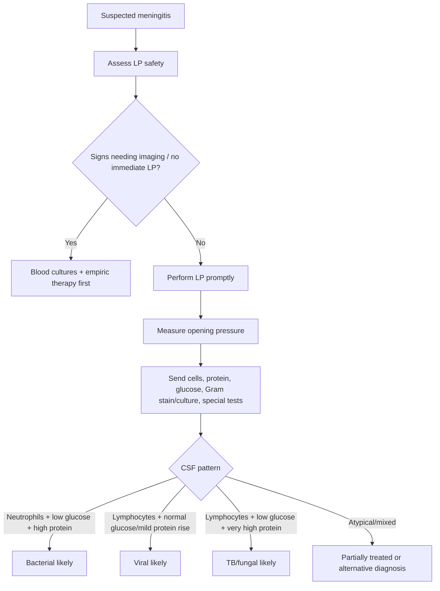
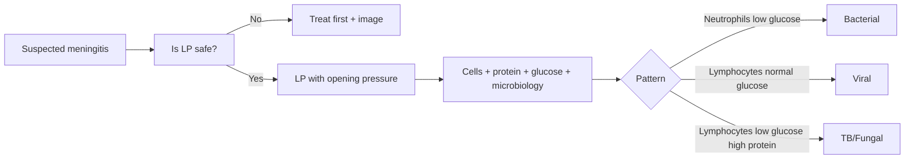

# CSF pattern interpretation in meningitis

Related: [[../Neurology MOC|Neurology MOC]] · [[../Meningitis|Meningitis]] · [[Workup and management]] · [[Lumbar puncture indications and contraindications]] · [[Bacterial meningitis]] · [[Tuberculous meningitis]] · [[Fungal meningitis]] · [[Viral meningitis]]

> [!important]
> CSF interpretation is a **high-yield FCPS/MRCP neurology skill**. The candidate must link **opening pressure, cell type, protein, glucose, Gram stain/culture, and special tests** to the likely meningitis category while remembering when LP is unsafe.

> [!tip]
> A strong answer does not memorize one pattern only. It explains **acute pyogenic**, **viral**, **tuberculous**, and **fungal** meningitis patterns and notes that partially treated disease can blur the picture.

## Learning Objectives
- Review normal CSF physiology and CSF pathways.
- Interpret the classic CSF profile in bacterial, viral, tuberculous, and fungal meningitis.
- Understand how opening pressure, cell count, protein, and CSF glucose relate to disease mechanism.
- Recognize pitfalls such as partially treated bacterial meningitis or traumatic tap.
- Integrate CSF results with clinical urgency and neuroimaging/LP safety.

## Definition
**CSF pattern interpretation in meningitis** means analyzing lumbar puncture findings to identify the likely inflammatory/infective process affecting the meninges and adjacent CNS structures.

## Relevant Neuroanatomy
- CSF is produced mainly by the **choroid plexus**.
- It flows through the ventricular system into the **subarachnoid space** around brain and spinal cord.
- The meninges include:
  - dura
  - arachnoid
  - pia
- LP samples CSF from the lumbar subarachnoid space, indirectly reflecting intracranial meningeal inflammation.

## Relevant Neurophysiology
- Normal CSF acts as a protective and metabolic medium.
- In meningitis, inflammation alters:
  - blood-brain/blood-CSF barrier permeability → **protein rises**
  - leukocyte trafficking → **pleocytosis**
  - glucose consumption by cells/organisms + impaired transport → **CSF glucose falls**
  - CSF circulation/reabsorption → **opening pressure rises**

## Normal Values / Important Cut-offs
Typical normal adult CSF values:
- **Opening pressure:** about **6-20 cm H2O** (lab/position dependent)
- **WBC:** 0-5 lymphocytes/µL
- **Protein:** roughly **0.15-0.45 g/L**
- **CSF glucose:** usually about **>50-60% of simultaneous plasma glucose**

High-yield abnormal patterns:
- **Neutrophil-predominant pleocytosis** strongly suggests acute bacterial meningitis.
- **Very low CSF glucose** strongly suggests bacterial, TB, or fungal meningitis.
- **Lymphocytic pleocytosis** suggests viral, TB, fungal, autoimmune, or partially treated bacterial causes depending on context.

## Classification
### Practical CSF pattern groups in meningitis
1. **Acute pyogenic/bacterial pattern**
2. **Viral pattern**
3. **Tuberculous pattern**
4. **Fungal pattern**
5. **Partially treated / mixed or atypical pattern**

## Etiology / Causes
- pyogenic bacteria
- viruses/enteroviruses/HSV and others
- Mycobacterium tuberculosis
- cryptococcus and other fungi
- partially treated infection
- malignant/inflammatory mimics in selected cases

## Risk Factors
- immunocompromise
- HIV/AIDS
- diabetes
- malnutrition
- extremes of age
- neurosurgical history or CSF leak
- TB exposure/endemic area
- steroid use or transplant state

## Pathophysiology
### Why bacterial CSF looks “purulent”
- intense neutrophilic response
- marked barrier disruption → high protein
- organisms and leukocytes consume glucose
- severe inflammatory edema/obstruction → raised opening pressure

### Why viral CSF often preserves glucose
- viral infection causes lymphocytic inflammation but glucose is often relatively preserved because organisms do not consume glucose in the same manner as pyogenic/TB/fungal processes.

### Why TB/fungal meningitis lower glucose and raise protein
- chronic granulomatous or fungal meningeal inflammation causes impaired glucose transport, heavy protein leak, and often marked opening pressure elevation.

## Clinical Features
CSF interpretation must never be isolated from clinical context.
Important clues:
- **Acute fever, headache, neck stiffness, shock** → bacterial pattern likely
- **Subacute fever, weight loss, cranial neuropathy, confusion** → TB meningitis possible
- **Immunocompromised host with headache and raised ICP** → fungal meningitis, especially cryptococcal
- **Milder headache + photophobia + preserved consciousness** → viral meningitis more likely

## Approach / Algorithm

## Investigations
### CSF tests to send
- opening pressure
- WBC count and differential
- protein
- glucose with simultaneous blood glucose
- Gram stain
- bacterial culture
- AFB tests / TB NAAT where available
- fungal stain/cryptococcal antigen where indicated
- viral PCR when suspected

### Adjunct investigations
- blood cultures
- CBC, CRP
- neuroimaging if LP safety concerns
- HIV testing when appropriate
- chest imaging or TB work-up when relevant

## Interpretation Frameworks
### Core CSF interpretation table
| Pattern | Opening pressure | Cells | Protein | Glucose | Common meaning |
|---|---|---|---|---|---|
| Acute bacterial | Often raised | Neutrophils predominate | High | Low | Pyogenic meningitis |
| Viral | Normal or mildly raised | Lymphocytes predominate | Mild-moderate rise | Usually normal | Viral meningitis/encephalitic process |
| Tuberculous | Raised | Lymphocytes predominate | High/often very high | Low | TB meningitis |
| Fungal | Raised, sometimes markedly | Lymphocytes/mononuclear | High | Low | Cryptococcal or other fungal meningitis |

### High-yield interpretation checkpoints
1. **Opening pressure** high or normal?
2. **Cell type** neutrophil or lymphocyte predominant?
3. **Protein** mildly or markedly elevated?
4. **CSF glucose** low relative to serum or preserved?
5. **Microbiology** positive or pending?
6. Has the patient had **prior antibiotics**?

### Important caveats
- Early viral meningitis can occasionally show neutrophils initially.
- Partially treated bacterial meningitis may become less classical.
- Traumatic tap can confuse cell count and protein.
- TB/fungal meningitis are often subacute and require specific tests beyond routine Gram stain.

## Diagnosis
CSF results contribute to, but do not replace, clinical diagnosis.

### Typical diagnostic direction
- **Neutrophils + high protein + low glucose** → acute bacterial meningitis until proven otherwise
- **Lymphocytes + normal glucose + mild protein rise** → viral meningitis more likely
- **Lymphocytes + very high protein + low glucose** → TB or fungal meningitis

## Differential Diagnosis
CSF abnormalities can also occur in:
- encephalitis
- carcinomatous meningitis
- autoimmune inflammatory meningitis
- subarachnoid hemorrhage / traumatic tap confusion
- partially treated bacterial meningitis

## Tables / Comparison Charts
| Feature | Bacterial meningitis | Viral meningitis | TB meningitis | Fungal meningitis |
|---|---|---|---|---|
| Onset | Acute | Acute-subacute | Subacute | Subacute/chronic |
| Opening pressure | Raised | Normal/mildly raised | Raised | Raised, may be marked |
| Cells | Neutrophils | Lymphocytes | Lymphocytes | Lymphocytes/mononuclear |
| Protein | High | Mild-moderately high | High | High |
| CSF glucose | Low | Usually normal | Low | Low |
| Special clues | Gram stain/culture | PCR | TB NAAT/AFB, basal features | Cryptococcal antigen, immunocompromised host |

## Management
### Interpretation-driven action
- If CSF suggests **bacterial meningitis**, continue/optimize urgent antibiotics ± dexamethasone as appropriate.
- If CSF suggests **TB meningitis**, start anti-TB therapy plus steroids per protocol.
- If CSF suggests **fungal meningitis**, manage urgently, often with infectious disease input and ICP control.
- If **viral** pattern and patient is well, supportive care may be sufficient unless HSV/encephalitis is suspected.

### Never delay treatment unnecessarily
If meningitis is strongly suspected and LP is delayed or unsafe, treat first and interpret results later.

## Drug Interactions / Contraindications / Comorbidity Cautions
- Prior antibiotics may partially sterilize CSF and alter appearance, but treatment must not be withheld.
- In renal failure, dose adjustment may be needed for several antimicrobials.
- Steroids are context-specific: classically important in selected bacterial meningitis and TB meningitis pathways.
- Cryptococcal meningitis often requires repeated pressure management; antifungal therapy alone may not be enough when ICP is severe.

## Procedures / Indications / Contraindications
### Lumbar puncture
- **Indication:** suspected meningitis when safe
- **Contraindications/deferral triggers:** marked focal deficit, papilledema, signs of mass effect, severe coagulopathy, cardiorespiratory instability, local infection at puncture site

### Opening pressure measurement
- always valuable when meningitis is suspected, especially fungal/TB disease or raised ICP concern

## Procedure Mini-Sections
### Lumbar puncture in suspected meningitis
- **Preparation:** assess platelets/coagulation, focal deficits, GCS, papilledema risk
- **Key samples:** cells, protein, glucose, stain/culture, organism-specific tests
- **Pearl:** send **paired serum glucose** for proper CSF glucose interpretation

### Traumatic tap handling
- compare sequential tube RBC counts
- use clinical context rather than overtrusting a single abnormal number
- persistent xanthochromia/clinical clues may suggest alternative pathology

## Complications
- missed bacterial meningitis if CSF misread as viral
- delayed TB/fungal diagnosis in subacute cases
- brain herniation risk if LP performed despite contraindications
- falsely reassuring interpretation after partial antibiotics

## Red Flags / Emergencies
- coma or rapidly falling GCS
- focal neurological deficit
- papilledema or signs of raised ICP
- meningococcal sepsis picture
- immunocompromised patient with severe headache and raised opening pressure
- cranial neuropathies and subacute meningitic illness suggesting TB meningitis

## Prognosis
CSF interpretation affects prognosis indirectly by enabling rapid correct therapy.
- Bacterial meningitis prognosis worsens rapidly with delayed treatment.
- TB/fungal meningitis often have worse outcomes when diagnosis is late.
- Viral meningitis generally has better prognosis, but encephalitic syndromes are an exception.

## Topic Correlation
- [[Bacterial meningitis]]
- [[Viral meningitis]]
- [[Tuberculous meningitis]]
- [[Fungal meningitis]]
- [[Lumbar puncture indications and contraindications]]
- [[Empiric antimicrobials and adjunctive steroids]]

## Special Situations
- **Partially treated bacterial meningitis:** pattern may shift toward lymphocytes; do not be falsely reassured.
- **HIV/immunocompromised:** fungal/TB causes move higher in the differential.
- **Children/older adults:** normal ranges and thresholds may vary slightly; always use local lab ranges with clinical judgment.
- **Very raised opening pressure:** think cryptococcal disease or severe TB/bacterial inflammation.

## FCPS/MRCP High-Yield Points
- Always compare **CSF glucose with paired serum glucose**.
- Bacterial meningitis classically gives **neutrophils + high protein + low glucose**.
- Viral meningitis often gives **lymphocytes + normal glucose**.
- TB/fungal meningitis often give **lymphocytes + high protein + low glucose**.
- LP is valuable, but **unsafe LP can be dangerous**.

## Common Viva Questions
- What are normal CSF values?
- Describe the CSF pattern in bacterial meningitis.
- How does TB meningitis CSF differ from viral meningitis CSF?
- Why can CSF glucose be low?
- When should you delay LP and do imaging first?

## Common Confusions / Exam Traps
- Forgetting paired blood glucose.
- Assuming all lymphocytic CSF is viral.
- Forgetting that early viral meningitis may transiently be neutrophilic.
- Delaying antibiotics excessively while waiting for LP.
- Misinterpreting partially treated bacterial meningitis as benign viral disease.

## Mnemonics
- **Bacterial = NPL**
  - **N**eutrophils
  - high **P**rotein
  - **L**ow glucose
- **Viral = LNP**
  - **L**ymphocytes
  - **N**ormal glucose
  - mild **P**rotein rise
- **TB/Fungal = LPL**
  - **L**ymphocytes
  - high **P**rotein
  - **L**ow glucose

## Mind Map
- CSF in meningitis
  - opening pressure
  - cells
    - neutrophils
    - lymphocytes
  - protein
  - glucose
  - microbiology
  - patterns
    - bacterial
    - viral
    - TB
    - fungal
  - pitfalls
    - prior antibiotics
    - traumatic tap
    - unsafe LP

## Flowchart

## Suggested Visuals / Image Notes
- CSF normal vs bacterial vs viral vs TB/fungal comparison table
- LP decision tree
- Diagram of CSF circulation and meninges

## Suggested Video References
- Look for: “CSF interpretation in meningitis MRCP”
- Look for: “lumbar puncture and meningitis CSF patterns”
- Look for: “TB meningitis versus viral meningitis CSF comparison”

## One-Page Revision Summary
- Normal CSF: low cells, low protein, glucose >50-60% of serum.
- **Bacterial:** raised OP, neutrophils, high protein, low glucose.
- **Viral:** normal/mildly raised OP, lymphocytes, mild protein rise, glucose usually normal.
- **TB/Fungal:** raised OP, lymphocytes, high protein, low glucose.
- Pair CSF with **serum glucose**.
- If LP unsafe or delayed, **do not delay empiric treatment**.
- Partially treated disease can blur classical patterns.

## 24-Hour Recall Prompts
- State normal CSF values.
- What is the classical bacterial meningitis CSF pattern?
- What pattern suggests TB meningitis?
- Why can viral CSF be less glucose-depleted?
- When is LP unsafe or delayed?

## 7-Day / 15-Day / 30-Day Revision Tracker
- **Day 1:** Reproduce the 4-pattern CSF table.
- **Day 7:** Explain LP contraindications from memory.
- **Day 15:** Compare TB vs fungal vs viral CSF.
- **Day 30:** Solve 10 CSF interpretation rapid-fire questions.

## Must Know / Should Know / Nice to Know
### Must Know
- normal CSF values
- bacterial vs viral vs TB/fungal patterns
- paired serum glucose
- LP safety

### Should Know
- partially treated bacterial pitfalls
- traumatic tap interpretation basics
- opening pressure importance

### Nice to Know
- organism-specific PCR/antigen testing nuances
- advanced inflammatory mimics

## My Weak Points
- Do I remember the normal CSF ranges?
- Can I separate TB/fungal from viral confidently?
- Do I always mention paired blood glucose and LP safety?

## Self-Test Scorecard
- Normal values: __/10
- Pattern recognition: __/10
- LP safety: __/10
- Viva confidence: __/10
- Clinical integration: __/10

## Exam Answer Modes
- **Long answer:** CSF interpretation in meningitis with differential patterns.
- **Short note:** characteristic CSF findings in common meningitides.
- **Viva:** “How do you interpret a CSF report showing 900 neutrophils, high protein, and low glucose?”

## Summary
CSF interpretation in meningitis is a core neurology exam skill. The key is to integrate **opening pressure, cells, protein, glucose, and microbiology** with clinical context. **Bacterial** meningitis classically gives **neutrophils + high protein + low glucose**; **viral** meningitis usually gives **lymphocytes + normal glucose**; **TB/fungal** disease usually gives **lymphocytes + high protein + low glucose**. Safety of LP and urgency of treatment must always be kept in mind.

## MCQs (10)
1. The typical CSF cell predominance in acute bacterial meningitis is:
   - A. Eosinophils
   - B. Neutrophils
   - C. Plasma cells only
   - D. No cells
   - E. Basophils

2. In viral meningitis, CSF glucose is usually:
   - A. Very low
   - B. Normal or relatively preserved
   - C. Always zero
   - D. Higher than blood glucose
   - E. Unmeasurable

3. Which combination best suggests tuberculous meningitis?
   - A. Neutrophils, normal protein, high glucose
   - B. Lymphocytes, high protein, low glucose
   - C. No cells, low protein, low glucose
   - D. RBC only, normal glucose
   - E. Eosinophils, low pressure

4. Which parameter should be compared with simultaneous serum value?
   - A. CSF sodium
   - B. CSF glucose
   - C. CSF chloride only
   - D. CSF color only
   - E. CSF opening pressure only

5. A markedly raised opening pressure in an immunocompromised patient with meningitic symptoms especially raises concern for:
   - A. Cryptococcal or other fungal meningitis
   - B. BPPV
   - C. Tension headache
   - D. Parkinson disease
   - E. Essential tremor

6. Partially treated bacterial meningitis may:
   - A. Always become normal instantly
   - B. Show an atypical or blurred CSF pattern
   - C. Never alter CSF results
   - D. Exclude the need for antibiotics
   - E. Guarantee viral diagnosis

7. The normal adult CSF white cell count is usually:
   - A. 100-200/µL
   - B. 50-100/µL
   - C. 0-5/µL
   - D. 500-1000/µL
   - E. 20-30 neutrophils/µL

8. Which finding most strongly supports acute pyogenic meningitis?
   - A. Neutrophils + low glucose + high protein
   - B. Normal cells + low protein
   - C. Lymphocytes + normal glucose + mild protein rise only
   - D. Normal LP in all respects
   - E. Pure RBC contamination

9. Which statement about LP in suspected meningitis is best?
   - A. LP should be done even when there are strong signs of mass effect without further assessment
   - B. LP safety must be assessed before the procedure
   - C. LP replaces clinical judgment
   - D. Imaging always replaces LP
   - E. Opening pressure is irrelevant

10. A traumatic tap can confuse interpretation mainly by affecting:
   - A. Cells and protein interpretation
   - B. Only pulse rate
   - C. Vision
   - D. Smell
   - E. Reflexes

## SBA Questions (10)
1. A 21-year-old man has fever, neck stiffness, confusion, and CSF showing neutrophilic pleocytosis, high protein, and low glucose. What is the most likely interpretation?
   - A. Viral meningitis
   - B. Acute bacterial meningitis
   - C. BPPV
   - D. Parkinson disease
   - E. Migraine

2. A patient with subacute headache, weight loss, and cranial nerve palsy has CSF with lymphocytes, markedly raised protein, and low glucose. What is the most likely diagnosis pattern?
   - A. Tuberculous meningitis pattern
   - B. Simple tension headache
   - C. Peripheral vertigo
   - D. Syncope
   - E. Essential tremor

3. A patient with headache and meningism has CSF lymphocytes, mild protein rise, and normal glucose. Which is most likely?
   - A. Viral meningitis
   - B. Acute pyogenic meningitis
   - C. Parkinson disease
   - D. Myasthenia gravis
   - E. BPPV

4. An immunocompromised patient has meningitic symptoms and very high opening pressure. Which infection should be strongly considered?
   - A. Cryptococcal meningitis
   - B. Tension headache
   - C. Bell palsy
   - D. Essential tremor
   - E. Cluster headache

5. Which additional blood test should be paired with lumbar puncture for proper glucose interpretation?
   - A. Serum glucose
   - B. Serum urate only
   - C. TSH only
   - D. Vitamin B12 only
   - E. Creatine kinase only

6. A patient received antibiotics before LP and now has mixed CSF findings. What is the correct principle?
   - A. Bacterial meningitis is excluded
   - B. Prior antibiotics can blur classical CSF patterns
   - C. Stop all treatment immediately
   - D. CSF is useless after antibiotics
   - E. Viral disease is guaranteed

7. Which LP principle is most important if there are focal neurological deficits and suspected raised ICP?
   - A. Perform immediate LP at bedside regardless
   - B. Assess safety and image first if indicated
   - C. Ignore the deficits
   - D. Only repeat blood sugar
   - E. Diagnose migraine

8. A patient’s CSF shows lymphocytes, high protein, low glucose, and positive cryptococcal antigen. What is the best interpretation?
   - A. Fungal meningitis
   - B. Typical viral meningitis
   - C. Normal CSF
   - D. BPPV
   - E. Heat stroke

9. Which result most strongly supports viral meningitis rather than bacterial meningitis?
   - A. Neutrophil predominance with low glucose
   - B. Lymphocyte predominance with preserved glucose
   - C. Markedly low glucose in all cases
   - D. Grossly purulent CSF with positive Gram stain
   - E. Severe opening pressure rise with cryptococcal antigen

10. Why is CSF interpretation clinically important?
   - A. It guides urgent antimicrobial direction and differential diagnosis
   - B. It has no treatment relevance
   - C. It only matters in nephrology
   - D. It replaces history and examination completely
   - E. It prevents the need for microbiology

## Flashcards
- Q: What is the classic CSF pattern in acute bacterial meningitis?
  A: Neutrophilic pleocytosis, high protein, low glucose, often raised opening pressure.
- Q: What is the usual CSF cell type in viral meningitis?
  A: Lymphocytes.
- Q: How is CSF glucose interpreted properly?
  A: Compare with simultaneous serum glucose.
- Q: What CSF pattern suggests TB meningitis?
  A: Lymphocytes, high protein, low glucose, often raised pressure.
- Q: What infection should be suspected with very high opening pressure in an immunocompromised patient?
  A: Cryptococcal meningitis.
- Q: Name one pitfall that can blur bacterial CSF patterns.
  A: Prior antibiotic therapy.
- Q: What is the normal adult CSF WBC count?
  A: Usually 0-5 cells/µL.
- Q: What is the normal adult CSF protein roughly?
  A: About 0.15-0.45 g/L.
- Q: When should LP be delayed or carefully reconsidered?
  A: When there are signs of mass effect, focal deficit, papilledema, severe coagulopathy, or instability.
- Q: What does a lymphocytic CSF with normal glucose usually suggest?
  A: Viral meningitis, though context matters.

## Answer Key with Explanations
### MCQs
1. **B** — acute pyogenic meningitis is classically neutrophilic.
2. **B** — viral CSF glucose is usually preserved.
3. **B** — this is the classic TB pattern.
4. **B** — CSF glucose must be paired with serum glucose.
5. **A** — fungal meningitis, especially cryptococcal, often causes marked pressure elevation.
6. **B** — prior therapy can distort the classic pattern.
7. **C** — normal CSF WBC count is very low, generally 0-5/µL.
8. **A** — that is the classic pyogenic pattern.
9. **B** — LP safety assessment is essential.
10. **A** — traumatic tap can confuse cells and protein interpretation.

### SBAs
1. **B** — the pattern is classic for acute bacterial meningitis.
2. **A** — subacute course plus lymphocytes/high protein/low glucose strongly suggests TB meningitis.
3. **A** — this is the typical viral pattern.
4. **A** — cryptococcal meningitis is a high-yield association.
5. **A** — paired serum glucose is needed.
6. **B** — do not be falsely reassured; prior antibiotics can blur findings.
7. **B** — unsafe LP can be dangerous; assess and image when appropriate.
8. **A** — cryptococcal antigen plus that pattern confirms fungal meningitis.
9. **B** — this best supports viral meningitis.
10. **A** — CSF interpretation directly affects urgent diagnosis and treatment direction.
