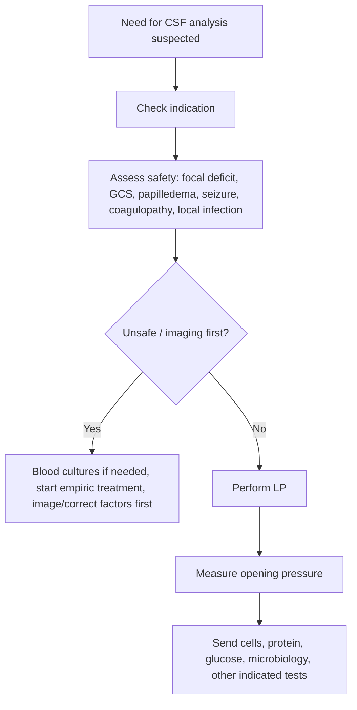
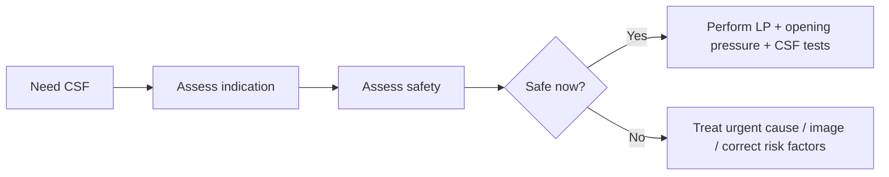

# Lumbar puncture indications and contraindications

Related: [[../Neurology MOC|Neurology MOC]] · [[../Meningitis|Meningitis]] · [[Workup and management]] · [[CSF pattern interpretation in meningitis]] · [[Bacterial meningitis]]

> [!important]
> Lumbar puncture (LP) is a **high-yield diagnostic procedure** in neurology, especially in meningitis, encephalitis, demyelinating disease, inflammatory neuropathies, and selected hemorrhagic/inflammatory disorders. However, an **unsafe LP can precipitate herniation or bleeding complications**.

> [!tip]
> In FCPS/MRCP answers, always state both sides: **why you want the LP** and **when you must delay/avoid it**. A complete answer includes **opening pressure**, **paired serum glucose**, and **imaging first when raised ICP or mass effect is suspected**.

## Learning Objectives
- Explain the indications for lumbar puncture.
- Review spinal meningeal anatomy relevant to the procedure.
- Identify absolute and relative contraindications.
- Apply LP safety principles in suspected meningitis.
- Understand what samples to send and how to avoid common pitfalls.

## Definition
Lumbar puncture is insertion of a needle into the **lumbar subarachnoid space** to obtain CSF, measure opening pressure, and sometimes deliver intrathecal therapy.

## Relevant Neuroanatomy
- Spinal cord usually ends around **L1-L2** in adults.
- LP is usually performed below this level, commonly **L3-L4** or **L4-L5**.
- Layers traversed:
  - skin
  - subcutaneous tissue
  - supraspinous/interspinous ligaments
  - ligamentum flavum
  - epidural space
  - dura
  - arachnoid
  - subarachnoid space
- Important meningeal relationships make LP a CSF, not brain-tissue, sampling procedure.

## Relevant Neurophysiology
- CSF circulates from choroid plexus through ventricles into subarachnoid space.
- Opening pressure reflects CSF pressure at the time of measurement.
- In meningitis and some fungal/TB diseases, pressure may be elevated due to impaired CSF resorption or obstruction.

## Normal Values / Important Cut-offs
- Typical adult opening pressure: roughly **6-20 cm H2O**.
- Very high opening pressure should prompt careful interpretation and clinical concern for raised ICP, severe meningeal inflammation, or CSF outflow obstruction.
- Always interpret CSF glucose with **paired serum glucose**.

## Classification
### Major LP indications
1. suspected meningitis/encephalitis
2. inflammatory/demyelinating CNS disease
3. subarachnoid hemorrhage evaluation in selected CT-negative cases
4. inflammatory neuropathy or other selected neurological investigations
5. therapeutic/intrathecal indications in selected settings

### Contraindication types
1. **Absolute/strong contraindication**
2. **Relative contraindication / delay until corrected**

## Etiology / Why LP is needed
Most common examination contexts:
- acute bacterial meningitis
- TB meningitis
- fungal meningitis
- viral meningitis/encephalitis
- demyelinating disease assessment with CSF oligoclonal bands
- inflammatory neuropathy in broader neurology context

## Risk Factors for LP Complications
- signs of raised ICP or mass lesion
- coagulopathy / thrombocytopenia / anticoagulation
- severe cardiorespiratory instability
- local skin infection at puncture site
- spinal deformity or difficult anatomy

## Pathophysiology
### Why LP can be dangerous in raised ICP
If a patient has a space-occupying lesion or obstructed intracranial pressure gradient, removal of CSF can worsen pressure shifts and theoretically precipitate **brain herniation**.

### Why bleeding matters
Needle passage can cause spinal/epidural bleeding, which is more dangerous in coagulopathy or anticoagulated patients.

## Clinical Features Suggesting Need for LP
- fever, headache, neck stiffness
- photophobia
- altered mental status with CNS infection concern
- subacute meningitic features
- cranial neuropathies with possible TB/fungal meningitis
- diagnostic need for CSF analysis after neurological review

## Approach / Algorithm

## Indications
### Common diagnostic indications
- suspected meningitis when safe
- suspected encephalitis when CSF results will aid diagnosis
- TB/fungal meningitic evaluation
- CSF oligoclonal band assessment in inflammatory demyelinating disease
- selected CT-negative suspected SAH work-up depending protocol and timing

### Practical bedside indication in this chapter
In Chapter 28 neurology, the highest-yield indication is **suspected CNS infection** where CSF will guide diagnosis and treatment.

## Contraindications
### Absolute / major contraindications or do-not-proceed-until-resolved situations
- obvious local infection at puncture site
- severe uncontrolled coagulopathy when risk is unacceptable
- strong suspicion of mass lesion/marked raised ICP with herniation risk until assessed

### Important relative contraindications / reasons to image or delay first
- focal neurological deficit
- markedly depressed consciousness
- papilledema
- recent seizure in the context of suspected mass lesion/raised ICP concern
- known CNS mass or immunocompromised patient where focal lesion is possible
- severe thrombocytopenia or anticoagulation
- severe cardiorespiratory instability

## Investigations Before LP
Depending on context:
- platelet count / coagulation profile if bleeding risk suspected
- blood cultures in suspected bacterial meningitis
- bedside glucose and simultaneous serum glucose planning
- neuroimaging when focal deficit, papilledema, reduced consciousness, or lesion concern exists

## Interpretation Frameworks
### LP safety checklist
1. Why am I doing LP?
2. Is there a safer way or a need to treat before LP?
3. Any focal deficit?
4. Any papilledema?
5. GCS reduced?
6. Any coagulopathy/anticoagulant use?
7. Any local skin infection?
8. Do I need imaging first?

### What to send in suspected meningitis
- opening pressure
- cell count and differential
- protein
- glucose with paired serum glucose
- Gram stain and culture
- organism-specific tests: PCR, TB studies, cryptococcal antigen, etc.

## Diagnosis
LP supports diagnosis of:
- bacterial meningitis
- viral meningitis
- TB/fungal meningitis
- inflammatory CNS disorders

But the **decision to do LP** depends first on indication and safety.

## Differential Diagnosis
When deciding whether LP is needed, consider alternative explanations for symptoms:
- intracranial mass lesion
- intracerebral hemorrhage
- stroke
- metabolic encephalopathy
- migraine or other non-infective headache disorders

## Tables / Comparison Charts
| Situation | LP role | Immediate caution |
|---|---|---|
| Suspected bacterial meningitis | High-value diagnostic test | Do not delay antibiotics if LP is unsafe/delayed |
| Focal deficit + meningism | May still be needed | Often image first |
| Papilledema | LP may be dangerous | Assess cause first |
| Anticoagulated patient | Possible bleeding risk | Correct/review coagulation first |
| Local skin infection | Avoid puncturing through infection | Delay/choose safer strategy |

## Management
### If LP is indicated and safe
- obtain informed procedural explanation if possible
- position properly
- measure opening pressure when relevant
- send correct tubes/tests
- monitor after procedure

### If LP is indicated but unsafe now
- treat urgent disease first (e.g., meningitis antibiotics)
- obtain imaging/correct coagulopathy
- perform LP later if appropriate

## Drug Interactions / Contraindications / Comorbidity Cautions
- Anticoagulants and antiplatelet/bleeding-risk situations require careful assessment.
- In suspected bacterial meningitis, empiric treatment should not be delayed merely to chase a “perfect LP moment.”
- Frail or unstable patients may deteriorate with positioning or delay; stabilize first.

## Procedures / Indications / Contraindications
### Procedure essentials
- patient lateral decubitus or sitting depending purpose and operator preference
- identify iliac crest line to locate L4 level
- aseptic technique
- opening pressure best measured in lateral decubitus position with legs appropriately positioned

## Procedure Mini-Sections
### Opening pressure measurement
- **Indication:** suspected raised ICP, fungal/TB meningitis, diagnostic LP where pressure matters
- **Pearl:** opening pressure is often forgotten in exams and real life; mention it explicitly

### Traumatic tap awareness
- a bloody tap can complicate interpretation
- sequential tube comparison and clinical correlation help

## Complications
- post-LP headache
- local pain
- traumatic tap
- infection introduction
- bleeding/hematoma
- cerebral herniation in unsafe cases
- rarely radicular pain or transient nerve irritation

## Red Flags / Emergencies
- LP considered in patient with focal deficit/papilledema without prior safety assessment
- severe sepsis/meningococcal picture where treatment is delayed for LP
- anticoagulated patient with possible spinal bleeding risk
- very high opening pressure / severe headache / reduced consciousness suggesting dangerous ICP dynamics

## Prognosis
The procedure itself is diagnostic, but correct use improves prognosis by enabling accurate treatment. Wrong timing or unsafe performance can seriously harm the patient.

## Topic Correlation
- [[CSF pattern interpretation in meningitis]]
- [[Bacterial meningitis]]
- [[Tuberculous meningitis]]
- [[Fungal meningitis]]
- [[Empiric antimicrobials and adjunctive steroids]]
- [[Neuroimaging/When CT is first-line in emergency neurology|When CT is first-line in emergency neurology]]

## Special Situations
- **Immunocompromised patients:** lower threshold for imaging before LP if focal lesions/abscess/opportunistic lesions possible.
- **TB/fungal meningitis:** opening pressure and expanded CSF testing are especially important.
- **Children and older adults:** safety principles still apply; ranges and technical issues may vary.

## FCPS/MRCP High-Yield Points
- LP is essential but not automatically safe.
- Think **indications + contraindications + what to send**.
- In suspected meningitis, if LP is delayed/unsafe, **do not delay empiric treatment**.
- Always mention **opening pressure** and **paired serum glucose**.

## Common Viva Questions
- What are the indications for lumbar puncture?
- What are the contraindications?
- When would you image before LP?
- What complications can occur?
- What CSF studies do you request in suspected meningitis?

## Common Confusions / Exam Traps
- assuming LP is always urgent and always safe
- delaying antibiotics too long in meningitis
- forgetting opening pressure
- forgetting paired serum glucose
- ignoring coagulation/anticoagulant status

## Mnemonics
- **SAFE LP**
  - **S**end the right tests
  - **A**ssess contraindications
  - **F**ocal deficit/papilledema → think imaging first
  - **E**mpiric treatment first if unsafe to LP

## Mind Map
- Lumbar puncture
  - indications
    - meningitis
    - inflammatory disease
    - selected SAH work-up
  - safety
    - focal deficit
    - papilledema
    - coagulopathy
    - local infection
  - samples
    - opening pressure
    - cells
    - protein
    - glucose
    - microbiology
  - complications
    - headache
    - bleed
    - herniation

## Flowchart

## Suggested Visuals / Image Notes
- lumbar spine landmark diagram
- LP safety checklist
- tube/tests table for suspected meningitis

## Suggested Video References
- Look for: “lumbar puncture indications contraindications MRCP”
- Look for: “how to perform LP and measure opening pressure”
- Look for: “meningitis LP safety and when to CT first”

## One-Page Revision Summary
- LP is a key neurology diagnostic procedure.
- Main high-yield use here: **suspected meningitis/CNS infection**.
- Do LP if **indicated and safe**.
- Delay/avoid until assessed if there are **focal deficits, papilledema, major reduced consciousness, coagulopathy, local infection, or suspected mass effect**.
- In meningitis, if LP is delayed, **start treatment first**.
- Send **opening pressure, cells, protein, glucose, microbiology**, and pair with **serum glucose**.

## 24-Hour Recall Prompts
- What are the top 5 contraindications or delay triggers for LP?
- When should CT be considered before LP?
- What tests do you send in suspected meningitis?
- Why is opening pressure important?
- Why must empiric treatment not be delayed in unsafe LP situations?

## 7-Day / 15-Day / 30-Day Revision Tracker
- **Day 1:** Reproduce LP safety checklist.
- **Day 7:** List indications and contraindications without notes.
- **Day 15:** Compare safe vs unsafe meningitis scenarios.
- **Day 30:** Answer LP viva questions from memory.

## Must Know / Should Know / Nice to Know
### Must Know
- key indications
- contraindications/delay triggers
- opening pressure
- paired serum glucose
- don’t delay treatment in meningitis

### Should Know
- procedural layers/landmarks
- common complications
- coagulation considerations

### Nice to Know
- detailed therapeutic intrathecal uses outside current scope

## My Weak Points
- Do I remember to mention opening pressure?
- Do I image first when red flags exist?
- Do I delay antibiotics too long waiting for LP?

## Self-Test Scorecard
- Indications recall: __/10
- Contraindications recall: __/10
- Procedural understanding: __/10
- Safety judgment: __/10
- Viva confidence: __/10

## Exam Answer Modes
- **Long answer:** lumbar puncture indications, contraindications, and complications.
- **Short note:** LP in suspected meningitis.
- **Viva:** “When would you not do an immediate LP?”

## Summary
Lumbar puncture is a core neurological diagnostic procedure, especially in meningitis. The key exam skill is balancing **diagnostic value** against **safety**: know the indications, recognize contraindications, measure opening pressure, send the right tests, and never delay urgent antimicrobial treatment just because LP is temporarily unsafe.

## MCQs (10)
1. A key indication for lumbar puncture in neurology is:
   - A. Suspected meningitis
   - B. Simple osteoarthritis
   - C. Cataract
   - D. Psoriasis
   - E. Varicose veins

2. A major reason to delay or reconsider LP is:
   - A. Focal neurological deficit with raised ICP concern
   - B. Normal appetite
   - C. Mild dandruff
   - D. Presbyopia
   - E. Stable eczema

3. The usual adult site for LP is below the conus medullaris, commonly:
   - A. Cervical level
   - B. L3-L4 or L4-L5
   - C. Thoracic apex
   - D. Sacroiliac joint only
   - E. Skull base

4. A major catastrophic complication of unsafe LP is:
   - A. Brain herniation
   - B. Otitis externa
   - C. Alopecia
   - D. Cataract
   - E. Gingivitis

5. Which should be paired with CSF glucose interpretation?
   - A. Serum glucose
   - B. Uric acid only
   - C. Ferritin only
   - D. Vitamin D only
   - E. Peak flow

6. Which parameter is often forgotten but important during LP in meningitis?
   - A. Opening pressure
   - B. Shoe size
   - C. Hair length
   - D. Visual acuity only
   - E. Handedness only

7. In suspected bacterial meningitis, if LP is delayed because of safety concerns, the next best principle is:
   - A. Delay all treatment
   - B. Start empiric treatment and assess further
   - C. Ignore infection
   - D. Wait 24 hours before any action
   - E. Give no antibiotics until CSF is obtained

8. Which is a common complication of LP even when safely performed?
   - A. Post-LP headache
   - B. Parkinson disease
   - C. BPPV
   - D. Bell palsy
   - E. Cataract

9. Which finding is a strong contraindication to puncturing through the site?
   - A. Local skin infection
   - B. Myopia
   - C. Dry skin elsewhere
   - D. Tinnitus
   - E. Old ankle sprain

10. Which statement about LP is correct?
   - A. It is always safe in all meningitis cases
   - B. It should never be done in neurology
   - C. It is valuable when indicated but requires safety assessment first
   - D. It replaces neuroimaging
   - E. It is only therapeutic, never diagnostic

## SBA Questions (10)
1. A 25-year-old man has fever, neck stiffness, and photophobia. He is alert, has no focal deficit, and no papilledema is suspected clinically. What is the best next principle?
   - A. LP is likely indicated if clinically safe
   - B. LP is absolutely contraindicated in meningitis
   - C. No tests are needed
   - D. Diagnose migraine only
   - E. Discharge immediately

2. A confused patient with suspected meningitis has focal weakness and low GCS. What is the best management principle regarding LP?
   - A. Perform LP immediately without assessment
   - B. Assess safety first, often image before LP, and start treatment promptly
   - C. Never treat infection
   - D. Ignore the focal deficit
   - E. Only send urine tests

3. A patient undergoing LP for meningitis work-up should have which additional paired blood test?
   - A. Serum glucose
   - B. Serum iron only
   - C. Uric acid only
   - D. ANA only
   - E. PSA only

4. Why is opening pressure particularly useful?
   - A. It helps assess CSF pressure, especially in severe meningeal disease
   - B. It replaces all CSF studies
   - C. It diagnoses Parkinson disease
   - D. It measures blood pressure directly
   - E. It is never relevant

5. Which finding is most concerning for LP-related herniation risk?
   - A. Papilledema with focal deficit and reduced consciousness
   - B. Mild nausea only
   - C. Dry cough
   - D. Mild acne
   - E. Presbyopia

6. A patient on anticoagulation is considered for LP. What is the best principle?
   - A. Ignore anticoagulation status
   - B. Assess bleeding risk carefully before proceeding
   - C. It has no relevance
   - D. Proceed without any thought
   - E. LP is now therapeutic only

7. Which CSF studies are core in suspected meningitis?
   - A. Cells, protein, glucose, microbiology, opening pressure
   - B. Hair analysis only
   - C. Spirometry only
   - D. Audiogram only
   - E. Bone densitometry only

8. A patient with suspected CNS infection has unstable oxygenation and shock. What is the best LP principle?
   - A. Stabilize first; LP is not the first priority over ABC
   - B. Do LP before airway support
   - C. Ignore instability
   - D. No treatment is required
   - E. Only check visual fields

9. Which complication is common but usually less dangerous than herniation?
   - A. Post-LP headache
   - B. Hemianopia
   - C. Bell palsy
   - D. BPPV
   - E. Dystonia

10. What is the best summary statement?
   - A. LP is useful when indicated, but safety assessment and timing are critical
   - B. LP should replace all clinical judgment
   - C. LP is never needed in neurology
   - D. LP is only done for curiosity
   - E. LP is always delayed until all treatment ends

## Flashcards
- Q: What is the commonest high-yield indication for LP in this chapter?
  A: Suspected meningitis/CNS infection.
- Q: Name two major red flags before immediate LP.
  A: Focal neurological deficit and papilledema/raised ICP concern.
- Q: Where is LP usually performed in adults?
  A: Below the conus, commonly L3-L4 or L4-L5.
- Q: What paired blood test should accompany CSF glucose?
  A: Serum glucose.
- Q: What important LP measurement is often forgotten?
  A: Opening pressure.
- Q: What is the major catastrophic complication of unsafe LP?
  A: Brain herniation.
- Q: What should you do if LP is delayed in suspected bacterial meningitis?
  A: Start empiric treatment promptly.
- Q: Name a common minor complication of LP.
  A: Post-LP headache.
- Q: Why does anticoagulation matter before LP?
  A: Because of spinal bleeding/hematoma risk.
- Q: What local skin issue contraindicates puncturing through the site?
  A: Infection at the puncture site.

## Answer Key with Explanations
### MCQs
1. **A** — suspected meningitis is a classic indication.
2. **A** — focal deficits may imply mass effect/raised ICP risk.
3. **B** — LP is usually done below the conus at lower lumbar levels.
4. **A** — unsafe LP can precipitate herniation.
5. **A** — paired serum glucose is essential.
6. **A** — opening pressure is high yield and often forgotten.
7. **B** — treatment should not be delayed if LP is unsafe.
8. **A** — post-LP headache is common.
9. **A** — puncturing through infected skin is unsafe.
10. **C** — that is the correct balanced statement.

### SBAs
1. **A** — this is a typical situation where LP is often appropriate if safe.
2. **B** — safety assessment and early treatment are both essential.
3. **A** — serum glucose must be paired with CSF glucose.
4. **A** — opening pressure helps interpret CSF dynamics.
5. **A** — this cluster strongly raises concern for unsafe immediate LP.
6. **B** — bleeding risk must be reviewed carefully.
7. **A** — these are the core CSF studies in meningitis.
8. **A** — ABC stabilization takes priority.
9. **A** — post-LP headache is common and important to know.
10. **A** — timing, indication, and safety are the core principles.