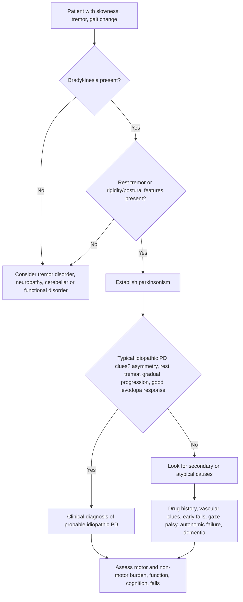
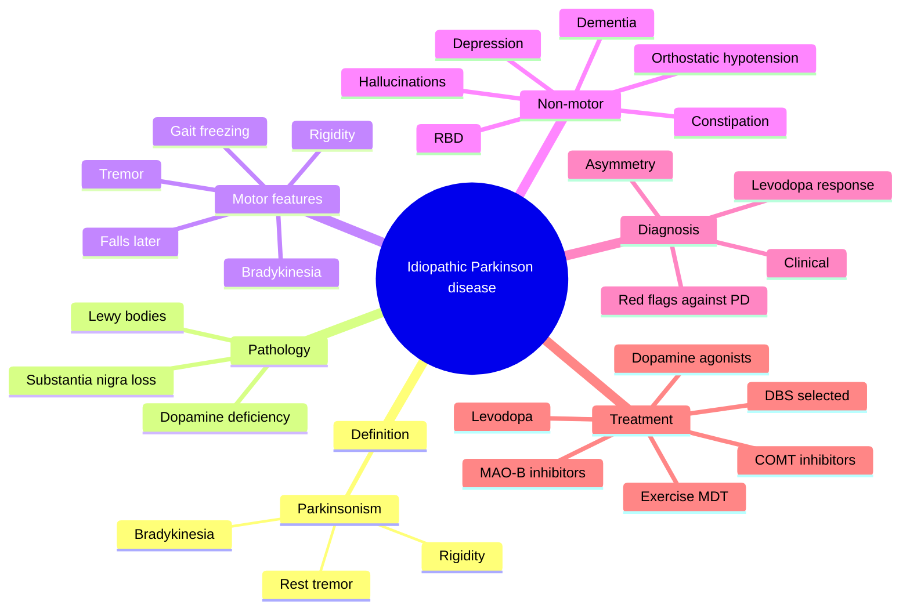

# Idiopathic Parkinson disease

Related: [[../Neurology MOC|Neurology MOC]] · [[../Movement Disorders|Movement Disorders]] · [[Parkinsonism]] · [[Drug-induced parkinsonism]] · [[Atypical parkinsonian syndromes]]

> [!important]
> Idiopathic Parkinson disease is a **progressive neurodegenerative disorder** characterized clinically by **bradykinesia** plus **rest tremor**, **rigidity**, and later **postural instability**, with many important **non-motor features** including constipation, REM sleep behavior disorder, anosmia, depression, autonomic dysfunction, cognitive impairment, and psychosis.

> [!tip]
> In FCPS/MRCP answers, score highly by clearly separating **idiopathic Parkinson disease** from **secondary/drug-induced parkinsonism** and **atypical parkinsonian syndromes**. A complete answer covers **motor + non-motor symptoms**, **diagnosis is clinical**, **response to levodopa**, **red flags against PD**, and **long-term treatment complications**.

## Learning Objectives
- Define idiopathic Parkinson disease and the clinical syndrome of parkinsonism.
- Describe the basal ganglia anatomy and dopaminergic physiology relevant to movement control.
- Explain the pathological basis: substantia nigra degeneration and alpha-synuclein/Lewy body disease.
- Recognize typical motor and non-motor clinical features.
- Distinguish idiopathic Parkinson disease from drug-induced and atypical parkinsonism.
- Plan investigations and explain why diagnosis is mainly clinical.
- Outline staged management, drug complications, counseling points, and advanced therapy options.
- Identify red flags, complications, and emergency-related scenarios in Parkinson disease.

## Definition
**Parkinsonism** is a clinical syndrome defined by **bradykinesia** with at least one of:
- rest tremor
- muscular rigidity
- postural instability/gait disorder

**Idiopathic Parkinson disease (PD)** is the commonest cause of parkinsonism and is a **degenerative synucleinopathy** due to progressive loss of **dopaminergic neurons in the substantia nigra pars compacta**, producing dysfunction of basal ganglia circuits.

## Relevant Neuroanatomy
### Basal ganglia structures
Key structures relevant to Parkinson disease:
- **striatum** = caudate nucleus + putamen
- **globus pallidus**: external (GPe) and internal (GPi) segments
- **substantia nigra**:
  - pars compacta: dopaminergic neurons
  - pars reticulata: output nucleus functionally similar to GPi
- **subthalamic nucleus (STN)**
- thalamus and motor cortex connections

### Functional loops
Basal ganglia influence:
- initiation of voluntary movement
- scaling/amplitude of movement
- automatic movements such as arm swing
- learned motor programs
- some cognitive and limbic functions

### Clinical localization logic
The key lesion in idiopathic PD is degeneration of the **nigrostriatal pathway**.
This causes:
- reduced facilitation of movement through the **direct pathway**
- increased inhibition of movement through the **indirect pathway**
- excessive inhibitory output from GPi/SNr to the thalamus
- reduced cortical motor activation

Result: **hypokinetic movement disorder** with slowness, reduced movement amplitude, and difficulty initiating movement.

## Relevant Neurophysiology
### Normal physiology
Dopamine from substantia nigra pars compacta acts on striatal receptors:
- **D1 receptor effect**: facilitates the **direct pathway**, promoting movement
- **D2 receptor effect**: inhibits the **indirect pathway**, also promoting movement

So overall, **dopamine normally promotes smooth voluntary movement**.

### Parkinson physiology
Loss of dopamine causes:
- underactivity of direct pathway
- overactivity of indirect pathway
- excessive thalamic inhibition
- reduced motor cortex drive

This explains:
- **bradykinesia**: slowness and reduced amplitude of repetitive movement
- **rigidity**: increased tone from abnormal central motor regulation
- **rest tremor**: oscillatory activity in basal ganglia-thalamo-cortical circuits
- **postural/gait problems**: impaired automatic postural adjustment and gait patterning

### Non-motor physiology
PD is not only a motor disease. Pathology can involve:
- olfactory pathways → anosmia
- autonomic nervous system → constipation, orthostatic hypotension, urinary dysfunction
- sleep-regulating brainstem circuits → REM sleep behavior disorder
- limbic/cortical circuits → depression, apathy, cognitive decline, hallucinations later

## Important Values / Cut-offs / Exam Facts
- Typical age of onset: usually **>55 years**, but younger-onset cases occur.
- A good clinical diagnosis requires **bradykinesia** plus a cardinal additional sign.
- **Asymmetrical onset** strongly supports idiopathic PD.
- **Rest tremor frequency** is classically about **4-6 Hz**.
- **Levodopa response** supports idiopathic PD, though not absolutely specific.
- Early **falls**, early **autonomic failure**, early **dementia**, or **poor levodopa response** are important red flags against straightforward idiopathic PD.

## Classification
### 1. By underlying syndrome
1. **Idiopathic Parkinson disease**
2. **Secondary parkinsonism**
   - drug-induced
   - vascular
   - toxin-related
   - post-encephalitic or structural
3. **Atypical parkinsonian syndromes**
   - multiple system atrophy (MSA)
   - progressive supranuclear palsy (PSP)
   - corticobasal syndrome/degeneration
   - dementia with Lewy bodies (DLB)

### 2. By clinical predominance in PD
- tremor-dominant PD
- akinetic-rigid PD
- mixed phenotype

### 3. By stage/severity
- early disease with mild unilateral/asymmetrical symptoms
- established disease with bilateral involvement and functional limitation
- advanced disease with motor fluctuations, dyskinesias, falls, and prominent non-motor burden

## Epidemiology / Risk Factors
- increasing age
- male sex slightly more common
- family history in some cases
- genetic susceptibility in selected patients
- possible environmental contributors such as pesticide exposure

Exam point:
- Most PD is **sporadic**, but monogenic forms exist, especially in younger onset.

## Pathology and Pathophysiology
### Core pathology
- degeneration of dopaminergic neurons in **substantia nigra pars compacta**
- loss of nigral pigmentation
- **Lewy bodies** and **Lewy neurites** containing **alpha-synuclein**

### Pathophysiological consequences
1. dopamine depletion in the striatum
2. disordered direct and indirect basal ganglia pathways
3. impaired movement initiation and automaticity
4. progressive spread of pathology to non-motor pathways

### Why symptoms evolve over time
Early disease may be dominated by one-sided tremor or slowness. Later:
- bilateral motor symptoms appear
- gait freezing and falls become more likely
- fluctuations in response to medication develop
- non-motor complications become major causes of disability

## Causes / Etiology
Idiopathic PD is considered **multifactorial**:
- age-related neurodegeneration
- genetic predisposition
- protein misfolding/alpha-synuclein aggregation
- mitochondrial dysfunction and oxidative stress
- impaired protein clearance mechanisms
- possible environmental exposures

## Clinical Features
## Core motor features
### Bradykinesia
Most important diagnostic feature.
Clinical clues:
- slowed initiation of voluntary movement
- reduced spontaneous movement
- decreasing amplitude on repetitive tapping
- difficulty with fine motor tasks: buttoning, writing, shaving
- micrographia
- hypomimia (masked facies)
- reduced blink rate
- monotonous or hypophonic speech

### Rest tremor
Typical features:
- present at rest, reduced by action
- often unilateral initially
- classic “pill-rolling” tremor of fingers/thumb
- may re-emerge on posture after a delay

### Rigidity
- increased tone throughout range of movement
- “lead-pipe” rigidity
- “cogwheel” rigidity when tremor overlays rigidity
- can cause shoulder pain or limb aching early

### Postural instability and gait disorder
Usually later than bradykinesia/tremor.
Features:
- stooped posture
- reduced arm swing
- short shuffling steps
- difficulty turning
- festination
- freezing of gait, especially at doorways or when turning
- impaired balance and falls

## Other motor manifestations
- drooling due to impaired swallowing and reduced automatic swallowing
- difficulty rising from chair
- impaired dexterity
- dystonic toe curling or painful foot posturing, often early morning/off state
- seborrheic facies may be seen

## Non-motor symptoms
These are common and exam-important.

### Neuropsychiatric
- depression
- anxiety
- apathy
- hallucinations, usually visual and often treatment-related in later disease
- cognitive impairment and dementia in advanced disease

### Sleep-related
- insomnia
- fragmented sleep
- excessive daytime sleepiness
- **REM sleep behavior disorder**
- restless legs symptoms in some patients

### Autonomic
- constipation
- urinary urgency/frequency
- nocturia
- orthostatic hypotension
- erectile dysfunction
- sweating abnormalities

### Sensory / miscellaneous
- anosmia or hyposmia
- pain
- fatigue
- weight loss in advanced disease
- dysphagia

## Prodromal clues
Features that may precede motor disease by years:
- constipation
- anosmia
- REM sleep behavior disorder
- depression/anxiety

## Typical examination findings
- asymmetrical onset/signs
- masked face
- soft monotonous speech
- rest tremor
- cogwheel rigidity
- bradykinesia on finger tapping/hand opening/heel tapping
- reduced arm swing while walking
- stooped flexed posture
- en bloc turning
- shuffling gait
- postural instability in later disease

## Approach / Diagnostic Algorithm

## Diagnostic Approach
### Step 1: confirm parkinsonism
You need **bradykinesia** plus one or more of:
- rest tremor
- rigidity
- postural/gait features

### Step 2: identify features favoring idiopathic PD
Strong supporting clues:
- **insidious onset**
- **slow progression**
- **asymmetrical onset**
- **rest tremor**
- clear **benefit from levodopa/dopaminergic therapy**
- development of motor fluctuations/dyskinesia later in disease also supports PD biology

### Step 3: exclude alternative diagnoses
Look for:
- dopamine-blocking drugs
- stroke history with lower-body gait-predominant disorder
- atypical red flags such as early falls, gaze palsy, severe dysautonomia, pyramidal/cerebellar signs, or very poor levodopa response

## Red Flags Against Straightforward Idiopathic PD
These suggest an atypical or secondary syndrome:
- rapid progression
- symmetrical onset from the beginning
- absent rest tremor throughout course
- repeated early falls
- early severe autonomic failure
- early urinary incontinence or severe orthostatic hypotension
- supranuclear gaze palsy, especially downward gaze limitation
- early bulbar dysfunction
- prominent cerebellar signs
- pyramidal signs not otherwise explained
- marked early dementia or hallucinations before treatment
- poor or absent response to adequate levodopa trial

## Differential Diagnosis
### Secondary parkinsonism
- [[Drug-induced parkinsonism]]
- vascular parkinsonism
- normal-pressure hydrocephalus
- toxin exposure
- post-encephalitic/structural basal ganglia lesions

### Atypical degenerative parkinsonism
- [[Atypical parkinsonian syndromes]]
- dementia with Lewy bodies
- PSP
- MSA
- corticobasal syndrome

### Conditions mistaken for PD
- essential tremor
- depression with psychomotor slowing
- frailty / musculoskeletal gait disorder
- cervical myelopathy or peripheral neuropathy causing slow gait
- functional movement disorder

## Differentiating Parkinson Disease From Common Mimics
### 1. PD vs essential tremor
PD:
- rest tremor
- bradykinesia/rigidity present
- reduced arm swing
- micrographia

Essential tremor:
- action/postural tremor predominates
- no true bradykinesia or rigidity
- head/voice tremor may occur
- handwriting may be tremulous rather than micrographic

### 2. PD vs drug-induced parkinsonism
PD:
- asymmetrical onset common
- rest tremor common
- progressive course
- may precede exposure or persist after drug withdrawal

Drug-induced:
- often symmetrical
- temporal relation to dopamine-blocking drugs
- less tremor, more rigidity/bradykinesia
- may improve after stopping culprit drug

### 3. PD vs atypical parkinsonian syndromes
Idiopathic PD usually has:
- better levodopa response
- more classic rest tremor
- slower progression early on
- later rather than early falls/autonomic failure/cognitive failure

## Investigations
## Core principle
Diagnosis is **primarily clinical**. No routine blood test confirms PD.

### Basic tests often done to exclude mimics/comorbidity
- CBC
- glucose
- renal function/electrolytes
- liver function
- thyroid function if clinically indicated
- B12 if neuropathy/cognitive issues coexist

### Neuroimaging
#### MRI brain or CT brain
Usually done when:
- presentation is atypical
- focal neurological signs suggest another lesion
- vascular parkinsonism is suspected
- normal-pressure hydrocephalus is a concern

Imaging in idiopathic PD may be normal or show only age-related changes.

#### Dopaminergic functional imaging
A dopamine transporter scan may support presynaptic dopaminergic deficit in uncertain cases, but it is **not required for routine diagnosis** and does not reliably distinguish idiopathic PD from atypical degenerative parkinsonism.

### Other tests in selected cases
- formal neuropsychological assessment if cognition is uncertain
- autonomic testing if severe dysautonomia suspected
- swallow assessment when dysphagia or aspiration risk exists

## Interpretation Frameworks
### 1. Tremor-dominant older patient
Think idiopathic PD if there is:
- unilateral rest tremor
- reduced arm swing
- masked facies
- bradykinesia on repetitive tasks

### 2. Slow gait with no tremor
Could still be PD, but ask:
- is there true bradykinesia?
- is rigidity present?
- any frontal gait, lower-body predominance, vascular history, NPH clues, neuropathy, or musculoskeletal limitation?

### 3. Parkinsonism with hallucinations
Interpret carefully:
- late visual hallucinations after dopaminergic therapy can occur in PD
- very early dementia/hallucinations suggest Lewy body spectrum or another diagnosis
- infection, metabolic disturbance, and polypharmacy may precipitate delirium

### 4. Poor response to levodopa
Consider:
- underdosing or poor adherence
- impaired absorption due to protein timing/gastroparesis
- wrong diagnosis, especially atypical or vascular parkinsonism
- advanced axial symptoms that respond less well than limb bradykinesia

## Diagnosis
A practical diagnosis of idiopathic PD is made clinically when there is:
1. **parkinsonism**: bradykinesia plus rest tremor and/or rigidity
2. gradual progressive course
3. no better alternative explanation
4. supportive features such as asymmetry and dopaminergic response

## Management Overview
Goals:
- improve function and quality of life
- control motor symptoms
- manage non-motor symptoms
- reduce falls and aspiration risk
- minimize treatment complications
- support long-term independence and caregiver burden

Management is individualized according to:
- age
- symptom severity
- cognitive status
- occupation and lifestyle
- falls risk
- presence of tremor vs bradykinesia
- non-motor burden

## Non-Pharmacological Management
- explain chronic progressive nature of disease
- encourage regular exercise and mobility training
- physiotherapy for gait, posture, balance, cueing, freezing strategies
- occupational therapy for activities of daily living and home safety
- speech and language therapy for hypophonia and swallowing issues
- nutrition advice, especially constipation, hydration, and protein timing where relevant
- falls assessment and home hazard reduction
- psychosocial support for patient and family

Exam point:
- Multidisciplinary care is a major long-term management principle.

## Pharmacological Management
## When to start treatment
Treat when symptoms impair:
- work
- walking and transfers
- hand function
- social participation
- quality of life

### Main drug classes
1. **Levodopa** with peripheral decarboxylase inhibitor
2. **Dopamine agonists**
3. **MAO-B inhibitors**
4. **COMT inhibitors** as adjuncts to levodopa
5. **Amantadine**
6. **Anticholinergics** in selected younger tremor-predominant cases

## Levodopa
### Why it is important
Levodopa is the **most effective symptomatic treatment** for bradykinesia and rigidity.
It is given with a peripheral decarboxylase inhibitor such as carbidopa/benserazide to reduce peripheral conversion and adverse effects.

### Benefits
- strongest symptomatic motor benefit
- improves slowness, rigidity, gait more than most alternatives
- useful in older adults where adverse effects of agonists are less desirable

### Adverse effects / cautions
- nausea
- postural hypotension
- confusion/hallucinations, especially elderly or cognitively vulnerable patients
- dyskinesias with long-term use
- motor fluctuations: wearing-off, on-off phenomena

### Practical exam points
- levodopa is often preferred in **older patients** or when symptom control is clearly needed.
- long-term complications reflect disease progression plus pulsatile dopaminergic stimulation.

## Dopamine agonists
Examples include pramipexole, ropinirole, rotigotine.

### Role
- may be used in earlier disease, often in younger patients
- may reduce need for higher levodopa doses initially
- useful adjunct in wearing-off

### Important cautions
- nausea, edema, somnolence
- hallucinations/confusion
- **impulse control disorders**: gambling, hypersexuality, binge eating, compulsive shopping
- sudden sleep attacks

Exam point:
- Always mention counseling regarding **impulse control disorders**.

## MAO-B inhibitors
Examples: selegiline, rasagiline, safinamide.

### Role
- mild symptomatic benefit in early disease
- adjunctive use for fluctuations in established disease

### Cautions
- insomnia with some agents
- interactions with serotonergic or sympathomimetic drugs should be considered clinically

## COMT inhibitors
Examples: entacapone, opicapone.

### Role
- adjuncts to **levodopa** to prolong its effect
- useful in end-of-dose wearing-off

### Cautions
- dyskinesia may worsen because more levodopa reaches brain
- diarrhea may occur
- not useful without levodopa

## Amantadine
### Role
- modest benefit for parkinsonian symptoms in some patients
- useful for **levodopa-induced dyskinesia**

### Cautions
- ankle edema
- livedo reticularis
- confusion/hallucinations in older patients

## Anticholinergics
### Role
- occasionally used in **younger tremor-predominant** patients

### Why usually avoided
- cognitive adverse effects
- dry mouth, urinary retention, constipation, blurred vision
- poor choice in elderly

## Motor Complications of Therapy
### Wearing-off
Symptoms recur before next levodopa dose.
Management options:
- smaller more frequent levodopa doses
- add COMT inhibitor
- add MAO-B inhibitor
- add dopamine agonist

### On-off fluctuations
- unpredictable changes between mobility and immobility
- more difficult in advanced disease

### Dyskinesias
- choreiform or dystonic involuntary movements, often at peak dose
- related to chronic levodopa exposure and disease progression

Management approaches:
- adjust levodopa schedule
- reduce individual levodopa peaks if possible
- add/optimize adjuncts
- consider amantadine
- consider advanced therapies in selected patients

## Management of Non-Motor Symptoms
### Depression/anxiety
- screen actively
- treat with psychological support and appropriate medication when needed

### Psychosis/hallucinations
- review for infection, dehydration, metabolic causes
- simplify offending drugs if possible, often in order of least benefit/highest psychosis burden
- avoid abrupt withdrawal of all dopaminergic treatment

### Dementia/cognitive decline
- assess cognition formally when function declines
- support caregivers and safety planning

### Constipation
- fluids, fiber if appropriate, exercise
- laxatives when required

### Orthostatic hypotension
- hydration, slow positional change
- review contributing drugs
- compression and pharmacological measures in selected cases

### Dysphagia
- swallowing assessment
- texture modification and aspiration prevention where necessary

### Sleep disorders
- ask specifically about REM sleep behavior disorder and daytime somnolence
- review sedating/agonist medications

## Advanced Therapies
These may be considered in carefully selected patients with severe fluctuations/dyskinesias despite optimized oral therapy.

Options include:
- deep brain stimulation (DBS)
- levodopa intestinal infusion systems where available
- continuous apomorphine infusion in selected settings

### DBS: exam-oriented principles
Best considered when there is:
- clear levodopa-responsive motor disease
- disabling motor fluctuations or dyskinesias
- no major uncontrolled psychiatric disease or severe dementia

DBS is **not** a cure and is less effective for severe axial symptoms, dementia, or atypical parkinsonism.

## Management Cautions and Prescribing Pearls
> [!warning]
> Never stop dopaminergic medication abruptly in a dependent Parkinson patient unless there is a compelling specialist reason. Sudden withdrawal can precipitate severe akinesia and a hyperpyrexia-rigidity syndrome.

Important cautions:
- avoid or minimize **dopamine-blocking drugs** when possible:
  - metoclopramide
  - prochlorperazine
  - typical antipsychotics
- if an antiemetic is needed, choose options compatible with PD practice where available
- be cautious with **dopamine agonists** in patients with psychosis, somnolence risk, or impulse control vulnerability
- **anticholinergics** are usually poor choices in elderly or cognitively impaired patients
- treat constipation and orthostatic hypotension proactively because they worsen function and drug tolerance
- consider protein timing if levodopa response is inconsistent due to competition with dietary amino acids
- hospital inpatients with PD need **timely medication administration**; delayed doses can cause major deterioration

## Complications of Parkinson Disease
### Disease-related
- falls and fractures
- aspiration pneumonia
- malnutrition and weight loss
- pressure sores/immobility in advanced disease
- urinary complications
- constipation and fecal impaction
- dementia
- depression and caregiver burnout

### Treatment-related
- motor fluctuations
- dyskinesias
- hallucinations and psychosis
- orthostatic hypotension
- impulse control disorders
- daytime somnolence / sudden sleep episodes

## Red Flags / Urgent Scenarios
### 1. Sudden marked immobility, fever, rigidity
Think of **parkinsonism-hyperpyrexia syndrome** or severe medication withdrawal state.
Actions:
- urgent hospital assessment
- search for medication interruption, infection, dehydration
- restore dopaminergic therapy and supportive care

### 2. Recurrent falls early in disease
- rethink diagnosis: PSP, MSA, vascular disease, neuropathy, NPH, frailty

### 3. New delirium/hallucinations
- look for infection, urinary retention, constipation, medication toxicity, dehydration, metabolic disturbance

### 4. Dysphagia / choking / recurrent chest infection
- aspiration risk is high
- urgent swallowing review may be needed

### 5. Severe orthostatic hypotension or syncope
- review drugs and autonomic failure
- consider atypical parkinsonism if early/prominent

## Special Situations
### Young-onset Parkinson disease
- more concern about long-term motor complications
- dopamine agonists may be considered earlier in selected patients
- dystonia and fluctuation complications may be more prominent over time

### Elderly frail patient
- levodopa often preferred because it is effective and agonists/anticholinergics are poorly tolerated
- monitor cognition, psychosis, falls, postural hypotension

### Parkinson disease in hospital
High-yield inpatient rules:
- give antiparkinson medication **on time**
- avoid contraindicated dopamine blockers
- ask about swallowing ability
- watch for delirium, aspiration, constipation, urinary retention

### Tremor-predominant disease
- dopaminergic therapy helps some patients
- if action/postural tremor dominates without bradykinesia, reconsider essential tremor

## Prognosis
Idiopathic PD is chronic and progressive.
Typical course:
- gradual worsening over years
- good early symptomatic response to treatment in many patients
- later disability increasingly driven by gait impairment, falls, cognitive decline, dysphagia, and autonomic dysfunction rather than tremor alone

Mortality often relates indirectly to complications such as:
- aspiration pneumonia
- falls/fractures
- immobility-related complications

## FCPS/MRCP High-Yield Pearls
- **Bradykinesia is essential** for the diagnosis of parkinsonism.
- The classic triad is **bradykinesia, rigidity, and rest tremor**; postural instability tends to be later.
- Idiopathic PD usually begins **asymmetrically**.
- Diagnosis is mainly **clinical**.
- **Levodopa** gives the best symptomatic benefit.
- Long-term therapy causes **wearing-off** and **dyskinesias**.
- Prominent early **falls**, **severe dysautonomia**, **supranuclear gaze palsy**, or **poor levodopa response** suggest an atypical syndrome.
- Never forget **non-motor symptoms**: constipation, depression, RBD, orthostatic hypotension, hallucinations, dementia.
- Avoid **metoclopramide/prochlorperazine/typical antipsychotics** in PD patients where possible.
- **Impulse control disorders** are classically linked to dopamine agonists.

## One-Page Summary
### Definition
Idiopathic Parkinson disease is a **progressive synucleinopathy** due to degeneration of **substantia nigra dopaminergic neurons**, producing **parkinsonism** and many non-motor symptoms.

### Cardinal motor syndrome
Diagnosis of parkinsonism requires **bradykinesia** plus one or more of:
- rest tremor
- rigidity
- postural/gait disorder

### Supportive features for idiopathic PD
- asymmetrical onset
- rest tremor
- slow progression
- good levodopa response
- later motor fluctuations/dyskinesias

### Pathology
- substantia nigra pars compacta degeneration
- alpha-synuclein **Lewy bodies**
- dopamine deficiency in striatum

### Motor features
- bradykinesia
- rest tremor
- rigidity
- shuffling gait, reduced arm swing
- freezing and postural instability later

### Non-motor features
- constipation
- anosmia
- REM sleep behavior disorder
- depression/anxiety
- orthostatic hypotension
- urinary symptoms
- hallucinations and cognitive decline later

### Differentials / red flags
Think against idiopathic PD if there is:
- early falls
- early severe autonomic failure
- supranuclear gaze palsy
- cerebellar/pyramidal signs
- marked early dementia
- poor levodopa response
- symmetrical onset or culprit dopamine-blocking drug

### Investigations
- diagnosis is clinical
- MRI/CT if atypical or alternative cause suspected
- DAT-type imaging only when uncertainty remains

### Treatment
- exercise + MDT care
- **levodopa** = most effective symptomatic drug
- dopamine agonists, MAO-B inhibitors, COMT inhibitors, amantadine as appropriate
- advanced therapies for selected fluctuating patients

### Major treatment complications
- wearing-off
- on-off fluctuations
- dyskinesias
- hallucinations/psychosis
- orthostatic hypotension
- impulse control disorders with dopamine agonists

### Practical cautions
- do not stop dopaminergic therapy abruptly
- avoid dopamine-blocking antiemetics/antipsychotics where possible
- give medications on time in hospital
- assess falls, dysphagia, cognition, constipation, caregiver burden

## Mermaid Mind Map

## MCQs
### MCQ 1
The **essential** clinical feature required to diagnose parkinsonism is:
A. Rest tremor  
B. Rigidity  
C. Bradykinesia  
D. Postural instability  

### MCQ 2
The pathological hallmark most associated with idiopathic Parkinson disease is:
A. Amyloid plaques in hippocampus  
B. Alpha-synuclein Lewy bodies  
C. Demyelination in dorsal columns  
D. Purkinje cell loss only  

### MCQ 3
Which feature most strongly supports idiopathic Parkinson disease over drug-induced parkinsonism?
A. Symmetrical onset  
B. Early urinary incontinence  
C. Asymmetrical rest tremor  
D. Poor levodopa response  

### MCQ 4
Which drug class is most associated with **impulse control disorders** in Parkinson disease?
A. COMT inhibitors  
B. Dopamine agonists  
C. Anticholinergics  
D. MAO-B inhibitors only  

### MCQ 5
A typical parkinsonian rest tremor classically occurs at about:
A. 1-2 Hz  
B. 4-6 Hz  
C. 8-10 Hz  
D. 12-14 Hz  

### MCQ 6
Which of the following is a common **non-motor** feature of Parkinson disease?
A. Hyperreflexia as the main sign  
B. Constipation  
C. Optic neuritis  
D. Saddle anesthesia  

### MCQ 7
The most effective symptomatic treatment for bradykinesia and rigidity in Parkinson disease is:
A. Levodopa  
B. Acetazolamide  
C. Haloperidol  
D. Carbamazepine  

### MCQ 8
Which feature is a red flag **against** straightforward idiopathic Parkinson disease?
A. Unilateral onset  
B. Slow progression  
C. Early recurrent falls  
D. Reduced arm swing  

### MCQ 9
Which medication should generally be avoided in a patient with Parkinson disease because it can worsen parkinsonism?
A. Metoclopramide  
B. Lactulose  
C. Levodopa  
D. Entacapone  

### MCQ 10
Wearing-off in Parkinson disease refers to:
A. Permanent cure after treatment  
B. Return of symptoms before the next levodopa dose  
C. Acute stroke due to PD  
D. Total resistance to all therapy from diagnosis  

## MCQ Answer Key
1. **C** — Bradykinesia is required to diagnose parkinsonism.  
2. **B** — Lewy bodies containing alpha-synuclein are characteristic.  
3. **C** — Asymmetrical rest tremor strongly favors idiopathic PD.  
4. **B** — Dopamine agonists are linked to impulse control disorders.  
5. **B** — Rest tremor is classically 4-6 Hz.  
6. **B** — Constipation is a common non-motor feature.  
7. **A** — Levodopa is the most effective symptomatic drug.  
8. **C** — Early falls suggest atypical parkinsonism such as PSP.  
9. **A** — Metoclopramide blocks dopamine and may worsen PD.  
10. **B** — Wearing-off means loss of benefit before the next dose.  

## SBAs
### SBA 1
A 67-year-old man develops a slowly progressive unilateral resting tremor of the right hand, reduced right arm swing, micrographia, and cogwheel rigidity. Which diagnosis is most likely?
A. Essential tremor  
B. Idiopathic Parkinson disease  
C. Cerebellar disease  
D. Motor neuron disease  
E. Myasthenia gravis  

### SBA 2
A 72-year-old woman with known Parkinson disease develops vivid visual hallucinations and confusion over 2 days. Which is the **best initial step**?
A. Double the levodopa dose immediately  
B. Look for infection, dehydration, constipation, and medication triggers  
C. Start high-dose haloperidol  
D. Stop all antiparkinson drugs abruptly  
E. Reassure only  

### SBA 3
A 60-year-old man with newly diagnosed Parkinson disease is started on a dopamine agonist. Which adverse effect requires specific counseling?
A. Ototoxicity  
B. Impulse control disorder  
C. Gingival hyperplasia  
D. Pancreatitis  
E. Hemarthrosis  

### SBA 4
A 74-year-old patient presents with bradykinesia, rigidity, and marked postural hypotension within the first year, with minimal tremor and poor levodopa response. What is the most likely interpretation?
A. Typical idiopathic PD  
B. Drug-induced parkinsonism only  
C. Atypical parkinsonian syndrome is likely  
D. Benign essential tremor  
E. Hemiballismus  

### SBA 5
A patient with Parkinson disease notices stiffness and slowness returning 30 minutes before each next levodopa dose. What is this phenomenon called?
A. Dysarthria  
B. Wearing-off  
C. Myoclonus  
D. Akathisia  
E. Intention tremor  

### SBA 6
A 68-year-old man with PD is admitted with vomiting and poor oral intake. His usual medications are delayed repeatedly on the ward. He becomes severely rigid, immobile, febrile, and confused. What is the most important diagnosis to consider?
A. Guillain-Barré syndrome  
B. Parkinsonism-hyperpyrexia syndrome  
C. Subarachnoid hemorrhage  
D. Tetanus  
E. Essential tremor crisis  

### SBA 7
Which feature best distinguishes essential tremor from Parkinson disease?
A. Action/postural tremor without true bradykinesia  
B. Constipation  
C. Reduced arm swing  
D. Micrographia  
E. Masked facies  

### SBA 8
A 63-year-old woman with PD has disabling peak-dose choreiform movements after years of levodopa treatment. What is the term for this complication?
A. Dystonia only  
B. Dyskinesia  
C. Asterixis  
D. Chorea gravidarum  
E. Hemifacial spasm  

### SBA 9
In an older patient with function-limiting Parkinson disease and no major contraindication, the drug most likely to give the greatest symptomatic benefit is:
A. Levodopa  
B. Prochlorperazine  
C. Anticholinergic alone  
D. Phenytoin  
E. Aciclovir  

### SBA 10
A patient with parkinsonism has early downward gaze limitation, frequent falls in the first year, and poor levodopa response. Which diagnosis should be strongly considered?
A. Idiopathic Parkinson disease  
B. Essential tremor  
C. Progressive supranuclear palsy  
D. Migraine with aura  
E. Bell palsy  

## SBA Answer Key
1. **B** — Classic asymmetrical tremor-rigidity-bradykinesia syndrome.  
2. **B** — Always search first for reversible delirium precipitants and medication issues.  
3. **B** — Dopamine agonists require counseling about gambling, shopping, binge eating, hypersexuality.  
4. **C** — Early severe dysautonomia and poor levodopa response suggest atypical disease such as MSA.  
5. **B** — End-of-dose return of symptoms is wearing-off.  
6. **B** — Abrupt dopaminergic interruption can precipitate a hyperpyrexia-rigidity state.  
7. **A** — Essential tremor is primarily action/postural tremor without bradykinesia/rigidity.  
8. **B** — Peak-dose involuntary choreiform movements are dyskinesias.  
9. **A** — Levodopa provides the strongest symptomatic motor benefit.  
10. **C** — Early falls plus vertical gaze palsy strongly suggest PSP.  

## Flashcards
- What pathological protein is found in Lewy bodies in Parkinson disease? :: **Alpha-synuclein**
- What cardinal feature is required to diagnose parkinsonism? :: **Bradykinesia**
- What is the most effective symptomatic drug for Parkinson disease? :: **Levodopa**
- Which basal ganglia structure loses dopaminergic neurons in PD? :: **Substantia nigra pars compacta**
- What tremor type is classically seen in PD? :: **Rest tremor**
- What common handwriting abnormality occurs in PD? :: **Micrographia**
- Name one important prodromal symptom of PD. :: **Constipation / anosmia / REM sleep behavior disorder**
- Which drug class is associated with impulse control disorders? :: **Dopamine agonists**
- What motor complication causes symptom return before the next levodopa dose? :: **Wearing-off**
- What involuntary movement complication may occur at peak levodopa effect? :: **Dyskinesia**
- Which antiemetic commonly worsens parkinsonism and should generally be avoided? :: **Metoclopramide**
- What inpatient prescribing principle is critical for PD patients? :: **Give antiparkinson medication on time**
- Early severe autonomic failure suggests what broad category rather than typical PD? :: **Atypical parkinsonian syndrome**
- What gait phenomenon describes feet seeming stuck to the floor? :: **Freezing of gait**
- Visual hallucinations in a PD patient should prompt search for what before blaming disease alone? :: **Infection, metabolic disturbance, constipation, dehydration, medication toxicity**

## Rapid Revision Checklist
- Can you define parkinsonism correctly?
- Can you explain why bradykinesia is essential?
- Can you list the three classic motor features?
- Can you describe at least five non-motor features?
- Can you contrast PD with essential tremor and drug-induced parkinsonism?
- Can you list red flags for atypical parkinsonism?
- Can you name levodopa complications: wearing-off and dyskinesias?
- Can you mention impulse control disorders with dopamine agonists?
- Can you state why abrupt medication withdrawal is dangerous?
- Can you explain why diagnosis is mainly clinical?

## Key Take-Home Message
Idiopathic Parkinson disease is a **clinical diagnosis** based on **bradykinesia with rest tremor/rigidity**, usually beginning **asymmetrically**, caused by **nigrostriatal dopamine loss** with **Lewy body pathology**, and managed using **exercise/MDT care plus dopaminergic therapy**, while always watching for **fluctuations, dyskinesias, psychosis, falls, dysphagia, autonomic dysfunction, and red flags suggesting atypical parkinsonism**.
