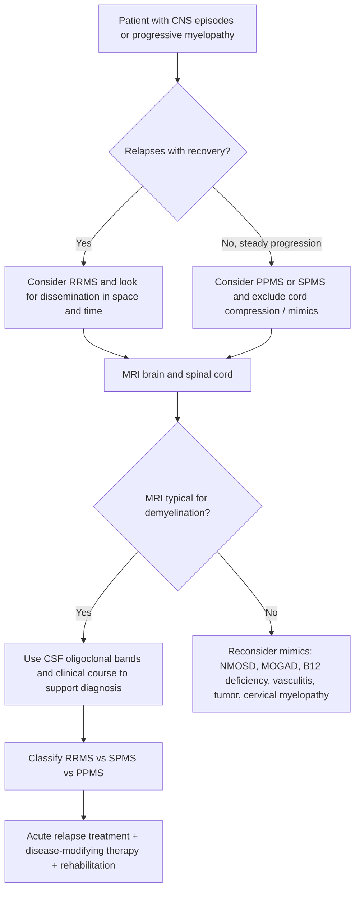
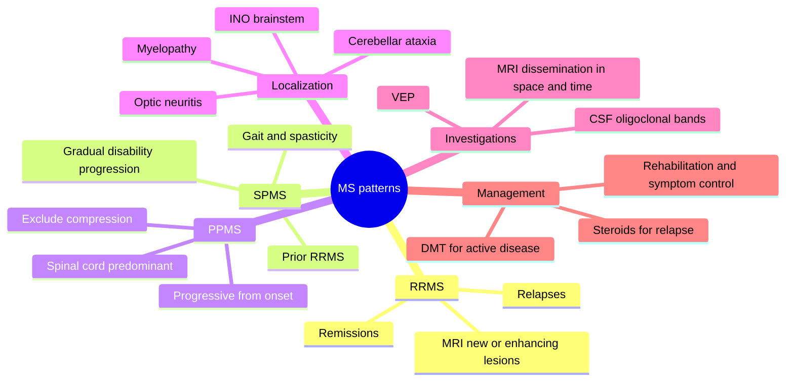

# Relapsing-remitting and progressive multiple sclerosis patterns

Related: [[../Neurology MOC|Neurology MOC]] · [[../Neuro-inflammatory Diseases|Neuro-inflammatory Diseases]] · [[Multiple sclerosis spectrum|Multiple sclerosis spectrum]]

> [!important]
> Multiple sclerosis (MS) is a **chronic immune-mediated demyelinating disorder of the CNS** characterized by lesions disseminated in **space and time**. For FCPS/MRCP, always show you understand the **clinical pattern**: **relapsing-remitting**, **secondary progressive**, or **primary progressive**, because this drives prognosis, MRI interpretation, CSF use, and treatment logic.

> [!tip]
> A high-yield answer mentions **optic nerve, brainstem, cerebellum, spinal cord, and periventricular white matter localization**, explains relapse vs progression, interprets **MRI and CSF oligoclonal bands**, and warns against missing **mimics** such as NMOSD, MOG-associated disease, B12 deficiency, cervical myelopathy, vasculitis, or compressive cord lesions.

## Learning Objectives
- Define relapse-remitting and progressive MS patterns.
- Localize common lesions from clinical deficits.
- Use MRI and CSF findings to support dissemination in space/time.
- Distinguish relapse from pseudo-relapse and progressive disability.
- Summarize acute relapse treatment, long-term disease-modifying therapy, and supportive care.

## Definition
Multiple sclerosis is a chronic inflammatory demyelinating disease of the **central nervous system** involving brain, optic nerves, and spinal cord.

### Clinical phenotypes
- **Relapsing-remitting MS (RRMS)**: episodes of neurological dysfunction (relapses) followed by partial or complete recovery.
- **Secondary progressive MS (SPMS)**: gradual accumulation of disability after an initial relapsing-remitting phase, with or without superimposed relapses.
- **Primary progressive MS (PPMS)**: gradual progression from onset without clear early relapses.

## Relevant Neuroanatomy and Lesion Localization
### Common CNS sites involved
- **optic nerve**
- **periventricular white matter**
- **juxtacortical/cortical regions**
- **brainstem**
- **cerebellum**
- **spinal cord**

### Clinical localization clues
- **optic neuritis**:
  - painful visual loss
  - reduced color vision
  - relative afferent pupillary defect
- **internuclear ophthalmoplegia (INO)**:
  - lesion in medial longitudinal fasciculus in brainstem
  - impaired adduction with abducting nystagmus of contralateral eye
- **cerebellar lesions**:
  - ataxia
  - intention tremor
  - nystagmus
- **sensory spinal cord lesion**:
  - sensory level
  - Lhermitte phenomenon
  - bladder symptoms
- **corticospinal tract lesions**:
  - weakness
  - spasticity
  - extensor plantar responses

### Why localization matters in MS patterns
RRMS often presents with discrete anatomically localizable attacks. Progressive disease is suggested when disability accumulates independently of obvious relapses, often through chronic spinal cord/corticospinal involvement.

## Epidemiology / Risk Factors
- common in young adults
- female predominance, especially RRMS
- higher prevalence in temperate latitudes
- genetic susceptibility including HLA associations
- low vitamin D, smoking, and prior EBV exposure are implicated risk factors

## Pathophysiology
MS involves immune-mediated injury to myelin and axons.

Core mechanisms:
- peripheral immune activation
- CNS entry of autoreactive lymphocytes
- inflammatory demyelinating plaques
- impaired conduction causing transient deficits
- axonal loss and neurodegeneration causing fixed disability

### Why RRMS and progressive MS differ clinically
- **RRMS** is dominated by new inflammatory lesions and relapses.
- **Progressive MS** reflects less overt focal inflammation and more chronic neurodegeneration, spinal cord burden, and incomplete recovery from earlier damage.

## Classification of Patterns
### 1. Relapsing-remitting MS (RRMS)
- most common initial pattern
- clear attacks with remission between episodes
- MRI often shows new/enhancing lesions over time

### 2. Secondary progressive MS (SPMS)
- begins as RRMS
- later shows steady progression in walking, balance, sphincter control, or cognition
- relapses may still occur but are no longer the main driver of disability

### 3. Primary progressive MS (PPMS)
- progressive myelopathic syndrome from onset is typical
- often older onset than RRMS
- less female predominance than RRMS
- spinal cord symptoms common

## What Is a Relapse?
A relapse is a new or worsening neurological deficit lasting **>24 hours**, occurring in the absence of fever or infection, and separated from a previous relapse by at least about **30 days** in practical clinical use.

### Pseudo-relapse
Temporary worsening of old symptoms due to:
- fever
- urinary infection
- heat exposure
- metabolic disturbance
- exhaustion

Pseudo-relapse does **not** represent new inflammatory activity.

## Clinical Features by Pattern
### Relapsing-remitting MS
Common presentations:
- optic neuritis
- partial transverse myelitis
- brainstem diplopia or INO
- sensory symptoms and paresthesia
- limb weakness with pyramidal signs
- cerebellar ataxia
- bladder urgency

Clues favoring RRMS:
- attacks affecting different CNS sites at different times
- partial recovery after attacks
- younger adult, especially female

### Secondary progressive MS
Typical features:
- slowly worsening gait difficulty
- increasing spastic paraparesis
- bladder dysfunction
- cognitive or cerebellar decline
- history of prior relapses years earlier

### Primary progressive MS
Typical features:
- insidious progressive gait/spastic weakness from onset
- spinal cord-predominant syndrome
- fewer classic visual/sensory relapses initially
- diagnosis often requires careful exclusion of compressive and inflammatory mimics

## Approach / Diagnostic Algorithm

## Investigations
### MRI brain and spinal cord: the key investigation
Typical lesion distribution:
- periventricular
- juxtacortical/cortical
- infratentorial
- spinal cord

Typical MRI clues:
- ovoid periventricular lesions
- lesions perpendicular to ventricles (“Dawson fingers”)
- corpus callosum involvement
- enhancing and non-enhancing lesions together suggest dissemination in time

### Dissemination in space
Supported by lesions in different typical CNS regions such as:
- periventricular
- cortical/juxtacortical
- infratentorial
- spinal cord

### Dissemination in time
Supported by:
- new lesion on follow-up MRI
- simultaneous presence of gadolinium-enhancing and non-enhancing lesions
- clinical relapses over time
- CSF oligoclonal bands may support diagnosis depending on criteria framework used

### CSF interpretation
Typical supportive findings:
- **CSF-specific oligoclonal bands**
- mild lymphocytic pleocytosis may occur
- mildly raised protein may occur but very high protein should prompt reconsideration

CSF helps when:
- MRI is not fully diagnostic
- PPMS is suspected
- inflammatory or infective mimics must be separated

### Visual and electrophysiologic support
- visual evoked potentials may show delayed conduction after optic neuritis
- other evoked potentials are less central now than MRI but may still support dissemination

## Differential Diagnosis and Red Flags
### Important mimics
- neuromyelitis optica spectrum disorder (NMOSD)
- MOG-associated disease
- acute disseminated encephalomyelitis in relevant age/context
- B12 deficiency
- cervical spondylotic myelopathy or cord compression
- systemic lupus/vasculitis
- sarcoidosis
- HIV and other infections
- leukodystrophy or inherited spastic paraparesis in selected cases

### Red flags against routine MS diagnosis
- peripheral neuropathy pattern rather than CNS pattern
- complete transverse myelopathy with very long cord lesion
- severe bilateral optic neuritis or poor visual recovery suggesting NMOSD/MOGAD
- marked encephalopathy early
- very high CSF neutrophils or protein
- atypical age or systemic inflammatory features

## Pattern-Specific Interpretation
### RRMS pattern
Suggestive combination:
- discrete attacks
- MRI with dissemination in space/time
- good but incomplete recovery

### SPMS pattern
Suggestive combination:
- previous RRMS history
- now progressive disability independent of relapses
- gait and pyramidal impairment prominent

### PPMS pattern
Suggestive combination:
- progression from onset for at least a sustained period clinically
- spinal cord syndrome common
- MRI/CSF support needed
- exclude structural cord compression carefully

## Management
### Acute relapse treatment
Treat significant relapse after excluding infection/pseudo-relapse.

Typical approach:
- high-dose corticosteroids, often IV methylprednisolone or equivalent high-dose oral regimen depending on protocol
- physiotherapy and symptom support
- plasma exchange in severe steroid-refractory relapses in specialist settings

Do not treat every mild sensory fluctuation automatically; first decide if it is a true relapse.

### Disease-modifying therapy (DMT)
General principles:
- DMT is most established in **relapsing MS**
- choice depends on disease activity, MRI burden, comorbidity, safety profile, and local access
- progressive MS has fewer effective options, though some patients with active disease may still benefit from selected DMTs

Broad categories:
- injectable therapies
- oral therapies
- monoclonal antibodies / highly active therapies

Exam-safe principle:
- RRMS: consider DMT early to reduce relapse rate and MRI activity
- SPMS/PPMS: management depends on whether disease is active and what therapies are locally approved; supportive care remains central

### Symptomatic management
- spasticity management
- bladder dysfunction treatment
- neuropathic pain control
- fatigue management
- depression screening and treatment
- gait aids and physiotherapy
- occupational therapy
- speech/swallow review where relevant

### Rehabilitation and long-term care
- multidisciplinary rehabilitation
- falls prevention
- bowel/bladder planning
- skin care and mobility support in advanced disease
- vaccination and infection risk review when on immunotherapy

## Management Cautions
- do not diagnose relapse without checking for **urinary infection** or fever
- do not diagnose PPMS without excluding **compressive myelopathy**
- do not overcall nonspecific white matter lesions in migraine/vascular disease as MS
- do not forget NMOSD/MOGAD in severe optic neuritis or longitudinally extensive myelitis
- steroids treat relapses; they do **not** change long-term progression by themselves

## Prognosis
Better prognosis tends to be associated with:
- relapsing onset rather than progressive onset
- sensory/optic presentations rather than severe motor/cerebellar deficits
- long interval between early attacks
- low residual disability after relapses

Poorer prognostic clues:
- progressive onset
- early motor/cerebellar/spinal disability
- high lesion burden
- incomplete recovery from relapses

## One-Page Exam Summary
- **RRMS** = attacks with remission.
- **SPMS** = prior RRMS followed by steady progression.
- **PPMS** = progression from onset, often spinal-predominant.
- Localize lesions: **optic nerve, brainstem, cerebellum, spinal cord, corticospinal tracts**.
- **MRI** is central for dissemination in space/time.
- **CSF oligoclonal bands** support the diagnosis, especially when MRI/course are less straightforward.
- Distinguish **true relapse** from **pseudo-relapse** due to infection or heat.
- Acute relapse: **high-dose steroids** after excluding infection.
- Long-term care: **DMT for relapsing disease**, symptom control, rehabilitation, and mimic exclusion.

## Mermaid Mind Map

## MCQs (10)
1. The most common initial clinical pattern of multiple sclerosis is:
   - A. Primary progressive MS
   - B. Relapsing-remitting MS
   - C. Fulminant bacterial meningitis
   - D. Peripheral neuropathy
2. Painful unilateral visual loss with impaired color vision suggests lesion localization to the:
   - A. Basal ganglia
   - B. Optic nerve
   - C. Neuromuscular junction
   - D. Cauda equina
3. A patient with MS has worsening old leg weakness during a febrile UTI but no new lesion activity. This is most likely:
   - A. True relapse
   - B. Pseudo-relapse
   - C. Myasthenic crisis
   - D. Todd paralysis
4. Which MRI pattern strongly supports MS?
   - A. Isolated meningeal calcification
   - B. Ovoid periventricular lesions with Dawson finger appearance
   - C. Basal ganglia hemorrhage only
   - D. Empty sella
5. Internuclear ophthalmoplegia localizes to the:
   - A. Optic chiasm
   - B. Medial longitudinal fasciculus in the brainstem
   - C. Cerebellar tonsil
   - D. Peripheral facial nerve
6. Which CSF finding most supports MS?
   - A. Grossly purulent CSF with neutrophils
   - B. CSF-specific oligoclonal bands
   - C. Malaria parasites
   - D. Markedly low CSF glucose as a defining feature
7. Which pattern best defines secondary progressive MS?
   - A. Progression from onset without relapses ever
   - B. Recurrent syncope over years
   - C. Initial relapsing-remitting course followed by gradual disability accumulation
   - D. Only one optic neuritis episode with full recovery
8. A major mimic to exclude in progressive myelopathic presentations is:
   - A. Cervical cord compression
   - B. Otitis externa
   - C. Appendicitis
   - D. Renal colic
9. Standard acute treatment for a clinically significant MS relapse is usually:
   - A. High-dose corticosteroids
   - B. Long-term warfarin
   - C. Daily insulin regardless of glucose
   - D. Digoxin
10. Which statement about progressive MS is most accurate?
   - A. It always has more relapses than RRMS
   - B. Disability often accumulates independently of obvious relapses
   - C. MRI is never useful
   - D. It affects only peripheral nerves

## SBA Questions (10)
1. A 26-year-old woman develops painful monocular visual loss, then 9 months later transient diplopia with internuclear ophthalmoplegia. MRI shows periventricular and brainstem lesions. What is the most likely pattern?
   - A. Relapsing-remitting MS
   - B. Primary progressive MS
   - C. Motor neuron disease
   - D. Myasthenia gravis
   - E. Cervical spondylosis only
2. A 48-year-old man has gradually worsening spastic paraparesis and urinary urgency over 2 years without distinct prior attacks. Which MS pattern is most likely if MRI/CSF support demyelination?
   - A. Childhood absence epilepsy
   - B. Primary progressive MS
   - C. Secondary progressive MS
   - D. Guillain-Barré syndrome
   - E. Migraine with aura
3. A woman with known RRMS reports sudden worsening of old numbness during a hot day and UTI. The most appropriate interpretation is:
   - A. Pseudo-relapse until proved otherwise
   - B. Definite new relapse requiring immediate DMT change without assessment
   - C. Stroke is certain
   - D. Bell palsy
   - E. Hypocalcemia only
4. A patient with past RRMS now has 18 months of steadily worsening gait independent of distinct attacks. Best classification is:
   - A. Secondary progressive MS
   - B. Primary progressive MS
   - C. Acute encephalitis
   - D. Functional neurological disorder only
   - E. Peripheral vascular disease
5. A 30-year-old with suspected demyelination has brain MRI lesions typical of MS but dissemination in time is uncertain. Which additional test may provide supportive evidence?
   - A. CSF oligoclonal bands
   - B. Serum amylase only
   - C. Stool culture
   - D. Peak flow
   - E. PSA
6. Which finding should make you reconsider a diagnosis of routine MS and think of NMOSD/MOGAD?
   - A. Mild sensory relapse
   - B. Longitudinally extensive transverse myelitis or severe bilateral optic neuritis
   - C. Dawson finger lesions
   - D. INO
   - E. Fatigue
7. A patient with active RRMS asks why disease-modifying therapy is offered even between relapses. The best explanation is:
   - A. To cure peripheral neuropathy
   - B. To reduce relapse rate and inflammatory disease activity over time
   - C. To replace MRI permanently
   - D. Because steroids cannot be used for relapses
   - E. To treat bacterial meningitis
8. A patient with progressive myelopathy and suspected PPMS must have which major alternative excluded carefully?
   - A. Cervical compressive myelopathy
   - B. Tension headache
   - C. Otitis media
   - D. Nephrotic syndrome
   - E. Peptic ulcer disease
9. The best localization for Lhermitte symptom in MS is:
   - A. Cervical spinal cord posterior column region
   - B. Neuromuscular junction
   - C. Frontal sinus
   - D. Peripheral facial nerve
   - E. Retina only
10. A patient with significant new optic neuritis from known MS has no evidence of infection. Best acute treatment is:
   - A. High-dose corticosteroids
   - B. Immediate long-term anticoagulation
   - C. Carbamazepine
   - D. No treatment ever helps
   - E. Oral iron

## Flashcards
- Q: What is the commonest initial pattern of MS?
  A: Relapsing-remitting MS.
- Q: What defines primary progressive MS?
  A: Progressive disability from onset without early relapses.
- Q: What is the typical lesion in painful monocular visual loss in MS?
  A: Optic neuritis of the optic nerve.
- Q: What brainstem sign is classic in MS and localizes to the MLF?
  A: Internuclear ophthalmoplegia.
- Q: What does worsening of old symptoms during fever or UTI suggest?
  A: Pseudo-relapse.
- Q: What MRI concept demonstrates lesions in multiple typical CNS regions?
  A: Dissemination in space.
- Q: What CSF finding supports MS diagnosis?
  A: CSF-specific oligoclonal bands.
- Q: What must be excluded before labeling a progressive myelopathy as PPMS?
  A: Compressive cervical myelopathy and other mimics.
- Q: What is standard treatment for a clinically significant relapse?
  A: High-dose corticosteroids after excluding infection.
- Q: What is the key difference between SPMS and PPMS?
  A: SPMS follows earlier RRMS; PPMS is progressive from onset.

## Answer Key with Explanations
### MCQs
1. **B. Relapsing-remitting MS** — the usual initial phenotype.
2. **B. Optic nerve** — painful visual loss and dyschromatopsia imply optic neuritis.
3. **B. Pseudo-relapse** — infection and heat commonly worsen prior deficits transiently.
4. **B. Ovoid periventricular lesions with Dawson finger appearance** — strongly typical of MS.
5. **B. Medial longitudinal fasciculus in the brainstem** — classic localization for INO.
6. **B. CSF-specific oligoclonal bands** — supportive CSF finding.
7. **C. Initial relapsing-remitting course followed by gradual disability accumulation** — defines SPMS clinically.
8. **A. Cervical cord compression** — essential structural mimic in progressive myelopathy.
9. **A. High-dose corticosteroids** — standard acute relapse therapy.
10. **B. Disability often accumulates independently of obvious relapses** — hallmark of progressive disease.

### SBAs
1. **A. Relapsing-remitting MS** — attacks at different times and sites with MRI support.
2. **B. Primary progressive MS** — progressive myelopathy from onset fits PPMS if supported and mimics excluded.
3. **A. Pseudo-relapse until proved otherwise** — infection and heat are classic triggers of transient worsening.
4. **A. Secondary progressive MS** — prior RRMS with later steady progression.
5. **A. CSF oligoclonal bands** — useful supportive evidence when dissemination in time is uncertain.
6. **B. Longitudinally extensive transverse myelitis or severe bilateral optic neuritis** — red flags for NMOSD/MOGAD.
7. **B. To reduce relapse rate and inflammatory disease activity over time** — the central DMT rationale.
8. **A. Cervical compressive myelopathy** — must be excluded carefully.
9. **A. Cervical spinal cord posterior column region** — classic explanation for Lhermitte symptom.
10. **A. High-dose corticosteroids** — appropriate for significant acute optic neuritis relapse once infection is excluded.
