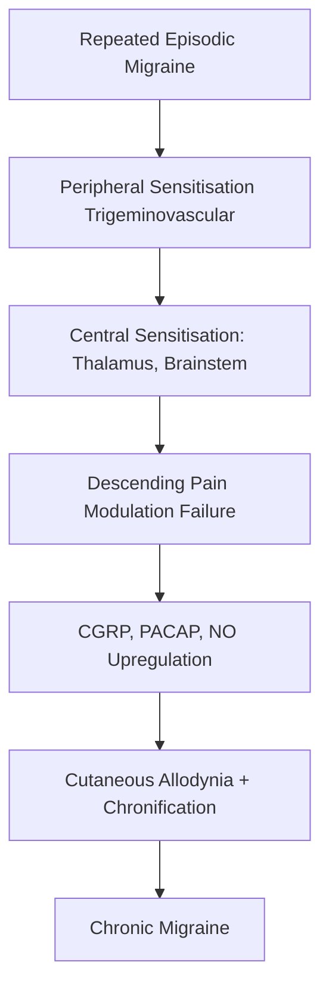
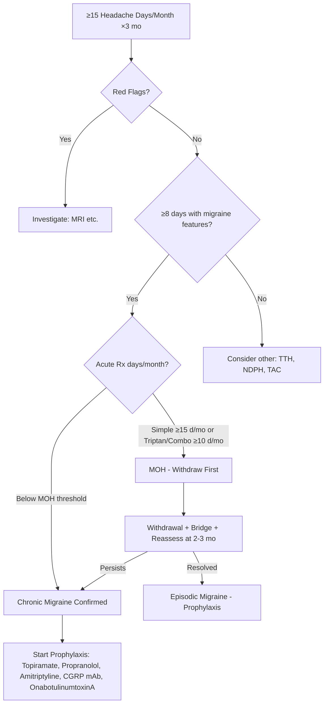
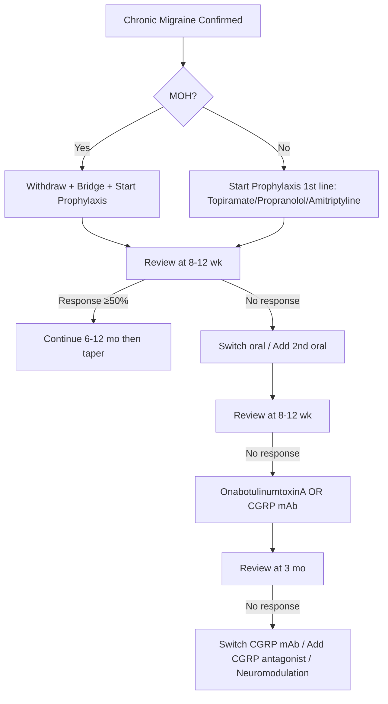

# Chronic Migraine

> [!tip] **ICHD-3 (2018) — Chronic Migraine (1.3)**
> Headache on **≥15 days/month for >3 months** with migraine features on **≥8 days/month**. **NOT better accounted for by another ICHD-3 diagnosis.** Always exclude and address **medication-overuse** first.

> [!warning] **Always screen for MOH** — ≥30% of "chronic migraine" patients have MOH; withdrawal often unmasks true chronic migraine or converts to episodic.

## 1. Definition / Epidemiology / Classification

### Definition
Headache occurring on ≥15 days/month for >3 months, of which ≥8 days have migraine features, in a patient with ≥5 prior migraine attacks (ICHD-3 1.3).

### Epidemiology
| Metric | Value |
|--------|-------|
| Prevalence | 1.4–2.2% of general population |
| Annual incidence | ~2.5% episodic → chronic migraine / year |
| Progression | ~3% of episodic migraine progresses to chronic annually |
| Demographics | F:M ≈ 3:1; peak 30–50 yrs; **obesity, lower SES** |
| Risk factors | High attack frequency, medication overuse, obesity, depression/anxiety, female sex, allodynia, sleep disturbance, stress |

### Classification (ICHD-3)
| Subtype | Criteria |
|---------|----------|
| Chronic migraine (1.3) | ≥15 d/mo ×3 mo, ≥8 d/mo with migraine features |
| Chronic migraine with MOH (8.2 + 1.3) | Above criteria + ≥10–15 d/mo acute Rx for >3 months |
| Probable chronic migraine | All but one criterion; MOH excluded |

## 2. Aetiology / Pathophysiology

### Risk Factors for Chronification
- **High baseline attack frequency** (strongest predictor)
- **Medication overuse** (simple analgesics ≥15 d/mo, triptans/combos ≥10 d/mo for >3 months)
- **Obesity** (BMI >30)
- **Stress, depression, anxiety, PTSD**
- **Sleep disorders** (OSA, insomnia)
- **Allodynia** during attacks (marker of central sensitisation)
- **Ineffective acute treatment / inadequate prophylaxis**

### Pathophysiology

### Molecular Basis
- **CGRP** elevation in CSF during and interictally; **PACAP, NO** also implicated
- **5-HT** dysregulation; descending inhibition failure
- **NMDA receptor**-mediated central sensitisation
- **Inflammatory cytokines** in pericranial tissues
- **Genetic:** TRESK (KCNK18), PRRT2, MTHFR polymorphisms

## 3. Clinical Features

### History
- **Pattern:** ≥15 headache days/month for >3 months; ≥8 days with full migraine features (unilateral, pulsatile, moderate–severe, aggravated by activity, nausea/vomiting, photo+phonophobia)
- **Transformation:** Often gradual; episodic migraine → increasing frequency → chronic
- **Triggers:** Stress, hormonal (menstruation), sleep, weather, diet, alcohol, missed meals
- **Associated:** Allodynia (scalp tenderness, light touch painful), photophobia, phonophobia, osmophobia
- **Comorbid:** Depression (~50%), anxiety, fibromyalgia, IBS, TMD, restless legs
- **Drug history:** **MUST quantify** acute Rx days/month

### Examination
- **Neurological exam: NORMAL**
- **Pericranial muscle tenderness** (chronic migraine often coexists with TTH features)
- **BP, fundoscopy: NORMAL** (any abnormality → red flag)
- **BMI** (obesity = risk factor)
- **Screen depression/anxiety** (PHQ-9, GAD-7)

### Variants
| Variant | Feature |
|---------|---------|
| Chronic migraine without aura | Most common; no aura |
| Chronic migraine with aura | Aura on some attacks |
| Chronic migraine + MOH | 8.2 + 1.3; treat MOH first |
| New daily persistent headache with migraine features | Daily from onset |

## 4. Diagnostic Approach

### ICHD-3 Criteria (1.3)
| Criterion | Detail |
|-----------|--------|
| A | Headache on ≥15 days/month for >3 months |
| B | ≥8 days/month with migraine features (full criteria) |
| C | ≥5 prior attacks fulfilling migraine without aura (or with aura) |
| D | Not better accounted for by another ICHD-3 diagnosis |

### Algorithm

### Severity / Impact
| Tool | Purpose |
|------|---------|
| Headache diary | Frequency, severity, MOH days |
| HIT-6 / MIDAS | Disability/impact |
| PHQ-9 / GAD-7 | Depression/anxiety |
| MOH Screening Tool | Days of acute Rx |

## 5. Investigations

### First-Line
| Test | Indication | Finding |
|------|------------|---------|
| **Headache diary** | All | Track days, severity, MOH |
| **Neurological exam** | All | Must be normal |
| **BP, BMI, depression screen** | All | Comorbidities |

### Neuroimaging
- **MRI brain (± MRA, MRV):** Only if red flags or atypical features
- **CT head:** If sudden onset, focal deficit, immunocompromised
- **LP:** If papilloedema, IIH suspected

> **Routine imaging NOT needed** in chronic migraine with stable pattern and no red flags.

## 6. Differential Diagnosis
| Condition | Distinguishing Features | Key Test |
|-----------|------------------------|----------|
| **Medication-overuse headache** | ≥15 d/mo + acute Rx overuse; resolves on withdrawal | Diary, withdrawal trial |
| **Chronic TTH** | Bilateral, pressing, no nausea, no migrainous features | ICHD-3 |
| **New daily persistent headache (NDPH)** | Daily from onset, no prior episodic | History |
| **Hemicrania continua** | Strictly unilateral, continuous, autonomic, **indomethacin response** | ICHD-3, indomethacin trial |
| **Chronic cluster headache** | Severe unilateral orbital, autonomic, 15–180 min attacks | ICHD-3 |
| **Secondary chronic headache** (IIH, tumour) | Red flags, papilloedema, focal signs | MRI ± LP |
| **Cervicogenic headache** | Neck trauma, restricted ROM, movement-related | Clinical, X-ray/MRI C-spine |

## 7. Management

### Step 1: Address MOH (if present)
| Action | Detail |
|--------|--------|
| **Withdraw** overused acute Rx (sudden for triptans; taper over 2–4 wk for opioids/barbiturates) |
| **Bridge** with naproxen 250–500 mg BD ×2–4 wk OR prednisolone 60 mg ×2 d, taper over 6 d |
| **Start prophylaxis immediately** |
| **Educate**: limit acute Rx to ≤10–15 d/mo (triptans/combos) or ≤15 d/mo (simple) |
| **Follow-up** at 2, 4, 8 weeks |

### Step 2: Acute Treatment (limit to ≤10–15 days/month)
| Drug | Dose | Notes |
|------|------|-------|
| **Sumatriptan** | 50–100 mg PO (max 300 mg/d) or 6 mg SC | 1st line triptan; most evidence |
| **Rizatriptan** | 10 mg PO | Faster onset, MLX available |
| **Zolmitriptan** | 2.5–5 mg PO/ODT/NS |  |
| **Naratriptan** | 2.5 mg PO | Slower onset, less MOH risk |
| **NSAIDs** | Naproxen 500–750 mg, ibuprofen 400–800 mg | Effective; combine with triptan |
| **Antiemetics** | Metoclopramide 10 mg IV/PO; domperidone 10 mg PO | Avoid prochlorperazine in young (dystonia) |
| **AVOID:** Opioids, barbiturates (high MOH risk) |

### Step 3: Prophylaxis (Traditional 1st line)
| Agent | Dose | Notes |
|-------|------|-------|
| **Topiramate** | 25–100 mg BD (start 25 mg nocte) | Best evidence; ↓weight; cognitive SE; avoid in pregnancy, renal stones, glaucoma |
| **Propranolol** | 40–120 mg BD | Avoid in asthma, heart block, bradycardia |
| **Amitriptyline** | 10–75 mg nocte | Good if comorbid depression/insomnia/T TH |
| **Candesartan** | 8–16 mg daily | If β-blocker contraindicated; ARB |
| **Sodium valproate** | 400–800 mg BD | **Avoid in women of childbearing potential** (teratogenic); hepatotoxic |
| **Pizotifen** | 1.5–3 mg nocte | Less used; weight gain, drowsiness |

### Step 4: Advanced Therapies (if ≥2 oral preventives fail)
| Therapy | Dose | Notes |
|---------|------|-------|
| **OnabotulinumtoxinA (Botox)** | **155–195 U IM** per PREEMPT protocol: 31 fixed-site, 8 follow-the-pain injections every 12 weeks | **Only FDA-approved specifically for chronic migraine**; ≥50% responder rate ~50% |
| **CGRP monoclonal antibodies** | Erenumab 70–140 mg SC monthly; Fremanezumab 225 mg SC monthly or 675 mg quarterly; Galcanezumab 120 mg SC monthly (240 mg loading); Eptinezumab 100–300 mg IV quarterly | **Specific to migraine**; well-tolerated; not affected by MOH; can be used with MOH |
| **CGRP receptor antagonists (gepants)** | Rimegepant 75 mg PO PRN or every other day; Atogepant 10–60 mg daily | Oral; can be used both acute and preventive |
| **Neuromodulation** | Cefaly (supraorbital transcutaneous), single-pulse TMS, gammaCore (vagus nerve) | Non-pharmacological options |

### Algorithm

## 8. Drug Interactions / Cautions
| Drug | Interaction / Caution | Management |
|------|----------------------|------------|
| Triptans | MAOI, ergots, SSRIs/SNRIs (rare serotonin syndrome), cardiovascular disease | Avoid in IHD, uncontrolled HTN, hemiplegic/brainstem aura, MAOI use |
| Topiramate | ↓OCP (≤200 mg), carbonic anhydrase inhibitors (acidosis, stones), antiepileptics | Higher-dose OCP if >200 mg; monitor bicarbonate; avoid in pregnancy, glaucoma, renal stones |
| Propranolol | Verapamil/diltiazem (bradycardia), salbutamol (antagonism), ergots | Avoid in asthma, 2nd/3rd AV block, bradycardia, decompensated HF |
| Valproate | Inhibits lamotrigine, displaces phenytoin; teratogenic | **Avoid in women of childbearing potential**; LFTs |
| CGRP mAbs | Minimal drug interactions | Few; theoretical immunosuppression |
| OnabotulinumtoxinA | Neuromuscular blockers, aminoglycosides | Avoid concurrent; spread injections |
| Amitriptyline | MAOI, SSRIs, QT-prolonging drugs, anticholinergics | ECG baseline; avoid in narrow-angle glaucoma, recent MI |

## 9. Procedures
### OnabotulinumtoxinA (PREEMPT Protocol)
- **Indication:** Chronic migraine; failure/intolerance of ≥2 oral preventives
- **Dose:** 155–195 U IM; 31 fixed-site + 8 follow-the-pain
- **Sites:** Frontalis, corrugator, procerus, occipitalis, temporalis, trapezius, cervical paraspinal, masseter
- **Frequency:** Every 12 weeks
- **Response:** ≥50% reduction in headache days in ~50% of patients
- **Adverse:** Injection site pain, neck pain, mild ptosis, muscle weakness (transient)
- **Contraindications:** Infection at site, known hypersensitivity

### Greater Occipital Nerve Block
- **Indication:** Acute severe migraine, status migrainosus
- **Technique:** Local anaesthetic ± steroid at GON (2 cm lateral to inion, 1/3 distance to mastoid)

## 10. Complications
| Complication | Frequency | Prevention/Management |
|--------------|-----------|------------------------|
| **Medication-overuse headache** | 30–50% | Limit acute Rx; address withdrawal |
| **Depression / anxiety** | ~50% | Screen (PHQ-9, GAD-7); treat |
| **Allodynia / central sensitisation** | Common | Early effective prophylaxis |
| **Status migrainosus** | <1% | Acute management: IV metoclopramide + dexamethasone; avoid opioids |
| **Migrainous infarction** | Rare | Stroke risk in migraine with aura; avoid triptans in hemiplegic/brainstem aura |
| **Chronic pain syndromes** | Comorbid | Multidisciplinary |
| **Disability / reduced QoL** | Common | HIT-6, multidisciplinary support |

## 11. Red Flags / Emergencies
| Red Flag | Concern | Action |
|----------|---------|--------|
| Sudden severe (thunderclap) | SAH, RCVS, dissection | Urgent CT/LP |
| New focal deficit / prolonged aura >60 min | Stroke, TIA, seizure | Urgent MRI/MRA |
| Papilloedema | IIH, mass | MRI ± LP |
| New headache >50 yrs | GCA, tumour | ESR/CRP, MRI |
| Fever / neck stiffness | Meningitis, encephalitis | LP ± CT |
| Progressive worsening | Tumour, subdural | MRI |
| Aura with hemiparesis / brainstem | Hemiplegic/brainstem migraine vs stroke | Urgent MRI/MRA |
| Status migrainosus >72 h | Severe, unremitting | IV therapy, hospitalise |

## 12. Prognosis
| Factor | Good | Poor |
|--------|------|------|
| Attack frequency | Episodic | High frequency (≥10 d/mo) |
| MOH | Absent | Present |
| BMI | <30 | >30 |
| Comorbid depression | Treated | Untreated |
| Allodynia | Absent | Present |
| Adherence to prophylaxis | Good | Poor |

- **2-year remission rate:** ~25% revert to episodic
- **Chronic migraine → episodic:** 25–50% with effective treatment
- **Long-term:** Effective prophylaxis + lifestyle → improved QoL

## 13. Topic Correlation
| Related Topic | Key Overlap |
|---------------|-------------|
| Medication-Overuse Headache | Coexists in ~30–50%; treat MOH first |
| Migraine Without Aura | Most progress from episodic to chronic |
| Tension-Type Headache | Often coexists; chronic migraine with TTH features |
| CGRP Antagonists | Mechanism in migraine |
| Chronic Cluster Headache | Differentiate by autonomic features |

## 14. Special Situations
| Situation | Consideration |
|-----------|---------------|
| **Pregnancy** | Acute: paracetamol + metoclopramide (avoid NSAIDs 1st/3rd trimester, triptans limited data); prophylaxis: propranolol 2nd/3rd trimester; **avoid valproate, topiramate, CGRP mAbs (limited data)** |
| **Lactation** | Propranolol, amitriptyline compatible; sumatriptan limited data |
| **Paediatric** | Topiramate, propranolol; avoid valproate, amitriptyline in young; amitriptyline risk of cardiotoxicity |
| **Elderly** | Lower doses; avoid TCAs (falls, anticholinergic); topiramate cognitive SE |
| **Renal impairment** | Topiramate ↓dose; avoid if CrCl <30; onabotulinumtoxinA safe |
| **Hepatic impairment** | Avoid valproate; topiramate ↓dose |
| **Cardiovascular** | Avoid triptans in IHD, uncontrolled HTN; propranolol contraindicated in asthma, heart block |
| **Driving** | Triptans can cause drowsiness; migraine aura + driving risk (DVLA: notify if aura causes sudden disabling symptoms) |
| **Perioperative** | Continue prophylaxis; onabotulinumtoxinA timing irrelevant |

## FCPS/MRCP High-Yield Summary
| Category | Key Points |
|----------|------------|
| **Definition** | ≥15 d/mo ×3 mo; ≥8 d/mo with migraine features; ICHD-3 1.3 |
| **Epidemiology** | 1.4–2.2% prevalence; F:M = 3:1; obesity, MOH = risk factors |
| **Pathophysiology** | Peripheral + central sensitisation; CGRP, 5-HT, NO; descending inhibition failure |
| **Diagnosis** | Clinical (ICHD-3); exclude MOH; imaging only if red flags |
| **Management** | **Address MOH first**; oral prophylaxis (topiramate, propranolol, amitriptyline); if fails → **onabotulinumtoxinA** (PREEMPT) or **CGRP mAbs** |
| **Complications** | MOH, depression, status migrainosus, migrainous infarction |
| **Viva Pearls** | "MOH first"; onabotulinumtoxinA 155–195 U PREEMPT protocol every 12 wk; CGRP mAbs are migraine-specific |

## Viva Questions
1. **Q:** ICHD-3 criteria for chronic migraine? **A:** ≥15 d/mo ×3 mo, ≥8 d/mo with migraine features, prior ≥5 migraine attacks.
2. **Q:** Most important first step in management? **A:** **Exclude and treat MOH** — withdrawal often unmasks true chronic migraine.
3. **Q:** OnabotulinumtoxinA dosing? **A:** **155–195 U IM**, 31 fixed-site + 8 follow-the-pain injections every **12 weeks** (PREEMPT protocol).
4. **Q:** CGRP mAb examples? **A:** Erenumab (70–140 mg SC monthly), fremanezumab, galcanezumab, eptinezumab.
5. **Q:** When to use CGRP mAb? **A:** Failure/intolerance of ≥2 oral preventives (e.g., topiramate, propranolol, amitriptyline).
6. **Q:** What is the strongest risk factor for chronification? **A:** High baseline attack frequency + medication overuse.
7. **Q:** Pathophysiology of chronification? **A:** Peripheral + central sensitisation; CGRP, NO, 5-HT dysregulation; descending inhibition failure.
8. **Q:** Migraine with aura + triptans? **A:** Avoid in **hemiplegic** or **brainstem aura** (stroke risk); safe in typical aura.

## Common Confusions
| Confusion | Clarification |
|-----------|---------------|
| Chronic migraine vs MOH | **Always exclude MOH first**; both can coexist; treat MOH before labelling chronic migraine |
| Chronic migraine vs chronic TTH | CM = ≥8 d/mo with migrainous features; CTTH = no migrainous features |
| CGRP mAbs vs CGRP antagonists (gepants) | mAbs = SC/IV preventive (erenumab etc); gepants = oral (rimegepant, atogepant) — acute and preventive |
| OnabotulinumtoxinA dose | 155–195 U total; 31 fixed-site + 8 follow-the-pain every 12 weeks |
| Valproate in women | **Avoid in women of childbearing potential** (teratogenic); MHRA 2018 |
| Hemiplegic migraine | **Avoid triptans**; can mimic stroke; consider CACNA1A, SCN1A, ATP1A2 genetic testing |
| Topiramate + OCP | Topiramate >200 mg/d reduces OCP efficacy; use higher-dose OCP |

## Mnemonics
1. **CHRONIC MIGRAINE** — **C**GRP high, **H**igh frequency baseline, **R**isk = obesity, **O**veruse, **N**eurogenic, **I**ndividualised, **C**GRP mAbs, **M**OH first, **I**CHD-3 1.3, **G**reater occipital, **R**educe acute Rx, **A**mitriptyline, **I**ndometacin not responsive, **N**ot pulsatile bilateral, **E**valuate red flags
2. **PREEMPT** — **P**reventive Botox **R**egimen, **E**very 12 weeks, **E**xact dose 155–195 U, **M**ultiple sites (31+8), **P**hase III evidence, **T**rigeminovascular
3. **CGRP TARGETS** — **C**alcitonin, **G**ene-related, **P**eptide, **T**herapy; **A**ntibodies: erenumab, fremanezumab, galcanezumab, eptinezumab; **R**imegepant, **G**epants, **E**xpand, **T**halamus, **S**afety good
4. **SNOOP4** — **S**ystemic, **N**euro signs, **O**nset sudden, **O**lder >50, **P**attern change, **P**ositional, **P**recipitated by Valsalva, **P**apilloedema

## One-Page Card
| **Topic** | **Chronic Migraine** |
|-----------|----------------------|
| Definition | ≥15 d/mo ×3 mo, ≥8 d/mo migraine features (ICHD-3 1.3) |
| Prevalence | 1.4–2.2%; F:M = 3:1 |
| Risk factors | High frequency, MOH, obesity, depression, allodynia |
| Pathophysiology | Central sensitisation, CGRP, 5-HT, NO |
| First step | **Exclude & treat MOH** |
| Oral prophylaxis | Topiramate, propranolol, amitriptyline |
| Advanced | **OnabotulinumtoxinA 155–195 U q12w** (PREEMPT) OR **CGRP mAb** (erenumab, fremanezumab, galcanezumab, eptinezumab) |
| Acute Rx limit | ≤10–15 d/mo (avoid opioids) |
| Red flags | SNOOP4 → imaging |
| Comorbidities | Depression, anxiety, allodynia, sleep |

## MCQs (10)
1. **Q:** ICHD-3 chronic migraine — required?
   **A.** Daily headache **B.** **≥15 d/mo ×3 mo, ≥8 d/mo with migraine features** **C.** Aura daily **D.** Nausea always
   **Answer: B** — ICHD-3 1.3: ≥15 d/mo, ≥8 d/mo migrainous.
2. **Q:** First management step in chronic migraine?
   **A.** Start CGRP mAb **B.** **Exclude and treat MOH** **C.** OnabotulinumtoxinA **D.** MRI brain
   **Answer: B** — MOH first; can mask/unmask chronic migraine.
3. **Q:** OnabotulinumtoxinA dose (PREEMPT)?
   **A.** 50 U **B.** 100 U **C.** **155–195 U** **D.** 300 U
   **Answer: C** — 155–195 U, 31+8 sites, every 12 weeks.
4. **Q:** Strongest risk factor for chronification?
   **A.** Female sex **B.** **High baseline attack frequency + MOH** **C.** Family history **D.** Aura
   **Answer: B** — High frequency and MOH.
5. **Q:** CGRP mAb example?
   **A.** Sumatriptan **B.** Topiramate **C.** **Erenumab** **D.** Propranolol
   **Answer: C** — Erenumab (anti-CGRP receptor); others: fremanezumab, galcanezumab, eptinezumab.
6. **Q:** In which migraine type are triptans contraindicated?
   **A.** Migraine without aura **B.** **Hemiplegic / brainstem aura** **C.** Menstrual migraine **D.** Chronic migraine
   **Answer: B** — Stroke risk in hemiplegic/brainstem aura.
7. **Q:** Pathophysiology of chronic migraine?
   **A.** Pure vascular theory **B.** **Central sensitisation + CGRP + descending inhibition failure** **C.** Cortical spreading depression only **D.** Serotonin excess
   **Answer: B** — Trigeminovascular + central sensitisation + CGRP.
8. **Q:** Best prophylaxis in chronic migraine with comorbid insomnia and depression?
   **A.** Propranolol **B.** Topiramate **C.** **Amitriptyline 10–75 mg nocte** **D.** Valproate
   **Answer: C** — TCA: treats migraine, depression, insomnia.
9. **Q:** CGRP mAb advantage over oral prophylactics?
   **A.** Cheaper **B.** **Migraine-specific, no MOH, well-tolerated** **C.** Oral administration **D.** Acute efficacy
   **Answer: B** — mAbs are migraine-specific; gepants oral.
10. **Q:** Status migrainosus treatment?
    **A.** Oral sumatriptan only **B.** **IV metoclopramide + dexamethasone + IV fluids** **C.** Opioids **D.** Avoid hospitalisation
    **Answer: B** — IV antiemetic + steroid; avoid opioids.

## SBAs (10)
1. **Scenario:** 35-yr woman, 18 headache d/mo ×6 mo, takes ibuprofen 18 d/mo. First step?
   **A.** Start CGRP mAb **B.** **Stop ibuprofen, start amitriptyline, re-evaluate at 2–3 mo** **C.** MRI brain **D.** Continue ibuprofen, add triptan
   **Answer: B** — MOH withdrawal + start prophylaxis.
2. **Scenario:** 40-yr woman, chronic migraine, failed topiramate, propranolol, amitriptyline. Best next step?
   **A.** Repeat oral **B.** **OnabotulinumtoxinA 155–195 U IM q12w (PREEMPT)** **C.** Opioids **D.** Acupuncture
   **Answer: B** — Botox indicated after ≥2 oral failures.
3. **Scenario:** 28-yr with chronic migraine + MOH, started on CGRP mAb while still overusing. Best approach?
   **A.** Stop CGRP mAb **B.** **Continue CGRP mAb + withdraw MOH + behavioural** **C.** Add opioid **D.** MRI
   **Answer: B** — CGRP mAbs can be used in MOH setting; address overuse.
4. **Scenario:** 30-yr with hemiplegic migraine. Which is contraindicated?
   **A.** Paracetamol **B.** **Sumatriptan** **C.** Aspirin **D.** Metoclopramide
   **Answer: B** — Avoid triptans in hemiplegic/brainstem aura.
5. **Scenario:** 25-yr woman of childbearing potential, chronic migraine. Avoid which prophylaxis?
   **A.** Propranolol **B.** Amitriptyline **C.** **Sodium valproate** **D.** Topiramate
   **Answer: C** — Valproate teratogenic (NTD, neurodevelopmental). Topiramate also contraindicated in pregnancy.
6. **Scenario:** 50-yr man, chronic migraine, no aura, on propranolol. Which acute Rx limit to avoid MOH?
   **A.** ≤5 d/mo **B.** **≤10–15 d/mo (triptan/simples)** **C.** ≤20 d/mo **D.** Daily
   **Answer: B** — Triptans/combos ≤10 d/mo; simples ≤15 d/mo.
7. **Scenario:** 32-yr with chronic migraine + hypertension + asthma. Avoid which?
   **A.** Amitriptyline **B.** Topiramate **C.** **Propranolol** **D.** Candesartan
   **Answer: C** — β-blocker contraindicated in asthma.
8. **Scenario:** 38-yr, chronic migraine, onabotulinumtoxinA started. When to assess response?
   **A.** After 1 dose **B.** **After 2–3 cycles (6–9 months)** **C.** After 1 month **D.** After 1 year
   **Answer: B** — Assess after 2–3 cycles of PREEMPT.
9. **Scenario:** 45-yr with chronic migraine + BMI 35, depression, MOH. Best comprehensive plan?
   **A.** Propranolol only **B.** **Withdraw MOH + start CGRP mAb + weight loss + CBT + antidepressant** **C.** Opioid **D.** Topiramate only
   **Answer: B** — Address MOH, start effective prophylaxis, lifestyle, treat depression.
10. **Scenario:** 30-yr pregnant, chronic migraine. Avoid which?
    **A.** Paracetamol **B.** Metoclopramide **C.** **Topiramate / valproate / CGRP mAb** **D.** Propranolol
    **Answer: C** — Topiramate, valproate teratogenic; CGRP mAb limited data.

## Flashcards
- **Q:** ICHD-3 chronic migraine criteria? **A:** ≥15 d/mo ×3 mo, ≥8 d/mo migraine features.
- **Q:** First step in chronic migraine management? **A:** Exclude and treat MOH.
- **Q:** OnabotulinumtoxinA dose & schedule? **A:** 155–195 U IM, 31+8 sites, q12w (PREEMPT).
- **Q:** CGRP mAbs (4)? **A:** Erenumab, fremanezumab, galcanezumab, eptinezumab.
- **Q:** Risk factors for chronification (5)? **A:** High frequency, MOH, obesity, depression, allodynia.
- **Q:** Triptan contraindication? **A:** Hemiplegic/brainstem aura, IHD, uncontrolled HTN, MAOI.
- **Q:** Oral prophylaxis 1st line (3)? **A:** Topiramate, propranolol, amitriptyline.
- **Q:** Pathophysiology? **A:** Trigeminovascular + central sensitisation + CGRP + 5-HT/NO dysregulation.
- **Q:** Acute Rx limit? **A:** ≤10 d/mo triptans/combos; ≤15 d/mo simples.
- **Q:** Status migrainosus Rx? **A:** IV metoclopramide + dexamethasone + IV fluids; avoid opioids.

## Answer Key

### MCQs
1. **B** — ICHD-3 1.3
2. **B** — MOH first
3. **C** — 155–195 U PREEMPT
4. **B** — High frequency + MOH
5. **C** — Erenumab
6. **B** — Hemiplegic/brainstem aura
7. **B** — Central sensitisation + CGRP
8. **C** — Amitriptyline
9. **B** — Migraine-specific, well-tolerated
10. **B** — IV metoclopramide + dexamethasone

### SBAs
1. **B** — MOH withdrawal + prophylaxis
2. **B** — Botox after 2 oral fails
3. **B** — CGRP mAb + MOH withdrawal
4. **B** — Avoid triptans in hemiplegic
5. **C** — Valproate teratogenic
6. **B** — ≤10–15 d/mo
7. **C** — Propranolol in asthma
8. **B** — 2–3 cycles
9. **B** — Comprehensive plan
10. **C** — Avoid teratogens, limited CGRP data

## Summary
**Chronic migraine** (ICHD-3 1.3) = headache **≥15 days/month for >3 months** with migraine features on **≥8 days/month**. **Always exclude and treat MOH first** (withdrawal often unmasks true chronic migraine). Risk factors: high baseline frequency, MOH, obesity, depression, allodynia. Pathophysiology: trigeminovascular + central sensitisation + CGRP, 5-HT, NO dysregulation. **First-line prophylaxis:** topiramate, propranolol, amitriptyline. **Advanced:** if ≥2 oral fail → **onabotulinumtoxinA 155–195 U q12w (PREEMPT)** OR **CGRP mAbs** (erenumab, fremanezumab, galcanezumab, eptinezumab). Acute Rx limited to ≤10–15 days/month (avoid opioids). Red flags (SNOOP4) mandate imaging. Chronic migraine ↔ episodic transition in 25–50% with effective treatment.

## PasTest Scenario SBAs (Clinical Vignettes)

> **Auto-generated PasTest/Mediscope-style scenario SBAs** grounded in the authored source. Each scenario tests a real clinical fact (triad, specific sign, contraindication, trial, first-line Rx) extracted from the topic. *Source: Ch 27: Neurology & Stroke — Chronic Migraine*

**Q1.** Which of the following features is most specific or characteristic of Chronic Migraine?

  - **A.** MRI brain
  - **B.** A feature common to many acute inflammatory conditions
  - **C.** A non-specific sign that does not localise the diagnosis
  - **D.** An investigation finding rather than a clinical feature

  > **Answer: A** — MRI brain
  >
  > *Source:* All | Must be normal |
| **BP, BMI, depression screen** | All | Comorbidities |

### Neuroimaging
- **MRI brain (± MRA, MRV):** Only if red flags or atypical features
- **CT head:** If sudden onset, f

**Q2.** What is the most appropriate first-line therapy for Chronic Migraine?

  - **A.** Withdraw
  - **B.** An advanced/surgical therapy reserved for refractory disease
  - **C.** Symptomatic treatment only, no disease-modifying therapy
  - **D.** Empiric broad-spectrum therapy without specific indication

  > **Answer: A** — Withdraw
  >
  > *Source:* **Withdraw** overused acute Rx (sudden for triptans; taper over 2–4 wk for opioids/barbiturates)

