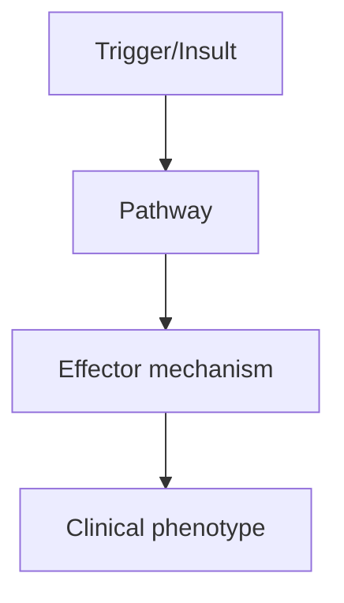
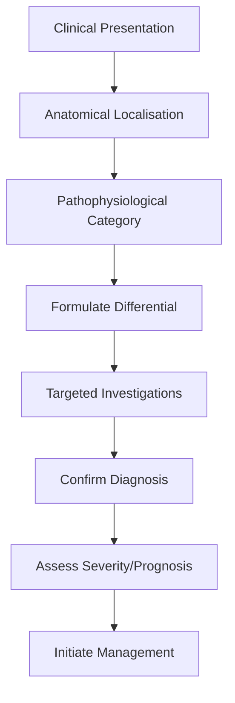
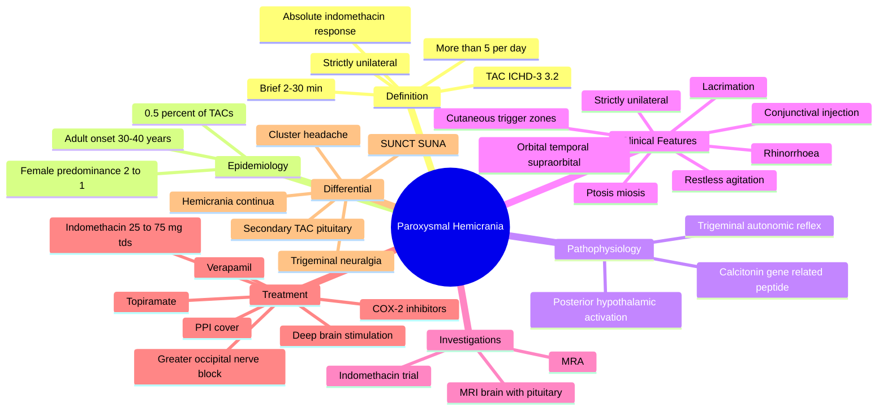

# Paroxysmal Hemicrania

> [!tip] **High-Yield Definition**
> Strictly unilateral, brief (2-30 min), severe headache with prominent ipsilateral cranial autonomic features, occurring >5/day. Hallmark: ABSOLUTE response to indomethacin. Part of TACs (trigeminal autonomic cephalalgias).

---

## 1. Definition / Epidemiology / Classification

### Definition
Strictly unilateral, brief (2-30 min), severe headache with prominent ipsilateral cranial autonomic features, occurring >5/day. Hallmark: ABSOLUTE response to indomethacin. Part of TACs (trigeminal autonomic cephalalgias).

### Epidemiology
Rare (~0.5% of all TACs). Female predominance (2:1). Adult onset (mean 30-40y).

### Classification
| Variant | Key Features | Prognosis |
|---------|-------------|-----------|
| | | |

---

## 2. Aetiology / Pathophysiology

### Aetiology
Hypothalamic dysfunction (posterior hypothalamus). Similar pathophysiology to cluster headache (trigeminal-autonomic reflex). No clear vascular compression.

### Pathophysiology

---

## 3. Clinical Features

### History
- **Onset/Duration:**
- **Progression:**
- **Key symptoms:**
- **Triggers:**
- **Systemic symptoms:**
- **Drug/Family/Social history:**

### Examination
| Domain | Key Findings | Localisation Value |
|--------|-------------|-------------------|
| | | |

### Specific Clinical Features
Strictly unilateral (no side shift). Severe, orbital/temporal/supraorbital pain. Brief: 2-30 min. Frequency: >5/day (often 10-30). Autonomic features: lacrimation, conjunctival injection, rhinorrhoea, nasal congestion, ptosis, miosis, facial sweating, eyelid oedema (ipsilateral). Restless/agitation (unlike migraine). May have cutaneous trigger zones. Episodic vs chronic forms.

---

## 4. Diagnostic Approach / Algorithm

---

## 5. Investigations

MRI brain (hypothalamic-pituitary, posterior fossa), MRA. Diagnosis is clinical + response to indomethacin. CSF not routinely needed. Trial of indomethacin 25mg TDS up to 75mg TDS for 3-7 days.

---

## 6. Differential Diagnosis

| Differential | Distinguishing Features | Key Test |
|--------------|------------------------|----------|
| | | |

---

## 7. Management

DEFINITIVE: Indomethacin 25mg TDS, titrate to 75mg TDS (or up to 200-300mg/day). Response within 24-48h confirms diagnosis. Gastric protection (PPI). Other options: COX-2 inhibitors, topiramate, verapamil, melatonin, occipital nerve blocks, deep brain stimulation (refractory).

---

## 8. Drug Interactions / Contraindications / Comorbidity Cautions

| Drug | Interaction / Caution | Management |
|------|----------------------|------------|
| | | |

---

## 9. Procedures (if applicable)

### Procedure:
- **Indications:**
- **Contraindications:**
- **Preparation / Principle:**
- **Complications:**
- **Viva Pearls:**

---

## 10. Complications

| Complication | Frequency | Prevention / Monitoring | Management |
|--------------|-----------|------------------------|------------|
| | | | |

---

## 11. Red Flags / Emergencies

All TACs require MRI to exclude structural cause. Atypical features, refractory to indomethacin, progressive symptoms warrant further investigation.

---

## 12. Prognosis

Indolent chronic course. Episodic form may remit. Indomethacin provides complete relief. Long-term indomethacin use requires gastric and renal monitoring.

---

## 13. Topic Correlation

| Related Topic | Link | Key Overlap |
|---------------|------|-------------|
| | | |

---

## 14. Special Situations

| Situation | Consideration |
|-----------|---------------|
| **Pregnancy** | |
| **Lactation** | |
| **Paediatric** | |
| **Elderly / Frail** | |
| **Renal impairment** | |
| **Hepatic impairment** | |
| **Immunocompromised** | |
| **Perioperative** | |
| **Driving / DVLA** | |
| **Occupational** | |

---

## FCPS/MRCP High-Yield Summary

| Category | Key Points |
|----------|------------|
| **Definition** | Strictly unilateral, brief (2-30 min), severe headache with prominent ipsilateral cranial autonomic features, occurring >5/day. Hallmark: ABSOLUTE response to indomethacin. Part of TACs (trigeminal au |
| **Epidemiology** | Rare (~0.5% of all TACs). Female predominance (2:1). Adult onset (mean 30-40y). |
| **Pathophysiology** | |
| **Clinical** | Strictly unilateral (no side shift). Severe, orbital/temporal/supraorbital pain. Brief: 2-30 min. Frequency: >5/day (often 10-30). Autonomic features: lacrimation, conjunctival injection, rhinorrhoea, |
| **Diagnosis** | |
| **Investigations** | MRI brain (hypothalamic-pituitary, posterior fossa), MRA. Diagnosis is clinical + response to indomethacin. CSF not routinely needed. Trial of indomethacin 25mg TDS up to 75mg TDS for 3-7 days. |
| **Management** | DEFINITIVE: Indomethacin 25mg TDS, titrate to 75mg TDS (or up to 200-300mg/day). Response within 24-48h confirms diagnosis. Gastric protection (PPI). Other options: COX-2 inhibitors, topiramate, verap |
| **Complications** | |
| **Prognosis** | Indolent chronic course. Episodic form may remit. Indomethacin provides complete relief. Long-term indomethacin use requires gastric and renal monitoring. |
| **Viva Pearls** | |
| **Drug Doses** | |
| **Scoring Systems** | |
| **Genetics** | |
| **Imaging Signs** | |

---

## Viva Questions (PACES/FCPS Style)

1. **Q:** Define Paroxysmal Hemicrania and classify its variants.
   **A:** Based on the definition above.

2. **Q:** What are the key clinical features?
   **A:** Strictly unilateral (no side shift). Severe, orbital/temporal/supraorbital pain. Brief: 2-30 min. Frequency: >5/day (often 10-30). Autonomic features: lacrimation, conjunctival injection, rhinorrhoea, nasal congestion, ptosis, miosis, facial sweating, eyelid oedema (ipsilateral). Restless/agitation 

3. **Q:** What is the first-line treatment?
   **A:** Based on the management section.

4. **Q:** What are the red flags requiring urgent referral?
   **A:** All TACs require MRI to exclude structural cause. Atypical features, refractory to indomethacin, progressive symptoms warrant further investigation.

5. **Q:** What is the prognosis?
   **A:** Indolent chronic course. Episodic form may remit. Indomethacin provides complete relief. Long-term indomethacin use requires gastric and renal monitoring.

6. **Q:** How do you differentiate Paroxysmal Hemicrania from key differentials?
   **A:** Clinical features, investigations, and response to treatment.

7. **Q:** What investigations are most useful?
   **A:** Based on the investigations section.

8. **Q:** Describe the stepwise management approach.
   **A:** Based on the management algorithm.

9. **Q:** What are the emergency presentations?
   **A:** Based on the red flags section.

10. **Q:** How does management change in pregnancy/paediatrics/elderly?
    **A:** Special considerations per population.

---

## Common Confusions / Exam Traps

| Confusion | Clarification |
|-----------|---------------|
| | |

---

## Mnemonics
1. **INDO-2-30-5** = **INDO**methacin response is **A**bsolute, attack duration **2-30** minutes, occurring more than **5** times per day (use: Paroxysmal Hemicrania ICHD-3 3.2 diagnostic criteria)

2. **PH vs CH** = **PH** = **P**aroxysmal **H**emicrania: **female 2:1**, brief (**2-30 min**), frequent (**>5/d**), **indomethacin-responsive**; **CH** = **C**luster **H**eadache: **male 3-4:1**, longer (**15-180 min**), less frequent (**1-8/d**), **verapamil-responsive** (use: differentiation between paroxysmal hemicrania and cluster headache)

3. **TAC-DURATION** = Trigeminal Autonomic Cephalalgias ordered by typical attack duration: **SUNA/SUNCT** (1-600 s) → **Paroxysmal Hemicrania** (2-30 min) → **Cluster headache** (15-180 min) → **Hemicrania continua** (continuous, indomethacin-responsive) (use: differential of unilateral headaches with autonomic features)

---

## Mind Map

---

## Spaced Repetition Trackers

| Review Interval | Date | Score (0-5) | Notes |
|-----------------|------|-------------|-------|
| Day 1 | | | |
| Day 3 | | | |
| Day 7 | | | |
| Day 14 | | | |
| Day 30 | | | |
| Day 90 | | | |

---

## Self-Test Scorecard

| Section | Score /5 | Last Attempt |
|---------|----------|--------------|
| Definition & Epidemiology | | | |
| Pathophysiology | | | |
| Clinical Features | | | |
| Investigations | | | |
| Differential | | | |
| Management - Acute | | | |
| Management - Prophylaxis | | | |
| Complications | | | |
| Viva Questions | | | |
| MCQs | | | |
| SBAs | | | |

---

## MCQs (10)

1. **Question:** What is the diagnostic hallmark of paroxysmal hemicrania?
   **Options:** A. Male sex predominance B. Verapamil response C. Absolute response to indomethacin D. Bilateral pain
   **Answer:** C
   **Explanation:** Paroxysmal hemicrania (ICHD-3 3.2) is uniquely defined by an absolute response to indomethacin (50-300 mg/day), which forms one of the diagnostic criteria. This distinguishes it from cluster headache and SUNCT/SUNA.

2. **Question:** What is the typical attack duration of paroxysmal hemicrania?
   **Options:** A. 1-60 seconds B. 2-30 minutes C. 15-180 minutes D. >4 hours
   **Answer:** B
   **Explanation:** ICHD-3 criterion B for paroxysmal hemicrania: severe unilateral attacks lasting 2-30 minutes. This places it between SUNCT (1-600 s) and cluster headache (15-180 min) in the TAC spectrum.

3. **Question:** What is the typical attack frequency of paroxysmal hemicrania?
   **Options:** A. <1 per day B. 1-5 per day C. >5 per day D. Weekly
   **Answer:** C
   **Explanation:** ICHD-3 criterion C: more than 5 attacks per day for more than half the time, although the period may be lower. Most patients have 10-30 attacks per day, occasionally more than 40.

4. **Question:** Which cranial autonomic features are typical of paroxysmal hemicrania?
   **Options:** A. None B. Ipsilateral lacrimation, conjunctival injection, rhinorrhoea, ptosis, miosis C. Bilateral Horner's syndrome D. Bilateral sweating
   **Answer:** B
   **Explanation:** PH is a trigeminal autonomic cephalalgia with ipsilateral autonomic features: lacrimation, conjunctival injection, nasal congestion/rhinorrhoea, ptosis, miosis, eyelid oedema, facial sweating. The pain is strictly unilateral without side shift.

5. **Question:** What is the first-line prophylaxis for paroxysmal hemicrania?
   **Options:** A. Verapamil B. Propranolol C. Indomethacin 25 mg three times daily, titrated up to 75 mg three times daily D. Lamotrigine
   **Answer:** C
   **Explanation:** Indomethacin is the first-line prophylaxis: start 25 mg tds, titrate up to 75 mg tds (max 200-300 mg/day). Complete relief usually occurs within 24-72 hours, confirming the diagnosis. Concomitant gastric protection with a PPI is recommended.

6. **Question:** Which alternative prophylactic is most commonly used if indomethacin is contraindicated?
   **Options:** A. Topiramate B. Verapamil C. COX-2 inhibitors (e.g. celecoxib) D. Propranolol
   **Answer:** C
   **Explanation:** COX-2 inhibitors (celecoxib 200-400 mg/day) are the best-studied alternative to indomethacin. Topiramate, verapamil, gabapentin and melatonin have also been used. Occipital or supraorbital nerve blocks can be useful adjuncts.

7. **Question:** Paroxysmal hemicrania is classified as:
   **Options:** A. A migraine variant B. A tension-type headache C. A trigeminal autonomic cephalalgia D. A secondary headache
   **Answer:** C
   **Explanation:** PH is a primary trigeminal autonomic cephalalgia (ICHD-3 3.2), grouped with cluster headache, SUNCT, SUNA, hemicrania continua, and probable TAC. PH is further classified as episodic (20%) or chronic (80%).

8. **Question:** A patient with suspected paroxysmal hemicrania does not respond to indomethacin 75 mg three times daily for 7 days. What is the most likely explanation?
   **Options:** A. Need a higher dose B. Wrong diagnosis C. Need IV indomethacin D. Need to add paracetamol
   **Answer:** B
   **Explanation:** Indomethacin-responsive headache is required for the diagnosis. Lack of response after a 7-14 day trial of indomethacin 75 mg tds essentially excludes PH. Reconsider the diagnosis (cluster, SUNCT/SUNA, hemicrania continua, secondary TAC).

9. **Question:** A 35-year-old woman has 15 brief (10-15 min) attacks per day of severe unilateral orbital pain with ipsilateral lacrimation and ptosis. Indomethacin 75 mg tds completely abolishes attacks within 48 hours. Diagnosis?
   **Options:** A. Cluster headache B. Paroxysmal hemicrania C. SUNCT D. Hemicrania continua
   **Answer:** B
   **Explanation:** Brief (2-30 min), very frequent (>5/d) attacks, female sex, prominent ipsilateral autonomic features, and absolute indomethacin response confirm paroxysmal hemicrania. Cluster headaches are longer (15-180 min) and more common in men; SUNCT is much briefer (5-240 s); hemicrania continua is continuous.

10. **Question:** What imaging is recommended in suspected paroxysmal hemicrania before starting indomethacin?
    **Options:** A. No imaging required B. MRI brain with pituitary protocol and MRA C. CT head only D. CT angiography
    **Answer:** B
    **Explanation:** All TACs require MRI brain to exclude structural causes (pituitary lesions, demyelination, posterior fossa lesions, vascular abnormalities). Although the diagnosis is clinical, secondary TACs are well described. Indomethacin should be started after imaging.

---

## SBA Questions (10)

1. **Scenario:** A 32-year-old woman has 12 attacks per day of severe unilateral orbital pain lasting 5-20 minutes, with ipsilateral conjunctival injection and lacrimation. Examination is normal.
   **Question:** Most appropriate next step?
   **Options:** A. Start verapamil B. Trial of indomethacin 25 mg tds, titrate to 75 mg tds, after MRI brain C. Start propranolol D. Start lamotrigine
   **Answer:** B
   **Explanation:** The clinical features (brief, frequent, unilateral attacks with ipsilateral autonomic features) suggest paroxysmal hemicrania. Indomethacin is diagnostic and therapeutic; MRI is performed first to exclude secondary causes.

2. **Scenario:** A 40-year-old man with paroxysmal hemicrania is started on indomethacin 75 mg tds with complete relief. He has a history of peptic ulcer disease.
   **Question:** Most appropriate co-prescription?
   **Options:** A. Aspirin 75 mg B. Omeprazole 20 mg daily C. Misoprostol only D. H2 blocker only
   **Answer:** B
   **Explanation:** Long-term indomethacin requires gastroprotection. NICE recommends a PPI (e.g. omeprazole 20 mg daily, or lansoprazole 15-30 mg daily) for patients on long-term NSAIDs, particularly with risk factors (history of peptic ulcer, age >65, concurrent steroids, anticoagulants).

3. **Scenario:** A 28-year-old woman with paroxysmal hemicrania cannot tolerate indomethacin due to dyspepsia. She has previously responded to verapamil poorly.
   **Question:** Best alternative?
   **Options:** A. Celecoxib 200-400 mg daily B. Carbamazepine C. Methysergide D. Propranolol
   **Answer:** A
   **Explanation:** COX-2 inhibitors (celecoxib 200-400 mg/day) are the most evidence-based alternative. Topiramate, gabapentin, verapamil, and occipital nerve blocks are also used. COX-2 inhibitors have a lower GI risk than non-selective NSAIDs.

4. **Scenario:** A 35-year-old man has attacks lasting 5-20 minutes, 8 per day, with conjunctival injection and ptosis. He had a complete response to indomethacin for 6 months but has stopped due to GI side effects, with relapse within 1 week.
   **Question:** What is the next step?
   **Options:** A. Confirm diagnosis with indomethacin re-challenge; add PPI and restart at lowest effective dose B. Start verapamil C. Start oxygen D. Start lithium
   **Answer:** A
   **Explanation:** PH requires continuous indomethacin because attacks recur within days of stopping. The strategy is to confirm the diagnosis with re-challenge (a second, complete response is highly supportive), add a PPI, restart indomethacin at the lowest effective dose, or switch to COX-2 inhibitors.

5. **Scenario:** A 30-year-old woman with paroxysmal hemicrania has complete relief with indomethacin, but 6 months later she has breakthrough attacks during a stressful period. She is on omeprazole.
   **Question:** Most appropriate adjustment?
   **Options:** A. Add a second prophylactic B. Increase indomethacin to 100 mg tds; if not tolerated, consider COX-2 inhibitor C. Stop indomethacin D. Refer for surgery
   **Answer:** B
   **Explanation:** Adjust indomethacin up to the maximum tolerated dose (typically 75 mg tds, occasionally higher). If still problematic, switch to or add COX-2 inhibitor, topiramate, or verapamil. Combination therapy is often needed.

6. **Scenario:** A patient with chronic paroxysmal hemicrania fails indomethacin (despite PPI), celecoxib, topiramate, and verapamil, with >10 attacks per day disabling her.
   **Question:** Most appropriate referral?
   **Options:** A. Cognitive behavioural therapy B. Neuromodulation — occipital nerve stimulation or deep brain stimulation of the posterior hypothalamus C. Lumbar puncture D. Nerve block only
   **Answer:** B
   **Explanation:** Refractory PH is rare but well described. Options include greater occipital nerve blocks, occipital nerve stimulation, and deep brain stimulation of the posterior hypothalamus (also effective in cluster headache and SUNCT). Surgery is rarely needed.

7. **Scenario:** A 35-year-old man with paroxysmal hemicrania is reviewed. His attacks have been controlled with indomethacin 25 mg tds for 3 years. He asks about long-term monitoring.
   **Question:** What monitoring is required?
   **Options:** A. None required B. Renal function, electrolytes, blood pressure, FBC, and review of GI symptoms at least annually C. Annual MRI brain D. Annual echo
   **Answer:** B
   **Explanation:** Long-term indomethacin requires monitoring for: GI ulcer/bleeding (symptoms + FBC), renal impairment (urea, electrolytes, creatinine), hypertension, and hepatic dysfunction. Coxibs require similar monitoring but are not entirely GI-protective.

8. **Scenario:** A 40-year-old woman has 12 brief attacks per day of right-sided orbital pain with ipsilateral ptosis and miosis, with cutaneous trigger zones on her face. Indomethacin 75 mg tds for 14 days gives no relief.
   **Question:** Most appropriate action?
   **Options:** A. Increase indomethacin to 200 mg/day B. Reconsider diagnosis; MRI brain and consider SUNCT/SUNA or TN C. Continue indomethacin for 4 weeks D. Add carbamazepine
   **Answer:** B
   **Explanation:** Cutaneous triggerability is a feature of SUNCT/SUNA and TN, not PH. Lack of response to indomethacin essentially excludes PH. Re-evaluate with MRI brain (including trigeminal nerve cuts) and consider trigeminal neuralgia, SUNCT, SUNA, or secondary TAC.

9. **Scenario:** A 25-year-old man with paroxysmal hemicrania asks about prognosis.
   **Question:** Most appropriate response?
   **Options:** A. 'You will be cured within weeks' B. 'PH is usually chronic but well controlled with indomethacin; episodic forms can remit after months or years' C. 'You will need indomethacin for life' D. 'You will develop stroke risk'
   **Answer:** B
   **Explanation:** PH is chronic in ~80% of patients, but indomethacin usually provides complete relief. The chronic form is usually long-lasting; the episodic form has remission periods of months to years. Some patients can be weaned off indomethacin after prolonged remission.

10. **Scenario:** A pregnant woman with paroxysmal hemicrania has severe attacks not controlled with paracetamol.
    **Question:** Best management in pregnancy?
    **Options:** A. Continue indomethacin throughout pregnancy B. Switch to COX-2 inhibitor; consider greater occipital nerve blocks and consultation with obstetrics; avoid indomethacin in third trimester C. Stop all treatment D. Use triptans
    **Answer:** B
    **Explanation:** Indomethacin is generally avoided in pregnancy, especially in the third trimester (risk of premature closure of ductus arteriosus, oligohydramnios). COX-2 inhibitors are also avoided. Greater occipital nerve blocks (with local anaesthetic ± corticosteroid) and tricyclic antidepressants can be used. Discuss with obstetrics; consider verapamil or topiramate if needed. Acute attacks: paracetamol, possibly codeine.

---

## Flashcards

- **Q:** Define paroxysmal hemicrania (ICHD-3 3.2).
  **A:** Strictly unilateral, severe headache attacks lasting 2-30 minutes, occurring >5/day, with ipsilateral cranial autonomic features, absolutely responsive to indomethacin.
- **Q:** What is the diagnostic hallmark of paroxysmal hemicrania?
  **A:** Absolute response to indomethacin 50-300 mg/day (within 24-72 hours).
- **Q:** How does PH differ from cluster headache?
  **A:** PH: female predominance, brief (2-30 min), frequent (>5/d), indomethacin-responsive. CH: male predominance, longer (15-180 min), less frequent (1-8/d), verapamil-responsive.
- **Q:** What is the first-line prophylaxis for paroxysmal hemicrania?
  **A:** Indomethacin 25 mg tds, titrate to 75 mg tds (max 200-300 mg/day), with a PPI.
- **Q:** Name two alternative prophylactics for PH if indomethacin is contraindicated.
  **A:** COX-2 inhibitors (e.g. celecoxib 200-400 mg/day), topiramate, verapamil, gabapentin, melatonin.
- **Q:** What is the prevalence and sex distribution of paroxysmal hemicrania?
  **A:** Very rare, ~0.5% of TACs; female predominance 2:1; mean onset 30-40 years.
- **Q:** What is the underlying pathophysiology of paroxysmal hemicrania?
  **A:** Posterior hypothalamic activation with trigeminal-autonomic reflex (similar to cluster headache).
- **Q:** List the cranial autonomic features of paroxysmal hemicrania.
  **A:** Ipsilateral: lacrimation, conjunctival injection, rhinorrhoea/nasal congestion, ptosis, miosis, eyelid oedema, facial sweating.
- **Q:** What is the differential diagnosis of paroxysmal hemicrania?
  **A:** Cluster headache, SUNCT, SUNA, hemicrania continua, trigeminal neuralgia, secondary TAC (pituitary lesion, vascular malformation).
- **Q:** What is the imaging recommendation in suspected paroxysmal hemicrania?
  **A:** MRI brain (including pituitary) to exclude secondary causes.

---

## Answer Key with Explanations

### MCQs
1. C - Absolute indomethacin response is the diagnostic hallmark of paroxysmal hemicrania.
2. B - PH attacks last 2-30 minutes.
3. C - PH: >5 attacks per day for >50% of the time.
4. B - Ipsilateral autonomic features are required for PH.
5. C - Indomethacin 25-75 mg tds is the first-line prophylaxis for PH.
6. C - COX-2 inhibitors are the best alternative to indomethacin in PH.
7. C - PH is a primary trigeminal autonomic cephalalgia.
8. B - Lack of indomethacin response within 7-14 days essentially excludes PH.
9. B - Brief, frequent, female, indomethacin-responsive = paroxysmal hemicrania.
10. B - MRI brain is recommended in all TACs to exclude secondary causes.

### SBAs
1. B - PH trial: indomethacin 25-75 mg tds after MRI brain.
2. B - PPI (omeprazole 20 mg daily) is recommended for gastroprotection with long-term NSAIDs.
3. A - COX-2 inhibitors (celecoxib) are the best alternative to indomethacin in PH.
4. A - Re-challenge indomethacin with PPI; if relapse, switch to COX-2 inhibitor at lowest effective dose.
5. B - Increase indomethacin to maximum tolerated dose; consider COX-2 inhibitor or topiramate.
6. B - Refractory PH: occipital nerve stimulation or deep brain stimulation of the posterior hypothalamus.
7. B - Long-term indomethacin monitoring: U&Es, BP, FBC, GI symptoms.
8. B - Cutaneous triggerability and indomethacin unresponsiveness suggest SUNCT/SUNA or TN, not PH.
9. B - PH is usually chronic but well controlled; episodic forms can remit.
10. B - Indomethacin and COX-2 inhibitors are avoided in pregnancy, especially the third trimester; consider occipital nerve blocks and verapamil.

---

## Tags
**Tags:** #neurology #headache #paroxysmal-hemicrania #TAC #trigeminal-autonomic-cephalalgia #indomethacin #cluster-headache #SUNCT #SUNA #hemicrania-continua #hypothalamus #celecoxib #FCPS #MRCP

## Local Navigation
**Heading Hub:** [[../Hub]]  
**Chapter Hierarchy:** [[Davidson Chapter 25 - Neurology Hierarchy]]  
**Chapter MOC:** [[Neurology MOC]]  
**Drug Reference:** [[../00_Index/Neurology Drug Reference]]

## PasTest Scenario SBAs (Clinical Vignettes)

> **Auto-generated PasTest/Mediscope-style scenario SBAs** grounded in the authored source. Each scenario tests a real clinical fact (triad, specific sign, contraindication, trial, first-line Rx) extracted from the topic. *Source: Ch 27: Neurology & Stroke — Paroxysmal Hemicrania*

**Q1.** Which of the following features is most specific or characteristic of Paroxysmal Hemicrania?

  - **A.** INDO-2-30-5
  - **B.** A feature common to many acute inflammatory conditions
  - **C.** A non-specific sign that does not localise the diagnosis
  - **D.** An investigation finding rather than a clinical feature

  > **Answer: A** — INDO-2-30-5
  >
  > *Source:* **INDO-2-30-5** = **INDO**methacin response is **A**bsolute, attack duration **2-30** minutes, occurring more than **5** times per day (use: Paroxysmal Hemicrania ICHD-3 3.2 diagnostic criteria)

2

