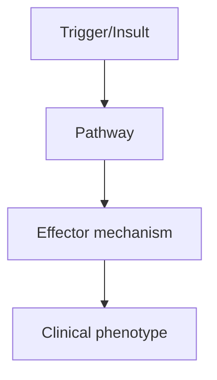
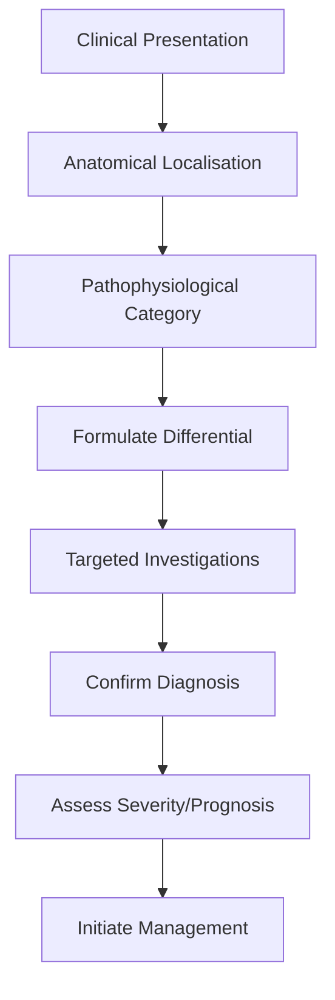
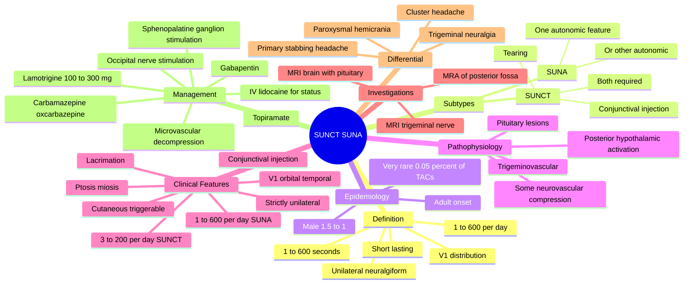

# SUNCT-SUNA

> [!tip] **High-Yield Definition**
> Short-lasting Unilateral Neuralgiform headache attacks with Conjunctival injection and Tearing (SUNCT) or with cranial Autonomic features (SUNA). Part of TACs. Attacks: 1-600/day, lasting 1-600 seconds.

---

## 1. Definition / Epidemiology / Classification

### Definition
Short-lasting Unilateral Neuralgiform headache attacks with Conjunctival injection and Tearing (SUNCT) or with cranial Autonomic features (SUNA). Part of TACs. Attacks: 1-600/day, lasting 1-600 seconds.

### Epidemiology
Very rare (0.05% of TACs). Male predominance (1.5:1). Adult onset.

### Classification
| Variant | Key Features | Prognosis |
|---------|-------------|-----------|
| | | |

---

## 2. Aetiology / Pathophysiology

### Aetiology
Posterior hypothalamic dysfunction. Trigeminovascular activation. Some cases have neurovascular compression of trigeminal nerve. Some associated with pituitary lesions.

### Pathophysiology

---

## 3. Clinical Features

### History
- **Onset/Duration:**
- **Progression:**
- **Key symptoms:**
- **Triggers:**
- **Systemic symptoms:**
- **Drug/Family/Social history:**

### Examination
| Domain | Key Findings | Localisation Value |
|--------|-------------|-------------------|
| | | |

### Specific Clinical Features
Strictly unilateral, severe, neuralgiform pain (orbital/temporal/V1). Brief: 5-240 sec (SUNCT), up to 10 min (SUNA). Very frequent: 3-200/day (SUNCT) or 1-600/day. Autonomic: prominent (SUNCT: conjunctival injection + tearing; SUNA: one or both). Triggered by cutaneous stimuli (touching face, chewing).

---

## 4. Diagnostic Approach / Algorithm

---

## 5. Investigations

MRI brain with pituitary protocol (exclude pituitary lesion, posterior fossa, trigeminal nerve). MRA. Diagnosis is clinical. Exclude trigeminal neuralgia (V2/V3 distribution, less frequent).

---

## 6. Differential Diagnosis

| Differential | Distinguishing Features | Key Test |
|--------------|------------------------|----------|
| | | |

---

## 7. Management

Difficult to treat. Acute: ineffective due to brevity. IV lidocaine (inpatient) for status. Prophylaxis: lamotrigine 100-300mg/day (most effective), topiramate 50-200mg, carbamazepine, gabapentin, topiramate, oxcarbazepine. Microvascular decompression if vascular compression on imaging. Greater occipital nerve blocks, sphenopalatine ganglion stimulation.

---

## 8. Drug Interactions / Contraindications / Comorbidity Cautions

| Drug | Interaction / Caution | Management |
|------|----------------------|------------|
| | | |

---

## 9. Procedures (if applicable)

### Procedure:
- **Indications:**
- **Contraindications:**
- **Preparation / Principle:**
- **Complications:**
- **Viva Pearls:**

---

## 10. Complications

| Complication | Frequency | Prevention / Monitoring | Management |
|--------------|-----------|------------------------|------------|
| | | | |

---

## 11. Red Flags / Emergencies

SUNCT/SUNA mimics trigeminal neuralgia but with autonomic features. New onset warrants MRI to exclude structural (pituitary, posterior fossa).

---

## 12. Prognosis

Chronic course, difficult to treat. Lamotrigine often effective. Sphenopalatine ganglion stimulation promising. MVD effective if vascular compression identified.

---

## 13. Topic Correlation

| Related Topic | Link | Key Overlap |
|---------------|------|-------------|
| | | |

---

## 14. Special Situations

| Situation | Consideration |
|-----------|---------------|
| **Pregnancy** | |
| **Lactation** | |
| **Paediatric** | |
| **Elderly / Frail** | |
| **Renal impairment** | |
| **Hepatic impairment** | |
| **Immunocompromised** | |
| **Perioperative** | |
| **Driving / DVLA** | |
| **Occupational** | |

---

## FCPS/MRCP High-Yield Summary

| Category | Key Points |
|----------|------------|
| **Definition** | Short-lasting Unilateral Neuralgiform headache attacks with Conjunctival injection and Tearing (SUNCT) or with cranial Autonomic features (SUNA). Part of TACs. Attacks: 1-600/day, lasting 1-600 second |
| **Epidemiology** | Very rare (0.05% of TACs). Male predominance (1.5:1). Adult onset. |
| **Pathophysiology** | |
| **Clinical** | Strictly unilateral, severe, neuralgiform pain (orbital/temporal/V1). Brief: 5-240 sec (SUNCT), up to 10 min (SUNA). Very frequent: 3-200/day (SUNCT) or 1-600/day. Autonomic: prominent (SUNCT: conjunc |
| **Diagnosis** | |
| **Investigations** | MRI brain with pituitary protocol (exclude pituitary lesion, posterior fossa, trigeminal nerve). MRA. Diagnosis is clinical. Exclude trigeminal neuralgia (V2/V3 distribution, less frequent). |
| **Management** | Difficult to treat. Acute: ineffective due to brevity. IV lidocaine (inpatient) for status. Prophylaxis: lamotrigine 100-300mg/day (most effective), topiramate 50-200mg, carbamazepine, gabapentin, top |
| **Complications** | |
| **Prognosis** | Chronic course, difficult to treat. Lamotrigine often effective. Sphenopalatine ganglion stimulation promising. MVD effective if vascular compression identified. |
| **Viva Pearls** | |
| **Drug Doses** | |
| **Scoring Systems** | |
| **Genetics** | |
| **Imaging Signs** | |

---

## Viva Questions (PACES/FCPS Style)

1. **Q:** Define SUNCT-SUNA and classify its variants.
   **A:** Based on the definition above.

2. **Q:** What are the key clinical features?
   **A:** Strictly unilateral, severe, neuralgiform pain (orbital/temporal/V1). Brief: 5-240 sec (SUNCT), up to 10 min (SUNA). Very frequent: 3-200/day (SUNCT) or 1-600/day. Autonomic: prominent (SUNCT: conjunctival injection + tearing; SUNA: one or both). Triggered by cutaneous stimuli (touching face, chewin

3. **Q:** What is the first-line treatment?
   **A:** Based on the management section.

4. **Q:** What are the red flags requiring urgent referral?
   **A:** SUNCT/SUNA mimics trigeminal neuralgia but with autonomic features. New onset warrants MRI to exclude structural (pituitary, posterior fossa).

5. **Q:** What is the prognosis?
   **A:** Chronic course, difficult to treat. Lamotrigine often effective. Sphenopalatine ganglion stimulation promising. MVD effective if vascular compression identified.

6. **Q:** How do you differentiate SUNCT-SUNA from key differentials?
   **A:** Clinical features, investigations, and response to treatment.

7. **Q:** What investigations are most useful?
   **A:** Based on the investigations section.

8. **Q:** Describe the stepwise management approach.
   **A:** Based on the management algorithm.

9. **Q:** What are the emergency presentations?
   **A:** Based on the red flags section.

10. **Q:** How does management change in pregnancy/paediatrics/elderly?
    **A:** Special considerations per population.

---

## Common Confusions / Exam Traps

| Confusion | Clarification |
|-----------|---------------|
| | |

---

## Mnemonics
1. **SUNCT** = **S**hort-lasting **U**nilateral **N**euralgiform headache attacks with **C**onjunctival injection and **T**earing (use: SUNCT — both conjunctival injection AND tearing are required)

2. **SUNA** = **S**hort-lasting **U**nilateral **N**euralgiform headache attacks with cranial **A**utonomic features (one or more — not necessarily both) (use: SUNA — fewer autonomic features required; only one of conjunctival injection or tearing, or other autonomic features)

3. **1-600 / 1-600** = SUNCT/SUNA quantitative ICHD-3 criteria: attack duration **1-600 seconds** (5-240 s for SUNCT, 2 s-10 min for SUNA), and **1-600 attacks per day** (use: SUNCT/SUNA numerical range)

4. **LOTS** = SUNCT/SUNA management hierarchy: **L**amotrigine first-line, **O**ccipital nerve block as adjunct, **T**opiramate/gabapentin alternatives, **S**phenopalatine ganglion stimulation for refractory disease (use: SUNCT/SUNA management options)

---

## Mind Map

---

## Spaced Repetition Trackers

| Review Interval | Date | Score (0-5) | Notes |
|-----------------|------|-------------|-------|
| Day 1 | | | |
| Day 3 | | | |
| Day 7 | | | |
| Day 14 | | | |
| Day 30 | | | |
| Day 90 | | | |

---

## Self-Test Scorecard

| Section | Score /5 | Last Attempt |
|---------|----------|--------------|
| Definition & Epidemiology | | | |
| Pathophysiology | | | |
| Clinical Features | | | |
| Investigations | | | |
| Differential | | | |
| Management - Acute | | | |
| Management - Prophylaxis | | | |
| Complications | | | |
| Viva Questions | | | |
| MCQs | | | |
| SBAs | | | |

---

## MCQs (10)

1. **Question:** What is the typical attack duration of SUNCT syndrome?
   **Options:** A. 1-60 seconds B. 5-240 seconds C. 2-30 minutes D. 15-180 minutes
   **Answer:** B
   **Explanation:** ICHD-3 3.3.1 criterion B: attacks of moderate or severe unilateral head pain lasting 5-240 seconds. SUNA attacks (ICHD-3 3.3.2) may last 2 seconds to 10 minutes.

2. **Question:** How does SUNA differ from SUNCT?
   **Options:** A. SUNA has different duration B. SUNA has only one of conjunctival injection or tearing, or other autonomic features C. SUNA is bilateral D. SUNA is a migraine variant
   **Answer:** B
   **Explanation:** SUNA (ICHD-3 3.3.2) requires only one of conjunctival injection, lacrimation, or other cranial autonomic features. SUNCT (3.3.1) requires both conjunctival injection and tearing. Both are part of the trigeminal autonomic cephalalgias.

3. **Question:** Which feature helps distinguish SUNCT from trigeminal neuralgia?
   **Options:** A. Trigger by cutaneous stimuli B. Strict unilaterality and prominent ipsilateral autonomic features C. Brief duration D. Severe pain
   **Answer:** B
   **Explanation:** SUNCT and TN can both be triggered by cutaneous stimuli. SUNCT is in V1 distribution (ophthalmic) with prominent ipsilateral autonomic features (lacrimation, conjunctival injection), whereas TN is typically in V2/V3 distribution without autonomic features.

4. **Question:** What is the first-line prophylaxis for SUNCT/SUNA?
   **Options:** A. Verapamil B. Indomethacin C. Lamotrigine 100-300 mg daily D. Propranolol
   **Answer:** C
   **Explanation:** Lamotrigine (100-300 mg/day) is the most effective prophylaxis for SUNCT/SUNA, with significant response in 50-80% of patients. Topiramate, gabapentin, carbamazepine and oxcarbazepine are second-line. Verapamil is for cluster headache, indomethacin for paroxysmal hemicrania, propranolol for migraine.

5. **Question:** What is the most appropriate acute treatment for SUNCT/SUNA?
   **Options:** A. Subcutaneous sumatriptan B. Indomethacin 50 mg tds C. Acute treatment is generally ineffective due to attack brevity; IV lidocaine can be used for status D. High-flow oxygen
   **Answer:** C
   **Explanation:** Attacks are too brief (<4 min) for oral acute therapy to be effective. IV lidocaine (1-3 mg/kg/hr) over several days is used for short-term prophylaxis in status or refractory cases. Long-term prophylaxis (lamotrigine) is the cornerstone.

6. **Question:** SUNCT/SUNA most commonly affects which trigeminal division?
   **Options:** A. V1 (ophthalmic) B. V2 (maxillary) C. V3 (mandibular) D. All divisions equally
   **Answer:** A
   **Explanation:** SUNCT/SUNA is characteristically in the V1 (ophthalmic) distribution — orbital, supraorbital, or temporal pain. This is a key differentiator from trigeminal neuralgia (typically V2/V3) and is associated with prominent ipsilateral cranial autonomic features.

7. **Question:** Which imaging is mandatory in suspected SUNCT/SUNA?
   **Options:** A. CT head B. MRI brain with pituitary protocol C. MRA only D. No imaging required
   **Answer:** B
   **Explanation:** MRI brain with pituitary protocol is mandatory in SUNCT/SUNA to exclude secondary causes, particularly pituitary adenomas (which can present with SUNCT-like attacks), posterior fossa lesions, and demyelination. SUNCT can be the first manifestation of a pituitary tumour.

8. **Question:** What is the most useful second-line prophylactic for SUNCT/SUNA if lamotrigine is not tolerated?
   **Options:** A. Carbamazepine B. Indomethacin C. Propranolol D. Lithium
   **Answer:** A
   **Explanation:** Carbamazepine (or oxcarbazepine) is the most useful second-line prophylactic, although response rates are lower than with lamotrigine. Topiramate and gabapentin are alternatives. Indomethacin is for hemicranias; propranolol is for migraine; lithium is for cluster.

9. **Question:** Sphenopalatine ganglion stimulation has been shown to be effective in:
   **Options:** A. Migraine B. Cluster headache and SUNCT/SUNA C. Tension-type headache D. Medication-overuse headache
   **Answer:** B
   **Explanation:** Sphenopalatine ganglion (SPG) stimulation has been shown to be effective in chronic cluster headache and SUNCT/SUNA in the Pathway CH-1 and ICON studies. It is a neuromodulatory option for refractory cases.

10. **Question:** A patient with SUNCT triggered by cutaneous stimuli does not respond to lamotrigine 300 mg/day. MRI shows vascular compression of the trigeminal nerve by the superior cerebellar artery. What is the next step?
    **Options:** A. Microvascular decompression (Jannetta procedure) B. Gamma knife radiosurgery C. Continue medical management only D. Occipital nerve stimulation only
    **Answer:** A
    **Explanation:** Microvascular decompression is the surgical treatment of choice for SUNCT/SUNA when there is demonstrable vascular compression of the trigeminal nerve on MRI, similar to trigeminal neuralgia. Success rates of 60-80% have been reported.

---

## SBA Questions (10)

1. **Scenario:** A 50-year-old man has 50 attacks per day of severe right orbital pain lasting 30-90 seconds, with ipsilateral conjunctival injection and lacrimation. Attacks can be triggered by touching his right cheek or chewing.
   **Question:** What is the most likely diagnosis?
   **Options:** A. Cluster headache B. Trigeminal neuralgia C. SUNCT syndrome D. Paroxysmal hemicrania
   **Answer:** C
   **Explanation:** SUNCT is characterised by 3-200 attacks per day of brief (5-240 s) unilateral orbital/temporal pain with conjunctival injection and tearing, often triggered by cutaneous stimuli. Cluster headaches are 15-180 min; PH is 2-30 min; TN is in V2/V3 without autonomic features.

2. **Scenario:** A 45-year-old woman with SUNCT syndrome does not respond to lamotrigine 300 mg/day. She has had attacks for 5 years with no remission. MRI brain is normal.
   **Question:** What is the next treatment option?
   **Options:** A. Topiramate 50-200 mg/day or gabapentin; consider occipital nerve block, IV lidocaine, sphenopalatine ganglion stimulation B. Verapamil 480 mg/day C. Indomethacin 75 mg tds D. Greater occipital nerve block alone
   **Answer:** A
   **Explanation:** After lamotrigine failure, options include topiramate, gabapentin, carbamazepine or oxcarbazepine. Greater occipital nerve blocks, IV lidocaine, and sphenopalatine ganglion stimulation are neuromodulatory options for refractory disease.

3. **Scenario:** A 60-year-old man with SUNCT syndrome has 100 attacks per day with severe autonomic features. He has been on lamotrigine and topiramate for 6 months with no improvement. He is disabled by the attacks.
   **Question:** What is the next step?
   **Options:** A. Continue medical management B. Refer for IV lidocaine infusion and consider sphenopalatine ganglion stimulation trial C. Lumbar puncture D. Surgical ligation of the trigeminal nerve
   **Answer:** B
   **Explanation:** In severe refractory SUNCT, IV lidocaine (1-3 mg/kg/hr) under cardiac monitoring can provide temporary remission, and sphenopalatine ganglion stimulation is a recognised neuromodulatory option. Occipital nerve stimulation is also used in refractory cases.

4. **Scenario:** A 35-year-old woman has brief attacks of unilateral orbital pain with only lacrimation (no conjunctival injection). She has 30 attacks per day. Indomethacin does not help.
   **Question:** What is the most likely diagnosis?
   **Options:** A. SUNCT B. SUNA C. Paroxysmal hemicrania D. Cluster headache
   **Answer:** B
   **Explanation:** SUNA (Short-lasting Unilateral Neuralgiform headache attacks with cranial Autonomic features) requires only one cranial autonomic feature — in this case, lacrimation. SUNCT requires both conjunctival injection and tearing. SUNA, like SUNCT, does not respond to indomethacin.

5. **Scenario:** A 40-year-old man with SUNCT syndrome is reviewed. He has no improvement with lamotrigine 400 mg/day. MRI shows contact between the superior cerebellar artery and the trigeminal nerve root entry zone.
   **Question:** What is the most appropriate surgical option?
   **Options:** A. Microvascular decompression B. Gamma knife radiosurgery C. Trigeminal nerve block D. Sphenopalatine ganglion stimulation
   **Answer:** A
   **Explanation:** In SUNCT/SUNA with demonstrable vascular compression of the trigeminal nerve, microvascular decompression (Jannetta procedure) is the surgical treatment of choice, with success rates of 60-80%.

6. **Scenario:** A patient with SUNCT syndrome is being considered for sphenopalatine ganglion stimulation.
   **Question:** What is the mechanism of action?
   **Options:** A. Inhibition of hypothalamic activity B. Modulation of parasympathetic outflow through the sphenopalatine ganglion C. Direct inhibition of trigeminal nerve D. Vasodilation of intracranial vessels
   **Answer:** B
   **Explanation:** The sphenopalatine ganglion (SPG) is a parasympathetic relay for the cranial autonomic symptoms of TACs. SPG stimulation modulates parasympathetic outflow, reducing lacrimation, nasal congestion, and may interrupt the trigeminal-autonomic reflex.

7. **Scenario:** A 30-year-old man with SUNCT syndrome is found to have a pituitary microadenoma on MRI.
   **Question:** What is the most appropriate next step?
   **Options:** A. Disregard the finding; SUNCT is a primary TAC B. Refer to endocrinology and pituitary surgery for management of the pituitary lesion; reassess SUNCT after treatment C. Start verapamil D. Lumbar puncture
   **Answer:** B
   **Explanation:** SUNCT can be the presenting feature of a pituitary lesion. Manage the pituitary lesion with endocrinology and neurosurgery. SUNCT may resolve after treatment of the underlying cause. Always exclude secondary causes before diagnosing primary SUNCT.

8. **Scenario:** A 50-year-old woman with SUNCT syndrome is started on lamotrigine. She has a history of Stevens-Johnson syndrome with carbamazepine.
   **Question:** What is the most appropriate action?
   **Options:** A. Avoid lamotrigine B. Start lamotrigine at a low dose (25 mg daily for 2 weeks) and titrate slowly with close monitoring for rash C. Use full-dose lamotrigine immediately D. Use carbamazepine at a low dose
   **Answer:** B
   **Explanation:** Lamotrigine can cause serious skin reactions (SJS/TEN), particularly with rapid titration. In patients with prior SJS history (e.g. to carbamazepine), start at a very low dose (25 mg daily or less) and titrate slowly. Counsel about rash, and stop immediately if any rash develops.

9. **Scenario:** A 40-year-old man with SUNCT syndrome is reviewed. His attacks are well controlled with lamotrigine 200 mg/day. He asks about prognosis.
   **Question:** What is the most appropriate response?
   **Options:** A. 'SUNCT is curable within months' B. 'SUNCT is usually chronic; lamotrigine can induce remission but attacks may recur when treatment is stopped' C. 'SUNCT will progress to stroke' D. 'SUNCT will resolve with menopause'
   **Answer:** B
   **Explanation:** SUNCT is usually chronic and may persist for years or decades. Lamotrigine and other prophylactics can suppress attacks effectively, but relapses occur on withdrawal. The episodic form has remission periods of months to years. Some patients have spontaneous remission after several years.

10. **Scenario:** A 25-year-old woman with SUNCT syndrome is found to be 8 weeks pregnant. She is on lamotrigine 200 mg/day.
    **Question:** What is the most appropriate management?
    **Options:** A. Stop lamotrigine immediately B. Discuss with obstetrics and neurology; lamotrigine is one of the safer antiepileptics in pregnancy (continue with monitoring of serum levels and fetal growth) C. Switch to topiramate D. Switch to sodium valproate
    **Answer:** B
    **Explanation:** Lamotrigine is the safest AED in pregnancy (along with levetiracetam) and is not associated with neural tube defects. Discuss with the patient the risks of stopping (severe attacks) versus continuing (low fetal risk). Monitor serum lamotrigine levels (clearance increases in pregnancy, dose may need to increase). Folic acid 5 mg daily. Sodium valproate and topiramate are teratogenic.

---

## Flashcards

- **Q:** What is the ICHD-3 definition of SUNCT?
  **A:** Strictly unilateral, moderate-to-severe head pain attacks lasting 5-240 seconds, occurring 3-200/day, with both ipsilateral conjunctival injection AND tearing.
- **Q:** How does SUNA differ from SUNCT?
  **A:** SUNA (3.3.2) requires only one cranial autonomic feature (e.g. lacrimation alone), while SUNCT (3.3.1) requires both conjunctival injection and tearing.
- **Q:** What is the typical attack duration and frequency of SUNCT/SUNA?
  **A:** Duration 5-240 seconds (SUNCT) or 2 s-10 min (SUNA); frequency 1-600 attacks/day.
- **Q:** What is the first-line prophylaxis for SUNCT/SUNA?
  **A:** Lamotrigine 100-300 mg/day.
- **Q:** What is the first-line acute treatment for SUNCT/SUNA?
  **A:** Acute treatment is generally ineffective due to attack brevity; IV lidocaine (1-3 mg/kg/hr) for status or refractory disease.
- **Q:** Name three second-line prophylactics for SUNCT/SUNA.
  **A:** Topiramate, gabapentin, carbamazepine or oxcarbazepine.
- **Q:** What imaging is mandatory in suspected SUNCT/SUNA?
  **A:** MRI brain with pituitary protocol, to exclude pituitary adenoma and other posterior fossa lesions.
- **Q:** How is SUNCT/SUNA distinguished from trigeminal neuralgia?
  **A:** SUNCT/SUNA is in V1 with prominent autonomic features; TN is in V2/V3 without prominent autonomic features.
- **Q:** What surgical treatment is effective for SUNCT/SUNA with vascular compression?
  **A:** Microvascular decompression (Jannetta procedure) — Teflon placed between the offending vessel and the trigeminal nerve.
- **Q:** What neuromodulation device is approved for refractory SUNCT/SUNA?
  **A:** Sphenopalatine ganglion (SPG) stimulation.

---

## Answer Key with Explanations

### MCQs
1. B - SUNCT attacks last 5-240 seconds.
2. B - SUNA requires only one autonomic feature; SUNCT requires both conjunctival injection and tearing.
3. B - Strict unilaterality, V1 distribution, and prominent autonomic features distinguish SUNCT from TN.
4. C - Lamotrigine is the first-line prophylaxis for SUNCT/SUNA.
5. C - Acute treatment is generally ineffective due to attack brevity; IV lidocaine for status.
6. A - SUNCT/SUNA is characteristically in the V1 (ophthalmic) distribution.
7. B - MRI brain with pituitary protocol is mandatory to exclude secondary causes.
8. A - Carbamazepine is the most useful second-line prophylactic for SUNCT/SUNA.
9. B - SPG stimulation is effective in chronic cluster headache and SUNCT/SUNA.
10. A - MVD is the surgical treatment of choice for SUNCT/SUNA with vascular compression.

### SBAs
1. C - SUNCT: brief, very frequent, neuralgiform, with both autonomic features, often cutaneously triggered.
2. A - Topiramate or gabapentin are second-line; consider occipital nerve block, IV lidocaine, SPG stimulation.
3. B - IV lidocaine and SPG stimulation are options for refractory SUNCT.
4. B - SUNA: only one autonomic feature required, e.g. lacrimation; no indomethacin response.
5. A - MVD is the surgical treatment of choice for SUNCT with vascular compression.
6. B - SPG stimulation modulates parasympathetic outflow and interrupts the trigeminal-autonomic reflex.
7. B - SUNCT can be a presenting feature of pituitary adenoma; treat the underlying cause.
8. B - Slow titration of lamotrigine reduces the risk of serious skin reactions.
9. B - SUNCT is usually chronic; lamotrigine suppresses attacks but relapses occur on withdrawal.
10. B - Lamotrigine is the safest AED in pregnancy; discuss risk-benefit with the patient.

---

## Tags
**Tags:** #neurology #headache #SUNCT #SUNA #trigeminal-autonomic-cephalalgia #TAC #lamotrigine #microvascular-decompression #sphenopalatine-ganglion #IV-lidocaine #pituitary #FCPS #MRCP

## Local Navigation
**Heading Hub:** [[../Hub]]  
**Chapter Hierarchy:** [[Davidson Chapter 25 - Neurology Hierarchy]]  
**Chapter MOC:** [[Neurology MOC]]  
**Drug Reference:** [[../00_Index/Neurology Drug Reference]]  
