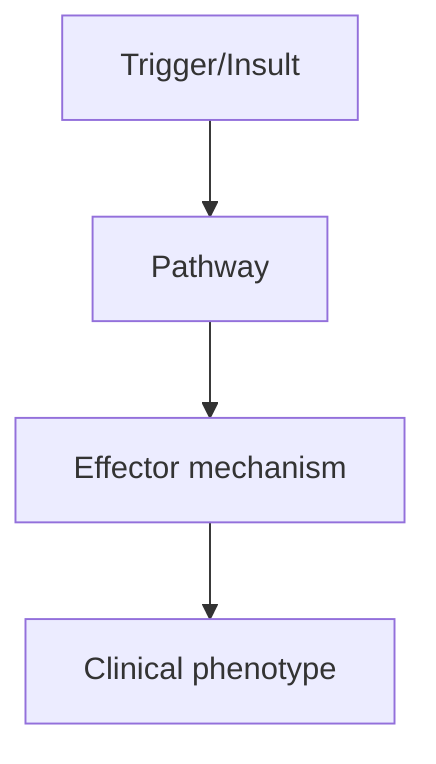
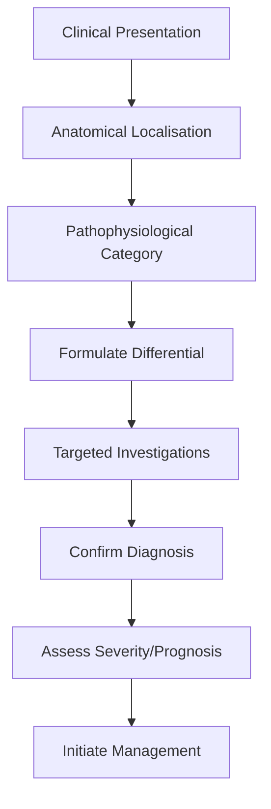
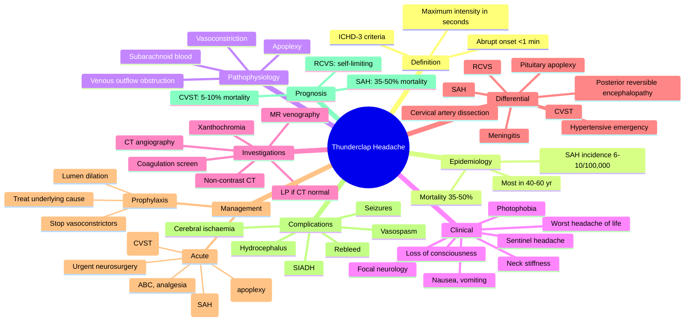

# Thunderclap Headache

> [!tip] **High-Yield Definition**
> Sudden onset, severe headache reaching maximum intensity within seconds to minutes. Considered SAH until proven otherwise. ICHD-3: severe headache with abrupt onset (<1 min), peaking within seconds/minutes.

---

## 1. Definition / Epidemiology / Classification

### Definition
Sudden onset, severe headache reaching maximum intensity within seconds to minutes. Considered SAH until proven otherwise. ICHD-3: severe headache with abrupt onset (<1 min), peaking within seconds/minutes.

### Epidemiology
SAH incidence: 6-10/100,000/year. RCVS: rare, female predominance. Thunderclap accounts for 1-3% of ED headache presentations.

### Classification
| Variant | Key Features | Prognosis |
|---------|-------------|-----------|
| | | |

---

## 2. Aetiology / Pathophysiology

### Aetiology
Vascular: SAH (aneurysm rupture), RCVS, cervical artery dissection, hypertensive emergency, posterior reversible encephalopathy syndrome (PRES), pituitary apoplexy, venous sinus thrombosis, ischaemic stroke. Non-vascular: thunderclap with normal investigations (benign thunderclap, mimics migraine).

### Pathophysiology

---

## 3. Clinical Features

### History
- **Onset/Duration:**
- **Progression:**
- **Key symptoms:**
- **Triggers:**
- **Systemic symptoms:**
- **Drug/Family/Social history:**

### Examination
| Domain | Key Findings | Localisation Value |
|--------|-------------|-------------------|
| | | |

### Specific Clinical Features
Sudden onset, severe ('worst headache of life', 'like a thunderclap', 'explosion'). Maximum intensity in <1 min. Nausea, vomiting common. Photophobia. May have sentinel headache (warning leak). Focal neurology may indicate aneurysm location. Meningism in SAH. Seizures, LOC.

---

## 4. Diagnostic Approach / Algorithm

---

## 5. Investigations

EMERGENCY: non-contrast CT head (sensitivity 95-98% within 6h, 80% at 24h, 50% at 7 days). If CT negative but high suspicion: LP for xanthochromia (sensitive 7-14 days). CTA/MRA to identify aneurysm. MRI brain (FLAIR, SWI) if available. Vasospasm risk: TCDs.

---

## 6. Differential Diagnosis

| Differential | Distinguishing Features | Key Test |
|--------------|------------------------|----------|
| | | |

---

## 7. Management

EMERGENCY resuscitation (ABCs), analgesia, antiemetics, IV fluids, nimodipine 60mg q4h PO for 21 days (SAH, prevents vasospasm). Neurosurgical/endovascular referral for aneurysm (clipping vs coiling). RCVS: supportive, calcium channel blockers (nimodipine, verapamil).

---

## 8. Drug Interactions / Contraindications / Comorbidity Cautions

| Drug | Interaction / Caution | Management |
|------|----------------------|------------|
| | | |

---

## 9. Procedures (if applicable)

### Procedure:
- **Indications:**
- **Contraindications:**
- **Preparation / Principle:**
- **Complications:**
- **Viva Pearls:**

---

## 10. Complications

| Complication | Frequency | Prevention / Monitoring | Management |
|--------------|-----------|------------------------|------------|
| | | | |

---

## 11. Red Flags / Emergencies

All thunderclap headaches = SAH until proven otherwise. Sudden 'worst headache', LOC, focal neurology, neck stiffness, vomiting. Always investigate.

---

## 12. Prognosis

SAH mortality 35-50% in first event, 50% overall. RCVS usually self-limiting (days to weeks). Long-term depends on underlying cause.

---

## 13. Topic Correlation

| Related Topic | Link | Key Overlap |
|---------------|------|-------------|
| | | |

---

## 14. Special Situations

| Situation | Consideration |
|-----------|---------------|
| **Pregnancy** | |
| **Lactation** | |
| **Paediatric** | |
| **Elderly / Frail** | |
| **Renal impairment** | |
| **Hepatic impairment** | |
| **Immunocompromised** | |
| **Perioperative** | |
| **Driving / DVLA** | |
| **Occupational** | |

---

## FCPS/MRCP High-Yield Summary

| Category | Key Points |
|----------|------------|
| **Definition** | Sudden onset, severe headache reaching maximum intensity within seconds to minutes. Considered SAH until proven otherwise. ICHD-3: severe headache with abrupt onset (<1 min), peaking within seconds/mi |
| **Epidemiology** | SAH incidence: 6-10/100,000/year. RCVS: rare, female predominance. Thunderclap accounts for 1-3% of ED headache presentations. |
| **Pathophysiology** | |
| **Clinical** | Sudden onset, severe ('worst headache of life', 'like a thunderclap', 'explosion'). Maximum intensity in <1 min. Nausea, vomiting common. Photophobia. May have sentinel headache (warning leak). Focal  |
| **Diagnosis** | |
| **Investigations** | EMERGENCY: non-contrast CT head (sensitivity 95-98% within 6h, 80% at 24h, 50% at 7 days). If CT negative but high suspicion: LP for xanthochromia (sensitive 7-14 days). CTA/MRA to identify aneurysm.  |
| **Management** | EMERGENCY resuscitation (ABCs), analgesia, antiemetics, IV fluids, nimodipine 60mg q4h PO for 21 days (SAH, prevents vasospasm). Neurosurgical/endovascular referral for aneurysm (clipping vs coiling). |
| **Complications** | |
| **Prognosis** | SAH mortality 35-50% in first event, 50% overall. RCVS usually self-limiting (days to weeks). Long-term depends on underlying cause. |
| **Viva Pearls** | |
| **Drug Doses** | |
| **Scoring Systems** | |
| **Genetics** | |
| **Imaging Signs** | |

---

## Viva Questions (PACES/FCPS Style)

1. **Q:** Define Thunderclap Headache and classify its variants.
   **A:** Based on the definition above.

2. **Q:** What are the key clinical features?
   **A:** Sudden onset, severe ('worst headache of life', 'like a thunderclap', 'explosion'). Maximum intensity in <1 min. Nausea, vomiting common. Photophobia. May have sentinel headache (warning leak). Focal neurology may indicate aneurysm location. Meningism in SAH. Seizures, LOC.

3. **Q:** What is the first-line treatment?
   **A:** Based on the management section.

4. **Q:** What are the red flags requiring urgent referral?
   **A:** All thunderclap headaches = SAH until proven otherwise. Sudden 'worst headache', LOC, focal neurology, neck stiffness, vomiting. Always investigate.

5. **Q:** What is the prognosis?
   **A:** SAH mortality 35-50% in first event, 50% overall. RCVS usually self-limiting (days to weeks). Long-term depends on underlying cause.

6. **Q:** How do you differentiate Thunderclap Headache from key differentials?
   **A:** Clinical features, investigations, and response to treatment.

7. **Q:** What investigations are most useful?
   **A:** Based on the investigations section.

8. **Q:** Describe the stepwise management approach.
   **A:** Based on the management algorithm.

9. **Q:** What are the emergency presentations?
   **A:** Based on the red flags section.

10. **Q:** How does management change in pregnancy/paediatrics/elderly?
    **A:** Special considerations per population.

---

## Common Confusions / Exam Traps

| Confusion | Clarification |
|-----------|---------------|
| | |

---

## Mnemonics
1. **SAH** = Subarachnoid Haemorrhage (use: most common life-threatening cause; non-contrast CT within 6 h is ~100% sensitive; xanthochromia on LP appears 6–12 h after bleed)
2. **RCVS** = Reversible Cerebral Vasoconstriction Syndrome (use: recurrent thunderclap over 1–2 weeks; "string-of-beads" vasoconstriction on CTA/MRA that resolves within 3 months)
3. **CVST** = Cerebral Venous Sinus Thrombosis (use: young woman, pregnant/postpartum, OCP, peripartum; treat with anticoagulation even with haemorrhagic infarct)

---

## Mind Map

---

## Spaced Repetition Trackers

| Review Interval | Date | Score (0-5) | Notes |
|-----------------|------|-------------|-------|
| Day 1 | | | |
| Day 3 | | | |
| Day 7 | | | |
| Day 14 | | | |
| Day 30 | | | |
| Day 90 | | | |

---

## Self-Test Scorecard

| Section | Score /5 | Last Attempt |
|---------|----------|--------------|
| Definition & Epidemiology | | | |
| Pathophysiology | | | |
| Clinical Features | | | |
| Investigations | | | |
| Differential | | | |
| Management - Acute | | | |
| Management - Prophylaxis | | | |
| Complications | | | |
| Viva Questions | | | |
| MCQs | | | |
| SBAs | | | |

---

## MCQs (10)

1. **Question:** A 45-year-old woman presents with sudden severe occipital headache reaching maximum intensity within 30 seconds while watching television. She has neck stiffness and photophobia. What is the most likely diagnosis?
   **Options:** A. Migraine with aura B. Subarachnoid haemorrhage C. Cluster headache D. Tension-type headache
   **Answer:** B
   **Explanation:** Sudden onset reaching maximum intensity in <1 min with neck stiffness and photophobia is classic for subarachnoid haemorrhage (ICHD-3 criteria for thunderclap headache). Migraine typically evolves over 30–60 min, cluster is shorter and recurring, and tension-type is gradual and band-like. Approximately 80% of non-traumatic SAH is from a ruptured saccular (berry) aneurysm of the circle of Willis.

2. **Question:** A patient presents 4 hours after a sudden severe headache. Non-contrast CT head is normal. What is the next best investigation?
   **Options:** A. Repeat CT in 24 hours B. Lumbar puncture for xanthochromia C. CT angiography D. MRI brain
   **Answer:** B
   **Explanation:** Within 6 hours, non-contrast CT is ~100% sensitive for SAH, but sensitivity falls after that. A normal CT at 4 h does not exclude SAH; lumbar puncture should be performed looking for xanthochromia (oxyhaemoglobin breakdown) which appears 6–12 h after the bleed and persists up to 2 weeks. CT angiography would identify an aneurysm but does not diagnose the bleed itself.

3. **Question:** A 32-year-old woman, 8 days postpartum, presents with recurrent severe headaches over 5 days, each peaking in seconds. She is on no medication. Examination is normal. What is the most likely diagnosis?
   **Options:** A. Subarachnoid haemorrhage B. Reversible cerebral vasoconstriction syndrome C. Cerebral venous sinus thrombosis D. Posterior reversible encephalopathy syndrome
   **Answer:** B
   **Explanation:** Recurrent thunderclap headaches over 1–2 weeks, postpartum state, and normal examination strongly suggest RCVS. The vasoconstriction in RCVS may not be visible on early imaging; CTA/MRA 1–2 weeks later typically shows "string-of-beads" vasoconstriction that resolves within 3 months. CVST usually presents with gradual headache, papilloedema, seizures or focal deficits, not recurrent thunderclap.

4. **Question:** Which of the following features is most suggestive of a sentinel headache (warning leak) prior to major aneurysmal SAH?
   **Options:** A. Photophobia lasting 6 hours B. Sudden severe headache resolving over hours with normal CT 4 days later C. Bilateral throbbing headache with aura D. Headache worse on lying flat
   **Answer:** B
   **Explanation:** A sentinel headache is a small "warning leak" of an aneurysm that causes a sudden severe headache which often resolves. If CT and LP at the time are missed, the patient presents later with a major SAH. About 30–50% of SAH patients describe a sentinel headache in the preceding 6 weeks. Migraine with aura evolves over 20–60 min, and orthostatic headache is more typical of spontaneous intracranial hypotension.

5. **Question:** A 28-year-old woman on the combined oral contraceptive pill presents with thunderclap headache, papilloedema and a focal seizure. CT shows a haemorrhagic infarct in the right parietal region. What is the most appropriate acute treatment?
   **Options:** A. Aspirin 300 mg B. Intravenous heparin (anticoagulation) C. Nimodipine D. IV methylprednisolone
   **Answer:** B
   **Explanation:** The combination of OCP use, papilloedema, seizures and a haemorrhagic venous infarct is classic for cerebral venous sinus thrombosis (CVST). Even in the presence of haemorrhagic infarct, anticoagulation with therapeutic dose LMWH/heparin is the standard of care, as the underlying problem is venous outflow obstruction and propagation of thrombus. Aspirin would worsen the situation and nimodipine is for SAH vasospasm.

6. **Question:** A 35-year-old man with acromegaly suddenly develops thunderclap headache, bitemporal hemianopia and ophthalmoplegia. What is the most likely diagnosis?
   **Options:** A. Bacterial meningitis B. Pituitary apoplexy C. RCVS D. Carotid dissection
   **Answer:** B
   **Explanation:** Pituitary apoplexy is haemorrhage or infarction of a pituitary adenoma, classically in patients with known macroadenoma (e.g. acromegaly, prolactinoma). The clinical tetrad is sudden severe headache, visual field defect (bitemporal hemianopia from chiasmal compression), ophthalmoplegia (cavernous sinus involvement of CN III, IV, VI) and altered mental status. It is a neurosurgical emergency; treatment is IV hydrocortisone (to treat secondary adrenal insufficiency) and urgent trans-sphenoidal decompression.

7. **Question:** A 38-year-old man develops sudden severe left-sided headache and neck pain after a minor road traffic accident 3 days ago. On examination the left pupil is small (2 mm) with mild ptosis. What is the most likely diagnosis?
   **Options:** A. SAH B. Cluster headache C. Internal carotid artery dissection D. Pituitary apoplexy
   **Answer:** C
   **Explanation:** Cervical artery dissection (carotid or vertebral) typically presents with sudden unilateral head/neck pain and a partial Horner's syndrome (ptosis and miosis without anhidrosis, as the sympathetic fibres to the face travel along the external carotid). It is a major cause of stroke in young adults; history of minor trauma, manipulation or sudden neck movement is common. Confirmation is with MRI fat-saturated T1 of the neck (crescent sign) or CTA.

8. **Question:** A patient with confirmed aneurysmal SAH develops new weakness and confusion on day 5. What is the most likely cause and the most appropriate specific treatment?
   **Options:** A. Rebleed – urgent surgery B. Hydrocephalus – external ventricular drain C. Delayed cerebral ischaemia from vasospasm – oral nimodipine 60 mg 4-hourly for 21 days D. Seizure – phenytoin
   **Answer:** C
   **Explanation:** Symptomatic vasospasm causing delayed cerebral ischaemia typically occurs between days 3 and 14, peaking around day 7. Nimodipine, an oral dihydropyridine calcium channel blocker given 60 mg 4-hourly for 21 days, reduces the risk of delayed ischaemic neurological deficit and improves outcome. "Triple-H" therapy (hypertension, hypervolaemia, haemodilution) is no longer routinely recommended. Rebleed usually occurs in the first 24 h; hydrocephalus is suggested by decreasing consciousness with normal pupils.

9. **Question:** A 25-year-old man presents with sudden severe headache after using recreational cocaine. CT and LP are normal. What is the most likely cause of his thunderclap headache?
   **Options:** A. Migraine triggered by cocaine B. Cerebral vasculitis C. RCVS due to sympathomimetic vasoconstriction D. Spontaneous intracranial hypotension
   **Answer:** C
   **Explanation:** Sympathomimetic drugs (cocaine, amphetamines, MDMA, methamphetamines), cannabis, triptans, ergot alkaloids and SSRIs can all precipitate reversible cerebral vasoconstriction syndrome by causing diffuse segmental vasoconstriction. Management is supportive, stopping the offending agent, and avoidance of further vasoconstrictors; magnesium and nimodipine are sometimes used. Cerebral vasculitis usually presents with weeks of symptoms, not abrupt thunderclap.

10. **Question:** Which of the following is the most appropriate first-line investigation for a patient presenting with thunderclap headache where subarachnoid haemorrhage must be excluded?
    **Options:** A. MRI brain B. Non-contrast CT head C. Lumbar puncture D. CT angiography
    **Answer:** B
    **Explanation:** Non-contrast CT head is the first-line investigation. Modern third-generation CT scanners have a sensitivity approaching 100% for SAH when performed within 6 hours of symptom onset, and the result is rapid and non-invasive. If CT is negative but the history is suggestive, or if presentation is >6 h from onset, lumbar puncture is performed looking for xanthochromia. CT angiography is reserved for identifying the source aneurysm after SAH is confirmed.
---

## SBA Questions (10)

1. **Scenario:** A 50-year-old man is brought to A&E after a sudden collapse. He has a GCS of 14, severe headache, neck stiffness, and a history of hypertension. CT shows diffuse subarachnoid blood in the basal cisterns.
   **Question:** Which of the following is the most appropriate next step in management?
   **Options:** A. CT angiography to identify an aneurysm B. Lumbar puncture C. MRI brain D. Start intravenous heparin
   **Answer:** A
   **Explanation:** Once SAH is confirmed on non-contrast CT, the next priority is to identify the source (usually a saccular aneurysm of the circle of Willis) by CT angiography. This guides definitive treatment (endovascular coiling or surgical clipping) which is undertaken as soon as feasible to reduce rebleed risk. Lumbar puncture is unnecessary once CT is diagnostic and is contraindicated with raised ICP. Heparin is absolutely contraindicated in acute SAH.

2. **Scenario:** A 55-year-old woman presents 12 hours after a thunderclap headache. CT is normal. CSF is uniformly blood-stained.
   **Question:** How do you interpret this CSF result?
   **Options:** A. Definite SAH B. Traumatic tap – exclude SAH C. Normal – SAH excluded D. Indicates meningitis
   **Answer:** B
   **Explanation:** Uniformly blood-stained CSF at 12 h could be traumatic tap, subarachnoid haemorrhage, or intracerebral haemorrhage tracking to the subarachnoid space. Xanthochromia (yellow discolouration from bilirubin) is the key distinguishing feature. If xanthochromia is absent, the tap was likely traumatic; if present, SAH is confirmed. The specimen should be centrifuged and examined spectrophotometrically, not just visually.

3. **Scenario:** A patient presents with sudden severe headache 4 hours ago. Non-contrast CT is reported as normal.
   **Question:** What is the sensitivity of non-contrast CT for SAH at this time point?
   **Options:** A. ~50% B. ~75% C. ~95-100% D. ~60%
   **Answer:** C
   **Explanation:** Modern third-generation CT scanners performed within 6 hours of symptom onset have a sensitivity of 98–100% for SAH when read by an experienced radiologist. After 6 h, sensitivity gradually falls as blood is reabsorbed and may be isodense; LP is recommended if CT is negative and clinical suspicion remains.

4. **Scenario:** A 48-year-old man with confirmed aneurysmal SAH is being managed on the neurosurgical unit. On day 7 he develops new right arm weakness and confusion. CT shows no new haemorrhage.
   **Question:** What is the most likely cause?
   **Options:** A. Rebleed B. Hydrocephalus C. Delayed cerebral ischaemia from vasospasm D. Seizure
   **Answer:** C
   **Explanation:** Vasospasm causing delayed cerebral ischaemia is most common between days 4 and 14, peaking at day 7. Patients on oral nimodipine 60 mg 4-hourly for 21 days have a reduced risk. Management includes maintaining euvolaemia, induced hypertension if stenoses are confirmed, and intra-arterial verapamil or angioplasty for refractory cases.

5. **Scenario:** A 26-year-old woman who is 6 weeks postpartum presents with sudden severe headache, focal seizure, and papilloedema. CT and CT venogram show a haemorrhagic infarct and filling defect in the superior sagittal sinus.
   **Question:** What is the most appropriate treatment?
   **Options:** A. Aspirin 300 mg daily B. Anticoagulation with therapeutic LMWH C. Surgical thrombectomy D. IV nimodipine
   **Answer:** B
   **Explanation:** Postpartum CVST is a classic scenario. Anticoagulation with therapeutic-dose LMWH (transitioned to warfarin or DOAC) is the standard of care, even in the presence of haemorrhagic venous infarct, as the risk of propagating thrombosis and worsening venous infarction outweighs the bleeding risk. Aspirin is inadequate. Surgical thrombectomy is reserved for selected patients with progressive deterioration despite anticoagulation.

6. **Scenario:** A 60-year-old man presents with sudden severe headache and diplopia. Examination reveals a complete right third nerve palsy with a fixed dilated pupil. He is haemodynamically stable.
   **Question:** What is the most likely diagnosis and appropriate first step?
   **Options:** A. Migrainous ophthalmoplegia – treat with triptans B. Posterior communicating artery aneurysm – urgent CTA and neurosurgical referral C. Diabetic third nerve palsy – observe D. Pituitary apoplexy – start hydrocortisone
   **Answer:** B
   **Explanation:** A painful third nerve palsy with pupillary involvement (fixed dilated pupil) suggests compression of the parasympathetic fibres, classically by a posterior communicating artery aneurysm. This is a neurosurgical emergency due to the high risk of imminent rupture. Urgent CT/CTA and referral to neurosurgery for definitive securing of the aneurysm (coiling or clipping) are required. Diabetic third nerve palsy spares the pupil.

7. **Scenario:** A 30-year-old man presents with sudden severe headache during sexual activity. CT and LP are both normal. CTA shows segmental vasoconstriction of multiple cerebral arteries.
   **Question:** What is the diagnosis and how should he be managed?
   **Options:** A. Migraine – start propranolol B. RCVS – stop any vasoconstrictors, supportive management, nimodipine often used C. CNS vasculitis – start high-dose steroids D. SAH – urgent coiling
   **Answer:** B
   **Explanation:** Thunderclap triggered by Valsalva/sexual activity with normal CT/LP and segmental vasoconstriction is most consistent with RCVS. Management is supportive, stopping any precipitating drugs (cocaine, triptans, SSRIs, sympathomimetics), and oral nimodipine is commonly used. Steroids are harmful in RCVS and should be avoided. CNS vasculitis usually presents subacutely with stroke-like deficits, encephalopathy and abnormal CSF.

8. **Scenario:** A patient with confirmed SAH develops a decreasing level of consciousness on day 2. Pupils are equal and reactive. CT shows enlarged lateral ventricles.
   **Question:** What is the most likely cause and treatment?
   **Options:** A. Vasospasm – nimodipine B. Hydrocephalus – external ventricular drain C. Rebleed – emergency craniotomy D. Seizure – phenytoin loading
   **Answer:** B
   **Explanation:** Acute hydrocephalus is common after SAH, especially when blood loads the basal cisterns and impairs CSF reabsorption. Treatment is insertion of an external ventricular drain (EVD) with CSF drainage, often combined with intracranial pressure monitoring. Vasospasm is unlikely this early; rebleed is usually catastrophic with pupillary changes; and there is no suggestion of seizure.

9. **Scenario:** A 24-year-old woman on the OCP develops a thunderclap headache and is found to have a left transverse sinus thrombosis on MRV with venous haemorrhagic infarct.
   **Question:** In addition to discontinuing the OCP, what is the most appropriate acute medical treatment?
   **Options:** A. Aspirin 300 mg B. Warfarin only after 4 weeks C. Therapeutic LMWH, then transition to warfarin or DOAC for 3–12 months D. IV thrombolysis
   **Answer:** C
   **Explanation:** Anticoagulation is the standard of care in CVST even in the presence of haemorrhagic venous infarction. Initial treatment is therapeutic LMWH; transition to warfarin (INR 2–3) or a DOAC for 3–12 months, with longer duration in recurrent or unprovoked cases. IV thrombolysis is reserved for deteriorating patients despite anticoagulation. Aspirin is inadequate and dangerous.

10. **Scenario:** A patient is being discharged after a normal CT 4 hours after thunderclap headache and a normal LP performed at 14 hours with no xanthochromia.
    **Question:** What is the appropriate discharge advice?
    **Options:** A. Reassure and discharge with no follow-up B. Discharge with safety-netting advice to return if any further severe headache, and arrange follow-up C. Discharge with sumatriptan to use if headache recurs D. Discharge with MRI brain in 3 months
    **Answer:** B
    **Explanation:** A normal CT within 6 h and a normal LP (no xanthochromia) performed at 14 h effectively excludes SAH, with a risk of missed SAH of <0.5%. The patient can be discharged with clear safety-netting advice to re-attend for any further sudden severe headache, and follow-up with the neurology or acute medical team. Triptans would be inappropriate without a clear diagnosis. Routine MRI brain is not indicated.

---

## Tags
**Tags:** #neurology #headache #thunderclap #SAH #RCVS #CVST #pituitary-apoplexy #dissection #FCPS #MRCP #emergency

## Local Navigation
**Heading Hub:** [[../Hub]]  
**Chapter Hierarchy:** [[Davidson Chapter 25 - Neurology Hierarchy]]  
**Chapter MOC:** [[Neurology MOC]]  
**Drug Reference:** [[../00_Index/Neurology Drug Reference]]  
