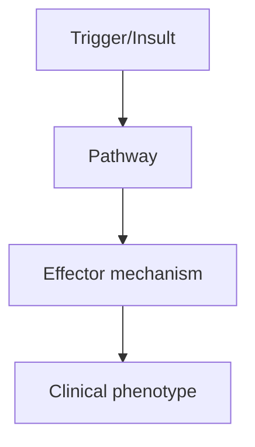
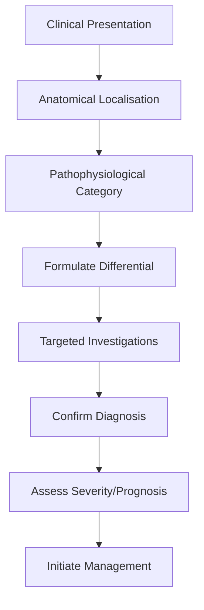
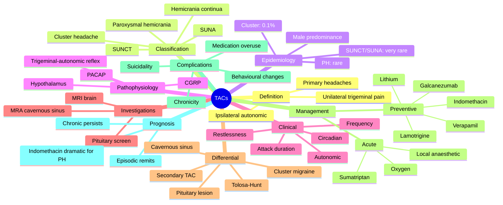

# Trigeminal Autonomic Cephalalgias Overview

> [!tip] **High-Yield Definition**
> Group of primary headache disorders sharing trigeminal pain + ipsilateral autonomic features: cluster headache, paroxysmal hemicrania, SUNCT/SUNA, hemicrania continua. Distinguished by attack duration, frequency, and treatment response (indomethacin for PH/hemicrania continua).

---

## 1. Definition / Epidemiology / Classification

### Definition
Group of primary headache disorders sharing trigeminal pain + ipsilateral autonomic features: cluster headache, paroxysmal hemicrania, SUNCT/SUNA, hemicrania continua. Distinguished by attack duration, frequency, and treatment response (indomethacin for PH/hemicrania continua).

### Epidemiology
TACs collectively rare (<1% of all headaches). Cluster: 0.1-0.4%. PH: very rare. SUNCT/SUNA: very rare. Hemicrania continua: rare.

### Classification
| Variant | Key Features | Prognosis |
|---------|-------------|-----------|
| | | |

---

## 2. Aetiology / Pathophysiology

### Aetiology
Common pathophysiology: posterior hypothalamic activation, trigeminovascular system, trigeminal-autonomic reflex. Different durations reflect differential activation patterns.

### Pathophysiology

---

## 3. Clinical Features

### History
- **Onset/Duration:**
- **Progression:**
- **Key symptoms:**
- **Triggers:**
- **Systemic symptoms:**
- **Drug/Family/Social history:**

### Examination
| Domain | Key Findings | Localisation Value |
|--------|-------------|-------------------|
| | | |

### Specific Clinical Features
Cluster: 15-180 min, 1-8/day, strict unilateral, severe, autonomic, restless, nocturnal pattern. PH: 2-30 min, >5/day, similar to cluster. SUNCT: 5-240 sec, very frequent, prominent autonomic. SUNA: 1-600 sec. Hemicrania continua: continuous unilateral headache with exacerbations, autonomic during exacerbations, ABSOLUTE indomethacin response.

---

## 4. Diagnostic Approach / Algorithm

---

## 5. Investigations

MRI brain (pituitary, posterior fossa, trigeminal nerve) to exclude structural cause. MRA. Diagnosis is clinical. Trial of indomethacin 25-75mg TDS for 7-14 days (diagnostic for PH and hemicrania continua).

---

## 6. Differential Diagnosis

| Differential | Distinguishing Features | Key Test |
|--------------|------------------------|----------|
| | | |

---

## 7. Management

Cluster: acute O2 + sumatriptan SC, prophylaxis verapamil. PH: indomethacin (diagnostic and therapeutic). SUNCT/SUNA: lamotrigine. Hemicrania continua: indomethacin. Avoid known triggers (alcohol, nitroglycerin in cluster).

---

## 8. Drug Interactions / Contraindications / Comorbidity Cautions

| Drug | Interaction / Caution | Management |
|------|----------------------|------------|
| | | |

---

## 9. Procedures (if applicable)

### Procedure:
- **Indications:**
- **Contraindications:**
- **Preparation / Principle:**
- **Complications:**
- **Viva Pearls:**

---

## 10. Complications

| Complication | Frequency | Prevention / Monitoring | Management |
|--------------|-----------|------------------------|------------|
| | | | |

---

## 11. Red Flags / Emergencies

New onset TAC features warrant MRI to exclude structural (pituitary, posterior fossa, aneurysm). Atypical features warrant further investigation.

---

## 12. Prognosis

Varies. PH and hemicrania continua respond to indomethacin. Cluster episodic has remission periods. SUNCT/SUNA chronic, difficult to treat.

---

## 13. Topic Correlation

| Related Topic | Link | Key Overlap |
|---------------|------|-------------|
| | | |

---

## 14. Special Situations

| Situation | Consideration |
|-----------|---------------|
| **Pregnancy** | |
| **Lactation** | |
| **Paediatric** | |
| **Elderly / Frail** | |
| **Renal impairment** | |
| **Hepatic impairment** | |
| **Immunocompromised** | |
| **Perioperative** | |
| **Driving / DVLA** | |
| **Occupational** | |

---

## FCPS/MRCP High-Yield Summary

| Category | Key Points |
|----------|------------|
| **Definition** | Group of primary headache disorders sharing trigeminal pain + ipsilateral autonomic features: cluster headache, paroxysmal hemicrania, SUNCT/SUNA, hemicrania continua. Distinguished by attack duration |
| **Epidemiology** | TACs collectively rare (<1% of all headaches). Cluster: 0.1-0.4%. PH: very rare. SUNCT/SUNA: very rare. Hemicrania continua: rare. |
| **Pathophysiology** | |
| **Clinical** | Cluster: 15-180 min, 1-8/day, strict unilateral, severe, autonomic, restless, nocturnal pattern. PH: 2-30 min, >5/day, similar to cluster. SUNCT: 5-240 sec, very frequent, prominent autonomic. SUNA: 1 |
| **Diagnosis** | |
| **Investigations** | MRI brain (pituitary, posterior fossa, trigeminal nerve) to exclude structural cause. MRA. Diagnosis is clinical. Trial of indomethacin 25-75mg TDS for 7-14 days (diagnostic for PH and hemicrania cont |
| **Management** | Cluster: acute O2 + sumatriptan SC, prophylaxis verapamil. PH: indomethacin (diagnostic and therapeutic). SUNCT/SUNA: lamotrigine. Hemicrania continua: indomethacin. Avoid known triggers (alcohol, nit |
| **Complications** | |
| **Prognosis** | Varies. PH and hemicrania continua respond to indomethacin. Cluster episodic has remission periods. SUNCT/SUNA chronic, difficult to treat. |
| **Viva Pearls** | |
| **Drug Doses** | |
| **Scoring Systems** | |
| **Genetics** | |
| **Imaging Signs** | |

---

## Viva Questions (PACES/FCPS Style)

1. **Q:** Define Trigeminal Autonomic Cephalalgias Overview and classify its variants.
   **A:** Based on the definition above.

2. **Q:** What are the key clinical features?
   **A:** Cluster: 15-180 min, 1-8/day, strict unilateral, severe, autonomic, restless, nocturnal pattern. PH: 2-30 min, >5/day, similar to cluster. SUNCT: 5-240 sec, very frequent, prominent autonomic. SUNA: 1-600 sec. Hemicrania continua: continuous unilateral headache with exacerbations, autonomic during e

3. **Q:** What is the first-line treatment?
   **A:** Based on the management section.

4. **Q:** What are the red flags requiring urgent referral?
   **A:** New onset TAC features warrant MRI to exclude structural (pituitary, posterior fossa, aneurysm). Atypical features warrant further investigation.

5. **Q:** What is the prognosis?
   **A:** Varies. PH and hemicrania continua respond to indomethacin. Cluster episodic has remission periods. SUNCT/SUNA chronic, difficult to treat.

6. **Q:** How do you differentiate Trigeminal Autonomic Cephalalgias Overview from key differentials?
   **A:** Clinical features, investigations, and response to treatment.

7. **Q:** What investigations are most useful?
   **A:** Based on the investigations section.

8. **Q:** Describe the stepwise management approach.
   **A:** Based on the management algorithm.

9. **Q:** What are the emergency presentations?
   **A:** Based on the red flags section.

10. **Q:** How does management change in pregnancy/paediatrics/elderly?
    **A:** Special considerations per population.

---

## Common Confusions / Exam Traps

| Confusion | Clarification |
|-----------|---------------|
| | |

---

## Mnemonics
1. **TAC** = Trigeminal Autonomic Cephalalgia (use: umbrella term for primary headaches with unilateral trigeminal pain plus ipsilateral cranial autonomic features; includes cluster, paroxysmal hemicrania, SUNCT/SUNA, hemicrania continua)
2. **CHRONO** for cluster headache (use: Circadian, Horner, Restless, Only unilateral, Nocturnal, Oxygen-responsive)
3. **INDO-TEST** = INDOmethacin trial is diagnostic for paroxysmal hemicrania and hemicrania continua (use: dramatic response to indomethacin 75–225 mg/day within 72 h)

---

## Mind Map

---

## Spaced Repetition Trackers

| Review Interval | Date | Score (0-5) | Notes |
|-----------------|------|-------------|-------|
| Day 1 | | | |
| Day 3 | | | |
| Day 7 | | | |
| Day 14 | | | |
| Day 30 | | | |
| Day 90 | | | |

---

## Self-Test Scorecard

| Section | Score /5 | Last Attempt |
|---------|----------|--------------|
| Definition & Epidemiology | | | |
| Pathophysiology | | | |
| Clinical Features | | | |
| Investigations | | | |
| Differential | | | |
| Management - Acute | | | |
| Management - Prophylaxis | | | |
| Complications | | | |
| Viva Questions | | | |
| MCQs | | | |
| SBAs | | | |

---

## MCQs (10)

1. **Question:** A 32-year-old man presents with severe unilateral peri-orbital pain lasting 60 minutes, occurring 3 times a day, associated with ipsilateral lacrimation, conjunctival injection, and a blocked nostril. He is restless and paces around. What is the most likely diagnosis?
   **Options:** A. Migraine B. Cluster headache C. Paroxysmal hemicrania D. SUNCT
   **Answer:** B
   **Explanation:** Cluster headache is characterised by severe strictly unilateral peri-orbital/temporal pain lasting 15–180 min, 1–8 attacks/day, with prominent ipsilateral autonomic features (lacrimation, conjunctival injection, rhinorrhoea, nasal congestion, ptosis, miosis, eyelid oedema) and a characteristic restlessness (in contrast to migraine where patients prefer to lie still). The duration (60 min) and frequency (3/day) are within the typical cluster range.

2. **Question:** A 38-year-old woman has 8 brief attacks per day of severe unilateral temple pain, each lasting 3 minutes, with ipsilateral lacrimation and conjunctival injection. The attacks respond completely to indomethacin 75 mg daily. What is the diagnosis?
   **Options:** A. Cluster headache B. Paroxysmal hemicrania C. SUNCT D. SUNA
   **Answer:** B
   **Explanation:** Paroxysmal hemicrania is defined by attacks lasting 2–30 min, occurring more than 5 times per day, with the same autonomic features as cluster. By definition, PH responds absolutely to indomethacin (typically 75–225 mg/day), which is both diagnostic and therapeutic. Cluster attacks are longer (15–180 min) and SUNCT attacks are much shorter (5–240 s) and far more frequent.

3. **Question:** A 40-year-old man has 80 brief attacks per day of unilateral sharp pain in the first division of the trigeminal nerve, each lasting 30 seconds, with prominent ipsilateral lacrimation. MRI brain is normal. What is the most likely diagnosis?
   **Options:** A. Cluster headache B. Paroxysmal hemicrania C. Trigeminal neuralgia D. SUNCT
   **Answer:** D
   **Explanation:** SUNCT (Short-lasting Unilateral Neuralgiform headache attacks with Conjunctival injection and Tearing) presents with very brief (5–240 s) attacks of unilateral pain (often in the V1 distribution) with prominent autonomic features, occurring 3–200 times per day. SUNA has the same duration but fewer autonomic features. The very high frequency (80/day) and short duration (30 s) are diagnostic.

4. **Question:** Which of the following is the diagnostic and therapeutic test of choice for paroxysmal hemicrania and hemicrania continua?
   **Options:** A. High-flow oxygen B. Sumatriptan 6 mg subcutaneous C. Indomethacin 75–225 mg/day trial D. Verapamil 240–480 mg/day
   **Answer:** C
   **Explanation:** Paroxysmal hemicrania and hemicrania continua are, by ICHD-3 criteria, defined by an absolute response to indomethacin. A trial of indomethacin (start 25 mg TDS, escalating to 75 mg TDS as needed) for up to 2 weeks is the diagnostic gold standard. Patients who do not respond do not have PH or hemicrania continua. The mechanism is uncertain but may involve COX inhibition in the trigeminal nucleus or hypothalamic pathways.

5. **Question:** Which hypothalamic region is most strongly implicated in the pathogenesis of cluster headache, and what is the clinical correlate?
   **Options:** A. Suprachiasmatic nucleus – circadian pattern of attacks B. Paraventricular nucleus – autonomic features C. Lateral hypothalamic area – appetite changes D. Preoptic nucleus – thermoregulation
   **Answer:** A
   **Explanation:** Functional imaging (PET, fMRI) has shown activation of the posterior hypothalamic grey matter (including the suprachiasmatic nucleus) during cluster attacks, explaining the characteristic circadian and circannual pattern (cluster bouts often occur at the same time of day and in the same season). This has led to the use of deep brain stimulation of the posterior hypothalamus for refractory chronic cluster headache.

6. **Question:** Which neuropeptide is most strongly implicated in the pathogenesis of TACs and is the therapeutic target of galcanezumab?
   **Options:** A. Substance P B. Calcitonin gene-related peptide (CGRP) C. Vasoactive intestinal peptide (VIP) D. Pituitary adenylate cyclase-activating polypeptide (PACAP)
   **Answer:** B
   **Explanation:** CGRP is released from trigeminal nerve endings during TAC attacks and is a key mediator of trigeminal pain. Galcanezumab is a humanised monoclonal antibody against CGRP, licensed for the prevention of episodic and chronic cluster headache. Fremanezumab (anti-CGRP) is licensed for migraine, and CGRP receptor antagonists (gepants) are also effective.

7. **Question:** A patient with cluster headache is started on verapamil 240 mg daily for prevention. What baseline and monitoring investigation is required?
   **Options:** A. Liver function tests B. 12-lead ECG (and during titration) C. Echocardiogram D. Thyroid function tests
   **Answer:** B
   **Explanation:** Verapamil is the first-line preventive for cluster headache. It can cause bradycardia and PR prolongation, sometimes progressing to heart block. A baseline 12-lead ECG is required, with repeat ECG during dose titration. Many neurologists use doses up to 720–960 mg/day in divided doses, with ECG monitoring at each dose increment. Beta-blockers and diltiazem should be avoided.

8. **Question:** A patient with an acute cluster attack is given 100% oxygen via a non-rebreather mask at 12 L/min for 15 minutes. What proportion of attacks are aborted by this therapy?
   **Options:** A. <10% B. ~25% C. ~50–75% D. ~95%
   **Answer:** C
   **Explanation:** High-flow 100% oxygen delivered via a non-rebreather mask at 12–15 L/min for 15–20 min is an effective acute therapy for cluster headache, aborting approximately 50–75% of attacks (placebo effect ~20%). It works by constricting cerebral vessels and inhibiting trigeminal activation. The mechanism is debated and is specific to TACs, not migraine. Patients should not smoke near the oxygen.

9. **Question:** A 45-year-old man presents with unilateral constant background headache with superimposed severe stabbing exacerbations, associated with ipsilateral lacrimation, conjunctival injection and ptosis. Symptoms are completely abolished by indomethacin. What is the diagnosis?
   **Options:** A. Cluster headache B. Hemicrania continua C. Chronic migraine D. SUNCT
   **Answer:** B
   **Explanation:** Hemicrania continua is a strictly unilateral, continuous, moderate background headache with superimposed severe exacerbations, accompanied by ipsilateral autonomic features (tearing, conjunctival injection, ptosis, miosis). By ICHD-3 definition, it responds absolutely to indomethacin. It is sometimes classified as a TAC, though it has a continuous rather than episodic pattern. Cluster is episodic; SUNCT attacks are short and frequent.

10. **Question:** Which of the following features is most useful in distinguishing cluster headache from migraine?
    **Options:** A. Unilateral pain B. Photophobia C. Restlessness and pacing during the attack D. Association with menses
    **Answer:** C
    **Explanation:** Behaviour during the attack is a key differentiator. Cluster patients are typically restless, pacing, rocking or even banging their head (they cannot lie still). Migraineurs prefer a dark, quiet room and remain still because movement worsens the pain. Restlessness in a severe unilateral headache is a classic pointer to TAC. Photophobia can occur in both; unilateral pain and menses association are common in migraine.
---

## SBA Questions (10)

1. **Scenario:** A 30-year-old man with episodic cluster headache is in the middle of a 6-week bout, with 2–3 attacks daily lasting 60 minutes each.
   **Question:** What is the most appropriate acute therapy for an individual attack?
   **Options:** A. Oral sumatriptan 50 mg B. Subcutaneous sumatriptan 6 mg and/or 100% oxygen at 12 L/min via non-rebreather mask C. Oral paracetamol 1 g D. Oral morphine 10 mg
   **Answer:** B
   **Explanation:** Acute treatment of a cluster attack is subcutaneous sumatriptan 6 mg (most effective; onset ~10 min) and/or 100% oxygen at 12–15 L/min via a non-rebreather mask for 15–20 min. Oral triptans are too slow. Opioids should be avoided due to risk of dependence; simple analgesics are ineffective. Intranasal sumatriptan and zolmitriptan are alternatives if SC is not available.

2. **Scenario:** A 35-year-old man with chronic cluster headache requires preventive therapy. He has no contraindications.
   **Question:** What is the first-line preventive agent?
   **Options:** A. Propranolol B. Topiramate C. Verapamil (typically 240–480 mg/day) D. Amitriptyline
   **Answer:** C
   **Explanation:** Verapamil is the first-line preventive for cluster headache, with efficacy superior to lithium in randomised data. It is started at 240 mg/day in divided doses and titrated up (often to 480–720 mg, occasionally 960 mg). Baseline and serial 12-lead ECGs are mandatory because of the risk of bradycardia and heart block. Beta-blockers (propranolol) are for migraine, not cluster.

3. **Scenario:** A 40-year-old woman has 12 brief attacks of unilateral pain per day, each lasting 8 minutes, with ipsilateral lacrimation and rhinorrhoea. Indomethacin 75 mg daily produces complete relief within 48 hours.
   **Question:** What is the most likely diagnosis and expected long-term treatment?
   **Options:** A. Cluster headache – verapamil B. Paroxysmal hemicrania – continue indomethacin long term C. SUNCT – lamotrigine D. SUNA – topiramate
   **Answer:** B
   **Explanation:** The combination of frequent short attacks (2–30 min, >5/day) and an absolute response to indomethacin is diagnostic of paroxysmal hemicrania. Treatment must be continued long term, often at the lowest effective dose (e.g. 25 mg TDS); relapse is common on stopping. Indomethacin gastrointestinal side effects require co-prescription of a proton pump inhibitor.

4. **Scenario:** A 42-year-old man has 60 brief attacks per day of unilateral V1 pain, each lasting 30 seconds, with prominent ipsilateral conjunctival injection and tearing. MRI brain and pituitary screen are normal.
   **Question:** What is the diagnosis and what is the most appropriate preventive treatment?
   **Options:** A. SUNCT – first-line preventive is lamotrigine (or topiramate, gabapentin) B. Cluster headache – verapamil C. Paroxysmal hemicrania – indomethacin D. SUNA – carbamazepine
   **Answer:** A
   **Explanation:** SUNCT/SUNA is characterised by very brief (5–240 s) attacks of unilateral pain, predominantly in V1, with marked autonomic features. The first-line preventive is lamotrigine (typically 100–300 mg/day), with topiramate and gabapentin as alternatives. Verapamil is ineffective; indomethacin is for PH. Carbamazepine is more useful in trigeminal neuralgia.

5. **Scenario:** A patient is started on verapamil for chronic cluster headache. The dose is increased from 240 mg to 360 mg daily.
   **Question:** Which investigation must be repeated?
   **Options:** A. Serum electrolytes B. 12-lead ECG C. Liver function tests D. Serum verapamil level
   **Answer:** B
   **Explanation:** Verapamil can cause bradycardia and PR prolongation that may progress to heart block. ECG is mandatory at baseline, after each dose increment, and periodically. Many neurologists will only increase the dose if the PR interval remains normal and the heart rate acceptable. Verapamil levels are not routinely used.

6. **Scenario:** A patient is given 100% oxygen for an acute cluster attack. The nurse asks why the mask must be a non-rebreather and the flow must be at least 12 L/min.
   **Question:** What is the most accurate explanation?
   **Options:** A. To deliver the highest possible FiO2 and ensure cerebral vasoconstriction B. To avoid CO2 retention C. To reduce fire risk D. To humidify the oxygen
   **Answer:** A
   **Explanation:** A non-rebreather mask at 12–15 L/min delivers close to 100% FiO2, which is required to produce the rapid cerebral vasoconstriction that aborts the cluster attack. Lower flow rates (e.g. 4 L/min via nasal cannula) are ineffective. Humidification is sometimes used for comfort but is not the rationale. Smoking should be strictly avoided.

7. **Scenario:** A 50-year-old man presents with a 6-month history of unilateral severe headaches, occurring 3 times a day, each lasting 90 minutes, with autonomic features. He paces the room. The pattern is identical every day. Brain MRI is normal.
   **Question:** What is the diagnosis and which prophylactic is first-line?
   **Options:** A. Migraine – propranolol B. Cluster headache – verapamil C. PH – indomethacin D. SUNCT – lamotrigine
   **Answer:** B
   **Explanation:** Strictly unilateral attacks lasting 15–180 min, 1–8/day, with autonomic features and restlessness, occurring in a circadian pattern, are diagnostic of cluster headache. The first-line preventive is verapamil. Indomethacin would be for PH; lamotrigine for SUNCT. The restlessness and circadian pattern strongly point to cluster.

8. **Scenario:** A patient with suspected TACs presents to the neurology clinic. Examination is normal, but the history is somewhat atypical (longer duration, persistent, partial autonomic features).
   **Question:** What imaging should be performed?
   **Options:** A. No imaging – primary headache diagnosis B. MRI brain with pituitary protocol and MRA of the circle of Willis C. CT head only D. MR venography
   **Answer:** B
   **Explanation:** Secondary causes must be excluded in TACs, especially when the presentation is atypical or not absolutely typical of one of the classical syndromes. MRI brain with a dedicated pituitary protocol (looking for microadenoma) and MRA of the circle of Willis (aneurysm, vascular anomaly) is the minimum. Cavernous sinus lesions (Tolosa-Hunt, meningioma) and posterior fossa lesions can also mimic TACs.

9. **Scenario:** A patient with chronic SUNCT is refractory to lamotrigine, topiramate and gabapentin. Neuromodulation is being considered.
   **Question:** Which surgical target has the best evidence for SUNCT/SUNA?
   **Options:** A. Microvascular decompression of the trigeminal nerve B. Posterior hypothalamic deep brain stimulation C. Occipital nerve stimulation D. Vagus nerve stimulation
   **Answer:** A
   **Explanation:** In contrast to cluster headache (where posterior hypothalamic deep brain stimulation has shown benefit in refractory cases), SUNCT/SUNA, like trigeminal neuralgia, may respond to microvascular decompression of the trigeminal nerve when there is demonstrable vascular compression. Occipital and vagus nerve stimulation have shown modest benefit in chronic cluster headache.

10. **Scenario:** A 36-year-old man with chronic cluster headache is being considered for anti-CGRP therapy. He has had an inadequate response to verapamil, lithium and topiramate.
    **Question:** Which agent is licensed for prevention of cluster headache?
    **Options:** A. Erenumab B. Fremanezumab C. Galcanezumab D. OnabotulinumtoxinA
    **Answer:** C
    **Explanation:** Galcanezumab is a humanised monoclonal antibody against CGRP, licensed for both episodic and chronic cluster headache prevention (300 mg subcutaneously monthly) and also for migraine. Erenumab (anti-CGRP receptor) and fremanezumab (anti-CGRP) are licensed for migraine. OnabotulinumtoxinA is for chronic migraine. CGRP therapy is an option for refractory cluster patients.

---

## Tags
**Tags:** #neurology #headache #TAC #cluster-headache #paroxysmal-hemicrania #SUNCT #SUNA #hemicrania-continua #indomethacin #verapamil #CGRP #FCPS #MRCP

## Local Navigation
**Heading Hub:** [[../Hub]]  
**Chapter Hierarchy:** [[Davidson Chapter 25 - Neurology Hierarchy]]  
**Chapter MOC:** [[Neurology MOC]]  
**Drug Reference:** [[../00_Index/Neurology Drug Reference]]  
