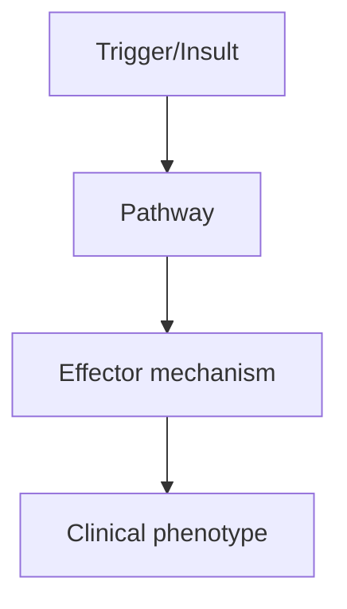
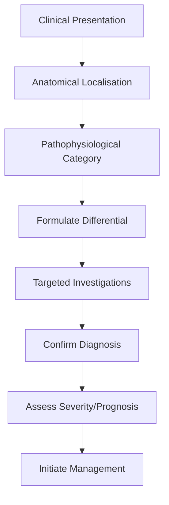
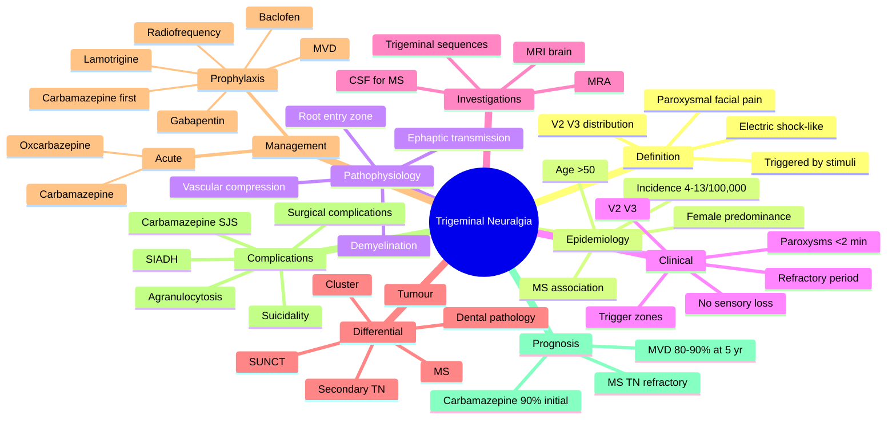

# Trigeminal Neuralgia

> [!tip] **High-Yield Definition**
> Classical (idiopathic/ vascular compression): brief, electric shock-like, unilateral facial pain in trigeminal distribution. Secondary: MS, tumour, vascular malformation. ICHD-3 criteria: paroxysmal, <2min, V2/V3, triggered by light touch, eating, wind.

---

## 1. Definition / Epidemiology / Classification

### Definition
Classical (idiopathic/ vascular compression): brief, electric shock-like, unilateral facial pain in trigeminal distribution. Secondary: MS, tumour, vascular malformation. ICHD-3 criteria: paroxysmal, <2min, V2/V3, triggered by light touch, eating, wind.

### Epidemiology
Incidence: 4-13/100,000/year. Female > male (3:2). Age >50. MS association (2-5% of MS patients have TN).

### Classification
| Variant | Key Features | Prognosis |
|---------|-------------|-----------|
| | | |

---

## 2. Aetiology / Pathophysiology

### Aetiology
Classical: neurovascular compression at root entry zone (superior cerebellar artery 75%, AICA, vein). Secondary: MS (demyelination), pontine tumour, CPA tumour, vascular malformation, base of skull tumour.

### Pathophysiology

---

## 3. Clinical Features

### History
- **Onset/Duration:**
- **Progression:**
- **Key symptoms:**
- **Triggers:**
- **Systemic symptoms:**
- **Drug/Family/Social history:**

### Examination
| Domain | Key Findings | Localisation Value |
|--------|-------------|-------------------|
| | | |

### Specific Clinical Features
Brief (seconds to <2 min) electric shock-like, stabbing, burning pain. V2/V3 most common (rarely V1). Trigger zones: perioral, nasolabial fold, teeth. Triggers: chewing, talking, washing face, cold wind, light touch. Unilateral. No neurological deficit between attacks. Status trigeminus: persistent pain.

---

## 4. Diagnostic Approach / Algorithm

---

## 5. Investigations

MRI brain with trigeminal protocol (thin-cut T2/CISS/FIESTA + MRA) to exclude secondary cause, identify vascular compression. CSF if MS suspected. No investigation needed for typical TN with response to carbamazepine in elderly.

---

## 6. Differential Diagnosis

| Differential | Distinguishing Features | Key Test |
|--------------|------------------------|----------|
| | | |

---

## 7. Management

First-line: Carbamazepine 200-1200mg/day (effective in 90%). Oxcarbazepine 300-1800mg/day (better tolerated, equally effective). Second-line: baclofen, lamotrigine, gabapentin, oxcarbazepine. Surgical: microvascular decompression (MVD, 90% initial relief, 80% at 5y), gamma knife SRS, percutaneous procedures (glycerol rhizotomy, balloon compression, radiofrequency) for elderly/medical unfit.

---

## 8. Drug Interactions / Contraindications / Comorbidity Cautions

| Drug | Interaction / Caution | Management |
|------|----------------------|------------|
| | | |

---

## 9. Procedures (if applicable)

### Procedure:
- **Indications:**
- **Contraindications:**
- **Preparation / Principle:**
- **Complications:**
- **Viva Pearls:**

---

## 10. Complications

| Complication | Frequency | Prevention / Monitoring | Management |
|--------------|-----------|------------------------|------------|
| | | | |

---

## 11. Red Flags / Emergencies

Bilateral TN, sensory loss, V1 distribution with ophthalmic division (V1), young age, hearing loss, MS features - all warrant MRI to exclude secondary cause.

---

## 12. Prognosis

Carbamazepine effective in 90%. MVD provides long-term relief in 80-90% of classical TN. Secondary TN prognosis depends on underlying cause.

---

## 13. Topic Correlation

| Related Topic | Link | Key Overlap |
|---------------|------|-------------|
| | | |

---

## 14. Special Situations

| Situation | Consideration |
|-----------|---------------|
| **Pregnancy** | |
| **Lactation** | |
| **Paediatric** | |
| **Elderly / Frail** | |
| **Renal impairment** | |
| **Hepatic impairment** | |
| **Immunocompromised** | |
| **Perioperative** | |
| **Driving / DVLA** | |
| **Occupational** | |

---

## FCPS/MRCP High-Yield Summary

| Category | Key Points |
|----------|------------|
| **Definition** | Classical (idiopathic/ vascular compression): brief, electric shock-like, unilateral facial pain in trigeminal distribution. Secondary: MS, tumour, vascular malformation. ICHD-3 criteria: paroxysmal,  |
| **Epidemiology** | Incidence: 4-13/100,000/year. Female > male (3:2). Age >50. MS association (2-5% of MS patients have TN). |
| **Pathophysiology** | |
| **Clinical** | Brief (seconds to <2 min) electric shock-like, stabbing, burning pain. V2/V3 most common (rarely V1). Trigger zones: perioral, nasolabial fold, teeth. Triggers: chewing, talking, washing face, cold wi |
| **Diagnosis** | |
| **Investigations** | MRI brain with trigeminal protocol (thin-cut T2/CISS/FIESTA + MRA) to exclude secondary cause, identify vascular compression. CSF if MS suspected. No investigation needed for typical TN with response  |
| **Management** | First-line: Carbamazepine 200-1200mg/day (effective in 90%). Oxcarbazepine 300-1800mg/day (better tolerated, equally effective). Second-line: baclofen, lamotrigine, gabapentin, oxcarbazepine. Surgical |
| **Complications** | |
| **Prognosis** | Carbamazepine effective in 90%. MVD provides long-term relief in 80-90% of classical TN. Secondary TN prognosis depends on underlying cause. |
| **Viva Pearls** | |
| **Drug Doses** | |
| **Scoring Systems** | |
| **Genetics** | |
| **Imaging Signs** | |

---

## Viva Questions (PACES/FCPS Style)

1. **Q:** Define Trigeminal Neuralgia and classify its variants.
   **A:** Based on the definition above.

2. **Q:** What are the key clinical features?
   **A:** Brief (seconds to <2 min) electric shock-like, stabbing, burning pain. V2/V3 most common (rarely V1). Trigger zones: perioral, nasolabial fold, teeth. Triggers: chewing, talking, washing face, cold wind, light touch. Unilateral. No neurological deficit between attacks. Status trigeminus: persistent 

3. **Q:** What is the first-line treatment?
   **A:** Based on the management section.

4. **Q:** What are the red flags requiring urgent referral?
   **A:** Bilateral TN, sensory loss, V1 distribution with ophthalmic division (V1), young age, hearing loss, MS features - all warrant MRI to exclude secondary cause.

5. **Q:** What is the prognosis?
   **A:** Carbamazepine effective in 90%. MVD provides long-term relief in 80-90% of classical TN. Secondary TN prognosis depends on underlying cause.

6. **Q:** How do you differentiate Trigeminal Neuralgia from key differentials?
   **A:** Clinical features, investigations, and response to treatment.

7. **Q:** What investigations are most useful?
   **A:** Based on the investigations section.

8. **Q:** Describe the stepwise management approach.
   **A:** Based on the management algorithm.

9. **Q:** What are the emergency presentations?
   **A:** Based on the red flags section.

10. **Q:** How does management change in pregnancy/paediatrics/elderly?
    **A:** Special considerations per population.

---

## Common Confusions / Exam Traps

| Confusion | Clarification |
|-----------|---------------|
| | |

---

## Mnemonics
1. **TN** = Trigeminal Neuralgia (use: paroxysmal electric shock-like pain in V2/V3 distribution, triggered by light touch, chewing or talking; rule out secondary causes with MRI)
2. **CARB-FIRST** for treatment (use: Carbamazepine is the first-line therapy (NNT ~2), titrate slowly to 200–400 mg TDS; oxcarbazepine is an equivalent alternative with fewer drug interactions)
3. **MVD** = MicroVascular Decompression (use: definitive surgical treatment for classical TN with neurovascular compression on MRI; superior long-term pain relief in 80–90% at 5 years)

---

## Mind Map

---

## Spaced Repetition Trackers

| Review Interval | Date | Score (0-5) | Notes |
|-----------------|------|-------------|-------|
| Day 1 | | | |
| Day 3 | | | |
| Day 7 | | | |
| Day 14 | | | |
| Day 30 | | | |
| Day 90 | | | |

---

## Self-Test Scorecard

| Section | Score /5 | Last Attempt |
|---------|----------|--------------|
| Definition & Epidemiology | | | |
| Pathophysiology | | | |
| Clinical Features | | | |
| Investigations | | | |
| Differential | | | |
| Management - Acute | | | |
| Management - Prophylaxis | | | |
| Complications | | | |
| Viva Questions | | | |
| MCQs | | | |
| SBAs | | | |

---

## MCQs (10)

1. **Question:** A 62-year-old woman presents with a 6-month history of brief, electric shock-like pains in the right cheek and jaw, triggered by brushing her teeth, talking and eating. Examination is normal. What is the most likely diagnosis?
   **Options:** A. Cluster headache B. Trigeminal neuralgia C. Temporomandibular joint dysfunction D. Paroxysmal hemicrania
   **Answer:** B
   **Explanation:** Brief (seconds to 2 min) electric shock-like pains in the V2/V3 distribution, triggered by innocuous stimuli (touch, chewing, talking, brushing teeth) in a patient with a normal examination, are the classic features of classical trigeminal neuralgia. Cluster headache attacks are longer (15–180 min), associated with autonomic features, and patients are restless. TMJ pain is continuous, related to jaw movement, and the joint is tender on palpation.

2. **Question:** Which of the following is the first-line pharmacological treatment for classical trigeminal neuralgia?
   **Options:** A. Amitriptyline B. Carbamazepine C. Topiramate D. Gabapentin
   **Answer:** B
   **Explanation:** Carbamazepine 200–400 mg two or three times daily is the first-line treatment for classical trigeminal neuralgia, with an NNT of approximately 1.7–1.9 for meaningful pain relief. Oxcarbazepine is an equally effective alternative with a more favourable side-effect profile and fewer drug interactions. Gabapentin and amitriptyline are second-line. Topiramate is used for migraine prophylaxis, not TN.

3. **Question:** A 28-year-old woman with known multiple sclerosis presents with bilateral trigeminal neuralgia. Examination reveals reduced pinprick sensation in the right V2 distribution. Which investigation is most appropriate?
   **Options:** A. Carotid Doppler B. MRI brain with trigeminal protocol (high-resolution T2/CISS/FIESTA sequences) C. Lumbar puncture for oligoclonal bands only D. Nerve conduction studies
   **Answer:** B
   **Explanation:** Young age, bilateral pain and the presence of trigeminal sensory loss strongly suggest secondary trigeminal neuralgia. MRI brain with high-resolution T2 or CISS/FIESTA sequences along the course of the trigeminal nerve is the imaging of choice, looking for a vessel compressing the nerve, a cerebellopontine angle mass, a cavernous sinus lesion, or demyelinating plaques in the pons. LP for OCBs may support MS, but the immediate priority is imaging.

4. **Question:** A patient with classical trigeminal neuralgia has an excellent but unsustained response to carbamazepine, with severe side effects of drowsiness and hyponatraemia. What is the most appropriate next step?
   **Options:** A. Switch to gabapentin B. Switch to oxcarbazepine C. Stop treatment and observe D. Microvascular decompression
   **Answer:** B
   **Explanation:** Oxcarbazepine is the most appropriate next step. It is structurally related to carbamazepine and equally effective in TN but has a more favourable side-effect profile, fewer drug interactions, and a lower incidence of severe blood dyscrasias. Hyponatraemia can still occur, so monitoring is required. Switching to gabapentin is reasonable if oxcarbazepine is not tolerated, but evidence is weaker. Stopping treatment risks relapse.

5. **Question:** Where in the trigeminal pathway is the vascular compression that is thought to cause classical trigeminal neuralgia?
   **Options:** A. Trigeminal ganglion in Meckel's cave B. Cisternal segment at the root entry zone into the pons C. Cavernous sinus segment D. Peripheral V2/V3 branches in the face
   **Answer:** B
   **Explanation:** The neurovascular conflict in classical TN is usually at the root entry zone of the trigeminal nerve into the pons (the cisternal segment), most often by an ectatic superior cerebellar artery. Local demyelination at this point allows ephaptic transmission between light-touch (A-beta) and pain (A-delta) fibres, producing the triggered paroxysms. This is the segment that microvascular decompression targets.

6. **Question:** A 70-year-old man with classical right V2 trigeminal neuralgia has had an excellent response to carbamazepine but develops a fever, mouth ulcers and a falling neutrophil count. Which adverse effect of carbamazepine is most likely responsible?
   **Options:** A. Stevens-Johnson syndrome B. Aplastic anaemia/agranulocytosis C. SIADH D. Serotonin syndrome
   **Answer:** B
   **Explanation:** Carbamazepine can cause aplastic anaemia, agranulocytosis and thrombocytopenia. Patients should be warned to report any fever, mouth ulcers, bruising or infection, and a full blood count should be checked. The drug should be stopped if there is significant bone marrow suppression. Stevens-Johnson syndrome is also possible (especially in Asian patients with HLA-A*3101), but the marrow picture fits agranulocytosis. SIADH causes hyponatraemia without fever.

7. **Question:** A patient with classical trigeminal neuralgia fails medical therapy (carbamazepine, oxcarbazepine, gabapentin, baclofen) and MRI shows a superior cerebellar artery loop compressing the trigeminal nerve. Which intervention offers the best chance of long-term pain relief?
   **Options:** A. Greater occipital nerve block B. Microvascular decompression (Jannetta procedure) C. Percutaneous radiofrequency rhizotomy D. Stereotactic radiosurgery (Gamma Knife)
   **Answer:** B
   **Explanation:** Microvascular decompression (Jannetta procedure) is the surgical procedure of choice for classical TN with demonstrable neurovascular compression, particularly in younger patients. It provides pain relief in 80–90% at 1 year and ~70–80% at 5 years, with the lowest rate of facial numbness. Percutaneous radiofrequency rhizotomy and Gamma Knife are options for older or frailer patients, with higher rates of facial numbness and recurrence.

8. **Question:** Which cranial nerve is most often involved in glossopharyngeal neuralgia, the closest differential of trigeminal neuralgia?
   **Options:** A. V (trigeminal) B. VII (facial) C. IX (glossopharyngeal) D. X (vagus)
   **Answer:** C
   **Explanation:** Glossopharyngeal neuralgia causes paroxysmal pain in the posterior tongue, tonsillar fossa, pharynx and angle of the jaw, triggered by swallowing, talking, coughing or yawning. It is far less common than trigeminal neuralgia (incidence ~0.7/100,000). The IX nerve is involved, although occasionally X (vagus) symptoms are present. Cluster and SUNCT present with autonomic features not seen in glossopharyngeal neuralgia.

9. **Question:** A patient with classical trigeminal neuralgia is started on carbamazepine. Which baseline and monitoring blood tests are most important?
   **Options:** A. Urea and electrolytes, full blood count, LFTs; consider HLA-B*1502 in Asian patients B. Thyroid function tests and lipids C. Coagulation screen and D-dimer D. Fasting glucose and HbA1c
   **Answer:** A
   **Explanation:** Carbamazepine can cause hyponatraemia (SIADH), bone marrow suppression (agranulocytosis, aplastic anaemia, thrombocytopenia), and hepatic injury. Baseline and periodic monitoring of full blood count, urea/electrolytes and liver function is required. In Asian patients (especially Han Chinese, Thai, Malaysian, Indian) baseline HLA-B*1502 testing is recommended because of the high risk of Stevens-Johnson syndrome/TEN. FBC should be repeated if the patient develops fever or symptoms of infection.

10. **Question:** A 35-year-old woman with multiple sclerosis develops trigeminal neuralgia. Which is the most appropriate medication to add, given she is already on carbamazepine with partial response?
    **Options:** A. Baclofen B. Lamotrigine C. Gabapentin D. Microvascular decompression as first option
    **Answer:** B
    **Explanation:** In MS-associated TN, lamotrigine is often added to carbamazepine as an adjunct. Baclofen is also used but evidence is less robust. Gabapentin and pregabalin are options. MVD is less effective in MS-related TN because the lesion is often a demyelinating plaque in the pons rather than a vessel; if surgery is needed, Gamma Knife or percutaneous procedures are usually chosen.
---

## SBA Questions (10)

1. **Scenario:** A 60-year-old man is diagnosed with classical trigeminal neuralgia affecting the right V3 division.
   **Question:** What is the most appropriate initial treatment and starting dose?
   **Options:** A. Carbamazepine 100 mg twice daily, titrated to 200–400 mg 3–4 times daily B. Gabapentin 300 mg three times daily C. Amitriptyline 25 mg at night D. Morphine modified release 30 mg twice daily
   **Answer:** A
   **Explanation:** Carbamazepine is the first-line treatment for classical TN. It should be started at 100 mg once or twice daily and titrated slowly every few days to 200–400 mg three or four times daily (typically 600–1200 mg/day in divided doses) until pain relief is achieved or side effects limit further increase. Slow titration reduces the well-known central nervous system side effects (drowsiness, ataxia, blurred vision).

2. **Scenario:** A patient is started on carbamazepine for trigeminal neuralgia. Two weeks later, the GP notices a sodium of 124 mmol/L. The patient is asymptomatic.
   **Question:** What is the most likely explanation and appropriate action?
   **Options:** A. Lab error – repeat only B. SIADH secondary to carbamazepine – review medication and consider dose reduction or switch to oxcarbazepine C. Diabetes insipidus – DDAVP D. Cerebral salt wasting – fludrocortisone
   **Answer:** B
   **Explanation:** Carbamazepine is a well-recognised cause of the syndrome of inappropriate antidiuretic hormone secretion (SIADH), leading to hyponatraemia. It is more common in the elderly and in women. If the sodium is mildly reduced and the patient is asymptomatic, the dose can be reduced; if it is severe or symptomatic, carbamazepine should be stopped and replaced with oxcarbazepine (which has a similar but less severe risk) or a different agent.

3. **Scenario:** A 28-year-old woman presents with bilateral trigeminal neuralgia and V2 sensory loss. There is a past history of optic neuritis.
   **Question:** What is the most important next investigation?
   **Options:** A. Carotid Doppler B. MRI brain with dedicated trigeminal and brainstem protocol C. Lumbar puncture for glucose D. EEG
   **Answer:** B
   **Explanation:** Young age, bilateral TN, sensory loss and a history of optic neuritis strongly suggest MS. MRI brain and brainstem with and without gadolinium, with high-resolution T2 or CISS/FIESTA sequences along the trigeminal nerves, is the most informative investigation. This will identify a demyelinating plaque at the root entry zone, a vascular loop, or a cerebellopontine angle mass.

4. **Scenario:** A 45-year-old man with classical right V2 trigeminal neuralgia is considering surgery. MRI shows a clear superior cerebellar artery loop compressing the right trigeminal nerve. He has failed carbamazepine, oxcarbazepine, gabapentin and baclofen.
   **Question:** Which surgical procedure offers the best long-term pain relief for classical TN with demonstrable vascular compression?
   **Options:** A. Microvascular decompression (Jannetta procedure) B. Percutaneous glycerol rhizotomy C. Stereotactic radiosurgery (Gamma Knife) D. Peripheral neurectomy
   **Answer:** A
   **Explanation:** MVD provides the best long-term pain relief (80–90% at 1 year, 70–80% at 5 years) and the lowest rate of facial numbness. It is the surgical treatment of choice for classical TN in patients fit for craniotomy. Percutaneous procedures and Gamma Knife have higher rates of recurrence and of facial numbness, and are usually offered to older or medically unfit patients.

5. **Scenario:** A 70-year-old woman with classical right V3 trigeminal neuralgia is not fit for craniotomy. MRI confirms neurovascular compression.
   **Question:** Which minimally invasive procedure is most appropriate?
   **Options:** A. Open microvascular decompression B. Percutaneous radiofrequency rhizotomy C. Lumbar puncture D. Vagus nerve stimulation
   **Answer:** B
   **Explanation:** In older or medically unfit patients, percutaneous procedures such as radiofrequency rhizotomy, balloon compression or glycerol rhizotomy are preferred. They are minimally invasive, with good initial pain relief (90% at 1 year), but a higher rate of facial numbness and recurrence. Open MVD has lower recurrence but requires craniotomy. Vagus nerve stimulation is not used for TN.

6. **Scenario:** A patient with classical trigeminal neuralgia has only partial response to carbamazepine 400 mg four times a day. He is not willing to consider surgery.
   **Question:** Which add-on therapy has the best evidence for efficacy in TN?
   **Options:** A. Baclofen B. Topiramate C. Propranolol D. Sertraline
   **Answer:** A
   **Explanation:** Baclofen, a GABA-B receptor agonist, is the best-validated add-on therapy in TN, with randomised data showing benefit. Lamotrigine and gabapentin are also used. Topiramate is for migraine; propranolol is for migraine and essential tremor. SSRIs (sertraline) are not first-line for neuropathic facial pain.

7. **Scenario:** A 50-year-old man develops paroxysmal pain in the posterior tongue, tonsillar fossa and angle of the jaw, triggered by swallowing. The pain is severe and brief. Examination is normal.
   **Question:** What is the most likely diagnosis and appropriate first-line treatment?
   **Options:** A. Trigeminal neuralgia – carbamazepine B. Glossopharyngeal neuralgia – carbamazepine C. Cluster headache – verapamil D. Eagle syndrome – surgery
   **Answer:** B
   **Explanation:** Glossopharyngeal neuralgia presents with paroxysmal pain in the posterior tongue, tonsillar fossa, pharynx and angle of the jaw, triggered by swallowing, talking, coughing or yawning. It is far less common than TN. First-line treatment is carbamazepine (or oxcarbazepine), as in TN. Glossopharyngeal neuralgia is occasionally associated with cardiac syncope from vagal involvement.

8. **Scenario:** A 30-year-old pregnant woman develops classical trigeminal neuralgia. She is 18 weeks pregnant and unable to eat because of pain.
   **Question:** Which treatment is safest in pregnancy?
   **Options:** A. Carbamazepine B. Sodium valproate C. Lamotrigine (with appropriate counselling) D. Methotrexate
   **Answer:** C
   **Explanation:** Of the options listed, lamotrigine is the safest in pregnancy, although it does carry a small risk of cleft lip/palate and must be used with informed consent. Carbamazepine is teratogenic (neural tube defects) and is usually avoided in the first trimester; valproate is highly teratogenic and contraindicated. If drug treatment is not possible, microvascular decompression in the second trimester is an option. Baclofen and low-dose gabapentin are sometimes considered.

9. **Scenario:** A patient with classical trigeminal neuralgia is being considered for microvascular decompression. Pre-operative MRI shows a small but definite vessel loop touching the right trigeminal nerve.
   **Question:** What is the most important predictor of a good outcome from MVD?
   **Options:** A. Type of anaesthetic B. Clear neurovascular compression on high-resolution MRI C. Patient's blood group D. Time of day of surgery
   **Answer:** B
   **Explanation:** The most important predictor of a good outcome from MVD is the demonstration of a clear neurovascular conflict between an artery (usually superior cerebellar) and the cisternal segment of the trigeminal nerve on high-resolution MRI (CISS/FIESTA sequences). Surgical outcome is best in classical TN with arterial compression; outcomes are worse in atypical TN, in MS-related TN, and in venous compression.

10. **Scenario:** A patient with classical right V3 trigeminal neuralgia has been on carbamazepine 600 mg daily for 3 months. He develops a widespread maculopapular rash with facial oedema, fever and mouth ulcers.
    **Question:** What is the most likely diagnosis and most appropriate action?
    **Options:** A. Drug rash – continue carbamazepine and add antihistamine B. Stevens-Johnson syndrome – stop carbamazepine immediately, refer to burns unit C. Erythema multiforme – observe D. Measles – public health notification
    **Answer:** B
    **Explanation:** The combination of widespread maculopapular rash with facial oedema, fever and mucosal involvement (mouth ulcers) is consistent with Stevens-Johnson syndrome, a dermatological emergency. Carbamazepine must be stopped immediately and the patient referred urgently to a dermatology/burns unit for supportive care (fluid resuscitation, wound care, nutritional support). HLA-B*1502 testing should be considered, and the patient must never receive carbamazepine again.

---

## Tags
**Tags:** #neurology #headache #facial-pain #trigeminal-neuralgia #carbamazepine #MVD #microvascular-decompression #oxcarbazepine #glossopharyngeal #FCPS #MRCP

## Local Navigation
**Heading Hub:** [[../Hub]]  
**Chapter Hierarchy:** [[Davidson Chapter 25 - Neurology Hierarchy]]  
**Chapter MOC:** [[Neurology MOC]]  
**Drug Reference:** [[../00_Index/Neurology Drug Reference]]  
