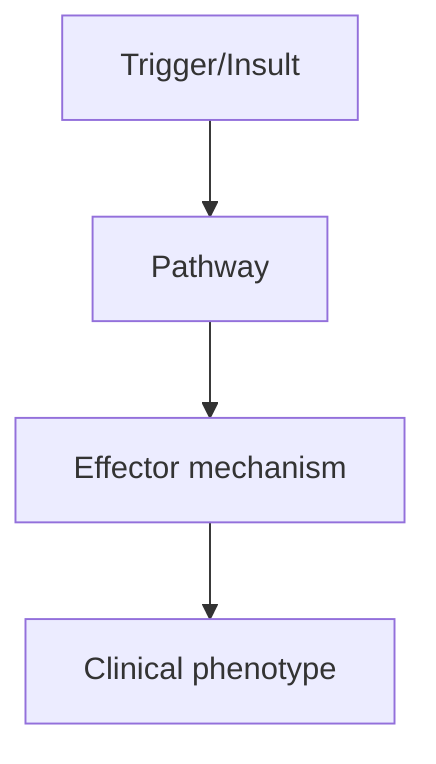
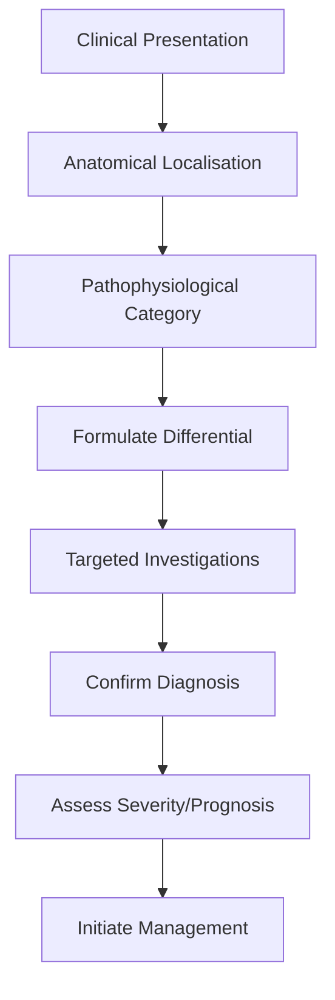
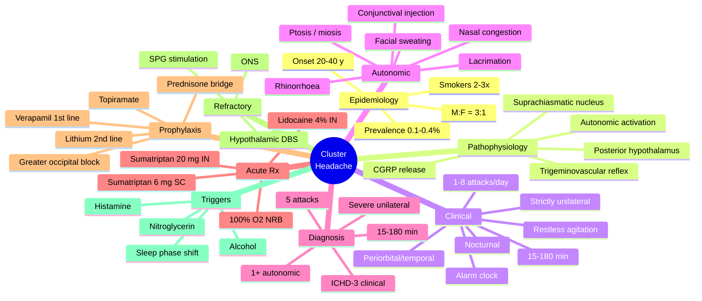

# Cluster Headache

> [!tip] **High-Yield Definition**
> Strictly unilateral, severe, periorbital/temporal headache with prominent ipsilateral cranial autonomic features, occurring in clusters (weeks to months). Circadian pattern (often nocturnal). ICHD-3: severe unilateral orbital/supraorbital/temporal pain 15-180 min, with autonomic features, frequency 1 every other day to 8/day.

---

## 1. Definition / Epidemiology / Classification

### Definition
Strictly unilateral, severe, periorbital/temporal headache with prominent ipsilateral cranial autonomic features, occurring in clusters (weeks to months). Circadian pattern (often nocturnal). ICHD-3: severe unilateral orbital/supraorbital/temporal pain 15-180 min, with autonomic features, frequency 1 every other day to 8/day.

### Epidemiology
Prevalence: 0.1-0.4%. Male:female 3:1. Typical onset 20-40y. Strong association with smoking. Family history less common than migraine.

### Classification
| Variant | Key Features | Prognosis |
|---------|-------------|-----------|
| | | |

---

## 2. Aetiology / Pathophysiology

### Aetiology
Posterior hypothalamic activation (functional imaging). Trigeminovascular system. Circadian rhythm involvement (suprachiasmatic nucleus). No clear vascular compression.

### Pathophysiology

---

## 3. Clinical Features

### History
- **Onset/Duration:**
- **Progression:**
- **Key symptoms:**
- **Triggers:**
- **Systemic symptoms:**
- **Drug/Family/Social history:**

### Examination
| Domain | Key Findings | Localisation Value |
|--------|-------------|-------------------|
| | | |

### Specific Clinical Features
Severe, strictly unilateral (no side shift), periorbital/temporal pain. Duration 15-180 min. Frequency: 1-8/day, often nocturnal (alarm clock headache). Autonomic: lacrimation, conjunctival injection, rhinorrhoea, nasal congestion, ptosis, miosis, facial sweating (ipsilateral). Restless/agitated (unlike migraine, prefers to move). Triggered by alcohol, nitroglycerin. Episodic (90%): clusters last 6-12 weeks. Chronic (10%): no remission >1 year.

---

## 4. Diagnostic Approach / Algorithm

---

## 5. Investigations

Clinical diagnosis (ICHD-3). MRI brain (hypothalamic-pituitary, posterior fossa) to exclude structural cause, especially with atypical features. MRA if aneurysm suspected (differential of unilateral periorbital pain).

---

## 6. Differential Diagnosis

| Differential | Distinguishing Features | Key Test |
|--------------|------------------------|----------|
| | | |

---

## 7. Management

Acute: HIGH FLOW OXYGEN 100% 12-15L/min via non-rebreather mask for 15-20 min (effective 60-70%); subcutaneous sumatriptan 6mg (most effective, max 2/24h); intranasal sumatriptan 20mg or lidocaine 4%. Prophylaxis (start early in cluster): verapamil 80-480mg/day (first-line, ECG monitoring for AV block); lithium 600-900mg/day (levels); topiramate 50-200mg; greater occipital nerve blocks (depot steroid); prednisone short course; verapamil + lithium combination.

---

## 8. Drug Interactions / Contraindications / Comorbidity Cautions

| Drug | Interaction / Caution | Management |
|------|----------------------|------------|
| | | |

---

## 9. Procedures (if applicable)

### Procedure:
- **Indications:**
- **Contraindications:**
- **Preparation / Principle:**
- **Complications:**
- **Viva Pearls:**

---

## 10. Complications

| Complication | Frequency | Prevention / Monitoring | Management |
|--------------|-----------|------------------------|------------|
| | | | |

---

## 11. Red Flags / Emergencies

Atypical features, new onset >50y, prolonged duration, persistent neurology, change in pattern - all require MRI to exclude structural cause.

---

## 12. Prognosis

Episodic: clusters last 6-12 weeks, remission. Chronic: difficult, may require neuromodulation (sphenopalatine ganglion stimulation, occipital nerve stimulation, hypothalamic DBS). Lifestyle: avoid alcohol during cluster, smoking cessation.

---

## 13. Topic Correlation

| Related Topic | Link | Key Overlap |
|---------------|------|-------------|
| | | |

---

## 14. Special Situations

| Situation | Consideration |
|-----------|---------------|
| **Pregnancy** | |
| **Lactation** | |
| **Paediatric** | |
| **Elderly / Frail** | |
| **Renal impairment** | |
| **Hepatic impairment** | |
| **Immunocompromised** | |
| **Perioperative** | |
| **Driving / DVLA** | |
| **Occupational** | |

---

## FCPS/MRCP High-Yield Summary

| Category | Key Points |
|----------|------------|
| **Definition** | Strictly unilateral, severe, periorbital/temporal headache with prominent ipsilateral cranial autonomic features, occurring in clusters (weeks to months). Circadian pattern (often nocturnal). ICHD-3:  |
| **Epidemiology** | Prevalence: 0.1-0.4%. Male:female 3:1. Typical onset 20-40y. Strong association with smoking. Family history less common than migraine. |
| **Pathophysiology** | |
| **Clinical** | Severe, strictly unilateral (no side shift), periorbital/temporal pain. Duration 15-180 min. Frequency: 1-8/day, often nocturnal (alarm clock headache). Autonomic: lacrimation, conjunctival injection, |
| **Diagnosis** | |
| **Investigations** | Clinical diagnosis (ICHD-3). MRI brain (hypothalamic-pituitary, posterior fossa) to exclude structural cause, especially with atypical features. MRA if aneurysm suspected (differential of unilateral p |
| **Management** | Acute: HIGH FLOW OXYGEN 100% 12-15L/min via non-rebreather mask for 15-20 min (effective 60-70%); subcutaneous sumatriptan 6mg (most effective, max 2/24h); intranasal sumatriptan 20mg or lidocaine 4%. |
| **Complications** | |
| **Prognosis** | Episodic: clusters last 6-12 weeks, remission. Chronic: difficult, may require neuromodulation (sphenopalatine ganglion stimulation, occipital nerve stimulation, hypothalamic DBS). Lifestyle: avoid al |
| **Viva Pearls** | |
| **Drug Doses** | |
| **Scoring Systems** | |
| **Genetics** | |
| **Imaging Signs** | |

---

## Viva Questions (PACES/FCPS Style)

1. **Q:** Define Cluster Headache and classify its variants.
   **A:** Based on the definition above.

2. **Q:** What are the key clinical features?
   **A:** Severe, strictly unilateral (no side shift), periorbital/temporal pain. Duration 15-180 min. Frequency: 1-8/day, often nocturnal (alarm clock headache). Autonomic: lacrimation, conjunctival injection, rhinorrhoea, nasal congestion, ptosis, miosis, facial sweating (ipsilateral). Restless/agitated (un

3. **Q:** What is the first-line treatment?
   **A:** Based on the management section.

4. **Q:** What are the red flags requiring urgent referral?
   **A:** Atypical features, new onset >50y, prolonged duration, persistent neurology, change in pattern - all require MRI to exclude structural cause.

5. **Q:** What is the prognosis?
   **A:** Episodic: clusters last 6-12 weeks, remission. Chronic: difficult, may require neuromodulation (sphenopalatine ganglion stimulation, occipital nerve stimulation, hypothalamic DBS). Lifestyle: avoid alcohol during cluster, smoking cessation.

6. **Q:** How do you differentiate Cluster Headache from key differentials?
   **A:** Clinical features, investigations, and response to treatment.

7. **Q:** What investigations are most useful?
   **A:** Based on the investigations section.

8. **Q:** Describe the stepwise management approach.
   **A:** Based on the management algorithm.

9. **Q:** What are the emergency presentations?
   **A:** Based on the red flags section.

10. **Q:** How does management change in pregnancy/paediatrics/elderly?
    **A:** Special considerations per population.

---

## Common Confusions / Exam Traps

| Confusion | Clarification |
|-----------|---------------|
| | |

---

## Mnemonics

1. **CLUSTER** — **C**ircadian (alarm-clock, nocturnal), **L**acrimation/red eye, **U**nilateral (no side shift), **S**evere periorbital, **T**rigeminovascular reflex, **E**pisodic (90%)/Chronic (10%), **R**estless (paces around — opposite of migraine)
2. **SOS HA** — **S**ubQ sumatriptan 6 mg, **O**xygen 100% 12–15 L/min NRB 15–20 min, **S**phenopalatine ganglion block (refractory); **HA** = Hypothalamic Activation
3. **VERA-LITH** — **V**erapamil 80–480 mg (1st-line prophylaxis, ECG), **E**CG before & during titration, **R**estlessness is diagnostic clue, **A**lcohol trigger, **L**ithium 600–900 mg (2nd-line, levels), **I**ndomethacin does NOT work (differentiates from PH), **T**opiramate 50–200 mg, **H**ypothalamic deep brain stimulation (refractory chronic)
4. **AUTONOMIC FEATURES** — **A**nomalous sympathetic: **U**nilateral ptosis, **T**ear (lacrimation), **O**cclusion nasal congestion, **N**asal rhinorrhoea, **O**cular injection, **M**iosis, **I**psilateral facial sweating, **C**onjunctival oedema; **FEATURES** = 5 features (conjunctival injection, lacrimation, nasal congestion, rhinorrhoea, eyelid oedema) + 2 signs (ptosis, miosis)

## Mind Map

## Spaced Repetition Trackers

| Topic | Day 1 | Day 3 | Day 7 | Day 14 | Day 30 | Day 90 |
|-------|-------|-------|-------|--------|--------|--------|
| ICHD-3 criteria (5 attacks, 15–180 min, 1+ autonomic) | ☐ | ☐ | ☐ | ☐ | ☐ | ☐ |
| Acute: O₂ 12–15 L/min vs sumatriptan 6 mg SC | ☐ | ☐ | ☐ | ☐ | ☐ | ☐ |
| Verapamil ECG monitoring (PR, AV block) | ☐ | ☐ | ☐ | ☐ | ☐ | ☐ |
| Hypothalamic activation on PET | ☐ | ☐ | ☐ | ☐ | ☐ | ☐ |
| Episodic (90%) vs chronic (10%) | ☐ | ☐ | ☐ | ☐ | ☐ | ☐ |
| Refractory: SPG stimulation, ONS, DBS | ☐ | ☐ | ☐ | ☐ | ☐ | ☐ |
| Alcohol trigger (only during cluster) | ☐ | ☐ | ☐ | ☐ | ☐ | ☐ |
| Restlessness vs migraine (lies still) | ☐ | ☐ | ☐ | ☐ | ☐ | ☐ |

## Self-Test Scorecard

| Section | Score /5 |
|---------|----------|
| ICHD-3 diagnostic criteria | ☐☐☐☐☐ |
| Epidemiology (M:F, smoking) | ☐☐☐☐☐ |
| Pathophysiology (hypothalamus, trigeminovascular) | ☐☐☐☐☐ |
| Clinical features (pain, autonomic, behaviour) | ☐☐☐☐☐ |
| Differential (PH, SUNCT, migraine, dissection) | ☐☐☐☐☐ |
| Acute management (O₂, triptan) | ☐☐☐☐☐ |
| Prophylaxis (verapamil, lithium) | ☐☐☐☐☐ |
| Refractory options (SPG, ONS, DBS) | ☐☐☐☐☐ |
| Red flags and atypical features | ☐☐☐☐☐ |
| Triggers and lifestyle | ☐☐☐☐☐ |

## MCQs (10)

1. **Q:** A 32-year-old male smoker presents with excruciating right periorbital headaches lasting 60 minutes, occurring at 2 am every night for 6 weeks, with associated right lacrimation, nasal congestion, and ptosis. He paces the floor in agony. The most likely diagnosis is:
   **A.** Migraine without aura
   **B.** Cluster headache
   **C.** Paroxysmal hemicrania
   **D.** SUNCT syndrome
   **Answer: B** — Strictly unilateral periorbital pain, nocturnal "alarm-clock" attacks, prominent ipsilateral autonomic features (lacrimation, ptosis, nasal congestion), and restlessness (pacing) are diagnostic of cluster headache. PH has shorter attacks (<30 min) and >5/day; SUNCT is even shorter (seconds). M:F = 3:1, smokers over-represented.

2. **Q:** What is the first-line acute treatment for an active cluster headache attack?
   **A.** Oral sumatriptan 100 mg
   **B.** 100% oxygen 12–15 L/min via non-rebreather mask for 15–20 min
   **C.** Ibuprofen 600 mg
   **D.** Intranasal lidocaine 4%
   **Answer: B** — High-flow 100% oxygen via non-rebreather mask (12–15 L/min, 15–20 min) is the first-line acute treatment and is effective in ~60–70% of patients. Sumatriptan 6 mg SC is equally effective alternative (max 2/24 h). Oral triptans are less effective due to slower onset. O₂ is safe in cardiovascular disease where triptans are contraindicated.

3. **Q:** First-line prophylaxis for cluster headache during a cluster bout is:
   **A.** Propranolol
   **B.** Topiramate
   **C.** Verapamil
   **D.** Amitriptyline
   **Answer: C** — Verapamil 80–480 mg/day is the first-line prophylactic agent for cluster headache. Start 80 mg TDS, titrate up; ECG monitoring is mandatory (PR interval, AV block) at baseline and after each dose increase. Lithium 600–900 mg/day is second-line. Propranolol and amitriptyline are migraine preventives, not cluster.

4. **Q:** Cluster headache pathophysiology involves activation of which brain region demonstrable on functional imaging?
   **A.** Brainstem raphe nuclei
   **B.** Posterior hypothalamus
   **C.** Thalamus
   **D.** Insular cortex
   **Answer: B** — Posterior hypothalamic activation is shown on PET in acute cluster attacks, explaining the circadian pattern. The suprachiasmatic nucleus (circadian pacemaker) and posterior hypothalamus drive the trigeminovascular-autonomic reflex. This finding led to the use of hypothalamic deep brain stimulation in refractory chronic cluster.

5. **Q:** The ICHD-3 diagnostic criteria for cluster headache require a minimum of how many attacks?
   **A.** 3
   **B.** 5
   **C.** 10
   **D.** 15
   **Answer: B** — ICHD-3 requires ≥5 attacks of severe unilateral orbital/supraorbital/temporal pain lasting 15–180 min, occurring 1 every other day to 8/day, with at least one ipsilateral autonomic feature (lacrimation, conjunctival injection, nasal congestion, rhinorrhoea, ptosis, miosis, eyelid oedema, facial sweating) or sense of restlessness.

6. **Q:** A cluster headache patient on verapamil 480 mg/day develops bradycardia and first-degree AV block. The most appropriate next step is:
   **A.** Stop verapamil immediately and switch to lithium
   **B.** Reduce verapamil dose and obtain cardiology review; if persistent, switch to lithium or topiramate
   **C.** Add a β-blocker
   **D.** Continue current dose and reassure
   **Answer: B** — Verapamil can cause PR prolongation, AV block, and bradycardia; ECG is required at baseline and after each titration. With first-degree AV block, reduce dose and arrange cardiology review. If persistent, switch to lithium (with level monitoring) or topiramate. β-blockers are contraindicated (additive bradycardia).

7. **Q:** Which feature is characteristically absent in cluster headache but present in migraine?
   **A.** Unilateral pain
   **B.** Photophobia
   **C.** Periorbital location
   **D.** Nocturnal attacks
   **Answer: B** — Photophobia (and phonophobia) are core associated features of migraine (ICHD-3 criterion) but are NOT diagnostic features of cluster headache. Cluster is characterised by autonomic features (lacrimation, rhinorrhoea, ptosis) and restlessness — patients pace, rock, or even bang their heads, the opposite of the migrainous patient who lies still in a dark room.

8. **Q:** Refractory chronic cluster headache may be treated with all EXCEPT:
   **A.** Sphenopalatine ganglion stimulation
   **B.** Occipital nerve stimulation
   **C.** Hypothalamic deep brain stimulation
   **D.** High-flow oxygen therapy
   **Answer: D** — High-flow oxygen is an ACUTE abortive treatment, not a long-term prophylactic option for refractory chronic cluster. SPG stimulation, ONS, and posterior hypothalamic DBS are all neuromodulatory options used in medically refractory chronic cluster headache when verapamil, lithium, topiramate, and nerve blocks have failed.

9. **Q:** In cluster headache, alcohol consumption during a cluster bout typically:
   **A.** Has no effect
   **B.** Triggers an attack within 1–2 hours
   **C.** Provides relief
   **D.** Causes nausea without headache
   **Answer: B** — Alcohol is a potent trigger of cluster attacks during a bout but is well tolerated between bouts. Other triggers include nitroglycerin, histamine, sleep phase shift, and strong smells. Patients should be counselled to avoid alcohol during the active cluster period. Smoking is associated with cluster headache but cessation does not reliably abort the bout.

10. **Q:** Episodic cluster headache is distinguished from chronic cluster headache by:
    **A.** Attack duration
    **B.** Bout length and remission periods
    **C.** Pain severity
    **D.** Autonomic features
    **Answer: B** — Episodic cluster (90% of patients) has bouts lasting 6–12 weeks separated by remission periods ≥1 month (often many months/years). Chronic cluster (10%) has no remission for ≥1 year, or remissions <1 month. Attack duration (15–180 min), pain severity, and autonomic features are the same. Episodic cluster often "resets" the clock after many years and may convert to chronic (or vice versa).

## SBA Questions (10)

1. **Scenario:** A 35-year-old man has had 3 weeks of nightly excruciating right periorbital headaches, each lasting 90 minutes, awakening him from sleep with right lacrimation, nasal congestion, and ptosis. He paces the room. MRI brain is normal.
   **Question:** Most appropriate next step in management?
   **A.** Start propranolol
   **B.** Prescribe 100% oxygen 12–15 L/min via non-rebreather mask for acute attacks AND start verapamil 80 mg TDS for prophylaxis with ECG monitoring
   **C.** Order CT angiogram for aneurysm
   **D.** Begin amitriptyline
   **Answer: B** — Classic episodic cluster headache. Acute: high-flow 100% O₂ + sumatriptan 6 mg SC. Prophylaxis: verapamil (1st line) with ECG. Propranolol/amitriptyline are migraine prophylactics. CT/MRI already excludes structural cause; MRA is unnecessary unless atypical features.

2. **Scenario:** Cluster headache patient on verapamil 240 mg/day has breakthrough attacks. He refuses lithium due to monitoring burden.
   **Question:** Most appropriate add-on or alternative?
   **A.** Carbamazepine
   **B.** Topiramate 25–50 mg titrated to 50–200 mg/day, OR greater occipital nerve block with depot methylprednisolone + lidocaine
   **C.** Oral sumatriptan TDS
   **D.** Propranolol
   **Answer: B** — Topiramate is third-line prophylaxis; GON block with steroid provides rapid short-term prophylaxis (often used as bridge). Carbamazepine is for trigeminal neuralgia. Frequent oral sumatriptan is limited to 2/24 h (cardiovascular risk). Propranolol is for migraine.

3. **Scenario:** A 45-year-old man with chronic cluster headache fails verapamil 480 mg, lithium (levels therapeutic), and topiramate 200 mg. He has 4 attacks daily.
   **Question:** Best next option for a medically refractory case?
   **A.** Continue current regimen
   **B.** Refer for sphenopalatine ganglion (SPG) stimulation — INCA study showed ≥50% pain relief in many
   **C.** Increase verapamil to 720 mg
   **D.** Start methotrexate
   **Answer: B** — In chronic cluster refractory to verapamil + lithium + topiramate, neuromodulation is indicated. SPG microstimulator (INCA study) provided acute and preventive benefit. Other options: ONS, hypothalamic DBS. Verapamil ceiling is usually 480 mg/day; higher risks bradycardia/AV block.

4. **Scenario:** A 30-year-old woman, 18 weeks pregnant, with episodic cluster headache. She has 2 nightly attacks.
   **Question:** Safest acute treatment?
   **A.** Sumatriptan 6 mg SC
   **B.** 100% oxygen 12–15 L/min via non-rebreather mask
   **C.** Ergotamine
   **D.** Verapamil high-dose
   **Answer: B** — High-flow O₂ is safe in pregnancy and is the first-line acute treatment. Sumatriptan has limited pregnancy data (pregnancy registry reassuring, not absolutely contraindicated but used with caution). Ergotamine is contraindicated. Verapamil is the prophylactic of choice in pregnancy (category C, safer than alternatives).

5. **Scenario:** A patient with suspected cluster headache has a normal MRI but persistently unilateral pain with red eye, raised intraocular pressure, and a mid-dilated pupil.
   **Question:** Most likely alternative diagnosis?
   **A.** SUNCT
   **B.** Acute angle-closure glaucoma
   **C.** Paroxysmal hemicrania
   **D.** Migraine
   **Answer: B** — Acute angle-closure glaucoma presents with severe unilateral ocular pain, red eye, mid-dilated fixed pupil, halos around lights, and raised IOP — important differential. Urgent ophthalmology referral. SUNCT has seconds-long attacks; PH has shorter (<30 min) attacks and absolute response to indomethacin.

6. **Scenario:** A 28-year-old woman has unilateral brief stabbing headaches lasting 10 seconds, occurring 50 times per day, with conjunctival injection and lacrimation, completely unresponsive to indomethacin and oxygen.
   **Question:** Most likely diagnosis?
   **A.** Cluster headache
   **B.** SUNCT syndrome
   **C.** Paroxysmal hemicrania
   **D.** Trigeminal neuralgia
   **Answer: B** — SUNCT: 1–600 attacks/day, 1–600 sec duration, conjunctival injection AND tearing both required. Indomethacin non-response distinguishes from PH. Lamotrigine 100–300 mg, gabapentin, topiramate, IV lidocaine are treatments. TN has V2/V3 distribution and trigger zones.

7. **Scenario:** A 50-year-old man with new daily unilateral periorbital headache for 6 weeks, MRI shows a pituitary mass.
   **Question:** Most appropriate interpretation?
   **A.** This is primary cluster headache
   **B.** Symptomatic cluster-like headache — pituitary apoplexy or other sellar lesion may mimic cluster
   **C.** Migraine variant
   **D.** Tension-type headache
   **Answer: B** — Secondary cluster-like headache can arise from pituitary lesions, cavernous sinus pathology, aneurysms, or dissection. New onset >50 y, atypical features, or persistent neurology mandate MRI. Endocrine workup (prolactin, cortisol, GH) and pituitary MRI protocol.

8. **Scenario:** A cluster headache patient on lithium 900 mg/day has tremor, ataxia, and confusion. His lithium level is 1.6 mmol/L.
   **Question:** Most appropriate management?
   **A.** Continue same dose
   **B.** Stop lithium, check level, IV fluids, consider haemodialysis if >2.5 mmol/L; restart at lower dose
   **C.** Add another prophylactic
   **D.** Switch to sodium valproate
   **Answer: B** — Therapeutic lithium range 0.4–1.0 mmol/L; toxicity typically >1.5 mmol/L with neuro symptoms. Stop lithium, IV fluids, monitor levels, consider haemodialysis if severe. Watch NSAIDs, thiazides, ACE-i (raise levels). Valproate is not effective for cluster.

9. **Scenario:** A 38-year-old man with episodic cluster headache is in his 8th week of a bout. He has 3 attacks daily despite verapamil 360 mg.
   **Question:** Best bridging strategy?
   **A.** Add prednisone 60 mg daily for 2 weeks then taper, or greater occipital nerve block
   **B.** Stop verapamil
   **C.** Add propranolol
   **D.** Wait for natural remission
   **Answer: A** — Prednisone 60–100 mg/day for 2–4 weeks is a short-term bridge to abort a bout while verapamil reaches effect. Greater occipital nerve block (methylprednisolone + lidocaine) is also a rapid bridge. Propranolol is for migraine. Stopping verapamil risks worsening.

10. **Scenario:** A patient with cluster headache wants to know his prognosis.
    **Question:** Most accurate statement?
    **A.** Cluster headache is curable
    **B.** Episodic cluster is usually self-limiting (6–12 week bouts, long remissions); chronic cluster is more refractory and may require neuromodulation
    **C.** All patients become chronic
    **D.** It is a psychological disorder
    **Answer: B** — Episodic cluster (90%) has well-defined bouts (6–12 wk) and remissions (months to years). Chronic cluster (10%) has ≥1 year without remission; some are medically refractory and need neuromodulation (SPG stim, ONS, hypothalamic DBS). Cluster is a primary neurovascular disorder, not psychological.

## Answer Key

### MCQs
1. **B** — Cluster headache (unilateral, autonomic, restless, nocturnal)
2. **B** — 100% O₂ 12–15 L/min NRB
3. **C** — Verapamil (with ECG)
4. **B** — Posterior hypothalamus (PET)
5. **B** — ≥5 attacks (ICHD-3)
6. **B** — Reduce dose + cardiology review; switch
7. **B** — Photophobia is migraine
8. **D** — O₂ is acute only, not prophylactic
9. **B** — Alcohol triggers attacks in bout
10. **B** — Bout length / remission distinguish episodic vs chronic

### SBAs
1. **B** — O₂ + verapamil + ECG
2. **B** — Topiramate or GON block
3. **B** — SPG stimulation (INCA)
4. **B** — 100% O₂ in pregnancy
5. **B** — Angle-closure glaucoma
6. **B** — SUNCT
7. **B** — Secondary cluster-like (pituitary)
8. **B** — Lithium toxicity management
9. **A** — Prednisone / GON block bridge
10. **B** — Episodic is self-limiting; chronic is refractory

## Tags

#neurology #headache #FCPS #MRCP #PACES #cluster #trigeminal-autonomic-cephalalgia #TAC #verapamil #sumatriptan #oxygen #suprachiasmatic #posterior-hypothalamus #alarm-clock #restless #ipsilateral-autonomic #indomethacin-negative #SPG-stimulation #hypothalamic-DBS

---

## Local Navigation
**Heading Hub:** [[../Hub]]  
**Chapter Hierarchy:** [[Davidson Chapter 25 - Neurology Hierarchy]]  
**Chapter MOC:** [[Neurology MOC]]  
**Drug Reference:** [[../00_Index/Neurology Drug Reference]]

## PasTest Scenario SBAs (Clinical Vignettes)

> **Auto-generated PasTest/Mediscope-style scenario SBAs** grounded in the authored source. Each scenario tests a real clinical fact (triad, specific sign, contraindication, trial, first-line Rx) extracted from the topic. *Source: Ch 27: Neurology & Stroke — Cluster Headache*

**Q1.** Which of the following features is most specific or characteristic of Cluster Headache?

  - **A.** VERA-LITH
  - **B.** A feature common to many acute inflammatory conditions
  - **C.** A non-specific sign that does not localise the diagnosis
  - **D.** An investigation finding rather than a clinical feature

  > **Answer: A** — VERA-LITH
  >
  > *Source:* **VERA-LITH** — **V**erapamil 80–480 mg (1st-line prophylaxis, ECG), **E**CG before & during titration, **R**estlessness is diagnostic clue, **A**lcohol trigger, **L**ithium 600–900 mg (2nd-line, leve

