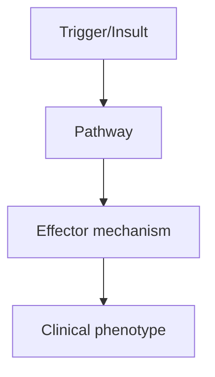
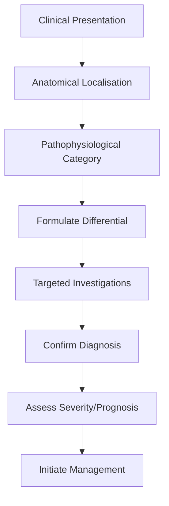
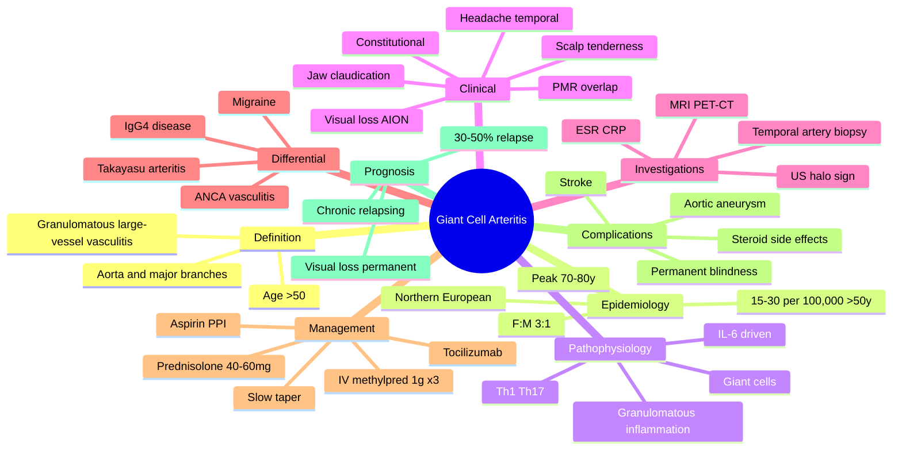

# Giant Cell Arteritis

> [!tip] **High-Yield Definition**
> Giant cell arteritis (GCA, temporal arteritis): large vessel vasculitis affecting aorta and branches, especially extracranial branches of carotid (temporal, occipital, ophthalmic). Affects elderly (>50y). Granulomatous inflammation with giant cells. Vision loss emergency.

---

## 1. Definition / Epidemiology / Classification

### Definition
Giant cell arteritis (GCA, temporal arteritis): large vessel vasculitis affecting aorta and branches, especially extracranial branches of carotid (temporal, occipital, ophthalmic). Affects elderly (>50y). Granulomatous inflammation with giant cells. Vision loss emergency.

### Epidemiology
Incidence: 15-30/100,000/year in >50y. Peak 70-80y. F:M 3:1. Northern European (Scandinavian). Associated with polymyalgia rheumatica (40-50% of GCA, 10-20% of PMR have GCA).

### Classification
| Variant | Key Features | Prognosis |
|---------|-------------|-----------|
| | | |

---

## 2. Aetiology / Pathophysiology

### Aetiology
Granulomatous vasculitis: large and medium vessels, especially temporal artery, ophthalmic, posterior ciliary, vertebral, aorta. Inflammation: T cells, macrophages, giant cells, vessel wall destruction, occlusion. Genetic: HLA-DRB1*04:01, *01. Triggers: unknown, possibly infection, sunlight. Pathogenesis: vascular dendritic cells, IL-6, IL-12, IL-17, Th1/Th17 response.

### Pathophysiology

---

## 3. Clinical Features

### History
- **Onset/Duration:**
- **Progression:**
- **Key symptoms:**
- **Triggers:**
- **Systemic symptoms:**
- **Drug/Family/Social history:**

### Examination
| Domain | Key Findings | Localisation Value |
|--------|-------------|-------------------|
| | | |

### Specific Clinical Features
Headache: new-onset, temporal, severe, persistent. Scalp tenderness: brushing hair painful. Jaw claudication: chewing pain, pathognomonic. Visual symptoms: amaurosis fugax (transient), diplopia, vision loss (anterior ischaemic optic neuropathy - AION, sudden, painless, permanent if untreated - 20%). Constitutional: fever, weight loss, fatigue, malaise, night sweats, anorexia. Polymyalgia rheumatica: bilateral shoulder/pelvic girdle pain, morning stiffness. Temporal artery: tender, thickened, decreased pulsation, erythema. Exam: vision testing (acuity, fields, colour, RAPD - afferent pupillary defect), fundoscopy (pale, swollen disc - AION), temporal artery (tender, thickened), joints (PMR). Systemic: large vessel (aortitis, aortic aneurysm, dissection, stenosis - 10-20%, years later), stroke, scalp necrosis, tongue claudication.

---

## 4. Diagnostic Approach / Algorithm

---

## 5. Investigations

ESR (often >50, frequently >100, but 10-20% normal - normal does not exclude), CRP (more sensitive, >10), FBC (normocytic anaemia, thrombocytosis), LFTs (alkaline phosphatase elevated), U&Es, autoimmune (ANA, ANCA - usually negative, vs other vasculitides). Temporal artery biopsy: gold standard, skip lesions, unilateral, 1-2 cm segment, within 2 weeks of starting steroids. MRI temporal artery + aorta: halo sign (vessel wall oedema, T2 hyperintensity, enhancement), aortitis, large vessel involvement. PET-CT: large vessel vasculitis, FDG-avid vessels. US temporal artery: halo sign (non-compressible hypoechoic wall thickening), non-invasive, sensitive. Echo: aortic root, aneurysm. Biopsy contralateral if first negative and high suspicion. Ophthalmology consult: visual fields, OCT, fluorescein angiography.

---

## 6. Differential Diagnosis

| Differential | Distinguishing Features | Key Test |
|--------------|------------------------|----------|
| | | |

---

## 7. Management

EMERGENCY: start high-dose corticosteroids IMMEDIATELY (do not wait for biopsy if high suspicion - temporal artery biopsy still positive up to 2 weeks after starting steroids). Initial: prednisolone 40-60mg/day (no visual symptoms), IV methylprednisolone 500-1000mg/day x 3 days (visual symptoms, AION, jaw claudication) then oral prednisolone 1mg/kg/day. Aspirin 75mg (antiplatelet, reduces visual loss, ischaemic events). PPI (gastric protection). Vitamin D, calcium, bisphosphonate (osteoporosis prevention). Taper: slow, 1-2 years minimum. Monitor: clinical (symptoms, vision), ESR, CRP. Relapse: increase dose, consider tocilizumab (anti-IL-6, IL-6 critical in GCA, approved, steroid-sparing). Other immunosuppressants: methotrexate, azathioprine, MMF (second-line). Tocilizumab: 162mg SC weekly or 8mg/kg IV monthly, effective steroid-sparing, approved. Large vessel: monitor with MRI/PET-CT annually, aortic aneurysm/dissection risk. Multidisciplinary: rheumatology, ophthalmology, neurology (stroke, headache), vascular surgery (aneurysm), pathology, primary care. Long-term follow-up: 2-5 years, monitor for relapse, large vessel complications, steroid side effects.

---

## 8. Drug Interactions / Contraindications / Comorbidity Cautions

| Drug | Interaction / Caution | Management |
|------|----------------------|------------|
| | | |

---

## 9. Procedures (if applicable)

### Procedure:
- **Indications:**
- **Contraindications:**
- **Preparation / Principle:**
- **Complications:**
- **Viva Pearls:**

---

## 10. Complications

| Complication | Frequency | Prevention / Monitoring | Management |
|--------------|-----------|------------------------|------------|
| | | | |

---

## 11. Red Flags / Emergencies

Visual loss (AION - emergency, permanent if untreated >24-48h), stroke (vertebral, ophthalmic, posterior ciliary), scalp necrosis, tongue claudication, aortic aneurysm/dissection (years later, 10-20%), large vessel stenosis (aorta, subclavian, renal, mesenteric, limb), myocardial infarction, sudden death. Steroid complications: DM, hypertension, osteoporosis, fractures, infections, mood, adrenal suppression, weight gain, cataracts, glaucoma, myopathy, skin (thin, bruising).

---

## 12. Prognosis

Good with treatment, but chronic, relapsing. Visual loss: usually permanent, prevented with early steroids. Relapse: 30-50% on taper, respond to dose increase. Large vessel: 10-20% develop aortic aneurysm/dissection (years later), monitor. Mortality: increased (vascular, infection, malignancy). Quality of life: steroid burden, relapses, monitoring. Tocilizumab: improved outcomes, steroid-sparing. Multidisciplinary care essential. Genetic counselling: not applicable. Patient education: alert for visual symptoms, jaw claudication, headache, scalp tenderness, constitutional symptoms.

---

## 13. Topic Correlation

| Related Topic | Link | Key Overlap |
|---------------|------|-------------|
| | | |

---

## 14. Special Situations

| Situation | Consideration |
|-----------|---------------|
| **Pregnancy** | |
| **Lactation** | |
| **Paediatric** | |
| **Elderly / Frail** | |
| **Renal impairment** | |
| **Hepatic impairment** | |
| **Immunocompromised** | |
| **Perioperative** | |
| **Driving / DVLA** | |
| **Occupational** | |

---

## FCPS/MRCP High-Yield Summary

| Category | Key Points |
|----------|------------|
| **Definition** | Giant cell arteritis (GCA, temporal arteritis): large vessel vasculitis affecting aorta and branches, especially extracranial branches of carotid (temporal, occipital, ophthalmic). Affects elderly (>5 |
| **Epidemiology** | Incidence: 15-30/100,000/year in >50y. Peak 70-80y. F:M 3:1. Northern European (Scandinavian). Associated with polymyalgia rheumatica (40-50% of GCA,  |
| **Pathophysiology** | |
| **Clinical** | Headache: new-onset, temporal, severe, persistent. Scalp tenderness: brushing hair painful. Jaw claudication: chewing pain, pathognomonic. Visual symptoms: amaurosis fugax (transient), diplopia, visio |
| **Diagnosis** | |
| **Investigations** | ESR (often >50, frequently >100, but 10-20% normal - normal does not exclude), CRP (more sensitive, >10), FBC (normocytic anaemia, thrombocytosis), LFTs (alkaline phosphatase elevated), U&Es, autoimmu |
| **Management** | EMERGENCY: start high-dose corticosteroids IMMEDIATELY (do not wait for biopsy if high suspicion - temporal artery biopsy still positive up to 2 weeks after starting steroids). Initial: prednisolone 4 |
| **Complications** | |
| **Prognosis** | Good with treatment, but chronic, relapsing. Visual loss: usually permanent, prevented with early steroids. Relapse: 30-50% on taper, respond to dose increase. Large vessel: 10-20% develop aortic aneu |
| **Viva Pearls** | |
| **Drug Doses** | |
| **Scoring Systems** | |
| **Genetics** | |
| **Imaging Signs** | |

---

## Viva Questions (PACES/FCPS Style)

1. **Q:** Define Giant Cell Arteritis and classify its variants.
   **A:** Based on the definition above.

2. **Q:** What are the key clinical features?
   **A:** Headache: new-onset, temporal, severe, persistent. Scalp tenderness: brushing hair painful. Jaw claudication: chewing pain, pathognomonic. Visual symptoms: amaurosis fugax (transient), diplopia, vision loss (anterior ischaemic optic neuropathy - AION, sudden, painless, permanent if untreated - 20%).

3. **Q:** What is the first-line treatment?
   **A:** Based on the management section.

4. **Q:** What are the red flags requiring urgent referral?
   **A:** Visual loss (AION - emergency, permanent if untreated >24-48h), stroke (vertebral, ophthalmic, posterior ciliary), scalp necrosis, tongue claudication, aortic aneurysm/dissection (years later, 10-20%), large vessel stenosis (aorta, subclavian, renal, mesenteric, limb), myocardial infarction, sudden 

5. **Q:** What is the prognosis?
   **A:** Good with treatment, but chronic, relapsing. Visual loss: usually permanent, prevented with early steroids. Relapse: 30-50% on taper, respond to dose increase. Large vessel: 10-20% develop aortic aneurysm/dissection (years later), monitor. Mortality: increased (vascular, infection, malignancy). Qual

6. **Q:** How do you differentiate Giant Cell Arteritis from key differentials?
   **A:** Clinical features, investigations, and response to treatment.

7. **Q:** What investigations are most useful?
   **A:** Based on the investigations section.

8. **Q:** Describe the stepwise management approach.
   **A:** Based on the management algorithm.

9. **Q:** What are the emergency presentations?
   **A:** Based on the red flags section.

10. **Q:** How does management change in pregnancy/paediatrics/elderly?
    **A:** Special considerations per population.

---

## Common Confusions / Exam Traps

| Confusion | Clarification |
|-----------|---------------|
| | |

---

## Mnemonics
1. **GCA STEROIDS** = **G**iant **C**ell **A**rteritis: **ST**art **E**xogenous st**E**roids befo**R**e **O**utlining **ID**entified **S**ite of disease (use: never delay steroids awaiting biopsy - biopsy stays positive up to 2 weeks)
2. **JAW CLAUDICATION** = **J**aw pain **A**nd **W**asting with eating - **CLA**ssic **U**nique to **D**ifferentiate **IC**A ischaemia **A**rteritis (use: jaw claudication has highest specificity >90% for GCA)
3. **HALT** = **H**alo sign on US, **A**ortic involvement screen, **L**arge vessel imaging, **T**ocilizumab for relapse (use: structured bedside approach to GCA workup)

---

## Mind Map

## Spaced Repetition Trackers

| Review Interval | Date | Score (0-5) | Notes |
|-----------------|------|-------------|-------|
| Day 1 | | | |
| Day 3 | | | |
| Day 7 | | | |
| Day 14 | | | |
| Day 30 | | | |
| Day 90 | | | |

## Self-Test Scorecard

| Section | Score /5 | Last Attempt |
|---------|----------|--------------|
| Definition & Epidemiology | | | |
| Pathophysiology | | | |
| Clinical Features | | | |
| Investigations | | | |
| Differential | | | |
| Management - Acute | | | |
| Management - Prophylaxis | | | |
| Complications | | | |
| Viva Questions | | | |
| MCQs | | | |
| SBAs | | | |

## MCQs (10)

1. **Question:** A 74-year-old woman presents with new-onset temporal headache, scalp tenderness, and jaw pain on chewing. Visual acuity is normal. ESR is 88 mm/hr. What is the most appropriate immediate management?
   **Options:** A. Arrange temporal artery biopsy and start steroids after result B. Start oral prednisolone 60 mg daily immediately C. Start IV methylprednisolone 1 g daily for 3 days D. Defer treatment until CRP available
   **Answer:** B
   **Explanation:** GCA is a clinical emergency. Steroids must NOT be delayed for biopsy; biopsy remains positive for up to 2 weeks after starting prednisolone. With no visual symptoms, oral prednisolone 40-60 mg/day is the standard starting dose. IV methylprednisolone is reserved for established visual loss, AION, or jaw claudication with ocular symptoms.

2. **Question:** Which clinical feature has the highest specificity for the diagnosis of giant cell arteritis?
   **Options:** A. New-onset headache B. Jaw claudication C. Scalp tenderness D. Low-grade fever
   **Answer:** B
   **Explanation:** Jaw claudication has a specificity of >90% for GCA and is the most useful single clinical marker. Headache and scalp tenderness are sensitive but non-specific. The combination of headache, jaw claudication, age >50 and ESR >50 has a high positive predictive value.

3. **Question:** A temporal artery biopsy in suspected GCA is most likely to show which histological pattern?
   **Options:** A. Fibrinoid necrosis with eosinophils B. Non-caseating granulomas with multinucleate giant cells in the media C. IgG4-positive plasma cell infiltrate D. Leucocytoclastic vasculitis of small vessels
   **Answer:** B
   **Explanation:** GCA is a granulomatous vasculitis with mononuclear cell infiltration, fragmentation of the internal elastic lamina, and multinucleated giant cells in the vessel media. Skip lesions mean a normal biopsy does not exclude the diagnosis; a minimum 1.5-2 cm segment is recommended.

4. **Question:** What is the most useful bedside imaging sign for diagnosis of temporal arteritis?
   **Options:** A. Hot nose sign on perfusion imaging B. Halo sign on temporal artery ultrasound C. String sign on MR angiography D. Tram-track calcification on CT
   **Answer:** B
   **Explanation:** The halo sign is a hypoechoic, non-compressible thickening of the arterial wall on colour Doppler ultrasound and reflects vessel wall oedema. In experienced hands it has sensitivity and specificity approaching 80-90% for GCA and is now part of the EULAR/ACR 2022 imaging-supported criteria.

5. **Question:** Which serological marker is MOST useful as a single acute-phase reactant in GCA?
   **Options:** A. ESR alone B. CRP alone C. Platelets alone D. Serum amyloid A
   **Answer:** B
   **Explanation:** CRP is more sensitive than ESR for GCA (sensitivity ~98% vs ~85%) and rises earlier. ESR may be falsely normal in 10-20% of patients. When both ESR and CRP are used together, negative results make GCA very unlikely (negative predictive value >97%).

6. **Question:** Tocilizumab is licensed in giant cell arteritis primarily because it:
   **Options:** A. Blocks TNF-alpha and rapidly resolves arteritis B. Inhibits IL-6 signalling and acts as a steroid-sparing agent C. Depletes B-cells and reduces relapse D. Inhibits JAK and prevents vascular remodelling
   **Answer:** B
   **Explanation:** IL-6 is a central cytokine in GCA. Tocilizumab (anti-IL-6 receptor monoclonal antibody) is the only licensed steroid-sparing agent for GCA. The GiACTA trial showed 56% sustained remission at 1 year on tocilizumab + 26-week steroid taper vs 14% on steroids alone, allowing earlier steroid dose reduction.

7. **Question:** A 78-year-old man on 20 mg prednisolone for GCA develops sudden painless loss of vision in the right eye with a relative afferent pupillary defect and pale swollen disc. The most likely mechanism is:
   **Options:** A. Central retinal vein occlusion B. Anterior ischaemic optic neuropathy from posterior ciliary artery occlusion C. Optic neuritis D. Amaurosis fugax from transient retinal ischaemia
   **Answer:** B
   **Explanation:** Arteritic AION in GCA is due to occlusion of the short posterior ciliary arteries supplying the optic nerve head. The optic disc is pale and swollen, often with a "chalky white" pallor. Once vision is lost, recovery is rare; therefore steroids must be started BEFORE this event, not after.

8. **Question:** Which investigation is the gold standard for confirming the diagnosis of GCA?
   **Options:** A. Temporal artery biopsy B. Temporal artery ultrasound C. MRI of the aorta D. PET-CT
   **Answer:** A
   **Explanation:** Temporal artery biopsy remains the historical gold standard with 100% specificity (if positive). Modern EULAR/ACR 2022 criteria allow non-biopsy diagnosis if imaging (US halo sign, MRI vessel wall enhancement, or PET large-vessel uptake) is positive in a typical clinical context.

9. **Question:** Polymyalgia rheumatica is associated with GCA in approximately what proportion of patients?
   **Options:** A. 5% B. 10% C. 40-50% D. 90%
   **Answer:** C
   **Explanation:** About 40-50% of patients with GCA have concurrent PMR, and conversely 10-20% of PMR patients develop GCA. Both share the IL-6 pathway and HLA-DRB1*04 association, suggesting they are part of a single disease spectrum.

10. **Question:** Which is the most appropriate long-term complication that requires surveillance imaging in GCA?
    **Options:** A. Pulmonary fibrosis B. Aortic aneurysm and dissection C. Renal artery stenosis D. Mesenteric ischaemia
    **Answer:** B
    **Explanation:** Large-vessel involvement (aortitis) is increasingly recognised in GCA, with 10-20% developing thoracic aortic aneurysm, dissection, or aortic stenosis years after the acute phase. Current recommendations include periodic clinical review and consideration of aortic imaging (MRI/CT/PET) for high-risk patients.

## SBA Questions (10)

1. **Scenario:** A 72-year-old woman has new unilateral headache, jaw claudication, ESR 95 and CRP 60. She has no visual symptoms.
   **Question:** What is the SINGLE most appropriate next step?
   **Options:** A. IV methylprednisolone 1 g for 3 days B. Oral prednisolone 60 mg daily, then arrange temporal artery biopsy within 2 weeks C. Aspirin 300 mg and outpatient biopsy D. Defer treatment pending MRI of temporal arteries
   **Answer:** B
   **Explanation:** Start oral high-dose prednisolone (40-60 mg/day) immediately, and arrange temporal artery biopsy ideally within 2 weeks; steroids do not invalidate biopsy in this window. IV methylprednisolone is reserved for established visual loss, AION, or evolving ocular symptoms.

2. **Scenario:** A patient with known GCA on prednisolone 8 mg daily develops recurrent headache, jaw claudication and a rising CRP.
   **Question:** Best management?
   **Options:** A. Continue current dose and review in 4 weeks B. Stop steroids abruptly C. Increase prednisolone to the previous higher dose and add tocilizumab D. Switch to azathioprine monotherapy
   **Answer:** C
   **Explanation:** This is a relapse, defined as recurrence of GCA features during taper. Treatment is to step steroids back up to the last effective dose, and for steroid-sparing benefit, add tocilizumab (subcutaneous 162 mg weekly), which has the strongest evidence base (GiACTA trial).

3. **Scenario:** A 68-year-old man on long-term prednisolone for GCA presents with sudden severe chest pain radiating to the back, BP 90/60 in right arm and 140/85 in the left.
   **Question:** Most likely diagnosis?
   **Options:** A. Pulmonary embolism B. Acute coronary syndrome C. Type A aortic dissection D. Pneumothorax
   **Answer:** C
   **Explanation:** Long-standing GCA is associated with large-vessel involvement and aortic aneurysm/dissection. A difference in upper-limb blood pressure (>20 mmHg) and tearing interscapular pain should prompt urgent CT aortogram; type A dissection is a surgical emergency.

4. **Scenario:** A patient with suspected GCA has a normal ESR (15 mm/hr) and normal CRP (<5) on presentation with new headache and jaw claudication.
   **Question:** Which is the most appropriate action?
   **Options:** A. Reassure and discharge B. Reassess in 2 weeks C. Treat as GCA and investigate further D. Refer for anxiety management
   **Answer:** C
   **Explanation:** Up to 10-20% of GCA patients have a normal ESR. CRP is more sensitive, and 5-10% may still have normal acute-phase reactants. The clinical suspicion drives the decision: with typical features (age >50, new headache, jaw claudication, scalp tenderness, vision symptoms), treat as GCA and pursue biopsy and imaging.

5. **Scenario:** A temporal artery biopsy shows transmural inflammation with multinucleated giant cells, fragmentation of the internal elastic lamina and intimal hyperplasia.
   **Question:** What is the diagnosis?
   **Options:** A. Takayasu arteritis B. Granulomatosis with polyangiitis C. Giant cell arteritis D. IgG4-related disease
   **Answer:** C
   **Explanation:** This is the classical histology of GCA. Takayasu also has granulomatous inflammation but affects younger patients (<40) and predominantly the aorta and its primary branches. IgG4 disease shows storiform fibrosis and obliterative phlebitis, and GPA has necrotising granulomas with ANCA positivity.

6. **Scenario:** A patient with GCA is on 15 mg prednisolone. They are concerned about side effects and ask about steroid-sparing options.
   **Question:** Which agent has the strongest evidence base for steroid sparing in GCA?
   **Options:** A. Methotrexate B. Azathioprine C. Tocilizumab D. Rituximab
   **Answer:** C
   **Explanation:** Tocilizumab (anti-IL-6R) is the only agent with randomised controlled trial evidence (GiACTA) and regulatory approval for new and relapsing GCA. It allows more rapid steroid taper and reduces cumulative steroid exposure. Methotrexate is a second-line option.

7. **Scenario:** A 70-year-old man with newly diagnosed GCA on 50 mg prednisolone is awaiting temporal artery biopsy. He asks how long steroids will be needed.
   **Question:** Most appropriate answer?
   **Options:** A. 2 weeks B. 1-3 months C. 1-2 years minimum, often longer D. Lifelong
   **Answer:** C
   **Explanation:** GCA typically requires at least 1-2 years of steroid therapy, with slow taper. Most patients need 2-4 years. Long-term follow-up is required to detect relapses (30-50%) and large-vessel complications (aortic aneurysm up to 20%).

8. **Scenario:** A patient presents with suspected GCA. Which additional investigation is required to screen for large-vessel involvement at diagnosis?
   **Options:** A. Renal biopsy B. CT/MRI of the aorta C. Lumbar puncture D. Nerve conduction studies
   **Answer:** B
   **Explanation:** Up to 20-30% of GCA patients have large-vessel involvement at diagnosis. CT, MRI or PET imaging of the aorta and its main branches is recommended to identify aortitis and stratify risk of future aneurysm/dissection. This is increasingly part of the standard workup.

9. **Scenario:** A patient on 40 mg prednisolone for GCA develops worsening headache and visual blurring 2 days into treatment. Fundoscopy shows a swollen pale right disc with a relative afferent pupillary defect.
   **Question:** Most appropriate next step?
   **Options:** A. Add IV methylprednisolone 1 g daily for 3 days B. Add aspirin C. Stop steroids and switch to cyclophosphamide D. Reassure and review next day
   **Answer:** A
   **Explanation:** This is progression to arteritic AION, a sight-threatening emergency. Pulse IV methylprednisolone 1 g daily for 3 days is given, followed by oral prednisolone 1 mg/kg/day. Aspirin 75 mg should also be added (or continued) for its anti-ischaemic effect.

10. **Scenario:** A 60-year-old woman with PMR on 12 mg prednisolone develops new headache, jaw claudication and visual disturbance.
    **Question:** What is the most likely diagnosis?
    **Options:** A. Migraine B. Tension-type headache C. Giant cell arteritis D. Cluster headache
    **Answer:** C
    **Explanation:** 10-20% of PMR patients develop GCA, especially during steroid taper. New headache, jaw claudication and visual symptoms in a patient with PMR must be assumed to be GCA until proven otherwise; high-dose steroids are started immediately, and temporal artery biopsy arranged.

## Flashcards

- **Q:** What is the typical age of onset of GCA?
  **A:** >50 years, peak 70-80 years.
- **Q:** What is the most specific clinical feature of GCA?
  **A:** Jaw claudication (specificity >90%).
- **Q:** Name the most common ocular complication.
  **A:** Arteritic anterior ischaemic optic neuropathy (AION) leading to sudden, painless, permanent visual loss.
- **Q:** What is the first-line treatment for GCA without visual symptoms?
  **A:** Oral prednisolone 40-60 mg/day.
- **Q:** What is added if there is visual loss?
  **A:** IV methylprednisolone 1 g daily for 3 days.
- **Q:** Why is aspirin used?
  **A:** Reduces risk of ischaemic complications (vision loss, stroke).
- **Q:** Which steroid-sparing agent is licensed in GCA?
  **A:** Tocilizumab (anti-IL-6 receptor).
- **Q:** What is the histological hallmark?
  **A:** Granulomatous inflammation with multinucleated giant cells, fragmentation of the internal elastic lamina and intimal hyperplasia.
- **Q:** What is the imaging sign on US?
  **A:** Halo sign (hypoechoic, non-compressible arterial wall thickening).
- **Q:** Why start steroids before biopsy?
  **A:** Biopsy remains positive for up to 2 weeks after starting steroids; delay risks irreversible blindness.
- **Q:** Which large-vessel complication is most feared long term?
  **A:** Thoracic aortic aneurysm and dissection (10-20%).
- **Q:** What is the relationship with PMR?
  **A:** 40-50% of GCA patients have PMR; 10-20% of PMR patients develop GCA.

## Answer Key with Explanations

### MCQs
1. B - Oral prednisolone 40-60 mg/day is the correct first step; steroids must not be delayed for biopsy.
2. B - Jaw claudication is the most specific clinical feature.
3. B - Non-caseating granulomas with multinucleated giant cells in the media are characteristic.
4. B - The halo sign on temporal artery US is the most useful bedside imaging sign.
5. B - CRP is more sensitive than ESR for GCA.
6. B - Tocilizumab blocks IL-6 signalling and is the licensed steroid-sparing agent.
7. B - Arteritic AION results from posterior ciliary artery occlusion.
8. A - Temporal artery biopsy remains the historical gold standard with 100% specificity when positive.
9. C - 40-50% of GCA patients have concurrent PMR.
10. B - Thoracic aortic aneurysm/dissection is the main long-term large-vessel complication.

### SBAs
1. B - Start oral prednisolone, then arrange biopsy within 2 weeks.
2. C - Step up steroids and add tocilizumab for steroid-sparing benefit.
3. C - Type A aortic dissection - a recognised long-term GCA complication.
4. C - Treat as GCA on clinical grounds; do not rely on a single normal ESR.
5. C - Classical histology of GCA.
6. C - Tocilizumab is the only licensed steroid-sparing agent.
7. C - GCA requires at least 1-2 years of steroids, often longer.
8. B - Cross-sectional imaging of the aorta is recommended at diagnosis.
9. A - Add IV methylprednisolone pulses for new visual loss.
10. C - GCA must be assumed in any PMR patient with new headache or visual symptoms.

## Tags
**Tags:** #neurology #headache #vasculitis #GCA #temporal-arteritis #AION #polymyalgia-rheumatica #tocilizumab #FCPS #MRCP #high-yield #elderly

## Local Navigation
**Heading Hub:** [[../Hub]]  
**Chapter Hierarchy:** [[Davidson Chapter 25 - Neurology Hierarchy]]  
**Chapter MOC:** [[Neurology MOC]]  
**Drug Reference:** [[../00_Index/Neurology Drug Reference]]

## PasTest Scenario SBAs (Clinical Vignettes)

> **Auto-generated PasTest/Mediscope-style scenario SBAs** grounded in the authored source. Each scenario tests a real clinical fact (triad, specific sign, contraindication, trial, first-line Rx) extracted from the topic. *Source: Ch 27: Neurology & Stroke — Giant Cell Arteritis*

**Q1.** Which of the following features is most specific or characteristic of Giant Cell Arteritis?

  - **A.** JAW CLAUDICATION
  - **B.** A feature common to many acute inflammatory conditions
  - **C.** A non-specific sign that does not localise the diagnosis
  - **D.** An investigation finding rather than a clinical feature

  > **Answer: A** — JAW CLAUDICATION
  >
  > *Source:* **JAW CLAUDICATION** = **J**aw pain **A**nd **W**asting with eating - **CLA**ssic **U**nique to **D**ifferentiate **IC**A ischaemia **A**rteritis (use: jaw claudication has highest specificity >90% fo

