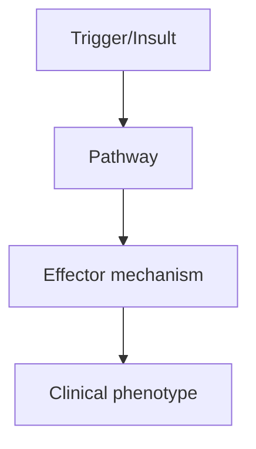
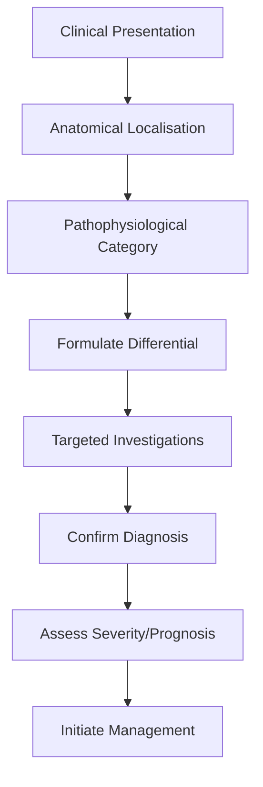
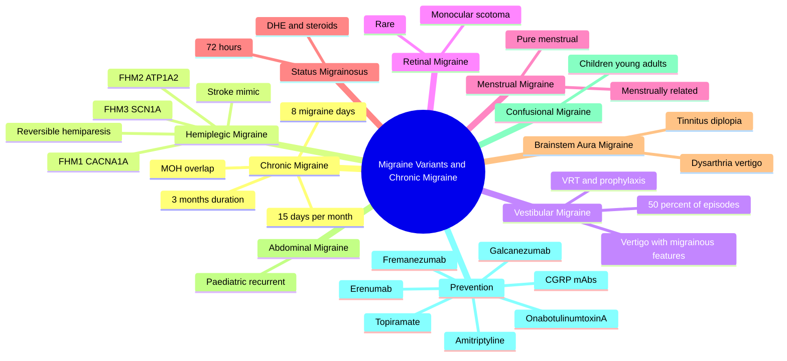

# Migraine Variants and Chronic Migraine

> [!tip] **High-Yield Definition**
> Chronic migraine: headache ≥15 days/month for >3 months, with migraine features on ≥8 days. Variants: hemiplegic migraine (FHM1/2/3), vestibular migraine, retinal migraine, menstrual migraine, abdominal migraine, brainstem aura, confusional migraine.

---

## 1. Definition / Epidemiology / Classification

### Definition
Chronic migraine: headache ≥15 days/month for >3 months, with migraine features on ≥8 days. Variants: hemiplegic migraine (FHM1/2/3), vestibular migraine, retinal migraine, menstrual migraine, abdominal migraine, brainstem aura, confusional migraine.

### Epidemiology
Chronic migraine: 2% of population, 8% of migraineurs. Vestibular migraine: 1% population. Hemiplegic: rare (0.01%).

### Classification
| Variant | Key Features | Prognosis |
|---------|-------------|-----------|
| | | |

---

## 2. Aetiology / Pathophysiology

### Aetiology
Chronic migraine: central sensitisation, medication overuse (MOH), risk factors (obesity, depression, stress, female). Hemiplegic: FHM1 (CACNA1A), FHM2 (ATP1A2), FHM3 (SCN1A). Vestibular: migraine + vestibular pathways.

### Pathophysiology

---

## 3. Clinical Features

### History
- **Onset/Duration:**
- **Progression:**
- **Key symptoms:**
- **Triggers:**
- **Systemic symptoms:**
- **Drug/Family/Social history:**

### Examination
| Domain | Key Findings | Localisation Value |
|--------|-------------|-------------------|
| | | |

### Specific Clinical Features
Chronic migraine: ≥15 days/month, ≥8 migraine days. Vestibular migraine: migraine + vestibular symptoms (vertigo, imbalance, nausea), duration minutes to days. Hemiplegic: aura with hemiparesis, lasts hours (longer in FHM1). Retinal: monocular visual loss during attack.

---

## 4. Diagnostic Approach / Algorithm

---

## 5. Investigations

Diagnosis clinical. MRI brain to exclude secondary (especially hemiplegic, prolonged aura, first attack with hemiplegia). Genetic testing for FHM if familial. Exclude MOH (>10 days/month of triptans/analgesics).

---

## 6. Differential Diagnosis

| Differential | Distinguishing Features | Key Test |
|--------------|------------------------|----------|
| | | |

---

## 7. Management

Acute: same as episodic migraine but watch for MOH. Prophylaxis: topiramate, propranolol, amitriptyline, CGRP mAbs (erenumab, fremanezumab, galcanezumab), onabotulinumtoxinA 155-195U (PREEMPT protocol for chronic migraine). Vestibular: vestibular rehabilitation + migraine prophylaxis. Hemiplegic: avoid triptans (theoretical risk of vasoconstriction), use NSAIDs. Withdrawal of MOH-causing drugs.

---

## 8. Drug Interactions / Contraindications / Comorbidity Cautions

| Drug | Interaction / Caution | Management |
|------|----------------------|------------|
| | | |

---

## 9. Procedures (if applicable)

### Procedure:
- **Indications:**
- **Contraindications:**
- **Preparation / Principle:**
- **Complications:**
- **Viva Pearls:**

---

## 10. Complications

| Complication | Frequency | Prevention / Monitoring | Management |
|--------------|-----------|------------------------|------------|
| | | | |

---

## 11. Red Flags / Emergencies

Hemiplegic migraine: rule out stroke (DWI MRI). Prolonged aura >60 min, persistent neurology, seizures with migraine - all warrant further workup.

---

## 12. Prognosis

Chronic migraine: 26% remission over 2 years. MOH reversible with detoxification. Vestibular migraine: variable. Hemiplegic: can be severe, requires specialist management.

---

## 13. Topic Correlation

| Related Topic | Link | Key Overlap |
|---------------|------|-------------|
| | | |

---

## 14. Special Situations

| Situation | Consideration |
|-----------|---------------|
| **Pregnancy** | |
| **Lactation** | |
| **Paediatric** | |
| **Elderly / Frail** | |
| **Renal impairment** | |
| **Hepatic impairment** | |
| **Immunocompromised** | |
| **Perioperative** | |
| **Driving / DVLA** | |
| **Occupational** | |

---

## FCPS/MRCP High-Yield Summary

| Category | Key Points |
|----------|------------|
| **Definition** | Chronic migraine: headache ≥15 days/month for >3 months, with migraine features on ≥8 days. Variants: hemiplegic migraine (FHM1/2/3), vestibular migraine, retinal migraine, menstrual migraine, abdomin |
| **Epidemiology** | Chronic migraine: 2% of population, 8% of migraineurs. Vestibular migraine: 1% population. Hemiplegic: rare (0.01%). |
| **Pathophysiology** | |
| **Clinical** | Chronic migraine: ≥15 days/month, ≥8 migraine days. Vestibular migraine: migraine + vestibular symptoms (vertigo, imbalance, nausea), duration minutes to days. Hemiplegic: aura with hemiparesis, lasts |
| **Diagnosis** | |
| **Investigations** | Diagnosis clinical. MRI brain to exclude secondary (especially hemiplegic, prolonged aura, first attack with hemiplegia). Genetic testing for FHM if familial. Exclude MOH (>10 days/month of triptans/a |
| **Management** | Acute: same as episodic migraine but watch for MOH. Prophylaxis: topiramate, propranolol, amitriptyline, CGRP mAbs (erenumab, fremanezumab, galcanezumab), onabotulinumtoxinA 155-195U (PREEMPT protocol |
| **Complications** | |
| **Prognosis** | Chronic migraine: 26% remission over 2 years. MOH reversible with detoxification. Vestibular migraine: variable. Hemiplegic: can be severe, requires specialist management. |
| **Viva Pearls** | |
| **Drug Doses** | |
| **Scoring Systems** | |
| **Genetics** | |
| **Imaging Signs** | |

---

## Viva Questions (PACES/FCPS Style)

1. **Q:** Define Migraine Variants and Chronic Migraine and classify its variants.
   **A:** Based on the definition above.

2. **Q:** What are the key clinical features?
   **A:** Chronic migraine: ≥15 days/month, ≥8 migraine days. Vestibular migraine: migraine + vestibular symptoms (vertigo, imbalance, nausea), duration minutes to days. Hemiplegic: aura with hemiparesis, lasts hours (longer in FHM1). Retinal: monocular visual loss during attack.

3. **Q:** What is the first-line treatment?
   **A:** Based on the management section.

4. **Q:** What are the red flags requiring urgent referral?
   **A:** Hemiplegic migraine: rule out stroke (DWI MRI). Prolonged aura >60 min, persistent neurology, seizures with migraine - all warrant further workup.

5. **Q:** What is the prognosis?
   **A:** Chronic migraine: 26% remission over 2 years. MOH reversible with detoxification. Vestibular migraine: variable. Hemiplegic: can be severe, requires specialist management.

6. **Q:** How do you differentiate Migraine Variants and Chronic Migraine from key differentials?
   **A:** Clinical features, investigations, and response to treatment.

7. **Q:** What investigations are most useful?
   **A:** Based on the investigations section.

8. **Q:** Describe the stepwise management approach.
   **A:** Based on the management algorithm.

9. **Q:** What are the emergency presentations?
   **A:** Based on the red flags section.

10. **Q:** How does management change in pregnancy/paediatrics/elderly?
    **A:** Special considerations per population.

---

## Common Confusions / Exam Traps

| Confusion | Clarification |
|-----------|---------------|
| | |

---

## Mnemonics
1. **FHM-1-2-3** = Familial Hemiplegic Migraine gene loci on chromosomes **19, 1, 2**: FHM1 = **CACNA1A** (P/Q-type Ca²⁺ channel, Chr 19p13) — associated with cerebellar ataxia, FHM2 = **ATP1A2** (Na⁺/K⁺ ATPase α2 subunit, Chr 1q23), FHM3 = **SCN1A** (voltage-gated Na⁺ channel Nav1.1, Chr 2q24) (use: FHM genetics; chromosome order = disease number)

2. **CM-15-8-3** = **C**hronic **M**igraine ICHD-3 1.3: headache on ≥**15** days/month for >**3** months, of which ≥**8** days have migraine features (use: chronic migraine diagnostic criteria)

3. **PREEMPT-31-7-155** = OnabotulinumtoxinA chronic migraine protocol: **31** injection sites across **7** muscle groups (frontalis, corrugator, procerus, temporalis, occipitalis, cervical paraspinal, trapezius), **155** U fixed-site + up to 40 U "follow-the-pain" (max 195 U), 12-week cycles (use: onabotulinumtoxinA injection technique)

---

## Mind Map

---

## Spaced Repetition Trackers

| Review Interval | Date | Score (0-5) | Notes |
|-----------------|------|-------------|-------|
| Day 1 | | | |
| Day 3 | | | |
| Day 7 | | | |
| Day 14 | | | |
| Day 30 | | | |
| Day 90 | | | |

---

## Self-Test Scorecard

| Section | Score /5 | Last Attempt |
|---------|----------|--------------|
| Definition & Epidemiology | | | |
| Pathophysiology | | | |
| Clinical Features | | | |
| Investigations | | | |
| Differential | | | |
| Management - Acute | | | |
| Management - Prophylaxis | | | |
| Complications | | | |
| Viva Questions | | | |
| MCQs | | | |
| SBAs | | | |

---

## MCQs (10)

1. **Question:** A 35-year-old woman has headache on 22 days per month for 6 months; 12 of these have migrainous features (unilateral, throbbing, photophobia). What is the diagnosis?
   **Options:** A. Episodic migraine B. Chronic migraine C. Medication-overuse headache D. New daily persistent headache
   **Answer:** B
   **Explanation:** ICHD-3 1.3 chronic migraine requires headache on ≥15 days/month for >3 months, of which ≥8 days have migraine features. The diagnosis is clinical, made after excluding MOH and secondary causes.

2. **Question:** Which gene is mutated in Familial Hemiplegic Migraine type 1 (FHM1)?
   **Options:** A. ATP1A2 B. SCN1A C. CACNA1A D. KCNQ2
   **Answer:** C
   **Explanation:** FHM1 is caused by mutations in CACNA1A (chromosome 19p13) encoding the P/Q-type voltage-gated calcium channel α1A subunit. It may be associated with cerebellar ataxia and progressive ataxia (EA-2). FHM2 = ATP1A2 (Na⁺/K⁺ ATPase); FHM3 = SCN1A (Na⁺ channel).

3. **Question:** Which medication class is absolutely contraindicated in hemiplegic and brainstem aura migraine?
   **Options:** A. NSAIDs B. Triptans C. Paracetamol D. Antiemetics
   **Answer:** B
   **Explanation:** Triptans (5-HT1B/1D agonists) and ergot derivatives are contraindicated in hemiplegic and brainstem aura migraine because of theoretical risk of ischaemic complications, despite limited evidence. NSAIDs, paracetamol, and antiemetics are safe.

4. **Question:** A 40-year-old man has recurrent vertigo attacks lasting minutes to hours, with photophobia, phonophobia and headache in 60% of episodes. MRI brain and audiometry are normal. Diagnosis?
   **Options:** A. Ménière's disease B. Vestibular migraine C. BPPV D. Vertebrobasilar TIA
   **Answer:** B
   **Explanation:** Vestibular migraine (ICHD-3 A1.6.6) is characterised by vestibular symptoms (vertigo, imbalance, nausea) with migrainous features in ≥50% of episodes. It is the most common cause of recurrent vertigo. Normal audiometry distinguishes it from Ménière's disease.

5. **Question:** The PREEMPT protocol for onabotulinumtoxinA in chronic migraine uses what total dose per session?
   **Options:** A. 50 units B. 100 units C. 155-195 units D. 300 units
   **Answer:** C
   **Explanation:** The PREEMPT protocol uses 155 U in fixed-site injections across 31 sites in 7 muscle groups, plus up to 40 U in "follow-the-pain" sites (max 195 U) every 12 weeks. NICE recommends it for chronic migraine failing ≥3 oral prophylactics.

6. **Question:** Which CGRP monoclonal antibody targets the CGRP receptor rather than the ligand?
   **Options:** A. Fremanezumab B. Galcanezumab C. Erenumab D. Eptinezumab
   **Answer:** C
   **Explanation:** Erenumab is the only CGRP mAb that targets the CGRP receptor (rather than the ligand). Fremanezumab, galcanezumab and eptinezumab bind the CGRP ligand. Erenumab 70-140 mg SC monthly is licensed for chronic and episodic migraine prophylaxis.

7. **Question:** Status migrainosus is defined as a debilitating migraine attack lasting:
   **Options:** A. >24 hours B. >72 hours C. >1 week D. >12 hours
   **Answer:** B
   **Explanation:** Status migrainosus (ICHD-3 1.4.1) is a debilitating migraine attack lasting >72 hours. Acute treatment includes IV/IM NSAIDs, subcutaneous sumatriptan, IV dopamine antagonists (metoclopramide, prochlorperazine) and a short course of dexamethasone.

8. **Question:** A woman has migraine attacks exclusively on days 1-2 of menstruation, in at least 2 of 3 consecutive menstrual cycles, with no attacks at other times. Diagnosis?
   **Options:** A. Menstrually-related migraine B. Pure menstrual migraine C. Premenstrual syndrome D. Hormonal contraceptive headache
   **Answer:** B
   **Explanation:** Pure menstrual migraine (ICHD-3 A1.1.1) requires attacks occurring only on day 1±2 of menses in ≥2 of 3 consecutive cycles, with no attacks at other times. Menstrually-related migraine occurs at other times as well. Management: perimenstrual frovatriptan or naproxen prophylaxis.

9. **Question:** A 25-year-old man has a 30-minute episode of right hemiparesis, dysarthria and visual aura, followed by severe throbbing headache. His mother had similar attacks. Diagnosis?
   **Options:** A. Ischaemic stroke B. TIA C. Familial hemiplegic migraine D. Focal seizure with Todd paresis
   **Answer:** C
   **Explanation:** Familial hemiplegic migraine (FHM) is a rare autosomal dominant channelopathy with aura including reversible hemiparesis plus at least one other brainstem/visual/sensory/language symptom, lasting <72 hours, with ≥1 first- or second-degree relative similarly affected. DWI MRI in acute attacks is normal.

10. **Question:** Which feature distinguishes chronic migraine from medication-overuse headache (MOH)?
    **Options:** A. MOH resolves within 2 months of withdrawal of the overused drug B. Chronic migraine requires ≥8 migraine days/month C. MOH has bilateral location D. Chronic migraine is always unilateral
    **Answer:** B
    **Explanation:** Chronic migraine (ICHD-3 1.3) requires ≥8 migraine days/month among ≥15 headache days/month. MOH (ICHD-3 8.2) is defined by headache ≥15 days/month developing or worsening during regular intake of acute medication for >3 months, and resolves within 2 months of withdrawal. Both can coexist.

---

## SBA Questions (10)

1. **Scenario:** A 38-year-old woman has had headaches on 20 days per month for 4 months, of which 10 days have typical migrainous features. She uses ibuprofen on 18 days per month.
   **Question:** What is the most appropriate next step?
   **Options:** A. Start topiramate B. Diagnose chronic migraine and start onabotulinumtoxinA C. Withdraw ibuprofen first; reassess headache frequency D. Prescribe sumatriptan
   **Answer:** C
   **Explanation:** She has likely medication-overuse headache from ibuprofen (≥15 days/month) and chronic migraine. The correct approach is to withdraw the overused medication first, then reassess — overuse headache usually resolves within 2 months, and the underlying chronic migraine can then be classified and treated.

2. **Scenario:** A 40-year-old man has brief (10-second) attacks of excruciating unilateral periorbital pain with ipsilateral conjunctival injection and lacrimation, occurring up to 200 times per day, triggered by touching his face.
   **Question:** What is the most likely diagnosis?
   **Options:** A. Cluster headache B. Paroxysmal hemicrania C. SUNCT syndrome D. Trigeminal neuralgia
   **Answer:** C
   **Explanation:** SUNCT (Short-lasting Unilateral Neuralgiform headache attacks with Conjunctival injection and Tearing) is characterised by brief (5-240 s) neuralgiform unilateral pain with prominent autonomic features, often triggered by cutaneous stimuli, and 3-200 attacks/day. Cluster headaches last 15-180 min; PH 2-30 min; TN is in V2/V3 without prominent autonomic features.

3. **Scenario:** A 25-year-old man with a family history of hemiplegic migraine presents with a 4-hour history of left hemiparesis, dysphasia, and visual aura, followed by severe headache. CT is normal. DWI MRI is normal.
   **Question:** What is the immediate management?
   **Options:** A. IV thrombolysis B. Aspirin 300 mg C. Exclude stroke; consider IV lidocaine, NSAIDs and chlorpromazine; avoid triptans D. Lumbar puncture
   **Answer:** C
   **Explanation:** FHM is a clinical diagnosis supported by normal DWI MRI. There is no role for thrombolysis (no infarction). Acute management: IV fluids, antiemetics, IV NSAIDs, IV chlorpromazine/prochlorperazine. Triptans are contraindicated. Consider trial of intranasal lidocaine or IV valproate.

4. **Scenario:** A 28-year-old woman has a 6-month history of recurrent vertigo lasting 30 min to 4 hours, with photophobia, phonophobia, and unilateral throbbing headache in 70% of episodes. Audiometry, MRI, and vestibular function tests are normal.
   **Question:** What is the best initial management?
   **Options:** A. Vestibular suppressants only B. Migraine prophylaxis (e.g. propranolol) plus vestibular rehabilitation C. Epley manoeuvre D. Intratympanic gentamicin
   **Answer:** B
   **Explanation:** Vestibular migraine is treated with migraine prophylactic drugs (propranolol, topiramate, amitriptyline, CGRP mAbs) and vestibular rehabilitation. Epley is for BPPV; intratympanic gentamicin is for Ménière's disease.

5. **Scenario:** A 35-year-old woman with chronic migraine has failed propranolol, topiramate, and amitriptyline. She uses sumatriptan 12 days per month. She has 22 headache days per month.
   **Question:** What is the most appropriate next prophylactic treatment?
   **Options:** A. Stop sumatriptan and start onabotulinumtoxinA (PREEMPT protocol) B. Start flunarizine C. Start propranolol again at higher dose D. Continue current management
   **Answer:** A
   **Explanation:** NICE recommends onabotulinumtoxinA (PREEMPT protocol, 155-195 U every 12 weeks) for chronic migraine that has failed ≥3 oral prophylactics. Address MOH first (withdraw sumatriptan) before initiating onabotulinumtoxinA or CGRP mAbs.

6. **Scenario:** A 20-year-old woman has had headaches on 28 days per month for 6 months. She took ibuprofen 20 days per month for the first 3 months, which was stopped. After 2 months off ibuprofen she still has 25 headache days per month with migraine on 12.
   **Question:** Diagnosis?
   **Options:** A. Medication-overuse headache B. Chronic migraine C. New daily persistent headache D. Hemicrania continua
   **Answer:** B
   **Explanation:** A diagnosis of MOH requires that the headache resolves or reverts to its previous pattern within 2 months of withdrawal. Persistent headache >2 months after withdrawal of the overused drug excludes MOH, and she now meets criteria for chronic migraine (≥15 days/month, ≥8 migraine days, >3 months).

7. **Scenario:** A 50-year-old man with a 30-year history of episodic migraine now has headache on 18 days per month for 4 months, with migraine on 9. He takes paracetamol 14 days/month and sumatriptan 6 days/month.
   **Question:** Does he meet criteria for MOH?
   **Options:** A. Yes, he overuses paracetamol and triptans B. No, he does not meet the threshold for any single drug class C. Yes, paracetamol alone is sufficient D. No, MOH requires >20 days/month
   **Answer:** B
   **Explanation:** MOH ICHD-3 thresholds: simple analgesics (paracetamol, NSAIDs) ≥15 days/month; triptans, ergots, opioids, combination analgesics ≥10 days/month. This patient uses paracetamol 14 days/month and sumatriptan 6 days/month — neither alone meets threshold, and totals are not summed across classes.

8. **Scenario:** A 32-year-old woman has disabling migraine with aura in the perimenstrual period. She has had no benefit from propranolol or topiramate. She is not pregnant.
   **Question:** What is the most appropriate perimenstrual prophylaxis?
   **Options:** A. Continuous combined oral contraceptive pill B. Frovatriptan 2.5 mg twice daily, or naproxen 500 mg twice daily, from 2 days before to 5 days after menses C. HRT with oestrogen D. Magnesium supplementation
   **Answer:** B
   **Explanation:** Perimenstrual prophylaxis uses frovatriptan 2.5 mg bd (or sumatriptan 50 mg tds, naratriptan 2.5 mg bd) or naproxen 500 mg bd, started 2 days before menses and continued for 5-7 days. Continuous oestrogen supplementation is an alternative for menstrual migraine.

9. **Scenario:** A 25-year-old man with familial hemiplegic migraine (FHM1, CACNA1A mutation) develops prolonged hemiparesis, fever, and seizures after minor head injury.
   **Question:** Most likely diagnosis?
   **Options:** A. Stroke B. Complicated migraine aura C. Acute encephalitis D. Trauma-triggered cerebral oedema
   **Answer:** B
   **Explanation:** FHM1 (CACNA1A) can be associated with acute confusional migraine or fatal cerebral oedema after minor head trauma. Consider acute encephalopathy and "malignant migraine". Management: avoid triptans and ergots, supportive care, and consider acetazolamide, verapamil, or flunarizine as prophylaxis. MR spectroscopy may show lactate peak.

10. **Scenario:** A 40-year-old woman with refractory chronic migraine is offered erenumab. She has a history of Raynaud's phenomenon.
    **Question:** What is the most appropriate action?
    **Options:** A. Prescribe erenumab 140 mg SC monthly with cardiovascular monitoring B. Avoid CGRP mAbs; choose onabotulinumtoxinA C. Prescribe but warn about cardiovascular risk; monitor BP at baseline and follow-up D. Start verapamil
    **Answer:** C
    **Explanation:** CGRP is a potent vasodilator. In patients with cardiovascular risk factors (Raynaud's, ischaemic heart disease, stroke, peripheral vascular disease), CGRP mAbs can theoretically worsen vasoconstriction. Erenumab has been associated with hypertension. Discuss cardiovascular risks, monitor BP, and consider onabotulinumtoxinA as an alternative in higher-risk patients.

---

## Flashcards

- **Q:** Define chronic migraine by ICHD-3 criteria.
  **A:** Headache on ≥15 days/month for >3 months, of which ≥8 days have migraine features, in a patient with ≥5 prior migraine attacks.
- **Q:** Which gene is mutated in FHM1 and what protein is affected?
  **A:** CACNA1A on chromosome 19p13; P/Q-type voltage-gated calcium channel α1A subunit.
- **Q:** Which gene is mutated in FHM2?
  **A:** ATP1A2 on chromosome 1q23; Na⁺/K⁺ ATPase α2 subunit.
- **Q:** Which gene is mutated in FHM3?
  **A:** SCN1A on chromosome 2q24; voltage-gated sodium channel.
- **Q:** List the medications contraindicated in hemiplegic and brainstem aura migraine.
  **A:** Triptans and ergot derivatives (theoretical vasoconstriction risk).
- **Q:** What is the PREEMPT protocol for onabotulinumtoxinA in chronic migraine?
  **A:** 155-195 U across 31 fixed-site + up to 8 follow-the-pain injections in 7 muscle groups, every 12 weeks.
- **Q:** What is vestibular migraine?
  **A:** Vestibular symptoms (vertigo, imbalance) in a patient with migraine, with ≥50% of episodes associated with migrainous features; normal audiometry.
- **Q:** Define status migrainosus and give its treatment.
  **A:** Debilitating migraine lasting >72 hours. Treatment: IV/IM NSAIDs, dopamine antagonists (prochlorperazine, metoclopramide), short course of dexamethasone, IV valproate.
- **Q:** Define pure menstrual migraine.
  **A:** Migraine attacks occurring exclusively on day 1±2 of menses in ≥2 of 3 consecutive menstrual cycles, with no attacks at other times.
- **Q:** What is the threshold for MOH from simple analgesics vs triptans/opioids?
  **A:** ≥15 days/month for simple analgesics; ≥10 days/month for triptans, ergots, opioids, combination analgesics.
- **Q:** Name two CGRP mAbs that target the CGRP ligand and one that targets the receptor.
  **A:** Ligand: fremanezumab, galcanezumab. Receptor: erenumab.
- **Q:** What is the first-line acute treatment of a severe migraine attack in emergency department?
  **A:** IV prochlorperazine 10 mg + IV metoclopramide 10 mg, plus IV paracetamol or IV ketorolac; consider IV dexamethasone to prevent recurrence.
- **Q:** What is the differential diagnosis of prolonged hemiplegic migraine?
  **A:** Ischaemic stroke, intracerebral haemorrhage, TIA, focal seizure with Todd paresis, MELAS, CADASIL, vasculitis.
- **Q:** How is chronic migraine distinguished from NDPH?
  **A:** Chronic migraine evolves from episodic migraine; NDPH is an unremitting daily headache from a clearly remembered onset, with migraine features.
- **Q:** List risk factors for transformation of episodic to chronic migraine.
  **A:** Female sex, obesity, depression, anxiety, stressful life events, medication overuse, low socioeconomic status, head injury.

---

## Answer Key with Explanations

### MCQs
1. B - ICHD-3 1.3 chronic migraine requires ≥15 headache days/month, ≥8 migraine days, for >3 months.
2. C - FHM1 = CACNA1A (Ca channel), FHM2 = ATP1A2 (Na/K ATPase), FHM3 = SCN1A (Na channel).
3. B - Triptans are contraindicated in hemiplegic and brainstem aura migraine.
4. B - Vestibular migraine is the most common cause of recurrent vertigo, with normal audiometry.
5. C - PREEMPT protocol: 155-195 U, 31 fixed + follow-the-pain sites, every 12 weeks.
6. C - Erenumab is the only CGRP mAb targeting the CGRP receptor.
7. B - Status migrainosus is a migraine attack lasting >72 hours.
8. B - Pure menstrual migraine occurs only on day 1±2 of menses in ≥2/3 cycles.
9. C - FHM: reversible hemiparesis + aura, family history, normal DWI.
10. B - Chronic migraine requires ≥8 migraine days/month to distinguish from MOH.

### SBAs
1. C - Withdraw overused ibuprofen first, reassess after 2 months, then treat underlying chronic migraine.
2. C - SUNCT: brief, very frequent, neuralgiform, with conjunctival injection/tearing, often cutaneously triggered.
3. C - Acute FHM: exclude stroke, treat with IV antiemetics and analgesia; avoid triptans.
4. B - Vestibular migraine: migraine prophylaxis + vestibular rehabilitation.
5. A - OnabotulinumtoxinA (PREEMPT) is licensed for chronic migraine failing ≥3 oral prophylactics.
6. B - Headache persisting >2 months after withdrawal of overused drug excludes MOH and meets chronic migraine criteria.
7. B - ICHD-3 MOH thresholds: ≥15 days simple analgesics; ≥10 days triptans/opioids; total is not summed.
8. B - Frovatriptan or naproxen from 2 days before menses to 5 days after.
9. B - FHM1 can be complicated by acute encephalopathy after minor head trauma.
10. C - CGRP mAbs should be used with caution in Raynaud's/ischaemic vascular disease; monitor BP.

---

## Tags
**Tags:** #neurology #migraine #chronic-migraine #hemiplegic-migraine #vestibular-migraine #menstrual-migraine #status-migrainosus #medication-overuse-headache #FHM1 #CACNA1A #onabotulinumtoxinA #CGRP #erenumab #PREEMPT #FCPS #MRCP

## Local Navigation
**Heading Hub:** [[../Hub]]  
**Chapter Hierarchy:** [[Davidson Chapter 25 - Neurology Hierarchy]]  
**Chapter MOC:** [[Neurology MOC]]  
**Drug Reference:** [[../00_Index/Neurology Drug Reference]]  
