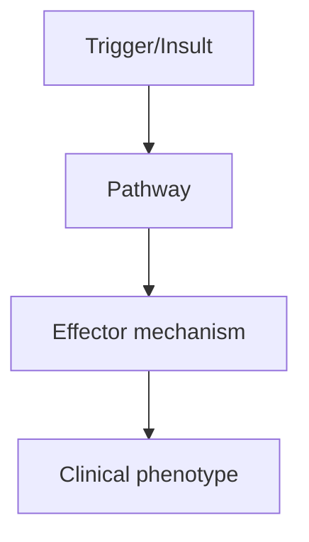
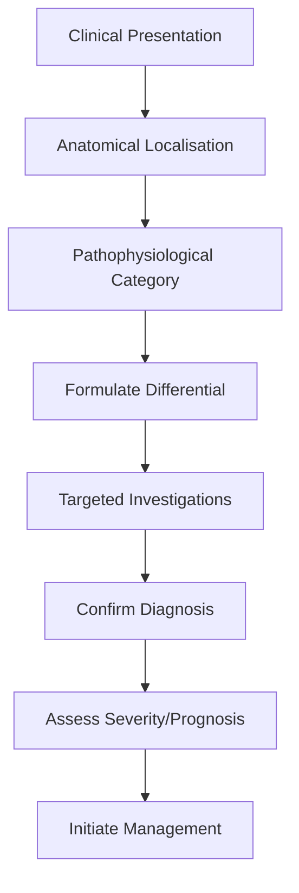
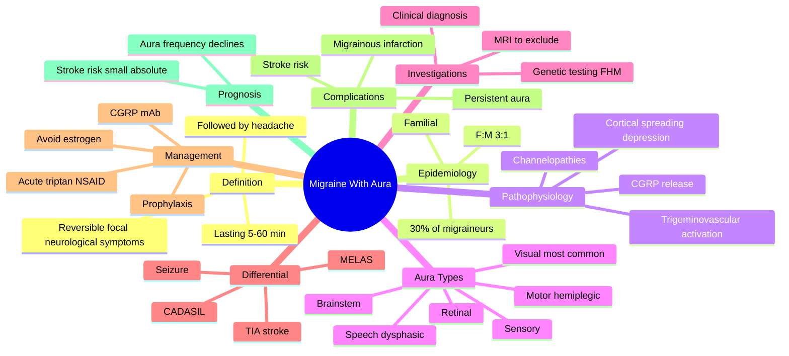

# Migraine With Aura

> [!tip] **High-Yield Definition**
> Migraine with focal neurological symptoms (visual, sensory, speech, motor, brainstem, retinal) preceding or accompanying headache. Aura develops over 5-20 min, lasts <60 min, fully reversible.

---

## 1. Definition / Epidemiology / Classification

### Definition
Migraine with focal neurological symptoms (visual, sensory, speech, motor, brainstem, retinal) preceding or accompanying headache. Aura develops over 5-20 min, lasts <60 min, fully reversible.

### Epidemiology
30% of migraineurs have aura. Female:male 2:1. Family history strong. Stroke risk 2x (especially with OCP use, smoking).

### Classification
| Variant | Key Features | Prognosis |
|---------|-------------|-----------|
| | | |

---

## 2. Aetiology / Pathophysiology

### Aetiology
Cortical spreading depression (CSD) - wave of neuronal depolarisation spreading across cortex. Genetic: FHM1 (CACNA1A, chromosome 19), FHM2 (ATP1A2, chromosome 1), FHM3 (SCN1A, chromosome 2). Triggers: visual stimuli, stress, hormonal.

### Pathophysiology

---

## 3. Clinical Features

### History
- **Onset/Duration:**
- **Progression:**
- **Key symptoms:**
- **Triggers:**
- **Systemic symptoms:**
- **Drug/Family/Social history:**

### Examination
| Domain | Key Findings | Localisation Value |
|--------|-------------|-------------------|
| | | |

### Specific Clinical Features
Visual aura (90%): zigzag lines, fortification spectra, scintillations, scotoma, hemianopia. Sensory: paraesthesia spreading over 20-30 min. Speech: dysphasia. Motor: hemiplegic (FHM, lasts hours). Brainstem: vertigo, ataxia, diplopia, dysarthria (basilar migraine). Retinal: monocular visual loss. Aura <60 min, headache follows within 60 min. Triggers: exercise, OCP.

---

## 4. Diagnostic Approach / Algorithm

---

## 5. Investigations

Clinical diagnosis (ICHD-3). MRI brain if: prolonged aura, atypical features, stroke risk factors, hemiplegic migraine (exclude dissection, MMD, FHM genetic). Exclude stroke in prolonged aura (>60 min) with MRI DWI.

---

## 6. Differential Diagnosis

| Differential | Distinguishing Features | Key Test |
|--------------|------------------------|----------|
| | | |

---

## 7. Management

Acute: triptans, NSAIDs, antiemetics. Avoid triptans in hemiplegic/basilar migraine (use NSAIDs). Prophylaxis: same as without aura. Avoid OCP in migraine with aura (stroke risk, especially smoking). Aspirin 75mg if stroke risk factors.

---

## 8. Drug Interactions / Contraindications / Comorbidity Cautions

| Drug | Interaction / Caution | Management |
|------|----------------------|------------|
| | | |

---

## 9. Procedures (if applicable)

### Procedure:
- **Indications:**
- **Contraindications:**
- **Preparation / Principle:**
- **Complications:**
- **Viva Pearls:**

---

## 10. Complications

| Complication | Frequency | Prevention / Monitoring | Management |
|--------------|-----------|------------------------|------------|
| | | | |

---

## 11. Red Flags / Emergencies

Prolonged aura >60 min, hemiplegic, brainstem aura, stroke risk factors, new aura after 50y, persistent neurology - all need MRI and stroke workup.

---

## 12. Prognosis

Aura may persist lifelong. Hemiplegic migraine variable. Stroke risk 2x especially with OCP/smoking. Pregnancy: improvement in 70%.

---

## 13. Topic Correlation

| Related Topic | Link | Key Overlap |
|---------------|------|-------------|
| | | |

---

## 14. Special Situations

| Situation | Consideration |
|-----------|---------------|
| **Pregnancy** | |
| **Lactation** | |
| **Paediatric** | |
| **Elderly / Frail** | |
| **Renal impairment** | |
| **Hepatic impairment** | |
| **Immunocompromised** | |
| **Perioperative** | |
| **Driving / DVLA** | |
| **Occupational** | |

---

## FCPS/MRCP High-Yield Summary

| Category | Key Points |
|----------|------------|
| **Definition** | Migraine with focal neurological symptoms (visual, sensory, speech, motor, brainstem, retinal) preceding or accompanying headache. Aura develops over 5-20 min, lasts <60 min, fully reversible. |
| **Epidemiology** | 30% of migraineurs have aura. Female:male 2:1. Family history strong. Stroke risk 2x (especially with OCP use, smoking). |
| **Pathophysiology** | |
| **Clinical** | Visual aura (90%): zigzag lines, fortification spectra, scintillations, scotoma, hemianopia. Sensory: paraesthesia spreading over 20-30 min. Speech: dysphasia. Motor: hemiplegic (FHM, lasts hours). Br |
| **Diagnosis** | |
| **Investigations** | Clinical diagnosis (ICHD-3). MRI brain if: prolonged aura, atypical features, stroke risk factors, hemiplegic migraine (exclude dissection, MMD, FHM genetic). Exclude stroke in prolonged aura (>60 min |
| **Management** | Acute: triptans, NSAIDs, antiemetics. Avoid triptans in hemiplegic/basilar migraine (use NSAIDs). Prophylaxis: same as without aura. Avoid OCP in migraine with aura (stroke risk, especially smoking).  |
| **Complications** | |
| **Prognosis** | Aura may persist lifelong. Hemiplegic migraine variable. Stroke risk 2x especially with OCP/smoking. Pregnancy: improvement in 70%. |
| **Viva Pearls** | |
| **Drug Doses** | |
| **Scoring Systems** | |
| **Genetics** | |
| **Imaging Signs** | |

---

## Viva Questions (PACES/FCPS Style)

1. **Q:** Define Migraine With Aura and classify its variants.
   **A:** Based on the definition above.

2. **Q:** What are the key clinical features?
   **A:** Visual aura (90%): zigzag lines, fortification spectra, scintillations, scotoma, hemianopia. Sensory: paraesthesia spreading over 20-30 min. Speech: dysphasia. Motor: hemiplegic (FHM, lasts hours). Brainstem: vertigo, ataxia, diplopia, dysarthria (basilar migraine). Retinal: monocular visual loss. A

3. **Q:** What is the first-line treatment?
   **A:** Based on the management section.

4. **Q:** What are the red flags requiring urgent referral?
   **A:** Prolonged aura >60 min, hemiplegic, brainstem aura, stroke risk factors, new aura after 50y, persistent neurology - all need MRI and stroke workup.

5. **Q:** What is the prognosis?
   **A:** Aura may persist lifelong. Hemiplegic migraine variable. Stroke risk 2x especially with OCP/smoking. Pregnancy: improvement in 70%.

6. **Q:** How do you differentiate Migraine With Aura from key differentials?
   **A:** Clinical features, investigations, and response to treatment.

7. **Q:** What investigations are most useful?
   **A:** Based on the investigations section.

8. **Q:** Describe the stepwise management approach.
   **A:** Based on the management algorithm.

9. **Q:** What are the emergency presentations?
   **A:** Based on the red flags section.

10. **Q:** How does management change in pregnancy/paediatrics/elderly?
    **A:** Special considerations per population.

---

## Common Confusions / Exam Traps

| Confusion | Clarification |
|-----------|---------------|
| | |

---

## Mnemonics
1. **AURA VIPS** = **A**maurosis fugax/**V**isual/**I**psilateral/**P**aresthesia/**S**peech - the cardinal aura symptoms (use: any one is enough, but multiple increase specificity)
2. **SHARED** = **S**low march >5 min, **H**eadache within 60 min, **A**ura <60 min each, **R**eversible, **E**ach aura modality in sequence, **D**oesn't fit TIA profile (use: differentiate from TIA - gradual spread vs sudden)
3. **FHM GENES** = **F**amilial hemiplegic migraine - **H**emiplegic with **M**igraine: **C**ACNA1A, **A**TP1A2, **S**CN1A (FHM1/2/3) (use: channelopathy genes for hemiplegic migraine - all monogenic, autosomal dominant)

---

## Mind Map

## Spaced Repetition Trackers

| Review Interval | Date | Score (0-5) | Notes |
|-----------------|------|-------------|-------|
| Day 1 | | | |
| Day 3 | | | |
| Day 7 | | | |
| Day 14 | | | |
| Day 30 | | | |
| Day 90 | | | |

## Self-Test Scorecard

| Section | Score /5 | Last Attempt |
|---------|----------|--------------|
| Definition & Epidemiology | | | |
| Pathophysiology | | | |
| Clinical Features | | | |
| Investigations | | | |
| Differential | | | |
| Management - Acute | | | |
| Management - Prophylaxis | | | |
| Complications | | | |
| Viva Questions | | | |
| MCQs | | | |
| SBAs | | | |

## MCQs (10)

1. **Question:** Which of the following aura characteristics most reliably distinguishes migraine aura from a transient ischaemic attack (TIA)?
   **Options:** A. Sudden onset B. Positive visual symptoms with gradual spread over >5 minutes C. Presence of weakness D. Duration of 30 minutes
   **Answer:** B
   **Explanation:** Migraine aura typically develops gradually over 5-20 minutes (positive then negative symptoms) and lasts <60 minutes per modality. TIA is sudden, maximal at onset, and usually negative (loss) symptoms. The gradual "march" of symptoms is the single most useful distinguishing feature.

2. **Question:** A 28-year-old woman with hemiplegic migraine is concerned about pregnancy. Which gene mutation is associated with the highest risk of prolonged hemiplegic aura and possible coma with fever?
   **Options:** A. CACNA1A (FHM1) B. ATP1A2 (FHM2) C. SCN1A (FHM3) D. KCNK18 (TRESK)
   **Answer:** A
   **Explanation:** CACNA1A (FHM1) encodes the P/Q-type voltage-gated calcium channel and is associated with severe, prolonged hemiplegic attacks, sometimes triggered by minor head trauma with coma. ATP1A2 (FHM2) causes Na/K-ATPase dysfunction and is more often associated with seizures. SCN1A (FHM3) causes sodium channel dysfunction.

3. **Question:** A 32-year-old woman describes recurrent, fully reversible scintillating scotomas in one hemifield lasting 25 minutes, followed by unilateral throbbing headache with photophobia. Diagnosis?
   **Options:** A. Retinal migraine B. Migraine with typical aura C. Cluster headache D. Occipital epilepsy
   **Answer:** B
   **Explanation:** Visual symptoms in one hemifield, lasting 5-60 minutes, followed by migraine-type headache is typical of migraine with typical aura (ICHD-3 1.2.1). Retinal migraine (1.2.4) is monocular, not hemifield. Cluster headache has autonomic features and is shorter.

4. **Question:** Migraine with brainstem aura (basilar-type aura) characteristically includes all EXCEPT:
   **Options:** A. Dysarthria B. Vertigo C. Diplopia D. Progressive unilateral motor weakness lasting >60 minutes
   **Answer:** D
   **Explanation:** Migraine with brainstem aura (1.2.2) includes at least two brainstem symptoms: dysarthria, vertigo, tinnitus, hypacusis, diplopia, ataxia, decreased consciousness. Motor weakness is NOT a brainstem aura symptom - it defines hemiplegic migraine. By definition, motor symptoms must be absent to diagnose brainstem aura.

5. **Question:** Which medication class is contraindicated in patients with hemiplegic migraine or migraine with brainstem aura?
   **Options:** A. Paracetamol B. Triptans C. CGRP monoclonal antibodies D. Antiemetics
   **Answer:** B
   **Explanation:** Triptans (5-HT1B/1D agonists) are generally contraindicated in hemiplegic migraine and basilar-type aura due to theoretical risk of vasoconstriction exacerbating ischaemia, although recent evidence suggests they may be safe. They are also contraindicated in established cardiovascular/cerebrovascular disease.

6. **Question:** The underlying electrophysiological substrate of migraine aura is thought to be:
   **Options:** A. Cortical spreading depression B. Hippocampal kindling C. Thalamocortical dysrhythmia D. Basal ganglia hyperconnectivity
   **Answer:** A
   **Explanation:** Cortical spreading depression (Leao, 1944) is a wave of neuronal depolarisation followed by suppression of activity that slowly propagates across the cortex at 2-5 mm/min. It corresponds to the clinical spread of visual aura and triggers trigeminovascular activation.

7. **Question:** A 25-year-old woman with migraine with aura develops a stroke during a migraine attack with persistent neurological deficit. MRI confirms ischaemic infarction in a vascular territory. Diagnosis?
   **Options:** A. TIA B. Migrainous infarction C. CADASIL D. Hemiplegic migraine
   **Answer:** B
   **Explanation:** Migrainous infarction (ICHD-3 1.4.1) is a stroke occurring during a typical migraine with aura attack, with ischaemic neuroimaging changes in a relevant territory. It is a diagnosis of exclusion. Risk is increased in migraine with aura, particularly with combined oral contraceptive use and smoking.

8. **Question:** Combined oral contraceptives are contraindicated in migraine with aura primarily because of increased risk of:
   **Options:** A. Breast cancer B. Ischaemic stroke C. Ovarian cancer D. Venous thromboembolism
   **Answer:** B
   **Explanation:** Migraine with aura approximately doubles the risk of ischaemic stroke; combined oral contraceptives further increase this risk and are contraindicated (UK MEC category 4) in women with migraine with aura. Progestogen-only methods are preferred.

9. **Question:** Persistent aura without infarction is defined as aura symptoms lasting:
   **Options:** A. >60 minutes but <24 hours B. >1 week without neuroimaging evidence of infarction C. >24 hours D. Any duration if persistent
   **Answer:** B
   **Explanation:** Persistent aura without infarction (ICHD-3 1.4.2) is defined as aura symptoms persisting for >1 week without neuroimaging evidence of infarction. Persistent aura with infarction (1.4.3) shows ischaemic changes on imaging. Both are diagnoses of exclusion.

10. **Question:** Which monoclonal antibody is licensed for the prevention of episodic and chronic migraine?
    **Options:** A. Eculizumab B. Erenumab C. Rituximab D. Infliximab
    **Answer:** B
    **Explanation:** Erenumab (anti-CGRP receptor), fremanezumab, galcanezumab (anti-CGRP ligand) and eptinezumab are the four CGRP pathway monoclonal antibodies licensed for migraine prevention. They are given monthly (or quarterly) subcutaneously (or IV) and are well tolerated with no major cardiovascular safety signals to date.

## SBA Questions (10)

1. **Scenario:** A 30-year-old woman describes gradual onset of scintillating zig-zag lines in her right visual field, spreading over 10 minutes, lasting 30 minutes, followed by throbbing left-sided headache with photophobia lasting 6 hours.
   **Question:** Most appropriate diagnosis?
   **Options:** A. Migraine without aura B. Migraine with typical aura C. Cluster headache D. Retinal migraine
   **Answer:** B
   **Explanation:** Gradual spread, duration 5-60 min, followed by typical migraine headache, in a hemifield (not monocular) is migraine with typical aura (ICHD-3 1.2.1). Retinal migraine is monocular.

2. **Scenario:** A 24-year-old man with hemiplegic migraine is offered triptans by a colleague but his consultant advises against them.
   **Question:** What is the principal reason triptans are usually avoided in hemiplegic migraine?
   **Options:** A. They are ineffective in migraine with aura B. They are contraindicated in basilar-type aura and hemiplegic migraine due to theoretical ischaemic risk C. They cause severe hypertension D. They interact with antiepileptics
   **Answer:** B
   **Explanation:** Triptans are generally avoided in hemiplegic migraine, basilar-type aura, and any history of stroke/TIA or coronary disease. Although evidence of harm is limited, the precautionary principle applies because of vasoconstrictive potential.

3. **Scenario:** A 35-year-old woman with migraine with aura wishes to start a contraceptive.
   **Question:** Most appropriate advice?
   **Options:** A. Combined oral contraceptive pill is first choice B. Progestogen-only pill or non-hormonal methods are preferred C. Injectable progestogen only is contraindicated D. Levonorgestrel IUS is contraindicated
   **Answer:** B
   **Explanation:** Migraine with aura approximately doubles stroke risk; combined hormonal contraceptives are contraindicated (UK MEC 4). Progestogen-only methods (pill, implant, injection, LNG-IUS) and barrier or copper IUD are appropriate alternatives. Smoking should also be addressed.

4. **Scenario:** A 22-year-old man has recurrent unilateral throbbing headaches preceded by homonymous hemianopia lasting 20 minutes. His mother and maternal uncle had similar headaches with hemiplegia.
   **Question:** Most likely genetic diagnosis?
   **Options:** A. Sporadic hemiplegic migraine B. Familial hemiplegic migraine type 1 (CACNA1A) C. CADASIL D. MELAS
   **Answer:** B
   **Explanation:** Familial hemiplegic migraine is autosomal dominant. Family history of hemiplegic migraine points to FHM, most commonly due to CACNA1A (FHM1). Genetic testing can be considered, particularly if associated with ataxia, seizures, or coma with minor head trauma.

5. **Scenario:** A patient with migraine with aura presents with an attack lasting >1 week of visual symptoms without infarction on MRI.
   **Question:** Diagnosis?
   **Options:** A. Status migrainosus B. Persistent aura without infarction C. Migraine with brainstem aura D. Hemiplegic migraine
   **Answer:** B
   **Explanation:** Persistent aura without infarction (ICHD-3 1.4.2) requires aura symptoms lasting >1 week with no evidence of infarction on neuroimaging. Status migrainosus refers to a headache phase >72 h.

6. **Scenario:** A 40-year-old woman with episodic migraine with aura has 4 attacks per month despite topiramate 100 mg bd. Her BMI is 32. She is a smoker. She asks about CGRP monoclonal antibody therapy.
   **Question:** Most appropriate next step?
   **Options:** A. Stop topiramate and start flunarizine B. Add propranolol C. Add a CGRP monoclonal antibody (e.g. erenumab) D. Add pizotifen
   **Answer:** C
   **Explanation:** NICE/SIGN guidelines recommend CGRP pathway monoclonal antibodies (erenumab, fremanezumab, galcanezumab) in patients with ≥4 migraine days/month who have failed ≥2 prior preventive therapies. Lifestyle modification (smoking cessation, weight loss) should also be addressed.

7. **Scenario:** A 28-year-old patient with hemiplegic migraine develops unilateral weakness lasting 36 hours during an attack, with normal MRI.
   **Question:** Most appropriate management?
   **Options:** A. IV thrombolysis B. Aspirin 300 mg C. Conservative: rest, hydration, antiemetics, consider IV magnesium; steroids sometimes used D. Lumbar puncture
   **Answer:** C
   **Explanation:** A prolonged hemiplegic aura without infarction is treated supportively. Thrombolysis is contraindicated in migraine mimic. IV magnesium 1-2 g and IV prochlorperazine or chlorpromazine are often used in hospital; consider acetazolamide in familial cases.

8. **Scenario:** A patient with migraine with aura asks whether she is at increased risk of stroke.
   **Question:** Most appropriate response?
   **Options:** A. No increased risk B. Risk is approximately doubled; absolute risk remains small, particularly in young women without smoking C. Risk is 10-fold higher D. Risk is only increased in those over 60
   **Answer:** B
   **Explanation:** Migraine with aura approximately doubles ischaemic stroke risk. The absolute risk is small in young women (~3-4 per 10,000 per year) but rises substantially with smoking, combined oral contraceptives, and obesity. Risk reduction includes smoking cessation and avoidance of oestrogen-containing contraception.

9. **Scenario:** A 45-year-old man with migraine with visual aura and a family history of stroke and dementia develops cognitive decline and white matter lesions on MRI.
   **Question:** Most appropriate test?
   **Options:** A. CSF tau and amyloid B. Genetic testing for NOTCH3 (CADASIL) C. EEG D. Anti-NMDA receptor antibodies
   **Answer:** B
   **Explanation:** CADASIL (Cerebral Autosomal Dominant Arteriopathy with Subcortical Infarcts and Leukoencephalopathy) presents with migraine with aura, lacunar strokes, subcortical dementia, and confluent white matter changes. Diagnosis is by NOTCH3 genetic testing or skin biopsy with granular osmiophilic material on EM.

10. **Scenario:** A 33-year-old woman with migraine with aura is started on topiramate for prophylaxis.
    **Question:** Which side effect should be specifically counselled and monitored?
    **Options:** A. Hyperthyroidism B. Renal calculi and weight loss C. Hyponatraemia D. Galactorrhoea
    **Answer:** B
    **Explanation:** Topiramate commonly causes paraesthesia, cognitive slowing ("dopamax"), weight loss, renal calculi (carbonic anhydrase inhibition) and is teratogenic (cleft lip/palate) - effective contraception is essential in women of childbearing potential. Hyperkalaemia and metabolic acidosis are rare.

## Flashcards

- **Q:** What is the duration of a single migraine aura symptom?
  **A:** 5-60 minutes.
- **Q:** What is the most common type of migraine aura?
  **A:** Visual (scintillating scotoma, fortification spectra).
- **Q:** Name the three genes for familial hemiplegic migraine.
  **A:** CACNA1A (FHM1), ATP1A2 (FHM2), SCN1A (FHM3).
- **Q:** Why are triptans avoided in hemiplegic migraine?
  **A:** Theoretical ischaemic risk; precautionary contraindication.
- **Q:** Why are combined oral contraceptives contraindicated in migraine with aura?
  **A:** Increased risk of ischaemic stroke.
- **Q:** What is cortical spreading depression?
  **A:** Wave of neuronal depolarisation followed by suppression, propagating at 2-5 mm/min across cortex, underlying aura.
- **Q:** What is migrainous infarction?
  **A:** Stroke occurring during a typical migraine with aura attack with ischaemic changes on imaging in a relevant territory (ICHD-3 1.4.1).
- **Q:** What is the definition of persistent aura without infarction?
  **A:** Aura symptoms lasting >1 week without evidence of infarction on neuroimaging.
- **Q:** Name three CGRP monoclonal antibodies used in migraine.
  **A:** Erenumab, fremanezumab, galcanezumab (also eptinezumab IV).
- **Q:** What is the differential of hemiplegic migraine?
  **A:** TIA, stroke, seizure with Todd's paresis, MELAS, CADASIL, hemiplegic pattern of viral encephalitis.
- **Q:** How long can aura symptoms last in brainstem aura?
  **A:** 5-60 minutes per symptom modality.
- **Q:** Which acute medication is safe in migraine with aura without motor symptoms?
  **A:** Triptans (e.g. sumatriptan) are first-line; NSAIDs and paracetamol also used.

## Answer Key with Explanations

### MCQs
1. B - Gradual spread over >5 minutes is the key feature distinguishing migraine aura from TIA.
2. A - CACNA1A (FHM1) is associated with severe, prolonged hemiplegic attacks and trauma-triggered coma.
3. B - Hemifield visual aura followed by typical migraine headache = migraine with typical aura.
4. D - Motor weakness is not a brainstem aura symptom; its presence defines hemiplegic migraine.
5. B - Triptans are generally contraindicated in hemiplegic and basilar-type aura.
6. A - Cortical spreading depression is the electrophysiological substrate of aura.
7. B - Migrainous infarction is stroke occurring during a typical aura attack.
8. B - Combined oral contraceptives are contraindicated due to increased ischaemic stroke risk.
9. B - Persistent aura without infarction is defined as aura lasting >1 week without infarction.
10. B - Erenumab is the CGRP receptor monoclonal antibody licensed for migraine prevention.

### SBAs
1. B - Classic migraine with typical aura (visual hemifield).
2. B - Triptans avoided in hemiplegic and basilar-type aura.
3. B - Progestogen-only or non-hormonal methods preferred.
4. B - Autosomal dominant family history points to FHM1 (CACNA1A).
5. B - Persistent aura without infarction lasts >1 week.
6. C - CGRP monoclonal antibodies indicated after failure of ≥2 preventives.
7. C - Conservative treatment with rest, hydration, IV magnesium.
8. B - Doubled stroke risk, but absolute risk small in young non-smokers.
9. B - NOTCH3 testing for suspected CADASIL.
10. B - Topiramate causes renal calculi and weight loss; counsel on these.

## Tags
**Tags:** #neurology #headache #migraine #aura #CGRP #cortical-spreading-depression #hemiplegic-migraine #CADASIL #FHM #stroke-risk #FCPS #MRCP #high-yield

## Local Navigation
**Heading Hub:** [[../Hub]]  
**Chapter Hierarchy:** [[Davidson Chapter 25 - Neurology Hierarchy]]  
**Chapter MOC:** [[Neurology MOC]]  
**Drug Reference:** [[../00_Index/Neurology Drug Reference]]  
