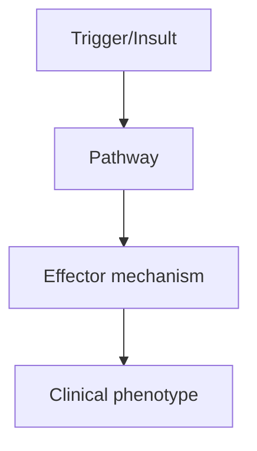
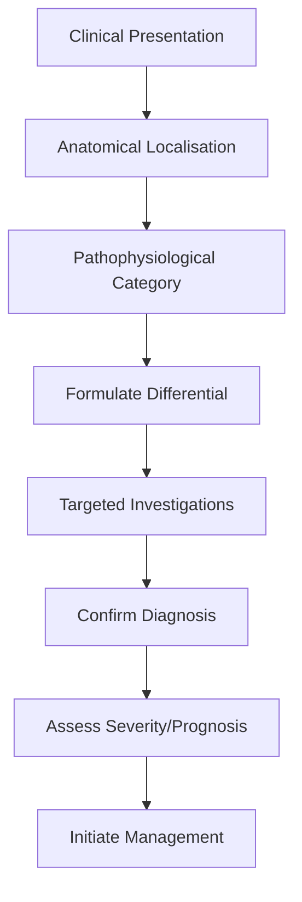
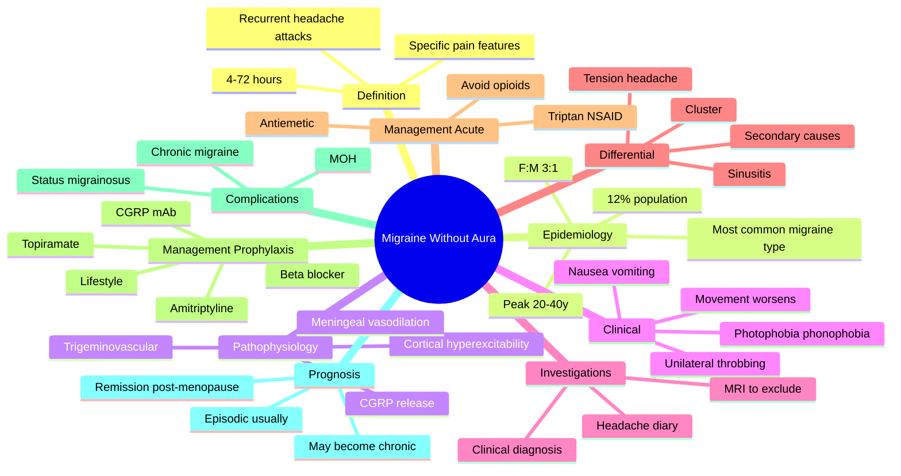

# Migraine Without Aura

> [!tip] **High-Yield Definition**
> Recurrent disabling headache disorder, 4-72h duration, with characteristic features (unilateral, pulsating, moderate-severe, photophobia/phonophobia, nausea, aggravates by activity). ICHD-3 criteria: ≥5 attacks, lasting 4-72h, with ≥2 of (unilateral, pulsating, moderate-severe, routine activity aggravates) and ≥1 of (nausea/vomiting, photophobia+phonophobia).

---

## 1. Definition / Epidemiology / Classification

### Definition
Recurrent disabling headache disorder, 4-72h duration, with characteristic features (unilateral, pulsating, moderate-severe, photophobia/phonophobia, nausea, aggravates by activity). ICHD-3 criteria: ≥5 attacks, lasting 4-72h, with ≥2 of (unilateral, pulsating, moderate-severe, routine activity aggravates) and ≥1 of (nausea/vomiting, photophobia+phonophobia).

### Epidemiology
Prevalence: 15% of population. Female:male 3:1. Peak age 25-55. Leading cause of disability in young adults. Family history in 50-70%.

### Classification
| Variant | Key Features | Prognosis |
|---------|-------------|-----------|
| | | |

---

## 2. Aetiology / Pathophysiology

### Aetiology
Genetic predisposition (polygenic). Triggers: stress, sleep change, hormonal (menstruation, OCP), weather, certain foods (cheese, chocolate, red wine, MSG), alcohol, missed meals, exercise, sensory stimuli. Pathophysiology: CSD (cortical spreading depression), trigeminovascular system activation, neurogenic inflammation, serotonin (5-HT1B/1D) involvement.

### Pathophysiology

---

## 3. Clinical Features

### History
- **Onset/Duration:**
- **Progression:**
- **Key symptoms:**
- **Triggers:**
- **Systemic symptoms:**
- **Drug/Family/Social history:**

### Examination
| Domain | Key Findings | Localisation Value |
|--------|-------------|-------------------|
| | | |

### Specific Clinical Features
Premonitory (hours before): mood change, food cravings, fatigue, yawning, neck stiffness. Headache: unilateral (60%), pulsating, moderate-severe, aggravates by activity. Duration 4-72h. Associated: nausea (80%), vomiting (40%), photophobia (90%), phonophobia (80%), osmophobia. Postdrome: fatigue, mood change, food cravings. Triggers common.

---

## 4. Diagnostic Approach / Algorithm

---

## 5. Investigations

Diagnosis is clinical (ICHD-3). Neuroimaging NOT needed for typical migraine. Consider MRI if: focal neurology, atypical features, change in pattern, new onset >50y, seizures, papilloedema, persistent neurological deficit.

---

## 6. Differential Diagnosis

| Differential | Distinguishing Features | Key Test |
|--------------|------------------------|----------|
| | | |

---

## 7. Management

Acute: simple analgesics (paracetamol 1g, ibuprofen 400-600mg, naproxen 500-825mg), antiemetics (metoclopramide 10mg, domperidone 10mg), triptans (sumatriptan 50-100mg PO/6mg SC/10-20mg IN, rizatriptan 10mg, eletriptan 40-80mg). Avoid opioids. Prophylaxis: propranolol 40-160mg/day, topiramate 50-100mg/day, candesartan 8-16mg/day, amitriptyline 10-75mg ON, CGRP mAbs (erenumab, fremanezumab, galcanezumab).

---

## 8. Drug Interactions / Contraindications / Comorbidity Cautions

| Drug | Interaction / Caution | Management |
|------|----------------------|------------|
| | | |

---

## 9. Procedures (if applicable)

### Procedure:
- **Indications:**
- **Contraindications:**
- **Preparation / Principle:**
- **Complications:**
- **Viva Pearls:**

---

## 10. Complications

| Complication | Frequency | Prevention / Monitoring | Management |
|--------------|-----------|------------------------|------------|
| | | | |

---

## 11. Red Flags / Emergencies

Sudden severe (thunderclap), new onset >50y, focal neurology, fever, papilloedema, change in pattern, persistent aura >60min, hemiplegic migraine features, seizures.

---

## 12. Prognosis

Lifelong condition with variable course. Remission common with age. Treatable with good outcomes. Avoid medication overuse (MOH).

---

## 13. Topic Correlation

| Related Topic | Link | Key Overlap |
|---------------|------|-------------|
| | | |

---

## 14. Special Situations

| Situation | Consideration |
|-----------|---------------|
| **Pregnancy** | |
| **Lactation** | |
| **Paediatric** | |
| **Elderly / Frail** | |
| **Renal impairment** | |
| **Hepatic impairment** | |
| **Immunocompromised** | |
| **Perioperative** | |
| **Driving / DVLA** | |
| **Occupational** | |

---

## FCPS/MRCP High-Yield Summary

| Category | Key Points |
|----------|------------|
| **Definition** | Recurrent disabling headache disorder, 4-72h duration, with characteristic features (unilateral, pulsating, moderate-severe, photophobia/phonophobia, nausea, aggravates by activity). ICHD-3 criteria:  |
| **Epidemiology** | Prevalence: 15% of population. Female:male 3:1. Peak age 25-55. Leading cause of disability in young adults. Family history in 50-70%. |
| **Pathophysiology** | |
| **Clinical** | Premonitory (hours before): mood change, food cravings, fatigue, yawning, neck stiffness. Headache: unilateral (60%), pulsating, moderate-severe, aggravates by activity. Duration 4-72h. Associated: na |
| **Diagnosis** | |
| **Investigations** | Diagnosis is clinical (ICHD-3). Neuroimaging NOT needed for typical migraine. Consider MRI if: focal neurology, atypical features, change in pattern, new onset >50y, seizures, papilloedema, persistent |
| **Management** | Acute: simple analgesics (paracetamol 1g, ibuprofen 400-600mg, naproxen 500-825mg), antiemetics (metoclopramide 10mg, domperidone 10mg), triptans (sumatriptan 50-100mg PO/6mg SC/10-20mg IN, rizatripta |
| **Complications** | |
| **Prognosis** | Lifelong condition with variable course. Remission common with age. Treatable with good outcomes. Avoid medication overuse (MOH). |
| **Viva Pearls** | |
| **Drug Doses** | |
| **Scoring Systems** | |
| **Genetics** | |
| **Imaging Signs** | |

---

## Viva Questions (PACES/FCPS Style)

1. **Q:** Define Migraine Without Aura and classify its variants.
   **A:** Based on the definition above.

2. **Q:** What are the key clinical features?
   **A:** Premonitory (hours before): mood change, food cravings, fatigue, yawning, neck stiffness. Headache: unilateral (60%), pulsating, moderate-severe, aggravates by activity. Duration 4-72h. Associated: nausea (80%), vomiting (40%), photophobia (90%), phonophobia (80%), osmophobia. Postdrome: fatigue, mo

3. **Q:** What is the first-line treatment?
   **A:** Based on the management section.

4. **Q:** What are the red flags requiring urgent referral?
   **A:** Sudden severe (thunderclap), new onset >50y, focal neurology, fever, papilloedema, change in pattern, persistent aura >60min, hemiplegic migraine features, seizures.

5. **Q:** What is the prognosis?
   **A:** Lifelong condition with variable course. Remission common with age. Treatable with good outcomes. Avoid medication overuse (MOH).

6. **Q:** How do you differentiate Migraine Without Aura from key differentials?
   **A:** Clinical features, investigations, and response to treatment.

7. **Q:** What investigations are most useful?
   **A:** Based on the investigations section.

8. **Q:** Describe the stepwise management approach.
   **A:** Based on the management algorithm.

9. **Q:** What are the emergency presentations?
   **A:** Based on the red flags section.

10. **Q:** How does management change in pregnancy/paediatrics/elderly?
    **A:** Special considerations per population.

---

## Common Confusions / Exam Traps

| Confusion | Clarification |
|-----------|---------------|
| | |

---

## Mnemonics
1. **POUND** = **P**ulsatile, **O**ne-day duration 4-72h, **U**nilateral, **N**ausea/vomiting, **D**isabling (use: 2 of 4 pain features + nausea/vomiting OR photophobia/phonophobia = ICHD-3 criteria)
2. **MIGRAINE 5-4-3-2-1** = **5** previous attacks, **4**-72h duration, **2** of 4 pain features (unilateral/pulsatile/moderate-severe/aggravation by movement), **1** of nausea/photophobia/phonophobia (use: ICHD-3 1.1 diagnostic mnemonic)
3. **TRIPTANS TARGET 5HT** = **T**riptans act on **5HT**-**1B**/**1D** receptors; t**R**y early in attack (use: triptans most effective within 1h of pain onset, less effective once allodynia develops)

---

## Mind Map

## Spaced Repetition Trackers

| Review Interval | Date | Score (0-5) | Notes |
|-----------------|------|-------------|-------|
| Day 1 | | | |
| Day 3 | | | |
| Day 7 | | | |
| Day 14 | | | |
| Day 30 | | | |
| Day 90 | | | |

## Self-Test Scorecard

| Section | Score /5 | Last Attempt |
|---------|----------|--------------|
| Definition & Epidemiology | | | |
| Pathophysiology | | | |
| Clinical Features | | | |
| Investigations | | | |
| Differential | | | |
| Management - Acute | | | |
| Management - Prophylaxis | | | |
| Complications | | | |
| Viva Questions | | | |
| MCQs | | | |
| SBAs | | | |

## MCQs (10)

1. **Question:** A 28-year-old woman has had 6 episodes of unilateral throbbing headache lasting 8 hours, with nausea and photophobia, made worse by climbing stairs. Which feature must be present to diagnose migraine without aura (ICHD-3 1.1)?
   **Options:** A. Aura B. At least 2 of 4 pain features and at least 1 of nausea/photophobia/phonophobia C. Bilateral pain D. Family history of migraine
   **Answer:** B
   **Explanation:** ICHD-3 1.1 requires: at least 5 attacks lasting 4-72 hours, with at least 2 of 4 pain features (unilateral, pulsating, moderate-severe, aggravation by routine physical activity), and at least 1 of nausea/vomiting OR photophobia AND phonophobia. Aura is by definition absent in migraine without aura.

2. **Question:** Which of the following is the FIRST-LINE acute treatment for moderate-severe migraine?
   **Options:** A. Opioid analgesics B. Triptans (e.g. sumatriptan) C. Codeine-based combinations D. Beta-blockers
   **Answer:** B
   **Explanation:** Triptans (5-HT1B/1D agonists) are first-line for moderate-severe acute migraine attacks. They are most effective when taken early in the attack. Opioids should be avoided due to risk of medication-overuse headache and dependence. NSAIDs (e.g. ibuprofen, naproxen) are used for mild-moderate attacks or in combination with triptans.

3. **Question:** A 35-year-old man has 8 migraine days per month. Which is the most appropriate first-line pharmacological prophylaxis?
   **Options:** A. Paracetamol 1 g qds B. Topiramate 25 mg nocte, titrated to 50-100 mg bd C. Sumatriptan 50 mg prn D. Pizotifen 0.5 mg tds
   **Answer:** B
   **Explanation:** First-line prophylaxis options include topiramate, propranolol, and amitriptyline. Pizotifen and gabapentin are second-line. Sumatriptan is an acute treatment. Paracetamol prophylaxis is ineffective. Indications for prophylaxis include ≥4 migraine days/month causing significant disability.

4. **Question:** Which class of medication has the strongest evidence for prevention of episodic migraine with the lowest side effect burden?
   **Options:** A. Tricyclic antidepressants B. CGRP monoclonal antibodies C. Beta-blockers D. Calcium channel blockers
   **Answer:** B
   **Explanation:** CGRP monoclonal antibodies (erenumab, fremanezumab, galcanezumab) have demonstrated efficacy with placebo-like tolerability in episodic and chronic migraine. They are particularly useful when conventional preventives are contraindicated, not tolerated, or have failed.

5. **Question:** Medication-overuse headache (MOH) is defined as headache occurring on ≥15 days/month for >3 months due to regular intake of acute medication on ≥:
   **Options:** A. ≥5 days/month for simple analgesics B. ≥10 days/month for triptans, ergots, opioids or combination analgesics; ≥15 days/month for simple analgesics C. ≥20 days/month for any analgesic D. Any daily use
   **Answer:** B
   **Explanation:** ICHD-3 8.2 defines MOH as ≥15 headache days/month for >3 months with regular intake of simple analgesics on ≥15 days/month OR triptans/ergots/opioids/combination analgesics on ≥10 days/month. Withdrawal of the overused medication is the treatment of choice.

6. **Question:** Which feature of migraine pain most strongly supports the diagnosis over tension-type headache?
   **Options:** A. Bilateral location B. Pressing quality C. Aggravation by routine physical activity D. Mild intensity
   **Answer:** C
   **Explanation:** Aggravation by routine physical activity (e.g. walking, climbing stairs) and a pulsating quality are features of migraine. Tension-type headache is typically bilateral, pressing/tightening, mild-moderate, and not aggravated by activity.

7. **Question:** A patient with episodic migraine takes sumatriptan on 4 days/week. She now has daily headache. What is the most appropriate next step?
   **Options:** A. Increase sumatriptan dose B. Add propranolol C. Stop sumatriptan and start a preventive; consider CGRP monoclonal antibody D. Continue current management
   **Answer:** C
   **Explanation:** This is likely medication-overuse headache from triptan overuse (>10 days/month). Treatment is to stop the overused acute medication (taper if opioid or barbiturate; abrupt stop usually OK for triptans/simple analgesics) and start preventive therapy. Topiramate or CGRP mAbs are evidence-based options.

8. **Question:** A 40-year-old woman with menstrual-related migraine without aura asks about acute treatment during her period. Which is the most effective option?
   **Options:** A. Paracetamol 1 g qds throughout the month B. Frovatriptan 2.5 mg bd for 4-6 days perimenstrually C. Codeine 30 mg as required D. Sumatriptan 6 mg SC only
   **Answer:** B
   **Explanation:** Menstrual migraine is best treated with perimenstrual prophylaxis using a long-acting triptan (e.g. frovatriptan, naratriptan) or NSAID for 4-6 days starting 2 days before menses. Continuous prophylaxis (e.g. topiramate) or hormonal strategies (e.g. desogestrel, tibolone) are alternatives. Combined oral contraceptives are generally avoided in migraine with aura but can be cautiously used in migraine without aura in non-smokers.

9. **Question:** Which of the following is an indication for brain imaging in a patient with migraine?
   **Options:** A. Bilateral headache B. Headache worse on standing C. New neurological deficit, change in attack frequency or character after age 50, or seizures D. Family history of migraine
   **Answer:** C
   **Explanation:** Brain imaging (MRI) is NOT routinely indicated in typical migraine. Red flags for imaging (SNOOP) include: Systemic symptoms/fever, Neurologic symptoms/signs, Onset sudden/thunderclap, Older age (>50 new onset), Pattern change (new or progressive). Aura always resolving within 60 min, typical pattern, normal exam do not require imaging.

10. **Question:** Which acute medication should be AVOIDED in a patient with a history of ischaemic heart disease presenting with severe migraine?
    **Options:** A. Paracetamol B. Ibuprofen C. Sumatriptan D. Metoclopramide
    **Answer:** C
    **Explanation:** Triptans (5-HT1B agonists) cause coronary vasoconstriction and are contraindicated in patients with ischaemic heart disease, coronary vasospasm (Prinzmetal angina), uncontrolled hypertension, or history of stroke/TIA. NSAIDs are also used cautiously. CGRP mAbs and gepants (e.g. rimegepant, ubrogepant) are alternative acute options in this population.

## SBA Questions (10)

1. **Scenario:** A 26-year-old woman with 6 unilateral throbbing headaches per month lasting 6-12 hours, with photophobia and nausea.
   **Question:** Diagnosis?
   **Options:** A. Episodic migraine without aura B. Episodic migraine with aura C. Chronic migraine D. Tension-type headache
   **Answer:** A
   **Explanation:** <15 headache days/month with migraine features and no aura = episodic migraine without aura (ICHD-3 1.1). Chronic migraine requires ≥15 headache days/month, of which ≥8 are migrainous, for >3 months (1.3).

2. **Scenario:** A 32-year-old man with 8 migraine days per month asks about preventive therapy.
   **Question:** Which is the most appropriate first-line pharmacological preventive?
   **Options:** A. Paracetamol B. Propranolol 80-160 mg daily, topiramate 50-100 mg bd, or amitriptyline 10-75 mg nocte C. Codeine phosphate D. Fluoxetine
   **Answer:** B
   **Explanation:** Indications for prophylaxis include ≥4 migraine days/month with significant disability. First-line options are propranolol, topiramate, and amitriptyline. Choice depends on patient profile (e.g. avoid propranolol in asthma; amitriptyline in elderly/urinary retention).

3. **Scenario:** A 45-year-old woman with 25 headache days per month, of which 12 are typical migraine, has been using ibuprofen on 18 days/month for >3 months.
   **Question:** Most appropriate management?
   **Options:** A. Continue ibuprofen, add propranolol B. Stop ibuprofen abruptly and start topiramate or CGRP mAb; consider bridging with steroid taper C. Switch ibuprofen to codeine D. Stop all medication
   **Answer:** B
   **Explanation:** She has chronic migraine with probable medication-overuse headache. Management is to withdraw the overused medication, start a preventive (topiramate or CGRP mAb; onabotulinumtoxinA is also licensed for chronic migraine in those who have failed ≥2 preventives), and consider a steroid taper bridge. Codeine would also cause MOH.

4. **Scenario:** A 30-year-old woman has migraine attacks that respond to sumatriptan but only when taken within 30 minutes of pain onset.
   **Question:** Most appropriate advice?
   **Options:** A. Take sumatriptan as soon as headache begins (early intervention) B. Wait until pain is severe C. Use paracetamol first D. Use aspirin
   **Answer:** A
   **Explanation:** Triptans are most effective when taken early in the attack, ideally within 1 hour of pain onset and before cutaneous allodynia develops. "Stratified care" (taking a triptan early) is more effective than "stepped care" (starting with simple analgesics).

5. **Scenario:** A 28-year-old woman with migraine becomes pregnant and is concerned about her acute medications.
   **Question:** Which acute medication is considered safe in pregnancy?
   **Options:** A. Sumatriptan B. Ibuprofen (first/second trimester, avoid third) C. Ergotamine D. Topiramate
   **Answer:** B
   **Explanation:** Paracetamol is first-line in pregnancy. NSAIDs (ibuprofen) can be used in the first and second trimesters but avoided in the third (premature closure of ductus arteriosus). Sumatriptan is generally avoided (limited data; pregnancy registry reassuring but used only if needed). Triptans are not absolutely contraindicated. Ergot alkaloids and methysergide are contraindicated. Topiramate is teratogenic (cleft lip/palate) and should be stopped before conception.

6. **Scenario:** A 35-year-old man with episodic migraine has tried propranolol, topiramate and amitriptyline, all discontinued due to side effects. He has 12 migraine days per month.
   **Question:** Most appropriate next step?
   **Options:** A. Add pizotifen B. Start a CGRP monoclonal antibody (e.g. erenumab) C. Start gabapentin D. Start carbamazepine
   **Answer:** B
   **Explanation:** After failure of ≥2 conventional preventives, CGRP pathway monoclonal antibodies (erenumab, fremanezumab, galcanezumab) or onabotulinumtoxinA (in chronic migraine) are appropriate. NICE TA criteria apply in the UK. CGRP mAbs are well tolerated.

7. **Scenario:** A 50-year-old man with a 30-year history of migraine notes his attacks have become less frequent but now last 72 hours, are resistant to triptans and accompanied by persistent nausea.
   **Question:** Most appropriate next step?
   **Options:** A. Add opioid B. Admit for IV prochlorperazine and IV fluids; consider nerve block; exclude secondary causes with MRI C. Switch to paracetamol D. Add pizotifen
   **Answer:** B
   **Explanation:** This is status migrainosus (migraine attack >72 h). Treatment is IV antiemetics (prochlorperazine, metoclopramide), IV fluids, IV paracetamol, sometimes IV magnesium, and a steroid taper (e.g. dexamethasone 4 mg for 3 days). Opioids must be avoided. Imaging and LP if atypical features to exclude secondary causes.

8. **Scenario:** A 24-year-old woman with migraine is offered the combined oral contraceptive pill.
   **Question:** Which is the most appropriate advice?
   **Options:** A. Migraine without aura is an absolute contraindication to COC B. Migraine without aura is not a contraindication; use lowest oestrogen dose; avoid in smokers >35 C. COC is always safe in migraine D. COC cures migraine
   **Answer:** B
   **Explanation:** Migraine without aura is not an absolute contraindication to COC; use the lowest effective oestrogen dose and monitor. COC is contraindicated in migraine with aura (UK MEC 4) and in smokers >35.

9. **Scenario:** A 22-year-old student has 4 migraine days per month, worsened by irregular meals, dehydration, lack of sleep and exam stress.
   **Question:** Most appropriate first step?
   **Options:** A. Start topiramate B. Lifestyle: regular sleep, meals, hydration, exercise, trigger avoidance; consider a headache diary C. Start propranolol D. Start amitriptyline
   **Answer:** B
   **Explanation:** Lifestyle modification and trigger avoidance (regular sleep, meals, hydration, exercise, stress management, limit alcohol/caffeine) are first-line in episodic migraine. A headache diary identifies triggers and quantifies response to therapy. Pharmacological prophylaxis is added if attacks are frequent or disabling despite lifestyle measures.

10. **Scenario:** A 40-year-old man with chronic migraine (15 headache days/month, 8 migrainous) has failed propranolol and topiramate.
    **Question:** Most appropriate next preventive option?
    **Options:** A. OnabotulinumtoxinA (Botox) following the PREEMPT protocol B. Carbamazepine C. Sodium valproate in women D. Lithium
    **Answer:** A
    **Explanation:** OnabotulinumtoxinA 155-195 units IM to 31-39 sites every 12 weeks (PREEMPT protocol) is licensed for chronic migraine after failure of ≥2 oral preventives. It is the only botulinum toxin with this licence. CGRP mAbs are also appropriate, particularly if Botox is not suitable or available.

## Flashcards

- **Q:** What is the prevalence of migraine?
  **A:** ~12% of the population, F:M 3:1, peak 20-40 years.
- **Q:** ICHD-3 criteria for migraine without aura (POUND mnemonic).
  **A:** Pulsatile, One-day (4-72h), Unilateral, Nausea/vomiting, Disabling; 2 of 4 pain + 1 of associated symptoms.
- **Q:** What is first-line acute treatment for moderate-severe migraine?
  **A:** Triptans (e.g. sumatriptan 50-100 mg PO, or 6 mg SC; rizatriptan, zolmitriptan).
- **Q:** What is the threshold for medication-overuse headache for triptans?
  **A:** ≥10 days/month for >3 months.
- **Q:** Name three first-line preventives.
  **A:** Propranolol, topiramate, amitriptyline.
- **Q:** What is the threshold for chronic migraine?
  **A:** ≥15 headache days/month, of which ≥8 are migrainous, for >3 months.
- **Q:** Which procedure is licensed for chronic migraine?
  **A:** OnabotulinumtoxinA (PREEMPT protocol).
- **Q:** What is the role of CGRP in migraine?
  **A:** Neuropeptide released from trigeminal nerve endings; causes meningeal vasodilation and pain; target for mAbs and gepants.
- **Q:** Name a contraindication to triptans.
  **A:** Ischaemic heart disease, coronary vasospasm, prior stroke/TIA, uncontrolled hypertension, hemiplegic or basilar-type migraine.
- **Q:** What is the safest acute medication in pregnancy?
  **A:** Paracetamol; ibuprofen (avoid in 3rd trimester); triptans only if essential.
- **Q:** What is status migrainosus?
  **A:** A migraine attack lasting >72 hours despite treatment.
- **Q:** What are the 4 SNOOP red flags for imaging in headache?
  **A:** Systemic, Neurologic, Onset sudden/thunderclap, Older age >50 new onset, Pattern change/Progressive.

## Answer Key with Explanations

### MCQs
1. B - ICHD-3 1.1 requires 2 of 4 pain features plus 1 of nausea/photophobia/phonophobia.
2. B - Triptans are first-line for moderate-severe acute migraine.
3. B - Topiramate is one of the first-line preventives in episodic migraine.
4. B - CGRP mAbs have the best tolerability profile.
5. B - MOH thresholds: ≥15 days/month for simple analgesics, ≥10 days/month for triptans/ergots/opioids.
6. C - Aggravation by routine physical activity is a migraine feature.
7. C - Triptan overuse: stop the triptan and start a preventive.
8. B - Frovatriptan is a long-acting triptan used for perimenstrual prophylaxis.
9. C - SNOOP red flags indicate the need for brain imaging.
10. C - Triptans are contraindicated in ischaemic heart disease due to coronary vasoconstriction.

### SBAs
1. A - Episodic migraine without aura (ICHD-3 1.1).
2. B - Propranolol, topiramate, or amitriptyline are first-line preventives.
3. B - Stop the overused medication and start a preventive (topiramate or CGRP mAb).
4. A - Early intervention with triptans is most effective.
5. B - Ibuprofen is safe in the 1st/2nd trimesters; avoid in the 3rd.
6. B - CGRP monoclonal antibodies are appropriate after failure of conventional preventives.
7. B - Admit for IV antiemetics, fluids, magnesium, exclude secondary causes.
8. B - COC is not contraindicated in migraine without aura; use lowest oestrogen dose.
9. B - Lifestyle modification and trigger avoidance are first-line.
10. A - OnabotulinumtoxinA (PREEMPT) is licensed for chronic migraine.

## Tags
**Tags:** #neurology #headache #migraine #triptans #CGRP #CGRP-mAb #medication-overuse #chronic-migraine #PREEMPT #botulinum #ICHD-3 #FCPS #MRCP #high-yield

## Local Navigation
**Heading Hub:** [[../Hub]]  
**Chapter Hierarchy:** [[Davidson Chapter 25 - Neurology Hierarchy]]  
**Chapter MOC:** [[Neurology MOC]]  
**Drug Reference:** [[../00_Index/Neurology Drug Reference]]

## PasTest Scenario SBAs (Clinical Vignettes)

> **Auto-generated PasTest/Mediscope-style scenario SBAs** grounded in the authored source. Each scenario tests a real clinical fact (triad, specific sign, contraindication, trial, first-line Rx) extracted from the topic. *Source: Ch 27: Neurology & Stroke — Migraine Without Aura*

**Q1.** Which of the following features is most specific or characteristic of Migraine Without Aura?

  - **A.** MIGRAINE 5-4-3-2-1
  - **B.** A feature common to many acute inflammatory conditions
  - **C.** A non-specific sign that does not localise the diagnosis
  - **D.** An investigation finding rather than a clinical feature

  > **Answer: A** — MIGRAINE 5-4-3-2-1
  >
  > *Source:* **MIGRAINE 5-4-3-2-1** = **5** previous attacks, **4**-72h duration, **2** of 4 pain features (unilateral/pulsatile/moderate-severe/aggravation by movement), **1** of nausea/photophobia/phonophobia (u

