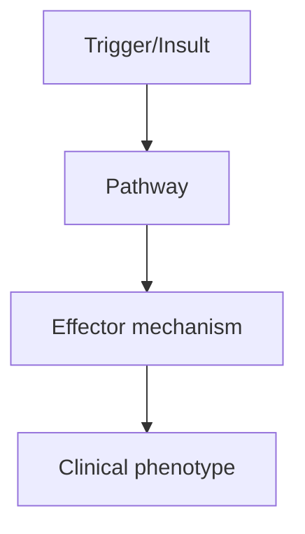
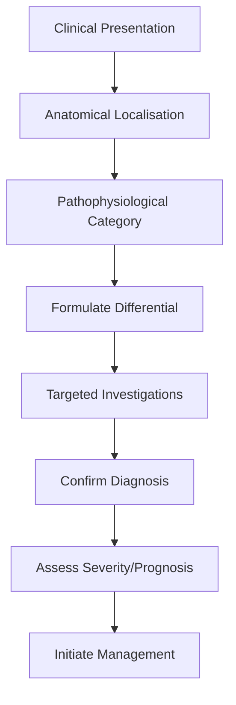
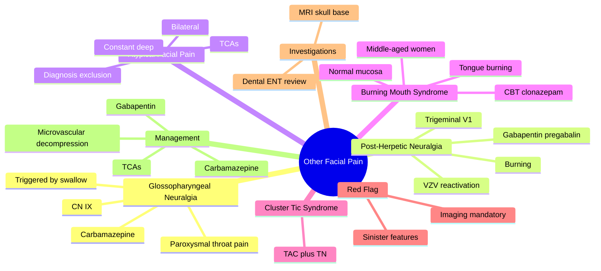

# Other Facial Pain

> [!tip] **High-Yield Definition**
> Heterogeneous group including glossopharyngeal neuralgia (GPN), post-herpetic neuralgia (PHN), atypical facial pain, burning mouth syndrome, cluster-tic syndrome. Each has distinct features and management.

---

## 1. Definition / Epidemiology / Classification

### Definition
Heterogeneous group including glossopharyngeal neuralgia (GPN), post-herpetic neuralgia (PHN), atypical facial pain, burning mouth syndrome, cluster-tic syndrome. Each has distinct features and management.

### Epidemiology
GPN: 0.5-1/100,000 (rare). PHN: 10-20% of herpes zoster patients. Atypical facial pain: middle-aged women predominance.

### Classification
| Variant | Key Features | Prognosis |
|---------|-------------|-----------|
| | | |

---

## 2. Aetiology / Pathophysiology

### Aetiology
GPN: glossopharyngeal nerve (CN IX) compression (vascular, Eagle syndrome, tumour). PHN: VZV reactivation in trigeminal (typically V1, herpes zoster ophthalmicus) or other cranial nerves, persists >3 months. Atypical facial pain: idiopathic, often dental/psychogenic. Burning mouth: idiopathic, often postmenopausal women, nutritional deficiencies (B12, folate, iron).

### Pathophysiology

---

## 3. Clinical Features

### History
- **Onset/Duration:**
- **Progression:**
- **Key symptoms:**
- **Triggers:**
- **Systemic symptoms:**
- **Drug/Family/Social history:**

### Examination
| Domain | Key Findings | Localisation Value |
|--------|-------------|-------------------|
| | | |

### Specific Clinical Features
GPN: paroxysmal pain in posterior tongue, tonsil, pharynx, ear, triggered by swallowing, chewing, talking. PHN: burning, stabbing, allodynia in dermatomal distribution (often V1, forehead). Atypical facial pain: constant, bilateral, non-anatomical distribution, often facial/maxillary. Burning mouth: bilateral tongue/mucosa burning, normal exam.

---

## 4. Diagnostic Approach / Algorithm

---

## 5. Investigations

MRI brain with thin-section skull base (GPN, exclude tumour, vascular compression), LP if needed. PHN: clinical, VZV PCR if acute. Atypical: exclude dental/sinus cause, MRI brain. Burning mouth: bloods (B12, folate, ferritin, glucose, thyroid).

---

## 6. Differential Diagnosis

| Differential | Distinguishing Features | Key Test |
|--------------|------------------------|----------|
| | | |

---

## 7. Management

GPN: carbamazepine, oxcarbazepine, baclofen, gabapentin; microvascular decompression if classical. PHN: gabapentin/pregabalin, TCAs (amitriptyline), topical lidocaine 5% patch, capsaicin 8% patch, tramadol. Atypical: TCAs, gabapentin, CBT (psychological component). Burning mouth: address deficiencies, clonazepam, low-dose TCA, CBT.

---

## 8. Drug Interactions / Contraindications / Comorbidity Cautions

| Drug | Interaction / Caution | Management |
|------|----------------------|------------|
| | | |

---

## 9. Procedures (if applicable)

### Procedure:
- **Indications:**
- **Contraindications:**
- **Preparation / Principle:**
- **Complications:**
- **Viva Pearls:**

---

## 10. Complications

| Complication | Frequency | Prevention / Monitoring | Management |
|--------------|-----------|------------------------|------------|
| | | | |

---

## 11. Red Flags / Emergencies

New facial pain with sensory loss, focal neurology, weight loss, unilateral persistent pain - all require imaging to exclude malignancy.

---

## 12. Prognosis

GPN: carbamazepine responsive, MVD 90% success. PHN: difficult, often persistent. Atypical: variable, psychological component important. Burning mouth: chronic but not progressive.

---

## 13. Topic Correlation

| Related Topic | Link | Key Overlap |
|---------------|------|-------------|
| | | |

---

## 14. Special Situations

| Situation | Consideration |
|-----------|---------------|
| **Pregnancy** | |
| **Lactation** | |
| **Paediatric** | |
| **Elderly / Frail** | |
| **Renal impairment** | |
| **Hepatic impairment** | |
| **Immunocompromised** | |
| **Perioperative** | |
| **Driving / DVLA** | |
| **Occupational** | |

---

## FCPS/MRCP High-Yield Summary

| Category | Key Points |
|----------|------------|
| **Definition** | Heterogeneous group including glossopharyngeal neuralgia (GPN), post-herpetic neuralgia (PHN), atypical facial pain, burning mouth syndrome, cluster-tic syndrome. Each has distinct features and manage |
| **Epidemiology** | GPN: 0.5-1/100,000 (rare). PHN: 10-20% of herpes zoster patients. Atypical facial pain: middle-aged women predominance. |
| **Pathophysiology** | |
| **Clinical** | GPN: paroxysmal pain in posterior tongue, tonsil, pharynx, ear, triggered by swallowing, chewing, talking. PHN: burning, stabbing, allodynia in dermatomal distribution (often V1, forehead). Atypical f |
| **Diagnosis** | |
| **Investigations** | MRI brain with thin-section skull base (GPN, exclude tumour, vascular compression), LP if needed. PHN: clinical, VZV PCR if acute. Atypical: exclude dental/sinus cause, MRI brain. Burning mouth: blood |
| **Management** | GPN: carbamazepine, oxcarbazepine, baclofen, gabapentin; microvascular decompression if classical. PHN: gabapentin/pregabalin, TCAs (amitriptyline), topical lidocaine 5% patch, capsaicin 8% patch, tra |
| **Complications** | |
| **Prognosis** | GPN: carbamazepine responsive, MVD 90% success. PHN: difficult, often persistent. Atypical: variable, psychological component important. Burning mouth: chronic but not progressive. |
| **Viva Pearls** | |
| **Drug Doses** | |
| **Scoring Systems** | |
| **Genetics** | |
| **Imaging Signs** | |

---

## Viva Questions (PACES/FCPS Style)

1. **Q:** Define Other Facial Pain and classify its variants.
   **A:** Based on the definition above.

2. **Q:** What are the key clinical features?
   **A:** GPN: paroxysmal pain in posterior tongue, tonsil, pharynx, ear, triggered by swallowing, chewing, talking. PHN: burning, stabbing, allodynia in dermatomal distribution (often V1, forehead). Atypical facial pain: constant, bilateral, non-anatomical distribution, often facial/maxillary. Burning mouth:

3. **Q:** What is the first-line treatment?
   **A:** Based on the management section.

4. **Q:** What are the red flags requiring urgent referral?
   **A:** New facial pain with sensory loss, focal neurology, weight loss, unilateral persistent pain - all require imaging to exclude malignancy.

5. **Q:** What is the prognosis?
   **A:** GPN: carbamazepine responsive, MVD 90% success. PHN: difficult, often persistent. Atypical: variable, psychological component important. Burning mouth: chronic but not progressive.

6. **Q:** How do you differentiate Other Facial Pain from key differentials?
   **A:** Clinical features, investigations, and response to treatment.

7. **Q:** What investigations are most useful?
   **A:** Based on the investigations section.

8. **Q:** Describe the stepwise management approach.
   **A:** Based on the management algorithm.

9. **Q:** What are the emergency presentations?
   **A:** Based on the red flags section.

10. **Q:** How does management change in pregnancy/paediatrics/elderly?
    **A:** Special considerations per population.

---

## Common Confusions / Exam Traps

| Confusion | Clarification |
|-----------|---------------|
| | |

---

## Mnemonics
1. **GNAPH** = **G**lossopharyngeal **N**euralgia - **A**cute paroxysmal pain in **P**osterior tongue/tonsillar region triggered by **H**iccups/swallowing/coughing (use: glossopharyngeal neuralgia localisation)
2. **P-H-N-V** = **P**ost-**H**erpetic **N**euralgia: **V**aricella zoster reactivation in trigeminal V1 (use: ophthalmic division is most common site; risk increases with age, severity of rash and immunosuppression)
3. **ABCs of AFP** = **A**typical **F**acial **P**ain = chronic, **B**ilateral, **A**bnormal sensation, no neurological signs, **C**onstant, **D**eep, **S**uperficial burning, **E**xclude organic cause (use: diagnosis of exclusion; 3 months constant pain)

---

## Mind Map

## Spaced Repetition Trackers

| Review Interval | Date | Score (0-5) | Notes |
|-----------------|------|-------------|-------|
| Day 1 | | | |
| Day 3 | | | |
| Day 7 | | | |
| Day 14 | | | |
| Day 30 | | | |
| Day 90 | | | |

## Self-Test Scorecard

| Section | Score /5 | Last Attempt |
|---------|----------|--------------|
| Definition & Epidemiology | | | |
| Pathophysiology | | | |
| Clinical Features | | | |
| Investigations | | | |
| Differential | | | |
| Management - Acute | | | |
| Management - Prophylaxis | | | |
| Complications | | | |
| Viva Questions | | | |
| MCQs | | | |
| SBAs | | | |

## MCQs (10)

1. **Question:** A 60-year-old man has brief, severe, lancinating pain in the posterior tongue and tonsillar region triggered by swallowing. The most likely diagnosis is:
   **Options:** A. Trigeminal neuralgia B. Glossopharyngeal neuralgia C. Cluster headache D. Eagle syndrome
   **Answer:** B
   **Explanation:** Glossopharyngeal neuralgia (GPN) is characterised by paroxysmal pain in the posterior tongue, tonsillar fossa, pharynx, and deep ear, triggered by swallowing, coughing, yawning, or talking. It involves the glossopharyngeal nerve (CN IX) with occasional vagal (CN X) involvement. Carbamazepine is the first-line treatment.

2. **Question:** Which medication is the first-line treatment for glossopharyngeal neuralgia?
   **Options:** A. Gabapentin B. Carbamazepine C. Amitriptyline D. Sodium valproate
   **Answer:** B
   **Explanation:** Carbamazepine (200-1200 mg/day) is the first-line treatment for both trigeminal and glossopharyngeal neuralgia, with oxcarbazepine as an alternative. Microvascular decompression (MVD) is the surgical treatment of choice in medically refractory cases.

3. **Question:** An 80-year-old woman had herpes zoster ophthalmicus 3 months ago. She now has severe burning pain in the V1 distribution with allodynia. Diagnosis?
   **Options:** A. Trigeminal neuralgia B. Acute herpes zoster C. Post-herpetic neuralgia D. Atypical facial pain
   **Answer:** C
   **Explanation:** Post-herpetic neuralgia (PHN) is defined as pain persisting for >3 months after the rash of herpes zoster. Risk factors include older age (>50), severe rash, severe acute pain, and immunosuppression. V1 (ophthalmic division) is the most common site of trigeminal herpes zoster.

4. **Question:** First-line treatment for post-herpetic neuralgia includes:
   **Options:** A. Opioids as first line B. Gabapentin or pregabalin, plus topical lidocaine 5% patch or capsaicin 8% patch C. Carbamazepine monotherapy D. Acyclovir
   **Answer:** B
   **Explanation:** First-line treatments for PHN are gabapentin/pregabalin, tricyclic antidepressants (e.g. amitriptyline, nortriptyline), and topical agents (5% lidocaine patch, 8% capsaicin patch). Strong opioids (e.g. morphine, oxycodone) are second-line. Antivirals are only useful in acute zoster if started within 72 h of rash.

5. **Question:** A 45-year-old woman has constant, deep, burning bilateral facial pain for 8 months with normal examination and normal MRI. The most likely diagnosis is:
   **Options:** A. Trigeminal neuralgia B. Atypical facial pain / persistent idiopathic facial pain C. Cluster headache D. Giant cell arteritis
   **Answer:** B
   **Explanation:** Persistent idiopathic facial pain (atypical facial pain, ICHD-3 13.11) is defined as persistent facial and/or oral pain, with variable presentation but recurring daily for >2 hours/day for >3 months, in the absence of clinical neurological deficit or identifiable cause. It is bilateral, deep, poorly localised, and often associated with psychological comorbidity.

6. **Question:** Burning mouth syndrome is most common in which demographic group?
   **Options:** A. Young men B. Post-menopausal women aged 50-70 C. Children D. Pregnant women
   **Answer:** B
   **Explanation:** Burning mouth syndrome (BMS, ICHD-3 13.10) is most common in peri/post-menopausal women (5:1 F:M) aged 50-70. The tongue (especially anterior two-thirds) is most commonly affected, with normal mucosa on examination. It is a diagnosis of exclusion, often with comorbid anxiety/depression.

7. **Question:** Glossopharyngeal neuralgia differs from trigeminal neuralgia in that the pain is:
   **Options:** A. Triggered by touching the face B. Located in the posterior tongue, tonsil or pharynx and triggered by swallowing C. Always unilateral mandibular D. Associated with autonomic features
   **Answer:** B
   **Explanation:** GPN pain is felt in the distribution of CN IX (posterior tongue, tonsil, pharynx, deep ear) and is triggered by swallowing, coughing, yawning, or talking. In contrast, TN1 (V2/V3) is triggered by light touch, chewing, brushing teeth, cold air, etc. Both are paroxysmal, lancinating, and last seconds to 2 minutes.

8. **Question:** Red flag features in facial pain that mandate urgent imaging include:
   **Options:** A. Constant bilateral pain B. New neurological signs, pain in the distribution of V2/V3 with sensory loss, or persistent pain despite treatment C. Pain triggered by eating D. Pain in the morning
   **Answer:** B
   **Explanation:** Red flags for sinister causes of facial pain (SNOOP adapted) include: new neurological signs (sensory loss, weakness, hearing loss), atypical features, persistent pain despite appropriate treatment, systemic features, and age >50 with new-onset pain. MRI of the skull base, IAM, and brain is the investigation of choice.

9. **Question:** Eagle syndrome is characterised by:
   **Options:** A. Glossopharyngeal neuralgia due to vascular compression B. Elongation of the styloid process causing pain in the throat, ear and face C. Hypersensitivity of the auriculotemporal nerve D. Disruption of the chorda tympani
   **Answer:** B
   **Explanation:** Eagle syndrome is caused by an elongated styloid process or calcified stylohyoid ligament, causing pain in the throat, ear, mastoid, and face, dysphagia, foreign body sensation, and pain on head rotation. Diagnosis is by CT imaging of the styloid process. Treatment is surgical (styloidectomy) in severe cases.

10. **Question:** Microvascular decompression (Jannetta procedure) is the surgical treatment of choice for:
    **Options:** A. Atypical facial pain B. Medically refractory trigeminal or glossopharyngeal neuralgia C. Burning mouth syndrome D. Post-herpetic neuralgia
    **Answer:** B
    **Explanation:** Microvascular decompression (MVD), the Jannetta procedure, is the surgical treatment of choice for medically refractory TN or GPN. It involves craniectomy and placement of Teflon between the offending vessel (commonly superior cerebellar artery) and the nerve root, with long-term pain relief in 70-90% of cases.

## SBA Questions (10)

1. **Scenario:** A 55-year-old man describes brief, electric-shock like pain in the right posterior tongue and tonsil triggered by swallowing, lasting seconds.
   **Question:** Most appropriate first-line pharmacological treatment?
   **Options:** A. Carbamazepine 200-1200 mg/day B. Gabapentin 300 mg tds C. Amitriptyline 25 mg nocte D. Topiramate 50 mg bd
   **Answer:** A
   **Explanation:** GPN is treated identically to trigeminal neuralgia, with carbamazepine as the first choice. Oxcarbazepine is an alternative. Gabapentin and baclofen are second-line.

2. **Scenario:** A 70-year-old develops severe burning pain in the V1 distribution 4 months after herpes zoster ophthalmicus. The pain is constant, with allodynia on light touch.
   **Question:** Most appropriate first-line treatment?
   **Options:** A. Topical acyclovir B. Oral acyclovir 800 mg five times daily C. Gabapentin titrated to 1800-3600 mg/day, or pregabalin 150-600 mg/day, with topical lidocaine 5% or 8% capsaicin patch D. Oral prednisolone 30 mg
   **Answer:** C
   **Explanation:** PHN is treated with gabapentinoids, TCAs, or topical lidocaine/capsaicin. Antivirals are not effective once PHN is established. Steroids do not have a primary role. Combination therapy is often required.

3. **Scenario:** A 35-year-old woman has had constant deep bilateral facial pain for 6 months following a dental extraction. Examination, MRI and dental review are normal.
   **Question:** Most likely diagnosis?
   **Options:** A. Atypical odontalgia B. Persistent idiopathic facial pain (atypical facial pain) C. Trigeminal neuralgia D. Cluster headache
   **Answer:** B
   **Explanation:** Persistent idiopathic facial pain (PIFP, atypical facial pain) is a diagnosis of exclusion presenting as constant, deep, poorly localised facial pain without neurological signs or imaging abnormality. It often follows minor dental/ENT surgery and is associated with psychological comorbidity.

4. **Scenario:** A 60-year-old woman has a 6-month history of burning sensation of the tongue, with normal oral mucosa on examination and normal blood tests.
   **Question:** Most appropriate next step?
   **Options:** A. Empirical antibiotics B. Empirical oral nystatin C. Diagnose burning mouth syndrome; consider CBT, topical clonazepam, alpha-lipoic acid, low-dose gabapentin D. MRI brain
   **Answer:** C
   **Explanation:** Burning mouth syndrome (BMS) is a diagnosis of exclusion in peri/post-menopausal women with normal mucosa. Local and systemic causes (candidiasis, vitamin B12/folate/iron deficiency, Sjögren's, diabetes, medications) must be excluded. First-line management is CBT, topical clonazepam, alpha-lipoic acid; gabapentin or low-dose TCAs are second-line.

5. **Scenario:** A patient with medically refractory glossopharyngeal neuralgia is being considered for surgery.
   **Question:** Which is the surgical treatment of choice?
   **Options:** A. Glycerol rhizotomy B. Gamma knife radiosurgery C. Microvascular decompression (Jannetta) D. Percutaneous balloon compression
   **Answer:** C
   **Explanation:** Microvascular decompression is the open surgical treatment of choice for medically refractory GPN and TN, with the highest long-term success rate. Percutaneous procedures (glycerol, balloon compression, radiofrequency) and gamma knife are options for patients who are not surgical candidates.

6. **Scenario:** An 80-year-old man presents with unilateral facial pain in V1 distribution 2 months after herpes zoster. He has not received antiviral therapy during the acute rash.
   **Question:** What is the most important intervention to reduce the risk of post-herpetic neuralgia?
   **Options:** A. Amitriptyline 25 mg B. Carbamazepine 200 mg bd C. Antiviral therapy (e.g. aciclovir or valaciclovir) within 72 h of rash onset, combined with effective acute pain control D. Prednisolone
   **Answer:** C
   **Explanation:** Early antiviral therapy (within 72 h of rash onset), and aggressive treatment of acute pain, reduce the incidence and severity of PHN. Amitriptyline started early may also reduce PHN incidence. Once PHN is established, treatment is symptomatic.

7. **Scenario:** A 50-year-old woman with constant burning of the tongue and dysgeusia is found to be deficient in vitamin B12 and ferritin.
   **Question:** Most appropriate management?
   **Options:** A. Diagnose burning mouth syndrome B. Treat the vitamin deficiencies and reassess C. Start gabapentin D. Start TCAs
   **Answer:** B
   **Explanation:** Secondary causes of burning mouth must be excluded. Iron, folate, vitamin B12, zinc, and vitamin D deficiency, as well as diabetes, hypothyroidism, Sjögren's syndrome, candidiasis, and medications (e.g. ACE inhibitors), can cause secondary BMS. Reassess symptoms after correction of deficiency.

8. **Scenario:** A 45-year-old man has unilateral facial pain triggered by light touch over the cheek, lasting seconds, with normal examination.
   **Question:** Most appropriate next step?
   **Options:** A. Diagnose trigeminal neuralgia and start carbamazepine; consider MRI brain if atypical features or refractory B. Reassure C. Empirical root canal D. Refer for psychology
   **Answer:** A
   **Explanation:** Classical trigeminal neuralgia (paroxysmal, unilateral, triggered by light touch) can be treated empirically with carbamazepine. MRI (with thin cuts through the trigeminal nerve and pons) is indicated in patients with atypical features, sensory loss, age <40, or refractory disease, to exclude tumour or vascular compression.

9. **Scenario:** A 70-year-old man with V1 post-herpetic neuralgia is on gabapentin 1800 mg/day with partial response. He cannot tolerate higher doses due to sedation.
   **Question:** Most appropriate next step?
   **Options:** A. Add amitriptyline or switch to a topical agent such as 5% lidocaine or 8% capsaicin patch B. Add an opioid C. Stop gabapentin D. Refer for surgery
   **Answer:** A
   **Explanation:** Combination therapy (e.g. gabapentin + TCA, or systemic + topical) is often required in PHN. 5% lidocaine patch is well tolerated in the elderly; 8% capsaicin patch requires pre-treatment with local anaesthetic. Strong opioids are second-line due to risks of dependence and constipation.

10. **Scenario:** A patient with trigeminal neuralgia on carbamazepine develops hyponatraemia (Na 124 mmol/L) and dizziness.
    **Question:** Most appropriate management?
    **Options:** A. Continue carbamazepine B. Stop carbamazepine, switch to oxcarbazepine at a lower dose, or use an alternative such as gabapentin or baclofen; check sodium C. Add IV fluids only D. Add desmopressin
    **Answer:** B
    **Explanation:** Hyponatraemia is a well-recognised side effect of carbamazepine and oxcarbazepine (SIADH), particularly in the elderly. Management is dose reduction or switch to an alternative; oxcarbazepine may have a lower risk. Monitor sodium, and review fluid intake.

## Flashcards

- **Q:** What is the first-line treatment for glossopharyngeal neuralgia?
  **A:** Carbamazepine 200-1200 mg/day.
- **Q:** What is the most common site of trigeminal herpes zoster?
  **A:** V1 (ophthalmic) division.
- **Q:** How is post-herpetic neuralgia defined?
  **A:** Pain persisting >3 months after herpes zoster rash.
- **Q:** Name three first-line treatments for PHN.
  **A:** Gabapentin/pregabalin, TCAs (e.g. amitriptyline), topical lidocaine 5% or capsaicin 8% patches.
- **Q:** What is the demographic of burning mouth syndrome?
  **A:** Peri/post-menopausal women aged 50-70; F:M 5:1.
- **Q:** What is persistent idiopathic facial pain (atypical facial pain)?
  **A:** Constant, deep, poorly localised facial pain for >3 months, normal exam, normal imaging; diagnosis of exclusion.
- **Q:** What is the surgical treatment of choice for medically refractory TN or GPN?
  **A:** Microvascular decompression (Jannetta procedure).
- **Q:** What is Eagle syndrome?
  **A:** Elongated styloid process causing throat/ear/facial pain, dysphagia, foreign body sensation.
- **Q:** Which cranial nerve is involved in glossopharyngeal neuralgia?
  **A:** CN IX (glossopharyngeal), occasionally CN X.
- **Q:** What is the most important intervention to prevent PHN?
  **A:** Early antiviral therapy (within 72 h) for acute herpes zoster, with effective acute pain control.
- **Q:** List 3 secondary causes of burning mouth.
  **A:** Iron, B12, folate, zinc deficiency; hypothyroidism; Sjögren's; diabetes; ACE inhibitors.
- **Q:** What is the side effect of carbamazepine relevant in the elderly?
  **A:** Hyponatraemia (SIADH), particularly in the elderly; also ataxia, leucopenia, rash.

## Answer Key with Explanations

### MCQs
1. B - Glossopharyngeal neuralgia presents with paroxysmal pain in the posterior tongue/tonsil triggered by swallowing.
2. B - Carbamazepine is first-line for glossopharyngeal neuralgia.
3. C - Pain >3 months after zoster is post-herpetic neuralgia.
4. B - Gabapentinoids and topical agents are first-line for PHN.
5. B - Persistent idiopathic facial pain is constant bilateral deep pain, normal exam, normal imaging.
6. B - Burning mouth syndrome is most common in peri/post-menopausal women.
7. B - GPN pain is in the distribution of CN IX and triggered by swallowing.
8. B - New neurological signs, atypical features, refractory pain warrant imaging.
9. B - Eagle syndrome is due to elongated styloid process.
10. B - MVD is the surgical treatment of choice for TN and GPN.

### SBAs
1. A - Carbamazepine is the first-line agent for GPN.
2. C - Gabapentinoids and topical agents are first-line for PHN.
3. B - Persistent idiopathic facial pain is the diagnosis after exclusion.
4. C - Burning mouth syndrome management includes CBT, topical clonazepam, alpha-lipoic acid.
5. C - MVD is the open surgical treatment of choice.
6. C - Early antiviral therapy within 72 h of rash reduces PHN risk.
7. B - Treat the underlying nutritional deficiency.
8. A - Classical TN can be treated empirically with carbamazepine; MRI if atypical or refractory.
9. A - Combination therapy or switch to a topical agent.
10. B - Hyponatraemia: stop carbamazepine, switch, monitor sodium.

## Tags
**Tags:** #neurology #facial-pain #glossopharyngeal-neuralgia #post-herpetic-neuralgia #burning-mouth-syndrome #atypical-facial-pain #trigeminal #carbamazepine #gabapentin #Eagle-syndrome #microvascular-decompression #FCPS #MRCP #high-yield

## Local Navigation
**Heading Hub:** [[../Hub]]  
**Chapter Hierarchy:** [[Davidson Chapter 25 - Neurology Hierarchy]]  
**Chapter MOC:** [[Neurology MOC]]  
**Drug Reference:** [[../00_Index/Neurology Drug Reference]]  
