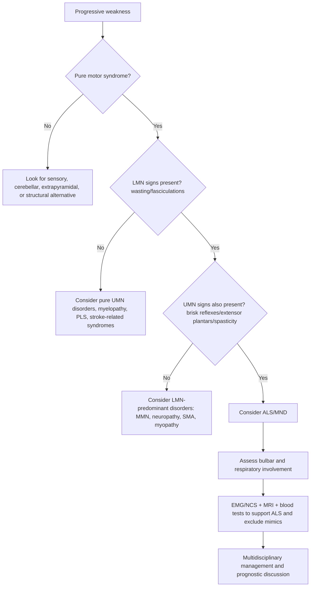
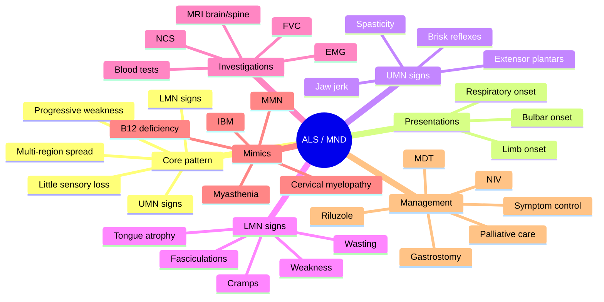

# Amyotrophic lateral sclerosis and motor neuron disease pattern recognition

---
tags: [medicine, neurology, davidson, neurodegenerative-disease, motor-neuron-disease, als, mnd, fcps, mrcp]
chapter: Neurology
davidson_part: Part 3: Clinical Medicine
davidson_chapter: Chapter 28: Neurology
heading: Neurodegenerative Diseases
topic_group: Motor neuron disease
topic: Amyotrophic lateral sclerosis and motor neuron disease pattern recognition
exam: [FCPS, MRCP]
status: full-fcps-mrcp-note
references:
  anatomy: ["Gray's Anatomy", Davidson]
  physiology: ["Guyton & Hall", Ganong, Davidson]
  clinical: [Davidson, PasTest]
related:
  - "[[../Neurology MOC|Neurology MOC]]"
  - "[[../Neurodegenerative Diseases|Neurodegenerative Diseases]]"
  - "[[Motor neuron disease|Motor neuron disease]]"
  - "[[Bulbar vs limb onset features]]"
  - "[[Respiratory and nutritional support issues in MND]]"
---

# Amyotrophic lateral sclerosis and motor neuron disease pattern recognition

Related: [[../Neurology MOC|Neurology MOC]] · [[../Neurodegenerative Diseases|Neurodegenerative Diseases]] · [[Motor neuron disease|Motor neuron disease]] · [[Bulbar vs limb onset features]] · [[Respiratory and nutritional support issues in MND]]

> [!important]
> **Amyotrophic lateral sclerosis (ALS)** is the commonest adult form of **motor neuron disease (MND)** and is characterized by a combination of **upper motor neuron (UMN)** and **lower motor neuron (LMN)** degeneration with progressive weakness, wasting, fasciculations, spasticity, bulbar dysfunction, and eventual respiratory failure, usually with **preserved sensation and sphincter function early on**.

> [!tip]
> The classic FCPS/MRCP pattern is **progressive, asymmetric, painless weakness** with **mixed UMN + LMN signs in more than one body region**, **normal sensory examination**, and **no convincing alternative structural, inflammatory, metabolic, or neuromuscular junction explanation**.

## Learning Objectives
- Define ALS/MND and describe the major clinical phenotypes within Davidson Chapter 28 neurology.
- Understand corticospinal tract and anterior horn cell anatomy relevant to mixed UMN/LMN syndromes.
- Explain the pathophysiology behind weakness, wasting, spasticity, bulbar dysfunction, and respiratory failure.
- Recognize the bedside pattern of ALS and distinguish it from common mimics.
- Construct a differential diagnosis for mixed UMN + LMN, pure LMN, and bulbar presentations.
- Plan investigations that support diagnosis and exclude treatable alternatives.
- Outline multidisciplinary management including riluzole, symptom control, respiratory support, nutrition, communication support, and palliative care.
- Identify prognostic factors, complications, emergency issues, and red flags.

## Definition
**Motor neuron disease (MND)** is a group of progressive neurodegenerative disorders affecting:
- **upper motor neurons** in the motor cortex and corticospinal/corticobulbar tracts
- **lower motor neurons** in the brainstem motor nuclei and anterior horn cells

**Amyotrophic lateral sclerosis (ALS)** is the commonest MND phenotype and involves both:
- **UMN degeneration** → spasticity, brisk reflexes, extensor plantar responses
- **LMN degeneration** → wasting, weakness, fasciculations, reduced or absent reflexes in affected wasted muscles

## Relevant Neuroanatomy
### Upper motor neuron pathways
Important structures:
- **primary motor cortex (precentral gyrus)**
- **corticospinal tracts** descending through internal capsule, brainstem, and spinal cord
- **corticobulbar fibers** to cranial nerve motor nuclei

UMN lesions produce:
- weakness with pyramidal distribution
- increased tone/spasticity
- brisk reflexes
- extensor plantar response
- pseudobulbar affect when corticobulbar pathways are involved

### Lower motor neuron pathways
Important structures:
- **anterior horn cells** in spinal cord
- **motor cranial nerve nuclei** in the medulla and pons
- peripheral motor axons to skeletal muscle

LMN lesions produce:
- muscle wasting
- fasciculations
- weakness
- hypotonia in severely denervated muscles
- reduced or absent reflexes in the affected segment

### Bulbar anatomy
Bulbar dysfunction in ALS mainly reflects involvement of:
- nucleus ambiguus and related corticobulbar pathways
- tongue muscles via hypoglossal nucleus

Clinical result:
- dysarthria
- dysphagia
- weak cough
- tongue wasting and fasciculations
- emotional lability if pseudobulbar involvement is present

## Relevant Neurophysiology
### Normal motor physiology
Normal voluntary movement depends on:
- intact cortical initiation of movement
- intact corticospinal/corticobulbar transmission
- intact anterior horn cells and cranial motor nuclei
- neuromuscular junction transmission
- normal muscle bulk and contractility

### Physiology in ALS/MND
Degeneration causes:
1. **loss of UMN inhibitory control** → brisk reflexes and spasticity
2. **denervation of muscle by LMN loss** → wasting, fasciculations, cramps, weakness
3. **progressive denervation-reinnervation cycles** → large motor units on EMG, then eventual failure
4. **bulbar and respiratory muscle denervation** → aspiration risk, weak cough, nocturnal hypoventilation, respiratory failure

### Why reflexes may be confusing
ALS can show:
- **brisk reflexes overall** due to UMN involvement
- but **depressed reflexes in a severely wasted muscle group** due to local LMN loss

This mixed pattern is highly exam-relevant.

## Important Values / High-Yield Facts
- Typical age at onset: often **mid to late adulthood**, but can occur earlier.
- Pattern is usually **insidious** and **progressive**.
- **Sensory loss is not a dominant feature**; prominent objective sensory deficits suggest another diagnosis.
- **Extraocular movements are usually spared until very late disease**.
- **Sphincter disturbance is uncommon early**; early bladder/bowel involvement suggests a mimic.
- Death usually occurs from **respiratory failure**, aspiration complications, or infection.
- **Riluzole** modestly prolongs survival and is standard disease-modifying therapy in many settings.
- **Non-invasive ventilation (NIV)** improves symptoms and survival in appropriate patients.

## Classification
### 1. By clinicopathological phenotype
1. **ALS** – mixed UMN + LMN signs
2. **Progressive muscular atrophy (PMA)** – predominantly LMN syndrome
3. **Primary lateral sclerosis (PLS)** – predominantly UMN syndrome
4. **Progressive bulbar palsy** – bulbar-predominant motor neuron involvement

### 2. By site of onset
- **Limb-onset ALS**
  - hand clumsiness
  - foot drop
  - asymmetric distal weakness
- **Bulbar-onset ALS**
  - dysarthria
  - dysphagia
  - nasal speech
- **Respiratory-onset ALS** (less common)
  - orthopnea
  - morning headache
  - daytime somnolence

### 3. By region involved clinically
- bulbar
- cervical
- thoracic
- lumbosacral

## Epidemiology / Risk Factors
- most cases are **sporadic**
- a minority are **familial/genetic**
- incidence rises with age
- slight male predominance in some series
- smoking and some environmental exposures have been implicated, but most cases have no single clear cause

Exam point:
- In written exams, state that ALS is **usually sporadic**, though **familial forms exist** and are clinically important.

## Etiology and Pathophysiology
ALS is multifactorial and incompletely understood. Mechanisms include:
- glutamate-mediated **excitotoxicity**
- oxidative stress
- mitochondrial dysfunction
- abnormal protein aggregation
- impaired axonal transport
- neuroinflammation
- genetic factors in familial disease

Commonly discussed genes in exam-oriented neurology:
- **C9orf72**
- **SOD1**
- **TARDBP**
- **FUS**

Pathological result:
- degeneration of corticospinal tracts
- loss of anterior horn cells
- degeneration of motor cranial nerve nuclei
- muscle denervation and neurogenic atrophy

## UMN + LMN Pattern Recognition
### Core bedside recognition
Think ALS/MND when you see:
- **progressive weakness**
- **asymmetry initially**
- **no sensory level and no major sensory loss**
- **LMN signs** in one region: wasting, fasciculations, weakness
- **UMN signs** in the same or another region: brisk reflexes, spasticity, extensor plantars
- spread from one region to another over time

### Typical examples
#### Example 1: upper limb onset
- wasting of small hand muscles
- weak finger abduction and grip
- visible fasciculations in forearm/hand
- brisk biceps and triceps jerks
- extensor plantar responses

#### Example 2: lower limb onset
- progressive foot drop or stiff weak leg
- asymmetric calf or thigh wasting
- brisk knee jerks
- extensor plantar responses
- spastic gait with superimposed distal wasting

#### Example 3: bulbar onset
- dysarthria with nasal or slurred speech
- tongue wasting/fasciculations
- brisk jaw jerk
- emotional lability
- progressive dysphagia and aspiration risk

### Pattern by body region
| Region | UMN clues | LMN clues | Clinical result |
|---|---|---|---|
| Bulbar | brisk jaw jerk, pseudobulbar affect | tongue wasting, fasciculations, weak palate/voice | dysarthria, dysphagia |
| Cervical | brisk upper limb reflexes, spasticity | hand wasting, fasciculations | clumsy hands, poor grip |
| Thoracic | less obvious pyramidal signs | truncal weakness | poor cough, postural fatigue |
| Lumbosacral | brisk knee/ankle jerks, extensor plantar | distal wasting, fasciculations | foot drop, falls, spastic-weak gait |

### Why this pattern matters in exams
The hallmark answer is:
> **A progressive pure motor syndrome with combined UMN and LMN signs in multiple regions and no sensory explanation strongly suggests ALS.**

## Clinical Features
### General characteristics
- gradual onset
- relentless progression
- usually asymmetric at presentation
- predominantly motor syndrome
- cognition may be normal, but some patients develop frontotemporal involvement

### Limb symptoms
- hand weakness or loss of dexterity
- difficulty opening jars, turning keys, buttoning clothes
- foot drop
- tripping and falls
- cramps
- muscle twitching/fasciculations
- weight loss from muscle wasting

### UMN signs
- spasticity
- stiffness
- brisk deep tendon reflexes
- extensor plantar responses
- slowed, effortful gait due to pyramidal involvement

### LMN signs
- focal wasting
- fasciculations
- weakness
- reduced bulk of hand intrinsic muscles, shoulder girdle, tongue, or legs

### Bulbar symptoms and signs
- dysarthria
- dysphagia for liquids then solids
- choking episodes
- nasal regurgitation
- weak cough
- tongue wasting and fasciculations
- drooling
- pseudobulbar affect: emotional lability, inappropriate laughing/crying

### Respiratory symptoms
- exertional breathlessness
- orthopnea
- fragmented sleep
- morning headache
- daytime somnolence
- weak cough and poor secretion clearance

### Cognitive / behavioral features
Some patients have overlap with frontotemporal dysfunction:
- apathy
- disinhibition
- executive dysfunction
- reduced verbal fluency
- frank frontotemporal dementia in a subset

### Examination summary
Look for:
- wasted, fasciculating tongue
- brisk jaw jerk
- dysarthria
- split-hand pattern of wasting in some patients
- asymmetric distal limb wasting
- fasciculations in limbs or trunk
- brisk reflexes despite wasting
- ankle clonus or extensor plantars
- spasticity
- gait disturbance from combined weakness and spasticity

## Differential Diagnosis
## 1. Disorders that can mimic mixed UMN + LMN disease
### Cervical spondylotic myelopathy / cervical cord compression
Clues:
- hand wasting with spastic legs can mimic ALS
- neck pain or radicular pain may be present
- sensory change may occur
- sphincter involvement may occur
- MRI cervical spine is essential if suggested clinically

### Foramen magnum / cord lesions
- structural lesions may produce long tract signs with segmental LMN wasting
- look for pain, sensory level, asymmetry, sphincter signs, cranial nerve features depending on site

### Multiple sclerosis
- can give UMN signs and bulbar symptoms, but LMN wasting/fasciculations are not typical
- sensory symptoms, optic neuritis, dissemination in time/space support MS rather than ALS

## 2. Predominantly LMN mimics
### Multifocal motor neuropathy
Important because treatable.
Clues:
- asymmetric distal upper limb weakness
- little or no sensory loss
- conduction block on nerve conduction studies
- anti-GM1 antibodies may be present
- responds to **IVIG**, not riluzole alone

### Chronic inflammatory demyelinating polyradiculoneuropathy / motor neuropathy variants
- weakness may be progressive
- areflexia more typical than brisk reflexes
- sensory involvement may occur
- electrodiagnostics help distinguish

### Spinal muscular atrophy / Kennedy disease
- LMN-predominant pattern
- slower course, specific phenotypic clues

### Inclusion body myositis
- finger flexor and quadriceps weakness
- no UMN signs
- CK may be mildly raised
- EMG and muscle pattern help differentiate

### Neuromuscular junction disorders
#### Myasthenia gravis
- bulbar weakness can mimic bulbar ALS
- fluctuating fatigability, ptosis, diplopia support MG
- fasciculations and brisk jaw jerk are not typical MG features

## 3. Bulbar mimics
- brainstem stroke or mass lesion
- myasthenia gravis
- oculopharyngeal disorders
- pseudobulbar syndrome from bilateral cerebral lesions

## 4. Metabolic / infectious / systemic mimics
- **vitamin B12 deficiency** with myelopathy
- **thyroid disease**
- **HIV** and some infective neuropathic disorders depending on context
- **syphilitic or inflammatory myelopathy** in relevant settings
- **hyperparathyroidism** and other rare metabolic disorders

## Differential diagnosis table
| Condition | Feature favoring it over ALS |
|---|---|
| Cervical myelopathy | neck pain, sensory signs, sphincter symptoms, MRI lesion |
| Multifocal motor neuropathy | conduction block, distal upper limb weakness, IVIG-responsive |
| Myasthenia gravis | fatigability, ocular signs, no fasciculations/wasting early |
| Inclusion body myositis | finger flexor + quadriceps pattern, CK elevation, no UMN signs |
| B12 deficiency myelopathy | sensory ataxia, posterior column loss, macrocytosis |
| CIDP/motor neuropathy | demyelinating NCS, areflexia, sensory features may occur |
| Structural cord lesion | pain, sensory level, sphincter disturbance, MRI abnormal |

## Diagnostic Approach

### Stepwise bedside approach
1. **Confirm weakness is real and progressive.**
2. **Decide whether the syndrome is pure motor or mixed motor-sensory.**
3. **Look actively for LMN signs**: wasting, fasciculations, reduced segmental reflexes.
4. **Look actively for UMN signs**: brisk reflexes, spasticity, extensor plantars, jaw jerk.
5. **Localize by body regions**: bulbar, cervical, thoracic, lumbosacral.
6. **Check for spread across regions over time.**
7. **Search for atypical features** suggesting a mimic.
8. **Arrange targeted investigations** mainly to support diagnosis and exclude treatable alternatives.

## Investigations
### Purpose of investigations
Investigations in ALS are used to:
- support the clinical diagnosis
- demonstrate widespread motor neuron involvement
- exclude treatable mimics
- assess severity, especially respiratory and nutritional status

### 1. Electrophysiology
#### EMG
Typical supportive findings:
- active denervation: fibrillation potentials, positive sharp waves
- chronic neurogenic change with large motor unit potentials
- fasciculation potentials
- evidence of involvement in clinically affected and unaffected regions

#### Nerve conduction studies (NCS)
- usually help exclude neuropathy or conduction block
- sensory nerve action potentials are often preserved in ALS
- **conduction block suggests multifocal motor neuropathy rather than ALS**

### 2. MRI brain and spinal cord
Used mainly to exclude structural mimics such as:
- cervical spondylotic myelopathy
- cord compression
- foramen magnum lesion
- brainstem pathology

### 3. Blood tests
Often include:
- FBC
- ESR/CRP
- renal and liver function
- glucose/HbA1c depending on context
- thyroid function
- vitamin B12/folate
- CK
- serum protein electrophoresis if neuropathy considered
- autoimmune or infective tests if clinically indicated

### 4. Respiratory assessment
- **forced vital capacity (FVC)** or vital capacity serially
- sniff nasal inspiratory pressure or equivalent respiratory muscle testing where available
- overnight oximetry/sleep studies if nocturnal hypoventilation suspected
- arterial/venous blood gas if hypercapnia suspected

### 5. Swallow and nutritional assessment
- formal swallowing assessment if dysphagia
- weight/BMI monitoring
- dietetic review

### 6. Cognitive / communication assessment
- screen for executive dysfunction or frontotemporal features
- speech and language therapy evaluation for communication aids

## Diagnostic Criteria Concept
Formal criteria vary, but the exam principle is:
- progressive disease
- evidence of **UMN degeneration** by examination
- evidence of **LMN degeneration** clinically, electrophysiologically, or both
- spread of signs within a region or to other regions
- no better alternative explanation

## Findings That Support ALS
- mixed UMN + LMN signs
- progression over time
- multiple body regions involved
- normal sensory examination or only minimal sensory symptoms
- EMG evidence of widespread denervation and reinnervation
- preserved sensory nerve conduction

## Red Flags Against Straightforward ALS
These should prompt strong reconsideration of the diagnosis:
- prominent **sensory loss**
- **bowel/bladder dysfunction early**
- **ocular movement abnormalities early**
- marked **ptosis or diplopia**
- **stepwise** rather than steadily progressive course
- very **young age** with atypical features
- severe pain as a dominant early complaint
- clear **sensory level**
- systemic inflammatory or malignant clues
- definite **conduction block** on NCS
- MRI evidence of compressive myelopathy or other structural lesion

## Management
## Principles
ALS management is best delivered by a **multidisciplinary team (MDT)** and includes:
- disease-modifying therapy where appropriate
- symptom control
- respiratory care
- nutritional and swallowing support
- physiotherapy and occupational therapy
- communication support
- psychosocial and palliative care

## 1. Disease-modifying treatment
### Riluzole
- standard disease-modifying therapy in ALS
- modest survival benefit
- usually requires monitoring of liver function

### Other disease-modifying options
Availability varies by region and guideline framework; exam answers should emphasize:
- riluzole as established therapy
- specialist clinic review for evolving therapies and trial eligibility

## 2. Multidisciplinary supportive management
### Physiotherapy
- stretching and range-of-motion exercises
- mobility training
- spasticity management
- falls prevention
- advice on energy conservation

### Occupational therapy
- hand splints or adaptive devices
- home safety assessment
- wheelchair and seating needs
- aids for activities of daily living

### Speech and language therapy
- dysarthria management
- communication aids
- swallowing assessment
- texture modification advice

### Dietetic and nutritional support
- high-calorie nutritional strategies when needed
- monitor weight loss and dysphagia
- discuss **enteral feeding** such as gastrostomy when oral intake becomes unsafe or inadequate

### Respiratory support
- monitor for nocturnal hypoventilation and declining FVC
- cough-assist/airway clearance strategies when available
- **non-invasive ventilation (NIV)** for respiratory muscle weakness

### Psychological and social support
- address depression, anxiety, caregiver burden
- advance care planning
- social services and disability support

## 3. Symptom control
### Spasticity
- physiotherapy
- agents such as **baclofen** or **tizanidine** if needed

### Cramps and pain
- stretching
- analgesia
- selected anti-cramp therapies depending on severity and local practice

### Sialorrhea / drooling
- anticholinergic agents when appropriate
- botulinum toxin to salivary glands in selected patients

### Pseudobulbar affect
- explanation and counseling
- selected antidepressant-based treatment strategies depending on availability and guidance

### Constipation
- fluids, diet adjustment, laxatives

### Thick secretions / weak cough
- mucolytic and secretion strategies
- suction support where appropriate

## 4. Feeding interventions
Consider gastrostomy when:
- dysphagia is progressive
- weight loss is significant
- oral intake is prolonged or unsafe
- aspiration risk is rising

## 5. End-of-life and palliative care
Essential points:
- introduce palliative care early, not only terminally
- discuss future respiratory support choices
- discuss feeding decisions and communication preferences
- manage dyspnea, secretions, anxiety, and comfort

## Respiratory and Nutritional Triggers for Urgent Review
- new orthopnea
- morning headache
- daytime somnolence
- rapid decline in exercise tolerance
- recurrent chest infection
- choking episodes
- significant weight loss
- dehydration

## Complications
- progressive disability and dependence
- aspiration pneumonia
- malnutrition and dehydration
- respiratory failure
- weak cough with secretion retention
- pressure sores in immobile patients
- falls
- contractures
- depression and anxiety
- caregiver burnout
- communication failure in advanced disease

## Prognostic Factors
Poorer prognosis is generally associated with:
- bulbar-onset disease
- respiratory involvement at presentation
- rapid progression
- marked weight loss
- older age at onset
- severe executive/frontotemporal involvement

## Bulbar vs Limb Onset: High-Yield Comparison
| Feature | Limb onset | Bulbar onset |
|---|---|---|
| Common initial complaint | hand weakness, foot drop, clumsiness | dysarthria, choking, dysphagia |
| Early signs | limb wasting/fasciculations | tongue wasting, brisk jaw jerk |
| Functional issue | gait/manual disability | speech and swallowing disability |
| Prognosis | variable | often worse |

## Special Situations / Exam Traps
### ALS vs cervical myelopathy
Cervical myelopathy can produce:
- wasted hands
- brisk legs
- gait spasticity

But clues against ALS include:
- sensory deficits
- sphincter symptoms
- pain/radicular symptoms
- MRI structural compression

### Bulbar ALS vs myasthenia gravis
Myasthenia is more likely if:
- fluctuating weakness
- ptosis/diplopia
- fatigability
- no fasciculations or tongue wasting early

### Pure LMN syndrome
Do not label all LMN syndromes as ALS.
Always consider:
- multifocal motor neuropathy
- spinal muscular atrophy
- neuropathic and myopathic mimics

## FCPS/MRCP High-Yield Points
- ALS is the **commonest adult MND**.
- The hallmark is **combined UMN and LMN signs**.
- Weakness is usually **progressive, asymmetric, and painless**.
- **Sensory examination is usually normal**.
- **Bulbar symptoms** and **respiratory failure** are key causes of morbidity and mortality.
- **EMG/NCS** support diagnosis and help exclude mimics.
- **MRI spine/brain** is often done to exclude structural disease.
- **Multifocal motor neuropathy** is a major treatable mimic.
- **Riluzole** and **NIV** are standard management pillars.
- Best care is through a **multidisciplinary ALS/MND clinic**.

## One-Page Summary
### Definition
ALS is a progressive neurodegenerative disorder affecting both upper and lower motor neurons.

### Pattern recognition
- progressive pure motor syndrome
- asymmetric onset
- LMN signs: wasting, fasciculations, weakness
- UMN signs: brisk reflexes, spasticity, extensor plantars
- spread to multiple regions
- little or no sensory loss

### Common presentations
- hand weakness/clumsiness
- foot drop or stiff weak leg
- dysarthria/dysphagia
- cramps/fasciculations
- orthopnea or morning headache in respiratory involvement

### Investigations
- EMG: denervation/reinnervation
- NCS: exclude conduction block/neuropathy
- MRI brain/spine: exclude structural mimic
- blood tests: B12, TFT, CK, inflammatory and other screens as indicated
- respiratory function: FVC and related testing

### Important differentials
- cervical myelopathy
- multifocal motor neuropathy
- myasthenia gravis
- inclusion body myositis
- B12 deficiency myelopathy
- CIDP/motor neuropathy variants

### Management
- riluzole
- MDT care
- physiotherapy/OT
- SALT and dietetics
- NIV for respiratory weakness
- gastrostomy when needed
- symptom relief and palliative care

### Major complications
- aspiration
- malnutrition
- respiratory failure
- immobility and falls
- depression/caregiver burden

### Red flags against ALS
- sensory level or marked sensory loss
- early bladder/bowel dysfunction
- diplopia/ptosis
- conduction block
- structural lesion on MRI
- stepwise or inflammatory systemic picture

## Mermaid Mind Map

## MCQs
### MCQ 1
A 58-year-old man develops progressive wasting of the small muscles of the hand, visible fasciculations, brisk upper limb reflexes, and extensor plantar responses. Sensation is normal. The most likely diagnosis is:
A. Cervical radiculopathy  
B. Amyotrophic lateral sclerosis  
C. Myasthenia gravis  
D. Distal myopathy  

### MCQ 2
Which feature most strongly argues **against** ALS?
A. Fasciculations  
B. Brisk jaw jerk  
C. Prominent sensory loss  
D. Progressive dysarthria  

### MCQ 3
A treatable disorder that can mimic ALS and should always be considered is:
A. Multifocal motor neuropathy  
B. Migraine  
C. Essential tremor  
D. Bell palsy  

### MCQ 4
The investigation most helpful in demonstrating widespread active and chronic denervation is:
A. EEG  
B. EMG  
C. CT head without contrast  
D. Lumbar puncture alone  

### MCQ 5
Which statement about ALS is most accurate?
A. Sensory loss is usually prominent  
B. Early ophthalmoplegia is typical  
C. It commonly combines UMN and LMN signs  
D. It is usually remitting and relapsing  

### MCQ 6
Bulbar involvement in ALS commonly causes:
A. Hemianopia  
B. Dysarthria and dysphagia  
C. Rest tremor  
D. Sensory ataxia  

### MCQ 7
Which treatment is classically recognized as disease-modifying in ALS?
A. Pyridostigmine  
B. Riluzole  
C. Levodopa  
D. Interferon beta  

### MCQ 8
Which respiratory symptom should prompt urgent assessment in ALS?
A. Tinnitus  
B. Orthopnea  
C. Photophobia  
D. Isolated anosmia  

### MCQ 9
A finding favoring cervical myelopathy over ALS is:
A. Tongue fasciculations  
B. Progressive foot drop  
C. Sensory level and sphincter symptoms  
D. Preserved sensation  

### MCQ 10
The commonest cause of death in ALS is:
A. Intracranial hemorrhage  
B. Renal failure  
C. Respiratory failure  
D. Status epilepticus  

## SBA Questions
### SBA 1
A 63-year-old woman reports 8 months of progressive hand weakness and muscle twitching. Examination shows wasting of the intrinsic hand muscles, fasciculations in both arms, brisk biceps and knee jerks, and bilateral extensor plantar responses. Sensation is normal. What is the single best diagnosis?
A. ALS  
B. Peripheral sensory neuropathy  
C. Myasthenia gravis  
D. Polymyositis  
E. Essential tremor  

### SBA 2
A 55-year-old man has progressive dysarthria and dysphagia. Examination reveals tongue fasciculations, wasted tongue, brisk jaw jerk, and emotional lability. Which anatomical pattern best explains this?
A. Combined bulbar LMN and corticobulbar UMN involvement  
B. Pure cerebellar lesion  
C. Isolated sensory neuropathy  
D. Neuromuscular junction failure alone  
E. Basal ganglia dysfunction only  

### SBA 3
A 49-year-old patient is suspected of having ALS. Which investigation is most important to help exclude multifocal motor neuropathy?
A. EEG  
B. Nerve conduction studies looking for conduction block  
C. Serum uric acid  
D. CT sinus  
E. Echocardiography  

### SBA 4
A man with known ALS has morning headaches, orthopnea, and daytime somnolence. What is the most appropriate next management priority?
A. Start triptan therapy  
B. Urgent respiratory assessment for hypoventilation and consideration of NIV  
C. Give high-dose levodopa  
D. Arrange slit-lamp examination  
E. Reassure only  

### SBA 5
A 60-year-old woman has progressive asymmetric distal upper limb weakness with no sensory loss. Reflexes are reduced in affected muscles. NCS show conduction block. What is the single best diagnosis?
A. ALS  
B. Multifocal motor neuropathy  
C. Parkinson disease  
D. Myotonic dystrophy  
E. Guillain-Barré syndrome  

### SBA 6
Which feature most strongly supports ALS rather than myasthenia gravis in a patient with dysarthria?
A. Fatigability late in the day  
B. Diplopia  
C. Tongue wasting with fasciculations  
D. Fluctuating ptosis  
E. Marked improvement after rest  

### SBA 7
A patient with ALS has progressive weight loss and recurrent choking despite diet modification. What is the most appropriate next step?
A. Stop all oral intake permanently without review  
B. Discuss enteral feeding such as gastrostomy with MDT input  
C. Start dopamine agonist therapy  
D. Perform carotid endarterectomy  
E. Ignore because weight loss is expected  

### SBA 8
Which statement best describes the role of MRI in suspected ALS?
A. MRI confirms ALS in all cases  
B. MRI is mainly used to exclude structural mimics such as cervical cord compression  
C. MRI is unnecessary in all patients  
D. MRI is used only to diagnose dementia  
E. MRI always shows a sensory tract lesion  

### SBA 9
A 67-year-old man with ALS becomes increasingly immobile and socially withdrawn. His wife is exhausted. The best overall management model is:
A. Neurology review only when crises occur  
B. Multidisciplinary care including physiotherapy, respiratory review, speech/swallow, dietetic, and palliative support  
C. Antibiotics alone  
D. Strict bed rest  
E. Deep brain stimulation  

### SBA 10
Which bedside finding is most characteristic of a mixed UMN and LMN syndrome?
A. Distal sensory loss with absent ankle jerks only  
B. Spasticity with normal bulk and no weakness  
C. Wasting and fasciculations with brisk reflexes and extensor plantar responses  
D. Intention tremor with nystagmus  
E. Ptosis with preserved limb examination  

## Answer Key with Explanations
### MCQs
1. **B. Amyotrophic lateral sclerosis** — classic mixed UMN + LMN pure motor syndrome.  
2. **C. Prominent sensory loss** — major sensory findings suggest a mimic.  
3. **A. Multifocal motor neuropathy** — important treatable differential.  
4. **B. EMG** — shows active/chronic denervation-reinnervation.  
5. **C. It commonly combines UMN and LMN signs** — hallmark of ALS.  
6. **B. Dysarthria and dysphagia** — typical bulbar involvement.  
7. **B. Riluzole** — established disease-modifying therapy.  
8. **B. Orthopnea** — suggests respiratory muscle weakness/hypoventilation.  
9. **C. Sensory level and sphincter symptoms** — favors cord disease.  
10. **C. Respiratory failure** — common terminal event.  

### SBAs
1. **A. ALS** — progressive mixed UMN/LMN signs with normal sensation.  
2. **A. Combined bulbar LMN and corticobulbar UMN involvement** — explains tongue wasting + brisk jaw jerk + emotional lability.  
3. **B. Nerve conduction studies looking for conduction block** — key to diagnose MMN.  
4. **B. Urgent respiratory assessment for hypoventilation and consideration of NIV** — symptoms indicate ventilatory failure risk.  
5. **B. Multifocal motor neuropathy** — conduction block is the clue.  
6. **C. Tongue wasting with fasciculations** — strongly supports motor neuron disease.  
7. **B. Discuss enteral feeding such as gastrostomy with MDT input** — appropriate escalation for nutrition and aspiration risk.  
8. **B. MRI is mainly used to exclude structural mimics such as cervical cord compression** — correct use in suspected ALS.  
9. **B. Multidisciplinary care including physiotherapy, respiratory review, speech/swallow, dietetic, and palliative support** — best practice.  
10. **C. Wasting and fasciculations with brisk reflexes and extensor plantar responses** — classic mixed syndrome.  

## Flashcards
### Core concepts
- **Q:** What is the hallmark neurological pattern in ALS?  
  **A:** Combined UMN and LMN signs in a progressive pure motor syndrome.

- **Q:** What are the main LMN signs in ALS?  
  **A:** Wasting, fasciculations, weakness, and reduced reflexes in severely affected segments.

- **Q:** What are the main UMN signs in ALS?  
  **A:** Spasticity, brisk reflexes, extensor plantar responses, and brisk jaw jerk.

- **Q:** What sensory finding is typical in classic ALS?  
  **A:** Sensation is usually normal or only minimally affected.

### Pattern recognition
- **Q:** What presentation suggests bulbar-onset ALS?  
  **A:** Progressive dysarthria, dysphagia, tongue wasting/fasciculations, and brisk jaw jerk.

- **Q:** What bedside combination strongly suggests ALS rather than peripheral neuropathy?  
  **A:** Fasciculations and wasting with brisk reflexes/extensor plantars.

- **Q:** Why can reflexes be brisk in ALS despite muscle wasting?  
  **A:** Because UMN degeneration causes hyperreflexia while LMN degeneration causes wasting.

### Differentials
- **Q:** What treatable mimic of ALS must always be considered in asymmetric distal motor weakness?  
  **A:** Multifocal motor neuropathy.

- **Q:** What electrophysiological finding suggests multifocal motor neuropathy instead of ALS?  
  **A:** Conduction block on nerve conduction studies.

- **Q:** Which structural disorder can mimic ALS with wasted hands and spastic legs?  
  **A:** Cervical spondylotic myelopathy/cervical cord compression.

### Investigations and management
- **Q:** What is the key role of EMG in suspected ALS?  
  **A:** To demonstrate active and chronic denervation and support widespread LMN involvement.

- **Q:** Why is MRI performed in suspected ALS?  
  **A:** Mainly to exclude structural mimics such as cervical cord compression.

- **Q:** Which drug is classically used as disease-modifying therapy in ALS?  
  **A:** Riluzole.

- **Q:** Which respiratory intervention improves symptoms and survival in selected ALS patients?  
  **A:** Non-invasive ventilation.

- **Q:** When should gastrostomy be considered in ALS?  
  **A:** Progressive dysphagia, unsafe swallow, or significant weight loss.

### Complications and red flags
- **Q:** What is the commonest cause of death in ALS?  
  **A:** Respiratory failure.

- **Q:** What symptom cluster suggests nocturnal hypoventilation in ALS?  
  **A:** Orthopnea, morning headache, poor sleep, and daytime somnolence.

- **Q:** Name two red flags against classic ALS.  
  **A:** Prominent sensory loss and early bladder/bowel dysfunction.

- **Q:** Why is early palliative care important in ALS?  
  **A:** Because the disease is progressive and causes major communication, swallowing, respiratory, and end-of-life issues.

## Rapid Revision Pearls
- Progressive **asymmetric motor weakness** + **fasciculations** + **brisk reflexes** = think **ALS**.
- Mixed **UMN + LMN signs** in different regions are more important than any single sign.
- If there is **conduction block**, reconsider **multifocal motor neuropathy**.
- If there is **sensory level, sphincter dysfunction, or neck pain**, reconsider **cord disease**.
- Bulbar and respiratory assessments are not optional; they affect prognosis and urgency.
- The best exam management answer nearly always includes **riluzole + MDT + NIV/nutrition planning + palliative care**.

## Tags
#medicine #neurology #davidson #als #motor-neuron-disease #fcps #mrcp

## PasTest Scenario SBAs (Clinical Vignettes)

> **Auto-generated PasTest/Mediscope-style scenario SBAs** grounded in the authored source. Each scenario tests a real clinical fact (triad, specific sign, contraindication, trial, first-line Rx) extracted from the topic. *Source: Ch 27: Neurology & Stroke — Amyotrophic lateral sclerosis and motor neuron dis*

**Q1.** Which of the following features is most specific or characteristic of Amyotrophic lateral sclerosis and motor neuron dis?

  - **A.** C. It commonly combines UMN and LMN signs
  - **B.** A feature common to many acute inflammatory conditions
  - **C.** A non-specific sign that does not localise the diagnosis
  - **D.** An investigation finding rather than a clinical feature

  > **Answer: A** — C. It commonly combines UMN and LMN signs
  >
  > *Source:* **C. It commonly combines UMN and LMN signs** — hallmark of ALS

