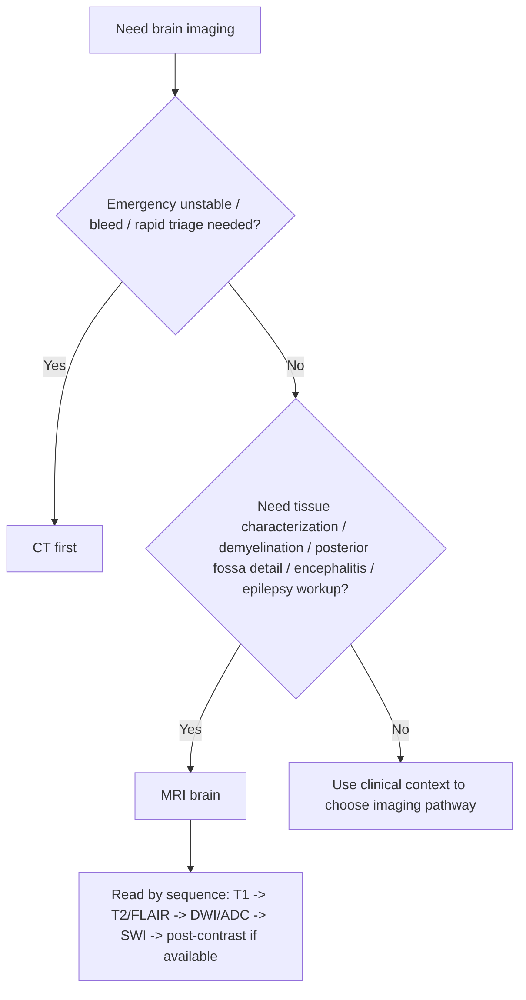

# MRI brain sequences basics

Related: [[../Neurology MOC|Neurology MOC]] · [[../Neuroimaging|Neuroimaging]] · [[MRI-based imaging]] · [[Non-contrast CT head basics]] · [[When CT is first-line in emergency neurology]] · [[Demyelination vs tumor vs infection pattern clues]]

> [!important]
> MRI is the most informative imaging modality for many neurological disorders because it provides superior soft-tissue contrast and sequence-based pattern recognition. In FCPS/MRCP, candidates should know **what each common sequence is good for**, not just list sequence names.

> [!tip]
> A practical exam line is: **“T1 gives anatomy, T2/FLAIR highlight edema and many lesions, DWI helps identify acute ischemia and restricted diffusion, and post-contrast imaging helps assess breakdown of the blood-brain barrier.”**

## Learning Objectives
- Recognize the main MRI brain sequences used in clinical neurology.
- Understand what tissue/pathology appears bright or dark on common sequences.
- Use MRI sequence logic to approach demyelination, tumor, infection, encephalitis, and raised ICP workup.
- Distinguish situations where CT is first-line from those where MRI adds critical value.
- Avoid common interpretation traps.

## Definition
**MRI brain sequences basics** refers to the practical understanding of the common MRI acquisitions used in neurology, especially:
- **T1-weighted imaging**
- **T2-weighted imaging**
- **FLAIR**
- **DWI** and **ADC**
- **SWI/T2*** susceptibility sequences
- **post-contrast T1 imaging**

## Relevant Neuroanatomy
MRI displays:
- grey matter and white matter anatomy
- ventricles and CSF spaces
- brainstem and posterior fossa structures in greater detail than CT
- corpus callosum, periventricular regions, temporal lobes, and deep nuclei that are highly relevant in neurology

This makes MRI especially useful in:
- demyelinating disease
- encephalitis
- tumor characterization
- posterior fossa pathology
- occult structural epilepsy workup

## Relevant Neurophysiology / Imaging Physics Concept
MRI sequences reflect tissue signal properties related to:
- proton environment
- relaxation behavior
- water content
- diffusion characteristics
- magnetic susceptibility
- blood-brain barrier disruption after contrast

Clinically, this means different sequences “highlight” different pathology.

## Normal Values / Important Cut-offs
MRI interpretation is mostly pattern-based, but important practical rules include:
- **CSF is dark on FLAIR** under normal circumstances.
- **Acute restricted diffusion** appears bright on DWI with corresponding low ADC.
- **Gadolinium enhancement** suggests blood-brain barrier disruption, inflammation, tumor vascularity, or active lesions depending on context.
- MRI is usually **not first-line** for the unstable emergency patient needing rapid bleed exclusion; CT is faster there.

## Classification
### Core clinical MRI sequence groups
1. anatomical sequence: **T1**
2. fluid-sensitive sequences: **T2**, **FLAIR**
3. diffusion sequence: **DWI/ADC**
4. blood/susceptibility sequence: **SWI/T2***
5. contrast-enhanced sequence: **post-gadolinium T1**

## Etiology / Uses in Neurology
### MRI is especially useful in evaluating
- demyelination
- encephalitis
- seizures/epilepsy structural substrate
- tumor
- inflammatory disease
- posterior fossa lesions
- unexplained focal deficits when CT is unrevealing
- chronic headache red-flag workup when indicated

## Risk Factors / Practical Contexts Requiring MRI Knowledge
- recurrent neurological episodes suggesting demyelination
- focal epilepsy or complex seizures
- suspected encephalitis
- posterior fossa/brainstem syndrome
- progressive cognitive or focal syndromes
- structural lesion suspected after a negative or equivocal CT

## Pathophysiology / Sequence Logic
### T1-weighted imaging
- good for anatomy
- CSF is dark
- white matter often appears relatively brighter than grey matter
- useful for structural overview and post-contrast assessment

### T2-weighted imaging
- water/fluid tends to appear bright
- edema, gliosis, inflammation, and many lesions become conspicuous
- CSF is bright

### FLAIR
- like a fluid-sensitive sequence but suppresses free CSF signal
- helps see **periventricular, cortical/subcortical, and meningeal-adjacent lesions** more clearly
- very useful in multiple sclerosis, edema, encephalitis, and small-vessel burden contexts

### DWI and ADC
- detect water diffusion restriction
- acute ischemic injury classically shows **bright DWI with low ADC**
- also useful in abscess, some encephalitic lesions, and highly cellular lesions depending on pattern

### SWI / T2* susceptibility
- sensitive to blood products and mineralization
- helps detect microbleeds, hemorrhagic transformation, cavernoma-related blood products, or old hemorrhage susceptibility change

### Post-contrast T1
- enhancement occurs when the blood-brain barrier is disrupted or lesion vascularity is abnormal
- useful in tumor, inflammation, abscess capsule, meningeal disease, active demyelination, and some infectious processes

## Clinical Features / Why MRI Is Requested
MRI is not ordered because of symptoms alone but because the syndrome suggests pathology best seen on MRI, for example:
- recurrent focal deficits with possible MS
- temporal lobe symptoms/encephalitis suspicion
- focal epilepsy evaluation
- posterior fossa symptoms with CT limitations
- unexplained raised ICP signs after CT triage

## Approach / Algorithm

### Safe MRI reading sequence
1. identify the sequence
2. inspect symmetry and anatomy
3. assess ventricles/CSF spaces
4. look for focal lesions on T2/FLAIR
5. check DWI/ADC for restriction
6. inspect susceptibility for blood
7. inspect enhancement pattern if contrast used
8. correlate with localization and syndrome

## Investigations
### MRI-related practical pathways
- MRI brain without contrast for many structural/demyelinating or seizure evaluations
- MRI brain with contrast when tumor, inflammation, infection, or active lesion characterization is needed
- combine with CSF, EEG, serology, or neurophysiology depending on syndrome

## Interpretation Frameworks

## Sequence Summary Table
| Sequence | Typical strength | High-yield clue |
|---|---|---|
| T1 | anatomy | CSF dark, structure overview |
| T2 | water-sensitive | edema/lesions often bright |
| FLAIR | suppresses CSF | periventricular/cortical lesions easier to see |
| DWI | diffusion restriction | acute infarct bright on DWI |
| ADC | confirms restriction | true restriction usually low ADC |
| SWI/T2* | blood products | microbleeds/hemorrhage susceptibility |
| Post-contrast T1 | enhancement | BBB breakdown/active lesion |

## Common Pattern Table
| Pattern | Sequence clue |
|---|---|
| Acute ischemia | DWI bright, ADC low |
| Demyelinating plaques | T2/FLAIR bright, often periventricular |
| Tumor/inflammation | mass lesion ± edema, often enhancement |
| Abscess | ring lesion, often diffusion restriction centrally depending context |
| Hemorrhagic products | susceptibility blooming on SWI/T2* |

## FLAIR Use Table
| Why FLAIR matters | Example |
|---|---|
| suppresses CSF | makes periventricular lesions stand out |
| highlights edema and gliosis | demyelination/encephalitis burden |
| better cortical-subcortical lesion visibility | inflammatory/infective lesions |

## Diagnosis
This note supports a **sequence-based imaging interpretation framework** rather than a single disease diagnosis.

Examples:
- “Periventricular FLAIR hyperintense lesions suggest demyelinating disease in the right clinical context.”
- “Temporal lobe FLAIR hyperintensity may support encephalitis depending on syndrome.”
- “Restricted diffusion indicates acute infarction or another diffusion-restricting lesion depending on pattern.”

## Differential Diagnosis
### DWI bright lesion differentials
- acute infarct
- abscess
- some highly cellular tumors
- seizure-related transient changes in selected contexts

### FLAIR white-matter lesion differentials
- demyelination
- small-vessel disease
- inflammation
- migraine-related nonspecific change in some cases
- infection

### Enhancement differentials
- tumor
- active demyelination
- abscess/infection
- granulomatous disease
- subacute infarct and other BBB-disrupting processes

## Tables / Comparison Charts

## CT vs MRI in Neurology
| Feature | CT | MRI |
|---|---|---|
| Speed in emergency | Excellent | Slower |
| Acute bleed screening | Excellent first-line | Useful but not first emergency step usually |
| Posterior fossa detail | Limited compared with MRI | Better |
| Demyelination | Less sensitive | Much better |
| Encephalitis characterization | Limited | Better |
| Tissue contrast | Lower | Higher |

## T1 vs T2 vs FLAIR Table
| Sequence | CSF appearance | Best remembered as |
|---|---|---|
| T1 | dark | anatomy |
| T2 | bright | water/edema bright |
| FLAIR | dark | T2-like but CSF suppressed |

## Management / Clinical Use
### When MRI changes management
- confirms demyelinating dissemination pattern
- detects posterior fossa disease missed/subtle on CT
- characterizes mass lesion and edema more precisely
- supports encephalitis diagnosis and urgency
- identifies structural epilepsy substrate

### Clinical caution
Do not delay lifesaving CT-based emergency decisions just because MRI is “better” in detail.

## Drug Interactions / Contraindications / Comorbidity Cautions
- Contrast-enhanced MRI requires attention to renal function and contrast risk where relevant.
- Some unstable, agitated, or ventilated patients may not tolerate MRI safely without support.
- Implanted devices/metal safety must be reviewed before MRI.

## Procedures / Indications / Contraindications
### Gadolinium-enhanced MRI
**Indications:**
- tumor characterization
- infection/inflammation assessment
- active lesion evaluation

**Cautions:**
- renal dysfunction depending protocol and agent
- allergy history/protocol issues

### MRI safety screening
**Indication:** every patient before scan
**Checks:** pacemaker/devices, metal fragments, implants, severe claustrophobia, monitoring needs

## Procedure Mini-Sections
### Sequence identification habit
- **Indication:** all MRI interpretation
- **Principle:** never interpret signal before naming sequence
- **Pearl:** many exam errors happen because T1 and T2 logic gets mixed up

### Contrast use planning
- **Indication:** lesion characterization when enhancement matters
- **Benefit:** helps distinguish active inflammation, tumor vascularity, abscess capsule, meningeal disease
- **Pitfall:** do not request contrast reflexly without a clinical question

## Complications / Pitfalls
- misreading DWI without ADC correlation
- confusing FLAIR lesion burden with nonspecific incidental white-matter change
- overcalling enhancement significance without clinical context
- forgetting MRI is not the fastest first test in unstable emergencies
- failing to inspect posterior fossa carefully even on MRI

## Red Flags / Emergencies
- suspected encephalitis with temporal lobe syndrome
- posterior fossa/brainstem signs with negative or unclear CT
- raised ICP signs needing full structural assessment after stabilization
- persistent focal seizures or unexplained focal deficits
- acute diffusion restriction pattern requiring urgent management correlation

## Prognosis
MRI itself does not determine prognosis, but correct MRI interpretation greatly improves diagnostic accuracy, staging, and early treatment planning in demyelination, infection, tumor, and epilepsy-related structural disease.

## Topic Correlation
- [[Non-contrast CT head basics]]
- [[When CT is first-line in emergency neurology]]
- [[Demyelination vs tumor vs infection pattern clues]]
- [[MRI spine indications]]
- [[CSF oligoclonal bands]]

## Special Situations
### Claustrophobic or unstable patient
MRI may be difficult or delayed; CT may be the practical initial study even if MRI is ultimately needed.

### Epilepsy workup
MRI is superior to CT for many structural epileptogenic lesions.

### Demyelinating disease
MRI is central to demonstrating lesion dissemination and characterizing lesion location.

### Immunocompromised patient
MRI with contrast may be particularly informative when infection, abscess, or inflammatory lesions are suspected.

## FCPS/MRCP High-Yield Points
- **T1 = anatomy**
- **T2/FLAIR = water/lesions**
- **DWI/ADC = acute restriction**
- **SWI/T2* = blood products**
- **Contrast = BBB disruption/active lesions**
- MRI is superior for demyelination, encephalitis, posterior fossa pathology, and many epilepsy evaluations.

## Common Viva Questions
- What is the difference between T1 and T2?
- Why is FLAIR useful in neurology?
- What does restricted diffusion mean?
- When is MRI preferred over CT?
- Why is ADC important alongside DWI?

## Common Confusions / Exam Traps
- saying “DWI bright = infarct” without remembering ADC confirmation and broader differential
- forgetting that CSF is suppressed on FLAIR
- using MRI when CT should be first in an unstable emergency bleed pathway
- mixing up sequence names and signal rules

## Mnemonics
### Sequence memory
**“T1 = One anatomy; T2 = Two much water.”**
- T1 for structure
- T2 for water-sensitive brightness

### FLAIR reminder
**“FLAIR clears the fluid background.”**
- CSF suppressed so lesions stand out better

## Mind Map
- MRI brain basics
  - T1
    - anatomy
    - post-contrast
  - T2
    - water bright
    - edema/lesions
  - FLAIR
    - CSF suppressed
    - periventricular lesions
  - DWI/ADC
    - restricted diffusion
    - acute infarct
  - SWI/T2*
    - blood products
  - Clinical uses
    - demyelination
    - encephalitis
    - tumor
    - epilepsy

## Suggested Visuals / Image Notes
- Side-by-side T1/T2/FLAIR example images
- Diagram showing where common MS lesions appear on FLAIR
- Sequence cheat sheet with bright/dark rules

## Suggested Video References
- MRI brain sequence basics tutorials
- DWI/ADC interpretation videos
- Neurology-focused MRI pattern-recognition teaching sessions

## One-Page Revision Summary
### Sequence cheat sheet
- **T1:** anatomy, CSF dark
- **T2:** fluid/edema bright
- **FLAIR:** CSF suppressed, lesions near CSF stand out
- **DWI:** acute restriction bright
- **ADC:** confirms true restriction when low
- **SWI/T2*:** blood products/susceptibility
- **Post-contrast T1:** enhancement = BBB disruption/active process

### MRI is especially useful for
- MS/demyelination
- encephalitis
- epilepsy structural lesions
- posterior fossa/brainstem pathology
- tumor characterization

## Recall Prompts
### 24-hour recall prompts
- What are the main roles of T1, T2, FLAIR, DWI, and SWI?
- Why is ADC paired with DWI?
- When is CT preferred over MRI?
- Why is FLAIR useful for periventricular lesions?
- Which sequence is sensitive to blood products?

### 7-day / 15-day / 30-day revision tracker
- **7 days:** redraw the sequence summary table.
- **15 days:** explain MRI sequence logic in 2 minutes.
- **30 days:** answer five case-based MRI sequence questions without notes.

## Must Know / Should Know / Nice to Know
### Must Know
- basic sequence roles
- DWI/ADC concept
- FLAIR usefulness
- CT vs MRI practical distinction

### Should Know
- enhancement logic
- susceptibility sequence utility
- posterior fossa and epilepsy relevance

### Nice to Know
- advanced perfusion/spectroscopy nuances outside core bedside exam scope

## My Weak Points
- Do I mix up T1 and T2?
- Do I remember ADC with DWI?
- Can I state when MRI is preferred over CT clearly?

## Self-Test Scorecard
- Sequence recognition /10
- Clinical application /10
- Differential interpretation /10
- Emergency imaging judgment /10
- Viva confidence /10

Interpretation:
- **<35/50** = weak
- **35-44/50** = acceptable
- **45+/50** = strong

## Exam Answer Modes
### Short note
List common MRI brain sequences and state what each shows best.

### Viva mode
Start with T1, T2, FLAIR, DWI/ADC, SWI, and contrast roles.

### Ward-case mode
Interpret MRI by sequence and correlate with the neurological syndrome.

## Summary
MRI brain interpretation in neurology depends on sequence recognition. T1 provides anatomy, T2/FLAIR highlight water-containing lesions, DWI/ADC detect diffusion restriction, SWI detects blood products, and contrast-enhanced T1 helps characterize active lesions and BBB breakdown.

## MCQs (10)
1. Which MRI sequence is best remembered as the basic anatomical sequence?
   - A. T1
   - B. T2
   - C. FLAIR
   - D. DWI
   - E. SWI

2. On FLAIR, normal CSF is usually:
   - A. Very bright
   - B. Suppressed/dark
   - C. Same as bone
   - D. Invisible only on coronal images
   - E. Always enhancing

3. Acute restricted diffusion classically appears as:
   - A. DWI dark, ADC high always
   - B. DWI bright with ADC low
   - C. T1 bright only
   - D. SWI blooming only
   - E. FLAIR dark only

4. Which sequence is especially sensitive to blood products and susceptibility effects?
   - A. SWI / T2*
   - B. T1 only
   - C. FLAIR only
   - D. ADC only
   - E. MRV only

5. Which statement about T2 is most accurate?
   - A. Fluid is usually bright
   - B. It is used only for bone
   - C. It suppresses CSF like FLAIR
   - D. It is identical to ADC
   - E. It cannot show edema

6. MRI is generally superior to CT for:
   - A. Rapid unstable bleed triage
   - B. Demyelinating lesion characterization
   - C. Bedside glucose measurement
   - D. Cardiac rhythm monitoring
   - E. Stroke unit nursing assessment

7. Why is ADC interpreted with DWI?
   - A. To confirm whether DWI brightness reflects true restriction
   - B. Because ADC is a contrast agent
   - C. Because DWI cannot show the brain
   - D. To measure blood pressure
   - E. To estimate CSF glucose

8. Post-contrast T1 imaging is useful because it shows:
   - A. BBB disruption/enhancement patterns
   - B. Reflexes
   - C. Purely bone density
   - D. Only chronic atrophy
   - E. Peripheral nerve conduction

9. Which is a common exam trap?
   - A. Pairing DWI with ADC
   - B. Knowing that FLAIR suppresses CSF
   - C. Using MRI instead of CT in every unstable emergency
   - D. Remembering T1 anatomy
   - E. Looking for posterior fossa lesions on MRI

10. Which sequence is especially helpful for periventricular demyelinating lesions?
   - A. FLAIR
   - B. Plain X-ray
   - C. ECG
   - D. Nerve conduction study
   - E. Spirometry

## SBA Questions (10)
1. A patient with suspected multiple sclerosis undergoes MRI. Which sequence is especially helpful to show periventricular plaques?
   - A. FLAIR
   - B. ECG
   - C. Colonoscopy
   - D. Spirometry
   - E. Bone scan

2. An MRI report describes a lesion that is bright on DWI and dark on ADC. The best interpretation is:
   - A. True diffusion restriction
   - B. Simple chronic atrophy
   - C. Pure artifact guaranteed
   - D. Normal study
   - E. Peripheral neuropathy

3. A drowsy unstable patient arrives with acute focal deficit and concern for hemorrhage. Best first imaging principle:
   - A. MRI must always come first
   - B. CT is usually first-line because it is faster for emergency triage
   - C. No imaging is needed
   - D. Audiometry first
   - E. EEG only

4. Which sequence best highlights blood products/microbleeds?
   - A. SWI / T2*
   - B. T1 alone
   - C. Only FLAIR
   - D. ADC map only
   - E. Ultrasound

5. A patient with temporal lobe syndrome and fever is being evaluated for encephalitis. Why is MRI useful?
   - A. Better tissue characterization than CT, especially on T2/FLAIR and contrast patterns
   - B. It measures blood sugar
   - C. It replaces CSF in all cases
   - D. It detects arrhythmia
   - E. It treats infection directly

6. What is the simplest memory aid for T1 vs T2?
   - A. T1 anatomy, T2 water bright
   - B. T1 blood pressure, T2 pulse rate
   - C. T1 equals EEG, T2 equals EMG
   - D. T1 and T2 are identical
   - E. T2 is only for bone

7. Why is FLAIR preferred over simple T2 in some lesion detection near CSF spaces?
   - A. Because CSF suppression makes lesions stand out better
   - B. Because it never shows edema
   - C. Because it is faster than CT in all emergencies
   - D. Because it measures blood flow directly
   - E. Because it ignores white matter

8. A ring-enhancing lesion may require which sequence component for proper assessment?
   - A. Post-contrast T1 imaging
   - B. Reflex testing
   - C. Spirometry
   - D. Holter monitor
   - E. Plain abdominal film

9. Which statement is most appropriate about MRI interpretation?
   - A. One must identify the sequence before interpreting lesion signal
   - B. Sequence names are unimportant
   - C. DWI brightness always means stroke and nothing else
   - D. MRI never helps in epilepsy workup
   - E. ADC is unnecessary

10. A patient’s MRI is requested for focal epilepsy workup after normal CT. Why is this reasonable?
   - A. MRI is more sensitive for many structural epileptogenic lesions
   - B. CT is forbidden after seizures
   - C. EEG is never useful
   - D. MRI cures epilepsy
   - E. FLAIR is only for trauma

## Flashcards
- Q: What is the simplest role of T1?
  A: Anatomy.

- Q: On T2, what generally appears bright?
  A: Water/fluid and many edema-related lesions.

- Q: Why is FLAIR useful?
  A: It suppresses CSF, making nearby lesions easier to see.

- Q: What MRI pattern suggests acute restricted diffusion?
  A: Bright DWI with low ADC.

- Q: Which sequence is sensitive to blood products?
  A: SWI or T2* susceptibility imaging.

- Q: What does post-contrast enhancement usually imply?
  A: BBB disruption or abnormal lesion vascularity/activity.

- Q: When is CT often preferred first?
  A: In unstable acute emergencies such as rapid hemorrhage triage.

- Q: Which sequence is particularly useful for MS plaques?
  A: FLAIR.

- Q: Why should DWI not be read alone?
  A: ADC helps confirm true restriction.

- Q: MRI is especially good for what neurology domains?
  A: Demyelination, encephalitis, posterior fossa pathology, tumor characterization, and epilepsy structural workup.

## Answer Key with Explanations
### MCQs
1. **A. T1** — basic anatomical sequence.
2. **B. Suppressed/dark** — classic FLAIR principle.
3. **B. DWI bright with ADC low** — true restriction.
4. **A. SWI / T2*** — susceptibility/blood-product sensitive.
5. **A. Fluid is usually bright** — the simplest T2 rule.
6. **B. Demyelinating lesion characterization** — a major MRI strength.
7. **A. To confirm whether DWI brightness reflects true restriction** — correct reason.
8. **A. BBB disruption/enhancement patterns** — why contrast is useful.
9. **C. Using MRI instead of CT in every unstable emergency** — important trap.
10. **A. FLAIR** — very useful for periventricular lesion detection.

### SBAs
1. **A. FLAIR** — best for periventricular plaque conspicuity.
2. **A. True diffusion restriction** — classic DWI/ADC pair.
3. **B. CT is usually first-line because it is faster for emergency triage** — practical imaging judgment.
4. **A. SWI / T2*** — most sensitive to blood products.
5. **A. Better tissue characterization than CT, especially on T2/FLAIR and contrast patterns** — why MRI helps in encephalitis evaluation.
6. **A. T1 anatomy, T2 water bright** — best memory rule.
7. **A. Because CSF suppression makes lesions stand out better** — FLAIR’s value.
8. **A. Post-contrast T1 imaging** — key for enhancement patterns.
9. **A. One must identify the sequence before interpreting lesion signal** — foundational rule.
10. **A. MRI is more sensitive for many structural epileptogenic lesions** — correct rationale.

## PasTest Scenario SBAs (Clinical Vignettes)

> **Auto-generated PasTest/Mediscope-style scenario SBAs** grounded in the authored source. Each scenario tests a real clinical fact (triad, specific sign, contraindication, trial, first-line Rx) extracted from the topic. *Source: Ch 27: Neurology & Stroke — MRI brain sequences basics*

**Q1.** Which of the following features is most specific or characteristic of MRI brain sequences basics?

  - **A.** A. Post-contrast T1 imaging
  - **B.** A feature common to many acute inflammatory conditions
  - **C.** A non-specific sign that does not localise the diagnosis
  - **D.** An investigation finding rather than a clinical feature

  > **Answer: A** — A. Post-contrast T1 imaging
  >
  > *Source:* **A. Post-contrast T1 imaging** — key for enhancement patterns

