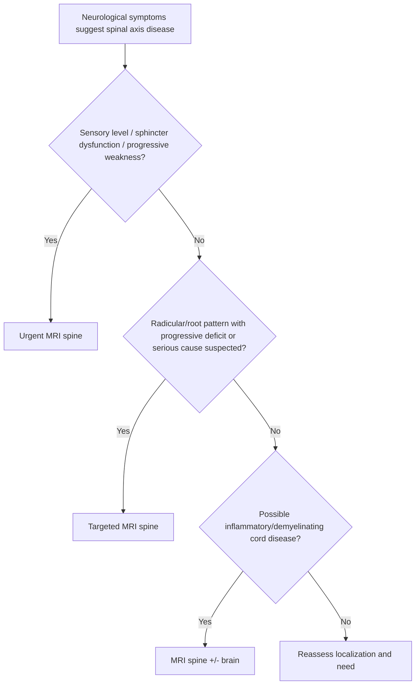

# MRI spine indications

Related: [[../Neurology MOC|Neurology MOC]] · [[../Neuroimaging|Neuroimaging]] · [[MRI-based imaging]] · [[MRI brain sequences basics]] · [[Linking imaging to localization]] · [[../Localising Lesions in the Central Nervous System/Myelopathy pattern|Myelopathy pattern]]

> [!important]
> MRI spine is the **key imaging test for suspected spinal cord, cauda equina, nerve root, epidural, and many vertebral canal pathologies**. In FCPS/MRCP, you should know **when it is urgent**, especially for cord compression, myelopathy, infection, tumor, and inflammatory disease.

> [!tip]
> A strong exam answer states: **“Request urgent MRI spine when there is suspected cord compression, sensory level, sphincter dysfunction, progressive myelopathy, cauda equina syndrome, or inflammatory/infective cord disease.”**

## Learning Objectives
- Know the main indications for MRI spine in neurology.
- Differentiate **urgent**, **same-admission**, and **elective** spine MRI situations.
- Relate symptoms such as sensory level, sphincter dysfunction, back pain, and radicular pain to spinal imaging decisions.
- Recognize red flags for cord compression and cauda equina.
- Understand basic MRI sequence utility in spine workup.

## Definition
**MRI spine indications** refers to the clinical situations where MRI of the cervical, thoracic, lumbar, or whole spine is needed to evaluate:
- spinal cord lesions
- compressive myelopathy
- cauda equina or conus lesions
- radiculopathy/nerve root disease
- demyelination/inflammation
- tumor, abscess, hemorrhage, or structural canal pathology

## Relevant Neuroanatomy
### Key structures assessed on spinal MRI
- vertebral bodies
- intervertebral discs
- epidural space
- spinal cord
- conus medullaris
- cauda equina
- nerve roots
- foramina
- paraspinal tissues

### Localization value
- **cervical spine**: arm + leg involvement, UMN legs, possible LMN arms depending level
- **thoracic spine**: trunk sensory level, bilateral leg symptoms, bladder involvement
- **lumbar spine/cauda equina**: radicular pain, saddle sensory loss, bladder/bowel dysfunction, LMN signs

## Relevant Neurophysiology
- The spinal cord carries corticospinal, dorsal column, and spinothalamic tracts.
- Compression, inflammation, ischemia, or demyelination disrupts conduction and produces:
  - UMN signs below lesion
  - sensory level
  - autonomic dysfunction
- Root or cauda equina disease produces LMN/radicular patterns rather than long-tract myelopathy.

## Normal Values / Important Cut-offs
MRI spine decisions are pattern-based, but these practical thresholds matter:
- **New urinary retention + bilateral leg weakness/saddle symptoms** = urgent cauda equina exclusion.
- **Sensory level** strongly suggests cord pathology and usually warrants MRI spine.
- **Progressive myelopathy** with UMN signs needs prompt structural imaging.
- Back pain plus fever/immunosuppression raises concern for **epidural abscess** and requires urgent assessment.

## Classification
### By urgency
1. **Emergency / urgent MRI spine**
2. **Same-admission / early inpatient MRI**
3. **Elective outpatient MRI**

### By syndrome being investigated
1. myelopathy
2. cord compression
3. cauda equina syndrome
4. radiculopathy/root disease
5. inflammatory/demyelinating lesion
6. tumor/infection/epidural process

## Etiology / Causes Prompting MRI Spine
- metastatic cord compression
- cervical spondylotic myelopathy
- disc prolapse with cord/root compromise
- spinal epidural abscess
- transverse myelitis
- multiple sclerosis/spinal demyelination
- vertebral or epidural tumor
- syrinx or intramedullary lesion
- traumatic cord injury or hematoma

## Risk Factors
- cancer history
- immunosuppression
- fever/systemic infection
- anticoagulation if epidural hematoma possible
- trauma
- inflammatory/autoimmune disease
- known degenerative spine disease

## Pathophysiology
### Compression patterns
- extradural mass/disc/abscess/hematoma narrows canal
- cord or cauda equina is compressed
- long-tract/autonomic dysfunction follows if severe

### Inflammatory/demyelinating patterns
- intramedullary signal change may reflect inflammation, demyelination, infection, or tumor
- MRI helps distinguish location, extent, and enhancement pattern

## Clinical Features

## Core Indications for MRI Spine
### Suspected cord compression
- back or neck pain
- progressive limb weakness
- sensory level
- sphincter dysfunction
- gait decline
- UMN signs below lesion

### Suspected cauda equina syndrome
- severe low back pain
- bilateral sciatica or leg weakness
- saddle anesthesia
- urinary retention or overflow incontinence
- reduced anal tone if examined

### Suspected inflammatory myelopathy
- acute/subacute bilateral weakness or sensory change
- clear sensory level
- bladder symptoms
- possible optic/brain symptoms suggesting demyelination

### Persistent/radicular root symptoms when imaging is clinically needed
- dermatomal pain
- root-pattern weakness/reflex loss
- severe or progressive deficit
- suspected compressive lesion

### Tumor/infective suspicion
- cancer history
- constitutional symptoms
- fever/back pain
- progressive deficit

## Approach / Algorithm

## Investigations
### MRI spine protocol idea
Common practical components:
- sagittal T1
- sagittal T2
- axial T2 through lesion/region
- STIR/fat suppression when useful
- post-contrast sequences when infection, tumor, inflammation, or intradural pathology is suspected

### Additional tests linked to MRI findings
- CBC/CRP/ESR, blood cultures if abscess suspected
- CSF if inflammatory myelopathy considered and safe/appropriate
- MRI brain if demyelination suspected
- CT/bone studies if vertebral structural disease or malignancy staging needed

## Interpretation Frameworks

## Urgent MRI Spine Indication Table
| Scenario | Why MRI is urgent |
|---|---|
| Sensory level + UMN legs | cord lesion likely |
| New urinary retention + saddle anesthesia | cauda equina/conus emergency |
| Cancer + back pain + weakness | metastatic compression concern |
| Fever + back pain + deficit | epidural abscess concern |
| Rapidly progressive quadriparesis/paraparesis | cord emergency until proven otherwise |

## Myelopathy vs Root Table
| Feature | Myelopathy | Root/radiculopathy |
|---|---|---|
| Reflexes | brisk below lesion | reduced in affected root |
| Plantars | may be extensor | flexor |
| Sensory pattern | level/long-tract | dermatomal |
| Bladder | may be involved | usually spared |
| MRI target | cord/canal | root/foraminal/disc region |

## MRI Pattern Clues Table
| MRI clue | Possible meaning |
|---|---|
| Extrinsic cord compression | disc, tumor, abscess, hematoma |
| Intramedullary T2 bright lesion | demyelination, myelitis, tumor, edema |
| Epidural enhancing collection | abscess/infective process |
| Cauda equina root clumping/enhancement | inflammatory/infiltrative process depending context |

## Diagnosis
MRI spine supports diagnoses such as:
- cervical/thoracic myelopathy
- metastatic cord compression
- cauda equina syndrome
- transverse myelitis
- spinal demyelination
- epidural abscess
- intramedullary tumor or structural lesion

## Differential Diagnosis
When considering MRI spine, main competing diagnoses include:
- spinal cord lesion vs peripheral neuropathy
- myelopathy vs cauda equina/root disease
- inflammatory myelitis vs compressive lesion
- degenerative disease vs tumor/infection

## Tables / Comparison Charts

## Emergency Comparison Table
| Presentation | Imaging priority |
|---|---|
| Acute confusion/headache/seizure emergency | CT/MRI brain pathway |
| Sensory level + urinary symptoms | MRI spine urgent |
| Bilateral radicular pain + saddle anesthesia | MRI lumbosacral spine urgent |
| Progressive gait spasticity | MRI cervical/thoracic spine |

## Cervical vs Thoracic vs Lumbar Clues
| Region | Typical clues |
|---|---|
| Cervical | arm + leg signs, hand clumsiness, gait spasticity |
| Thoracic | trunk sensory band, spastic paraparesis, bladder involvement |
| Lumbar/cauda equina | radicular pain, saddle loss, LMN weakness, bladder/bowel issues |

## Management
### What MRI spine changes clinically
- identifies need for urgent neurosurgery/spinal surgery
- distinguishes compression from inflammation
- guides steroid, antibiotic, decompression, oncology, or demyelination pathway depending diagnosis

### Immediate management while arranging MRI
- neurological monitoring
- bladder assessment/catheter if retention
- urgent escalation if cord compression or cauda equina suspected
- sepsis/infection workup if epidural abscess possible

## Drug Interactions / Contraindications / Comorbidity Cautions
- Contrast decisions require renal-function review where relevant.
- Anticoagulation increases concern for epidural hematoma in the right context.
- Sedating analgesics can cloud examination but pain control remains important.
- Steroids may be used in selected compressive/oncologic pathways, but do not let empiric treatment replace urgent imaging when diagnosis is uncertain.

## Procedures / Indications / Contraindications
### Whole-spine vs regional MRI
- **Whole spine** may be needed if metastatic disease, multifocal symptoms, or uncertain level.
- **Regional targeted MRI** is appropriate when localization is clear.

### Post-contrast MRI
- **Indication:** tumor, infection, inflammatory lesion characterization
- **Caution:** renal function and protocol considerations

## Procedure Mini-Sections
### Bladder scan
- **Indication:** suspected cauda equina/myelopathy
- **Benefit:** objective evidence of retention
- **Pearl:** retention raises urgency significantly

### Neurosurgical/spinal referral
- **Indication:** compression, cauda equina, unstable epidural process
- **Pearl:** MRI should feed directly into escalation; it is not just confirmatory documentation

## Complications
- permanent weakness/paralysis if compression is missed
- urinary/bowel dysfunction
- chronic pain and disability
- septic deterioration if epidural abscess missed
- irreversible cord injury if decompression delayed

## Red Flags / Emergencies
- sensory level
- new sphincter dysfunction
- saddle anesthesia
- rapidly progressive paraparesis/quadriparesis
- cancer + back pain + deficit
- fever + spinal pain + neurological decline
- severe neck/back pain with objective myelopathy

## Prognosis
Prognosis depends on:
- speed of recognition
- duration of compression or inflammation before treatment
- underlying cause
- degree of bladder and motor involvement at presentation

## Topic Correlation
- [[Linking imaging to localization]]
- [[MRI brain sequences basics]]
- [[../Localising Lesions in the Central Nervous System/Myelopathy pattern|Myelopathy pattern]]
- [[../Localising Lesions in the Central Nervous System/Cord compression red flags|Cord compression red flags]]
- [[../Localising Lesions in the Central Nervous System/Root vs plexus vs peripheral nerve|Root vs plexus vs peripheral nerve]]

## Special Situations
### Cancer patient
Any new back pain with weakness or sphincter symptoms is metastatic compression until excluded.

### Immunocompromised patient
Low threshold for epidural abscess/infective spine imaging.

### Multiple sclerosis suspicion
Spine MRI may reveal cord lesions even when brain imaging is incomplete or when the clinical syndrome is clearly myelitic.

## FCPS/MRCP High-Yield Points
- Sensory level = think cord and request MRI spine.
- Urinary retention + saddle symptoms = urgent MRI lumbosacral spine.
- MRI spine is superior for cord, epidural, and root pathology characterization.
- Myelopathy and radiculopathy differ clinically and on imaging targets.

## Common Viva Questions
- When do you request urgent MRI spine?
- How do you distinguish myelopathy from radiculopathy clinically?
- What symptoms suggest cauda equina syndrome?
- Why is MRI preferred over CT for many cord lesions?
- When would you request contrast?

## Common Confusions / Exam Traps
- delaying MRI in clear cord compression syndrome
- calling cauda equina “just sciatica”
- failing to check bladder symptoms
- ordering brain imaging only when the clinical syndrome localizes to spine
- forgetting infection/tumor red flags

## Mnemonics
### Urgent spine MRI clues
**“LEVEL-BLADDER-BACK”**
- **LEVEL** sensory level
- **BLADDER** retention/incontinence
- **BACK** pain with weakness, fever, or cancer history

## Mind Map
- MRI spine indications
  - cord compression
  - myelopathy
  - cauda equina
  - radiculopathy with red flags
  - demyelination/myelitis
  - tumor/infection
  - urgency based on
    - sensory level
    - sphincter dysfunction
    - progressive weakness
    - fever/cancer/trauma

## Suggested Visuals / Image Notes
- Diagram showing cervical vs thoracic vs lumbar localization clues
- Table comparing myelopathy and radiculopathy
- MRI examples of cord compression, myelitis, and cauda equina-related pathology

## Suggested Video References
- Myelopathy and cauda equina clinical localization videos
- MRI spine interpretation basics for neurologists
- Spinal cord compression emergency teaching sessions

## One-Page Revision Summary
### Order urgent MRI spine for
- sensory level
- progressive myelopathy
- bladder/bowel dysfunction
- saddle anesthesia
- cancer + back pain + weakness
- fever + back pain + deficit

### Region clues
- **Cervical:** arms + legs
- **Thoracic:** trunk level + legs + bladder
- **Lumbar/cauda:** radicular pain + saddle + retention

## Recall Prompts
### 24-hour recall prompts
- List 5 urgent indications for MRI spine.
- How do myelopathy and radiculopathy differ?
- What is the classic cauda equina syndrome cluster?
- When is contrast useful in spinal MRI?
- What cancer-related spinal emergency must you not miss?

### 7-day / 15-day / 30-day revision tracker
- **7 days:** write the urgent indications from memory.
- **15 days:** compare cervical, thoracic, and lumbar syndromes.
- **30 days:** answer a viva on myelopathy, cauda equina, and MRI urgency.

## Must Know / Should Know / Nice to Know
### Must Know
- sensory level and sphincter red flags
- myelopathy vs radiculopathy
- cauda equina emergency pattern

### Should Know
- contrast use in infection/tumor/inflammation
- whole-spine vs targeted imaging principles

### Nice to Know
- finer sequence protocol variations by spinal pathology

## My Weak Points
- Do I always ask about bladder symptoms?
- Do I confuse myelopathy with peripheral/root disease?
- Do I recognize epidural abscess risk quickly?

## Self-Test Scorecard
- Indication recognition /10
- Localization skill /10
- Emergency triage /10
- MRI pathway understanding /10
- Viva confidence /10

Interpretation:
- **<35/50** = weak
- **35-44/50** = acceptable
- **45+/50** = strong

## Exam Answer Modes
### Short note
Write the indications for MRI spine and the red flags for urgent imaging.

### Viva mode
Start with sensory level, sphincter symptoms, and compression/myelitis differentials.

### Ward-case mode
State whether the syndrome is myelopathic, radicular, or cauda-equina-like, then justify the imaging urgency.

## Summary
MRI spine is essential in suspected spinal neurological disease, especially when there is a **sensory level, progressive myelopathy, sphincter dysfunction, cauda equina syndrome, infection, tumor, or epidural compression**. The key exam skill is not just knowing the test, but knowing **when it is urgent**.

## MCQs (10)
1. Which finding most strongly indicates urgent MRI spine?
   - A. Recurrent isolated migraine aura
   - B. Sensory level with progressive leg weakness
   - C. Mild tension headache
   - D. Isolated positional vertigo
   - E. Chronic rhinitis

2. Which symptom cluster most strongly suggests cauda equina syndrome?
   - A. Diplopia and dysarthria
   - B. Saddle anesthesia and urinary retention
   - C. Aphasia and hemianopia
   - D. Tinnitus and aural fullness
   - E. Restless legs at night

3. Myelopathy is more likely than radiculopathy when there is:
   - A. Dermatomal pain only
   - B. Brisk reflexes and extensor plantar response
   - C. Normal sphincter function and unilateral sciatica only
   - D. Isolated distal numbness only
   - E. Pure fatigable ptosis

4. In a cancer patient, new back pain plus weakness should raise concern for:
   - A. BPPV
   - B. Metastatic cord compression
   - C. Ménière disease
   - D. Tension headache
   - E. Bell palsy

5. Which is a strong indication for contrast-enhanced spine MRI?
   - A. Infection or tumor characterization
   - B. Measuring blood pressure
   - C. Assessing hearing loss only
   - D. Diagnosing eczema
   - E. Evaluating constipation only

6. Which region is especially suggested by saddle anesthesia?
   - A. Cortex
   - B. Brainstem
   - C. Conus/cauda equina region
   - D. Cerebellum
   - E. Temporal lobe

7. Fever, back pain, and neurological deficit should prompt urgent exclusion of:
   - A. Epidural abscess
   - B. BPPV
   - C. Ménière disease
   - D. Migraine only
   - E. Myasthenia only

8. MRI spine is especially superior to CT for evaluating:
   - A. Soft tissue cord and epidural pathology
   - B. Bedside glucose
   - C. Cardiac rhythm
   - D. Pulmonary function
   - E. Ear wax

9. Which is a common exam trap?
   - A. Asking about bladder symptoms
   - B. Recognizing a sensory level
   - C. Delaying MRI in clear compressive myelopathy
   - D. Checking cancer history
   - E. Differentiating myelopathy from root disease

10. Which statement is correct?
   - A. Radiculopathy usually gives a sensory level
   - B. Myelopathy often produces long-tract signs and may affect bladder function
   - C. Cauda equina always causes brisk reflexes
   - D. MRI spine is never urgent
   - E. Spine lesions cannot mimic peripheral disease

## SBA Questions (10)
1. A 58-year-old man with prostate cancer develops thoracic back pain, progressive leg weakness, and urinary urgency. Best next investigation:
   - A. Routine audiometry
   - B. Urgent MRI spine
   - C. Sinus X-ray
   - D. EEG only
   - E. No imaging needed

2. A 41-year-old woman has subacute bilateral leg weakness, a clear sensory level, and bladder symptoms. Best interpretation:
   - A. Peripheral vestibular disorder
   - B. Spinal cord syndrome requiring MRI spine
   - C. Pure mononeuropathy
   - D. Ménière disease
   - E. Bell palsy

3. A patient presents with severe low back pain, bilateral sciatica, saddle anesthesia, and urinary retention. Best next action:
   - A. Reassure and discharge
   - B. Urgent MRI lumbosacral spine for cauda equina exclusion
   - C. Treat as tension headache
   - D. Request audiometry first
   - E. Delay imaging until outpatient follow-up

4. An immunocompromised patient with fever, spinal pain, and new weakness should be assumed to have what until excluded?
   - A. BPPV
   - B. Epidural abscess / spinal infective process
   - C. Ménière disease
   - D. Migraine without aura
   - E. Functional tremor only

5. Which finding best supports myelopathy over root disease?
   - A. Dermatomal pain alone
   - B. Extensor plantar responses and sensory level
   - C. Isolated absent ankle jerk only
   - D. Pure unilateral hand numbness only
   - E. Tinnitus

6. A patient with suspected multiple sclerosis develops a myelopathic episode. Why is MRI spine useful?
   - A. It can demonstrate cord demyelinating lesions
   - B. It measures serum sodium
   - C. It replaces all clinical examination
   - D. It evaluates hearing
   - E. It is only for trauma

7. Which situation most justifies gadolinium-enhanced spine MRI?
   - A. Possible infection, tumor, or inflammatory lesion characterization
   - B. Hay fever
   - C. Simple positional vertigo
   - D. Chronic insomnia only
   - E. Mild tension headache

8. A patient has progressive hand clumsiness, gait stiffness, and brisk lower-limb reflexes. Best region to suspect:
   - A. Cervical cord
   - B. Cochlea
   - C. Temporal lobe only
   - D. Peripheral vestibular labyrinth
   - E. Median nerve only

9. Why is bladder scanning useful in suspected cauda equina or myelopathy?
   - A. It helps objectively identify urinary retention
   - B. It diagnoses tinnitus
   - C. It replaces MRI
   - D. It measures ICP
   - E. It treats weakness

10. Which statement best summarizes MRI spine indications?
   - A. It is mainly for sinus disease
   - B. It is crucial when symptoms suggest cord, cauda equina, root, epidural, inflammatory, tumor, or infectious spinal pathology
   - C. It has no role in neurology
   - D. It is only used electively
   - E. It is inferior to CT for cord lesions

## Flashcards
- Q: What bedside sign strongly suggests a cord lesion and prompts MRI spine?
  A: A sensory level.

- Q: What symptom cluster defines urgent cauda equina concern?
  A: Saddle anesthesia, bladder dysfunction, and bilateral radicular/leg symptoms.

- Q: In cancer patients, new back pain plus weakness suggests what emergency?
  A: Metastatic cord compression.

- Q: Fever, back pain, and neurological deficit suggest what until excluded?
  A: Epidural abscess or infective spinal process.

- Q: How does myelopathy differ from radiculopathy in reflexes?
  A: Myelopathy often causes brisk reflexes below the lesion; radiculopathy reduces the affected reflex.

- Q: Which region often causes arm and leg signs together?
  A: Cervical spinal cord.

- Q: Which investigation is best for cord and epidural soft tissue pathology?
  A: MRI spine.

- Q: When is contrast useful in spine MRI?
  A: When infection, tumor, or inflammatory lesion characterization is needed.

- Q: Why is bladder scan useful before/while arranging MRI?
  A: It objectively detects retention and raises urgency.

- Q: What is the most important exam principle for MRI spine requests?
  A: Know when the syndrome is urgent, not just that MRI exists.

## Answer Key with Explanations
### MCQs
1. **B. Sensory level with progressive leg weakness** — classic urgent cord-imaging pattern.
2. **B. Saddle anesthesia and urinary retention** — classic cauda equina features.
3. **B. Brisk reflexes and extensor plantar response** — long-tract signs suggest myelopathy.
4. **B. Metastatic cord compression** — must not be missed.
5. **A. Infection or tumor characterization** — strong indication for contrast.
6. **C. Conus/cauda equina region** — saddle symptoms localize here.
7. **A. Epidural abscess** — urgent emergency.
8. **A. Soft tissue cord and epidural pathology** — MRI strength.
9. **C. Delaying MRI in clear compressive myelopathy** — a dangerous trap.
10. **B. Myelopathy often produces long-tract signs and may affect bladder function** — correct statement.

### SBAs
1. **B. Urgent MRI spine** — clear metastatic compression concern.
2. **B. Spinal cord syndrome requiring MRI spine** — sensory level + bladder symptoms.
3. **B. Urgent MRI lumbosacral spine for cauda equina exclusion** — correct emergency step.
4. **B. Epidural abscess / spinal infective process** — high-priority exclusion.
5. **B. Extensor plantar responses and sensory level** — supports myelopathy.
6. **A. It can demonstrate cord demyelinating lesions** — why spine MRI is useful.
7. **A. Possible infection, tumor, or inflammatory lesion characterization** — main reason for contrast.
8. **A. Cervical cord** — arm + leg corticospinal pattern.
9. **A. It helps objectively identify urinary retention** — practical urgency marker.
10. **B. It is crucial when symptoms suggest cord, cauda equina, root, epidural, inflammatory, tumor, or infectious spinal pathology** — best summary.
