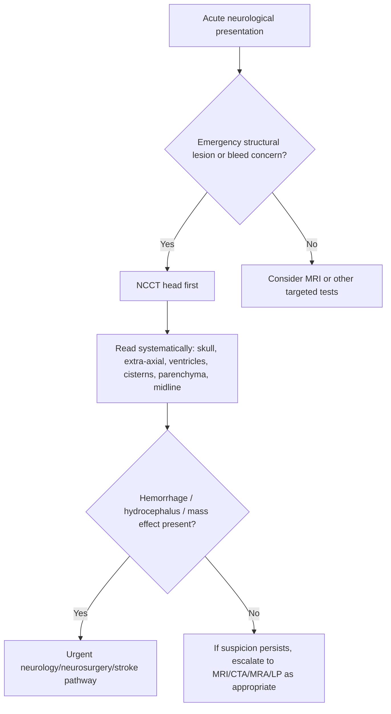
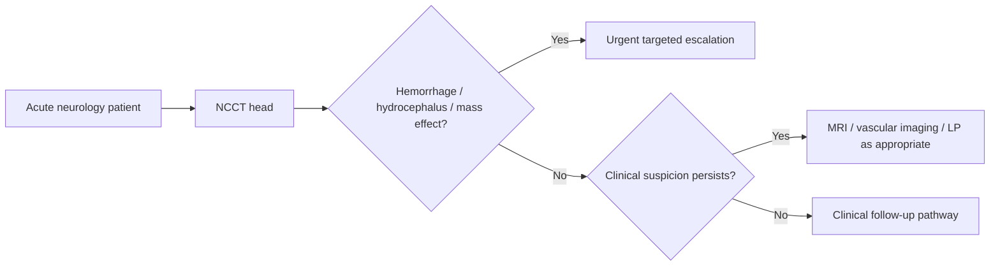

# Non-contrast CT head basics

Related: [[../Neurology MOC|Neurology MOC]] · [[../Neuroimaging|Neuroimaging]] · [[CT-based imaging]] · [[When CT is first-line in emergency neurology]] · [[Blood, mass effect, hydrocephalus, and midline shift pattern recognition]] · [[MRI brain sequences basics]] · [[Linking imaging to localization]]

> [!important]
> In emergency neurology, **non-contrast CT (NCCT) head** is the fastest widely available test for detecting **intracranial hemorrhage, mass effect, hydrocephalus, and many major structural emergencies**. It is often the first imaging step before MRI.

> [!tip]
> In exams, do not just say “CT head done.” State **why NCCT is chosen**, what it is best at, what it can miss, and how to interpret it systematically.

## Learning Objectives
- Explain what NCCT head is and when it is first-line.
- Review CT density concepts relevant to neurology.
- Use a systematic approach to read an NCCT head.
- Recognize blood, hydrocephalus, mass effect, midline shift, and early ischemic change limitations.
- Know when MRI or vascular imaging is needed after NCCT.

## Definition
**Non-contrast CT head** is a computed tomography scan of the brain performed **without intravenous contrast**. It provides rapid cross-sectional imaging based on X-ray attenuation differences.

## Relevant Neuroanatomy
Important structures to inspect on NCCT:
- scalp and skull
- extra-axial spaces
- ventricles
- basal cisterns
- cerebral hemispheres
- grey-white differentiation
- cerebellum and brainstem
- midline structures and falx
- paranasal sinuses/mastoids when relevant

## Relevant Neurophysiology
### CT attenuation basics
Different tissues attenuate X-rays differently:
- **bone** = very hyperdense (white)
- **acute blood** = hyperdense
- **brain parenchyma** = intermediate grey
- **CSF** = hypodense/dark
- **air** = very hypodense/black

### Why NCCT is useful in emergencies
- acute blood is readily visible
- scan is fast and widely available
- compatible with unstable patients and acute resuscitation environments

## Normal Values / Important Cut-offs
Rather than laboratory cut-offs, CT basics rely on pattern recognition:
- normal ventricles should not be disproportionately enlarged for age without explanation
- midline should remain central; **midline shift** suggests mass effect
- loss of normal **grey-white differentiation** can suggest early ischemia or diffuse edema
- compressed basal cisterns suggest raised ICP/mass effect

## Classification
### Major uses of NCCT in neurology
1. suspected intracranial hemorrhage
2. head injury assessment
3. suspected mass effect / hydrocephalus
4. first-line imaging in acute neurological deterioration
5. first-line imaging before LP when raised ICP/mass lesion concern exists

## Etiology / Why it is ordered
Common indications:
- first seizure with acute concern
- reduced consciousness
- focal deficit
- thunderclap headache/bleed concern
- trauma
- suspected raised ICP
- meningitis before LP when focal deficit/papilledema/risk factors present

## Risk Factors / Practical limitations
NCCT is excellent for acute hemorrhage but less sensitive for:
- very early ischemic stroke
- posterior fossa ischemia
- subtle demyelination
- encephalitis without mass effect
- small cortical lesions

## Pathophysiology / Imaging correlation
- Blood becomes hyperdense because of clot and protein content.
- Edema lowers tissue density and may blur grey-white interfaces.
- Mass lesions create displacement, ventricular compression, or midline shift.
- Hydrocephalus enlarges ventricles when CSF outflow is obstructed or absorption impaired.

## Clinical Features That Prompt NCCT
- sudden severe headache
- reduced GCS or acute confusion
- focal neurological deficit
- seizure with persistent deficit or trauma
- suspected raised ICP or herniation syndrome
- acute meningitic patient with focal signs before LP

## Approach / Algorithm

## Systematic Interpretation Framework
### Use a reproducible checklist
**BONES – BLOOD – BRAIN – VENTRICLES – CISTERNS – SHIFT**

1. **Bones/scalp**
   - fracture?
   - scalp swelling?
2. **Blood**
   - hyperdense acute bleed?
   - extra-axial or intra-axial?
3. **Brain parenchyma**
   - focal hypodensity?
   - edema?
   - mass lesion?
   - grey-white loss?
4. **Ventricles**
   - enlarged or compressed?
   - intraventricular blood?
5. **Basal cisterns**
   - open or effaced?
6. **Midline/shift**
   - falx centered?
   - mass effect or herniation clues?

## Investigations
### What NCCT can show well
- intracerebral hemorrhage
- subarachnoid blood in many cases
- subdural/epidural collections
- mass effect
- hydrocephalus
- major edema
- skull fracture (better on bone windows)

### What may need further imaging
- early ischemic stroke → CT may be normal or subtle
- posterior fossa lesions → MRI often better
- demyelination → MRI better
- encephalitis → MRI often better
- venous sinus thrombosis → CT venography/contrast study may be required

## Interpretation Frameworks
### Common density language
| Term | Meaning | Typical examples |
|---|---|---|
| Hyperdense | Brighter/whiter than brain | acute blood, calcification, bone |
| Isodense | Similar density to brain | some masses, subacute collections |
| Hypodense | Darker than brain | edema, infarct, CSF |

### Basic emergency lesion interpretation
| Imaging clue | Likely implication |
|---|---|
| Hyperdense parenchymal focus | Acute intracerebral hemorrhage |
| Crescentic extra-axial collection | Subdural hematoma pattern |
| Biconvex/lentiform extra-axial collection | Epidural hematoma pattern |
| Effaced sulci and compressed ventricles | Raised ICP / diffuse edema |
| Enlarged ventricles with transependymal edema | Hydrocephalus |
| Midline displacement | Significant mass effect |

### Early ischemia clues on NCCT
- subtle loss of grey-white differentiation
- insular ribbon loss
- sulcal effacement
- focal hypodensity later

But exam pearl: **a normal early NCCT does not exclude ischemic stroke**.

## Diagnosis
NCCT by itself is not a diagnosis; it supports syndromic diagnosis.
Examples:
- acute headache + hyperdense basal cisternal blood → subarachnoid hemorrhage pattern
- acute coma + intraparenchymal hyperdensity with edema → intracerebral hemorrhage
- enlarged ventricles + transependymal ooze + reduced consciousness → hydrocephalus pattern

## Differential Diagnosis
Imaging differentials include:
- hemorrhage vs calcification
- edema vs infarct vs tumour
- atrophy vs hydrocephalus
- old infarct vs new hypodensity
- artifact vs true lesion

## Tables / Comparison Charts
| Scenario | NCCT role | MRI role |
|---|---|---|
| Suspected acute hemorrhage | First-line, excellent | Adjunct later |
| Early ischemic stroke | Excludes bleed quickly; may miss subtle change | More sensitive |
| Demyelination | Limited | Best test |
| Encephalitis | Limited/adjunct | Better parenchymal detail |
| Acute hydrocephalus | Excellent first-line | Usually not first needed |

## Management Implications
### If hemorrhage is seen
- urgent BP control/stroke/neurosurgical pathway depending on site and syndrome

### If mass effect/hydrocephalus is seen
- urgent neurology/neurosurgery review
- raised ICP precautions
- possible CSF diversion depending on cause

### If NCCT is negative but suspicion remains high
- proceed to MRI, CTA, CTV, LP, or repeat imaging according to syndrome

## Drug Interactions / Contraindications / Comorbidity Cautions
- NCCT avoids iodinated contrast, so it is useful when contrast is undesirable.
- However, a “normal CT” must not falsely reassure in early ischemia, encephalitis, meningitis, or small posterior fossa lesions.
- In anticoagulated patients with acute neuro symptoms, NCCT is especially important to exclude hemorrhage quickly.

## Procedures / Indications / Contraindications
### NCCT head
- **Indication:** acute structural brain emergency evaluation
- **Advantage:** rapid, accessible, contrast-free
- **Limitation:** lower sensitivity for some subtle parenchymal disorders

### LP planning role
NCCT may be obtained before LP when there is concern about mass lesion or raised ICP from focal deficit, depressed consciousness, or papilledema.

## Procedure Mini-Sections
### Reading an NCCT in exam order
- Confirm patient details and orientation.
- Check slice review systematically.
- Look for blood first.
- Then review ventricles, cisterns, midline, and parenchyma.
- State both positive findings and important negatives.

### Bone window use
- Helpful for skull fracture, sinus disease, and mastoid pathology when clinically relevant.

## Complications / Pitfalls
The scan itself is low-risk, but interpretation pitfalls are important:
- missing subtle early ischemia
- missing posterior fossa pathology due to artifact/bone density issues
- overcalling atrophy as hydrocephalus or vice versa
- ignoring mass effect when the bleed looks small
- forgetting that normal NCCT does not exclude meningitis/encephalitis

## Red Flags / Emergencies
- hyperdense acute bleed
- compressed basal cisterns
- midline shift
- hydrocephalus with reduced consciousness
- herniation signs
- scan-negative but clinically catastrophic patient needing more imaging or urgent escalation

## Prognosis
NCCT changes prognosis indirectly by accelerating diagnosis and triage.
Rapid identification of hemorrhage, hydrocephalus, or mass effect allows lifesaving escalation.

## Topic Correlation
- [[When CT is first-line in emergency neurology]]
- [[Blood, mass effect, hydrocephalus, and midline shift pattern recognition]]
- [[MRI brain sequences basics]]
- [[Linking imaging to localization]]
- [[Meningitis/Lumbar puncture indications and contraindications|Lumbar puncture indications and contraindications]]

## Special Situations
- **Stroke pathway:** NCCT is primarily to exclude hemorrhage quickly.
- **Seizure with head injury:** look for bleed, fracture, edema.
- **Meningitis with focal deficit or low GCS:** CT may be needed before LP.
- **Posterior fossa symptoms:** do not overtrust a normal NCCT; MRI may still be required.

## FCPS/MRCP High-Yield Points
- NCCT is often the **first emergency brain image**.
- Best for **acute hemorrhage** and **mass effect**.
- A **normal NCCT does not exclude early ischemic stroke**.
- Read systematically every time.
- Mention **ventricles, cisterns, and midline shift**, not just the lesion.

## Common Viva Questions
- Why do we choose non-contrast CT in acute neurology?
- What does acute blood look like on CT?
- What is meant by midline shift?
- How do you distinguish hydrocephalus from cerebral atrophy?
- Why can early ischemic stroke be missed on CT?

## Common Confusions / Exam Traps
- Saying NCCT “rules out stroke” — it rules out hemorrhage better than early ischemia.
- Forgetting to assess basal cisterns and ventricles.
- Missing extra-axial collections.
- Overreliance on one slice instead of whole-scan review.
- Assuming no contrast means no value; NCCT is often exactly the right first test.

## Mnemonics
- **Read CT as B-B-B-V-C-S**
  - **B**ones
  - **B**lood
  - **B**rain
  - **V**entricles
  - **C**isterns
  - **S**hift

## Mind Map
- NCCT head
  - strengths
    - hemorrhage
    - hydrocephalus
    - mass effect
  - limits
    - early ischemia
    - posterior fossa subtle lesions
    - demyelination
  - systematic reading
    - bones
    - blood
    - brain
    - ventricles
    - cisterns
    - shift
  - escalation
    - MRI
    - CTA/CTV
    - LP if indicated

## Flowchart

## Suggested Visuals / Image Notes
- Diagram showing hyperdense blood vs hypodense edema
- Example checklists for CT reading
- Ventricular enlargement and midline shift schematic

## Suggested Video References
- Look for: “how to read a non-contrast CT head systematically”
- Look for: “acute CT head interpretation for MRCP”
- Look for: “hemorrhage hydrocephalus mass effect CT basics”

## One-Page Revision Summary
- NCCT head = fast first-line emergency brain imaging.
- Excellent for **acute bleed**, **mass effect**, **hydrocephalus**, **extra-axial collections**.
- Read in order: **bones, blood, brain, ventricles, cisterns, shift**.
- Acute blood = **hyperdense**.
- Edema/infarct = often **hypodense** or causes grey-white loss.
- Normal NCCT **does not exclude early ischemia**.
- MRI/vascular imaging may still be required depending on syndrome.

## 24-Hour Recall Prompts
- What does acute blood look like on NCCT?
- What are the 6 steps of your systematic review?
- Why is NCCT first-line in acute neurological deterioration?
- What findings suggest raised ICP?
- Why can early ischemic stroke be missed?

## 7-Day / 15-Day / 30-Day Revision Tracker
- **Day 1:** Reproduce CT reading checklist from memory.
- **Day 7:** Compare NCCT and MRI in acute neurology.
- **Day 15:** Practice describing hemorrhage vs hydrocephalus patterns.
- **Day 30:** Answer 10 CT interpretation rapid-fire viva questions.

## Must Know / Should Know / Nice to Know
### Must Know
- strengths of NCCT
- hyperdense blood
- systematic interpretation order
- mass effect and hydrocephalus clues
- limitation in early ischemia

### Should Know
- extra-axial bleed shapes
- posterior fossa limitation
- LP planning role

### Nice to Know
- artifact nuances
- advanced scoring systems outside current scope

## My Weak Points
- Do I review ventricles and cisterns every time?
- Do I incorrectly say CT excludes ischemic stroke?
- Can I describe mass effect clearly?

## Self-Test Scorecard
- CT basics: __/10
- Systematic reading: __/10
- Emergency interpretation: __/10
- Pitfall awareness: __/10
- Viva confidence: __/10

## Exam Answer Modes
- **Long answer:** role and interpretation of NCCT head in emergency neurology.
- **Short note:** systematic approach to NCCT head.
- **Viva:** “How do you read a non-contrast CT head in a patient with acute reduced consciousness?”

## Summary
Non-contrast CT head is a **core emergency neurology investigation**. It is fast, accessible, and especially good for detecting **acute hemorrhage, hydrocephalus, mass effect, and extra-axial collections**. The key exam skill is to read it **systematically** and to know its **limitations**, especially in early ischemia and subtle posterior fossa disease.

## MCQs (10)
1. The main strength of non-contrast CT head in acute neurology is detection of:
   - A. Subtle demyelination
   - B. Acute intracranial hemorrhage
   - C. Peripheral neuropathy
   - D. Myopathy
   - E. Retinal disease

2. Acute blood on CT is usually:
   - A. Hypodense
   - B. Hyperdense
   - C. Invisible
   - D. Same as air
   - E. Green

3. Which imaging modality is often better than NCCT for subtle demyelination?
   - A. MRI
   - B. Plain X-ray skull
   - C. Ultrasound abdomen
   - D. Echocardiography
   - E. EEG

4. A major limitation of NCCT in acute stroke is that:
   - A. It cannot show any hemorrhage
   - B. It may be normal early in ischemic stroke
   - C. It cannot be done rapidly
   - D. It always needs contrast
   - E. It is only for ENT disease

5. Which finding suggests mass effect?
   - A. Midline shift
   - B. Normal ventricles
   - C. Open cisterns only
   - D. Normal skull
   - E. Preserved grey-white differentiation

6. Which is part of a systematic CT head review?
   - A. Bones
   - B. Blood
   - C. Ventricles
   - D. Cisterns
   - E. All of the above

7. NCCT may be needed before LP when there is concern about:
   - A. Raised ICP or mass lesion
   - B. Simple acne
   - C. Astigmatism
   - D. Tennis elbow
   - E. Otitis externa only

8. Which structure becoming compressed is an important raised ICP clue?
   - A. Basal cisterns
   - B. Finger joints
   - C. Heart valves
   - D. Tibial plateau
   - E. Cornea

9. Which condition often requires further imaging even if NCCT is normal?
   - A. Suspected early ischemic stroke
   - B. Simple dandruff
   - C. Mild myopia
   - D. Dental caries
   - E. Tinea corporis

10. Which statement is correct?
   - A. NCCT always excludes all stroke
   - B. NCCT is first-line for many acute neurological emergencies
   - C. MRI is always faster than CT in emergencies
   - D. CT cannot detect hydrocephalus
   - E. Contrast is mandatory to see blood

## SBA Questions (10)
1. A 68-year-old man presents with sudden headache, vomiting, and decreased consciousness. What is the best initial brain imaging test?
   - A. Non-contrast CT head
   - B. Nerve conduction study
   - C. MRI spine
   - D. Audiogram
   - E. Colonoscopy

2. A patient’s NCCT head shows hyperdense blood in the brain parenchyma with surrounding edema. What is the most likely interpretation?
   - A. Acute intracerebral hemorrhage
   - B. BPPV
   - C. Viral meningitis
   - D. Myasthenia gravis
   - E. Guillain-Barré syndrome

3. A scan shows enlarged ventricles and reduced consciousness. What complication should be considered strongly?
   - A. Hydrocephalus
   - B. Parkinson disease
   - C. Peripheral vertigo
   - D. Tension headache
   - E. Radiculopathy

4. A patient with a normal NCCT still has severe focal deficit suspicious for acute ischemic stroke. What is the best statement?
   - A. Stroke is excluded
   - B. Early ischemic stroke can be CT-negative; further stroke pathway imaging/assessment is needed
   - C. The patient only has anxiety
   - D. CT should never have been done
   - E. LP is always the next step

5. Which systematic interpretation component is often forgotten but important in raised ICP assessment?
   - A. Basal cisterns
   - B. Toenails
   - C. Thyroid size
   - D. Knee jerk
   - E. Visual acuity only

6. A meningitic patient has focal deficits and reduced GCS. Why might NCCT be obtained before LP?
   - A. To assess for mass effect/raised ICP risk
   - B. To diagnose BPPV
   - C. To measure serum sodium
   - D. To replace CSF completely
   - E. To avoid all antibiotics

7. A posterior fossa lesion may be missed more easily on NCCT than MRI because:
   - A. NCCT is always useless
   - B. CT has limitations for subtle posterior fossa pathology
   - C. MRI cannot image the posterior fossa
   - D. Blood is never seen on CT
   - E. Bone is invisible on CT

8. Which phrase best describes acute blood on NCCT?
   - A. Hyperdense white focus
   - B. Dark CSF-like lesion
   - C. Air-filled black cavity
   - D. Invisible signal void
   - E. Enhancing ring only

9. A crescent-shaped extra-axial hyperdense collection most strongly suggests:
   - A. Subdural hematoma pattern
   - B. BPPV
   - C. Bell palsy
   - D. Meningococcal rash
   - E. Essential tremor

10. Why is NCCT preferred initially in unstable emergency neurology patients?
   - A. It is rapid and widely available
   - B. It diagnoses all epilepsy syndromes
   - C. It replaces clinical examination
   - D. It measures CSF pressure directly
   - E. It avoids all need for further imaging

## Flashcards
- Q: What is the main emergency strength of non-contrast CT head?
  A: Rapid detection of acute hemorrhage, mass effect, and hydrocephalus.
- Q: How does acute blood usually appear on NCCT?
  A: Hyperdense (white/bright).
- Q: Name a simple CT reading checklist.
  A: Bones, Blood, Brain, Ventricles, Cisterns, Shift.
- Q: Does a normal NCCT exclude early ischemic stroke?
  A: No.
- Q: What ventricular finding suggests hydrocephalus?
  A: Pathologic ventricular enlargement, often with mass effect or transependymal edema.
- Q: What does midline shift indicate?
  A: Significant mass effect.
- Q: Why might CT be done before LP in meningitis?
  A: To assess for mass lesion/raised ICP risk when red flags exist.
- Q: Which modality is better for subtle demyelination?
  A: MRI.
- Q: What are compressed basal cisterns a clue for?
  A: Raised intracranial pressure / impending herniation.
- Q: What extra-axial shape suggests subdural hematoma?
  A: Crescentic collection.

## Answer Key with Explanations
### MCQs
1. **B** — NCCT is especially strong for acute hemorrhage.
2. **B** — acute blood is typically hyperdense.
3. **A** — MRI is better for subtle parenchymal/demyelinating disease.
4. **B** — early ischemic stroke can be normal or subtle on CT.
5. **A** — midline shift is a key mass effect sign.
6. **E** — all of these form part of a systematic review.
7. **A** — CT before LP may be needed when mass effect/raised ICP is suspected.
8. **A** — basal cistern effacement is a serious raised ICP clue.
9. **A** — stroke may still be present despite a negative early CT.
10. **B** — this is the core correct statement.

### SBAs
1. **A** — NCCT is the standard fast initial test in this scenario.
2. **A** — this is the classic hemorrhage pattern.
3. **A** — enlarged ventricles with reduced consciousness strongly suggest hydrocephalus.
4. **B** — ischemic stroke can be CT-negative early.
5. **A** — basal cisterns are crucial in assessing mass effect/herniation risk.
6. **A** — focal signs/low GCS may mean unsafe LP without prior imaging.
7. **B** — posterior fossa lesions can be less conspicuous on CT.
8. **A** — acute blood is bright/hyperdense.
9. **A** — a crescentic extra-axial collection is the classic subdural pattern.
10. **A** — speed and accessibility make NCCT valuable in emergencies.
