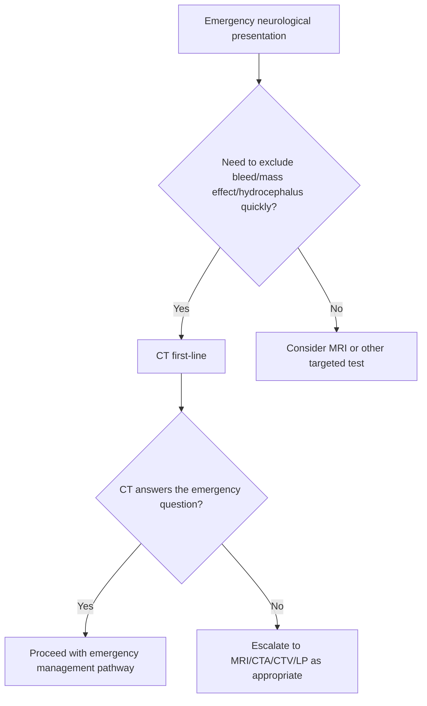
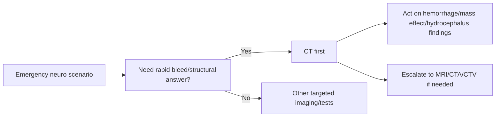

# When CT is first-line in emergency neurology

Related: [[../Neurology MOC|Neurology MOC]] · [[../Neuroimaging|Neuroimaging]] · [[CT-based imaging]] · [[Non-contrast CT head basics]] · [[Blood, mass effect, hydrocephalus, and midline shift pattern recognition]]

> [!important]
> CT is first-line in emergency neurology when the immediate question is **bleed, mass effect, hydrocephalus, major structural emergency, or whether LP/thrombolysis/urgent escalation is safe**. It is fast, widely available, and ideal for unstable patients.

> [!tip]
> A strong FCPS/MRCP answer does not merely say “do CT first.” It explains **which scenarios need CT first, why CT is chosen over MRI initially, and what CT can miss**.

## Learning Objectives
- Identify emergency neurological scenarios where CT is the first imaging test.
- Explain why non-contrast CT is ideal in acute time-critical settings.
- Recognize CT’s strengths and limitations.
- Integrate CT timing into seizure, meningitis, raised ICP, and hemorrhagic presentations.

## Definition
This topic addresses **the clinical decision of choosing CT as the initial imaging modality in emergency neurology**, usually **non-contrast CT head**, sometimes followed by vascular or contrast-based CT studies depending on the syndrome.

## Relevant Neuroanatomy
Structures relevant to emergency CT interpretation include:
- skull and scalp
- extra-axial spaces
- brain parenchyma
- ventricles
- basal cisterns
- falx/midline structures
- posterior fossa structures

## Relevant Neurophysiology
Why CT is useful first:
- acute blood is hyperdense and readily seen
- mass effect and ventricular enlargement are rapidly detectable
- scan time is short, so unstable patients can be imaged quickly
- no contrast is needed for many first-line emergency questions

## Normal Values / Important Cut-offs
This is a scenario-based topic rather than a numerical cut-off topic, but key triggers for CT-first thinking include:
- sudden severe headache with concern for hemorrhage
- persistent focal deficit or altered consciousness
- seizure with trauma, focal deficit, or prolonged altered sensorium
- suspected raised ICP before LP in selected patients

## Classification
### Core emergency scenarios where CT is first-line
1. suspected intracranial hemorrhage
2. acute neurological deterioration / reduced consciousness
3. head injury with intracranial complication concern
4. suspected raised ICP, mass effect, or hydrocephalus
5. acute seizure with red flags
6. meningitis work-up when imaging is needed before LP

### CT variants after initial non-contrast scan
- CTA for vascular occlusion/aneurysm evaluation in selected emergency pathways
- CT venography when venous sinus thrombosis is suspected

## Etiology / Common Clinical Triggers
- thunderclap headache
- acute hemiparesis or focal deficit
- coma / GCS drop
- seizure plus head injury
- new focal deficit in cancer or immunocompromised state
- severe headache with papilledema or herniation concern
- meningitis with focal signs or low GCS before LP

## Risk Factors / Why CT May Be Chosen Over MRI Initially
- patient unstable or uncooperative
- need for rapid bleed exclusion
- emergency department availability
- incompatibility or delay for MRI access
- urgent thrombolysis/thrombectomy pathways need fast initial exclusion of hemorrhage

## Pathophysiology / Imaging Correlation
- Acute blood appears hyperdense because of clot/protein content.
- Mass lesions displace normal structures and may cause midline shift.
- Hydrocephalus enlarges ventricles when CSF flow/absorption is impaired.
- Severe edema reduces grey-white differentiation and compresses sulci/cisterns.

## Clinical Features That Trigger CT-First Decision
### Hemorrhage concern
- thunderclap headache
- reduced consciousness
- vomiting, neck stiffness, severe sudden headache
- acute severe hypertension with focal neurology

### Structural emergency concern
- focal deficit
- seizure with prolonged unconsciousness
- papilledema
- head trauma
- known malignancy/immunosuppression with acute neuro symptoms

### Pre-LP decision-making
- focal neurological deficit
- reduced GCS
- papilledema
- concern for mass lesion or hydrocephalus

## Approach / Algorithm

## Investigations
### CT is first-line in these common scenarios
#### 1. Suspected intracranial hemorrhage
- sudden severe headache
- coma
- acute focal signs

#### 2. Acute neurological deterioration
- unexplained low GCS
- worsening headache with vomiting
- suspected herniation/mass effect

#### 3. Seizure with red flags
- first seizure with persistent deficit
- seizure after trauma
- immunocompromised patient
- persistent reduced consciousness

#### 4. Meningitis before LP when unsafe features are present
- focal signs
- papilledema suspicion
- reduced consciousness

#### 5. Hydrocephalus / raised ICP concern
- headache + vomiting + reduced consciousness
- ventriculoperitoneal shunt concern in relevant patients

## Interpretation Frameworks
### When CT is better than waiting for MRI
| Situation | Why CT first? |
|---|---|
| Possible hemorrhage | Blood is detected rapidly |
| Unstable patient | Fast and accessible |
| Need to exclude mass effect before LP | Quick structural safety check |
| Acute neurological collapse | Immediate triage value |
| Head injury | Fast assessment of bleed/fracture |

### When CT may need follow-up imaging
| CT result | Next step if suspicion persists |
|---|---|
| Normal but stroke suspected | MRI/vascular imaging depending pathway |
| Normal but encephalitis suspected | MRI ± LP |
| Normal but venous thrombosis suspected | CTV/MRV |
| Normal but posterior fossa lesion suspected | MRI |

## Diagnosis
CT is used first not because it answers every diagnosis, but because it rapidly answers the first emergency question:
- **Is there a bleed?**
- **Is there dangerous mass effect or hydrocephalus?**
- **Is immediate LP or specific emergency treatment safe/appropriate?**

## Differential Diagnosis
CT-first decisions commonly arise while differentiating:
- hemorrhage vs ischemia
- structural lesion vs metabolic encephalopathy
- hydrocephalus vs atrophy
- CNS infection needing LP vs mass lesion making LP unsafe

## Tables / Comparison Charts
| Scenario | First test | Why |
|---|---|---|
| Thunderclap headache | CT head | exclude SAH/ICH quickly |
| First seizure with persistent deficit | CT head in acute setting | structural emergency exclusion |
| Suspected meningitis with focal signs | CT before LP if indicated | assess mass effect/herniation risk |
| Stable focal epilepsy work-up | MRI often preferred after acute phase | better lesion sensitivity |
| Acute reduced GCS | CT head | rapid structural triage |

## Management
### If CT is positive for emergency pathology
- hemorrhage → stroke/neurosurgical pathway
- hydrocephalus → urgent neurosurgical/neurology escalation
- mass effect → raised ICP precautions and urgent specialist review

### If CT is negative but concern remains
- continue syndrome-based evaluation
- MRI, CTA, CTV, LP, EEG, or metabolic work-up as appropriate
- do not falsely reassure yourself with a normal CT in clinically serious disease

## Drug Interactions / Contraindications / Comorbidity Cautions
- CT itself is relatively simple in non-contrast mode, but do not let a normal CT delay urgent treatment of meningitis, status epilepticus, or evolving stroke when clinical suspicion remains high.
- Anticoagulated patients with acute neuro symptoms especially merit CT-first hemorrhage exclusion.

## Procedures / Indications / Contraindications
### CT first-line procedure principle
- choose **non-contrast CT head** when hemorrhage or structural emergency is the initial question
- add CTA/CTV if the vascular question comes next and protocol supports it

## Procedure Mini-Sections
### CT before LP
- **Indication:** selected meningitic or encephalopathic patients with red flags
- **Pearl:** CT is not needed before every LP; it is needed when a mass effect/raised ICP concern exists

### CT in seizure
- **Indication:** first seizure with red flags, trauma, focal deficit, prolonged altered sensorium, immunocompromised patient
- **Pearl:** CT is for the emergency structural question, not routine chronic epilepsy fine-detail analysis

## Complications / Pitfalls
- false reassurance from normal CT in early ischemia or encephalitis
- overusing CT in non-emergency stable situations where MRI would be more informative later
- underusing CT in unstable patients because of delay waiting for MRI

## Red Flags / Emergencies
- thunderclap headache
- sudden focal neurological deficit
- reduced consciousness
- repeated vomiting with headache and papilledema concern
- seizure plus trauma or persistent deficit
- meningitis plus focal signs or low GCS

## Prognosis
Using CT first in the right emergency scenario improves outcome by accelerating correct triage and avoiding dangerous delays in bleed, hydrocephalus, or mass effect recognition.

## Topic Correlation
- [[Non-contrast CT head basics]]
- [[Blood, mass effect, hydrocephalus, and midline shift pattern recognition]]
- [[Meningitis/Lumbar puncture indications and contraindications|Lumbar puncture indications and contraindications]]
- [[Epilepsy/History, witness account, labs, ECG, neuroimaging, and EEG|History, witness account, labs, ECG, neuroimaging, and EEG]]

## Special Situations
- **Posterior fossa suspicion:** CT may miss subtle lesions; MRI may still be needed.
- **Stroke pathway:** CT first often excludes hemorrhage rapidly.
- **Cancer/immunocompromise:** CT may reveal mass lesion, bleed, edema, or hydrocephalus quickly.
- **LP planning:** CT is selected when clinical safety is uncertain, not automatically for everyone.

## FCPS/MRCP High-Yield Points
- CT is first-line when the emergency question is **bleed / mass effect / hydrocephalus / structural safety**.
- CT is fast and practical in unstable patients.
- A normal CT does not exclude all serious neurology.
- MRI often follows later if structural detail is still needed.

## Common Viva Questions
- When is CT preferred over MRI in emergency neurology?
- Why is CT done before LP in some meningitis cases?
- When is CT the first scan after a seizure?
- What can CT miss despite being normal?
- When would you add CTA/CTV?

## Common Confusions / Exam Traps
- ordering CT before every LP automatically
- saying normal CT excludes stroke/encephalitis
- waiting for MRI in an unstable patient when CT should come first
- forgetting CT’s role in seizure with trauma/focal deficit

## Mnemonics
- **CT FIRST**
  - **F**ast
  - **I**ntracranial bleed question
  - **R**aised ICP / mass effect
  - **S**tructural emergency
  - **T**riage before further tests

## Mind Map
- CT first-line
  - bleed
  - mass effect
  - hydrocephalus
  - reduced GCS
  - seizure red flags
  - meningitis before LP if unsafe features
  - limitations
    - early ischemia
    - subtle posterior fossa lesion
    - encephalitis details

## Flowchart

## Suggested Visuals / Image Notes
- CT-first decision tree
- emergency neuro scenarios comparison table
- normal CT but clinically serious disease warning box

## Suggested Video References
- Look for: “when to do CT first in emergency neurology”
- Look for: “CT before LP meningitis explained”
- Look for: “acute seizure and CT head indications MRCP”

## One-Page Revision Summary
- CT is first-line in emergency neurology when the key question is **bleed, mass effect, hydrocephalus, or urgent structural safety**.
- Common scenarios: thunderclap headache, reduced GCS, first seizure with red flags, focal deficit, meningitis with unsafe LP features.
- CT is fast and accessible.
- MRI may still be needed later for subtle ischemia, encephalitis, demyelination, or posterior fossa disease.
- Do not overuse CT in stable non-emergency cases, but do not delay it in unstable emergencies.

## 24-Hour Recall Prompts
- List 5 scenarios where CT is first-line.
- Why is CT preferred over MRI in unstable emergency patients?
- When is CT needed before LP?
- What serious diseases can still be present despite a normal CT?
- What is the purpose of CT in acute seizure assessment?

## 7-Day / 15-Day / 30-Day Revision Tracker
- **Day 1:** Reproduce CT-first scenarios from memory.
- **Day 7:** Compare CT-first vs MRI-first cases.
- **Day 15:** Write the indications for CT before LP.
- **Day 30:** Solve 10 emergency neuro imaging SBAs without notes.

## Must Know / Should Know / Nice to Know
### Must Know
- bleed / mass effect / hydrocephalus scenarios
- unstable patient advantage
- CT before LP in selected cases
- CT limitations

### Should Know
- seizure-specific CT triggers
- CTA/CTV follow-up logic
- posterior fossa limitation

### Nice to Know
- advanced stroke/perfusion pathway nuances beyond this note

## My Weak Points
- Do I order CT automatically in stable cases when MRI might be better later?
- Do I forget CT before unsafe LP situations?
- Do I overtrust a normal CT?

## Self-Test Scorecard
- Scenario recognition: __/10
- CT vs MRI reasoning: __/10
- LP safety integration: __/10
- Limitation recall: __/10
- Viva confidence: __/10

## Exam Answer Modes
- **Long answer:** when CT is first-line in emergency neurology.
- **Short note:** role of CT in acute neurological emergencies.
- **Viva:** “When would you choose CT before MRI?”

## Summary
CT is first-line in emergency neurology when rapid identification of **hemorrhage, mass effect, hydrocephalus, or major structural danger** is required. It is fast, accessible, and crucial in unstable patients, but a normal CT does not exclude all serious neurological disease.

## MCQs (10)
1. CT is first-line in emergency neurology mainly because it is:
   - A. Fast and good for major structural emergencies
   - B. Better than MRI for all subtle lesions
   - C. Always contrast based
   - D. Used only in chronic neuropathy
   - E. A replacement for examination

2. Which scenario classically requires CT first?
   - A. Thunderclap headache
   - B. Stable chronic mild tremor only
   - C. Long-standing mild tension headache alone
   - D. Presbyopia
   - E. Dry skin

3. In meningitis, CT may be needed before LP if there is:
   - A. Concern for mass effect/raised ICP
   - B. Normal appetite
   - C. Myopia
   - D. Hair loss
   - E. Eczema

4. Which statement about CT is correct?
   - A. Normal CT excludes all stroke
   - B. CT is especially good for detecting acute hemorrhage
   - C. CT has no role in seizure emergencies
   - D. CT is always better than MRI for encephalitis
   - E. CT can never show hydrocephalus

5. Which patient most clearly needs CT first after a seizure?
   - A. First seizure with persistent focal deficit
   - B. Stable migraine without neuro deficit
   - C. Chronic peripheral neuropathy only
   - D. Simple presbyopia
   - E. Tendon pain

6. CT is often preferred over MRI initially in unstable patients because:
   - A. It is faster and more available in emergencies
   - B. MRI is never useful
   - C. CT diagnoses epilepsy syndromes directly
   - D. CT measures serum glucose
   - E. CT replaces ECG

7. Which is a limitation of CT?
   - A. It may miss subtle early ischemia or posterior fossa pathology
   - B. It never detects blood
   - C. It cannot show ventricles
   - D. It is always unsafe
   - E. It cannot image the head

8. Which acute scenario strongly supports CT-first imaging?
   - A. Reduced consciousness with possible bleed
   - B. Stable chronic insomnia
   - C. Long-term tinnitus only
   - D. Chronic backache
   - E. Mild knee pain

9. The main purpose of CT before LP in selected patients is to:
   - A. Assess for unsafe mass effect/raised ICP risk
   - B. Replace CSF testing forever
   - C. Diagnose all infections directly
   - D. Avoid all treatment
   - E. Measure blood pressure

10. Which statement best summarizes CT first-line use?
   - A. CT is used when a rapid structural answer is required in emergency neurology
   - B. CT should be ordered before every neurological test
   - C. CT always replaces MRI permanently
   - D. CT is unnecessary in acute neurology
   - E. CT is only for ENT disease

## SBA Questions (10)
1. A 58-year-old man presents with sudden severe headache, vomiting, and drowsiness. What is the best first imaging test?
   - A. CT head
   - B. Nerve conduction study
   - C. MRI shoulder
   - D. Audiogram
   - E. Colonoscopy

2. A meningitic patient has focal weakness and reduced GCS. What is the best imaging principle before LP?
   - A. CT first may be needed to assess structural safety
   - B. LP must always be done before any imaging
   - C. Imaging is irrelevant
   - D. Only EEG is needed
   - E. No treatment should start

3. A first-seizure patient remains confused and has a unilateral extensor plantar response. Why is CT appropriate first in the acute setting?
   - A. To exclude hemorrhage or major structural lesion quickly
   - B. To diagnose Ménière disease
   - C. To classify sleep disorders
   - D. To replace history-taking
   - E. To confirm tension headache

4. A patient with normal CT still has strong suspicion of early ischemic stroke. What is the best interpretation?
   - A. Stroke is excluded
   - B. CT can be normal early; further stroke pathway assessment is needed
   - C. The patient only has anxiety
   - D. Imaging should stop forever
   - E. LP is always next

5. Which feature makes CT especially attractive in emergency neurological collapse?
   - A. Speed
   - B. It always provides microscopic diagnosis
   - C. It diagnoses all epilepsy syndromes
   - D. It measures CSF glucose directly
   - E. It replaces examination

6. Which patient best illustrates CT-first hydrocephalus assessment?
   - A. Progressive headache, vomiting, reduced consciousness, enlarged ventricles suspected
   - B. Stable essential tremor only
   - C. Mild seasonal allergy
   - D. Chronic constipation
   - E. Old scar only

7. A patient with cancer and new focal deficit deteriorates rapidly. Why is CT first-line?
   - A. To rapidly identify hemorrhage, edema, mass effect, or hydrocephalus
   - B. To diagnose peripheral neuropathy
   - C. To evaluate hearing only
   - D. To replace MRI permanently in all future care
   - E. To avoid specialist referral

8. Which is a common exam trap regarding CT?
   - A. Assuming a normal CT excludes all serious neurology
   - B. Recognizing its role in hemorrhage
   - C. Using it in unstable patients
   - D. Thinking about LP safety
   - E. Identifying hydrocephalus

9. A patient with possible venous sinus thrombosis has persistent severe headache and papilledema but non-diagnostic NCCT. What is the next principle?
   - A. Consider further vascular imaging such as CTV/MRV
   - B. Conclude no disease exists
   - C. Ignore papilledema
   - D. Treat as simple BPPV
   - E. Cancel all imaging

10. What is the best summary sentence?
   - A. CT is first-line when the emergency question is bleed, mass effect, hydrocephalus, or urgent structural safety
   - B. CT must be done before every outpatient neurology consultation
   - C. MRI is never useful after CT
   - D. CT has no role in meningitis-related decisions
   - E. CT only matters in dermatology

## Flashcards
- Q: When is CT first-line in emergency neurology?
  A: When a rapid answer is needed for bleed, mass effect, hydrocephalus, or major structural emergency.
- Q: Why is CT preferred in unstable patients?
  A: It is fast and widely available.
- Q: Give one classic headache scenario needing CT first.
  A: Thunderclap headache.
- Q: Why might CT be done before LP?
  A: To assess for unsafe mass effect/raised ICP in selected patients.
- Q: Does a normal CT exclude early ischemic stroke?
  A: No.
- Q: Name one seizure scenario where CT is first-line.
  A: First seizure with persistent focal deficit or trauma.
- Q: What major structural issue can CT rapidly show besides bleeding?
  A: Hydrocephalus or midline shift/mass effect.
- Q: Which imaging may follow CT when suspicion remains high?
  A: MRI or CTA/CTV depending the case.
- Q: Why is CT valuable in anticoagulated patients with acute neuro symptoms?
  A: To quickly exclude intracranial hemorrhage.
- Q: What is a common pitfall after a normal CT?
  A: False reassurance despite ongoing serious clinical concern.

## Answer Key with Explanations
### MCQs
1. **A** — speed and structural emergency detection are the key reasons.
2. **A** — thunderclap headache is a classic CT-first scenario.
3. **A** — raised ICP/mass effect concern is the core reason.
4. **B** — CT is excellent for acute hemorrhage.
5. **A** — red-flag first seizure warrants acute structural exclusion.
6. **A** — speed and access are major emergency advantages.
7. **A** — CT can miss subtle early ischemic or posterior fossa disease.
8. **A** — this is a classic emergency CT-first situation.
9. **A** — CT before LP in selected cases is about safety.
10. **A** — this is the best summary.

### SBAs
1. **A** — CT is the correct first emergency imaging test.
2. **A** — imaging first may be necessary before LP in this high-risk setting.
3. **A** — CT rapidly answers the structural emergency question.
4. **B** — early ischemia can be CT-negative; do not be falsely reassured.
5. **A** — speed is the main emergency advantage.
6. **A** — that symptom cluster is classic for urgent hydrocephalus/raised ICP evaluation.
7. **A** — CT rapidly evaluates bleed, edema, and mass effect.
8. **A** — normal CT does not equal normal neurology.
9. **A** — vascular imaging should follow if suspicion remains.
10. **A** — that captures the role of CT first-line use accurately.