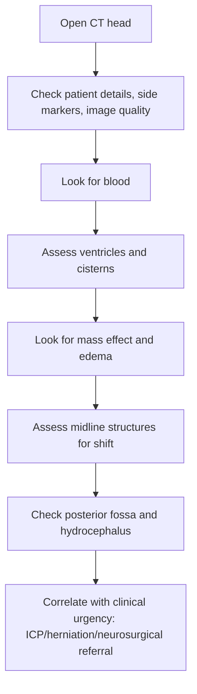

# Blood, mass effect, hydrocephalus, and midline shift pattern recognition

---
tags: [medicine, neurology, davidson, neuroimaging, ct, raised-intracranial-pressure, hydrocephalus, mass-effect, midline-shift, fcps, mrcp]
chapter: Neurology
davidson_part: Part 3: Clinical Medicine
davidson_chapter: Chapter 28: Neurology
heading: Neuroimaging
topic_group: CT-based imaging
topic: Blood, mass effect, hydrocephalus, and midline shift pattern recognition
exam: [FCPS, MRCP]
status: full-fcps-mrcp-note
references:
  anatomy: ["Gray's Anatomy", Davidson]
  physiology: ["Guyton & Hall", Ganong, Davidson]
  clinical: [Davidson, PasTest]
related:
  - "[[../Neurology MOC|Neurology MOC]]"
  - "[[../Neuroimaging|Neuroimaging]]"
  - "[[CT-based imaging]]"
  - "[[Non-contrast CT head basics]]"
  - "[[When CT is first-line in emergency neurology]]"
  - "[[MRI brain sequences basics]]"
---

# Blood, mass effect, hydrocephalus, and midline shift pattern recognition

Related: [[../Neurology MOC|Neurology MOC]] · [[../Neuroimaging|Neuroimaging]] · [[CT-based imaging]] · [[Non-contrast CT head basics]] · [[When CT is first-line in emergency neurology]] · [[MRI brain sequences basics]]

> [!important]
> A non-contrast CT head in emergency neurology must be read systematically for **blood, mass effect, hydrocephalus, and midline shift** before finer subtleties. Missing these can cost the patient their airway, brainstem function, or life.

> [!tip]
> In FCPS/MRCP, a safe CT answer sounds like: **“I first confirm image quality and side markers, then look for hemorrhage, ventricular size, sulcal effacement, cistern patency, mass effect, midline shift, hydrocephalus, and signs of herniation.”**

## Learning Objectives
- Recognize common CT patterns of intracranial blood.
- Define and identify **mass effect**, **hydrocephalus**, and **midline shift**.
- Link imaging abnormalities to clinical red flags and urgency.
- Avoid common CT interpretation traps in emergency neurology.
- Communicate CT findings in structured exam language.

## Definition
This note is a **CT pattern-recognition framework** focused on four emergency domains:
1. **Blood** — extra-axial or intra-axial acute hemorrhage patterns
2. **Mass effect** — distortion/compression of normal intracranial structures by lesion or edema
3. **Hydrocephalus** — abnormal ventricular enlargement due to CSF circulation failure or reduced absorption
4. **Midline shift** — displacement of central intracranial structures across the midline due to mass effect

## Relevant Neuroanatomy
### Key spaces and structures to inspect on CT
- skull vault and fracture clues
- scalp soft tissues
- extra-axial spaces: epidural, subdural, subarachnoid
- brain parenchyma
- ventricles: lateral, third, fourth
- basal cisterns
- falx and septum pellucidum
- posterior fossa and brainstem surroundings

### Why anatomy matters
- blood pattern depends on where bleeding occurs
- hydrocephalus pattern depends on obstruction site or communicating failure
- midline shift reflects pressure asymmetry across the falx
- posterior fossa lesions are dangerous because small volume can compress the brainstem and fourth ventricle

## Relevant Neurophysiology
- Intracranial volume is constrained by the skull.
- Brain, blood, and CSF must coexist within fixed space.
- A new mass lesion, edema, or hemorrhage raises intracranial pressure unless compensated.
- Rising pressure causes ventricular compression or obstruction, reduced perfusion, and herniation risk.

## Normal Values / Important Cut-offs
CT interpretation is mainly pattern-based, but practical high-yield points include:
- acute blood is usually **hyperdense** on non-contrast CT
- effaced sulci and cisterns suggest raised intracranial pressure/mass effect
- ventricular enlargement out of proportion to sulcal size suggests hydrocephalus
- any definite **midline shift** is concerning and should be reported, especially with reduced consciousness or focal deficit
- posterior fossa hydrocephalus/ventricular obstruction is especially urgent

## Classification
### Blood patterns
1. epidural hemorrhage
2. subdural hemorrhage
3. subarachnoid hemorrhage
4. intraparenchymal/intracerebral hemorrhage
5. intraventricular hemorrhage

### Hydrocephalus patterns
1. obstructive (non-communicating)
2. communicating
3. acute vs chronic

### Mass effect severity concepts
1. local edema only
2. sulcal effacement
3. ventricular compression
4. cisternal effacement
5. herniation risk / midline shift

## Etiology / Causes
### Blood
- trauma
- hypertension-related hemorrhage
- aneurysmal or non-aneurysmal SAH
- tumour bleed
- anticoagulation-related bleed
- hemorrhagic transformation of infarct

### Mass effect
- hemorrhage
- tumour
- abscess
- edema from encephalitis or large infarction
- traumatic contusion

### Hydrocephalus
- obstructive mass at foramina, aqueduct, or fourth ventricle
- posterior fossa lesion
- intraventricular blood
- meningitic blockage / impaired absorption

### Midline shift
- large hematoma
- major edema
- tumour with edema
- abscess

## Risk Factors
- anticoagulant/antiplatelet use
- trauma
- uncontrolled hypertension
- malignancy
- aneurysm risk states
- infection/immunosuppression
- known shunt or hydrocephalus history

## Pathophysiology
### Blood
Acute hemorrhage occupies space, injures tissue, may block CSF pathways, and drives edema.

### Mass effect
A lesion or edema compresses neighboring tissue, distorts ventricles and cisterns, and may displace midline structures.

### Hydrocephalus
CSF accumulation enlarges ventricles and raises pressure, especially if acute.

### Midline shift
Pressure difference displaces septum pellucidum and deeper structures, reflecting substantial intracranial asymmetry and herniation risk.

## Clinical Features
### Clues that correlate with CT emergency findings
- reduced consciousness
- severe headache/vomiting
- new focal neurological deficit
- unequal pupils
- seizures
- papilloedema when time course allows
- bradycardia/hypertension/irregular respirations in severe raised ICP

### Specific associations
- thunderclap headache → think SAH
- trauma + declining consciousness → think extra-axial bleed or contusion with mass effect
- headache + gait/cognition + ventriculomegaly → hydrocephalus possibility
- posterior fossa symptoms + vomiting/ataxia → urgent look for fourth ventricle obstruction or cerebellar mass effect

## Approach / Algorithm

### Safe CT reading sequence
1. confirm correct scan and orientation
2. inspect bone/scalp quickly for trauma clues
3. search for **hyperdense blood**
4. compare both hemispheres for symmetry
5. inspect ventricles: enlarged, compressed, asymmetric?
6. inspect sulci and basal cisterns: preserved or effaced?
7. inspect falx/septum for midline shift
8. inspect posterior fossa carefully
9. state whether urgent neurosurgical/neurocritical review is needed

## Investigations
### Imaging tools
- **Non-contrast CT head** first in acute emergency neurology
- CT angiography if vascular etiology needs further definition and patient/pathway allow
- MRI later for better tissue characterization if stable

### Additional workup depends on CT pattern
- coagulation profile for hemorrhage
- CBC, platelets, renal function
- infection workup if abscess/meningitis suspected
- contrast or vascular imaging later when appropriate

## Interpretation Frameworks

## Interpretation Framework 1: Blood pattern recognition
| Pattern | CT appearance | Classic clue |
|---|---|---|
| Epidural | Biconvex/lentiform extra-axial hyperdensity | Often traumatic, may not cross sutures |
| Subdural | Crescentic extra-axial collection | Can track widely along hemisphere |
| SAH | Hyperdensity in sulci/cisterns | Thunderclap headache context |
| Intraparenchymal bleed | Hyperdense focus within brain tissue | Edema/mass effect may surround |
| Intraventricular blood | Hyperdensity layering in ventricles | May cause acute hydrocephalus |

## Interpretation Framework 2: Mass effect checklist
| Sign | Meaning |
|---|---|
| Sulcal effacement | local/global edema or pressure |
| Ventricular compression | neighboring lesion pressure |
| Basal cistern effacement | raised ICP/herniation risk |
| Distorted brain contour | significant space-occupying process |
| Midline shift | substantial asymmetric mass effect |

## Interpretation Framework 3: Hydrocephalus checklist
| Finding | Interpretation |
|---|---|
| Enlarged lateral/third ventricles | hydrocephalus possible |
| Temporal horn enlargement | early obstructive hydrocephalus clue |
| Periventricular low density | transependymal CSF seepage/raised pressure clue |
| Enlarged ventricles with compressed sulci | acute pressure hydrocephalus more likely |
| Fourth ventricle compression | posterior fossa obstruction concern |

## Interpretation Framework 4: Midline shift communication
When describing shift, report:
- **direction** of shift
- **associated cause** if visible
- whether there is **ventricular compression**
- whether **cisterns are effaced**
- whether signs suggest **herniation risk**

## Diagnosis
This note supports an **imaging diagnosis/reporting approach**, not a single disease. Example statements:
- “Acute hyperdense left subdural collection with mass effect and rightward midline shift.”
- “Acute hydrocephalus with ventricular enlargement and periventricular low attenuation, likely obstructive.”
- “Large right hemispheric intraparenchymal hemorrhage with surrounding edema, ventricular compression, and subfalcine shift.”

## Differential Diagnosis
### Hyperdensity mimics
- calcification
- beam-hardening artifact
- contrast if previously given

### Ventricular enlargement differentials
- hydrocephalus
- ex vacuo ventriculomegaly from cerebral atrophy

### Mass effect mimics/caveats
- asymmetric chronic atrophy can mimic asymmetry but usually without cisternal compression or acute edema pattern
- posterior fossa artifact can obscure subtle pathology

## Tables / Comparison Charts

## Extradural vs Subdural Quick Table
| Feature | Epidural | Subdural |
|---|---|---|
| Shape | Lens/biconvex | Crescent |
| Location | Between skull and dura | Between dura and arachnoid |
| Trauma link | Common | Common |
| Spread | Often limited by sutures | Can spread more widely |
| Mass effect | May be marked | May be marked |

## Hydrocephalus vs Atrophy Table
| Feature | Hydrocephalus | Cerebral atrophy |
|---|---|---|
| Ventricles | Enlarged | Enlarged |
| Sulci | Often effaced in acute hydrocephalus | Also enlarged/prominent |
| Clinical urgency | Can be urgent | Usually chronic/non-emergency pattern |
| Periventricular seepage | May be present | Usually absent |

## Red-Flag CT Table
| CT sign | Why dangerous |
|---|---|
| Basal cistern effacement | herniation risk |
| Midline shift | significant mass effect |
| Acute hydrocephalus | rapid ICP rise |
| Intraventricular blood | may obstruct CSF flow |
| Posterior fossa compression | brainstem risk |

## Management
### Immediate management principles
CT findings must be integrated with clinical status.

#### If blood present
- reverse anticoagulation where relevant
- urgent neurosurgical/neurocritical discussion when large bleed, mass effect, IVH, or deterioration present
- blood pressure and airway management according to syndrome

#### If marked mass effect or cisternal effacement
- urgent escalation for raised ICP management and specialist review
- avoid delay in transfer if neurosurgical care needed

#### If hydrocephalus present
- assess consciousness and pupils urgently
- identify obstructive cause
- discuss CSF diversion/neurosurgical options when needed

#### If midline shift present
- treat as a major warning sign, especially with reduced GCS or focal decline

## Drug Interactions / Contraindications / Comorbidity Cautions
- Anticoagulation/antiplatelet therapy can worsen hemorrhage severity and influence reversal urgency.
- LP is contraindicated or risky in patients with mass effect/hydrocephalus/herniation concern.
- Sedation may hide neurological deterioration; serial examination matters when safe.
- Renal dysfunction matters if later contrast imaging is considered.

## Procedures / Indications / Contraindications
### Lumbar puncture
**Contraindicated/caution** if CT shows mass effect, midline shift, obstructive hydrocephalus, or other raised ICP/herniation concern.

### Neurosurgical referral
**Indicated** for significant hemorrhage, hydrocephalus, posterior fossa compression, or major shift.

## Procedure Mini-Sections
### CT communication handover
- **Indication:** urgent transfer/referral
- **State clearly:** bleed type, side, mass effect, hydrocephalus, midline shift, cistern status, posterior fossa involvement
- **Pearl:** handover should communicate urgency, not just radiologic labels

### Serial CT consideration
- **Indication:** evolving neurological decline or monitoring of known acute bleed/edema
- **Pitfall:** a “small” bleed can become clinically important if edema or hydrocephalus evolves

## Complications
- herniation
- obstructive hydrocephalus
- brainstem compression
- seizure
- secondary ischemia from high ICP and reduced perfusion
- death if emergency findings are missed

## Red Flags / Emergencies
- acute intracranial hemorrhage with mass effect
- ventricular enlargement with reduced consciousness
- compressed basal cisterns
- posterior fossa lesion with fourth ventricle compression
- definite midline shift with clinical deterioration
- intraventricular hemorrhage with hydrocephalus

## Prognosis
Prognosis depends on:
- lesion type and volume
- rate of deterioration
- hydrocephalus/herniation development
- speed of recognition and intervention

## Topic Correlation
- [[Non-contrast CT head basics]]
- [[When CT is first-line in emergency neurology]]
- [[Linking imaging to localization]]
- [[Raised intracranial pressure and mass lesion clues]]
- [[Meningitis and encephalitis clues]]

## Special Situations
### Anticoagulated patient
Even modest hemorrhage can worsen quickly; reversal strategy matters.

### Posterior fossa lesion
Very dangerous because limited space means early brainstem/fourth ventricle compromise.

### Meningitis/encephalitis pathway
Hydrocephalus or mass effect may alter LP safety and urgency of ICU care.

### Elderly with atrophy
Ventricular enlargement may be chronic; correlate with sulci and acute symptoms to avoid overcalling hydrocephalus.

## FCPS/MRCP High-Yield Points
- Acute blood is usually hyperdense on non-contrast CT.
- Always inspect ventricles and basal cisterns.
- Midline shift is a severity marker, not just a descriptive curiosity.
- Hydrocephalus can result from intraventricular blood or posterior fossa obstruction.
- CT emergency reading should prioritize life-threatening patterns before subtle ischemic signs.

## Common Viva Questions
- How do you recognize subdural vs epidural hemorrhage?
- What CT signs suggest raised intracranial pressure?
- How do you identify hydrocephalus on CT?
- Why is posterior fossa pathology dangerous?
- What is the significance of midline shift?

## Common Confusions / Exam Traps
- focusing on small subtle findings before checking for obvious life-threatening blood
- confusing hydrocephalus with atrophy
- ignoring posterior fossa because of artifact
- forgetting that IVH can cause acute hydrocephalus
- performing/approving LP despite dangerous mass effect signs

## Mnemonics
### CT emergency sweep
**“BVMH-C”**
- **B**lood
- **V**entricles
- **M**ass effect
- **H**ydrocephalus
- **C**isterns/midline

## Mind Map
- CT emergency reading
  - blood
    - epidural
    - subdural
    - SAH
    - intraparenchymal
    - intraventricular
  - mass effect
    - sulcal effacement
    - ventricular compression
    - cistern effacement
  - hydrocephalus
    - obstructive
    - communicating
  - midline shift
    - severity marker
    - herniation risk

## Suggested Visuals / Image Notes
- Annotated CT examples of subdural, epidural, SAH, IVH
- Diagram showing how a mass shifts the septum pellucidum
- Comparison image of hydrocephalus vs cerebral atrophy

## Suggested Video References
- CT head interpretation basics and emergency review videos
- Neurocritical care teaching on raised ICP imaging signs
- Posterior fossa and hydrocephalus CT tutorials

## One-Page Revision Summary
### CT emergency checklist
1. correct scan/orientation
2. look for **blood**
3. inspect **ventricles**
4. inspect **sulci and cisterns**
5. look for **mass effect**
6. inspect for **midline shift**
7. check **posterior fossa**

### Dangerous findings
- acute blood
- compressed basal cisterns
- hydrocephalus
- intraventricular blood
- posterior fossa obstruction
- midline shift

### Communication line
“CT shows ____ with associated mass effect/hydrocephalus/midline shift; this is clinically urgent.”

## Recall Prompts
### 24-hour recall prompts
- Name the five main blood patterns on CT.
- What CT features suggest mass effect?
- How do hydrocephalus and atrophy differ on CT?
- Why is intraventricular blood dangerous?
- Why should LP be avoided in certain CT patterns?

### 7-day / 15-day / 30-day revision tracker
- **7 days:** redraw the CT emergency checklist.
- **15 days:** explain midline shift and hydrocephalus without notes.
- **30 days:** interpret five example emergency CT descriptions out loud.

## Must Know / Should Know / Nice to Know
### Must Know
- acute blood patterns
- cisternal and ventricular assessment
- hydrocephalus warning signs
- midline shift as severity marker

### Should Know
- posterior fossa danger
- hydrocephalus vs atrophy distinction
- LP contraindication logic

### Nice to Know
- advanced vascular/contrast follow-up imaging nuances

## My Weak Points
- Do I forget to inspect the posterior fossa?
- Can I distinguish ventricular enlargement from atrophy?
- Do I report cistern status and shift clearly?

## Self-Test Scorecard
- CT pattern recognition /10
- Raised ICP recognition /10
- Hydrocephalus understanding /10
- Emergency communication /10
- Viva confidence /10

Interpretation:
- **<35/50** = weak
- **35-44/50** = acceptable
- **45+/50** = strong

## Exam Answer Modes
### Short note
Describe how to identify blood, mass effect, hydrocephalus, and midline shift on CT.

### Viva mode
Start with a safe reading sequence and mention why each finding matters clinically.

### Ward-case mode
Report CT findings in one structured sentence linked to urgency.

## Summary
Emergency CT interpretation in neurology depends on disciplined pattern recognition. Before subtle diagnosis, look for **blood, mass effect, hydrocephalus, and midline shift**. These findings guide urgency, neurosurgical escalation, and LP safety.

## MCQs (10)
1. Acute blood on non-contrast CT is usually:
   - A. Hypodense
   - B. Isodense always
   - C. Hyperdense
   - D. Invisible
   - E. Only seen on MRI

2. Which finding most strongly suggests raised intracranial pressure/mass effect?
   - A. Prominent cortical sulci only
   - B. Basal cistern effacement
   - C. Normal ventricles
   - D. Symmetric brain structures
   - E. Mild chronic atrophy

3. Midline shift indicates:
   - A. Benign chronic change only
   - B. Asymmetric intracranial pressure/mass effect
   - C. Peripheral neuropathy
   - D. Vestibular disorder
   - E. Normal CT variant

4. Which blood location is particularly associated with acute obstructive hydrocephalus?
   - A. Intraventricular hemorrhage
   - B. Scalp hematoma
   - C. Epidural bleed only never elsewhere
   - D. Small cortical calcification
   - E. Sinusitis

5. Which pair best suggests hydrocephalus rather than simple atrophy?
   - A. Enlarged ventricles with enlarged sulci
   - B. Enlarged ventricles with compressed sulci
   - C. Small ventricles with compressed sulci
   - D. Prominent sulci with normal ventricles
   - E. Normal ventricles with skull fracture

6. A posterior fossa lesion is dangerous because it can quickly:
   - A. Improve spontaneously always
   - B. Compress the brainstem and fourth ventricle
   - C. Cause Bell palsy only
   - D. Produce only distal neuropathy
   - E. Cause temporal arteritis

7. Which extra-axial blood pattern is crescentic?
   - A. Epidural hemorrhage
   - B. Subdural hemorrhage
   - C. Intraventricular hemorrhage
   - D. SAH only
   - E. Contusion only

8. Which CT finding should make lumbar puncture unsafe or high-risk until reconsidered?
   - A. Mass effect with midline shift
   - B. Normal ventricles
   - C. Mild chronic atrophy
   - D. Old lacune
   - E. Small scalp swelling

9. Which should be checked systematically when assessing hydrocephalus on CT?
   - A. Ventricular size and periventricular change
   - B. Toenail color
   - C. Elbow reflex only
   - D. Audiometry
   - E. Stool frequency

10. The first priority in emergency CT interpretation is to look for:
   - A. Rare incidental abnormalities only
   - B. Blood and life-threatening mass effect patterns
   - C. Chronic sinus variants
   - D. Dental fillings
   - E. Peripheral nerve lesions

## SBA Questions (10)
1. A 70-year-old anticoagulated patient presents with reduced consciousness after a fall. CT shows a crescentic hyperdense collection over one hemisphere with shift of midline structures. Most likely diagnosis:
   - A. Epidural hemorrhage
   - B. Subdural hemorrhage with mass effect
   - C. BPPV
   - D. Migraine
   - E. Bell palsy

2. A patient with thunderclap headache has hyperdensity in the basal cisterns and sylvian fissures on CT. Most likely diagnosis:
   - A. SAH
   - B. Myopathy
   - C. Peripheral neuropathy
   - D. Sinusitis only
   - E. Ménière disease

3. CT shows enlarged lateral ventricles, temporal horn enlargement, and reduced consciousness. Best interpretation:
   - A. Acute hydrocephalus
   - B. Pure muscular disorder
   - C. Chronic peripheral neuropathy
   - D. Normal variant only
   - E. Functional visual loss

4. A cerebellar hemorrhage compresses the fourth ventricle on CT. The main danger is:
   - A. Isolated wrist drop
   - B. Brainstem compromise and obstructive hydrocephalus
   - C. Tension headache only
   - D. Carpal tunnel syndrome
   - E. Chronic insomnia

5. A CT report says “effacement of basal cisterns.” This most strongly implies:
   - A. Raised ICP/herniation risk
   - B. Polyneuropathy
   - C. Benign chronic sinus disease
   - D. Ménière disease
   - E. Peripheral vertigo

6. A patient with intraventricular blood becomes drowsier over hours. What complication should be suspected?
   - A. Acute hydrocephalus
   - B. Distal myopathy
   - C. Functional attack
   - D. Pure BPPV
   - E. Restless legs syndrome

7. Which structured CT comment is best?
   - A. “Abnormal scan.”
   - B. “There is a left hemispheric hyperdense collection with ventricular compression and rightward midline shift.”
   - C. “Maybe some changes.”
   - D. “Can’t say much.”
   - E. “Looks neurological.”

8. Which factor often contributes to intracranial hemorrhage severity and management urgency?
   - A. Anticoagulant use
   - B. Mild acne
   - C. Seasonal allergies
   - D. Refractive error
   - E. Dental caries

9. Enlarged ventricles accompanied by enlarged sulci in a patient without acute decline most favors:
   - A. Atrophy rather than acute pressure hydrocephalus
   - B. Acute IVH
   - C. Herniation
   - D. Posterior fossa block
   - E. Epidural hemorrhage

10. In emergency neurology CT interpretation, which region is easy to under-check but highly dangerous when abnormal?
   - A. Posterior fossa
   - B. Toenail bed
   - C. Shoulder joint
   - D. Elbow crease
   - E. Abdomen

## Flashcards
- Q: What density is acute blood usually on non-contrast CT?
  A: Hyperdense.

- Q: What does midline shift signify?
  A: Significant asymmetric mass effect and potential herniation risk.

- Q: Name two CT signs of raised intracranial pressure.
  A: Sulcal/cisternal effacement and ventricular compression.

- Q: Which hemorrhage can cause acute hydrocephalus by blocking CSF pathways?
  A: Intraventricular hemorrhage.

- Q: Why is posterior fossa pathology especially dangerous?
  A: Because limited space allows rapid brainstem and fourth-ventricle compression.

- Q: Which CT pattern is crescent-shaped?
  A: Subdural hemorrhage.

- Q: Which CT pattern is lens-shaped or biconvex?
  A: Epidural hemorrhage.

- Q: When should LP be avoided after CT review?
  A: When there is mass effect, obstructive hydrocephalus, midline shift, or herniation risk.

- Q: What helps distinguish hydrocephalus from atrophy?
  A: Ventricular enlargement with compressed sulci and/or periventricular seepage favors hydrocephalus.

- Q: What is a safe emergency CT reading order?
  A: Blood → ventricles → mass effect → hydrocephalus/cisterns → midline → posterior fossa.

## Answer Key with Explanations
### MCQs
1. **C. Hyperdense** — acute blood is classically bright on non-contrast CT.
2. **B. Basal cistern effacement** — major raised ICP warning.
3. **B. Asymmetric intracranial pressure/mass effect** — the meaning of shift.
4. **A. Intraventricular hemorrhage** — can obstruct CSF flow.
5. **B. Enlarged ventricles with compressed sulci** — more in keeping with acute hydrocephalus.
6. **B. Compress the brainstem and fourth ventricle** — key posterior fossa danger.
7. **B. Subdural hemorrhage** — crescentic pattern.
8. **A. Mass effect with midline shift** — LP may be dangerous.
9. **A. Ventricular size and periventricular change** — central to hydrocephalus assessment.
10. **B. Blood and life-threatening mass effect patterns** — first priority.

### SBAs
1. **B. Subdural hemorrhage with mass effect** — crescentic extra-axial bleed plus shift.
2. **A. SAH** — classic cisternal/sylvian hyperdensity pattern.
3. **A. Acute hydrocephalus** — enlarged ventricles with reduced consciousness is urgent.
4. **B. Brainstem compromise and obstructive hydrocephalus** — major posterior fossa threat.
5. **A. Raised ICP/herniation risk** — why cisternal assessment matters.
6. **A. Acute hydrocephalus** — intraventricular blood can block CSF flow.
7. **B. “There is a left hemispheric hyperdense collection with ventricular compression and rightward midline shift.”** — structured and clinically useful.
8. **A. Anticoagulant use** — can worsen bleeding and change management urgency.
9. **A. Atrophy rather than acute pressure hydrocephalus** — enlarged ventricles with enlarged sulci favors ex vacuo change.
10. **A. Posterior fossa** — easy to miss, clinically critical.
