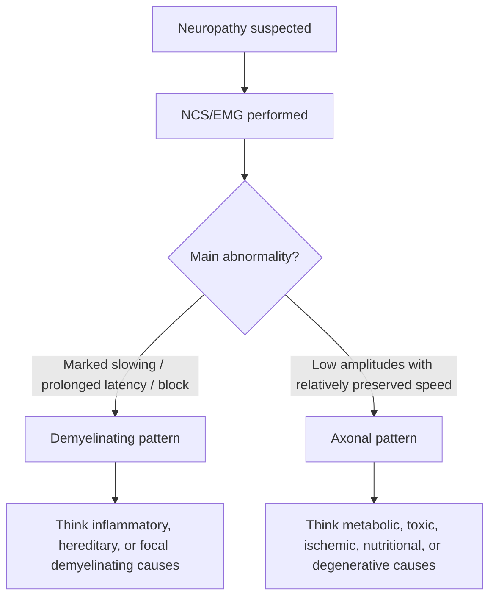
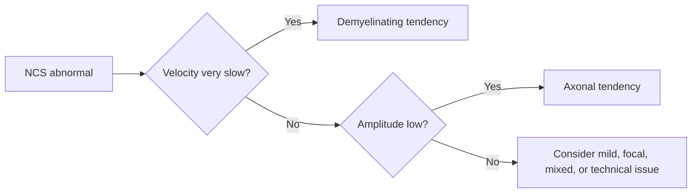

# Demyelinating vs axonal pattern basics

Related: [[../Neurology MOC|Neurology MOC]] · [[../Neurophysiological Testing|Neurophysiological Testing]] · [[Nerve conduction studies and EMG]] · [[Neuropathy vs myopathy vs NMJ distinction]] · [[../Localising Lesions in the Central Nervous System/Root vs plexus vs peripheral nerve|Root vs plexus vs peripheral nerve]]

> [!important]
> The core FCPS/MRCP neurophysiology distinction is simple: **demyelination mainly slows conduction**, whereas **axonal loss mainly reduces amplitude**.

> [!tip]
> When reading NCS reports, ask three questions first: **How fast? How big? Is there block/dispersion?** That usually separates demyelinating from axonal patterns.

## Learning Objectives
- Distinguish demyelinating from axonal peripheral nerve pathology.
- Understand the neuroanatomical and physiological basis for the NCS differences.
- Recognize common clinical contexts and typical report language.
- Interpret latency, conduction velocity, amplitude, conduction block, and temporal dispersion at a basic exam level.
- Avoid common reporting traps such as calling every severe axonal neuropathy “demyelinating.”

## Definition
This topic describes the two major neurophysiological patterns seen in peripheral neuropathies:
- **Demyelinating pattern**: pathology primarily affects myelin, so impulse transmission becomes slow or unstable.
- **Axonal pattern**: pathology primarily affects the axon, so the number of functioning nerve fibers falls and response amplitude drops.

## Relevant Neuroanatomy
### Peripheral nerve structure
- axon carries the electrical signal
- myelin insulates the axon and allows saltatory conduction
- nodes of Ranvier enable rapid impulse propagation
- Schwann cells maintain peripheral myelin

### Why this matters
- damage to **myelin** slows transmission and prolongs latency
- damage to **axons** reduces the number of fibers contributing to the recorded response

## Relevant Neurophysiology
- Conduction velocity depends heavily on intact myelin.
- Distal latency reflects how quickly the impulse reaches the recording site.
- CMAP/SNAP amplitude reflects how many functioning motor or sensory axons remain.
- Conduction block and temporal dispersion point toward disturbed saltatory conduction, classically a demyelinating feature.

## Normal Values / Important Cut-offs
Exact laboratory values vary, but these qualitative rules are high yield:
- **Demyelinating neuropathy** → slowed conduction velocity, prolonged distal latency, prolonged F-wave latency, conduction block or temporal dispersion.
- **Axonal neuropathy** → reduced CMAP/SNAP amplitudes with relatively preserved or only mildly slowed velocities.
- Severe axonal loss can produce some secondary slowing, but **marked slowing** suggests demyelination more strongly.

## Classification
### Neurophysiological pattern groups
1. primarily demyelinating
2. primarily axonal
3. mixed axonal-demyelinating
4. focal/compressive with local demyelinating features

### Clinical grouping examples
1. acute inflammatory demyelinating neuropathy
2. chronic inflammatory demyelinating neuropathy
3. diabetic or toxic axonal neuropathy
4. entrapment neuropathy with focal conduction slowing

## Causes / Etiology
### Demyelinating causes
- Guillain-Barré syndrome (demyelinating forms)
- CIDP
- hereditary demyelinating neuropathies
- focal entrapment neuropathies
- some paraproteinemic neuropathies

### Axonal causes
- diabetes mellitus
- toxins and chemotherapy
- alcoholism
- uremia
- vasculitic neuropathy
- nutritional deficiency
- critical illness neuropathy

## Risk Factors
### For demyelinating patterns
- autoimmune disease
- recent infection
- paraproteinemia
- hereditary neuropathy background

### For axonal patterns
- diabetes
- CKD
- alcohol misuse
- nutritional deficiency
- drug/toxin exposure

## Pathophysiology
### Demyelinating neuropathy
1. myelin injury impairs saltatory conduction
2. impulse travels slowly or fails across affected segments
3. latency increases, velocity falls, F-waves prolong
4. block/dispersion may appear

### Axonal neuropathy
1. axonal degeneration reduces functioning nerve fibers
2. fewer fibers contribute to the evoked response
3. amplitude falls
4. velocity may remain near-normal early or show only mild secondary slowing

## Clinical Features
### Demyelinating pattern clues
- weakness may be prominent and relatively diffuse
- reflex loss common
- sensory symptoms variable
- conduction failure may produce marked deficits out of proportion to wasting early on
- acute or subacute progressive weakness may suggest inflammatory demyelination

### Axonal pattern clues
- distal sensory symptoms common
- burning pain, numbness, paresthesia frequent
- distal wasting and foot drop in chronic cases
- common in metabolic, toxic, and length-dependent neuropathies

## Approach / Algorithm

## Investigations
### Neurophysiology focus
- distal motor latency
- conduction velocity
- CMAP amplitude
- SNAP amplitude
- F-wave latency
- conduction block
- temporal dispersion

### Complementary evaluation
- glucose/HbA1c
- renal profile
- B12 and nutritional markers
- ESR/CRP, autoimmune workup when inflammatory cause suspected
- CSF in selected inflammatory neuropathies
- paraprotein studies when appropriate

## Interpretation Frameworks
### Fast bedside neurophysiology table
| Feature | Demyelinating | Axonal |
|---|---|---|
| Conduction velocity | clearly slowed | relatively preserved or mildly slowed |
| Distal latency | prolonged | usually not the dominant abnormality |
| F-wave latency | prolonged/absent | may be relatively preserved unless severe |
| Amplitude | may be mildly/moderately reduced | reduced, often prominently |
| Conduction block | supports demyelination | not typical primary feature |
| Temporal dispersion | supports demyelination | not classic feature |

### High-yield reading rule
| Main clue | Interpretation |
|---|---|
| Slow | think myelin |
| Small amplitude | think axon |
| Block/dispersion | think demyelination |
| Distal length-dependent sensory loss | often axonal clinically |

## Diagnosis
Diagnosis is not just “demyelinating vs axonal” in isolation. The pattern must be integrated with:
- distribution of symptoms
- tempo of illness
- systemic context
- examination findings
- probable etiology

## Differential Diagnosis
- mixed neuropathy
- severe chronic axonal loss with secondary slowing
- focal entrapment neuropathy
- radiculopathy (may not fit distal sensory NCS pattern cleanly)
- motor neuron disease or myopathy mimics when referral question is poor

## Tables / Comparison Charts
### Clinical correlation table
| Scenario | Pattern more likely |
|---|---|
| Acute progressive areflexic weakness after infection | demyelinating inflammatory neuropathy |
| Long-standing diabetic burning feet and numb toes | axonal distal symmetric neuropathy |
| Median nerve slowing across wrist | focal demyelinating entrapment |
| Vasculitic painful asymmetric neuropathy | often axonal |

## Management
### Why the distinction matters
- directs etiologic reasoning
- guides urgency of inflammatory neuropathy workup
- helps separate treatable immune neuropathies from common metabolic/toxic axonopathies
- improves exam localization and interpretation confidence

### Practical management implications
- demyelinating pattern may prompt urgent consideration of immune-mediated neuropathy
- axonal pattern pushes workup toward metabolic, toxic, nutritional, ischemic, and chronic degenerative causes
- mixed patterns need broader interpretation, not forced oversimplification

## Drug Interactions / Contraindications / Comorbidity Cautions
- Chemotherapy, alcohol, and uremia commonly produce axonal patterns.
- Immune neuropathies may require immunotherapy; missing them delays treatment.
- Severe diabetes can coexist with entrapment neuropathies, producing mixed or focal slowing.
- Interpretation must consider low limb temperature, technical issues, and severe chronic disease, which may distort results.

## Procedures / Indications / Contraindications
### Procedure mini-section: nerve conduction study interpretation
- **Indication:** suspected peripheral neuropathy patterning
- **Goal:** determine whether major abnormality is myelin-related or axon-related
- **Limitation:** mixed disease and advanced chronic neuropathy may blur the pattern
- **Caution:** always correlate with the actual clinical question and exam

## Complications
Complications are mostly diagnostic and disease-related:
- delay in treating inflammatory demyelinating neuropathy
- underrecognition of toxic/metabolic axonal neuropathy
- inappropriate labeling of mixed patterns

## Red Flags / Emergencies
- rapidly progressive generalized weakness
- areflexia with respiratory/bulbar involvement
- autonomic instability
- suspected Guillain-Barré syndrome
- inability to walk or rapidly worsening neuromuscular deficits

## Prognosis
- demyelinating immune neuropathies may improve substantially with correct treatment
- hereditary demyelinating disorders are often chronic
- axonal regeneration is slower and may be incomplete depending on cause and severity
- prognosis depends on reversibility of the underlying etiology

## Topic Correlation
- [[Neuropathy vs myopathy vs NMJ distinction]]
- [[../Localising Lesions in the Central Nervous System/Root vs plexus vs peripheral nerve|Root vs plexus vs peripheral nerve]]
- [[../Clinical Examination of the Nervous System/UMN vs LMN pattern|UMN vs LMN pattern]]

## Special Situations
### Entrapment neuropathy
Local slowing across one segment is focal demyelination rather than generalized polyneuropathy.

### Severe chronic axonal loss
Secondary slowing may occur, but amplitude reduction remains the dominant clue.

### ICU / critical illness
Axonal pattern is common and must be distinguished from primary myopathy and NMJ problems.

## FCPS/MRCP High-Yield Points
- demyelination = slow
- axonal loss = small amplitude
- conduction block and temporal dispersion support demyelination
- diabetic and toxic neuropathies are often axonal
- acute inflammatory neuropathy may show demyelinating features and clinical urgency

## Common Viva Questions
- How do you distinguish demyelinating from axonal neuropathy on NCS?
- What does conduction block suggest?
- Why can severe axonal loss also show some slowing?
- Give common clinical examples of each pattern.

## Common Confusions / Exam Traps
- assuming every low amplitude study is demyelinating
- ignoring focal entrapment slowing as a local demyelinating lesion
- overcalling mild secondary slowing in axonal neuropathy as primary demyelination
- forgetting that mixed patterns exist

## Mnemonics
### **SLOW = SHEATH**
- **SLOW** conduction points to myelin **SHEATH** problem

### **SMALL = SHAFT**
- **SMALL** amplitude points to axonal **SHAFT** loss

## Mind Map
- Neuropathy pattern
  - demyelinating
    - slow velocity
    - prolonged latency
    - block
    - dispersion
  - axonal
    - low amplitude
    - distal sensory pattern
    - metabolic/toxic causes
  - mixed
    - overlap
    - interpret clinically

## Flowchart

## One-Page Revision Summary
- **Demyelinating neuropathy:** slow conduction velocity, prolonged distal latency/F-waves, conduction block, temporal dispersion.
- **Axonal neuropathy:** reduced CMAP/SNAP amplitudes, relatively preserved speed early.
- **Demyelination = myelin conduction problem.**
- **Axonal = fiber loss problem.**
- Common axonal settings: diabetes, toxins, uremia, vasculitis.
- Common demyelinating settings: GBS, CIDP, hereditary demyelinating neuropathy, focal entrapment.

## 24-Hour Recall Prompts
- What is the simplest way to separate axonal from demyelinating neuropathy on NCS?
- What do conduction block and temporal dispersion suggest?
- Why does amplitude fall in axonal loss?
- Name two common clinical causes of each pattern.

## 7-Day / 15-Day / 30-Day Revision Tracker
- **Day 1:** Can I explain “slow vs small amplitude” from memory?
- **Day 7:** Can I interpret a short NCS report into axonal or demyelinating pattern?
- **Day 15:** Can I relate each pattern to likely etiologies?
- **Day 30:** Can I answer an SBA on conduction block without hesitation?

## Must Know / Should Know / Nice to Know
### Must Know
- demyelination slows conduction
- axonal loss reduces amplitude
- conduction block/dispersion support demyelination
- mixed patterns exist

### Should Know
- F-wave role
- focal entrapment as local demyelination
- secondary slowing in severe axonal loss

### Nice to Know
- formal electrodiagnostic criteria nuances for CIDP/GBS

## Self-Test Scorecard
- Understanding /10
- Recall /10
- Report interpretation /10
- MCQ performance /10
- SBA performance /10

**Interpretation:**
- **<35/50** = weak topic
- **35–44/50** = acceptable but not secure
- **45+/50** = strong exam-ready topic

## Exam Answer Modes
### Short note style
Demyelinating neuropathy mainly causes conduction slowing, prolonged latencies, and possible conduction block or temporal dispersion. Axonal neuropathy mainly causes reduced response amplitudes because fewer axons are functioning. This distinction helps identify likely etiologies such as immune demyelination versus metabolic or toxic axonopathy.

### Viva style
“On nerve conduction studies, demyelination means slow and block; axonal loss means small amplitude. I then correlate that pattern with the clinical context.”

## Summary
The safest high-yield interpretation is: **myelin changes the speed; axonal loss changes the size**. Everything else in basic peripheral neurophysiology builds from that distinction.

## MCQs (10)
1. Marked slowing of conduction velocity most strongly suggests:
   - A. axonal neuropathy
   - B. demyelinating neuropathy
   - C. migraine
   - D. myopathy

2. Reduced CMAP amplitude with relatively preserved velocity suggests:
   - A. demyelinating process
   - B. axonal loss
   - C. meningitis
   - D. vestibular disease

3. Conduction block is most classically associated with:
   - A. demyelination
   - B. isolated axonal loss
   - C. tension headache
   - D. myasthenia gravis only

4. Which structure mainly determines conduction velocity?
   - A. myelin
   - B. sweat gland
   - C. CSF protein only
   - D. tendon length

5. Which condition is commonly axonal?
   - A. diabetic distal polyneuropathy
   - B. CIDP only
   - C. carpal tunnel entrapment by definition only
   - D. isolated migraine aura

6. Prolonged distal latency supports:
   - A. demyelinating pattern
   - B. axonal pattern only
   - C. cortical lesion
   - D. myopathy

7. Temporal dispersion is most useful as a clue to:
   - A. demyelination
   - B. renal stone disease
   - C. syncope
   - D. primary muscle necrosis only

8. Which phrase is best?
   - A. Axonal neuropathy mainly slows conduction markedly
   - B. Demyelination mainly reduces amplitude only
   - C. Demyelination mainly affects speed; axonal loss mainly affects amplitude
   - D. The two can never overlap

9. A toxic neuropathy is often:
   - A. axonal
   - B. purely central
   - C. vestibular
   - D. meningeal

10. F-wave prolongation most supports:
   - A. demyelinating involvement
   - B. isolated tension headache
   - C. BPPV
   - D. primary myopathy

## SBA Questions (10)
1. A 58-year-old man with longstanding diabetes has numb feet and burning pain. NCS shows low sensory amplitudes with only mild slowing. What is the best interpretation?
   - A. demyelinating neuropathy
   - B. axonal neuropathy
   - C. NMJ disorder
   - D. myopathy

2. A 29-year-old patient develops rapidly progressive areflexic weakness after diarrheal illness. NCS shows marked slowing and prolonged F-waves. What pattern is most likely?
   - A. axonal
   - B. demyelinating
   - C. primary myopathic
   - D. cerebellar

3. Which electrophysiological feature most strongly supports demyelination?
   - A. reduced amplitude alone
   - B. conduction block
   - C. preserved velocity
   - D. isolated CK rise

4. A patient on chemotherapy develops distal numbness and foot drop. NCS shows reduced amplitudes. What pattern best fits?
   - A. axonal
   - B. demyelinating
   - C. myopathic
   - D. meningitic

5. Why does myelin loss slow conduction?
   - A. because saltatory conduction is impaired
   - B. because all muscles are denervated instantly
   - C. because CK rises
   - D. because optic disc swells

6. A report mentions temporal dispersion across an entrapped nerve segment. What does this suggest?
   - A. local demyelinating feature
   - B. pure axonal loss only
   - C. myasthenic crisis
   - D. no peripheral nerve problem

7. Which clinical context best matches an axonal neuropathy?
   - A. diabetes with chronic distal sensory symptoms
   - B. post-infectious acute areflexic weakness with marked slowing
   - C. isolated diplopia worse in evening
   - D. proximal pure myopathy

8. Which statement is most accurate?
   - A. severe axonal loss can never cause any slowing
   - B. mixed patterns are possible
   - C. conduction block proves muscle disease
   - D. amplitudes are irrelevant

9. A patient has low CMAPs but major velocity slowing is absent. What is the best first-label pattern?
   - A. axonal tendency
   - B. demyelinating tendency
   - C. central lesion only
   - D. vestibular syndrome

10. The best exam summary is:
   - A. slow means axon, small means myelin
   - B. speed reflects myelin, amplitude reflects axon number
   - C. NCS cannot separate patterns
   - D. all neuropathies are mixed from the start

## Flashcards
- Q: Demyelination mainly affects what on NCS?
  A: Speed/latency.

- Q: Axonal loss mainly affects what on NCS?
  A: Amplitude.

- Q: What does conduction block suggest?
  A: Demyelination.

- Q: What does temporal dispersion suggest?
  A: Demyelination.

- Q: Common pattern in diabetes?
  A: Axonal neuropathy.

- Q: Common pattern in CIDP/GBS?
  A: Demyelinating neuropathy.

- Q: Why is myelin important?
  A: It enables fast saltatory conduction.

- Q: Can mixed axonal-demyelinating patterns occur?
  A: Yes.

- Q: Best one-line memory aid?
  A: Myelin = speed; axon = size.

- Q: What bedside context helps interpret the pattern?
  A: Tempo, distribution, and systemic cause.

## Answer Key with Explanations
### MCQs
1. **B** — marked slowing points to myelin dysfunction.
2. **B** — low amplitude with relatively preserved speed suggests axonal loss.
3. **A** — conduction block is a classic demyelinating clue.
4. **A** — myelin enables rapid saltatory conduction.
5. **A** — diabetic neuropathy is commonly axonal.
6. **A** — prolonged distal latency supports demyelination.
7. **A** — temporal dispersion is a demyelinating feature.
8. **C** — this is the key exam distinction.
9. **A** — toxic neuropathies are often axonal.
10. **A** — F-wave prolongation supports demyelinating involvement.

### SBAs
1. **B** — low amplitudes with mild slowing fit an axonal diabetic neuropathy.
2. **B** — marked slowing with areflexic weakness suggests demyelinating inflammatory neuropathy.
3. **B** — conduction block strongly supports demyelination.
4. **A** — chemotherapy commonly causes axonal neuropathy.
5. **A** — saltatory conduction depends on intact myelin.
6. **A** — temporal dispersion across a segment suggests local demyelination.
7. **A** — chronic distal sensory diabetic symptoms fit axonal neuropathy.
8. **B** — mixed patterns do occur and must not be ignored.
9. **A** — this is best labeled axonal tendency first.
10. **B** — that is the safest high-yield summary.
