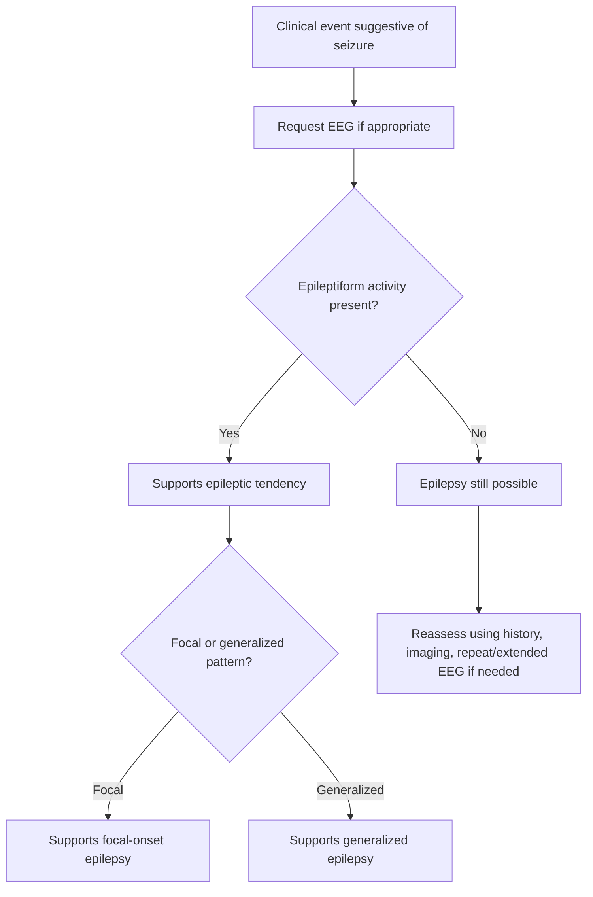
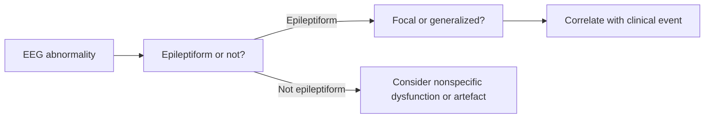

# Epileptiform activity basics

Related: [[../Neurology MOC|Neurology MOC]] · [[../Neurophysiological Testing|Neurophysiological Testing]] · [[EEG]] · [[When to request EEG]] · [[Limitations of a normal EEG]] · [[../Epilepsy/History, witness account, labs, ECG, neuroimaging, and EEG|History, witness account, labs, ECG, neuroimaging, and EEG]]

> [!important]
> **Epileptiform activity** on EEG suggests **cortical hyperexcitability** and supports an epileptic tendency, but it does **not automatically prove** that every clinical event was a seizure.

> [!tip]
> In FCPS/MRCP, avoid two mistakes: 
> 1. calling every EEG abnormality “epilepsy,” and 
> 2. dismissing epilepsy just because epileptiform activity was not captured.

## Learning Objectives
- Define epileptiform activity on EEG.
- Recognize the major epileptiform EEG patterns at a basic bedside-exam level.
- Understand how epileptiform activity supports seizure diagnosis and classification.
- Know the limitations of EEG interpretation.
- Integrate EEG abnormalities with clinical history and semiology.

## Definition
**Epileptiform activity** refers to EEG patterns that are suggestive of an increased likelihood of epileptic seizures due to abnormal cortical excitability.

At a basic clinical level, this includes patterns such as:
- spikes
- sharp waves
- spike-and-wave complexes
- polyspike activity

These findings are interpreted in the clinical context, not in isolation.

## Relevant Neuroanatomy
- EEG reflects activity from superficial cortical neuronal populations.
- Focal epileptiform discharges may correspond to epileptogenic cortex in temporal, frontal, parietal, or occipital regions.
- Generalized epileptiform discharges reflect widespread network involvement rather than a single focal lesion.

## Relevant Neurophysiology
- Epileptiform discharges arise from hypersynchronous neuronal firing.
- Excitatory/inhibitory imbalance increases cortical instability.
- Focal epileptiform activity suggests localized hyperexcitable cortex.
- Generalized spike-wave patterns support generalized epileptic network involvement.

## Normal Values / Important Cut-offs
This topic is pattern-based rather than numerical, but these high-yield rules matter:
- **Epileptiform activity supports epileptic tendency, not automatic proof of the event type.**
- **Normal EEG does not exclude epilepsy.**
- **Focal epileptiform discharges** may suggest focal-onset epilepsy.
- **Generalized spike-wave** activity may support generalized epilepsy syndromes.

## Classification
### Basic epileptiform pattern groups
1. **Focal epileptiform discharges**
2. **Generalized epileptiform discharges**
3. **Spike-wave complexes**
4. **Polyspike or polyspike-wave patterns**

### Practical interpretation groups
1. supports focal epilepsy
2. supports generalized epilepsy
3. nonspecific/non-epileptiform abnormality
4. normal interictal EEG

## Etiology / Causes / Associations
Epileptiform activity may be associated with:
- focal cortical scars
- structural lesions
- genetic generalized epilepsy patterns
- prior CNS infections
- traumatic or developmental epileptogenic substrates

## Risk Factors / Contexts Increasing Relevance
- definite seizure-like event clinically
- recurrent stereotyped episodes
- focal neurological or focal seizure semiology
- nocturnal seizures
- previous brain insult
- family history of epilepsy in some syndromes

## Pathophysiology
1. Cortical neurons become hyperexcitable.
2. Groups of neurons discharge synchronously.
3. This produces distinctive sharp transient EEG abnormalities.
4. The pattern may help localize or classify the epileptic tendency.

## Clinical Features / Why It Matters
Epileptiform activity is most useful when you are asking:
- Is this patient likely to have an epileptic tendency?
- Is the seizure more likely focal or generalized?
- Does the EEG support a syndrome consistent with the history?

It is less useful if the clinical event is clearly non-epileptic.

## Approach / Algorithm

## Investigations
### EEG context
Epileptiform activity is assessed on:
- routine EEG
- repeat EEG where needed
- sleep-deprived EEG in selected cases
- prolonged or continuous EEG in selected situations

### Must be interpreted alongside
- history and witness description
- seizure semiology
- neurological examination
- MRI/CT findings when structural disease is suspected

## Interpretation Frameworks
### Common epileptiform activity patterns table
| Pattern | Basic implication |
|---|---|
| Focal spikes/sharp waves | focal cortical hyperexcitability |
| Generalized spike-wave | generalized epilepsy tendency |
| Polyspike-wave | may support generalized epileptic syndromes |
| Non-epileptiform slowing only | not equivalent to epileptiform activity |

### High-yield interpretation table
| EEG finding | What to say in exams |
|---|---|
| Focal epileptiform discharge | “Supports focal epileptic tendency; correlate with semiology and imaging.” |
| Generalized spike-wave activity | “Supports generalized epilepsy pattern.” |
| Background slowing only | “Abnormal but not specifically epileptiform.” |
| Normal EEG | “Does not exclude epilepsy.” |

## Diagnosis
Epileptiform activity supports diagnosis/classification when the clinical picture fits epilepsy, but:
- it is **supportive**, not absolute proof
- absence of epileptiform activity does **not** exclude epilepsy

A strong answer is:
- “EEG showing focal epileptiform discharges supports focal epilepsy, but the result must be correlated with history and imaging.”

## Differential Diagnosis
### EEG interpretation differentials
- true epileptiform activity
- nonspecific background slowing
- artefact mistaken for abnormal discharge
- incidental abnormality not explaining current symptoms

### Clinical-event differentials despite EEG abnormalities
- syncope with coincidental EEG abnormality
- functional non-epileptic attacks with unrelated EEG changes
- metabolic encephalopathy with slowing rather than epileptiform discharges

## Tables / Comparison Charts
### Epileptiform vs non-epileptiform simplified comparison
| EEG feature | Epileptiform? | Usual significance |
|---|---|---|
| Spike / sharp wave | Yes | cortical hyperexcitability |
| Spike-wave complex | Yes | epileptic syndrome support |
| Diffuse slowing | No, not specifically | encephalopathy/nonspecific dysfunction |
| Normal tracing | No abnormality seen | does not exclude epilepsy |

## Management
### How epileptiform activity influences management
- supports a more confident epilepsy diagnosis when the history fits
- helps syndrome classification
- may influence antiseizure medication choice and counselling
- contributes to recurrence-risk assessment after first unprovoked seizure

### What it should NOT do alone
- it should not override a clearly non-epileptic clinical story
- it should not be used in isolation to label a patient permanently with epilepsy

## Drug Interactions / Contraindications / Comorbidity Cautions
- Sedation, sleep deprivation, intoxication, and metabolic disturbances may affect EEG interpretation.
- Antiseizure drugs may reduce observable epileptiform activity without proving cure.
- Comorbid encephalopathy may create abnormal background slowing that is not epileptiform.

## Procedures / Indications / Contraindications
### Indication to look for epileptiform activity
- clinically plausible epilepsy
- first unprovoked seizure
- seizure classification
- recurrent stereotyped events

### Limitation
- scalp EEG may miss deep or intermittent discharges

## Procedure Mini-Sections
### How to report EEG significance
Say:
- whether epileptiform activity is present or absent
- whether it is focal or generalized
- what that supports clinically
- what the limitations are

### Viva reporting line
“The EEG demonstrates epileptiform discharges, which support an epileptic tendency. I would correlate this with the clinical event type, imaging, and recurrence-risk context.”

## Complications / Pitfalls
- over-diagnosing epilepsy from isolated EEG findings
- missing focal epilepsy because routine EEG is normal
- confusing slowing with epileptiform activity
- ignoring the clinical story in favor of the tracing alone

## Red Flags / Emergencies
- EEG evidence of ongoing ictal activity in altered mental status
- recurrent electroclinical seizure concern
- non-convulsive status setting

## Prognosis
- Epileptiform activity after a first unprovoked seizure increases concern for recurrence.
- Focal epileptiform activity may point toward a structural/focal epilepsy work-up.
- Prognosis still depends on the full clinical syndrome, imaging, and underlying cause.

## Topic Correlations
- [[When to request EEG]]
- [[Limitations of a normal EEG]]
- [[../Epilepsy/History, witness account, labs, ECG, neuroimaging, and EEG|History, witness account, labs, ECG, neuroimaging, and EEG]]

## Special Situations
### Generalized epilepsy syndromes
- generalized spike-wave activity may be especially useful in classification.

### Focal epilepsy
- focal epileptiform discharges should prompt correlation with focal semiology and structural imaging.

### Encephalopathy
- abnormal EEG may reflect diffuse dysfunction rather than epileptiform activity.

## FCPS/MRCP High-Yield Points
- Epileptiform activity supports cortical hyperexcitability.
- Focal discharges suggest focal epilepsy.
- Generalized spike-wave suggests generalized epileptic tendency.
- Abnormal EEG is not automatically equal to clinical epilepsy.
- Normal EEG does not exclude epilepsy.

## Common Viva Questions
- What is epileptiform activity?
- What is the difference between focal and generalized epileptiform discharges?
- Does epileptiform activity prove the patient had a seizure?
- Can a normal EEG exclude epilepsy?
- How do EEG findings affect management?

## Common Confusions / Exam Traps
- calling diffuse slowing “epileptiform”
- using EEG without clinical correlation
- assuming a normal EEG rules out epilepsy
- assuming all focal discharges imply a visible lesion

## Mnemonics
### FGS rule
- **F**ocal discharge → focal tendency
- **G**eneralized spike-wave → generalized tendency
- **S**upportive, not standalone proof

## Mind Map
- Epileptiform activity
  - focal
  - generalized
  - spike-wave
  - polyspike
  - supportive role
  - limitations

## Flowchart

## Suggested Visuals / Image Notes
- simple diagram of spike vs spike-wave concepts
- focal vs generalized EEG pattern comparison table
- “supportive not standalone” interpretation poster

## Suggested Video References
- EEG basics for non-neurophysiologists
- interictal epileptiform discharge teaching videos
- focal vs generalized EEG pattern tutorials

## One-Page Revision Summary
### Epileptiform activity basics — one page
- Epileptiform activity = EEG evidence suggestive of epileptic cortical hyperexcitability
- Main patterns:
  - spikes
  - sharp waves
  - spike-wave complexes
  - polyspike-wave
- Focal pattern → focal epilepsy tendency
- Generalized pattern → generalized epilepsy tendency
- Must correlate with:
  - history
  - semiology
  - imaging
- Remember:
  - abnormal EEG ≠ automatic epilepsy diagnosis
  - normal EEG ≠ no epilepsy

## 24-Hour Recall Prompts
- Define epileptiform activity.
- Give 4 examples of epileptiform EEG patterns.
- What does focal epileptiform activity suggest?
- What does generalized spike-wave suggest?
- Why is EEG only supportive and not standalone?

## 7-Day / 15-Day / 30-Day Revision Tracker
- **Day 1:** Can I define epileptiform activity clearly?
- **Day 7:** Can I contrast focal vs generalized epileptiform patterns?
- **Day 15:** Can I explain why slowing is not the same as epileptiform activity?
- **Day 30:** Can I answer EEG interpretation SBAs accurately?

## Must Know / Should Know / Nice to Know
### Must Know
- spikes/sharp waves/spike-wave basics
- focal vs generalized implication
- supportive not definitive role
- normal EEG limitation

### Should Know
- difference between epileptiform patterns and slowing
- correlation with imaging and semiology

### Nice to Know
- advanced syndrome-specific EEG nuances

## My Weak Points
- Do I overcall nonspecific abnormalities?
- Do I forget that normal EEG can still occur in epilepsy?
- Do I fail to relate focal EEG abnormalities to semiology/imaging?

## Self-Test Scorecard
- Understanding /10
- Recall /10
- Interpretation /10
- MCQ performance /10
- SBA performance /10

**Interpretation:**
- **<35/50** = weak topic
- **35–44/50** = acceptable but not secure
- **45+/50** = strong exam-ready topic

## Exam Answer Modes
### Short note style
Epileptiform activity refers to EEG discharges such as spikes, sharp waves, and spike-wave complexes that suggest cortical hyperexcitability and support an epileptic tendency. They help classification but must always be interpreted with the clinical context.

### Viva style
“Epileptiform discharges on EEG support a tendency toward epilepsy. Focal discharges suggest focal epilepsy, generalized spike-wave suggests generalized tendency, but the tracing alone does not prove the clinical event was epileptic.”

## Summary
Epileptiform activity is a high-yield EEG concept in neurology. Understanding its basic patterns, implications, and limitations helps clinicians use EEG intelligently rather than mechanically.

## MCQs (10)
1. Epileptiform activity most strongly suggests:
   - A. cortical hyperexcitability
   - B. guaranteed syncope
   - C. peripheral neuropathy
   - D. normal EEG

2. Which is an epileptiform EEG pattern?
   - A. Spike-wave complex
   - B. Diffuse slowing alone
   - C. Motion artefact
   - D. Baseline drift only

3. Focal epileptiform discharges generally support:
   - A. focal epileptic tendency
   - B. renal failure only
   - C. no clinical significance ever
   - D. generalized syncope pattern

4. Generalized spike-wave activity may support:
   - A. generalized epilepsy tendency
   - B. isolated peripheral vestibular disease
   - C. pure myopathy
   - D. lumbar radiculopathy

5. Which statement is most accurate?
   - A. Epileptiform activity alone proves every event was epileptic
   - B. Epileptiform activity is supportive but must be clinically correlated
   - C. Normal EEG excludes epilepsy
   - D. Focal EEG changes always mean stroke

6. Diffuse slowing is best described as:
   - A. definitely epileptiform
   - B. nonspecific dysfunction rather than specifically epileptiform
   - C. proof of absence epilepsy
   - D. equivalent to spike-wave activity

7. A common trap is:
   - A. correlating EEG with history
   - B. over-diagnosing epilepsy from isolated EEG abnormalities
   - C. distinguishing focal from generalized patterns
   - D. recognizing limitations of EEG

8. Epileptiform activity is especially useful when combined with:
   - A. semiology and clinical history
   - B. blood group only
   - C. shoe size
   - D. weather data

9. Which statement about normal EEG is correct?
   - A. It rules out epilepsy completely
   - B. It can still occur in epilepsy
   - C. It proves syncope
   - D. It excludes focal seizures only

10. The best one-line summary is:
   - A. EEG replaces clinical reasoning
   - B. Epileptiform activity supports but does not by itself establish clinical epilepsy
   - C. All abnormal EEGs are epileptiform
   - D. Epileptiform activity only occurs in children

## SBA Questions (10)
1. A 22-year-old man has recurrent stereotyped episodes of impaired awareness. EEG shows focal sharp discharges. Best interpretation?
   - A. Supports focal epileptic tendency
   - B. Confirms vasovagal syncope
   - C. Proves psychogenic attack
   - D. Has no significance

2. A patient has generalized spike-wave activity on EEG. What is the best general interpretation?
   - A. Supports generalized epileptic tendency
   - B. Confirms BPPV
   - C. Excludes epilepsy
   - D. Means the tracing is normal

3. A patient with a convincing seizure history has a normal EEG. Best next conclusion?
   - A. Epilepsy is excluded
   - B. The history is invalid
   - C. Epilepsy is still possible
   - D. EEG was unnecessary in principle

4. A resident says diffuse slowing equals epileptiform activity. Best correction?
   - A. Correct
   - B. No; slowing is abnormal but not specifically epileptiform
   - C. Only in all headaches
   - D. Only in vestibular disease

5. What is the major value of identifying focal epileptiform discharges?
   - A. It may support focal seizure localization/classification
   - B. It proves metabolic syncope
   - C. It excludes imaging need forever
   - D. It proves PNES

6. Which sentence best reflects good EEG interpretation?
   - A. Read the tracing without regard to the patient story
   - B. Correlate epileptiform activity with semiology and imaging
   - C. Normal EEG ends the assessment
   - D. Only generalized discharges matter

7. A patient with possible epilepsy has an abnormal EEG but the clinical episode was clearly vasovagal syncope. Best principle?
   - A. EEG always overrides the clinical story
   - B. Clinical correlation remains essential
   - C. Diagnosis must be epilepsy
   - D. MRI is forbidden

8. Which pattern is most likely epileptiform?
   - A. Spike-wave complex
   - B. Baseline artefact
   - C. Eye blink only
   - D. Diffuse low-voltage background alone

9. Why is epileptiform activity considered supportive rather than definitive?
   - A. Because EEG abnormalities must be interpreted in clinical context
   - B. Because EEG is never useful
   - C. Because all seizures are generalized
   - D. Because MRI replaces EEG completely

10. What is the key takeaway?
   - A. Epileptiform activity helps classify epilepsy but must not be overinterpreted
   - B. All EEG abnormalities equal epilepsy
   - C. Normal EEG always means non-epileptic disease
   - D. EEG is only for stroke

## Flashcards
- Q: What does epileptiform activity suggest?
  A: Cortical hyperexcitability and epileptic tendency.

- Q: Name 4 epileptiform EEG patterns.
  A: Spikes, sharp waves, spike-wave complexes, polyspike-wave patterns.

- Q: What do focal epileptiform discharges suggest?
  A: Focal epileptic tendency.

- Q: What does generalized spike-wave support?
  A: Generalized epilepsy tendency.

- Q: Does epileptiform activity alone prove the clinical event was epileptic?
  A: No.

- Q: Does a normal EEG exclude epilepsy?
  A: No.

- Q: Is diffuse slowing the same as epileptiform activity?
  A: No.

- Q: What should EEG always be correlated with?
  A: Clinical history, semiology, and other investigations.

- Q: Why can focal epileptiform discharges matter beyond EEG?
  A: They may guide focal localization and structural imaging correlation.

- Q: What is the core exam trap?
  A: Over-interpreting EEG abnormalities without clinical context.

## Answer Key with Explanations
### MCQs
1. **A** — epileptiform activity supports cortical hyperexcitability.
2. **A** — spike-wave complexes are classic epileptiform patterns.
3. **A** — focal discharges support focal epileptic tendency.
4. **A** — generalized spike-wave supports generalized epilepsy tendency.
5. **B** — EEG findings must be clinically correlated.
6. **B** — diffuse slowing is abnormal but not specifically epileptiform.
7. **B** — over-diagnosing epilepsy from isolated EEG findings is a common mistake.
8. **A** — semiology and history are essential for correct interpretation.
9. **B** — normal EEG can still occur in epilepsy.
10. **B** — this is the best summary.

### SBAs
1. **A** — focal sharp discharges support focal epileptic tendency.
2. **A** — generalized spike-wave supports generalized epileptic tendency.
3. **C** — epilepsy can still be present despite normal EEG.
4. **B** — slowing is not equivalent to epileptiform activity.
5. **A** — focal discharges can help localization/classification.
6. **B** — proper EEG interpretation always requires correlation.
7. **B** — the clinical story still matters; EEG cannot replace it.
8. **A** — spike-wave complex is a classic epileptiform finding.
9. **A** — this is why the finding is supportive, not definitive.
10. **A** — helpful but not overinterpreted is the key principle.