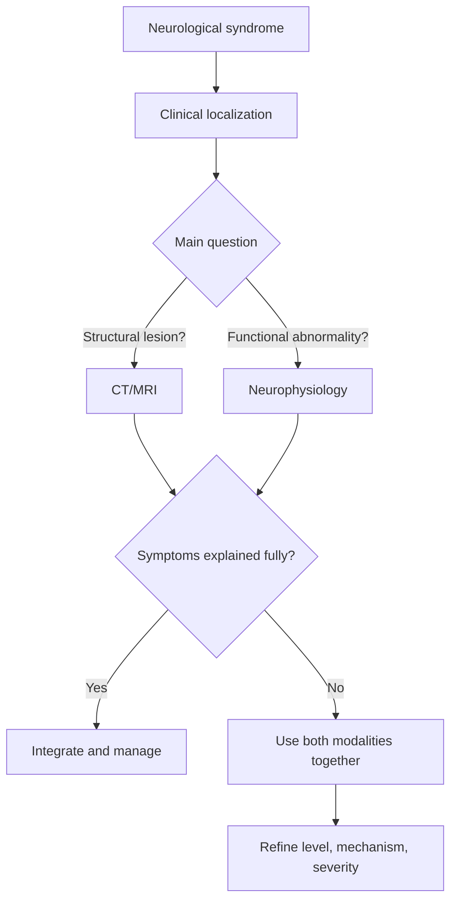
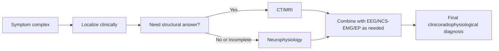

# How neurophysiology complements imaging

Related: [[../Neurology MOC|Neurology MOC]] · [[../Neurophysiological Testing|Neurophysiological Testing]] · [[Evoked potentials and specialized testing]] · [[When to request EEG]] · [[Neuropathy vs myopathy vs NMJ distinction]] · [[../Neuroimaging/Non-contrast CT head basics|Non-contrast CT head basics]] · [[../Neuroimaging/MRI brain sequences basics|MRI brain sequences basics]]

> [!important]
> **Imaging shows structure; neurophysiology shows function.** Good neurological diagnosis often needs both.

> [!tip]
> High-yield line: **MRI may show where a lesion is, but EEG, nerve conduction studies, EMG, and evoked potentials help show whether a pathway is actually functioning abnormally, how severely, and sometimes at what physiological level.**

## Learning Objectives
- Explain why neurophysiology and imaging answer different clinical questions.
- Recognize the main roles of EEG, nerve conduction studies/EMG, and evoked potentials.
- Understand common scenarios where imaging is normal but neurophysiology is abnormal, and vice versa.
- Use a simple exam-ready framework for deciding which test complements which syndrome.

## Definition
**Neurophysiology** refers to tests that assess electrical function of the nervous system, including:
- EEG
- nerve conduction studies (NCS)
- EMG
- evoked potentials

**Imaging** refers mainly to structural visualization such as CT and MRI.

## Relevant Neuroanatomy
- Imaging localizes anatomy: cortex, white matter, brainstem, spinal cord, roots, peripheral nerves, muscle bulk, mass lesions, hemorrhage.
- Neurophysiology interrogates **functional conduction** across these structures.
- Together they bridge **anatomical localization** and **physiological dysfunction**.

## Relevant Neurophysiology
- EEG records cortical electrical activity.
- NCS measure peripheral nerve conduction velocity, latency, and amplitude.
- EMG evaluates muscle electrical activity and motor unit behavior.
- Evoked potentials test central conduction along visual, sensory, or auditory pathways.
- Physiological failure may precede visible structural change or persist after structural lesions become subtle.

## Normal Values / Important Cut-offs
- Exact values vary by laboratory and modality.
- Exam focus should be on **pattern recognition**:
  - slowed conduction → demyelination
  - low amplitude → axonal loss or reduced functional units
  - epileptiform discharges → cortical hyperexcitability
  - denervation potentials → motor unit/pathway dysfunction
- Structural imaging uses radiological pattern recognition rather than universal numeric cut-offs in most bedside neurology questions.

## Classification
### Practical test families
1. structural imaging: CT, MRI
2. cortical function: EEG
3. peripheral nerve/muscle function: NCS and EMG
4. pathway function: evoked potentials

### Clinical question categories
1. Where is the lesion?
2. Is the tissue/pathway functionally active or impaired?
3. Is the pattern central, root, peripheral nerve, NMJ, or muscle?
4. Is there active seizure tendency or encephalopathy?

## Etiology / Clinical Scenarios Requiring Complementarity
- seizures with normal CT/MRI but abnormal EEG
- radiculopathy or neuropathy with subtle or incidental imaging findings
- myopathy with normal spine imaging
- demyelination with functional delay on evoked potentials
- incidental MRI white-matter changes that are not the cause of symptoms
- coma/encephalopathy where EEG adds functional information

## Risk Factors / Indications
- mismatch between symptoms and imaging
- suspected functional significance of a structural lesion
- uncertain lesion level after examination
- monitoring disease progression or severity
- distinguishing active physiological dysfunction from old static structural change

## Pathophysiology
1. Disease can disrupt **structure**, **function**, or both.
2. CT/MRI identify hemorrhage, infarct pattern, edema, demyelination, compression, atrophy, and masses.
3. Neurophysiology shows how impulses behave through affected tissue.
4. A lesion may be structurally visible but physiologically mild, or structurally subtle but functionally severe.

## Clinical Features / When This Principle Matters
### Common bedside examples
- recurrent blackout spells: MRI may be normal; EEG may show epileptiform tendency
- foot drop: MRI spine may show degenerative change, but NCS/EMG can separate radiculopathy from peroneal neuropathy
- optic neuritis/MS: MRI plus VEP provide structural and functional evidence
- coma or encephalopathy: CT excludes bleed/mass, EEG assesses cerebral activity
- myelopathy: MRI localizes compression; SSEPs may support posterior column dysfunction

## Approach / Algorithm

## Investigations
### Imaging answers
- Is there hemorrhage?
- Is there infarction, mass, edema, hydrocephalus, demyelination, compression, or atrophy?
- What is the anatomical site?

### Neurophysiology answers
- Is there epileptiform cortical dysfunction?
- Is conduction demyelinating or axonal?
- Is the lesion root, peripheral nerve, NMJ, or muscle?
- Is a sensory/visual/brainstem pathway functioning abnormally?

## Interpretation Frameworks
### Structure versus function table
| Scenario | Imaging contribution | Neurophysiology contribution |
|---|---|---|
| Seizure disorder | may exclude structural cause | EEG shows epileptiform activity tendency |
| Peripheral neuropathy | may be normal or nonspecific | NCS defines axonal vs demyelinating pattern |
| Myopathy | MRI may show little initially | EMG supports myopathic process |
| Optic neuritis/MS | MRI shows structural lesions | VEP shows conduction delay |
| Coma/encephalopathy | CT/MRI exclude mass/bleed | EEG shows diffuse cortical dysfunction or non-convulsive status |

### Exam-ready comparison
| Tool | Best strength | Limitation |
|---|---|---|
| CT | rapid structural assessment | little direct physiological information |
| MRI | detailed structural localization | may not define functional significance |
| EEG | cortical functional assessment | poor structural localization |
| NCS/EMG | peripheral/NMJ/muscle physiology | limited for intracranial structure |
| Evoked potentials | pathway conduction testing | supportive rather than disease-specific |

## Diagnosis
Neurophysiology rarely replaces imaging. Instead, it helps answer:
- is the lesion electrically active or physiologically meaningful?
- what level of the nervous system is involved?
- is the pattern epileptic, neuropathic, myopathic, demyelinating, or encephalopathic?

## Differential Diagnosis
A mismatch between imaging and symptoms should raise possibilities such as:
- incidental structural findings
- early disease not yet obvious structurally
- diffuse physiological dysfunction
- peripheral rather than central pathology
- functional disorder, if objective physiology and imaging are both unrevealing after proper assessment

## Tables / Comparison Charts
### Common complementary pairs
| Syndrome | Imaging | Neurophysiology |
|---|---|---|
| First seizure | MRI/CT for cause | EEG for epileptiform tendency |
| Suspected neuropathy | targeted MRI only if needed | NCS/EMG is primary physiologic test |
| Suspected myelopathy | MRI spine | SSEP in selected cases |
| Optic pathway disease | MRI orbits/brain | VEP |
| Encephalopathy | CT/MRI for cause | EEG for function |

## Management
### Clinical application
- choose tests based on the question, not habit
- use imaging for anatomy and safety exclusions
- use neurophysiology for pathway/cortical/peripheral function
- integrate both before labeling disease mechanism

### Practical principle
If the question is **“Where is the lesion?”** start with localization and imaging.  
If the question is **“How is the pathway functioning?”** neurophysiology adds value.

## Drug Interactions / Contraindications / Comorbidity Cautions
- Sedatives and antiseizure drugs can affect EEG interpretation.
- Severe edema, metabolic derangement, or ICU confounders can alter physiological tests.
- Degenerative imaging changes in older adults may be incidental and should not be over-attributed.
- Peripheral edema, temperature, and poor cooperation can affect NCS quality.

## Procedures / Indications / Contraindications
### Procedure mini-section: choosing the adjunct test
- **EEG** for seizure/encephalopathy questions
- **NCS/EMG** for peripheral nerve, root, NMJ, muscle questions
- **Evoked potentials** for central conduction pathway questions
- **MRI/CT** for anatomical lesion detection and emergency structural triage

## Complications
The key complication is **diagnostic error from overreliance on one modality**:
- treating incidental MRI changes as causal
- excluding epilepsy because MRI is normal
- missing peripheral disease because brain imaging is unrevealing

## Red Flags / Emergencies
- non-convulsive status epilepticus: EEG can be decisive when CT is non-diagnostic
- acute cord compression: MRI is urgent; physiology is secondary/supportive
- rapidly progressive weakness: NCS/EMG may clarify peripheral mechanism
- thunderclap headache or raised ICP: urgent imaging comes before elective neurophysiology

## Prognosis
Combined structural and functional assessment improves:
- diagnostic accuracy
- baseline documentation
- monitoring of progression or recovery in selected disorders

## Topic Correlation
- [[When to request EEG]]
- [[Epileptiform activity basics]]
- [[Neuropathy vs myopathy vs NMJ distinction]]
- [[Demyelinating vs axonal pattern basics]]
- [[Visual evoked potentials]]
- [[Somatosensory and brainstem evoked potentials]]
- [[../Neuroimaging/MRI spine indications|MRI spine indications]]

## Special Situations
- **ICU/coma:** imaging excludes mass/bleed while EEG assesses cortical function.
- **MS/demyelination:** MRI plus evoked potentials may together support dissemination and functional involvement.
- **Elderly patients:** imaging often shows incidental microvascular change, so physiology and clinical correlation are critical.

## FCPS/MRCP High-Yield Points
- Imaging = structure; neurophysiology = function.
- Normal MRI does not exclude epilepsy, neuropathy, NMJ disease, or diffuse encephalopathy.
- Abnormal imaging may be incidental without physiological correlation.
- Choose EEG for cortical electrical dysfunction; NCS/EMG for peripheral motor unit disorders; evoked potentials for pathway conduction.

## Common Viva Questions
1. Why is MRI insufficient in many neurological disorders?
2. How does EEG complement neuroimaging?
3. When are NCS and EMG more informative than MRI?
4. Give one example where imaging is normal but physiology is abnormal.
5. Why should structural and functional data be integrated?

## Common Confusions / Exam Traps
- Do not say EEG localizes structure well; it mainly assesses function.
- Do not use MRI to diagnose neuropathy pattern when NCS/EMG is the more direct test.
- Do not mistake incidental degenerative or white-matter changes as the sole explanation without physiological correlation.
- Do not delay emergency imaging in acute headache or raised ICP while waiting for physiology.

## Mnemonics
- **I = Imaging = Inside structure**
- **N = Neurophysiology = Nerve function Now**

## Mind Map
- Neurological test choice
  - imaging
    - CT
    - MRI
    - anatomy
  - neurophysiology
    - EEG
    - NCS/EMG
    - evoked potentials
    - function
  - integration
    - localization
    - mechanism
    - severity

## Flowchart

## Suggested Visuals / Image Notes
- simple diagram contrasting “structure” and “function”
- table pairing common syndromes with best tests
- localization ladder: cortex, cord, root, peripheral nerve, NMJ, muscle

## One-Page Revision Summary
- **Imaging**: structural lesion, bleed, mass, edema, demyelination, compression.
- **EEG**: cortical electrical function; seizure tendency, encephalopathy, non-convulsive status.
- **NCS/EMG**: peripheral nerve, root, NMJ, muscle physiology.
- **Evoked potentials**: pathway conduction.
- **Best rule**: ask whether you need anatomy, function, or both.

## 24-Hour Recall Prompts
- Give one example where MRI is normal but EEG is useful.
- Differentiate NCS/EMG from MRI in foot drop.
- State one reason physiology and imaging may disagree.
- Say the phrase “structure versus function” and explain it in one minute.

## 7-Day / 15-Day / 30-Day Revision Tracker
- **7 days:** make a table of modality versus question answered.
- **15 days:** solve 5 localization cases choosing test pairs.
- **30 days:** explain how EEG, NCS/EMG, and MRI differ in viva format.

## Must Know / Should Know / Nice to Know
### Must Know
- structure versus function distinction
- EEG for seizure/encephalopathy
- NCS/EMG for peripheral motor unit disorders
- evoked potentials for conduction pathway assessment

### Should Know
- normal imaging does not exclude physiological disease
- incidental imaging abnormalities are common

### Nice to Know
- operative monitoring and prognostic physiology contexts

## Self-Test Scorecard
- Test-selection confidence /10
- Structure-function distinction /10
- Clinical integration /10
- Viva readiness /10
- Error-avoidance /10

## Summary
Neurophysiology complements imaging by providing objective information about electrical function when imaging mainly provides structural localization. In neurology, the strongest diagnostic approach integrates history, examination, imaging, and the correct physiological test rather than relying on any single modality in isolation.

## MCQs (10)
1. MRI mainly provides information about:
   - A. Electrical cortical activity
   - B. Structural anatomy
   - C. NMJ transmission
   - D. Motor unit firing pattern
   - **Answer: B**
2. EEG is most useful for assessing:
   - A. Bone density
   - B. Cortical electrical activity
   - C. Serum osmolality
   - D. Posterior column anatomy only
   - **Answer: B**
3. NCS/EMG are most directly helpful in:
   - A. Distinguishing neuropathy from myopathy
   - B. Diagnosing subarachnoid hemorrhage
   - C. Showing hydrocephalus
   - D. Measuring ICP directly
   - **Answer: A**
4. A patient with recurrent stereotyped blackouts and normal MRI may still need:
   - A. EEG
   - B. Colonoscopy
   - C. Spirometry
   - D. Echocardiography only
   - **Answer: A**
5. Evoked potentials mainly assess:
   - A. Structural anatomy only
   - B. Pathway conduction function
   - C. Blood glucose
   - D. CSF pressure only
   - **Answer: B**
6. A major pitfall is:
   - A. Using both imaging and neurophysiology together
   - B. Overattributing incidental MRI findings to symptoms
   - C. Correlating with examination
   - D. Choosing the test based on localization
   - **Answer: B**
7. The best phrase to remember the relationship is:
   - A. Imaging and neurophysiology are identical
   - B. Imaging shows structure; neurophysiology shows function
   - C. MRI replaces EEG
   - D. EEG replaces MRI
   - **Answer: B**
8. Which test pair is most useful in suspected optic neuritis?
   - A. Colonoscopy + ABG
   - B. MRI + VEP
   - C. CXR + ECG
   - D. Ultrasound + spirometry
   - **Answer: B**
9. In encephalopathy with unclear episodes of unresponsiveness, a crucial adjunct to CT/MRI is:
   - A. EEG
   - B. Audiogram only
   - C. Bone scan
   - D. Skin biopsy
   - **Answer: A**
10. The most appropriate diagnostic philosophy is:
   - A. One test should explain everything
   - B. Integrate structural and functional data with clinical localization
   - C. Ignore normal imaging
   - D. Ignore physiology if MRI is abnormal
   - **Answer: B**

## SBA Questions (10)
1. A 24-year-old man has recurrent stereotyped jerking episodes with a normal MRI brain. Which investigation best complements imaging to assess cortical epileptic tendency?  
   **Answer: EEG**
2. A 58-year-old woman has foot drop. Lumbar MRI shows mild degenerative changes, but localization remains unclear. Which test best complements imaging to distinguish radiculopathy from peroneal neuropathy?  
   **Answer: NCS/EMG**
3. A patient with suspected optic neuritis has MRI findings that are not definitive. Which physiological test can support visual pathway conduction delay?  
   **Answer: Visual evoked potentials**
4. In a patient with prolonged unresponsiveness and a non-diagnostic CT, which test may identify non-convulsive status epilepticus?  
   **Answer: EEG**
5. Why can imaging and neurophysiology disagree in early disease?  
   **Answer: Functional impairment may precede or exceed visible structural abnormality.**
6. A resident says MRI is enough to classify neuropathy as demyelinating or axonal. What is the best correction?  
   **Answer: Neurophysiology, especially NCS, is the direct test for that distinction.**
7. An MRI shows white-matter changes in an older patient with peripheral numbness. What is the best next principle?  
   **Answer: Correlate clinically and use neurophysiology to avoid overcalling incidental central imaging changes.**
8. What is the main role of evoked potentials in relation to imaging?  
   **Answer: To provide functional assessment of pathway conduction.**
9. A patient has suspected cervical myelopathy. Which combination is most logical?  
   **Answer: MRI spine for anatomy plus selected neurophysiology such as SSEP for function when needed.**
10. What is the best summary statement for viva?  
   **Answer: Imaging localizes structural pathology, while neurophysiology defines electrical and conduction dysfunction; together they improve diagnostic precision.**

## Flashcards
- Q: What does imaging show best?  
  A: Structural anatomy and lesions.
- Q: What does neurophysiology show best?  
  A: Electrical and conduction function.
- Q: Which test complements MRI in epilepsy?  
  A: EEG.
- Q: Which test complements imaging in neuropathy/myopathy localization?  
  A: NCS/EMG.
- Q: Which test complements imaging in visual pathway demyelination?  
  A: VEP.

## Answer Key with Explanations
- Structural and functional tests answer different questions.
- EEG, NCS/EMG, and evoked potentials become most useful when symptoms outstrip imaging or when the physiological level of disease needs definition.
- Integrated clinicoradiological and physiological reasoning prevents both overdiagnosis and underdiagnosis.

## PasTest Scenario SBAs (Clinical Vignettes)

> **Auto-generated PasTest/Mediscope-style scenario SBAs** grounded in the authored source. Each scenario tests a real clinical fact (triad, specific sign, contraindication, trial, first-line Rx) extracted from the topic. *Source: Ch 27: Neurology & Stroke — How neurophysiology complements imaging*

**Q1.** What is the most appropriate first-line therapy for How neurophysiology complements imaging?

  - **A.** use imaging for anatomy and safety exclusions
  - **B.** An advanced/surgical therapy reserved for refractory disease
  - **C.** Symptomatic treatment only, no disease-modifying therapy
  - **D.** Empiric broad-spectrum therapy without specific indication

  > **Answer: A** — use imaging for anatomy and safety exclusions
  >
  > *Source:* use imaging for anatomy and safety exclusions

