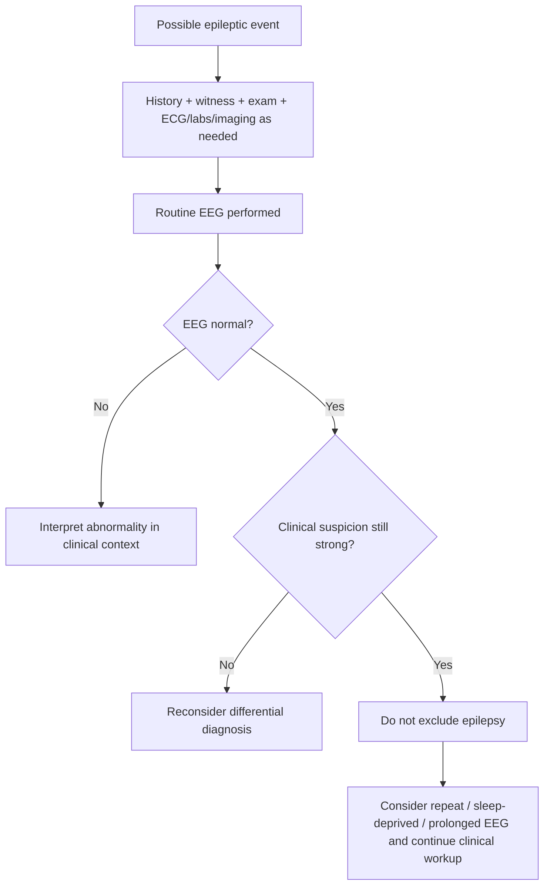
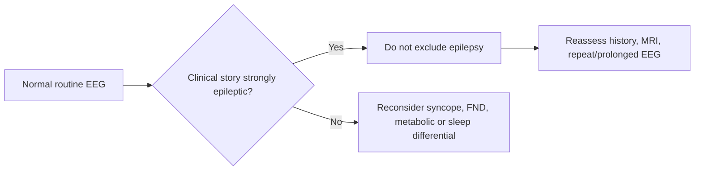

# Limitations of a normal EEG

Related: [[../Neurology MOC|Neurology MOC]] · [[../Neurophysiological Testing|Neurophysiological Testing]] · [[EEG]] · [[When to request EEG]] · [[Epileptiform activity basics]] · [[../Epilepsy/History, witness account, labs, ECG, neuroimaging, and EEG|History, witness account, labs, ECG, neuroimaging, and EEG]] · [[../Epilepsy/Provoked vs unprovoked seizure|Provoked vs unprovoked seizure]]

> [!important]
> A **normal interictal EEG does not exclude epilepsy**. This is one of the highest-yield FCPS/MRCP principles in seizure medicine.

> [!warning]
> Two common exam mistakes are: 
> 1. falsely reassuring yourself that a patient cannot have epilepsy because the EEG is normal, and 
> 2. over-investigating repeatedly when the clinical story itself already strongly supports epilepsy.

## Learning Objectives
- Explain why a normal EEG can occur in true epilepsy.
- Describe the technical and biological reasons for false-negative routine EEG results.
- Integrate a normal EEG with history, examination, imaging, and witness account.
- Identify when repeat, sleep-deprived, prolonged, or urgent EEG may still be helpful.
- Avoid dangerous misinterpretation in first seizure and non-convulsive status scenarios.

## Definition
A **normal EEG** means no epileptiform or clearly diagnostic abnormality was captured during the recording. It does **not** mean:
- no seizure occurred
- no epileptic tendency exists
- no further evaluation is needed

In practice, a normal EEG may simply reflect:
- intermittent epileptiform activity not captured during the recording
- deep or very focal epileptogenic activity that does not appear clearly on scalp EEG
- treatment effects, sleep state, timing, or technical limitations

## Relevant Neuroanatomy
- Scalp EEG mainly reflects synchronized activity from the superficial cerebral cortex.
- Deep mesial temporal, small focal frontal, or subcortical processes may produce little visible scalp abnormality.
- The skull, scalp, and recording geometry reduce sensitivity for some discharges.

## Relevant Neurophysiology
- Epileptiform discharges are often **intermittent**, not continuous.
- Interictal recordings may miss abnormal activity between seizures.
- Sleep, drowsiness, activation procedures, and repeated sampling may increase yield.
- A patient may have a true epileptic network abnormality but show a normal short routine tracing.

## Normal Values / Important Cut-offs
This is a pattern-based topic, but these rules are essential:
- **Normal routine EEG ≠ no epilepsy.**
- **Interictal EEG may be normal in genuine epilepsy.**
- **A normal EEG should never overrule a strong clinical diagnosis by itself.**
- **Urgent treatment decisions in status epilepticus are guided by the clinical state first; EEG refines or confirms when needed.**

## Classification
### Ways a normal EEG can mislead
1. **Biological false-negative** — abnormal activity is intermittent.
2. **Sampling limitation** — recording was too brief or missed sleep/activation.
3. **Localization limitation** — deep or poorly surface-represented focus.
4. **Interpretation limitation** — subtle abnormalities not captured or not obvious.

### Practical clinical categories
1. normal EEG after first unprovoked seizure
2. normal EEG despite clinically likely focal epilepsy
3. normal EEG in possible non-epileptic event
4. normal routine EEG requiring repeat or prolonged study

## Causes / Reasons for a Normal EEG in Epilepsy
- brief recording duration
- seizure-free interval during capture
- mesial temporal or deep focus
- low-frequency seizure burden
- antiseizure medication suppressing interictal abnormalities
- suboptimal sleep capture or activation
- very focal abnormality diluted at scalp level

## Risk Factors for False Reassurance
- inexperienced interpretation of seizure history
- overreliance on investigation over bedside neurology
- first-seizure clinics where “EEG normal” is treated as definitive
- syncope/functional differential creating diagnostic uncertainty
- failure to correlate with witness account, tongue bite, post-ictal state, injury, or nocturnal features

## Pathophysiology
1. Epilepsy reflects abnormal cortical network excitability.
2. Interictal epileptiform discharges may occur only intermittently.
3. Routine scalp EEG samples a short time window and superficial cortical activity only.
4. Therefore, a patient may have epilepsy while the captured recording appears normal.

## Clinical Importance
A normal EEG matters most in:
- **first unprovoked seizure**
- **recurrent stereotyped focal or generalized events**
- **possible nocturnal seizures**
- **episodes of altered awareness with strong epileptic clues**

A normal EEG should make you ask:
- Was the recording obtained under the right conditions?
- Is epilepsy still clinically plausible?
- Do I need repeat, sleep-deprived, prolonged, or video EEG?
- Is an alternative diagnosis stronger?

## Approach / Algorithm

## Investigations
### EEG-related steps
- routine EEG
- sleep-deprived EEG when yield needs improvement
- prolonged/video EEG for recurrent unclear events
- continuous EEG when non-convulsive status is suspected

### Must be interpreted with
- detailed history and witness account
- neurological examination
- ECG if convulsive syncope is possible
- glucose/electrolytes if provocation is possible
- CT/MRI if structural disease is suspected

## Interpretation Frameworks
### Why EEG can be normal table
| Reason | Explanation |
|---|---|
| Intermittent discharges | abnormality not present during recording |
| Deep focus | poor scalp detection |
| Short routine test | insufficient sampling time |
| Medication effect | reduced visible epileptiform activity |
| Wake-only tracing | no sleep-related yield gain |

### What to say in exams
| Scenario | Best interpretation |
|---|---|
| Normal EEG after first unprovoked seizure | does not exclude epilepsy; correlate clinically |
| Normal EEG but strong focal history | consider repeat/prolonged EEG and MRI |
| Normal EEG with classic vasovagal syncope | supports low yield of epilepsy workup if history fits syncope |
| Persistent altered awareness | urgent EEG may still be needed to exclude NCSE |

## Diagnosis
Diagnosis of epilepsy is **clinical plus investigative**, not EEG-only. A normal EEG:
- lowers neither bedside standards nor clinical reasoning
- may coexist with true epilepsy
- should trigger context-based reassessment, not automatic diagnostic closure

## Differential Diagnosis
### If EEG is normal, consider
- epilepsy still possible
- syncope
- functional non-epileptic attacks
- parasomnias
- metabolic/toxic events
- transient ischemic or vestibular events if the history fits

### Distinguishing principle
A **normal EEG helps least when the story is strongly epileptic** and helps more when the story already points away from epilepsy.

## Tables / Comparison Charts
### Normal EEG vs clinical meaning
| Finding | Meaning |
|---|---|
| Normal routine EEG + classic seizure history | epilepsy still possible |
| Normal EEG + classic syncope history | epilepsy less likely if clinical picture fits syncope |
| Normal EEG + persistent unexplained confusion | does not exclude NCSE; further EEG may be required |
| Normal EEG + focal deficits/structural concern | proceed with neuroimaging and broader workup |

## Management
### Practical management consequences
- never stop reasoning at “EEG normal”
- continue seizure counselling if the event is still clinically convincing
- refine differential diagnosis using history, ECG, labs, and imaging
- consider repeat or prolonged EEG when uncertainty remains clinically important

### When repeat EEG is reasonable
- strong suspicion of epilepsy despite normal first study
- possible focal epilepsy with nondiagnostic routine EEG
- recurrent stereotyped nocturnal or altered-awareness spells
- need for video correlation of events

## Drug Interactions / Contraindications / Comorbidity Cautions
- Benzodiazepines and antiseizure drugs may suppress visible epileptiform activity.
- Sedatives, intoxication, or metabolic encephalopathy can alter background rhythms and complicate interpretation.
- Sleep deprivation may improve diagnostic yield in selected cases but must be used judiciously.
- In the critically ill, ongoing treatment must not be delayed just because an EEG is initially normal or pending.

## Procedures / Indications / Contraindications
### Procedure mini-section: repeat or prolonged EEG
- **Indication:** persistent clinical suspicion after nondiagnostic routine EEG
- **Principle:** increase sampling time and chance of capturing relevant activity
- **Limitation:** still not perfect if events remain infrequent or deep-seated
- **Complication/caution:** avoid overtesting when an alternative diagnosis is already stronger and consequences are low

## Complications
Complications here are mainly **diagnostic complications**:
- delayed epilepsy diagnosis
- inappropriate discharge after first seizure
- failure to identify ongoing non-convulsive seizures
- unnecessary stigma reduction followed by later dangerous recurrence

## Red Flags / Emergencies
- persistent unexplained altered mental status
- recurrent events with injury or prolonged post-ictal phase
- focal deficits after event
- ICU/encephalopathic patient where NCSE remains possible
- severe clinical suspicion despite a “normal” routine outpatient EEG

## Prognosis
A normal EEG does not define prognosis alone. Prognosis depends on:
- whether the event was truly epileptic
- structural lesion burden
- recurrence pattern
- seizure syndrome
- treatment response and safety counselling

## Topic Correlation
- [[When to request EEG]]
- [[Epileptiform activity basics]]
- [[../Epilepsy/Provoked vs unprovoked seizure|Provoked vs unprovoked seizure]]
- [[../Epilepsy/History, witness account, labs, ECG, neuroimaging, and EEG|History, witness account, labs, ECG, neuroimaging, and EEG]]
- [[../Disorders of Sleep/Nocturnal events vs epilepsy|Nocturnal events vs epilepsy]]

## Special Situations
### First seizure clinic
A normal EEG should be explained carefully so the patient does not assume “all clear.”

### Pregnancy
Do not alter counselling solely because the EEG is normal if the clinical diagnosis remains probable.

### Elderly patient
Syncope, arrhythmia, and transient confusional states may compete strongly in the differential; ECG and medication review are crucial.

### ICU / encephalopathy
Short routine EEG may be insufficient; continuous EEG can be necessary for possible NCSE.

## FCPS/MRCP High-Yield Points
- Normal EEG does not exclude epilepsy.
- Interictal EEG has finite sensitivity.
- Deep or focal discharges may be missed on scalp recording.
- Repeat, sleep-deprived, prolonged, or video EEG may improve yield.
- Persistent altered awareness may still require urgent EEG despite an earlier normal test.

## Common Viva Questions
- Why can a patient with epilepsy have a normal EEG?
- Does a normal EEG rule out epilepsy?
- What would you do if the first EEG is normal but suspicion remains high?
- When would you escalate to prolonged or urgent EEG?

## Common Confusions / Exam Traps
- Equating normal EEG with no epilepsy
- Ignoring strong post-ictal or witness features because the tracing is normal
- Forgetting ECG in possible convulsive syncope
- Forgetting that NCSE may need continuous/urgent EEG rather than a brief routine study

## Mnemonics
### **NORMAL** EEG trap
- **N**ot definitive
- **O**ngoing epilepsy still possible
- **R**epeat or prolonged study may help
- **M**atch with history
- **A**lternative diagnoses still assessed
- **L**ook for red flags

## Mind Map
- Normal EEG
  - does not exclude epilepsy
  - why normal?
    - intermittent discharges
    - deep focus
    - short routine recording
    - medication effect
  - what next?
    - correlate clinically
    - repeat/prolonged EEG if needed
    - ECG/labs/imaging as appropriate
  - emergencies
    - possible NCSE

## Flowchart

## One-Page Revision Summary
- A normal EEG is a **nondiagnostic result**, not an exclusion result.
- Routine interictal EEG may miss epilepsy because discharges are intermittent.
- Deep, mesial, or very focal abnormalities may not be obvious on scalp recording.
- Clinical history, witness account, post-ictal state, injury, tongue bite, nocturnal pattern, and imaging remain central.
- Repeat, sleep-deprived, prolonged, video, or continuous EEG may be needed when clinical suspicion remains high.
- Persistent altered awareness = think NCSE, not “normal EEG therefore safe.”

## 24-Hour Recall Prompts
- Why does a normal EEG fail to exclude epilepsy?
- List five reasons for a false-negative routine EEG.
- When should you escalate from routine to prolonged/continuous EEG?
- How would you explain a normal EEG to a first-seizure patient?

## 7-Day / 15-Day / 30-Day Revision Tracker
- **Day 1:** Can I say in one line why normal EEG is not reassuring by itself?
- **Day 7:** Can I list technical and biological causes of false-negative EEG?
- **Day 15:** Can I compare normal EEG in epilepsy vs normal EEG in classic syncope?
- **Day 30:** Can I answer an SBA on normal EEG without falling into the exclusion trap?

## Must Know / Should Know / Nice to Know
### Must Know
- normal EEG does not exclude epilepsy
- interictal sampling limitation
- need for clinical correlation
- NCSE may still need urgent EEG

### Should Know
- deep/mesial focus limitation
- value of sleep-deprived and prolonged EEG
- ECG role in blackout differential

### Nice to Know
- nuances of ambulatory/video EEG selection
- advanced source localization concepts

## Self-Test Scorecard
- Understanding /10
- Recall /10
- Clinical judgment /10
- MCQ performance /10
- SBA performance /10

**Interpretation:**
- **<35/50** = weak topic
- **35–44/50** = acceptable but not secure
- **45+/50** = strong exam-ready topic

## Exam Answer Modes
### Short note style
A normal routine EEG does not exclude epilepsy because interictal epileptiform activity may be intermittent, deep-seated, focal, or missed during brief scalp recording. Clinical diagnosis must still rely on history, witness account, examination, and appropriate repeat or prolonged testing when suspicion remains high.

### Viva style
“A normal EEG is not enough to rule out epilepsy. I would correlate it with the event history, post-ictal features, ECG, labs, imaging, and consider repeat or prolonged EEG if suspicion remains strong.”

## Summary
The practical message is simple: **treat a normal EEG as incomplete information, not a final verdict**. In neurology exams and real practice, this protects patients from missed epilepsy and missed non-convulsive status.

## MCQs (10)
1. A normal routine EEG after a first unprovoked seizure means:
   - A. epilepsy is excluded
   - B. epilepsy is still possible
   - C. MRI is unnecessary
   - D. treatment is always contraindicated

2. Which is the best reason a patient with epilepsy may have a normal EEG?
   - A. EEG always detects deep foci
   - B. interictal discharges may be intermittent
   - C. all epilepsy is continuous
   - D. normal EEG proves syncope

3. Which statement is most accurate?
   - A. Normal EEG overrules a convincing seizure history
   - B. Normal EEG excludes non-convulsive status
   - C. Normal EEG must be interpreted in clinical context
   - D. Normal EEG makes repeat testing useless

4. A major technical limitation of scalp EEG is poor sensitivity for:
   - A. superficial generalized discharges only
   - B. deep or very focal epileptogenic activity
   - C. any cortical activity whatsoever
   - D. all wake recordings

5. Which next step is reasonable if routine EEG is normal but seizure suspicion remains strong?
   - A. discharge permanently from follow-up
   - B. repeat or prolonged EEG consideration
   - C. ignore the witness history
   - D. diagnose migraine by default

6. Which clinical feature should still worry you despite a normal EEG?
   - A. persistent unexplained altered awareness
   - B. isolated mechanical knee pain
   - C. uncomplicated rhinitis
   - D. isolated constipation

7. In blackout assessment, which parallel test may be crucial when convulsive syncope is possible?
   - A. ECG
   - B. Spirometry
   - C. Audiometry
   - D. Skin biopsy

8. A normal EEG is least helpful in excluding epilepsy when:
   - A. the history is strongly stereotyped and post-ictal
   - B. the story is classic vasovagal syncope
   - C. there was no event history at all
   - D. there is isolated tension headache

9. Which phrase is best for FCPS/MRCP?
   - A. “Normal EEG rules out epilepsy.”
   - B. “Normal EEG reduces all diagnostic uncertainty.”
   - C. “Normal EEG does not exclude epilepsy and must be clinically correlated.”
   - D. “Normal EEG means no further workup is needed.”

10. Continuous EEG is especially useful when:
   - A. non-convulsive status is suspected
   - B. the patient has dandruff
   - C. vertigo is positional
   - D. migraine has photophobia

## SBA Questions (10)
1. A 24-year-old man has a nocturnal convulsive event with tongue bite and prolonged confusion. Routine EEG the next day is normal. What is the best interpretation?
   - A. Epilepsy is excluded
   - B. The event must have been syncope
   - C. Epilepsy remains possible and clinical correlation is essential
   - D. No further neurological assessment is required

2. A 62-year-old woman remains drowsy and intermittently unresponsive after a witnessed convulsion. A previous outpatient EEG had been normal. What is the best next step?
   - A. Reassure because the earlier EEG was normal
   - B. Urgent EEG/continuous EEG for possible NCSE
   - C. Diagnose depression
   - D. Ignore the mental state because convulsions have stopped

3. Which mechanism best explains a false-negative routine EEG in epilepsy?
   - A. EEG records every neuron continuously for days
   - B. Interictal epileptiform activity may not occur during the sampled period
   - C. Scalp EEG is more sensitive than intracranial recording
   - D. Epilepsy never affects cortical networks

4. A patient has classic vasovagal syncope with prolonged standing, pallor, and rapid recovery. Routine EEG is normal. What is the most appropriate interpretation?
   - A. Normal EEG proves epilepsy
   - B. The clinical history matters more and epilepsy is less likely
   - C. The patient needs immediate antiseizure drugs
   - D. MRI is contraindicated

5. A junior doctor says, “The EEG is normal, so we can stop thinking about seizures.” Best reply?
   - A. Correct in all cases
   - B. Incorrect; a normal EEG does not exclude epilepsy
   - C. Correct if the patient is young
   - D. Correct if MRI is delayed

6. Which patient most justifies repeat or prolonged EEG after a normal routine study?
   - A. recurrent stereotyped unexplained nocturnal events
   - B. isolated low back pain
   - C. allergic rhinitis
   - D. uncomplicated tension headache without episodes

7. What is the best adjunct investigation when convulsive syncope is possible?
   - A. ECG
   - B. Bone scan
   - C. Spirometry
   - D. Tympanometry

8. Which statement is most accurate for exam writing?
   - A. EEG is more important than witness account
   - B. Normal EEG is a nondiagnostic result, not an exclusion result
   - C. Normal EEG excludes focal epilepsy but not generalized epilepsy
   - D. Normal EEG always means functional disorder

9. Which feature makes scalp EEG less sensitive?
   - A. deep mesial temporal focus
   - B. superficial diffuse cortical activity
   - C. generalized rhythmic movement artifact only
   - D. adequate prolonged recording

10. A patient with strong epileptic semiology has a normal EEG. What is the best management principle?
   - A. abandon the diagnosis immediately
   - B. continue context-based evaluation and consider further EEG strategy
   - C. never image the brain
   - D. reassure without safety counselling

## Flashcards
- Q: Does a normal EEG exclude epilepsy?
  A: No.

- Q: Why may epilepsy have a normal routine EEG?
  A: Interictal discharges may be intermittent or poorly detected on scalp recording.

- Q: What kind of focus is easily missed on scalp EEG?
  A: Deep or very focal epileptogenic activity.

- Q: What should guide interpretation of a normal EEG?
  A: Clinical history, witness account, examination, and complementary investigations.

- Q: When might repeat or prolonged EEG be useful?
  A: When suspicion remains strong despite a normal routine study.

- Q: What emergency remains possible despite an earlier normal EEG?
  A: Non-convulsive status epilepticus.

- Q: Which test is important in possible convulsive syncope?
  A: ECG.

- Q: What does sleep-deprived EEG try to improve?
  A: Diagnostic yield.

- Q: What is the exam trap with normal EEG?
  A: Falsely concluding that epilepsy is excluded.

- Q: Best one-line summary?
  A: A normal EEG is incomplete evidence, not definitive reassurance.

## Answer Key with Explanations
### MCQs
1. **B** — epilepsy is still possible after a normal routine EEG.
2. **B** — interictal discharges may simply be missed during the sampled period.
3. **C** — all EEG findings must be clinically correlated.
4. **B** — scalp EEG is less sensitive for deep or very focal activity.
5. **B** — persistent suspicion justifies repeat/prolonged EEG consideration.
6. **A** — persistent altered awareness raises concern for ongoing seizure activity.
7. **A** — ECG is crucial when convulsive syncope is part of the differential.
8. **A** — the stronger the epileptic story, the less a normal EEG excludes the diagnosis.
9. **C** — this wording is the safest exam statement.
10. **A** — continuous EEG is especially useful for possible NCSE.

### SBAs
1. **C** — the clinical story remains highly compatible with epilepsy despite a normal EEG.
2. **B** — concern for NCSE overrides false reassurance from an old normal EEG.
3. **B** — routine EEG may miss intermittent interictal discharges.
4. **B** — here the clinical history points more strongly to syncope.
5. **B** — normal EEG never excludes epilepsy by itself.
6. **A** — recurrent stereotyped nocturnal events justify further EEG strategy.
7. **A** — ECG is essential when syncope is a realistic competing diagnosis.
8. **B** — this is the key principle examiners want.
9. **A** — deep mesial foci are less reliably detected by scalp EEG.
10. **B** — continue clinically grounded evaluation rather than abandoning the diagnosis.
