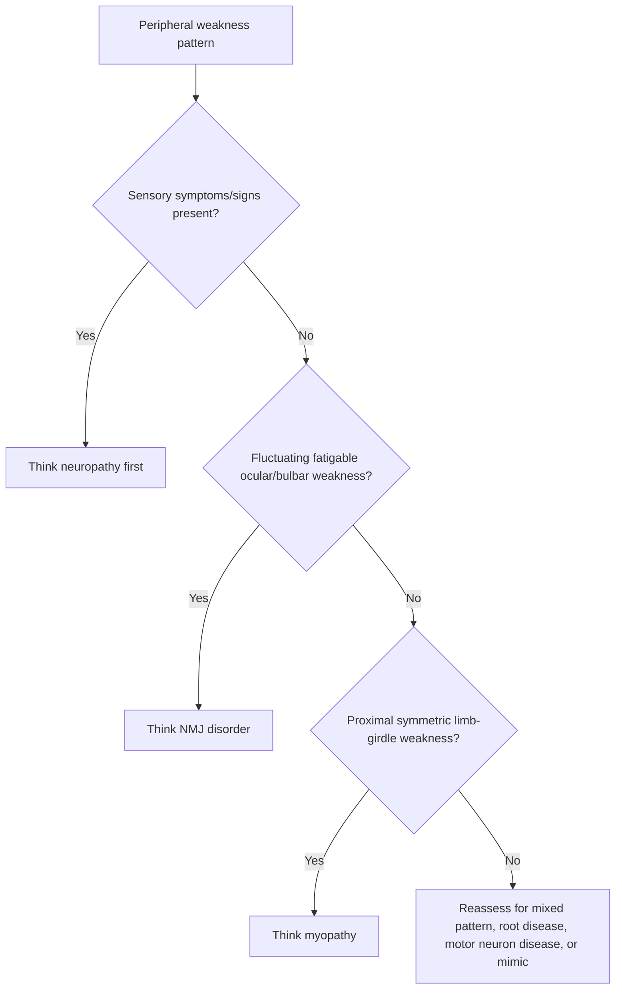
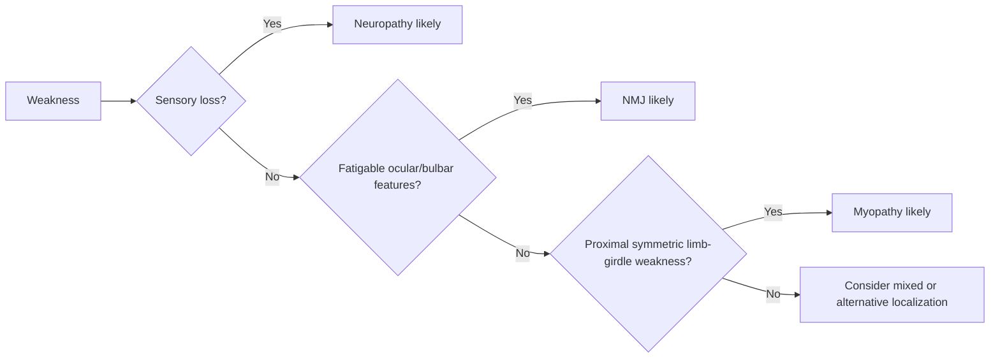

# Neuropathy vs myopathy vs NMJ distinction

Related: [[../Neurology MOC|Neurology MOC]] · [[../Neurophysiological Testing|Neurophysiological Testing]] · [[Nerve conduction studies and EMG]] · [[Demyelinating vs axonal pattern basics]] · [[../Clinical Examination of the Nervous System/UMN vs LMN pattern|UMN vs LMN pattern]] · [[../Localising Lesions in the Central Nervous System/Root vs plexus vs peripheral nerve|Root vs plexus vs peripheral nerve]]

> [!important]
> In FCPS/MRCP neurology, one of the fastest localization wins is to decide whether weakness comes from **peripheral nerve**, **muscle**, or **neuromuscular junction (NMJ)**.

> [!tip]
> Think in three exam pillars: **distribution of weakness**, **sensory/reflex pattern**, and **fatigability vs wasting**. NCS/EMG then confirms the bedside hypothesis.

## Learning Objectives
- Distinguish neuropathy, myopathy, and NMJ disorders clinically.
- Understand the core anatomy and physiology behind each pattern.
- Use NCS/EMG logically rather than as isolated test reports.
- Recognize classic weakness, reflex, sensory, and fatigability profiles.
- Avoid common diagnostic traps such as labeling all proximal weakness as myopathy or all fatigable weakness as “functional.”

## Definition
This topic is a **pattern-recognition distinction** among three major peripheral weakness syndromes:
- **Neuropathy:** disorder of peripheral nerves, roots, or their axons/myelin
- **Myopathy:** primary disease of muscle fibers
- **NMJ disorder:** impaired transmission between motor nerve terminal and muscle end plate

## Relevant Neuroanatomy
### Neuropathy
- affects peripheral nerves, roots, plexuses, or distal axons
- involves motor, sensory, and autonomic fibers variably

### Myopathy
- primary abnormality lies within muscle fibers
- sensory pathways are usually intact

### NMJ disorder
- lesion is at the synapse between motor nerve terminal and skeletal muscle receptor/end plate
- sensory system remains intact because the problem is motor transmission, not sensation

## Relevant Neurophysiology
### Neuropathy
- conduction depends on intact axons and myelin
- axonal loss reduces amplitude; demyelination slows conduction and prolongs latency

### Myopathy
- nerve is intact but muscle fibers generate weak motor unit output
- recruitment pattern changes because each motor unit contributes less force

### NMJ disorder
- transmission safety margin is reduced
- repetitive activity may worsen weakness in myasthenia gravis or improve transiently in some presynaptic disorders

## Normal Values / Important Cut-offs
This is primarily pattern-based, but the bedside rules are high yield:
- **Sensory symptoms/signs suggest neuropathy much more than primary myopathy or NMJ disease.**
- **Fatigability with normal sensation strongly suggests NMJ disease.**
- **Proximal symmetric weakness with preserved sensation suggests myopathy or NMJ disorder more than neuropathy.**
- **Distal weakness with sensory loss and reduced ankle jerks strongly suggests neuropathy.**

## Classification
### By localization
1. neuropathic pattern
2. myopathic pattern
3. NMJ transmission pattern

### By common bedside presentation
1. distal sensorimotor weakness
2. proximal limb-girdle weakness
3. ocular-bulbar fatigable weakness
4. mixed or mimic pattern

## Causes / Etiology
### Neuropathy
- diabetes
- nutritional deficiency
- uremia
- alcohol
- vasculitis
- toxins/drugs
- inflammatory neuropathies
- hereditary neuropathies

### Myopathy
- inflammatory myopathies
- muscular dystrophies
- endocrine myopathy
- steroid/drug myopathy
- metabolic myopathy
- critical illness myopathy

### NMJ disorders
- myasthenia gravis
- Lambert-Eaton myasthenic syndrome
- botulism
- drug-induced transmission impairment

## Risk Factors
### Neuropathy clues
- diabetes, CKD, alcohol, toxins, chemotherapy, malnutrition

### Myopathy clues
- statins, steroids, endocrine disease, connective tissue disease, family history

### NMJ clues
- autoimmune disease, thymic disease, paraneoplastic risk, fluctuating ocular/bulbar symptoms

## Pathophysiology
### Neuropathy
- axonal degeneration or demyelination impairs signal delivery to muscle and sensation from the periphery.

### Myopathy
- muscle fibers cannot generate normal force despite intact nerve conduction.

### NMJ disorder
- nerve impulse arrives, but transmission to muscle fiber is inefficient or blocked.

## Clinical Features
### Neuropathy pattern
- distal > proximal weakness
- sensory loss, tingling, burning, numbness
- reduced or absent reflexes
- foot drop, steppage gait, distal wasting
- autonomic features may coexist

### Myopathy pattern
- proximal > distal weakness
- difficulty climbing stairs, rising from chair, lifting overhead
- sensation preserved
- reflexes often preserved until late or severe weakness
- muscle pain/tenderness sometimes present
- less marked distal sensory complaints

### NMJ pattern
- fluctuating weakness
- fatigability
- ptosis, diplopia, dysarthria, dysphagia common
- limb weakness may be proximal
- sensation normal
- reflexes usually normal in myasthenia gravis; may be reduced in Lambert-Eaton with post-exercise facilitation pattern

## Approach / Algorithm

## Investigations
### Bedside and laboratory frame
- focused neurological examination
- CK when myopathy suspected
- glucose, renal, thyroid, B12, ESR/CRP as indicated
- antibody testing for myasthenia/Lambert-Eaton when relevant
- MRI/spine imaging if root or cord mimic suspected

### NCS/EMG role
#### Neuropathy
- NCS often abnormal
- axonal pattern: reduced amplitudes
- demyelinating pattern: slowed conduction, prolonged latencies, conduction block features

#### Myopathy
- NCS often relatively preserved except CMAP amplitude changes in severe disease
- EMG shows myopathic motor unit pattern with small, short-duration polyphasic units and early recruitment

#### NMJ disorder
- routine NCS may be near normal
- repetitive nerve stimulation or specialized testing shows transmission defect
- EMG localization differs from primary myopathic pattern

## Interpretation Frameworks
### Bedside comparison table
| Feature | Neuropathy | Myopathy | NMJ disorder |
|---|---|---|---|
| Weakness distribution | often distal | often proximal | often fluctuating, ocular/bulbar ± proximal |
| Sensory symptoms | common | absent | absent |
| Reflexes | reduced | often preserved until late | usually normal in MG; may reduce in LEMS |
| Fatigability | not dominant | not classic | prominent |
| Wasting | distal if chronic | may occur | usually minimal early |
| CK | usually normal or mild | often elevated | usually normal |

### Neurophysiology comparison table
| Test pattern | Neuropathy | Myopathy | NMJ disorder |
|---|---|---|---|
| NCS | often abnormal | often near normal | often routine-normal |
| EMG | denervation or neurogenic pattern | myopathic units, early recruitment | transmission-focused abnormality on specialized studies |
| Sensory nerve action potentials | may be reduced | usually preserved | preserved |

## Diagnosis
Diagnosis begins clinically and is then supported by targeted investigations.

### High-yield diagnostic statements
- **Distal weakness + sensory loss + reduced reflexes = neuropathy until proven otherwise.**
- **Proximal weakness + intact sensation = think myopathy or NMJ disorder.**
- **Fluctuating ptosis/diplopia/bulbar fatigue with normal sensation = NMJ disease until proven otherwise.**

## Differential Diagnosis
- motor neuron disease
- cervical/lumbar radiculopathy
- plexopathy
- functional neurological disorder
- central UMN lesion
- metabolic/endocrine weakness
- disuse/deconditioning in frail patients

## Tables / Comparison Charts
### Pattern clue table
| Clue | Most likely localization |
|---|---|
| burning feet, numb toes, absent ankles | neuropathy |
| difficulty rising from chair, preserved sensation | myopathy |
| ptosis worse at evening, diplopia, fatigability | NMJ disorder |
| areflexia improving briefly after exercise | Lambert-Eaton pattern |

## Management
### First principle
Management follows localization:
- identify and treat the cause
- prevent respiratory/bulbar compromise where relevant
- support mobility, swallowing, pain control, and rehabilitation

### Neuropathy priorities
- cause-directed workup
- pain control if painful neuropathy
- falls and foot-care prevention
- treat reversible metabolic/toxic causes

### Myopathy priorities
- CK and cause evaluation
- stop offending drugs if relevant
- immunotherapy where inflammatory myopathy is confirmed
- physiotherapy and complication prevention

### NMJ priorities
- watch for bulbar and respiratory failure
- disease-specific therapy such as pyridostigmine/immunotherapy in MG or tumor search in LEMS
- avoid precipitating drugs

## Drug Interactions / Contraindications / Comorbidity Cautions
- Statins and steroids can cause or worsen myopathic patterns.
- Aminoglycosides, magnesium, and some anesthetic agents may worsen NMJ transmission.
- Diabetes, uremia, alcoholism, and chemotherapy are common neuropathy contexts.
- In respiratory compromise or severe bulbar weakness, do not delay escalation while waiting for full neurophysiology.

## Procedures / Indications / Contraindications
### Procedure mini-section: NCS/EMG
- **Indication:** unclear peripheral weakness localization
- **What it answers:** nerve vs muscle vs NMJ pattern
- **Limitation:** interpretation must fit the bedside examination and disease timing
- **Caution:** acute very early studies may occasionally be nondiagnostic

## Complications
### Neuropathy
- falls, ulcers, neuropathic pain, autonomic complications

### Myopathy
- immobility, aspiration in some inflammatory/myopathic states, respiratory failure in severe disease

### NMJ disorder
- myasthenic crisis, aspiration, respiratory failure

## Red Flags / Emergencies
- rapidly progressive weakness
- bulbar symptoms
- respiratory involvement
- inability to count or single-breath count deterioration
- severe autonomic neuropathy features
- suspected Guillain-Barré syndrome or myasthenic crisis

## Prognosis
Prognosis depends on etiology:
- metabolic/toxic neuropathies may stabilize or improve if corrected
- inflammatory myopathies may respond to treatment
- hereditary myopathies/neuropathies are often chronic
- NMJ disorders may fluctuate but can improve markedly with correct therapy

## Topic Correlation
- [[Demyelinating vs axonal pattern basics]]
- [[../Clinical Examination of the Nervous System/UMN vs LMN pattern|UMN vs LMN pattern]]
- [[../Localising Lesions in the Central Nervous System/Root vs plexus vs peripheral nerve|Root vs plexus vs peripheral nerve]]
- [[../Functional Anatomy and Physiology/Neuromuscular junction and muscle physiology|Neuromuscular junction and muscle physiology]]

## Special Situations
### Elderly patient
Distal sensory loss may coexist with sarcopenia, making neuropathy and myopathy distinction harder.

### ICU patient
Critical illness neuropathy and myopathy can overlap.

### Autoimmune context
Ocular/bulbar fluctuating weakness strongly raises NMJ disease.

### Diabetic patient with proximal weakness
Do not assume all weakness is neuropathy; assess for myopathy or diabetic amyotrophy separately.

## FCPS/MRCP High-Yield Points
- Sensory loss points toward neuropathy.
- Preserved sensation with proximal weakness suggests myopathy or NMJ.
- Fatigability and ocular/bulbar fluctuation suggest NMJ disease.
- Reduced reflexes strongly support neuropathy, though LEMS can also reduce reflexes.
- NCS/EMG confirms the bedside localization rather than replacing it.

## Common Viva Questions
- How do you distinguish neuropathy from myopathy clinically?
- What features suggest NMJ disease rather than myopathy?
- How do NCS and EMG differ in neuropathy vs myopathy?
- Which drugs can worsen myasthenia?

## Common Confusions / Exam Traps
- Calling all proximal weakness “myopathy” without checking fatigability or ocular signs
- Missing sensory clues that strongly indicate neuropathy
- Forgetting that NMJ disorders usually preserve sensation
- Forgetting that reflexes may be normal in myasthenia but reduced in neuropathy

## Mnemonics
### **SFRF** bedside sorter
- **S**ensation lost → neuropathy
- **F**atigability prominent → NMJ
- **R**eflexes reduced distally → neuropathy
- **F**loor/chair climbing difficulty with intact sensation → myopathy

## Mind Map
- Peripheral weakness
  - neuropathy
    - distal
    - sensory loss
    - reflex loss
    - NCS abnormal
  - myopathy
    - proximal
    - sensation spared
    - CK may rise
    - EMG myopathic
  - NMJ
    - fluctuating
    - ocular/bulbar
    - sensation spared
    - repetitive stimulation helps

## Flowchart

## One-Page Revision Summary
- **Neuropathy:** distal weakness, sensory symptoms, reduced reflexes, NCS often abnormal.
- **Myopathy:** proximal weakness, preserved sensation, CK may rise, EMG myopathic.
- **NMJ:** fluctuating fatigable weakness, ptosis/diplopia/bulbar symptoms, preserved sensation, specialized neurophysiology needed.
- Use bedside pattern first, then NCS/EMG to confirm.
- Respiratory and bulbar weakness are danger signs, especially in NMJ disease and severe generalized neuromuscular illness.

## 24-Hour Recall Prompts
- What three bedside features best separate neuropathy, myopathy, and NMJ disease?
- Which pattern gives sensory loss?
- Which gives ocular fatigability?
- Which gives proximal weakness with preserved sensation?

## 7-Day / 15-Day / 30-Day Revision Tracker
- **Day 1:** Can I distinguish the three patterns in one minute?
- **Day 7:** Can I contrast NCS/EMG findings in neuropathy vs myopathy?
- **Day 15:** Can I explain why NMJ disease preserves sensation?
- **Day 30:** Can I solve an SBA using weakness distribution + reflexes + sensation?

## Must Know / Should Know / Nice to Know
### Must Know
- sensory loss → neuropathy
- proximal weakness with preserved sensation → myopathy/NMJ
- fatigability + ocular/bulbar features → NMJ
- NCS/EMG supports bedside localization

### Should Know
- CK role in myopathy
- repetitive stimulation role in NMJ disease
- LEMS reflex nuance

### Nice to Know
- overlap syndromes and critical illness neuromyopathy nuances

## Self-Test Scorecard
- Understanding /10
- Recall /10
- Clinical localization /10
- MCQ performance /10
- SBA performance /10

**Interpretation:**
- **<35/50** = weak topic
- **35–44/50** = acceptable but not secure
- **45+/50** = strong exam-ready topic

## Exam Answer Modes
### Short note style
Neuropathy usually causes distal weakness with sensory loss and reduced reflexes. Myopathy usually causes proximal weakness with preserved sensation and often raised CK. NMJ disorders cause fluctuating fatigable weakness, especially ocular and bulbar, with preserved sensation. NCS/EMG helps confirm bedside localization.

### Viva style
“I first ask about distribution of weakness, sensory symptoms, reflexes, and fatigability. Sensory loss suggests neuropathy, proximal pure weakness suggests myopathy, and fluctuating ocular-bulbar weakness suggests NMJ disease.”

## Summary
This is a localization topic before it is a test topic. Strong candidates recognize the clinical pattern first, then use neurophysiology to confirm whether the pathology is in **nerve**, **muscle**, or **neuromuscular junction**.

## MCQs (10)
1. Distal weakness with numbness and absent ankle jerks most strongly suggests:
   - A. myopathy
   - B. neuropathy
   - C. NMJ disorder
   - D. migraine

2. Preserved sensation with proximal limb-girdle weakness most strongly suggests:
   - A. myopathy
   - B. neuropathy
   - C. vestibular disease
   - D. meningitis

3. Ptosis worsening in the evening with diplopia and normal sensation suggests:
   - A. neuropathy
   - B. NMJ disorder
   - C. myelopathy
   - D. tension headache

4. Which investigation is often elevated in myopathy?
   - A. CK
   - B. bilirubin only
   - C. troponin routinely
   - D. serum amylase always

5. Which feature best supports neuropathy over myopathy?
   - A. sensory loss
   - B. fluctuating ptosis
   - C. purely proximal weakness
   - D. normal sensation

6. Routine sensory nerve action potentials are most likely reduced in:
   - A. neuropathy
   - B. isolated myopathy
   - C. pure NMJ disorder
   - D. functional weakness

7. Fatigability is most characteristic of:
   - A. neuropathy
   - B. myopathy
   - C. NMJ disorder
   - D. cerebellar disease

8. Which statement is most accurate?
   - A. all proximal weakness is myopathy
   - B. normal sensation strongly argues against neuropathy but not against myopathy or NMJ disease
   - C. NMJ disease always causes sensory loss
   - D. NCS/EMG replaces clinical examination

9. A patient has distal wasting, numb feet, and burning pain. Best localization?
   - A. neuropathy
   - B. myopathy
   - C. NMJ disorder
   - D. primary headache disorder

10. In myasthenia gravis, reflexes are usually:
   - A. brisk
   - B. absent because of sensory loss
   - C. normal
   - D. impossible to assess

## SBA Questions (10)
1. A 55-year-old man with diabetes has burning feet, numb toes, distal weakness, and absent ankle jerks. What is the best localization?
   - A. myopathy
   - B. neuropathy
   - C. NMJ disorder
   - D. frontal lobe lesion

2. A 34-year-old woman has difficulty climbing stairs and rising from a chair. Sensation is normal and reflexes are preserved. What is the most likely pattern?
   - A. myopathy
   - B. neuropathy
   - C. cerebellar disorder
   - D. meningitis

3. A 29-year-old woman reports fluctuating ptosis, diplopia, and fatigue worse late in the day. Sensation is normal. Which localization is best?
   - A. neuropathy
   - B. myopathy
   - C. NMJ disorder
   - D. peripheral vestibular disease

4. Which bedside feature most strongly favors neuropathy over NMJ disease?
   - A. sensory loss
   - B. diplopia
   - C. fatigability
   - D. ptosis

5. Which test pattern is most compatible with myopathy?
   - A. reduced sensory potentials as the main abnormality
   - B. myopathic EMG units with early recruitment
   - C. repetitive stimulation decrement as the defining feature only
   - D. normal examination and no weakness

6. Which condition is a classic NMJ disorder?
   - A. myasthenia gravis
   - B. diabetic distal symmetric polyneuropathy
   - C. polymyositis is the only answer
   - D. Bell palsy

7. A patient has proximal weakness, normal sensation, CK elevation, and no ocular fatigability. Best localization?
   - A. myopathy
   - B. neuropathy
   - C. NMJ disorder
   - D. syncope

8. Why is sensation preserved in NMJ disease?
   - A. because the pathology is in motor transmission, not sensory fibers
   - B. because all nerves are central
   - C. because muscle contains sensory ganglia
   - D. because reflexes are always absent

9. Which emergency must be watched for in severe NMJ disease?
   - A. myasthenic crisis with respiratory failure
   - B. subdural hemorrhage by default
   - C. nephrotic syndrome
   - D. glaucoma

10. What is the best use of NCS/EMG in this topic?
   - A. replace the history entirely
   - B. confirm bedside localization among nerve, muscle, and NMJ
   - C. diagnose every cause immediately without context
   - D. rule out all functional symptoms automatically

## Flashcards
- Q: Distal weakness + sensory loss + reduced reflexes suggests what?
  A: Neuropathy.

- Q: Proximal weakness with preserved sensation suggests what broad group?
  A: Myopathy or NMJ disorder.

- Q: Fluctuating ptosis and diplopia point toward what?
  A: NMJ disorder.

- Q: Which condition usually has sensory symptoms?
  A: Neuropathy.

- Q: Which condition often raises CK?
  A: Myopathy.

- Q: Which test helps confirm nerve vs muscle vs NMJ localization?
  A: NCS/EMG.

- Q: Are sensory findings expected in myasthenia gravis?
  A: No.

- Q: What reflex pattern is common in neuropathy?
  A: Reduced or absent reflexes, often distally.

- Q: What is the major emergency in NMJ disease?
  A: Bulbar or respiratory failure / myasthenic crisis.

- Q: One-line distinction rule?
  A: Sensory loss = neuropathy; fatigability = NMJ; proximal pure weakness = myopathy.

## Answer Key with Explanations
### MCQs
1. **B** — distal weakness with numbness and areflexia is classic neuropathy.
2. **A** — proximal weakness with intact sensation strongly suggests myopathy.
3. **B** — fluctuating ocular weakness is highly suggestive of NMJ disease.
4. **A** — CK commonly rises in many myopathies.
5. **A** — sensory loss is the strongest differentiator toward neuropathy.
6. **A** — sensory nerve potentials are often reduced in neuropathy.
7. **C** — fatigability is the hallmark clue for NMJ disease.
8. **B** — preserved sensation argues away from neuropathy, but not away from myopathy or NMJ disease.
9. **A** — distal wasting and sensory pain point to neuropathy.
10. **C** — reflexes are often normal in myasthenia gravis.

### SBAs
1. **B** — diabetic distal symmetric polyneuropathy pattern.
2. **A** — this is a classic proximal myopathic presentation.
3. **C** — fatigable ocular symptoms localize best to the NMJ.
4. **A** — sensory loss is not a feature of primary NMJ disease.
5. **B** — myopathic units and early recruitment support myopathy.
6. **A** — myasthenia gravis is the classic NMJ disease.
7. **A** — proximal weakness + CK rise + preserved sensation suggests myopathy.
8. **A** — NMJ disease affects motor transmission, not sensory pathways.
9. **A** — respiratory and bulbar compromise define the major emergency.
10. **B** — neurophysiology is best used to confirm bedside localization.
