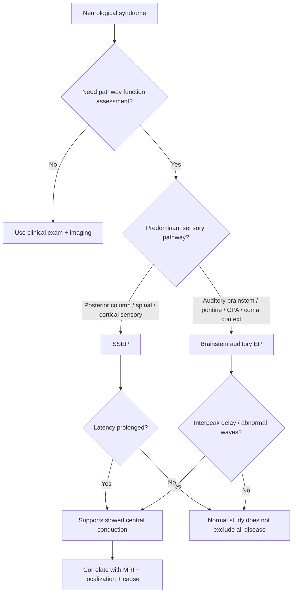
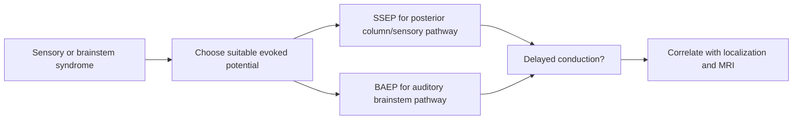

# Somatosensory and brainstem evoked potentials

Related: [[../Neurology MOC|Neurology MOC]] · [[../Neurophysiological Testing|Neurophysiological Testing]] · [[Evoked potentials and specialized testing]] · [[Visual evoked potentials]] · [[How neurophysiology complements imaging]]

> [!important]
> **Somatosensory evoked potentials (SSEPs)** assess conduction from a peripheral sensory stimulus through posterior columns, brainstem, thalamocortical pathways, and sensory cortex. **Brainstem auditory evoked potentials (BAEP/ABR)** assess conduction through the auditory pathway within the brainstem.

> [!tip]
> Exam line: **evoked potentials detect slowed conduction in pathways that may look structurally normal on early imaging, so they are useful adjuncts in demyelination, brainstem disease, and intraoperative or prognostic assessment.**

## Learning Objectives
- Define SSEPs and brainstem evoked potentials.
- Identify the main anatomy assessed by each test.
- Understand the physiological basis of latency prolongation and amplitude reduction.
- Recognize key clinical uses in demyelination, posterior column dysfunction, and brainstem disorders.
- Interpret common result patterns in FCPS/MRCP style.

## Definition
**Evoked potentials** are time-locked electrophysiological responses produced by stimulation of a sensory system.

### Two high-yield forms here
- **SSEPs:** electrical stimulation of a peripheral nerve with recording along the sensory pathway to cortex.
- **Brainstem auditory evoked potentials:** click stimulation of the auditory system with recording of waveforms generated across the auditory nerve and brainstem pathways.

## Relevant Neuroanatomy
### Somatosensory pathway
- peripheral sensory nerve
- dorsal root ganglion
- posterior columns of the spinal cord
- gracile/cuneate nuclei in medulla
- medial lemniscus
- thalamus
- primary sensory cortex

### Brainstem auditory pathway
- cochlea and auditory nerve
- cochlear nuclei
- superior olivary complex
- lateral lemniscus
- inferior colliculus
- upper brainstem relay structures

## Relevant Neurophysiology
- Myelinated fibers conduct rapidly and synchronously.
- Demyelination slows impulse transmission and increases **latency**.
- Severe axonal loss or major structural interruption reduces **amplitude** or abolishes the response.
- Brainstem evoked potentials are useful because many generators lie in compact brainstem relays that may be clinically difficult to assess directly.

## Normal Values / Important Cut-offs
- Exact latencies depend on laboratory standards.
- In exams, the **pattern** matters more than memorizing a single absolute value.
- **Prolonged latency/interpeak delay** = slowed central conduction.
- **Low amplitude/absent response** = severe pathway dysfunction or technical limitation.
- Side-to-side asymmetry is often clinically helpful.

## Classification
### By modality
1. Somatosensory evoked potentials
2. Brainstem auditory evoked potentials

### By broad interpretation
1. normal study
2. delayed central conduction
3. reduced amplitude/poorly formed waveform
4. absent response
5. technically limited study

## Etiology / Causes of Abnormality
### SSEP abnormalities
- multiple sclerosis and other demyelinating disease
- cervical myelopathy
- posterior column lesions
- spinal cord compression
- severe peripheral neuropathy affecting afferent input
- metabolic or inflammatory myelopathy

### Brainstem auditory evoked potential abnormalities
- brainstem demyelination
- pontine/brainstem lesions
- vestibulocochlear nerve disease
- acoustic neuroma/CPA lesions in selected settings
- severe hearing pathway dysfunction
- coma/anoxic injury prognostication contexts

## Risk Factors / Clinical Contexts
- suspected MS with brainstem or spinal involvement
- clinical myelopathy with equivocal imaging
- unexplained sensory pathway dysfunction
- suspected brainstem lesion
- coma/critical illness when brainstem functional assessment is relevant
- operative settings where pathway monitoring is needed

## Pathophysiology
1. Controlled sensory stimulation is applied.
2. Electrical activity propagates through defined sensory relays.
3. Recording electrodes detect responses at sequential levels.
4. Demyelination slows conduction, prolonging peak or interpeak latency.
5. Structural interruption or severe axonal loss lowers amplitude or abolishes responses.

## Clinical Features / Indications
### When SSEPs help
- suspected posterior column disease
- sensory myelopathy
- demyelinating spinal/brain pathways
- objective confirmation of conduction delay when MRI/clinical data are incomplete

### When brainstem evoked potentials help
- suspected brainstem pathology
- suspected auditory pathway conduction disorder
- demyelinating disease with brainstem symptoms
- selected prognostic or operative-monitoring situations

## Approach / Algorithm

## Investigations
Interpret these tests with:
- full neurological examination
- hearing history/otology context when relevant
- MRI brain and/or spine
- peripheral nerve studies if mixed pathology is possible
- CSF and inflammatory workup in demyelinating disease

## Interpretation Frameworks
### SSEP and BAEP basics
| Finding | Meaning |
|---|---|
| Prolonged latency | slowed conduction, often demyelination or central pathway dysfunction |
| Interpeak delay | lesion between relay points, especially central conduction slowing |
| Reduced amplitude | severe pathway dysfunction or poor input |
| Absent response | major lesion, severe dysfunction, or technical issue |
| Normal study | no major detectable conduction delay on this test |

### Practical localization table
| Test | Main area assessed | Typical high-yield use |
|---|---|---|
| SSEP | posterior column-medial lemniscus to cortex | myelopathy, demyelination, sensory pathway dysfunction |
| Brainstem auditory EP | auditory nerve and brainstem auditory relays | brainstem lesion, demyelination, coma/prognostic support |

## Diagnosis
These tests are **supportive** rather than stand-alone diagnostic tools.

Useful exam statement:
- “SSEPs or brainstem evoked potentials show objective pathway dysfunction and may support localization when clinical examination and imaging need functional correlation.”

## Differential Diagnosis
Abnormal studies may reflect:
- demyelination
- compressive myelopathy
- posterior column degeneration
- severe peripheral afferent disorder
- brainstem lesion
- auditory pathway disease
- technical artifact or inadequate cooperation

## Tables / Comparison Charts
### SSEP vs brainstem auditory evoked potential
| Feature | SSEP | Brainstem auditory EP |
|---|---|---|
| Stimulus | peripheral nerve electrical stimulus | auditory click stimulus |
| Major pathway | posterior column-medial lemniscus-cortex | auditory nerve-brainstem auditory relays |
| High-yield use | myelopathy, demyelination | brainstem lesion, demyelination |
| Typical abnormality | prolonged central conduction | delayed/abnormal waves or interpeak intervals |

## Management
### How results influence management
- support further imaging and inflammatory workup
- document objective CNS sensory pathway dysfunction
- strengthen localization in complex neurology cases
- guide monitoring or prognostication in selected settings

### What they do not replace
- careful neurological examination
- MRI for structural lesions
- hearing assessment when auditory pathology is suspected

## Drug Interactions / Contraindications / Comorbidity Cautions
- Sedation, reduced cooperation, severe sensory loss, or hearing impairment may alter interpretation.
- Peripheral neuropathy can affect SSEP input and mimic more central delay.
- Brainstem auditory EP abnormalities are not specific for one disease.
- Normal tests do not fully exclude demyelination or small lesions.

## Procedures / Indications / Contraindications
### Procedure mini-section: SSEP / BAEP
- **Indication:** objective assessment of sensory or brainstem pathway conduction
- **Principle:** record time-locked electrical responses after standardized stimulation
- **Contraindication:** no major absolute contraindication; limitations are practical/interpretive rather than procedural
- **Complication:** negligible physical risk; major risk is overinterpretation

## Complications
The test itself is safe. Clinical problems arise from:
- false reassurance from a normal study
- overcalling non-specific abnormalities
- mislocalizing disease without integrating clinical findings

## Red Flags / Emergencies
- acute myelopathy
- rapid brainstem syndrome
- reduced consciousness with suspected brainstem dysfunction
- combined cranial nerve and long-tract signs

## Prognosis
Prognosis depends on the underlying disease. The evoked potential pattern may:
- support objective baseline documentation
- show severity of pathway dysfunction
- help track progression in selected chronic disease states

## Topic Correlation
- [[Visual evoked potentials]]
- [[How neurophysiology complements imaging]]
- [[../Neuroimaging/MRI spine indications|MRI spine indications]]
- [[../Neuroimaging/Demyelination vs tumor vs infection pattern clues|Demyelination vs tumor vs infection pattern clues]]
- [[../Clinical Examination of the Nervous System/Cortical vs brainstem vs spinal vs peripheral pattern|Cortical vs brainstem vs spinal vs peripheral pattern]]

## Special Situations
- **Coma/critical care:** BAEPs may contribute to brainstem functional assessment.
- **Spinal cord disease:** SSEPs may support posterior column dysfunction when exam findings are subtle.
- **Demyelinating disease:** useful when symptoms suggest a lesion not clearly captured clinically.

## FCPS/MRCP High-Yield Points
- SSEPs test posterior column-medial lemniscus pathway integrity.
- Brainstem auditory EPs test auditory conduction through the brainstem.
- Delayed latency/interpeak delay suggests conduction slowing, especially demyelination.
- These are adjuncts, not replacements, for MRI and clinical localization.
- Use them when function needs to be demonstrated in addition to structure.

## Common Viva Questions
1. What does SSEP assess?
2. Which pathway is assessed by brainstem auditory evoked potentials?
3. What does prolonged latency mean?
4. Why can evoked potentials be abnormal when imaging is not dramatic?
5. What are the limitations of these tests?

## Common Confusions / Exam Traps
- Do not confuse **functional conduction testing** with structural imaging.
- Do not say abnormal SSEPs diagnose MS by themselves.
- Do not ignore peripheral input problems when interpreting SSEPs.
- Do not treat a normal BAEP as excluding all brainstem disease.

## Mnemonics
- **SSEP = Sensory Spinal-to-cortex Evoked Potential**
- **BAEP = Brainstem Auditory Evoked Potential**

## Mind Map
- Evoked potentials
  - SSEP
    - posterior columns
    - central sensory conduction
    - myelopathy / demyelination
  - BAEP
    - auditory nerve
    - brainstem relays
    - brainstem lesion / demyelination
  - interpretation
    - latency delay
    - amplitude reduction
    - absent response

## Flowchart

## Suggested Visuals / Image Notes
- posterior column-medial lemniscus pathway diagram
- auditory brainstem relay schematic
- waveform illustration showing latency delay

## One-Page Revision Summary
- **SSEP:** peripheral sensory stimulus to cortex; assesses posterior column-central sensory conduction.
- **BAEP:** auditory click to brainstem waveforms; assesses auditory brainstem conduction.
- **Abnormality pattern:** prolonged latency or interpeak delay = slowed conduction.
- **Uses:** demyelination, myelopathy, brainstem lesion, selected coma/prognostic settings.
- **Core rule:** complements examination and MRI; does not replace them.

## 24-Hour Recall Prompts
- Define SSEP and BAEP without notes.
- State one classic indication for each.
- Explain why latency prolongation occurs in demyelination.
- List two limitations of evoked potentials.

## 7-Day / 15-Day / 30-Day Revision Tracker
- **7 days:** redraw pathways from memory.
- **15 days:** compare SSEP, VEP, and EEG in one table.
- **30 days:** answer a viva on functional testing versus imaging.

## Must Know / Should Know / Nice to Know
### Must Know
- pathway tested by SSEP and BAEP
- delayed latency = slowed conduction
- role as adjunct to MRI and clinical exam

### Should Know
- examples of demyelinating and myelopathic indications
- limitations caused by peripheral or auditory input problems

### Nice to Know
- intraoperative monitoring and prognostic applications

## Self-Test Scorecard
- Definition and pathway recall /10
- Interpretation confidence /10
- Clinical application /10
- Differential thinking /10
- Viva readiness /10

## Summary
Somatosensory and brainstem evoked potentials are functional neurophysiology tools that objectively assess conduction through central sensory and auditory brainstem pathways. Their major value is to support localization, demonstrate conduction delay, and complement structural imaging, particularly in demyelinating disease, myelopathy, and brainstem disorders.

## MCQs (10)
1. Somatosensory evoked potentials mainly assess the integrity of the:
   - A. Corticospinal tract
   - B. Posterior column-medial lemniscus pathway
   - C. Basal ganglia output pathway
   - D. Cerebellothalamic pathway
   - **Answer: B**
2. Brainstem auditory evoked potentials are most useful for assessing:
   - A. Visual cortex function
   - B. Neuromuscular junction transmission
   - C. Auditory pathway conduction through the brainstem
   - D. Frontal lobe perfusion
   - **Answer: C**
3. Prolonged latency on an evoked potential usually suggests:
   - A. Faster conduction
   - B. Slowed conduction
   - C. Psychogenic illness only
   - D. Normal variant always
   - **Answer: B**
4. SSEPs are especially helpful in:
   - A. Posterior column dysfunction
   - B. Pure aphasia
   - C. Migraine prophylaxis choice
   - D. Delirium screening
   - **Answer: A**
5. A major limitation of SSEP interpretation is that:
   - A. Peripheral nerve disease can affect the response
   - B. MRI becomes unnecessary
   - C. The test is always disease-specific
   - D. It has no role in demyelination
   - **Answer: A**
6. Brainstem auditory evoked potentials may be abnormal in:
   - A. Brainstem demyelination
   - B. Isolated gout
   - C. Functional tremor only
   - D. Asthma
   - **Answer: A**
7. Reduced amplitude on evoked potentials generally suggests:
   - A. Severe dysfunction or poor input
   - B. Better conduction
   - C. Hyperreflexia
   - D. Normal posterior columns
   - **Answer: A**
8. Evoked potentials primarily provide:
   - A. Structural imaging detail
   - B. Functional conduction assessment
   - C. CSF cell count
   - D. Drug levels
   - **Answer: B**
9. In demyelination, the most expected change is:
   - A. Latency prolongation
   - B. Consistently increased amplitude
   - C. Zero clinical significance
   - D. Immediate diagnosis of stroke
   - **Answer: A**
10. The best overall statement is:
   - A. Evoked potentials replace MRI
   - B. Evoked potentials complement MRI and clinical localization
   - C. Evoked potentials diagnose MS alone
   - D. Evoked potentials have no neurological use
   - **Answer: B**

## SBA Questions (10)
1. A 29-year-old woman has sensory ataxia and suspected cervical myelopathy. MRI is equivocal. Which neurophysiological test best documents posterior column conduction delay?  
   **Answer: Somatosensory evoked potentials**
2. A patient with diplopia and long-tract signs is suspected to have a demyelinating brainstem lesion. Which test may support objective brainstem pathway dysfunction?  
   **Answer: Brainstem auditory evoked potentials**
3. A registrar says an abnormal SSEP proves multiple sclerosis. What is the best correction?  
   **Answer: It is supportive only and must be interpreted with clinical and imaging findings.**
4. A patient has severe peripheral neuropathy and delayed SSEPs. What important caution applies?  
   **Answer: Peripheral input abnormality can contribute to delayed responses.**
5. In a patient with suspected posterior column disease, which pathway is mainly assessed by SSEP?  
   **Answer: Posterior column-medial lemniscus pathway**
6. A patient has an auditory brainstem pathway lesion. Which neurophysiological test is most relevant?  
   **Answer: Brainstem auditory evoked potentials**
7. What is the main physiological explanation for prolonged evoked-potential latency in demyelination?  
   **Answer: Slowed saltatory conduction in demyelinated fibers**
8. A patient has a normal BAEP but persistent focal brainstem signs. What is the best next principle?  
   **Answer: Normal BAEP does not exclude brainstem disease; continue clinical and imaging correlation.**
9. During exam viva, you are asked why evoked potentials can be useful when MRI is nondiagnostic. What is the best answer?  
   **Answer: They provide functional evidence of conduction abnormality even when structural changes are subtle.**
10. A patient in critical care is being assessed for possible brainstem dysfunction. Which modality may contribute supportive functional data?  
   **Answer: Brainstem auditory evoked potentials**

## Flashcards
- Q: What pathway does SSEP mainly assess?  
  A: Posterior column-medial lemniscus sensory pathway to cortex.
- Q: What does BAEP assess?  
  A: Auditory nerve and brainstem auditory conduction pathways.
- Q: What does prolonged latency imply?  
  A: Slowed conduction, often due to demyelination.
- Q: Do evoked potentials replace MRI?  
  A: No, they complement MRI and clinical localization.
- Q: What can reduce SSEP amplitude besides central disease?  
  A: Severe peripheral afferent dysfunction.

## Answer Key with Explanations
- **SSEP** is the high-yield test for posterior column-central sensory conduction.
- **BAEP** supports assessment of auditory brainstem pathways.
- **Latency delay** is the classic sign of conduction slowing.
- These tests are **supportive, not disease-specific**, and must be integrated with examination and imaging.
