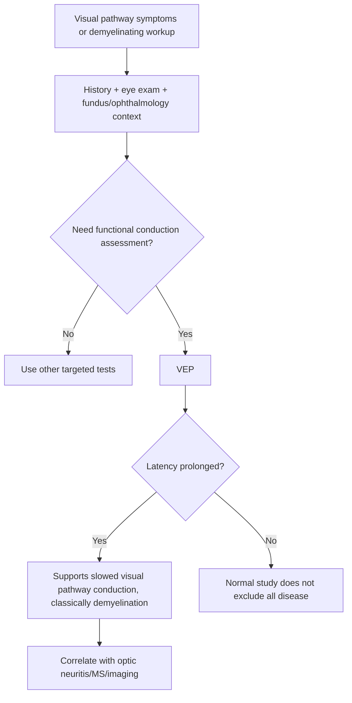
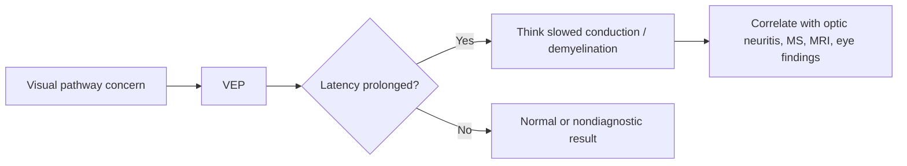

# Visual evoked potentials

Related: [[../Neurology MOC|Neurology MOC]] · [[../Neurophysiological Testing|Neurophysiological Testing]] · [[Evoked potentials and specialized testing]] · [[Somatosensory and brainstem evoked potentials]] · [[../Neuro-inflammatory Diseases/Optic neuritis, myelitis, and brainstem syndromes in MS|Optic neuritis, myelitis, and brainstem syndromes in MS]] · [[../Neuro-inflammatory Diseases/MRI dissemination in time and space concept|MRI dissemination in time and space concept]]

> [!important]
> **Visual evoked potentials (VEPs)** test the functional integrity of the visual pathway from retina to occipital cortex and are classically used to detect **optic nerve conduction delay**, especially in **demyelination such as optic neuritis/MS**.

> [!tip]
> High-yield exam line: **prolonged VEP latency suggests slowed conduction in the visual pathway, especially optic nerve demyelination.**

## Learning Objectives
- Define VEP and explain what part of the nervous system it assesses.
- Understand the anatomy and physiology of the visual pathway relevant to VEPs.
- Recognize the main clinical indications, especially optic neuritis and multiple sclerosis.
- Interpret prolonged latency versus reduced amplitude at a basic exam level.
- Know the limitations of VEPs and why they complement rather than replace imaging and clinical assessment.

## Definition
**Visual evoked potentials** are electrophysiological responses recorded from the occipital cortex after standardized visual stimulation, usually patterned visual stimuli. They assess conduction through the:
- retina
- optic nerve
- optic chiasm
- optic tract
- optic radiations
- visual cortex pathway as a functional system

In clinical neurology, VEP is most often used to detect **subclinical or previous optic pathway dysfunction**, especially demyelinating disease.

## Relevant Neuroanatomy
- retinal ganglion cell axons form the optic nerve
- fibers partially cross at the optic chiasm
- conduction continues through optic tracts to lateral geniculate nuclei
- optic radiations carry signals to the occipital cortex
- VEP reflects the integrity of the whole afferent visual conduction pathway, though optic nerve disease is the classic high-yield lesion

## Relevant Neurophysiology
- visual stimuli generate synchronized cortical responses measurable over the occipital region
- intact myelination allows rapid conduction from retina to cortex
- demyelination slows transmission, producing **prolonged latency**
- severe axonal loss may reduce response amplitude or abolish the response

## Normal Values / Important Cut-offs
Laboratory reference ranges vary, but the key exam rule is:
- **prolonged latency** suggests slowed conduction, often demyelination
- **reduced amplitude** suggests reduced functional input, often more severe or axonal damage
- VEP is primarily an **interpretation-pattern** topic rather than a fixed-threshold topic in bedside exams

## Classification
### Practical VEP result categories
1. normal VEP
2. prolonged latency
3. reduced amplitude
4. absent/poorly recordable response

### Clinical interpretation groups
1. optic nerve demyelination pattern
2. previous optic neuritis/subclinical lesion
3. non-specific reduced response due to severe visual pathway damage
4. technically limited or uninterpretable study

## Causes / Etiology of Abnormal VEPs
- optic neuritis
- multiple sclerosis and other demyelinating disease
- compressive optic neuropathy
- ischemic optic neuropathy
- severe visual pathway lesions
- toxic/nutritional optic neuropathies in selected contexts

## Risk Factors / Clinical Contexts Increasing VEP Value
- painful visual loss suggestive of optic neuritis
- previous transient visual symptoms
- suspected multiple sclerosis with dissemination concerns
- unexplained afferent visual pathway dysfunction
- clinical suspicion of subclinical optic nerve involvement

## Pathophysiology
1. visual stimulus is presented in a standardized way
2. impulses travel along the afferent visual pathway
3. cortical response is recorded from the occipital cortex
4. demyelination slows conduction, so latency increases
5. severe structural or axonal damage may reduce amplitude or abolish responses

## Clinical Features / Indications
### When VEP is most helpful
- suspected **optic neuritis**
- evidence of possible **subclinical optic pathway demyelination**
- support for dissemination in a demyelinating disease workup
- selected unexplained visual pathway complaints when functional integrity assessment is useful

### Typical clinical clues
- painful monocular visual loss
- reduced visual acuity or color vision
- relative afferent pupillary defect
- history suggestive of previous optic neuritis
- MS-type syndrome with uncertain prior optic involvement

## Approach / Algorithm

## Investigations
### VEP should be interpreted alongside
- visual acuity and color vision
- pupillary examination for RAPD
- fundoscopic/ophthalmic assessment
- MRI brain/orbits when demyelination or structural disease is suspected
- broader demyelinating workup when clinically relevant

### Test output focus
- latency of main cortical response
- amplitude of response
- reproducibility and technical adequacy

## Interpretation Frameworks
### VEP basics table
| Finding | Meaning |
|---|---|
| Prolonged latency | slowed conduction, classically demyelination |
| Reduced amplitude | reduced functional input / more severe pathway damage |
| Absent response | severe dysfunction or technical limitation |
| Normal VEP | no obvious conduction abnormality captured |

### High-yield clinical correlation table
| Scenario | VEP role |
|---|---|
| Suspected optic neuritis | useful supportive test |
| Multiple sclerosis workup | may reveal prior/subclinical optic pathway involvement |
| Compressive optic neuropathy | may be abnormal but not specific |
| Functional visual complaint | may help when objective conduction assessment is needed |

## Diagnosis
VEP does **not** diagnose multiple sclerosis by itself. It provides supportive evidence of visual pathway dysfunction, especially optic nerve conduction delay.

A strong exam statement is:
- “Prolonged VEP latency supports optic nerve demyelination, for example in optic neuritis or MS, but must be correlated with clinical findings and MRI.”

## Differential Diagnosis
Abnormal VEP may occur in:
- optic neuritis
- prior demyelinating optic nerve lesion
- compressive optic neuropathy
- ischemic optic neuropathy
- other severe visual pathway disease

Therefore, VEP is **sensitive to dysfunction but not disease-specific by itself**.

## Tables / Comparison Charts
### Latency vs amplitude interpretation
| Pattern | Likely implication |
|---|---|
| delayed latency with preserved form | conduction slowing/demyelination |
| low amplitude | reduced functional axonal input or severe damage |
| absent response | marked lesion or technical limitation |

## Management
### How VEP influences management
- supports suspected optic neuritis when the history/exam fit
- supports evidence of prior visual pathway demyelination in MS context
- helps document objective visual pathway dysfunction
- may guide need for further imaging or demyelinating evaluation

### What VEP should not do alone
- it should not replace careful visual examination
- it should not replace MRI when structural or demyelinating disease is suspected
- it should not be overinterpreted as specific for MS without context

## Drug Interactions / Contraindications / Comorbidity Cautions
- Visual acuity limitations, media opacity, poor cooperation, and severe ophthalmic disease can affect test quality.
- VEP abnormalities may reflect ophthalmic or compressive disease, not only demyelination.
- A normal or equivocal VEP does not cancel a strong clinical optic neuritis history.

## Procedures / Indications / Contraindications
### Procedure mini-section: VEP
- **Indication:** suspected visual pathway conduction disorder, especially optic neuritis/demyelination
- **Principle:** measure cortical response timing after visual stimulation
- **Limitation:** supportive, not disease-specific
- **Caution:** interpret with ophthalmology and MRI context when needed

## Complications
There are no major invasive complications; the main issue is **diagnostic misinterpretation**:
- overcalling MS from a nonspecific abnormal VEP
- underrecognizing severe visual pathway disease when amplitude is low or responses are absent

## Red Flags / Emergencies
- acute painful visual loss
- RAPD with reduced color vision
- bilateral severe visual decline
- neurological syndrome suggesting optic neuritis plus other CNS involvement
- signs suggesting compressive or ischemic optic neuropathy requiring urgent evaluation

## Prognosis
Prognosis depends on the cause:
- optic neuritis may recover clinically but leave persistent conduction delay
- demyelinating disease may produce subclinical abnormalities between attacks
- severe axonal or compressive injury may lead to more persistent amplitude loss

## Topic Correlation
- [[Somatosensory and brainstem evoked potentials]]
- [[../Neuro-inflammatory Diseases/Optic neuritis, myelitis, and brainstem syndromes in MS|Optic neuritis, myelitis, and brainstem syndromes in MS]]
- [[../Neuro-inflammatory Diseases/MRI dissemination in time and space concept|MRI dissemination in time and space concept]]
- [[../Neuro-inflammatory Diseases/CSF oligoclonal bands|CSF oligoclonal bands]]

## Special Situations
### Previous optic neuritis
Latency may remain prolonged even after visual recovery.

### Multiple sclerosis workup
VEP can demonstrate clinically silent prior optic pathway involvement.

### Poor visual acuity or eye disease
Interpretation may be limited; correlate with ophthalmologic findings.

## FCPS/MRCP High-Yield Points
- VEP assesses the visual pathway functionally.
- Prolonged latency is the classic demyelination clue.
- Optic neuritis and MS are the classic exam associations.
- Reduced amplitude suggests more severe or axonal dysfunction.
- VEP complements but does not replace MRI and clinical examination.

## Common Viva Questions
- What does VEP assess?
- Why is VEP useful in optic neuritis?
- What does prolonged VEP latency mean?
- Can VEP diagnose MS by itself?

## Common Confusions / Exam Traps
- saying VEP is specific for MS
- forgetting that latency is the main demyelination clue
- ignoring ophthalmic causes of abnormal VEP
- overusing VEP when MRI/eye examination already answers the main question

## Mnemonics
### **VEP = Vision Electrically Proved**
- functional proof of visual pathway conduction

### **LATE = LESION OF MYELIN**
- prolonged **LATE**ncy suggests myelin-related conduction delay

## Mind Map
- VEP
  - assesses visual pathway
  - key use
    - optic neuritis
    - MS support
  - abnormalities
    - prolonged latency
    - low amplitude
    - absent response
  - limitations
    - not disease specific
    - needs MRI/clinical correlation

## Flowchart

## One-Page Revision Summary
- VEP measures conduction through the visual pathway.
- Main exam use: **optic neuritis / multiple sclerosis support**.
- **Prolonged latency** = slowed conduction, classically demyelination.
- **Reduced amplitude** = reduced effective input or more severe damage.
- VEP is supportive, not specific; always correlate with clinical findings and MRI.

## 24-Hour Recall Prompts
- What structure/pathway does VEP assess?
- What is the classic abnormality in optic neuritis?
- Why can VEP be useful in MS?
- Why is VEP not specific for MS?

## 7-Day / 15-Day / 30-Day Revision Tracker
- **Day 1:** Can I define VEP in one line?
- **Day 7:** Can I explain why prolonged latency suggests demyelination?
- **Day 15:** Can I list the main indications for VEP?
- **Day 30:** Can I answer an SBA comparing VEP with MRI in optic neuritis workup?

## Must Know / Should Know / Nice to Know
### Must Know
- VEP assesses visual pathway conduction
- prolonged latency suggests demyelination
- optic neuritis/MS are classic associations
- VEP is supportive, not definitive alone

### Should Know
- reduced amplitude suggests more severe dysfunction
- prior optic neuritis may leave persistent delay
- VEP complements MRI and exam

### Nice to Know
- technical waveform component naming nuances
- advanced ophthalmic differential subtleties

## Self-Test Scorecard
- Understanding /10
- Recall /10
- Clinical correlation /10
- MCQ performance /10
- SBA performance /10

**Interpretation:**
- **<35/50** = weak topic
- **35–44/50** = acceptable but not secure
- **45+/50** = strong exam-ready topic

## Exam Answer Modes
### Short note style
Visual evoked potentials assess functional conduction in the visual pathway from retina to occipital cortex. Their classic use is in optic neuritis and multiple sclerosis. Prolonged latency suggests demyelination, while reduced amplitude suggests more severe pathway damage. VEP is supportive but not specific and must be interpreted with the clinical picture and MRI.

### Viva style
“VEP is mainly used to assess optic pathway conduction. In neurology exams, prolonged latency is the classic clue to optic nerve demyelination, especially optic neuritis or MS.”

## Summary
VEP is the classic neurophysiology test for **functional optic pathway conduction delay**. In exams, remember the pairing: **optic neuritis/MS → prolonged latency**.

## MCQs (10)
1. Visual evoked potentials primarily assess:
   - A. auditory cortex
   - B. visual pathway conduction
   - C. neuromuscular junction
   - D. cerebellar output only

2. The classic VEP abnormality in optic neuritis is:
   - A. prolonged latency
   - B. absent ankle jerk
   - C. reduced CK
   - D. hypernatremia

3. VEP is especially useful in supporting:
   - A. optic pathway demyelination
   - B. nephrotic syndrome
   - C. pneumonia
   - D. BPPV

4. Reduced VEP amplitude generally suggests:
   - A. more severe pathway dysfunction or axonal loss
   - B. pure meningitis only
   - C. normal conduction
   - D. myasthenia gravis specifically

5. Which disease is classically associated with VEP use?
   - A. multiple sclerosis
   - B. appendicitis
   - C. asthma
   - D. gout

6. VEP should be interpreted alongside:
   - A. clinical examination and MRI when appropriate
   - B. hair texture only
   - C. stool microscopy only
   - D. ankle-brachial index only

7. Which statement is most accurate?
   - A. VEP is specific for MS
   - B. VEP can support optic pathway dysfunction but is not disease-specific alone
   - C. VEP replaces eye examination
   - D. VEP is mainly for hearing loss

8. Painful monocular visual loss most classically raises suspicion for:
   - A. optic neuritis
   - B. BPPV
   - C. myopathy
   - D. meningococcal sepsis

9. A normal VEP means:
   - A. all visual pathway disease is excluded
   - B. the study is normal but must still be clinically interpreted
   - C. MS is impossible
   - D. MRI is never needed

10. Prolonged latency mainly reflects:
   - A. slowed conduction
   - B. increased muscle bulk
   - C. hyperreflexia only
   - D. renal failure by itself

## SBA Questions (10)
1. A 25-year-old woman has painful loss of vision in one eye with impaired color vision. Which neurophysiological test may support optic nerve demyelination?
   - A. visual evoked potentials
   - B. ECG
   - C. spirometry
   - D. nerve biopsy first-line in all cases

2. A patient with suspected multiple sclerosis has previous transient visual symptoms but no current major deficit. Why might VEP be helpful?
   - A. it may show prior/subclinical optic pathway conduction delay
   - B. it diagnoses renal disease
   - C. it confirms migraine only
   - D. it measures CSF pressure directly

3. What is the best interpretation of prolonged VEP latency?
   - A. slowed visual pathway conduction, classically demyelination
   - B. pure myopathy
   - C. vestibular failure
   - D. bacterial meningitis alone

4. Which statement best reflects the role of VEP in MS?
   - A. VEP alone confirms MS in all patients
   - B. VEP is supportive evidence and must be correlated clinically and radiologically
   - C. VEP is never useful in MS
   - D. VEP replaces CSF and MRI in all cases

5. Which feature most limits VEP specificity?
   - A. other optic pathway disorders can also cause abnormal results
   - B. VEP only works in children
   - C. VEP measures serum sodium
   - D. VEP is a muscle test

6. A patient recovers visually after optic neuritis. Which VEP abnormality may still remain?
   - A. prolonged latency
   - B. ankle clonus
   - C. hypercalcemia
   - D. absent plantar response

7. A normal VEP in a patient with previous symptoms means:
   - A. all pathology is excluded
   - B. the result must still be interpreted in context
   - C. optic neuritis is impossible
   - D. MRI becomes contraindicated

8. Which bedside sign supports an optic neuritis context for VEP interpretation?
   - A. reduced color vision / RAPD
   - B. positive Romberg from BPPV
   - C. distal areflexia only
   - D. calf tenderness

9. Which finding generally suggests more severe visual pathway damage rather than just slowed conduction?
   - A. reduced amplitude
   - B. prolonged latency only
   - C. brisk reflexes
   - D. photophobia alone

10. What is the best exam summary for VEP?
   - A. it is a test of visual pathway conduction, especially useful in optic neuritis/MS
   - B. it is mainly a test for peripheral vertigo
   - C. it is a cardiac conduction study
   - D. it is specific for all causes of visual loss

## Flashcards
- Q: What does VEP assess?
  A: Functional conduction in the visual pathway.

- Q: Classic VEP abnormality in optic neuritis?
  A: Prolonged latency.

- Q: Classic chapter association for VEP?
  A: Optic neuritis and multiple sclerosis.

- Q: Does VEP diagnose MS by itself?
  A: No.

- Q: What can reduced amplitude suggest?
  A: More severe dysfunction or axonal damage.

- Q: What exam pair should you remember?
  A: VEP + optic neuritis/MS.

- Q: What bedside signs support optic neuritis?
  A: Painful visual loss, color desaturation, RAPD.

- Q: Can previous optic neuritis leave persistent VEP delay?
  A: Yes.

- Q: Does VEP replace MRI?
  A: No.

- Q: Best one-line principle?
  A: VEP delay means slowed visual pathway conduction, often demyelination.

## Answer Key with Explanations
### MCQs
1. **B** — VEP assesses visual pathway conduction.
2. **A** — prolonged latency is the classic optic neuritis clue.
3. **A** — VEP is especially useful in optic pathway demyelination.
4. **A** — reduced amplitude suggests more severe dysfunction or axonal loss.
5. **A** — multiple sclerosis is the classic association.
6. **A** — VEP must be interpreted with the broader clinical picture and imaging.
7. **B** — VEP is supportive, not disease-specific alone.
8. **A** — painful monocular visual loss is classic for optic neuritis.
9. **B** — normal results still need clinical interpretation.
10. **A** — prolonged latency reflects slowed conduction.

### SBAs
1. **A** — VEP is the classic supportive neurophysiology test here.
2. **A** — VEP can reveal previous or subclinical optic pathway involvement.
3. **A** — this is the key interpretation.
4. **B** — VEP supports but does not by itself confirm MS.
5. **A** — abnormal VEPs are not unique to demyelination.
6. **A** — latency may remain prolonged after clinical recovery.
7. **B** — a normal result never replaces clinical judgment.
8. **A** — these are classic optic neuritis clues.
9. **A** — low amplitude suggests more severe pathway damage.
10. **A** — that is the best concise exam statement.
