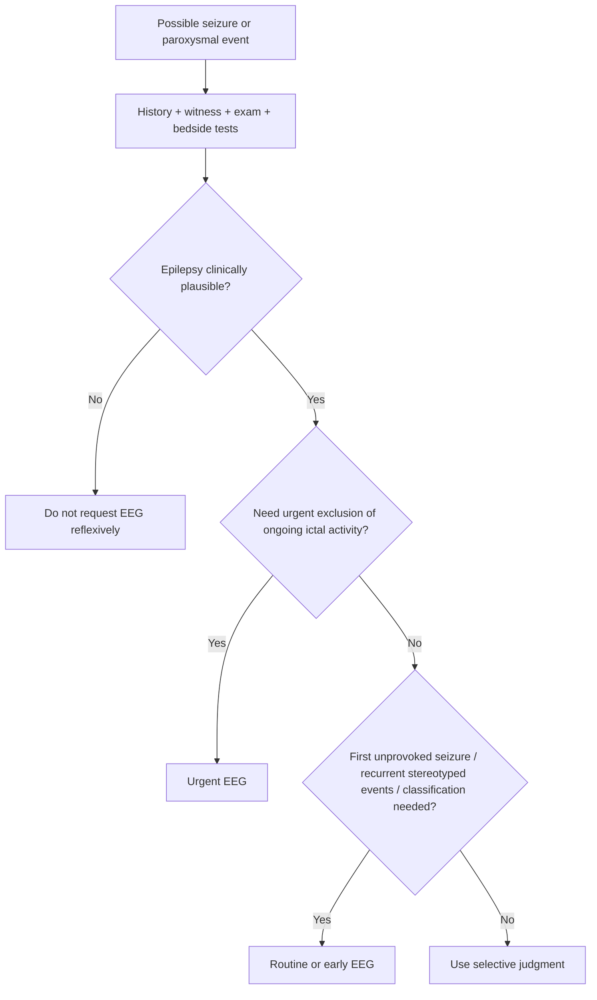
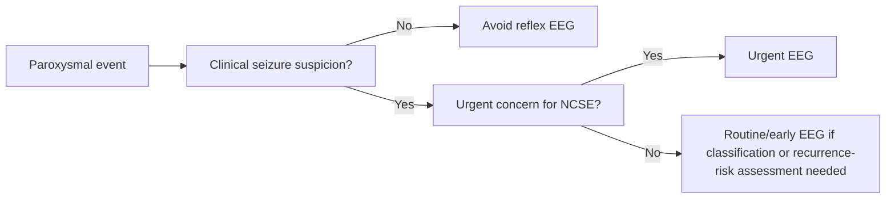

# When to request EEG

Related: [[../Neurology MOC|Neurology MOC]] · [[../Neurophysiological Testing|Neurophysiological Testing]] · [[EEG]] · [[Epileptiform activity basics]] · [[Limitations of a normal EEG]] · [[../Epilepsy/History, witness account, labs, ECG, neuroimaging, and EEG|History, witness account, labs, ECG, neuroimaging, and EEG]] · [[../Epilepsy/Provoked vs unprovoked seizure|Provoked vs unprovoked seizure]]

> [!important]
> EEG is a **supportive diagnostic and classification tool**, not a reflex test for every blackout or every headache. In neurology exams, the key is to know **when EEG adds clinically useful information** and when it is low yield or potentially misleading.

> [!tip]
> Strong FCPS/MRCP phrasing: **request EEG when you need evidence of epileptiform tendency, seizure-type classification, assessment of unexplained episodic impaired awareness suggestive of epilepsy, or evaluation of suspected non-convulsive status—not simply because a patient “had a funny turn.”**

## Learning Objectives
- Explain the clinical role of EEG in neurology.
- Identify common indications for requesting EEG.
- Recognize scenarios where EEG is low yield or not first-line.
- Understand how EEG findings influence seizure classification and recurrence-risk assessment.
- Use EEG appropriately alongside history, examination, ECG, labs, and neuroimaging.

## Definition
**Electroencephalography (EEG)** records cortical electrical activity from scalp electrodes. In practice, EEG is requested to:
- support a diagnosis of epilepsy when clinically suspected
- classify seizure type or epilepsy syndrome
- detect ongoing non-convulsive seizure activity
- help assess recurrence risk after an unprovoked seizure
- clarify selected episodic neurological events

## Relevant Neuroanatomy
- EEG reflects synchronous cortical activity, especially from superficial cerebral cortex.
- Temporal, frontal, parietal, and occipital cortical discharges may produce different clinical seizure semiologies.
- Deep or very focal lesions may not always produce obvious scalp EEG abnormalities.

## Relevant Neurophysiology
- Normal cortical neurons fire in organized rhythmic patterns.
- Epileptiform discharges reflect abnormal hypersynchronous cortical activity.
- EEG captures electrical tendencies but must be interpreted in the clinical context.
- A normal interictal EEG does not exclude epilepsy because epileptiform activity may be intermittent.

## Normal Values / Important Cut-offs
This is a pattern-based topic rather than a numeric-threshold topic, but these high-yield rules matter:
- **Normal EEG does not exclude epilepsy.**
- **Abnormal EEG does not by itself prove the clinical event was epileptic.**
- **Urgent EEG is especially important when non-convulsive status epilepticus is suspected.**
- Yield may be higher when EEG is obtained relatively early after a true unprovoked seizure, but context remains essential.

## Classification
### Practical EEG-request categories
1. **Urgent EEG indications**
2. **Routine/early outpatient EEG indications**
3. **Conditional/selected EEG indications**
4. **Low-yield or inappropriate EEG requests**

## Etiology / Situations prompting EEG
- suspected first unprovoked seizure
- known epilepsy with uncertain seizure classification
- recurrent unexplained episodic altered awareness
- suspected non-convulsive status epilepticus
- paroxysmal nocturnal or stereotyped events where epilepsy remains plausible
- encephalopathic states where seizure activity is a concern

## Risk Factors / Contexts Increasing EEG Value
- clear witnessed seizure-like semiology
- focal onset clues
- recurrent stereotyped events
- nocturnal events
- post-ictal confusion history
- known epilepsy but uncertain control/pattern
- unexplained persistent altered mental status

## Pathophysiology
1. A patient has a suspected seizure disorder or unexplained episodic neurological event.
2. Clinical history and examination suggest a need to assess cortical electrical instability.
3. EEG may detect epileptiform discharges, ongoing ictal activity, or diffuse dysfunction patterns.
4. These findings help refine diagnosis, classification, and management, but only when interpreted with the bedside picture.

## Clinical Features Suggesting EEG May Be Helpful
### Strong indications
- first unprovoked seizure
- recurrent stereotyped episodes of impaired awareness
- suspected focal seizure with aura or automatisms
- possible absence or myoclonic events
- suspected non-convulsive status
- unclear episodic events after history/exam where epilepsy remains plausible

### Situations where EEG is not the main first test
- clear syncope without epileptic features
- classic benign peripheral vertigo
- isolated headache without seizure features
- clearly metabolic collapse already explained by bedside/lab findings

## Approach / Algorithm

## Investigations
### EEG should be integrated with
- history and witness account
- neurological examination
- ECG when blackout/syncope is possible
- glucose and electrolytes when metabolic provocation is possible
- CT/MRI when structural pathology is suspected

### Types of EEG requests in practice
#### Urgent EEG
Useful for:
- suspected non-convulsive status epilepticus
- persistent unexplained altered consciousness after convulsive event
- encephalopathy where ongoing seizure activity is suspected

#### Routine/early EEG
Useful for:
- first unprovoked seizure
- recurrent likely focal or generalized epileptic events
- seizure classification and syndrome refinement

## Interpretation Frameworks
### When to request EEG table
| Scenario | EEG role |
|---|---|
| First unprovoked seizure | Helpful for recurrence risk and classification |
| Suspected absence/myoclonic/focal seizure disorder | Helpful |
| Suspected non-convulsive status | Urgent and important |
| Classic syncope | Usually low yield unless epilepsy still plausible |
| Explained metabolic provoked seizure | May not be first priority unless clinical doubt persists |
| Isolated nonspecific dizziness | Not routine |

### High-yield reasoning table
| Question | Why it matters |
|---|---|
| Was the event truly epileptic? | EEG must follow clinical reasoning, not replace it |
| Was it provoked or unprovoked? | Influences urgency and long-term meaning of EEG |
| Is classification needed? | EEG helps distinguish generalized vs focal tendency |
| Is ongoing ictal activity possible? | Urgent EEG may change immediate treatment |

## Diagnosis
EEG helps support diagnosis in the right setting, but the diagnosis of epilepsy remains **clinical plus investigative**, not EEG-only.

A good answer is:
- “I would request EEG after a first unprovoked seizure to help classify the event and assess recurrence risk.”
- “I would request urgent EEG if non-convulsive status epilepticus is suspected.”

## Differential Diagnosis
### Conditions where EEG may be considered in differentiation
- epileptic seizure vs syncope
- epileptic seizure vs functional non-epileptic attack
- epileptic event vs parasomnia
- epileptic event vs transient confusion from other causes

### Conditions where EEG should not be overused
- vasovagal syncope with classic features
- isolated vertigo without seizure features
- primary headache without episodic altered awareness

## Tables / Comparison Charts
### Appropriate vs inappropriate EEG request patterns
| Request pattern | Appropriate? | Reason |
|---|---|---|
| First unprovoked seizure | Yes | Classification and recurrence-risk support |
| Persistent unexplained confusion after convulsion | Yes, urgent | Exclude non-convulsive status |
| Recurrent stereotyped brief staring episodes | Yes | Absence/focal seizure consideration |
| Classical vasovagal syncope with rapid recovery | Usually no | Low yield if epilepsy not plausible |
| Isolated migraine without seizure features | Usually no | Poor diagnostic yield |

## Management
### How EEG changes management
- supports epilepsy diagnosis when clinical suspicion is already present
- helps choose syndrome-appropriate antiseizure medication strategy
- identifies urgent need to treat ongoing ictal activity in non-convulsive status
- helps counselling after first unprovoked seizure

### Management cautions
- do not delay emergency stabilization while waiting for EEG
- do not over-treat based on an isolated nonspecific EEG abnormality without clinical correlation
- do not falsely reassure based on a normal EEG when clinical evidence for epilepsy is strong

## Drug Interactions / Contraindications / Comorbidity Cautions
- Sedatives, antiepileptic drugs, intoxication, or metabolic encephalopathy may affect EEG background interpretation.
- Sleep deprivation may be used strategically in some EEG protocols but must be applied appropriately.
- In critically ill patients, medication effects can complicate interpretation.

## Procedures / Indications / Contraindications
### Indications
- first unprovoked seizure
- recurrent likely epileptic episodes
- suspected non-convulsive status epilepticus
- seizure classification/syndrome clarification

### Relative limitations rather than contraindications
- low-yield if the clinical event is clearly non-epileptic
- false reassurance risk if overinterpreted when normal

## Procedure Mini-Sections
### How to phrase an EEG request
Include:
- event type and timing
- whether first seizure or recurrent
- focal/generalized clues
- whether non-convulsive status is suspected
- relevant imaging or metabolic findings

### How to discuss EEG in viva
“EEG is useful when epilepsy is clinically plausible and especially after a first unprovoked seizure or when non-convulsive status is suspected. It should not be used as a blanket test for every transient event.”

## Complications / Pitfalls
- over-requesting EEG for non-epileptic blackouts
- missing non-convulsive status by not requesting urgent EEG
- overcalling epilepsy from an abnormal EEG without clinical correlation
- underestimating epilepsy because EEG is normal

## Red Flags / Emergencies
- persistent unexplained altered mental status
- fluctuating confusion after apparent seizure
- concern for non-convulsive status epilepticus
- recurrent brief ictal-like events without full recovery

## Prognosis
- The prognostic value of EEG is greatest after a first unprovoked seizure and in syndrome classification.
- A normal EEG does not guarantee low risk if the rest of the story is strongly epileptic.
- An epileptiform EEG increases concern for recurrence but is still one part of the full assessment.

## Topic Correlations
- [[Epileptiform activity basics]]
- [[Limitations of a normal EEG]]
- [[../Epilepsy/History, witness account, labs, ECG, neuroimaging, and EEG|History, witness account, labs, ECG, neuroimaging, and EEG]]
- [[../Epilepsy/Provoked vs unprovoked seizure|Provoked vs unprovoked seizure]]

## Special Situations
### Children and generalized syndromes
- EEG may be especially helpful in pattern/syndrome classification.

### ICU / encephalopathy
- urgent EEG may be critical in detecting non-convulsive seizure activity.

### Nocturnal events
- EEG may help when epilepsy remains plausible after clinical review, though sleep disorders also remain important differentials.

## FCPS/MRCP High-Yield Points
- Request EEG after a **first unprovoked seizure**.
- Request **urgent EEG** if **non-convulsive status** is suspected.
- Do not request EEG reflexively for every syncopal event.
- Normal EEG does not exclude epilepsy.
- EEG supports classification; it does not replace history.

## Common Viva Questions
- When would you request EEG after a first seizure?
- When is urgent EEG needed?
- Can a normal EEG exclude epilepsy?
- Is EEG useful in syncope?
- How does EEG change management?

## Common Confusions / Exam Traps
- assuming EEG is the first test for all blackouts
- forgetting ECG may be more urgent in possible convulsive syncope
- treating EEG as diagnostic in isolation
- missing urgent EEG need in non-convulsive status

## Mnemonics
### EEG = EPI
- **E**pilepsy plausible
- **P**ersistent altered awareness / possible non-convulsive status
- **I**dentify seizure type / syndrome

## Mind Map
- EEG request
  - routine indication
    - first unprovoked seizure
    - recurrent stereotyped events
    - classification needed
  - urgent indication
    - possible NCSE
    - persistent confusion
  - low yield
    - classic syncope
    - isolated headache
    - nonspecific dizziness

## Flowchart

## Suggested Visuals / Image Notes
- one-page table: when to request EEG / when not to
- flowchart: first seizure assessment with EEG placement
- comparison image: EEG role vs ECG role vs MRI role

## Suggested Video References
- first seizure evaluation and role of EEG
- EEG basics for physicians
- non-convulsive status epilepticus recognition

## One-Page Revision Summary
### When to request EEG — one page
- Request EEG when epilepsy is **clinically plausible**.
- High-yield indications:
  - first unprovoked seizure
  - recurrent stereotyped events
  - seizure classification needed
  - possible non-convulsive status
- Do not request EEG blindly for:
  - clear vasovagal syncope
  - isolated vertigo
  - isolated headache without seizure features
- Remember:
  - normal EEG ≠ no epilepsy
  - abnormal EEG ≠ event definitely epileptic

## 24-Hour Recall Prompts
- List 4 good indications for EEG.
- When is urgent EEG needed?
- Why is EEG not a blanket blackout test?
- Can a normal EEG exclude epilepsy?
- What is more urgent than EEG in possible convulsive syncope?

## 7-Day / 15-Day / 30-Day Revision Tracker
- **Day 1:** Can I list routine vs urgent EEG indications?
- **Day 7:** Can I explain why normal EEG does not exclude epilepsy?
- **Day 15:** Can I contrast EEG utility in first seizure vs syncope?
- **Day 30:** Can I answer EEG-indication SBAs quickly?

## Must Know / Should Know / Nice to Know
### Must Know
- first unprovoked seizure
- suspected non-convulsive status
- classification role
- normal EEG limitation

### Should Know
- low-yield scenarios
- integration with ECG, labs, and MRI

### Nice to Know
- advanced protocols and prolonged monitoring nuances

## My Weak Points
- Do I over-request EEG for non-epileptic events?
- Do I forget urgent EEG in persistent unexplained confusion?
- Do I treat normal EEG as exclusion of epilepsy?

## Self-Test Scorecard
- Understanding /10
- Recall /10
- Clinical judgment /10
- MCQ performance /10
- SBA performance /10

**Interpretation:**
- **<35/50** = weak topic
- **35–44/50** = acceptable but not secure
- **45+/50** = strong exam-ready topic

## Exam Answer Modes
### Short note style
EEG should be requested when epilepsy is clinically plausible, especially after a first unprovoked seizure, for seizure classification, or urgently when non-convulsive status epilepticus is suspected. It is low yield as a blanket test for all transient blackouts.

### Viva style
“I request EEG selectively—after a first unprovoked seizure, when I need seizure classification, or urgently if ongoing ictal activity such as non-convulsive status is suspected. I do not use it as a routine test for every syncopal event.”

## Summary
EEG is an important supportive investigation in neurology, but only when requested for the right reason. It should follow good clinical localization and diagnostic reasoning, not replace it.

## MCQs (10)
1. Which is the best indication for routine EEG?
   - A. Classic vasovagal syncope
   - B. First unprovoked seizure
   - C. Isolated tension headache
   - D. Typical BPPV

2. Urgent EEG is most important when:
   - A. mild insomnia is present
   - B. non-convulsive status epilepticus is suspected
   - C. vertigo is positional
   - D. serum sodium is normal

3. A normal EEG means:
   - A. epilepsy is excluded
   - B. all blackouts are syncope
   - C. epilepsy is still possible
   - D. MRI is unnecessary

4. EEG is low yield in:
   - A. recurrent stereotyped brief impaired-awareness episodes
   - B. first unprovoked seizure
   - C. clear classic vasovagal syncope
   - D. suspected absence episodes

5. Which statement is most accurate?
   - A. EEG replaces history taking
   - B. EEG proves the cause of every blackout
   - C. EEG supports diagnosis/classification when epilepsy is clinically plausible
   - D. EEG is unnecessary in all seizure disorders

6. After a first unprovoked seizure, EEG helps with:
   - A. recurrence-risk and classification
   - B. diagnosing all cardiac arrhythmias
   - C. excluding all structural lesions
   - D. proving metabolic provocation

7. A major pitfall is:
   - A. requesting urgent EEG when NCSE is suspected
   - B. over-requesting EEG for non-epileptic events
   - C. integrating EEG with history
   - D. correlating EEG with imaging

8. Which scenario most strongly suggests EEG is worthwhile?
   - A. Brief faint after prolonged standing with immediate recovery
   - B. Recurrent stereotyped nocturnal episodes with post-event confusion
   - C. Isolated migraine headache
   - D. Positional vertigo when rolling in bed

9. Which investigation may be more urgent than EEG in possible convulsive syncope?
   - A. ECG
   - B. Nail biopsy
   - C. Skin prick test
   - D. Audiogram

10. The best one-line rule is:
   - A. Request EEG for every transient event
   - B. Request EEG when epilepsy is clinically plausible or NCSE is suspected
   - C. Only request EEG after MRI
   - D. Never request EEG in adults

## SBA Questions (10)
1. A 26-year-old woman has a first unprovoked generalized tonic-clonic seizure. She is now neurologically stable. Which investigation is most appropriate to request to help classify the event and assess recurrence risk?
   - A. EEG
   - B. Spirometry
   - C. Audiometry
   - D. Bone scan

2. A 68-year-old man remains confused for hours after apparent seizure-like activity, and no clear metabolic cause is found. What is the best next step?
   - A. Reassure and discharge
   - B. Urgent EEG to assess for non-convulsive status
   - C. Diagnose anxiety
   - D. Ignore because convulsion has stopped

3. A patient had a classic vasovagal syncope after prolonged standing in heat, with rapid recovery and no post-ictal confusion. What is the best view of EEG?
   - A. Mandatory for all such patients
   - B. Usually low yield unless epilepsy remains plausible
   - C. Better than ECG
   - D. Replaces witness history

4. Which statement best explains why EEG is not a blanket blackout test?
   - A. Because EEG is only for children
   - B. Because many transient events are non-epileptic and EEG can mislead if used without clinical reasoning
   - C. Because EEG always shows epilepsy
   - D. Because EEG is never helpful

5. A patient has recurrent brief stereotyped staring episodes with post-event confusion. Which is the best role of EEG?
   - A. Low yield and unnecessary
   - B. Helpful in supporting epileptic tendency and classification
   - C. Only useful if CT is abnormal
   - D. Only useful if sodium is low

6. A junior doctor says, “The EEG is normal, so it cannot be epilepsy.” Best response?
   - A. Correct
   - B. Incorrect; normal EEG does not exclude epilepsy
   - C. Correct if CT is normal too
   - D. Correct in all focal seizures

7. Which combination best justifies urgent EEG?
   - A. Persistent altered awareness + concern for ongoing ictal state
   - B. Isolated vertigo + ear fullness
   - C. Orthostatic syncope + rapid recovery
   - D. Tension headache only

8. In first-seizure assessment, what must EEG be interpreted alongside?
   - A. History, examination, and other investigations
   - B. Hair colour
   - C. Height only
   - D. Weather pattern

9. A patient with possible convulsive syncope should also have:
   - A. ECG
   - B. No cardiac assessment
   - C. EEG only
   - D. LP routinely

10. Which sentence is most accurate?
   - A. EEG is useful only after repeated seizures
   - B. EEG can be useful after a first unprovoked seizure and urgently in possible NCSE
   - C. EEG excludes epilepsy when normal
   - D. EEG is primarily a dizziness test

## Flashcards
- Q: What is the classic routine indication for EEG after a seizure?
  A: First unprovoked seizure.

- Q: When is urgent EEG needed?
  A: When non-convulsive status epilepticus is suspected.

- Q: Does a normal EEG exclude epilepsy?
  A: No.

- Q: Is EEG a blanket test for all blackouts?
  A: No.

- Q: Which non-neurological investigation may be crucial in blackout assessment?
  A: ECG.

- Q: Why request EEG in recurrent stereotyped episodes?
  A: To support epileptic tendency and help classify the disorder.

- Q: What is a common pitfall with EEG?
  A: Over-requesting it for clearly non-epileptic events.

- Q: What does EEG mainly add after first unprovoked seizure?
  A: Classification and recurrence-risk support.

- Q: Can abnormal EEG alone prove a clinical event was epileptic?
  A: No.

- Q: What is the key principle for EEG use?
  A: Request it selectively when epilepsy is clinically plausible.

## Answer Key with Explanations
### MCQs
1. **B** — first unprovoked seizure is a classic EEG indication.
2. **B** — urgent EEG is important in suspected non-convulsive status.
3. **C** — normal EEG does not rule out epilepsy.
4. **C** — classic vasovagal syncope is usually low yield for EEG.
5. **C** — EEG is a supportive tool when epilepsy is clinically plausible.
6. **A** — it helps classification and recurrence-risk assessment.
7. **B** — over-requesting EEG in non-epileptic events is a common error.
8. **B** — recurrent stereotyped nocturnal events with confusion are a good reason to consider EEG.
9. **A** — ECG may be more urgent when convulsive syncope is possible.
10. **B** — this is the best practical rule.

### SBAs
1. **A** — EEG is appropriate after a first unprovoked seizure.
2. **B** — persistent confusion raises concern for NCSE.
3. **B** — routine EEG is usually low yield in classic vasovagal syncope.
4. **B** — EEG can mislead if used without proper clinical reasoning.
5. **B** — stereotyped episodes with confusion make EEG useful.
6. **B** — normal EEG does not exclude epilepsy.
7. **A** — this combination is classic for urgent EEG.
8. **A** — EEG must be interpreted with the full clinical picture.
9. **A** — ECG is important in possible convulsive syncope.
10. **B** — both first unprovoked seizure and possible NCSE are high-yield indications.