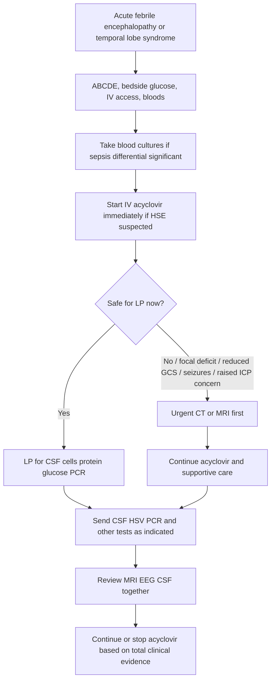
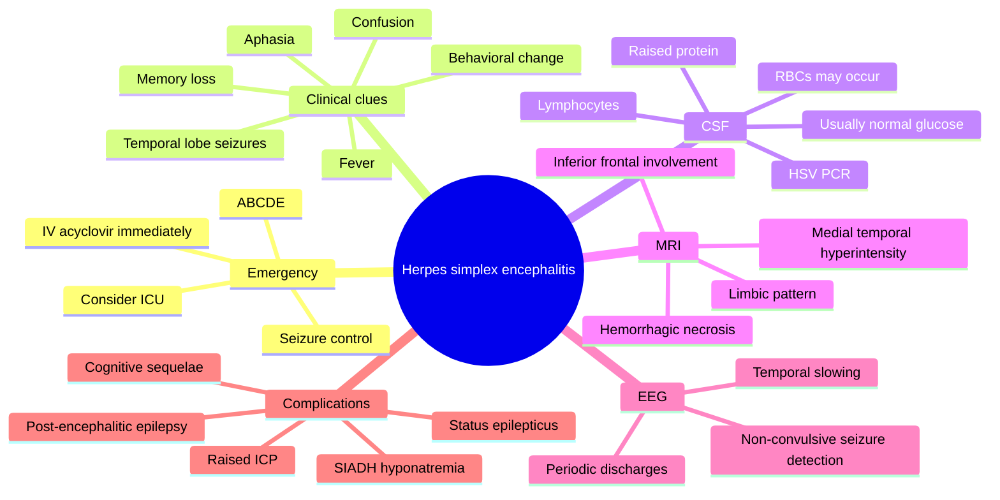

# Herpes simplex encephalitis

Related: [[../Neurology MOC|Neurology MOC]] · [[../Parenchymal Viral Infections|Parenchymal Viral Infections]] · [[Encephalitis syndromes|Encephalitis syndromes]] · [[Emergency treatment principles in viral encephalitis|Emergency treatment principles in viral encephalitis]] · [[../Epilepsy/Status epilepticus|Status epilepticus]]

> [!important]
> **Herpes simplex encephalitis (HSE) is a neurological emergency.** If suspected, **start IV acyclovir immediately** after urgent blood tests and while arranging LP/imaging as appropriate. Do **not** wait for PCR confirmation.

> [!tip]
> **Davidson Chapter 28 boundary preserved:** this note focuses on the **neurological syndrome, investigation logic, imaging/EEG/CSF interpretation, emergency treatment, and complications** of HSE. It does not drift into broad infectious disease virology beyond what FCPS/MRCP candidates need for bedside neurology and acute medicine.

## Learning Objectives
- Define herpes simplex encephalitis and explain why it is time-critical.
- Recognize typical temporal lobe and limbic presentations.
- Use a safe **CT/LP/acyclovir-first** emergency sequence.
- Interpret **CSF**, **MRI**, and **EEG** findings in suspected HSE.
- Distinguish HSE from mimics such as stroke, bacterial meningitis, autoimmune limbic encephalitis, and brain abscess.
- Manage complications including seizures, raised ICP, SIADH-related hyponatremia, and cognitive sequelae.

## Definition
**Herpes simplex encephalitis** is an acute or subacute **necrotizing viral encephalitis**, classically caused by **HSV-1** in adults, involving predominantly the **temporal lobes**, **inferior frontal lobes**, and **limbic structures**, producing fever, altered mental state, seizures, focal deficits, and characteristic CSF/MRI abnormalities.

## Why It Matters
Untreated HSE carries high mortality and major neurological morbidity due to:
- cerebral edema
- hemorrhagic necrosis of brain parenchyma
- seizures and status epilepticus
- memory impairment from mesial temporal involvement
- behavioral disturbance from limbic/frontal disease
- raised ICP and herniation in severe cases

**Exam pearl:** a confused febrile patient with **new seizures, aphasia, personality change, or temporal lobe signs** should be treated as possible HSE until proven otherwise.

## Relevant Anatomy and Physiology
### Neuroanatomy relevant to HSE
Using Gray's support:
- **Medial temporal lobe** structures, especially the **hippocampus** and adjacent limbic cortex, are important for **memory encoding**.
- **Amygdala/limbic circuits** influence emotion, fear, behavior, and autonomic responses.
- **Inferior frontal and orbitofrontal cortex** contribute to behavior, judgment, inhibition, and speech output in dominant hemisphere disease.
- Dominant temporal lobe involvement may produce:
  - dysphasia or aphasia
  - impaired verbal memory
  - complex partial/focal impaired-awareness seizures
- Non-dominant temporal involvement may produce:
  - behavioral change
  - affective disturbance
  - visuospatial/experiential seizure phenomena

### Physiology relevance
Using Guyton/Hall + Ganong + Davidson:
- Encephalitis causes **neuronal dysfunction**, inflammatory edema, and sometimes hemorrhagic necrosis.
- Cerebral inflammation can impair:
  - cortical electrical stability -> seizures
  - reticular/cortical function -> confusion and reduced consciousness
  - hypothalamic-neuroendocrine balance -> **SIADH and hyponatremia**
- Raised intracranial pressure reduces cerebral perfusion and may worsen secondary brain injury.

## Etiology and Virology
- **HSV-1** is the usual cause in adolescents and adults.
- **HSV-2** is more associated with neonatal infection and meningitic presentations, but can rarely cause encephalitis in adults.
- Disease may represent:
  - primary infection, or
  - reactivation of latent virus in trigeminal/other sensory pathways with spread to the brain

## Risk Factors / Contexts
HSE can occur in previously healthy adults, but risk is increased or diagnostic suspicion rises with:
- immunocompromise
- extremes of age
- prior HSV exposure or recurrence history, though this is often absent
- severe unexplained febrile encephalopathy
- new focal seizures or temporal lobe syndrome

## Pathophysiology
1. HSV reaches the CNS, probably via latent neural pathways or hematogenous spread in some cases.
2. Viral replication occurs within cerebral tissue, especially limbic/temporal regions.
3. This produces **focal hemorrhagic necrotizing inflammation**.
4. Consequences include:
   - cerebral edema
   - neuronal injury
   - focal seizures
   - altered consciousness
   - memory deficits
   - aphasia and behavioral change

## Clinical Features
### Core presentation
Typical adult HSE presents over hours to a few days with:
- **fever**
- **headache**
- **altered mental state**: confusion, agitation, drowsiness
- **seizures**, often focal or progressing to generalized seizures
- **focal neurological deficits**

### Temporal/limbic clues
- personality or behavioral change
- hallucinations or psychosis-like symptoms
- short-term memory impairment
- dysphasia/aphasia
- olfactory or experiential auras
- focal impaired-awareness seizures

### Examination findings
- reduced GCS or fluctuating mental state
- fever
- focal deficits, e.g. aphasia, hemiparesis
- meningism may be mild or absent
- signs of raised ICP in severe disease

### Clinical pattern that should trigger suspicion
Think HSE in any patient with:
- **acute febrile encephalopathy** plus
- **seizure**, **behavioral change**, **memory loss**, **aphasia**, or **temporal lobe imaging/EEG abnormalities**

## Red Flags
> [!danger]
> **Red flags requiring urgent senior/ICU-level involvement**
> - falling GCS or coma
> - recurrent or prolonged seizures / [[../Epilepsy/Status epilepticus|status epilepticus]]
> - focal deficit, especially aphasia or hemiparesis
> - signs of raised ICP or impending herniation
> - severe agitation needing airway-protective sedation
> - severe hyponatremia or autonomic instability
> - respiratory failure
> - shock or alternative sepsis source needing parallel treatment
> - immunocompromised patient with atypical imaging or broad differential

## Differential Diagnosis
- bacterial meningitis / meningoencephalitis
- other viral encephalitides
- autoimmune limbic encephalitis
- acute ischemic stroke involving temporal/frontal regions
- brain abscess
- intracerebral hemorrhage
- post-ictal state after focal seizures
- metabolic/toxic encephalopathy
- tuberculous meningoencephalitis depending on tempo

## Approach to the Suspected Case

## Acute Stabilization
### ABCDE priorities
1. **Airway**
   - protect airway if low GCS, refractory seizures, or severe agitation
2. **Breathing**
   - oxygen if hypoxic
   - monitor saturation and respiratory effort
3. **Circulation**
   - secure IV access
   - bloods including U&E, creatinine, FBC, CRP, LFTs
   - fluids if dehydrated or septic
4. **Disability**
   - GCS, pupils, focal deficits
   - bedside glucose
   - treat seizures promptly
5. **Exposure**
   - temperature, rash, trauma, alternative infection source

### Immediate practical steps
- send urgent blood tests including **renal function before ongoing acyclovir dosing**
- give **IV acyclovir without delay** if HSE is in the differential
- arrange **brain imaging** if focal signs, low GCS, seizures, or raised ICP concern before LP
- perform **LP as early as safely possible**
- involve neurology/acute medicine/ICU depending on severity

## Investigations
### Blood tests
- FBC
- CRP/ESR if useful
- U&E, **serum creatinine**, eGFR
- LFTs
- coagulation profile if LP planned
- paired serum glucose for CSF interpretation
- blood cultures if septic picture or bacterial meningoencephalitis remains possible
- HIV/immunocompromise workup when context suggests

### Neuroimaging
#### CT head
- Often normal early.
- May show:
  - temporal lobe low attenuation/edema
  - mass effect in advanced disease
  - alternative diagnoses
- CT is mainly useful for **LP safety assessment** and exclusion of gross structural lesions.

#### MRI brain: investigation of choice
MRI is **more sensitive than CT**, especially early.

Typical MRI features:
- **T2/FLAIR hyperintensity** in the **medial temporal lobes**
- involvement may extend to:
  - inferior frontal lobes
  - insula
  - cingulate/limbic regions
- diffusion restriction may be present early
- gyral swelling/edema
- hemorrhagic change in some cases
- often asymmetric, though bilateral disease can occur

### CSF examination
Usual CSF pattern in HSE:
- opening pressure: normal or mildly raised, sometimes raised
- WBC: **lymphocytic pleocytosis**
- protein: **moderately raised**
- glucose: usually **normal**
- red cells may be present due to **hemorrhagic necrosis**

### Virological confirmation
- **HSV PCR on CSF** is the key diagnostic test.
- PCR may be falsely negative **very early** in illness; if suspicion remains high, continue acyclovir and repeat LP/PCR after an interval according to clinical judgment/local guidance.

### EEG
EEG is supportive, especially when seizures/non-convulsive status are concerns.
Possible findings:
- focal temporal slowing
- epileptiform discharges
- periodic lateralized epileptiform discharges / periodic complexes, classically temporal
- generalized slowing if diffuse encephalopathy

## Interpretation Framework
### CSF interpretation in suspected HSE
| CSF feature | Typical in HSE | Comment |
|---|---|---|
| Opening pressure | Normal to mildly raised; may be raised | Severe disease can raise ICP |
| Cells | Lymphocytic pleocytosis | Early disease can occasionally be mixed |
| Protein | Moderately raised | Supports inflammation |
| Glucose | Usually normal | Low glucose suggests alternative/additional diagnosis |
| RBCs | May be present | Hemorrhagic temporal necrosis clue |
| HSV PCR | Positive | Most useful confirmatory test |

### MRI interpretation in suspected HSE
| MRI finding | Interpretation |
|---|---|
| Medial temporal FLAIR/T2 hyperintensity | Highly supportive of HSE in right clinical context |
| Inferior frontal/insular involvement | Strengthens classic pattern |
| Bilateral but asymmetric temporal disease | Common exam description |
| Hemorrhagic change | Supports necrotizing HSV process |
| Normal early MRI | Does not fully exclude early HSE |

### EEG interpretation in suspected HSE
| EEG finding | Meaning |
|---|---|
| Temporal periodic discharges | Classic supportive clue for HSE |
| Focal temporal slowing | Local cortical dysfunction |
| Epileptiform discharges | Seizure tendency / active irritative cortex |
| Diffuse slowing | Encephalopathy but non-specific |

### Putting CSF + MRI + EEG together
- **Best-fit HSE pattern** = febrile encephalopathy + temporal lobe syndrome + CSF lymphocytes/protein rise + MRI temporal hyperintensity + supportive EEG.
- **PCR negative but high suspicion** does not immediately exclude HSE, especially if LP was very early.
- **Normal glucose** helps distinguish HSE from many bacterial/TB patterns, but overlap exists.

## Diagnosis
### Practical diagnostic formulation
- **Suspected HSE**: acute encephalopathy with fever and temporal lobe features where emergency acyclovir is started.
- **Probable HSE**: typical clinical syndrome plus characteristic MRI/EEG/CSF findings.
- **Confirmed HSE**: supportive syndrome with **positive CSF HSV PCR**.

## Management
### Emergency treatment: acyclovir first
> [!important]
> **Start IV acyclovir immediately when HSE is suspected.** Delay worsens outcome.

### Antiviral treatment
- **IV acyclovir 10 mg/kg every 8 hours** is the standard adult emergency regimen in many exam settings.
- Dose should be **adjusted for renal function**.
- Ensure **adequate IV hydration** to reduce crystal nephropathy risk.
- Typical course is often **14–21 days**, depending on immune status, severity, and specialist advice.

### Key emergency prescribing principles
- use **actual institutional protocol** for dosing weight and renal adjustment
- review **creatinine/eGFR** daily or frequently in the acutely ill
- maintain hydration unless contraindicated
- avoid delay for MRI or PCR

### When to continue despite an initial negative PCR
Continue acyclovir if:
- classic temporal lobe syndrome is present
- MRI strongly suggests HSE
- EEG is supportive
- LP was performed very early
- the patient is deteriorating and no better explanation exists

### Seizure management
- treat active seizures with a benzodiazepine
- load an antiseizure medication if recurrent seizures or status epilepticus
- use EEG if non-convulsive seizures are suspected

### Raised ICP / neurocritical care management
- head-up positioning
- airway/ventilation support if needed
- avoid hypoxia and hypotension
- manage severe agitation safely
- urgent ICU/neurocritical input for coma, refractory seizures, or marked cerebral edema

### Supportive care
- fluids and electrolyte monitoring
- fever control
- nutrition and DVT prevention where appropriate
- swallow assessment if impaired consciousness
- pressure area and bladder/bowel care in prolonged illness

### If bacterial meningoencephalitis is also possible
In some patients the syndrome is initially unclear. A practical exam-safe approach is:
- start **IV acyclovir** for possible HSE
- also give empirical antibacterial therapy if bacterial meningitis/meningoencephalitis remains plausible
- refine treatment once CSF/imaging data return

## Special Situations
### Immunocompromised patient
- may have atypical imaging or broader differential
- lower threshold for MRI, broader microbiology, and specialist input
- prolonged therapy may be needed

### Pregnancy
- acyclovir is still generally used when maternal CNS HSV is suspected because untreated encephalitis is dangerous
- involve obstetric and infectious disease teams

### Early normal CSF or imaging
- early studies can be non-diagnostic
- if suspicion remains strong, **do not stop acyclovir prematurely**
- repeat evaluation may be needed

## Complications
### Acute complications
- focal or generalized seizures
- [[../Epilepsy/Status epilepticus|status epilepticus]]
- cerebral edema and raised ICP
- SIADH and hyponatremia
- aspiration pneumonia in reduced consciousness
- acute kidney injury from illness or acyclovir nephrotoxicity
- secondary nosocomial complications in ICU-level illness

### Neurological sequelae
- persistent memory impairment
- executive/behavioral disturbance
- aphasia or language deficits
- epilepsy after recovery
- personality change
- cognitive decline

## Prognosis
Outcome depends strongly on:
- **speed of acyclovir initiation**
- age and premorbid state
- level of consciousness at presentation
- seizure burden
- severity of MRI brain involvement

Poor prognostic markers include:
- delayed treatment
- coma
- extensive bilateral temporal/frontal disease
- refractory seizures

## FCPS/MRCP High-Yield Points
- HSE is the **most important treatable sporadic viral encephalitis** in adults.
- Adult disease is usually due to **HSV-1**.
- Classic syndrome: **fever + confusion + focal seizures + temporal lobe signs**.
- MRI is **more sensitive than CT**.
- CSF usually shows **lymphocytic pleocytosis, raised protein, normal glucose**.
- **RBCs in CSF** are a clue due to hemorrhagic necrosis.
- EEG may show **temporal periodic discharges**.
- **Start IV acyclovir immediately**; do not wait for PCR.
- Adjust acyclovir dose for **renal function** and ensure hydration.
- Memory and behavioral sequelae reflect **limbic/temporal injury**.

## Mind Map

## One-Page Summary
### Herpes simplex encephalitis in one page
**Definition:** acute necrotizing encephalitis, usually due to **HSV-1**, with predilection for **temporal and limbic regions**.

**When to suspect it:**
- fever + acute confusion
- focal seizures
- behavioral/personality change
- memory impairment
- aphasia
- temporal lobe signs on MRI or EEG

**Immediate action:**
- ABCDE
- bedside glucose
- bloods including renal function
- **start IV acyclovir immediately**
- arrange imaging if LP is unsafe
- perform LP early when safe

**Typical CSF:**
- lymphocytic pleocytosis
- raised protein
- glucose usually normal
- RBCs may be present
- **HSV PCR positive**

**Typical MRI:**
- medial temporal T2/FLAIR hyperintensity
- may involve inferior frontal and insular cortex
- edema, diffusion restriction, sometimes hemorrhage

**Typical EEG:**
- temporal slowing
- epileptiform activity
- periodic temporal discharges

**Main differentials:**
- bacterial meningoencephalitis
- autoimmune limbic encephalitis
- stroke
- brain abscess
- other viral encephalitis

**Treatment:**
- **IV acyclovir 10 mg/kg every 8 hours**, renal-adjusted
- maintain hydration
- treat seizures
- manage raised ICP
- consider antibacterial cover if bacterial meningoencephalitis cannot be excluded initially

**Complications:**
- status epilepticus
- cerebral edema
- SIADH hyponatremia
- memory and behavioral deficits
- post-encephalitic epilepsy

**Exam pearl:** if the stem says **fever + confusion + temporal lobe abnormality**, the next best step is usually **start IV acyclovir now**.

## MCQs
### Questions
1. The commonest cause of sporadic fatal viral encephalitis in adults that is treatable with prompt antiviral therapy is:
   - A. Varicella-zoster virus
   - B. HSV-1
   - C. CMV
   - D. EBV

2. A 36-year-old with fever, confusion, focal seizures, and aphasia most likely has involvement of the:
   - A. Cerebellum
   - B. Occipital lobe
   - C. Temporal lobe
   - D. Spinal cord

3. The most appropriate immediate management when HSE is strongly suspected is:
   - A. Wait for CSF PCR before treatment
   - B. Start oral acyclovir after CT
   - C. Start IV acyclovir immediately
   - D. Give steroids alone

4. The typical CSF glucose in HSE is:
   - A. Markedly low in all cases
   - B. Usually normal
   - C. Always zero
   - D. Higher than plasma

5. A helpful CSF clue favoring HSE over many other viral causes is:
   - A. Eosinophils
   - B. Malignant cells
   - C. Red blood cells due to hemorrhagic necrosis
   - D. Very high lactate only

6. The most sensitive imaging modality for early HSE is:
   - A. Skull X-ray
   - B. CT angiography only
   - C. MRI brain
   - D. Carotid Doppler

7. The EEG finding classically associated with HSE is:
   - A. Generalized 3-Hz spike-wave only
   - B. Temporal periodic discharges
   - C. Normal alpha rhythm only
   - D. Pure beta excess from anxiety

8. Which lobe predilection best characterizes HSE?
   - A. Parietal
   - B. Temporal
   - C. Cerebellar
   - D. Brainstem only

9. Acyclovir toxicity risk is most reduced by:
   - A. Fluid restriction
   - B. Avoiding renal monitoring
   - C. Adequate hydration and renal dose adjustment
   - D. Giving it once weekly

10. A major long-term sequela of HSE due to medial temporal injury is:
   - A. Isolated lower motor neuron facial palsy only
   - B. Memory impairment
   - C. Cataract
   - D. Peripheral neuropathy alone

## MCQ Answer Key
1. **B** — HSV-1 is the classic cause of adult sporadic treatable viral encephalitis.
2. **C** — Temporal lobe involvement explains seizures, aphasia, and memory/behavior change.
3. **C** — Do not wait for confirmatory PCR.
4. **B** — CSF glucose is usually normal in HSE.
5. **C** — RBCs may appear because the process is hemorrhagic/necrotizing.
6. **C** — MRI is more sensitive than CT.
7. **B** — Temporal periodic discharges are a classic supportive EEG clue.
8. **B** — Temporal lobe predilection is the hallmark.
9. **C** — Hydration and renal adjustment are key safety measures.
10. **B** — Memory dysfunction is common after temporal/hippocampal injury.

## SBAs
### Questions
1. A 29-year-old man develops fever, confusion, bizarre behavior, and a focal seizure. CT head is normal. The best next step is:
   - A. Reassure because CT is normal
   - B. Start IV acyclovir
   - C. Wait for EEG before treatment
   - D. Schedule outpatient MRI
   - E. Start aspirin for possible TIA

2. A patient with suspected HSE undergoes LP. Which CSF profile is most typical?
   - A. Neutrophils high, glucose very low, protein very high
   - B. Lymphocytic pleocytosis, raised protein, usually normal glucose
   - C. Acellular fluid with absent protein
   - D. Eosinophilic pleocytosis with high glucose
   - E. Xanthochromia only

3. MRI in HSE most classically shows:
   - A. Isolated occipital white matter plaques
   - B. Bilateral symmetric basal ganglia calcification
   - C. Medial temporal lobe FLAIR hyperintensity
   - D. Pure cerebellar atrophy
   - E. Extradural collection

4. In a patient with fever, aphasia, and temporal lobe abnormalities, the investigation that most directly confirms HSV etiology is:
   - A. Serum sodium
   - B. CSF HSV PCR
   - C. Nerve conduction study
   - D. ESR only
   - E. Plain skull radiograph

5. A 64-year-old woman with suspected HSE is started on acyclovir. Which monitoring point is most important for safe ongoing dosing?
   - A. Serum uric acid only
   - B. Creatinine/renal function
   - C. CK-MB
   - D. Amylase only
   - E. Fasting lipids

6. A patient remains highly suspicious for HSE clinically, but very early CSF HSV PCR is negative. The best approach is:
   - A. Stop acyclovir immediately
   - B. Discharge because PCR excludes disease
   - C. Continue acyclovir and reassess/repeat testing if needed
   - D. Change to oral antibiotics only
   - E. Diagnose migraine

7. Which feature most strongly supports temporal lobe dysfunction in HSE?
   - A. Resting tremor
   - B. Memory loss and behavioral change
   - C. Distal glove-and-stocking sensory loss
   - D. Ascending weakness
   - E. Bitemporal hemianopia

8. Which complication is particularly important in severe HSE?
   - A. Achalasia
   - B. Status epilepticus
   - C. Nephrotic syndrome
   - D. Thyrotoxicosis
   - E. Myasthenic crisis

9. If LP is temporarily unsafe because of reduced consciousness and focal deficits, the most appropriate action is:
   - A. Withhold treatment until LP is done
   - B. Start IV acyclovir and obtain urgent neuroimaging
   - C. Give only paracetamol
   - D. Wait 48 hours then review
   - E. Perform LP despite contraindications

10. Which statement best explains why HSE often causes memory impairment?
   - A. It selectively destroys anterior horn cells
   - B. It commonly involves hippocampal and limbic structures
   - C. It causes isolated optic neuritis
   - D. It primarily damages peripheral nerves
   - E. It affects neuromuscular junctions

## SBA Answer Key
1. **B** — A normal CT does not exclude early HSE; acyclovir should not wait.
2. **B** — This is the classic CSF pattern.
3. **C** — Medial temporal hyperintensity is the signature MRI pattern.
4. **B** — CSF HSV PCR is the direct confirmatory test.
5. **B** — Renal monitoring is essential because acyclovir is nephrotoxic if not adjusted/hydrated.
6. **C** — Early false-negative PCR can occur.
7. **B** — Limbic/temporal involvement causes memory and behavioral changes.
8. **B** — Status epilepticus is a major acute neurological complication.
9. **B** — Treat first, image urgently, LP later when safe.
10. **B** — Hippocampal/limbic injury explains memory deficits.

## Flashcards
### Core flashcards
- **Q:** What is the most important immediate treatment in suspected HSE?  
  **A:** Start **IV acyclovir immediately**.

- **Q:** Which HSV type most commonly causes adult HSE?  
  **A:** **HSV-1**.

- **Q:** Which brain region is classically involved in HSE?  
  **A:** **Temporal lobe**, especially medial temporal/limbic structures.

- **Q:** What is the typical CSF cell pattern in HSE?  
  **A:** **Lymphocytic pleocytosis**.

- **Q:** What happens to CSF glucose in typical HSE?  
  **A:** It is **usually normal**.

- **Q:** Why might RBCs be seen in CSF in HSE?  
  **A:** Because HSE causes **hemorrhagic necrotizing encephalitis**.

- **Q:** Which imaging test is most sensitive for HSE?  
  **A:** **MRI brain**.

- **Q:** Which EEG finding is a classic clue for HSE?  
  **A:** **Temporal periodic discharges**.

- **Q:** Name two prominent clinical clues to temporal lobe involvement.  
  **A:** **Memory impairment** and **behavioral/personality change**.

- **Q:** What major dose-related safety issue must be considered with acyclovir?  
  **A:** **Renal impairment/nephrotoxicity**, so dose-adjust and hydrate.

- **Q:** Does a negative very early CSF HSV PCR always exclude HSE?  
  **A:** **No**.

- **Q:** Name one major long-term neurological sequela of HSE.  
  **A:** **Memory deficit**, epilepsy, or behavioral change.

## Rapid Review Checklist
- [ ] Recognized as **neurological emergency**
- [ ] **IV acyclovir started immediately**
- [ ] Renal function checked and hydration planned
- [ ] LP performed early when safe
- [ ] CSF sent for **HSV PCR**
- [ ] MRI reviewed for **temporal lobe changes**
- [ ] EEG considered if seizures/non-convulsive status suspected
- [ ] Complications screened: seizures, raised ICP, SIADH, AKI
- [ ] Long-term cognitive and seizure sequelae anticipated
